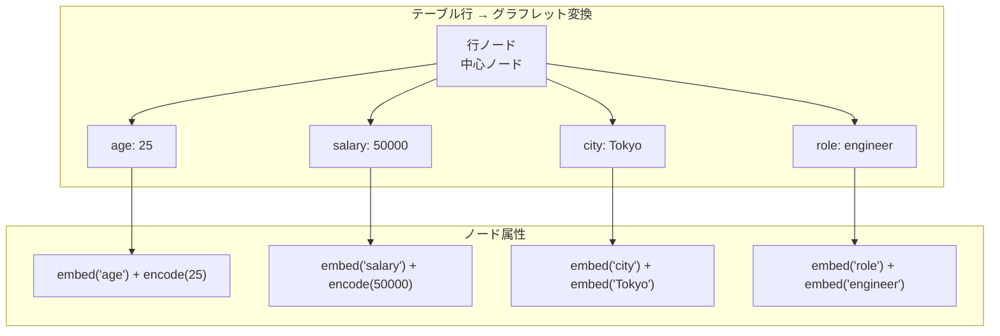

本記事は [arXiv:2402.16785 "CARTE: Pretraining and Transfer for Tabular Learning"](https://arxiv.org/abs/2402.16785) の解説記事です。

## 論文概要（Abstract）

CARTE（Context Aware Representation of Table Entries）は、テーブルデータの各行をグラフ構造（グラフレット）に変換し、カラム名と値のセマンティクスをグラフアテンションネットワーク（GAT）で学習するフレームワークである。著者らは、CARTEがスキーマの異なる複数のテーブル間での転移学習を可能にし、50以上のOpenMLデータセットにおいてXGBoost等のベースラインに対して有意な改善を達成したと報告している。

この記事は [Zenn記事: テーブルデータ基盤モデル2026年最前線](https://zenn.dev/0h_n0/articles/3f66d81be74e2a) の深掘りです。

## 情報源

- **arXiv ID**: 2402.16785
- **URL**: [https://arxiv.org/abs/2402.16785](https://arxiv.org/abs/2402.16785)
- **著者**: MyungHak Kim, Léo Grinsztajn, Gaël Varoquaux（INRIA Soda チーム）
- **発表年**: 2024年2月
- **分野**: cs.LG

## 背景と動機（Background & Motivation）

テーブルデータの基盤モデルにおける最大の課題の一つは、**スキーマの多様性**である。NLPではテキストを共通のトークン空間にマッピングでき、画像認識ではピクセル配列という共通構造がある。しかしテーブルデータでは、データセットごとにカラム数、カラム名、データ型が異なるため、共通の表現空間を構築することが困難であった。

従来のICL型アプローチ（TabPFN, TabICL）は、この問題を「テスト時に学習データ全体をコンテキストとして入力する」ことで回避している。しかしこのアプローチでは、異なるデータセット間で学習した知識を転移することが難しい。

CARTEは、テーブルデータのメタデータ（カラム名）を言語モデルで埋め込み、各行をグラフ構造に変換することで、**スキーママッチングなしの異種テーブル間転移学習**を実現した。

## 主要な貢献（Key Contributions）

著者らが報告する主要な貢献は以下のとおりである。

- **貢献1**: テーブル行をグラフレット（小グラフ）に変換する手法を提案。カラム名をノードとし、値をエッジ属性として表現する
- **貢献2**: カラム名の文字列埋め込みによるオープンボキャブラリの実現。事前に見たことのないカラム名でも処理可能
- **貢献3**: 50以上のOpenMLデータセットでの評価において、XGBoost等に対して有意な改善を報告
- **貢献4**: 異種テーブル間での転移学習を実証。事前学習済みCARTEが未知のスキーマのテーブルに適用可能であることを示した

## 技術的詳細（Technical Details）

### グラフレット変換

CARTEの核心は、テーブルの各行を**グラフレット**（小さなスター型グラフ）に変換する処理である。



具体的なグラフレット構築プロセスは以下のとおりである。

テーブルの行 $r = \{(c_1, v_1), (c_2, v_2), \ldots, (c_D, v_D)\}$ が与えられたとき（$c_j$はカラム名、$v_j$はその行の値）、以下のグラフ $G_r = (V, E)$ を構築する。

$$
V = \{r_{\text{center}}\} \cup \{n_1, n_2, \ldots, n_D\}
$$

$$
E = \{(r_{\text{center}}, n_j) \mid j = 1, \ldots, D\}
$$

各ノード $n_j$ の属性ベクトルは、カラム名の埋め込みと値のエンコーディングを結合して構築する。

$$
h_j^{(0)} = \text{LM}(c_j) \oplus \text{Enc}(v_j)
$$

ここで、
- $\text{LM}(c_j)$: 言語モデル（fastText等）によるカラム名 $c_j$ の埋め込みベクトル
- $\text{Enc}(v_j)$: 値 $v_j$ のエンコーディング（数値の場合は正規化、カテゴリカルの場合はfastText埋め込み）
- $\oplus$: ベクトルの結合（concatenation）

### グラフアテンションネットワーク（GAT）

グラフレットに変換された各行は、Graph Attention Network（GAT）で処理される。

$$
h_j^{(\ell+1)} = \sigma\left(\sum_{k \in \mathcal{N}(j)} \alpha_{jk}^{(\ell)} W^{(\ell)} h_k^{(\ell)}\right)
$$

ここで、
- $h_j^{(\ell)}$: ノード $j$ の $\ell$ 層目の表現ベクトル
- $\mathcal{N}(j)$: ノード $j$ の近傍ノード集合
- $\alpha_{jk}^{(\ell)}$: ノード $j$ と $k$ 間のアテンション重み
- $W^{(\ell)}$: $\ell$ 層目の学習可能な重み行列
- $\sigma$: 活性化関数（ELU）

アテンション重みは以下で計算される。

$$
\alpha_{jk}^{(\ell)} = \frac{\exp\left(\text{LeakyReLU}\left(a^{(\ell)T} [W^{(\ell)} h_j^{(\ell)} \| W^{(\ell)} h_k^{(\ell)}]\right)\right)}{\sum_{k' \in \mathcal{N}(j)} \exp\left(\text{LeakyReLU}\left(a^{(\ell)T} [W^{(\ell)} h_j^{(\ell)} \| W^{(\ell)} h_{k'}^{(\ell)}]\right)\right)}
$$

ここで $a^{(\ell)}$ はアテンション係数の学習可能パラメータ、$\|$ はベクトルの結合を表す。

最終的な行の表現は、中心ノードの表現 $h_{r_{\text{center}}}^{(L)}$ を使用する（$L$は層数）。

### 事前学習と転移学習

CARTEの事前学習は、複数のOpenMLデータセットを使用した**マルチタスク学習**で行われる。

```python
import torch
import torch.nn as nn
from typing import Optional

class CARTEModel(nn.Module):
    """CARTE: Context Aware Representation of Table Entries

    テーブル行をグラフレットに変換し、
    GATで処理するモデル。
    """
    def __init__(
        self,
        embed_dim: int = 768,
        gat_layers: int = 3,
        gat_heads: int = 4,
        hidden_dim: int = 256,
    ):
        super().__init__()
        self.column_embedder = ColumnEmbedder(embed_dim)
        self.value_encoder = ValueEncoder(embed_dim)
        self.gat = GATEncoder(
            in_dim=embed_dim * 2,
            hidden_dim=hidden_dim,
            n_layers=gat_layers,
            n_heads=gat_heads,
        )
        self.classifier = nn.Linear(hidden_dim, 1)

    def forward(
        self,
        column_names: list[str],
        values: torch.Tensor,
        value_types: list[str],
    ) -> torch.Tensor:
        """テーブル行の予測

        Args:
            column_names: カラム名リスト
            values: 値テンソル (batch_size, n_columns)
            value_types: 各カラムのデータ型

        Returns:
            predictions: 予測値 (batch_size,)
        """
        # Step 1: カラム名を埋め込み
        col_embeds = self.column_embedder(column_names)

        # Step 2: 値をエンコード
        val_embeds = self.value_encoder(values, value_types)

        # Step 3: グラフレット構築（カラム埋め込み + 値エンコード）
        node_features = torch.cat([col_embeds, val_embeds], dim=-1)

        # Step 4: GAT処理
        row_repr = self.gat(node_features)  # 中心ノード表現

        # Step 5: 予測
        return self.classifier(row_repr)
```

転移学習のプロセスは以下のとおりである。

1. **事前学習**: 複数のOpenMLデータセットでGATの重みを学習
2. **転移**: 新しいデータセットが与えられた際、カラム名の埋め込みにより自動的にノード表現が構築される。スキーママッチングは不要
3. **微調整**: 新しいデータセットで予測ヘッドのみを微調整（数エポック）

### オープンボキャブラリの仕組み

CARTEの重要な特徴は、**事前に見たことのないカラム名でも処理可能**である点である。これは、カラム名をfastText等の事前学習済み言語モデルで埋め込むことで実現されている。

例えば、事前学習時に「age」カラムを含むデータセットで学習した場合、テスト時に「年齢」「patient_age」「Age_of_person」等の異なる名前のカラムが出現しても、言語モデルの埋め込み空間でのセマンティクス的近さにより適切に処理される。

## 実装のポイント（Implementation）

### 基本的な使用方法

```python
# CARTEの基本使用例（概念コード）
# pip install carte-ai
from carte import CARTEClassifier
from sklearn.model_selection import cross_val_score

# データ読み込み（カラム名がセマンティクスを持つデータ）
import pandas as pd
data = pd.read_csv("medical_records.csv")
X = data.drop("diagnosis", axis=1)
y = data["diagnosis"]

# CARTEで分類
clf = CARTEClassifier(pretrained=True)
scores = cross_val_score(clf, X, y, cv=5, scoring="accuracy")
print(f"Accuracy: {scores.mean():.4f} (+/- {scores.std():.4f})")
```

### CARTEが有効なデータの特徴

| データ特性 | CARTEの有効性 | 理由 |
|-----------|-------------|------|
| カラム名が意味を持つ | 高 | 言語モデル埋め込みが効果的 |
| テキスト列が混在 | 高 | fastText埋め込みで統合処理可能 |
| 数値のみのテーブル | 中〜低 | カラム名情報の恩恵が限定的 |
| カラム数が少ない（<10） | 中 | グラフ構造の情報量が少ない |
| 異種テーブル転移学習 | 高 | CARTEの主要ユースケース |

### 注意点

- **グラフ変換のオーバーヘッド**: 各行をグラフに変換する処理コストがある。大規模データセットでは推論時間がICL型（TabPFN, TabICL）より長くなる可能性がある
- **言語モデル依存**: カラム名の品質（記述性）がモデルの精度に直接影響する。「col_1」「feature_2」等の無意味なカラム名では効果が大幅に低下する
- **事前学習データの偏り**: 事前学習に使用されたOpenMLデータセットの分布に偏りがある場合、特定のドメインで汎化性能が低下する可能性がある

## 実験結果（Results）

### OpenMLデータセットでの評価

著者らの報告によると、50以上のOpenMLデータセットでの評価結果は以下のとおりである。

| 比較対象 | CARTEの結果（著者ら報告） |
|---------|----------------------|
| vs XGBoost（デフォルト） | 有意に改善 |
| vs Random Forest | 有意に改善 |
| vs MLP（微調整） | 同等〜改善 |
| vs TabPFN v1 | データセット依存 |

特にカラム名に豊富なドメイン知識が含まれるデータセット（医療データ、金融データ等）で改善幅が大きかったと報告されている。

### 転移学習の効果

著者らは、事前学習なし（ランダム初期化）と事前学習ありの比較も報告している。事前学習済みCARTEは、特にサンプル数が少ないデータセット（数百行）で大きな改善を示したとされる。

### 制約事項

- 大規模データセットでは、ICL型（TabPFN, TabICL）やGBDTと比較して推論コストが高い
- カラム名が無意味（col_1, feature_0等）なデータセットでは効果が限定的
- 事前学習済みモデルの再現性検証が限定的（著者ら自身による評価が中心）

## 実運用への応用（Practical Applications）

CARTEは以下の場面で特に有効と考えられる。

- **異種テーブルの統合分析**: 異なるシステムから収集されたテーブルデータを統合して分析する場面（例: 複数の医療機関のデータ統合）
- **カラム名に意味がある業務データ**: 検査項目名、金融指標名等、カラム名自体がドメイン知識を含むデータセット
- **少量データでの予測**: 数百行程度の小規模データセットで、事前学習の恩恵を受ける場面

一方、数値特徴量のみの大規模データセットや、リアルタイム推論が必要な場面ではTabPFN v2やXGBoostが適している。

## 関連研究（Related Work）

- **TabPFN v2**（Hollmann et al., 2024, arXiv:2511.08667）: ICL型のアプローチ。CARTEのグラフ表現とは異なり、全学習データをコンテキストとして入力する
- **XTab**（Zhu et al., 2023, ICML 2023）: クロステーブル事前学習を行うTransformerベースのモデル。CARTEとは事前学習の方法が異なる
- **TARTE**（arXiv:2505.14415）: セマンティック知識を活用した事前学習。CARTEの方向性を発展させた手法

## まとめと今後の展望

CARTEは、テーブルデータの各行をグラフ構造に変換し、カラム名のセマンティクスを活用するという独自のアプローチでテーブル転移学習を実現した。ICL型（TabPFN, TabICL）とは相補的な関係にあり、特にカラム名に意味がある異種テーブルの統合分析において強みを発揮する。

今後は、グラフ表現のスケーラビリティ改善、より大規模な事前学習データでの学習、ICL型モデルとの組み合わせによるアンサンブル手法が研究方向として期待される。

## 参考文献

- **arXiv**: [https://arxiv.org/abs/2402.16785](https://arxiv.org/abs/2402.16785)
- **Code**: [https://github.com/soda-inria/carte](https://github.com/soda-inria/carte)
- **Related Zenn article**: [https://zenn.dev/0h_n0/articles/3f66d81be74e2a](https://zenn.dev/0h_n0/articles/3f66d81be74e2a)
