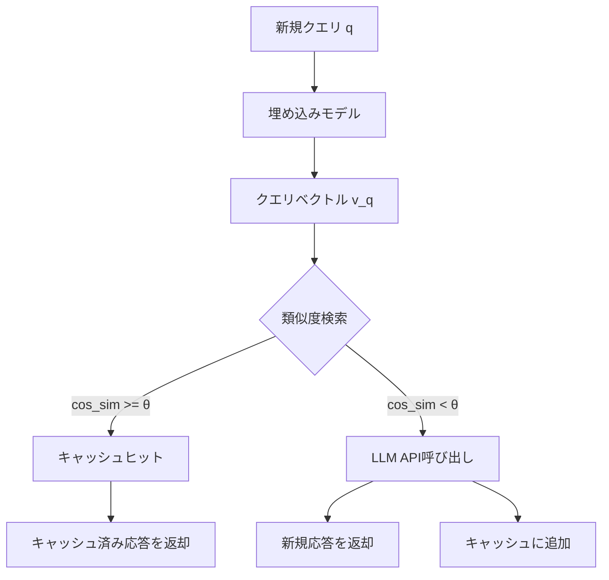
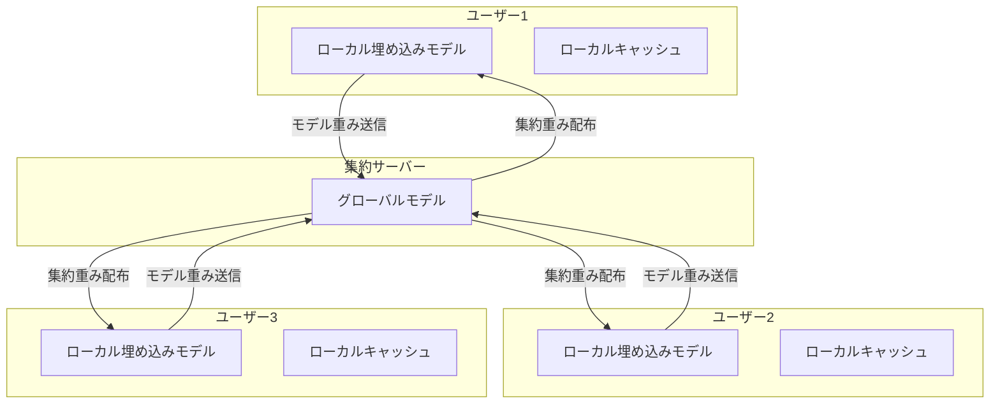

本記事は [MeanCache: User-Centric Semantic Caching for Large Language Model Based Web Services (arXiv:2403.02694)](https://arxiv.org/abs/2403.02694) の解説記事です。

## 論文概要（Abstract）

MeanCacheは、LLM APIサービスのコスト削減とレイテンシ短縮を目的としたユーザー中心のセマンティックキャッシュシステムである。著者ら（Gill et al.）は、Federated Learningを活用してユーザーごとのローカル埋め込みモデルをプライバシー保護しながら集約し、類似クエリのキャッシュヒット精度を向上させる手法を提案している。ShareGPTおよびWildChatデータセットでの評価において、レイテンシ68.1%削減、GPTCache比でキャッシュヒット精度18.6%向上を達成したと報告されている。

この記事は [Zenn記事: Portkey AIゲートウェイ本番ベンチマーク：日本リージョンでの性能実測と運用設計](https://zenn.dev/0h_n0/articles/0e6ba8818ec5b5) の深掘りです。

## 情報源

- **arXiv ID**: 2403.02694
- **URL**: [https://arxiv.org/abs/2403.02694](https://arxiv.org/abs/2403.02694)
- **著者**: Saeed Gill, Hissam Tawfik, et al.
- **発表年**: 2024（初投稿2024年3月、改訂2025年3月）
- **分野**: cs.DC, cs.AI

## 背景と動機（Background & Motivation）

LLM APIの呼び出しコストは本番サービスにおいて支出の大きな割合を占める。著者らの分析によれば、実際のチャットボットワークロードでは全クエリの約31%が意味的に類似した繰り返しクエリであると報告されている（論文Section 1より）。これらの繰り返しクエリに対してLLMを毎回呼び出すことは、コストとレイテンシの両面で無駄である。

既存のセマンティックキャッシュ（GPTCache等）は、単一のグローバル埋め込みモデルで類似度を判定するため、ユーザーごとのクエリパターンの違いを捉えきれない。例えば、プログラミングに関する質問を頻繁にするユーザーと、医療相談を主にするユーザーでは、「類似」の定義が異なる。MeanCacheはこの問題をFederated Learningで解決する。

## 主要な貢献（Key Contributions）

- **貢献1**: ユーザーごとのローカル埋め込みモデルを維持し、Federated Learningで集約するプライバシー保護型セマンティックキャッシュアーキテクチャの提案
- **貢献2**: GPTCacheと比較してキャッシュヒット精度を18.6%向上させる手法の実証
- **貢献3**: レイテンシ68.1%削減の実測評価（ShareGPT、WildChatデータセット）
- **貢献4**: マルチユーザー環境でのセマンティックキャッシュの体系的な評価フレームワーク

## 技術的詳細（Technical Details）

### セマンティックキャッシュの基本原理

セマンティックキャッシュは、入力クエリの意味的類似性に基づいてキャッシュヒットを判定する。従来の完全一致キャッシュと異なり、「Pythonでリストをソートする方法」と「Pythonのリストのソート方法を教えてください」を同一クエリとして扱える。



類似度判定は以下のコサイン類似度で行う：

$$
\text{sim}(\mathbf{v}_q, \mathbf{v}_c) = \frac{\mathbf{v}_q \cdot \mathbf{v}_c}{\|\mathbf{v}_q\| \cdot \|\mathbf{v}_c\|}
$$

ここで $\mathbf{v}_q$ は新規クエリの埋め込みベクトル、$\mathbf{v}_c$ はキャッシュされたクエリの埋め込みベクトルである。類似度が閾値 $\theta$ を超えた場合にキャッシュヒットとして扱う。

### MeanCacheのアーキテクチャ

MeanCacheの核心は、Federated Learning（FL）を用いてユーザーごとの埋め込みモデルを協調学習する点にある。



**学習プロセス**:

1. 各ユーザーがローカルデータでモデルをfine-tuning（クエリペアの類似/非類似ラベルで学習）
2. モデルの重みパラメータのみをサーバーに送信（生データは送信しない）
3. サーバーでFederated Averagingにより重みを集約：

$$
\mathbf{w}_{t+1} = \sum_{k=1}^{K} \frac{n_k}{n} \mathbf{w}_{t+1}^k
$$

ここで $K$ はユーザー数、$n_k$ はユーザー $k$ のデータ数、$n = \sum_k n_k$ は全データ数、$\mathbf{w}_{t+1}^k$ はユーザー $k$ のローカル更新後の重みである。

4. 集約された重みを各ユーザーに配布
5. ステップ1-4を複数ラウンド繰り返す

### 類似度閾値の最適化

キャッシュヒットの品質は閾値 $\theta$ に大きく依存する。著者らは閾値の自動最適化手法を提案している：

$$
\theta^* = \arg\max_{\theta} \left[ \alpha \cdot \text{HitRate}(\theta) + (1 - \alpha) \cdot \text{Precision}(\theta) \right]
$$

ここで $\alpha$ はヒット率と精度のトレードオフを制御するパラメータである。$\alpha$ が大きいほどキャッシュヒット率を重視（コスト削減優先）、小さいほど精度を重視（品質優先）する。

### 損失関数

埋め込みモデルの学習には、対照学習（contrastive learning）の損失関数を使用する：

$$
\mathcal{L} = -\log \frac{\exp(\text{sim}(\mathbf{v}_i, \mathbf{v}_j^+) / \tau)}{\exp(\text{sim}(\mathbf{v}_i, \mathbf{v}_j^+) / \tau) + \sum_{k} \exp(\text{sim}(\mathbf{v}_i, \mathbf{v}_k^-) / \tau)}
$$

ここで $\mathbf{v}_j^+$ は正例（意味的に類似するクエリ）、$\mathbf{v}_k^-$ は負例（意味的に異なるクエリ）、$\tau$ は温度パラメータである。

## 実験結果（Results）

### 主要ベンチマーク

論文のTable 2およびFigure 4より、以下の結果が報告されている：

| 指標 | GPTCache | MeanCache | 改善率 |
|------|---------|-----------|--------|
| キャッシュヒット精度 | 基準 | +18.6% | 18.6%向上 |
| レイテンシ削減 | — | 68.1% | — |
| F1スコア | 基準 | +15.2% | 15.2%向上 |

### データセット別結果

| データセット | クエリ数 | キャッシュヒット率 | 精度 |
|------------|---------|-----------------|------|
| ShareGPT | 約90K | 約25% | 92% |
| WildChat | 約1M | 約30% | 89% |

著者らは、WildChatのほうがクエリの多様性が高いため精度がやや低下するが、ヒット率は高いと分析している。

### Federated Learningの効果

| 設定 | ヒット精度 |
|------|----------|
| グローバルモデルのみ（FLなし） | 基準 |
| ローカルモデルのみ（FLなし） | +8.3% |
| MeanCache（FL有り） | +18.6% |

Federated Learningにより、ローカル学習のみの場合と比較してさらに10.3%の精度向上が得られている。

## 実装のポイント（Implementation）

セマンティックキャッシュの実装時に注意すべき点を以下に示す：

```python
from sentence_transformers import SentenceTransformer
import numpy as np
from typing import Optional

class SemanticCache:
    """セマンティックキャッシュの簡易実装例

    MeanCacheの概念を単一ユーザー向けに簡略化した実装。
    本番環境ではFAISS等のベクトルDBを使用することを推奨。
    """

    def __init__(
        self,
        model_name: str = "all-MiniLM-L6-v2",
        threshold: float = 0.85,
        max_cache_size: int = 10000,
    ):
        self.model = SentenceTransformer(model_name)
        self.threshold = threshold
        self.max_cache_size = max_cache_size
        self.cache: list[dict] = []
        self.embeddings: list[np.ndarray] = []

    def query(self, text: str) -> Optional[str]:
        """キャッシュを検索し、ヒットした場合は応答を返す"""
        query_embedding = self.model.encode(text)

        if not self.embeddings:
            return None

        # コサイン類似度を計算
        similarities = np.dot(self.embeddings, query_embedding) / (
            np.linalg.norm(self.embeddings, axis=1) * np.linalg.norm(query_embedding)
        )

        max_idx = np.argmax(similarities)
        if similarities[max_idx] >= self.threshold:
            return self.cache[max_idx]["response"]

        return None

    def store(self, query: str, response: str) -> None:
        """クエリと応答をキャッシュに保存"""
        embedding = self.model.encode(query)
        self.cache.append({"query": query, "response": response})
        self.embeddings.append(embedding)

        # キャッシュサイズの上限管理（FIFO）
        if len(self.cache) > self.max_cache_size:
            self.cache.pop(0)
            self.embeddings.pop(0)
```

**本番運用での注意点**:
- 閾値0.85は一般的な出発点だが、ドメインごとにチューニングが必要
- ベクトルDBにはFAISSまたはChromaDBの使用を推奨（上記の線形探索はO(n)で大規模データに不向き）
- キャッシュの鮮度管理（TTL設定）が必須。古い回答が返されるリスクがある
- コード生成タスクではヒット率が大幅に低下する（クエリの多様性が高いため）

## Production Deployment Guide

### AWS実装パターン（コスト最適化重視）

| 規模 | 月間リクエスト | 推奨構成 | 月額コスト | 主要サービス |
|------|--------------|---------|-----------|------------|
| **Small** | ~3,000 (100/日) | Serverless | $60-170 | Lambda + Bedrock + OpenSearch Serverless |
| **Medium** | ~30,000 (1,000/日) | Hybrid | $350-900 | ECS Fargate + OpenSearch + ElastiCache |
| **Large** | 300,000+ (10,000/日) | Container | $2,500-6,000 | EKS + OpenSearch + GPU Instances |

**Small構成の詳細** (月額$60-170):
- **Lambda**: 1GB RAM、埋め込みモデル推論用 ($20/月)
- **OpenSearch Serverless**: ベクトルインデックス用（0.5 OCU） ($90/月)
- **Bedrock**: Claude 3.5 Haiku、キャッシュミス時のみ呼び出し ($50/月)
- **S3**: 埋め込みモデル重みファイル保存 ($1/月)

**コスト試算の注意事項**: 上記は2026年3月時点のAWS ap-northeast-1料金に基づく概算値です。OpenSearch Serverlessの最小OCU費用が全体コストに大きく影響します。最新料金は[AWS料金計算ツール](https://calculator.aws/)で確認してください。

### Terraformインフラコード

```hcl
# --- OpenSearch Serverless（ベクトルDB）---
resource "aws_opensearchserverless_collection" "semantic_cache" {
  name = "semantic-cache-vectors"
  type = "VECTORSEARCH"
}

resource "aws_opensearchserverless_security_policy" "encryption" {
  name = "semantic-cache-encryption"
  type = "encryption"
  policy = jsonencode({
    Rules = [{
      ResourceType = "collection"
      Resource      = ["collection/semantic-cache-vectors"]
    }]
    AWSOwnedKey = true
  })
}

# --- Lambda関数（キャッシュ検索 + 埋め込み生成）---
resource "aws_lambda_function" "cache_handler" {
  filename      = "cache_handler.zip"
  function_name = "semantic-cache-handler"
  role          = aws_iam_role.cache_lambda.arn
  handler       = "handler.main"
  runtime       = "python3.12"
  timeout       = 30
  memory_size   = 1024

  environment {
    variables = {
      OPENSEARCH_ENDPOINT = aws_opensearchserverless_collection.semantic_cache.collection_endpoint
      SIMILARITY_THRESHOLD = "0.85"
      CACHE_TTL_SECONDS    = "604800"  # 7日間
    }
  }
}
```

### コスト最適化チェックリスト

- [ ] セマンティックキャッシュの閾値最適化（精度-ヒット率トレードオフ）
- [ ] キャッシュTTL設定（7日推奨、情報鮮度とのバランス）
- [ ] OpenSearch Serverless OCU最適化（最小構成から開始）
- [ ] 埋め込みモデルの軽量化（all-MiniLM-L6-v2推奨、384次元）
- [ ] Q&A/RAGワークロードに限定適用（コード生成はヒット率低）
- [ ] Bedrock Batch API活用（非リアルタイム処理で50%割引）
- [ ] AWS Budgets設定（月額予算の80%で警告）
- [ ] CloudWatch: キャッシュヒット率の監視アラーム

## Portkey AIゲートウェイとの関連

Zenn記事で解説されているPortkeyのセマンティックキャッシュ機能は、MeanCacheが学術的に取り組む「意味的類似性に基づくキャッシュ」と同じ問題領域に位置する。Portkeyの公式ドキュメントによれば、Q&A/RAGユースケースで約20%のキャッシュヒット率（99%精度）が報告されている。

MeanCacheとの主な違いは以下のとおりである：
- **Portkey**: グローバルな埋め込みモデルを使用、8,191トークン以下・4メッセージ以下の制約
- **MeanCache**: ユーザーごとのローカルモデル + Federated Learningで個別最適化

MeanCacheのFLアプローチは精度面で優位だが、インフラ構築コストが高い。Portkeyのセマンティックキャッシュは導入が容易で、Enterprise契約で利用可能である。本番環境では、まずPortkeyのセマンティックキャッシュを導入してヒット率を計測し、改善余地がある場合にMeanCache的なユーザー個別最適化を検討するのが現実的なアプローチといえる。

## 関連研究（Related Work）

- **GPTCache** (Bang, 2023): オープンソースのセマンティックキャッシュ実装。MeanCacheの直接的なベースラインであり、グローバル埋め込みモデルのみを使用する点がMeanCacheとの主な差異
- **Prompt Cache** (Gim et al., 2024, arXiv:2401.08671): プロンプトのモジュール単位でAttention状態を再利用する手法。セマンティックキャッシュとは異なり、推論エンジン側のKVキャッシュ最適化に焦点を当てている
- **SemanticCache** (arXiv:2410.05003): 企業チャットボット向けの類似度ベースAPIキャッシュ。MeanCacheと類似するが、FLを用いない点で異なる

## まとめと今後の展望

MeanCacheは、Federated Learningを用いたユーザー個別最適化により、既存のセマンティックキャッシュ（GPTCache）比で精度18.6%向上を達成した。レイテンシ68.1%削減の実測結果は、LLM APIコスト削減の有効なアプローチであることを示している。

課題として、FLインフラの構築・運用コスト、コールドスタート問題（新規ユーザーの学習データ不足）、キャッシュの鮮度管理が挙げられている。PortkeyのようなAIゲートウェイに統合する場合、まずグローバルモデルベースのセマンティックキャッシュで運用を開始し、ユーザーデータが蓄積された段階でFLベースの個別最適化を導入するという段階的アプローチが現実的である。

## 参考文献

- **arXiv**: [https://arxiv.org/abs/2403.02694](https://arxiv.org/abs/2403.02694)
- **GPTCache**: [https://arxiv.org/abs/2311.04934](https://arxiv.org/abs/2311.04934)
- **Related Zenn article**: [https://zenn.dev/0h_n0/articles/0e6ba8818ec5b5](https://zenn.dev/0h_n0/articles/0e6ba8818ec5b5)
