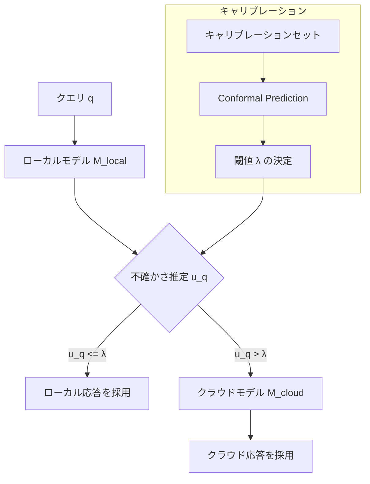

本記事は [Hybrid LLM: Cost-Efficient and Quality-Aware Query Routing (arXiv:2404.04080)](https://arxiv.org/abs/2404.04080) の解説記事です。

## 論文概要（Abstract）

Hybrid LLMは、ローカルに配置した小型LLM（例：Vicuna-7B）とクラウドの大型LLM API（例：GPT-4）の間でクエリを動的にルーティングするフレームワークである。著者ら（Ding et al.）は、Conformal Prediction（適合予測）を用いてルーティング判定に統計的な品質保証を付与する手法を提案している。WMT翻訳、HumanEval、MMLUのベンチマークにおいて、GPT-4呼び出しを40-50%削減しながら95%の品質カバレッジを達成したと報告されている。RouteLLMやFrugalGPTが経験的にコスト削減を実証するのに対し、Hybrid LLMは理論的な品質保証を提供する点で差別化されている。

この記事は [Zenn記事: Portkey AIゲートウェイ本番ベンチマーク：日本リージョンでの性能実測と運用設計](https://zenn.dev/0h_n0/articles/0e6ba8818ec5b5) の深掘りです。

## 情報源

- **arXiv ID**: 2404.04080
- **URL**: [https://arxiv.org/abs/2404.04080](https://arxiv.org/abs/2404.04080)
- **著者**: Dujian Ding, Ankur Mallick, Chi Wang, Robert Sim, Subhabrata Mukherjee, Victor Rühle, Laks V.S. Lakshmanan, Ahmed Hassan Awadallah
- **発表年**: 2024
- **分野**: cs.CL, cs.AI

## 背景と動機（Background & Motivation）

LLMルーティングの既存研究（FrugalGPT、RouteLLM等）は経験的にコスト削減を実証しているが、「ルーティング判定がどの程度信頼できるか」に対する理論的保証がない。本番環境では「99%のクエリで品質要件を満たす」といった確率的保証が求められる場面がある。

Hybrid LLMは、Conformal Prediction（CP）という統計的手法を導入し、ルーティング判定に有限サンプルの品質保証を付与する。これにより、「少なくとも $1-\alpha$ の確率で、ローカルモデルの回答品質がクラウドモデルと遜色ない」という保証の下でルーティング判定を行える。

## 主要な貢献（Key Contributions）

- **貢献1**: Conformal Predictionに基づく品質保証付きLLMルーティングの定式化。カバレッジパラメータ $\alpha$ で品質-コストトレードオフを制御
- **貢献2**: ローカル小モデル（Vicuna-7B等）の不確かさ推定を活用した効率的なルーティング判定
- **貢献3**: WMT翻訳、HumanEval（コード生成）、MMLU（多肢選択QA）の3ベンチマークでGPT-4呼び出し40-50%削減を実証
- **貢献4**: キャリブレーションセットのサイズと品質保証の関係の理論的分析

## 技術的詳細（Technical Details）

### Conformal Predictionの概要

Conformal Prediction（CP）は、点予測に加えて「予測集合」（prediction set）を構成し、真の値がその集合に含まれる確率を有限サンプルで保証する統計的手法である。

ルーティング問題では、以下の保証を提供する：

$$
P\left(\text{quality}(M_{\text{local}}(q)) \geq \tau\right) \geq 1 - \alpha
$$

ここで、
- $M_{\text{local}}(q)$: ローカルモデルのクエリ $q$ への応答
- $\tau$: 品質閾値
- $\alpha$: 許容誤り率（例：$\alpha = 0.05$ で95%カバレッジ）

この保証は、キャリブレーションデータと実テストデータが交換可能（exchangeable）であるという緩い仮定のみで成立する。

### ルーティングアルゴリズム



**ルーティング判定の手順**:

1. ローカルモデルがクエリに回答を生成する
2. 回答の不確かさスコア $u_q$ を計算する（モデルの出力確率分布から算出）
3. 不確かさが閾値 $\lambda$ 以下ならローカル回答を採用、超えればクラウドモデルに転送

### 不確かさスコアの計算

不確かさスコアは、ローカルモデルの出力確率分布から以下のように計算される：

$$
u_q = 1 - \max_{y} P(y \mid q; \theta_{\text{local}})
$$

ここで $P(y \mid q; \theta_{\text{local}})$ はローカルモデルのクエリ $q$ に対する出力 $y$ の確率である。最大確率が高い（モデルが自信を持っている）ほど不確かさが低くなる。

生成タスク（翻訳等）では、トークンレベルの確率の幾何平均を使用する：

$$
u_q = 1 - \left(\prod_{t=1}^{T} P(y_t \mid y_{<t}, q; \theta_{\text{local}})\right)^{1/T}
$$

ここで $T$ は生成されたトークン数、$y_t$ は $t$ 番目のトークンである。

### 閾値 $\lambda$ のキャリブレーション

Conformal Predictionに基づく閾値の決定手順：

1. キャリブレーションセット $\{(q_i, y_i^*)\}_{i=1}^{n}$ を用意する（$y_i^*$ は正解ラベル）
2. 各クエリでローカルモデルの不確かさスコア $u_i$ と品質スコア $s_i$ を計算する
3. 「ローカルモデルで品質が不十分だったケース」の不確かさスコアの $(1-\alpha)$分位点を閾値とする

$$
\lambda = \text{Quantile}_{1-\alpha}\left(\{u_i \mid s_i < \tau\}_{i=1}^{n}\right)
$$

この閾値により、新しいクエリに対して以下が保証される：

$$
P(\text{品質不十分なのにローカル採用}) \leq \alpha
$$

### 品質-コストトレードオフの制御

$\alpha$ を変化させることで、品質とコストのトレードオフを連続的に制御できる：

| $\alpha$ | 品質カバレッジ | クラウド呼び出し率 | コスト削減 |
|----------|-------------|----------------|----------|
| 0.01 | 99% | 高い | 小さい |
| 0.05 | 95% | 中程度 | 中程度 |
| 0.10 | 90% | 低い | 大きい |
| 0.20 | 80% | 最低 | 最大 |

## 実験結果（Results）

### ベンチマーク別結果

論文のTable 1およびFigure 2より、以下の結果が報告されている（$\alpha = 0.05$、95%カバレッジ）：

| ベンチマーク | GPT-4呼び出し削減率 | 品質カバレッジ | ローカルモデル |
|------------|-------------------|-------------|--------------|
| WMT翻訳 | 約50% | 95% | Vicuna-7B |
| HumanEval | 約40% | 95% | CodeLlama-7B |
| MMLU | 約45% | 95% | Vicuna-7B |

### RouteLLMとの比較

同じMMLUベンチマークにおいて：
- **RouteLLM (MF)**: 85%削減、品質99%（ただし統計的保証なし）
- **Hybrid LLM**: 45%削減、品質95%（統計的保証あり）

Hybrid LLMはRouteLLMより控えめな削減率だが、Conformal Predictionによる理論的保証がある点で差別化される。品質保証が厳格に求められる金融・医療等のドメインでは、Hybrid LLMのアプローチが適切である。

### キャリブレーションセットサイズの影響

著者らは、キャリブレーションセットのサイズが品質保証の信頼性に与える影響を分析している：

| キャリブレーションサイズ | カバレッジの安定性 |
|----------------------|-----------------|
| 100件 | 不安定（±5%のばらつき） |
| 500件 | 安定（±2%のばらつき） |
| 1,000件以上 | 高精度（±1%以下） |

著者らは500件以上のキャリブレーションデータを推奨している。

## 実装のポイント（Implementation）

Conformal Predictionに基づくルーティングの実装例：

```python
import numpy as np
from typing import Optional
from dataclasses import dataclass


@dataclass
class RoutingResult:
    """ルーティング結果"""
    response: str
    model_used: str  # "local" or "cloud"
    uncertainty: float
    threshold: float


class ConformalRouter:
    """Conformal Predictionベースのルーター

    キャリブレーションデータから閾値を決定し、
    統計的品質保証付きでルーティング判定を行う。
    """

    def __init__(self, alpha: float = 0.05):
        """
        Args:
            alpha: 許容誤り率（0.05 = 95%カバレッジ）
        """
        self.alpha = alpha
        self.threshold: Optional[float] = None

    def calibrate(
        self,
        uncertainties: list[float],
        quality_scores: list[float],
        quality_threshold: float,
    ) -> float:
        """キャリブレーションセットから閾値を決定

        Args:
            uncertainties: 各クエリの不確かさスコア
            quality_scores: 各クエリの品質スコア
            quality_threshold: 品質閾値

        Returns:
            決定された閾値 λ
        """
        # 品質不十分なケースの不確かさスコアを抽出
        failure_uncertainties = [
            u for u, s in zip(uncertainties, quality_scores)
            if s < quality_threshold
        ]

        if not failure_uncertainties:
            self.threshold = 1.0  # 全てローカルで十分
            return self.threshold

        # (1 - α) 分位点を閾値とする
        self.threshold = float(
            np.quantile(failure_uncertainties, 1 - self.alpha)
        )
        return self.threshold

    def route(self, uncertainty: float) -> str:
        """ルーティング判定

        Args:
            uncertainty: クエリの不確かさスコア

        Returns:
            "local" or "cloud"
        """
        if self.threshold is None:
            raise RuntimeError("calibrate()を先に実行してください")

        return "local" if uncertainty <= self.threshold else "cloud"
```

**本番運用での注意点**:
- キャリブレーションデータはタスク固有。タスクが変わると再キャリブレーションが必要
- ローカルモデル（7B-13B）のGPUインフラ維持コストを考慮する必要がある
- 不確かさスコアの計算にはローカルモデルの推論が必要なため、全クエリでローカル推論のオーバーヘッドが発生する

## Production Deployment Guide

### AWS実装パターン（コスト最適化重視）

| 規模 | 月間リクエスト | 推奨構成 | 月額コスト | 主要サービス |
|------|--------------|---------|-----------|------------|
| **Small** | ~3,000 (100/日) | GPU Serverless | $100-250 | SageMaker Serverless + Bedrock |
| **Medium** | ~30,000 (1,000/日) | Dedicated GPU | $500-1,200 | SageMaker Endpoint + Bedrock |
| **Large** | 300,000+ (10,000/日) | Multi-GPU | $3,000-8,000 | EKS + g5.xlarge + Bedrock |

**Small構成の詳細** (月額$100-250):
- **SageMaker Serverless**: ローカルモデル（Vicuna-7B）推論、コールドスタートあり ($50/月)
- **Bedrock**: Claude Sonnet 4（クラウドモデル、約50%のクエリ）($150/月)
- **Lambda**: ルーティングロジック + Conformal閾値適用 ($10/月)
- **S3**: キャリブレーションデータ・モデル重み保存 ($5/月)

**コスト試算の注意事項**: 上記は2026年3月時点のAWS ap-northeast-1料金に基づく概算値です。ローカルモデルのGPUインスタンスコストは使用パターンにより大きく変動します。最新料金は[AWS料金計算ツール](https://calculator.aws/)で確認してください。

### Terraformインフラコード

```hcl
# --- SageMaker Endpoint（ローカルモデル）---
resource "aws_sagemaker_endpoint_configuration" "local_llm" {
  name = "hybrid-llm-local-model"

  production_variants {
    variant_name           = "primary"
    model_name             = aws_sagemaker_model.vicuna_7b.name
    instance_type          = "ml.g5.xlarge"
    initial_instance_count = 1
  }
}

resource "aws_sagemaker_endpoint" "local_llm" {
  name                 = "hybrid-llm-local-endpoint"
  endpoint_config_name = aws_sagemaker_endpoint_configuration.local_llm.name
}

# --- Lambda（ルーティングロジック）---
resource "aws_lambda_function" "conformal_router" {
  filename      = "conformal_router.zip"
  function_name = "hybrid-llm-conformal-router"
  role          = aws_iam_role.router_lambda.arn
  handler       = "handler.main"
  runtime       = "python3.12"
  timeout       = 120
  memory_size   = 512

  environment {
    variables = {
      LOCAL_ENDPOINT   = aws_sagemaker_endpoint.local_llm.name
      CLOUD_MODEL_ID   = "anthropic.claude-sonnet-4-20250514-v1:0"
      ALPHA            = "0.05"
      THRESHOLD_S3_KEY = "calibration/threshold.json"
    }
  }
}
```

### コスト最適化チェックリスト

- [ ] Conformal閾値α の最適化（品質要件に応じて0.01-0.10で設定）
- [ ] SageMaker Endpoint: Auto Scalingでアイドル時0台に（Serverless推奨）
- [ ] ローカルモデル: 量子化（GPTQ/AWQ）でGPUメモリ削減・推論高速化
- [ ] Bedrock Batch API活用（非リアルタイム処理で50%割引）
- [ ] キャリブレーションデータの定期更新（月次推奨）
- [ ] クラウドモデル呼び出し率の監視（目標: 50%以下）
- [ ] AWS Budgets設定（月額予算の80%で警告）
- [ ] CloudWatch: 不確かさスコア分布の監視

## Portkey AIゲートウェイとの関連

Zenn記事で解説されているPortkeyの`strategy.mode: "fallback"`構成は、Hybrid LLMの「ローカル→クラウド」ルーティングと類似の構造を持つ。ただし、以下の点で異なる：

1. **Portkey**: エラーコード（429、500等）に基づくリアクティブなフォールバック
2. **Hybrid LLM**: クエリの不確かさに基づくプロアクティブなルーティング + 品質保証

Portkey構成にHybrid LLMのアプローチを組み合わせるには、アプリケーション層でConformalルーターを実装し、ルーティング判定後にPortkeyの該当ターゲットへリクエストを送信する形が考えられる。これにより、Portkeyのインフラレベルのフォールバック（プロバイダ障害対応）とHybrid LLMのクエリレベルのルーティング（品質/コスト最適化）を階層的に組み合わせることが可能になる。

金融・医療等の規制産業では、「品質カバレッジ95%以上」といったSLA要件が課されることがある。このような場合、RouteLLMの経験的ルーティングではなくHybrid LLMの統計的保証が必要となる。

## 関連研究（Related Work）

- **RouteLLM** (Ong et al., ICLR 2025): 嗜好データからルーティングを学習。Hybrid LLMより高い削減率（MMLU 85%）を達成するが、統計的品質保証がない
- **FrugalGPT** (Chen et al., 2023): LLMカスケードの先駆的研究。多段カスケードに対応するが、品質保証メカニズムがない
- **Conformal Prediction** (Vovk et al., 2005): Hybrid LLMが基盤とする統計的推論フレームワーク。有限サンプルでの分布フリーな保証が特徴

## まとめと今後の展望

Hybrid LLMは、Conformal Predictionを用いてLLMルーティングに統計的品質保証を付与した初の研究である。GPT-4呼び出し40-50%削減と95%品質カバレッジの両立は、品質要件が厳格な本番環境でのLLMコスト最適化に直接適用可能な水準である。

課題として、（1）ローカルモデルのGPUインフラ維持コスト、（2）キャリブレーションデータのタスク特化性、（3）不確かさ推定の精度がモデルサイズに依存する点が挙げられている。PortkeyのようなAIゲートウェイにConformal Predictionベースのルーティングを統合することで、インフラレベルのフォールバックとクエリレベルの品質保証を組み合わせた多層的な信頼性設計が実現されるだろう。

## 参考文献

- **arXiv**: [https://arxiv.org/abs/2404.04080](https://arxiv.org/abs/2404.04080)
- **RouteLLM**: [https://arxiv.org/abs/2406.18665](https://arxiv.org/abs/2406.18665)
- **FrugalGPT**: [https://arxiv.org/abs/2310.03744](https://arxiv.org/abs/2310.03744)
- **Related Zenn article**: [https://zenn.dev/0h_n0/articles/0e6ba8818ec5b5](https://zenn.dev/0h_n0/articles/0e6ba8818ec5b5)
