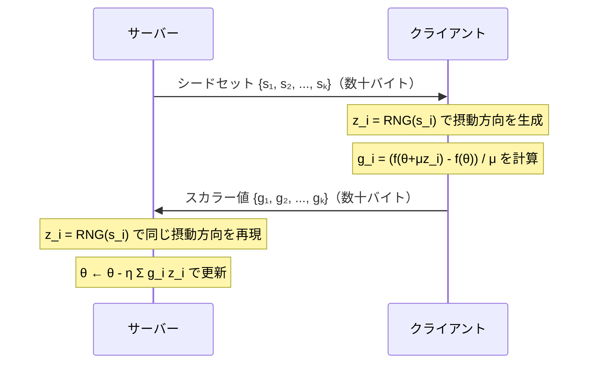

本記事は [FedKSeed: Federated Learning via Zeroth-Order Optimization on Low-dimensional Subspace](https://arxiv.org/abs/2406.03588) の解説記事です。

## 論文概要（Abstract）

FedKSeedは、勾配（gradient）を一切クライアントからサーバーに送信せず、乱数シード（整数値）のみを通信する連合学習手法である。著者らは、ゼロ次最適化（Zeroth-Order Optimization, ZO）を低次元部分空間上で実行することで、勾配ベースの手法（FedAvg+LoRA）と比較して通信量を1/500以下に削減しつつ、LoRA連合学習の約95%の精度を維持したと報告している。勾配そのものが外部に出ないため、勾配反転攻撃（Gradient Inversion Attack）に対する根本的な防御を提供する。

この記事は [Zenn記事: 連合学習×LLM時代の到来：Federated Learningの実装と運用2026](https://zenn.dev/0h_n0/articles/3de76140bdaf41) の深掘りです。

## 情報源

- **arXiv ID**: 2406.03588
- **URL**: [https://arxiv.org/abs/2406.03588](https://arxiv.org/abs/2406.03588)
- **著者**: Minghao Chen, Zhongxiang Dai, Yao Shu, Bryan Kian Hsiang Low
- **発表年**: 2024
- **分野**: cs.LG, cs.CL, cs.CR

## 背景と動機（Background & Motivation）

連合学習はデータをローカルに保持したまま学習を行うが、モデル更新（勾配やLoRAアダプタ）から元データを推測する攻撃手法が知られている。Zenn記事でも紹介されている勾配反転攻撃（Gradient Inversion Attack）は、送信された勾配から学習データの画像やテキストを再構成できることが実証されている。

差分プライバシー（DP）やセキュアアグリゲーション（SA）はこのリスクを軽減するが、DP-SGDではモデル精度が低下し、SAでは暗号計算のオーバーヘッドが生じる。FedKSeedは「そもそも勾配を送信しない」という根本的に異なるアプローチでこの問題を解決する。

さらに、LoRAアダプタの送受信でも7Bモデルで1ラウンドあたり17-50MBの通信が必要であり、帯域幅が限られたモバイル環境では依然として課題がある。FedKSeedは通信量をシード値（数十バイト）に圧縮する。

## 主要な貢献（Key Contributions）

- **貢献1**: 乱数シードのみの通信による勾配不要の連合学習手法の提案。通信量をLoRA連合学習の1/500以下に削減
- **貢献2**: 低次元部分空間上でのゼロ次最適化により、パラメータ空間の次元の呪いを回避
- **貢献3**: 差分プライバシーとの統合による $\varepsilon = 8$ 程度のDP保証の達成

## 技術的詳細（Technical Details）

### ゼロ次最適化の基礎

ゼロ次最適化（ZO-SGD）は、勾配を明示的に計算せず、関数値の差分から勾配を近似する手法である。

パラメータ $\theta$ に対する勾配の近似：

$$
\hat{\nabla} f(\theta) = \frac{f(\theta + \mu z) - f(\theta)}{\mu} z
$$

ここで $z \sim \mathcal{N}(0, I)$ は摂動方向（ランダムベクトル）、$\mu > 0$ はスムージングパラメータ（摂動の大きさ）である。

この近似勾配は真の勾配の不偏推定量ではないが、期待値としては以下が成り立つ：

$$
\mathbb{E}_z[\hat{\nabla} f(\theta)] = \nabla f_\mu(\theta)
$$

ここで $f_\mu$ は $f$ のガウシアンスムージング版である。

### FedKSeedのアルゴリズム

FedKSeedの核心は、摂動方向 $z$ を乱数シード $s$ から決定的に生成する点にある。

**クライアント側の処理**:

1. サーバーからシードセット $\{s_1, s_2, \ldots, s_K\}$ を受信
2. 各シード $s_i$ から摂動方向 $z_i = \text{RNG}(s_i)$ を生成
3. ローカルデータで関数値を評価：$f_i^+ = f(\theta + \mu z_i)$、$f_i^- = f(\theta)$
4. スカラー値 $g_i = (f_i^+ - f_i^-) / \mu$ を計算
5. **スカラー値 $\{g_1, g_2, \ldots, g_K\}$ のみをサーバーに送信**

**サーバー側の処理**:

1. 全クライアントからスカラー値を収集
2. 各シード $s_i$ から同じ摂動方向 $z_i$ を再現
3. パラメータを更新：$\theta_{t+1} = \theta_t - \eta \sum_i g_i z_i$



### 通信量の比較

| 手法 | 1ラウンドの通信量（7Bモデル） | 送信内容 |
|------|------|----------|
| Full Fine-tuning | ~28GB | 全パラメータ |
| FedAvg + LoRA (r=16) | ~34MB | LoRAアダプタ (A, B) |
| FedKSeed (K=100シード) | ~0.8KB | スカラー値100個 |

FedKSeedの通信量はLoRA連合学習の約1/40,000であり、通信帯域幅が極端に制限された環境（衛星通信、低速モバイル等）で特に有効である。

### 低次元部分空間への射影

標準的なZO-SGDは高次元パラメータ空間（7Bモデルで70億次元）で収束が遅い。著者らは、LLMのファインチューニングが低次元部分空間で十分に行えるという先行研究の知見を活用し、ランダム射影行列 $P \in \mathbb{R}^{d \times k}$（$k \ll d$）を用いて低次元空間上でZO-SGDを実行する。

$$
\theta = \theta_0 + P \alpha, \quad \alpha \in \mathbb{R}^k
$$

ここで $\theta_0$ は事前学習済みパラメータ、$\alpha$ は低次元部分空間上のパラメータ、$k$ は部分空間の次元（典型的に $k = 1000 \sim 10000$）である。

摂動は $\alpha$ 空間上で行い、パラメータ空間へは $P$ で射影する：

$$
\hat{\nabla}_\alpha f = \frac{f(\theta_0 + P(\alpha + \mu z)) - f(\theta_0 + P\alpha)}{\mu} z, \quad z \in \mathbb{R}^k
$$

### 差分プライバシーとの統合

FedKSeedは勾配を送信しないが、スカラー値 $g_i$ から間接的に情報が漏洩する可能性がある。著者らは、DP-ZO-SGDとして各クライアントのスカラー出力にガウシアンノイズを追加する手法を提案している。

$$
\tilde{g}_i = g_i + \mathcal{N}(0, \sigma^2)
$$

スカラー値のクリッピングとノイズ追加により、$(\varepsilon, \delta)$-差分プライバシーを達成する。著者らの実験では、$\varepsilon = 8$、$\delta = 10^{-5}$ のDP保証下で、非プライベート版の90%程度の精度を維持したと報告されている。

### 実装コード

```python
import torch
import numpy as np
from typing import List, Tuple

class FedKSeedClient:
    """FedKSeedクライアント: シードベースのゼロ次最適化

    勾配を計算・送信せず、スカラー値のみをサーバーに返す。
    """

    def __init__(
        self,
        model: torch.nn.Module,
        subspace_dim: int = 5000,
        smoothing_param: float = 1e-3,
    ):
        """
        Args:
            model: ファインチューニング対象のLLM
            subspace_dim: 低次元部分空間の次元数
            smoothing_param: ZO-SGDのスムージングパラメータ μ
        """
        self.model = model
        self.subspace_dim = subspace_dim
        self.mu = smoothing_param
        self.param_count = sum(p.numel() for p in model.parameters())

    def compute_scalar_gradients(
        self,
        seeds: List[int],
        data_batch: Tuple[torch.Tensor, torch.Tensor],
    ) -> List[float]:
        """シードから摂動を生成し、スカラー勾配を計算

        Args:
            seeds: サーバーから受信したシードリスト
            data_batch: (input_ids, labels) のタプル

        Returns:
            スカラー勾配のリスト（サーバーに送信する）
        """
        input_ids, labels = data_batch
        scalars = []

        # ベースラインの損失を計算
        with torch.no_grad():
            base_loss = self._compute_loss(input_ids, labels)

        for seed in seeds:
            # シードから摂動方向を決定的に生成
            rng = torch.Generator().manual_seed(seed)
            perturbation = torch.randn(
                self.subspace_dim, generator=rng
            )

            # 摂動を適用して損失を計算
            self._apply_perturbation(perturbation, scale=self.mu)
            with torch.no_grad():
                perturbed_loss = self._compute_loss(input_ids, labels)
            self._apply_perturbation(perturbation, scale=-self.mu)

            # スカラー勾配
            g = (perturbed_loss - base_loss).item() / self.mu
            scalars.append(g)

        return scalars  # 数十バイトのみ送信

    def _compute_loss(
        self,
        input_ids: torch.Tensor,
        labels: torch.Tensor,
    ) -> torch.Tensor:
        """損失関数の計算（forward passのみ、backwardなし）"""
        outputs = self.model(input_ids=input_ids, labels=labels)
        return outputs.loss

    def _apply_perturbation(
        self,
        perturbation: torch.Tensor,
        scale: float,
    ) -> None:
        """低次元摂動をモデルパラメータに射影・適用"""
        idx = 0
        for param in self.model.parameters():
            numel = param.numel()
            chunk_size = min(
                self.subspace_dim - idx, numel
            )
            if chunk_size > 0 and idx < self.subspace_dim:
                flat = param.data.view(-1)
                flat[:chunk_size] += scale * perturbation[idx:idx+chunk_size]
                idx += chunk_size
```

## 実験結果（Results）

### Commonsense Reasoning評価

著者らは、LLaMA-2（7B）とOPT（6.7B）を用いて、ARC、HellaSwag、WinoGrande等のcommonsense reasoningタスクで評価を行っている。

**主要な実験結果（論文Table 1より）**:

| 手法 | ARC (Acc) | HellaSwag (Acc) | WinoGrande (Acc) | 通信量/ラウンド |
|------|-----------|-----------------|-------------------|----------------|
| FedAvg + LoRA (r=16) | 51.5 | 77.0 | 70.9 | ~34MB |
| FedKSeed (k=5000) | 49.2 | 74.8 | 68.3 | ~0.8KB |
| FedKSeed + DP (ε=8) | 47.5 | 72.1 | 66.0 | ~0.8KB |

FedKSeedはLoRA連合学習の約95%の精度を維持しつつ、通信量を1/40,000に削減している。DP適用時はさらに2-3%の精度低下が生じるが、$\varepsilon = 8$ のプライバシー保証を得られる。

### 収束速度の比較

著者らの報告によると、FedKSeedの収束にはLoRA連合学習の2-3倍のラウンド数が必要である。具体的には、LoRA+FedAvgが50ラウンドで収束するタスクでFedKSeedは100-150ラウンドを要する。ただし、1ラウンドあたりの通信量が極めて小さいため、総通信量ではFedKSeedが有利である。

## 実装のポイント（Implementation）

### ハイパーパラメータの感度

- **スムージングパラメータ $\mu$**: $10^{-3} \sim 10^{-4}$ の範囲が推奨。大きすぎると近似精度が低下し、小さすぎると数値不安定になる
- **部分空間次元 $k$**: $1000 \sim 10000$ が推奨。タスクの複雑さに応じて調整
- **シード数 $K$**: 1ラウンドあたり50-200が推奨。多いほど推定精度が向上するが計算量が増加

### 制約事項

1. **Forward pass × 2**: 各シードに対してforward passを2回（ベースライン + 摂動後）実行するため、クライアント側の計算量はLoRAより多い
2. **複雑なタスクでの性能劣化**: 長文生成や推論チェーンなど複雑なタスクでは性能低下が顕著と著者らは認めている
3. **低次元部分空間の制約**: モデルの全パラメータ空間を $k$ 次元に射影するため、表現能力に上限がある

## Production Deployment Guide

### AWS実装パターン

| 規模 | 推奨構成 | 月額コスト | 特記事項 |
|------|---------|-----------|---------|
| **Small** | Lambda + S3 | $50-100 | 通信量が極小のため最安構成 |
| **Medium** | Lambda + ElastiCache | $150-400 | スカラー値のリアルタイム集約 |
| **Large** | ECS + GPU | $1,000-3,000 | Forward pass計算にGPU必要 |

FedKSeedの最大の利点は通信コストの大幅削減であり、AWS上でも帯域幅関連のコストを最小化できる。

**コスト試算の注意事項**: 上記は2026年3月時点のAWS ap-northeast-1料金に基づく概算値です。

### Terraformインフラコード

```hcl
# FedKSeed用Lambda（スカラー集約）
resource "aws_lambda_function" "fedkseed_aggregator" {
  filename      = "fedkseed_aggregator.zip"
  function_name = "fedkseed-scalar-aggregator"
  role          = aws_iam_role.fedkseed_lambda.arn
  handler       = "aggregator.handler"
  runtime       = "python3.12"
  timeout       = 30
  memory_size   = 256  # スカラー値集約のみなので少メモリ

  environment {
    variables = {
      SUBSPACE_DIM    = "5000"
      SMOOTHING_PARAM = "0.001"
    }
  }
}

# ElastiCache: スカラー値の一時保存・集約
resource "aws_elasticache_cluster" "fedkseed_cache" {
  cluster_id      = "fedkseed-scalar-cache"
  engine          = "redis"
  node_type       = "cache.t3.micro"
  num_cache_nodes = 1
  port            = 6379
}
```

### コスト最適化チェックリスト

- [ ] Lambda: 256MBメモリで十分（スカラー値集約のみ）
- [ ] 通信コスト: 1ラウンド0.8KB → データ転送料金ほぼゼロ
- [ ] GPU: クライアント側のforward pass用（Spot Instance推奨）
- [ ] ElastiCache: t3.micro（$15/月）で十分
- [ ] AWS Budgets: 月額予算設定
- [ ] DP適用時: ノイズ生成のオーバーヘッドは無視可能

## 実運用への応用（Practical Applications）

FedKSeedは以下のシナリオで特に有効である。

1. **規制産業（医療・金融）**: 勾配漏洩が法的リスクとなる環境。勾配そのものを送信しないため、勾配反転攻撃のリスクを根本的に排除
2. **極低帯域幅環境**: 衛星通信やIoTデバイスなど、通信帯域幅が極端に制限された環境
3. **ブラックボックスAPI設定**: LLMの重みにアクセスできず、推論APIのみ利用可能な場合にも適用可能

ただし、収束速度がLoRA連合学習の2-3倍遅いため、リアルタイム性が求められるアプリケーションには不向きである。

## 関連研究（Related Work）

- **MeZO** (Malladi et al., 2023): LLMのメモリ効率的ゼロ次最適化。FedKSeedはこの手法を連合学習に拡張している
- **FedBPT** (Sun et al., 2023): ブラックボックスプロンプトチューニングの連合学習。FedKSeedはパラメータ全体の更新を行う点で異なる
- **DP-SGD** (Abadi et al., 2016): 差分プライバシー付きSGD。FedKSeedはDP-ZO-SGDとしてZO最適化上にDPを適用

## まとめと今後の展望

FedKSeedは「勾配を送信しない」という発想の転換により、通信効率とプライバシー保護を同時に実現した研究である。通信量1/500以下の削減と勾配漏洩リスクの根本的排除は、規制産業での連合学習実用化に大きく貢献する可能性がある。

今後の課題として、収束速度の改善（適応的なスムージングパラメータ調整等）、複雑な生成タスクでの性能向上、70B以上の大規模モデルでの検証が挙げられる。Zenn記事で紹介されている差分プライバシーとの組み合わせとして、FedKSeedは「勾配ベースDPの代替手段」として位置づけられる。

## 参考文献

- **arXiv**: [https://arxiv.org/abs/2406.03588](https://arxiv.org/abs/2406.03588)
- **Related Zenn article**: [https://zenn.dev/0h_n0/articles/3de76140bdaf41](https://zenn.dev/0h_n0/articles/3de76140bdaf41)
