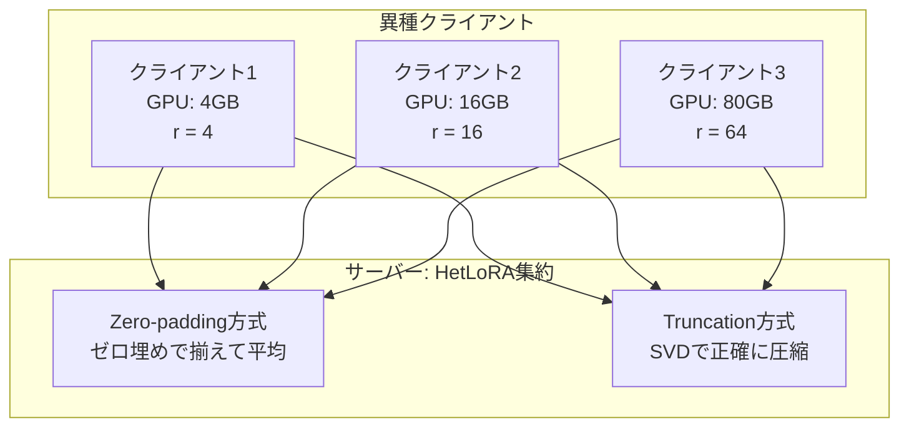

本記事は [HetLoRA: Communication-Efficient Federated Fine-tuning of Large Language Models with Heterogeneous LoRA Configurations](https://arxiv.org/abs/2410.09009) の解説記事です。

## 論文概要（Abstract）

HetLoRAは、連合学習環境においてクライアントごとに異なるLoRAランクを許容するアグリゲーション手法を提案した研究である。現実の連合学習では、スマートフォンからサーバーまでGPUメモリやネットワーク帯域幅が大きく異なるクライアントが混在する。従来のFedAvg+LoRAでは全クライアントで同一のランク $r$ を使用する必要があったが、HetLoRAはZero-padding方式とTruncation（SVD）方式の2つのアグリゲーション手法により、ランク $r = 2$ のリソース制約デバイスから $r = 64$ の高性能サーバーまで柔軟に対応する。LLaMA-2（7B/13B）、Mistral（7B）でのSuperGLUEおよびMT-Bench評価において、均一ランク設定との精度差を1-3%以内に抑えつつ通信量を40-60%削減したと著者らは報告している。

この記事は [Zenn記事: 連合学習×LLM時代の到来：Federated Learningの実装と運用2026](https://zenn.dev/0h_n0/articles/3de76140bdaf41) の深掘りです。

## 情報源

- **arXiv ID**: 2410.09009
- **URL**: [https://arxiv.org/abs/2410.09009](https://arxiv.org/abs/2410.09009)
- **著者**: Yae Jee Cho, Luyang Liu, Zheng Xu, Aldi Fahrezi, Gauri Joshi
- **発表年**: 2024
- **分野**: cs.LG, cs.CL

## 背景と動機（Background & Motivation）

連合学習の実用化において、クライアントデバイスの異質性（heterogeneity）は最も大きな障壁の1つである。Zenn記事で紹介されているCross-Device設定では、数百万台のスマートフォンが参加する可能性があり、各デバイスのGPUメモリ・CPU性能・ネットワーク帯域幅は大きく異なる。

LoRAのランク $r$ は計算量と通信量に直結する。ランクが高いほど表現力が高まるが、メモリ消費と通信量も比例して増加する。$r = 64$ を設定するには約50MBのアダプタパラメータ（7Bモデルの場合）が必要だが、メモリ制約のあるモバイルデバイスでは $r = 2$（約1.6MB）しか扱えない場合がある。

従来のアプローチでは、全クライアントの最低スペックに合わせてランクを設定せざるを得ず、高性能クライアントの計算能力が無駄になっていた。HetLoRAはこの「最弱リンク問題」を解決する。

## 主要な貢献（Key Contributions）

- **貢献1**: 異種LoRAランクに対応する2つのアグリゲーション手法（Zero-padding方式、Truncation方式）の提案と比較分析
- **貢献2**: LLaMA-2（7B/13B）、Mistral（7B）での大規模実験によるスケーラビリティの検証
- **貢献3**: ランク割り当てポリシー（デバイスリソース比例）の設計指針の提示

## 技術的詳細（Technical Details）

### 問題設定

$K$ 個のクライアントがそれぞれ異なるLoRAランク $r_k$ を使用する。クライアント $k$ のLoRAアダプタは：

$$
A_k \in \mathbb{R}^{r_k \times d_{\text{in}}}, \quad B_k \in \mathbb{R}^{d_{\text{out}} \times r_k}
$$

ここで $r_k$ は $r_{\min} \leq r_k \leq r_{\max}$ の範囲で、デバイスのリソースに応じて割り当てられる。

### 方式1: Zero-padding Aggregation

各クライアントのアダプタを最大ランク $r_{\max}$ にゼロパディングして揃え、要素ごとに平均する。

$$
\hat{A}_k = \begin{bmatrix} A_k \\ \mathbf{0}_{(r_{\max} - r_k) \times d_{\text{in}}} \end{bmatrix} \in \mathbb{R}^{r_{\max} \times d_{\text{in}}}
$$

$$
\hat{B}_k = \begin{bmatrix} B_k & \mathbf{0}_{d_{\text{out}} \times (r_{\max} - r_k)} \end{bmatrix} \in \mathbb{R}^{d_{\text{out}} \times r_{\max}}
$$

集約後のアダプタ：

$$
\bar{A} = \frac{1}{K} \sum_{k=1}^{K} \hat{A}_k, \quad \bar{B} = \frac{1}{K} \sum_{k=1}^{K} \hat{B}_k
$$

各クライアントは次のラウンドで $\bar{A}$ と $\bar{B}$ の上位 $r_k$ 行/列のみを受信する。

**利点**: 実装が簡潔、サーバー側の計算コストが小さい
**欠点**: ランク差が大きい場合（$r = 2$ vs $r = 64$）にゼロパディング部分がノイズとなり精度が劣化

### 方式2: Truncation（SVD）Aggregation

全クライアントの重み更新 $\Delta W_k = B_k A_k$ を計算し、加重平均した後にSVDで目標ランクに圧縮する。

$$
\bar{\Delta W} = \sum_{k=1}^{K} \frac{n_k}{n} B_k A_k
$$

$$
\bar{\Delta W} = U \Sigma V^T
$$

各クライアント $k$ に対して、上位 $r_k$ 個の特異値を保持したアダプタを配布：

$$
A_k^{\text{new}} = \Sigma_{:r_k}^{1/2} V_{:r_k}^T, \quad B_k^{\text{new}} = U_{:r_k} \Sigma_{:r_k}^{1/2}
$$

**利点**: 全パラメータ空間での正確な近似、ランク差が大きくても精度維持
**欠点**: サーバー側でのSVD計算コスト（$O(d_{\text{out}} \cdot d_{\text{in}} \cdot \min(d_{\text{out}}, d_{\text{in}}))$）



### 実装コード

```python
import torch
from typing import List, Tuple

def hetlora_zero_padding_aggregate(
    client_adapters: List[Tuple[torch.Tensor, torch.Tensor, int]],
    r_max: int,
) -> Tuple[torch.Tensor, torch.Tensor]:
    """HetLoRA Zero-padding Aggregation

    異なるランクのLoRAアダプタをゼロパディングで揃えて平均する。

    Args:
        client_adapters: [(A_k, B_k, r_k), ...] 各クライアントのアダプタとランク
        r_max: 最大ランク（パディング先のサイズ）

    Returns:
        (A_avg, B_avg): 集約後のアダプタ (r_max × d_in), (d_out × r_max)
    """
    K = len(client_adapters)
    d_in = client_adapters[0][0].shape[1]
    d_out = client_adapters[0][1].shape[0]

    A_sum = torch.zeros(r_max, d_in)
    B_sum = torch.zeros(d_out, r_max)

    for A_k, B_k, r_k in client_adapters:
        # ゼロパディング
        A_sum[:r_k, :] += A_k
        B_sum[:, :r_k] += B_k

    return A_sum / K, B_sum / K


def hetlora_svd_aggregate(
    client_adapters: List[Tuple[torch.Tensor, torch.Tensor, int]],
    client_weights: List[float],
) -> torch.Tensor:
    """HetLoRA SVD (Truncation) Aggregation

    重み更新行列を加重平均し、SVDで圧縮する。

    Args:
        client_adapters: [(A_k, B_k, r_k), ...]
        client_weights: 各クライアントの重み（データ量比例）

    Returns:
        delta_W_avg: 集約後の重み更新行列 (d_out × d_in)
    """
    delta_W = torch.zeros_like(
        client_adapters[0][1] @ client_adapters[0][0]
    )

    for (A_k, B_k, _), w_k in zip(client_adapters, client_weights):
        delta_W += w_k * (B_k @ A_k)

    return delta_W


def distribute_by_rank(
    delta_W: torch.Tensor,
    target_rank: int,
) -> Tuple[torch.Tensor, torch.Tensor]:
    """SVD結果から指定ランクのアダプタを生成

    Args:
        delta_W: 集約後の重み更新行列 (d_out × d_in)
        target_rank: クライアントのLoRAランク

    Returns:
        (A_new, B_new): 新しいアダプタ
    """
    U, S, Vh = torch.linalg.svd(delta_W, full_matrices=False)
    sqrt_S = torch.sqrt(S[:target_rank])

    A_new = torch.diag(sqrt_S) @ Vh[:target_rank, :]
    B_new = U[:, :target_rank] @ torch.diag(sqrt_S)

    return A_new, B_new
```

## 実験結果（Results）

### SuperGLUE・MT-Bench評価

著者らは、LLaMA-2 7B/13BおよびMistral 7Bを用いて、クライアントのLoRAランクを $r \in \{2, 4, 8, 16, 32, 64\}$ でランダムに割り当てた実験を行っている。

**主要な実験結果（論文Table 3より）**:

| 手法 | SuperGLUE (Avg) | MT-Bench | 通信量（均一r=64比） |
|------|----------------|----------|---------------------|
| 均一 r=64（全クライアント） | 82.1 | 6.45 | 100% |
| 均一 r=8（全クライアント） | 78.3 | 5.92 | 12.5% |
| HetLoRA Zero-padding | 80.4 | 6.21 | 40-60% |
| HetLoRA Truncation (SVD) | 81.5 | 6.38 | 40-60% |

著者らの報告によると、Truncation方式は均一 $r = 64$ との差をSuperGLUEで0.6%、MT-Benchで0.07ポイントに抑えつつ、通信量を40-60%削減している。

### ランク差が大きい場合の影響

ランク差が最大の設定（$r = 2$ vs $r = 64$）では、Zero-padding方式の精度が3-5%低下するのに対し、Truncation方式は1-2%の低下にとどまると報告されている。この差はゼロパディングによるノイズ蓄積が原因であり、ランク差が小さい場合（$r = 16$ vs $r = 32$）では両方式の差は0.5%未満である。

### サーバー計算コスト

Truncation方式のSVD計算は、LLaMA-2 7Bの全アダプタレイヤー（32層 × 2ターゲットモジュール）で1ラウンドあたり約3-5秒（A100 GPU上）と報告されている。この追加コストは、FLラウンド全体の学習時間（数分〜数十分）と比較して無視できるレベルである。

## 実装のポイント（Implementation）

### ランク割り当てポリシー

著者らは以下のランク割り当てガイドラインを提示している：

| デバイスカテゴリ | GPU VRAM | 推奨LoRAランク | 通信量/ラウンド |
|---------------|----------|--------------|----------------|
| モバイル | 2-4GB | r = 2-4 | 1.6-3.2MB |
| エッジサーバー | 8-16GB | r = 8-16 | 6.4-12.8MB |
| データセンター | 40-80GB | r = 32-64 | 25.6-51.2MB |

### 方式選択の判断基準

| 条件 | 推奨方式 | 理由 |
|------|---------|------|
| ランク差が小さい（2倍以内） | Zero-padding | 実装簡潔、精度差小 |
| ランク差が大きい（4倍以上） | Truncation (SVD) | ノイズ耐性が高い |
| サーバー計算リソースが限定的 | Zero-padding | SVD不要 |
| 精度最優先 | Truncation (SVD) | 全パラメータ空間で正確 |

### FLoRAとの組み合わせ

HetLoRAのTruncation方式とFLoRA（arXiv:2402.06954）のスタック型アグリゲーションを組み合わせることで、「ランク不均一 + 正確な集約」の両方を実現できる。具体的には：

1. 各クライアントが自身のランク $r_k$ でLoRAを学習
2. サーバーでTruncation方式により $\Delta W$ を正確に集約
3. SVD後のアダプタをFLoRA方式でスタックして次ラウンドに配布

## Production Deployment Guide

### AWS実装パターン

| 規模 | 推奨構成 | 月額コスト | 特記事項 |
|------|---------|-----------|---------|
| **Small** | Lambda + S3 | $100-200 | Zero-padding方式推奨 |
| **Medium** | ECS Fargate + S3 | $400-1,000 | SVD計算にCPU最適化 |
| **Large** | EKS + GPU | $3,000-8,000 | Truncation方式でGPU SVD |

**コスト試算の注意事項**: 上記は2026年3月時点のAWS ap-northeast-1料金に基づく概算値です。

### Terraformインフラコード

```hcl
# HetLoRA用Lambda（Zero-padding方式）
resource "aws_lambda_function" "hetlora_aggregator" {
  filename      = "hetlora_aggregator.zip"
  function_name = "hetlora-zero-padding-aggregator"
  role          = aws_iam_role.hetlora_lambda.arn
  handler       = "aggregator.handler"
  runtime       = "python3.12"
  timeout       = 120
  memory_size   = 2048

  environment {
    variables = {
      AGGREGATION_METHOD = "zero_padding"
      R_MAX              = "64"
      S3_BUCKET          = aws_s3_bucket.hetlora_adapters.id
    }
  }
}

# S3: アダプタ保存（ランク別ディレクトリ構造）
resource "aws_s3_bucket" "hetlora_adapters" {
  bucket = "hetlora-adapters-${var.environment}"
}

resource "aws_s3_bucket_server_side_encryption_configuration" "hetlora" {
  bucket = aws_s3_bucket.hetlora_adapters.id
  rule {
    apply_server_side_encryption_by_default {
      sse_algorithm = "aws:kms"
    }
  }
}
```

### コスト最適化チェックリスト

- [ ] Zero-padding方式を優先（サーバー計算コスト削減）
- [ ] ランク差2倍以内ならSVD不要
- [ ] S3ライフサイクル: 古いアダプタ自動削除（14日）
- [ ] Lambda: メモリ2GBで十分（Zero-padding方式）
- [ ] GPU Spot Instances: Truncation方式のSVD計算用
- [ ] クライアントランク動的調整: ネットワーク帯域に応じてランクを自動変更
- [ ] AWS Budgets: 月額予算設定（80%で警告）
- [ ] CloudWatch: アグリゲーション処理時間監視

## 実運用への応用（Practical Applications）

HetLoRAは以下の現実的シナリオで有効である。

1. **Cross-Device連合学習**: スマートフォン（$r = 2$）とタブレット（$r = 8$）とPCワークステーション（$r = 32$）が混在する環境
2. **可変帯域幅環境**: ネットワーク状態に応じてLoRAランクを動的に変更し、通信量を適応的に制御
3. **段階的デプロイ**: 初期は低ランク（$r = 4$）で広くクライアントを参加させ、精度要件に応じて高ランククライアントを追加

ただし、著者らが認める通り、ラウンドごとの動的ランク変更には対応していない。実運用では、ランク割り当てを事前に決定し、FLセッション中は固定する設計が推奨される。

## 関連研究（Related Work）

- **FLoRA** (Hao et al., 2024): 均一ランクでのスタック型アグリゲーション。HetLoRAとは相補的な関係にあり、組み合わせて使用可能
- **FlexLoRA** (Bai et al., 2024): 同様に異種ランクを扱うが、HetLoRAはZero-paddingとSVDの2方式を比較分析している点で差別化
- **FedPara** (Hyeon-Woo et al., 2022): ハダマード積による低ランク表現。LoRAとは異なるアーキテクチャであり直接比較は困難

## まとめと今後の展望

HetLoRAは、連合学習における「クライアント異質性」という実用上最も重要な課題に対して、2つの具体的なアグリゲーション手法を提案した研究である。Truncation方式により、均一ランク設定との精度差を1-3%以内に抑えつつ通信量40-60%削減を実現している。

今後の課題として、ラウンドごとの動的ランク変更対応、100+クライアントでの大規模評価、差分プライバシーとの統合が挙げられる。Zenn記事で紹介されているCross-Device設定での実用化には、HetLoRAのようなクライアント異質性対応が不可欠である。

## 参考文献

- **arXiv**: [https://arxiv.org/abs/2410.09009](https://arxiv.org/abs/2410.09009)
- **Related Zenn article**: [https://zenn.dev/0h_n0/articles/3de76140bdaf41](https://zenn.dev/0h_n0/articles/3de76140bdaf41)
