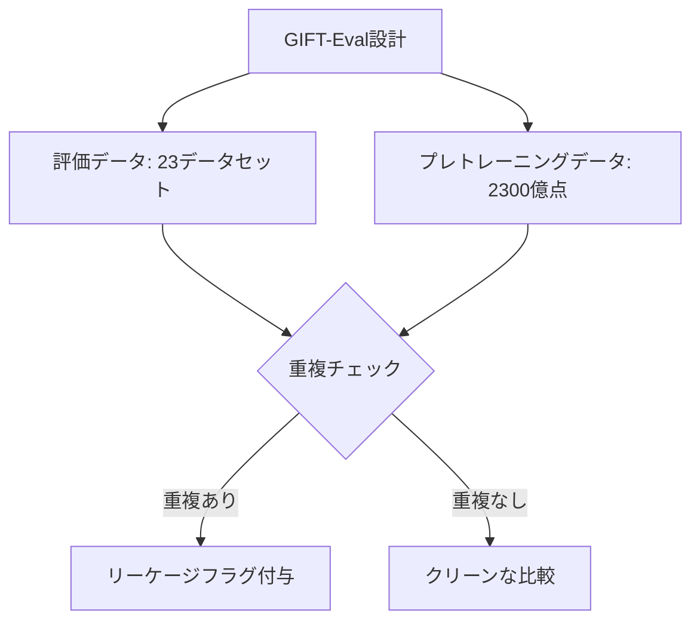

> 本記事は [GIFT-Eval: A Benchmark For General Time Series Forecasting Model Evaluation (arXiv:2410.10393)](https://arxiv.org/abs/2410.10393) の解説記事です。

## 論文概要（Abstract）

GIFT-Eval（General Time Series Forecasting Model Evaluation）は、Salesforce AI Researchが主導して開発したTSFM評価用の包括的ベンチマークである。23データセット、144,000以上の時系列、約1.77億データポイントを含み、7ドメイン・10種類の周波数・短期〜長期予測をカバーする。17のベースライン（統計モデル、深層学習モデル、ファウンデーションモデル）を比較評価し、データリーケージを防ぐための2300億データポイントの別途プレトレーニングデータセットも提供する。コード・データ・リーダーボードが公開されており、TSFMの標準的な評価基盤として広く利用されている。

この記事は [Zenn記事: 時系列ファウンデーションモデル2025-2026年最前線：Chronos-2・TimesFM・Sundialを徹底比較](https://zenn.dev/0h_n0/articles/5c2f14f0c06a8e) の深掘りです。

## 情報源

- **arXiv ID**: 2410.10393
- **URL**: [https://arxiv.org/abs/2410.10393](https://arxiv.org/abs/2410.10393)
- **著者**: Taha Aksu, Gerald Woo, Juncheng Liu, Xu Liu, Chenghao Liu, Silvio Savarese, Caiming Xiong, Doyen Sahoo
- **発表年**: 2024
- **分野**: cs.LG

## 背景と動機（Background & Motivation）

TSFMの急速な発展に伴い、各モデルが異なるデータセット・異なる評価プロトコルで性能を報告する状況が生まれていた。この問題は以下の点でTSFMの比較を困難にしていた。

1. **評価データセットの断片化**: 各論文が独自のデータセット選択で評価を行い、横断的な比較が困難
2. **データリーケージ**: プレトレーニングデータに評価データが混入するリスク。TSFMは大規模データで学習するため、このリスクが深刻
3. **評価指標の不統一**: MASE、CRPS、WQL、MAPEなど、論文によって主要指標が異なる
4. **ドメイン偏り**: 一部のドメイン（例: ETTデータセット）に偏った評価では、汎用性能を正確に測定できない

GIFT-Evalはこれらの課題に対し、「統一された評価基盤」を提供することを目的としている。

## 主要な貢献（Key Contributions）

- **貢献1**: 23データセット・7ドメイン・10周波数をカバーする包括的なベンチマークの構築
- **貢献2**: データリーケージを防ぐための2300億データポイントの「非リーク」プレトレーニングデータセットの提供
- **貢献3**: 17ベースラインの統一的な評価と、公開リーダーボードによる継続的な比較の実現
- **貢献4**: 98タスク構成による多角的な評価（短期/長期、単変量/多変量、確率的/点予測）

## 技術的詳細（Technical Details）

### ベンチマーク設計

GIFT-Evalのベンチマーク設計は以下の構成要素から成る。

**データセット構成**:

| カテゴリ | データセット数 | ドメイン例 |
|---------|-------------|-----------|
| Energy | 4 | 電力消費、太陽光発電 |
| Transport | 3 | 交通量、タクシー需要 |
| Nature | 3 | 天気、河川流量 |
| Finance | 3 | 株価、為替レート |
| Web/CloudOps | 4 | Webトラフィック、サーバー負荷 |
| Health | 3 | 医療時系列 |
| Retail | 3 | 小売需要 |

**周波数カバレッジ**: 分単位から年単位まで10種類の周波数（Minutely, Hourly, Daily, Weekly, Monthly等）

**タスク構成**: 23データセット × 複数の予測ホライズン × 評価指標 = 98タスク

### 評価指標

GIFT-Evalでは主に以下の2指標を使用する。

**MASE（Mean Absolute Scaled Error）**:

$$
\text{MASE} = \frac{\frac{1}{H}\sum_{t=T+1}^{T+H}|y_t - \hat{y}_t|}{\frac{1}{T-m}\sum_{t=m+1}^{T}|y_t - y_{t-m}|}
$$

ここで、
- $y_t$: 時刻$t$の実測値
- $\hat{y}_t$: 時刻$t$の予測値
- $H$: 予測ホライズン
- $m$: 季節周期
- 分母はnaive seasonal forecastの誤差（スケーリング因子）

MASEが1未満であればnaive seasonal forecastを上回ることを意味する。

**CRPS（Continuous Ranked Probability Score）**:

$$
\text{CRPS}(F, y) = \int_{-\infty}^{\infty}(F(z) - \mathbb{1}(z \geq y))^2 dz
$$

ここで、
- $F$: 予測の累積分布関数（CDF）
- $y$: 実測値
- $\mathbb{1}(z \geq y)$: ステップ関数

CRPSは確率的予測の品質を測定する指標であり、予測分布が実測値に近い確率質量を持つほど値が小さくなる。値が小さいほど良い予測であることを示す。

### データリーケージ対策

GIFT-Evalの最も重要な設計判断の一つが、データリーケージへの対処である。

**問題**: TSFMは大規模なデータで事前学習されるため、評価データがプレトレーニングデータに含まれるリスクがある。例えば、TimesFMやUniTSのプレトレーニングデータに、GIFT-Evalの評価データセットの一部が含まれていたことが判明している。

**対策**:
1. **非リークプレトレーニングデータ**: 評価データセットとの重複を排除した、約2300億データポイントのプレトレーニングデータセットを別途提供
2. **リーケージフラグ**: リーダーボード上で、各モデルのプレトレーニングデータが評価データと重複するかどうかをフラグ表示
3. **修正後のリーダーボード**: データリーケージのないモデルのみでソート可能



### 比較対象モデル（17ベースライン）

GIFT-Evalでは以下の3カテゴリ・17モデルを比較評価している。

**統計モデル**:
- ETS（指数平滑法）
- ARIMA
- Theta法
- Naive Seasonal

**深層学習モデル**:
- N-BEATS
- PatchTST
- iTransformer
- DeepAR

**ファウンデーションモデル**:
- Chronos / Chronos-Bolt
- TimesFM
- Moirai / Moirai-MoE
- Lag-Llama
- UniTS
- TTM

## 実験結果（Results）

### ドメイン別の傾向

著者らの評価結果によると、TSFMの性能はドメインによって大きく異なる。

- **Energy/Nature**: TSFMが統計モデルを大幅に上回る傾向
- **Transport**: TSFMと統計モデルが拮抗
- **Web/CloudOps**: 高エントロピー・散発的なデータであり、TSFMが苦戦する傾向
- **Retail**: 間欠需要（intermittent demand）が多く、TSFMの予測精度が安定しない

### 重要な知見

1. **TSFMは万能ではない**: 一部のドメインでは、適切にチューニングされた統計モデルがTSFMと同等以上の性能を示す
2. **データリーケージの影響**: リーケージありのモデルは不当に高いスコアを示す場合がある。フェアな比較のためにはリーケージフラグの確認が不可欠
3. **確率的予測の重要性**: CRPS指標での評価は、点予測では見えない予測品質の差を明らかにする

### リーダーボードの活用

GIFT-Evalの公開リーダーボード（GitHub: SalesforceAIResearch/gift-eval）は継続的に更新されており、新しいモデルが追加されるたびに順位が変動する。2025年後半にはChronos-2が1位に、TimesFM-2.5がそれに続く結果が報告されている（Amazon Science、Google Research blogより）。

**注意**: リーダーボードの順位は継続的に変動する。モデル選定時は必ず最新のリーダーボード結果を確認すること。

## 実運用への応用（Practical Applications）

### GIFT-Evalを使ったモデル選定フレームワーク

実務でTSFMを導入する際、GIFT-Evalを以下のように活用できる。

1. **自ドメインに近いデータセットを特定**: GIFT-Evalの23データセットの中から、自社データに最も近いドメイン・周波数のデータセットを選ぶ
2. **リーダーボードでの性能確認**: そのデータセットでの各モデルの性能を確認
3. **データリーケージの確認**: 選定候補モデルのリーケージフラグを確認
4. **自データでの検証**: GIFT-Evalの結果を参考に、2-3モデルを自データで実際に評価

### ベンチマーク結果の解釈上の注意

- **集約スコアに惑わされない**: 全データセット平均のスコアだけでなく、自ドメインに近いデータセットでの個別スコアを確認する
- **評価指標の選択**: 点予測の精度が重要ならMASE、確率的予測の品質が重要ならCRPSを重視する
- **リーケージなし条件でのソート**: フェアな比較のため、リーケージなしモデルのみでフィルタリングする

## 関連研究（Related Work）

- **fev-bench (Amazon)**: Amazonが作成した別のベンチマーク。共変量対応タスクの評価に特化
- **Monash Forecasting Archive**: 時系列予測の標準データセット集。GIFT-Evalの一部データセットがここから取得されている
- **TSFM-Bench (arXiv:2503.05944)**: 2025年に提案された、GIFT-Evalを補完するベンチマーク
- **FoundTS (arXiv:2410.04803)**: 10モデル×20データセットの統合評価を提供する別のベンチマーク

## まとめと今後の展望

GIFT-Evalは、TSFMの評価基盤として標準的な地位を確立しつつある。データリーケージ対策を含む設計は、公正な比較を可能にする重要な貢献である。

今後の課題として以下が挙げられる。
- **共変量対応タスクの充実**: 現状ではfev-benchが共変量タスクの評価で補完的な役割を果たしている
- **リーダーボードの持続性**: 新モデルの継続的な追加と、公正な比較条件の維持
- **ドメイン特化ベンチマーク**: 特定ドメイン（ヘルスケア、金融等）に特化した深掘りベンチマークの整備

モデル選定においては、GIFT-Evalの結果を参考にしつつ、自ドメインのデータでの検証を必ず行うことが推奨される。

## 参考文献

- **arXiv**: [https://arxiv.org/abs/2410.10393](https://arxiv.org/abs/2410.10393)
- **Code & Leaderboard**: [https://github.com/SalesforceAIResearch/gift-eval](https://github.com/SalesforceAIResearch/gift-eval)
- **fev-bench (Amazon)**: 共変量対応タスクの補完ベンチマーク
- **Related Zenn article**: [https://zenn.dev/0h_n0/articles/5c2f14f0c06a8e](https://zenn.dev/0h_n0/articles/5c2f14f0c06a8e)

## GIFT-Evalの実装と利用方法（Implementation Guide）

### ベンチマーク実行環境の構築

GIFT-Evalを自組織で利用するには、以下の環境構築が必要である。

```python
# GIFT-Eval環境構築
# pip install gift-eval

from gift_eval.benchmark import GIFTEvalBenchmark
from gift_eval.metrics import compute_mase, compute_crps

# ベンチマークデータのロード
benchmark = GIFTEvalBenchmark(
    datasets="all",  # 23データセットすべて
    split="test",
)

# カスタムモデルの評価
for dataset_name, dataset in benchmark.iter_datasets():
    for task in dataset.iter_tasks():
        context = task.context      # 入力時系列
        target = task.target        # 評価対象の未来値
        horizon = task.horizon      # 予測ホライズン

        # カスタムモデルで予測
        predictions = my_model.predict(context, horizon)

        # 評価指標の計算
        mase = compute_mase(predictions, target, task.seasonal_period)
        crps = compute_crps(predictions, target)

        print(f"{dataset_name}/{task.name}: MASE={mase:.4f}, CRPS={crps:.4f}")
```

### 自社データでのカスタム評価

GIFT-Evalのフレームワークを使って、自社データセットを追加評価することも可能である。

```python
from gift_eval.dataset import TimeSeriesDataset

# カスタムデータセットの定義
custom_dataset = TimeSeriesDataset(
    name="my_retail_data",
    data=my_pandas_dataframe,
    freq="D",                    # 日次データ
    prediction_lengths=[7, 30],  # 1週間と1ヶ月の予測
    context_length=365,          # 1年のコンテキスト
)

# ベンチマークに追加して評価
benchmark.add_dataset(custom_dataset)
```

### データリーケージ検出

自社で新しいTSFMを評価する際、データリーケージの有無を検証するために以下のチェックが推奨される。

```python
from gift_eval.leakage import check_data_leakage

# プレトレーニングデータと評価データの重複チェック
leakage_report = check_data_leakage(
    pretrain_datasets=["lotsa", "google_internal", ...],
    eval_datasets=benchmark.dataset_names,
)

for overlap in leakage_report.overlaps:
    print(f"⚠️ リーケージ検出: {overlap.pretrain_source} ∩ {overlap.eval_dataset}")
    print(f"   重複時系列数: {overlap.n_series}")
    print(f"   重複率: {overlap.overlap_ratio:.2%}")
```

### 評価結果の可視化

```python
import matplotlib.pyplot as plt
import numpy as np

def plot_model_comparison(
    results: dict[str, dict[str, float]],
    metric: str = "MASE",
) -> None:
    """モデル比較のレーダーチャート生成

    Args:
        results: {model_name: {dataset_name: score}} 形式の辞書
        metric: 評価指標名
    """
    models = list(results.keys())
    datasets = list(next(iter(results.values())).keys())
    n_datasets = len(datasets)

    angles = np.linspace(0, 2 * np.pi, n_datasets, endpoint=False).tolist()
    angles += angles[:1]  # 閉じる

    fig, ax = plt.subplots(figsize=(10, 10), subplot_kw=dict(polar=True))

    for model_name in models:
        values = [results[model_name][d] for d in datasets]
        values += values[:1]
        ax.plot(angles, values, linewidth=2, label=model_name)
        ax.fill(angles, values, alpha=0.1)

    ax.set_xticks(angles[:-1])
    ax.set_xticklabels(datasets, size=8)
    ax.set_title(f"GIFT-Eval: {metric} by Dataset", pad=20)
    ax.legend(loc="upper right", bbox_to_anchor=(1.3, 1.0))
    plt.tight_layout()
    plt.savefig("gift_eval_comparison.png", dpi=150)
```

## 詳細なドメイン別分析

### Energy ドメイン

電力消費量・太陽光発電量のデータセットでは、TSFMが統計モデルに対して明確な優位性を示す傾向がある。これは、電力データが強い季節性（日次・週次パターン）と長期トレンドを持ち、TSFMの事前学習データに類似のパターンが豊富に含まれるためと考えられる。

### Web/CloudOps ドメイン

対照的に、Webトラフィックやサーバー負荷のデータでは、TSFMの性能が振るわないケースが報告されている。これらのデータは以下の特徴を持つ。

- **高エントロピー**: ノイズが大きく、規則的なパターンが弱い
- **散発的スパイク**: バースト的なトラフィック増加が予測困難
- **低トレンド**: 長期的なトレンドが弱く、短期変動が支配的

このドメインでは、ドメイン特化のモデルや、異常検知と組み合わせたアプローチが有効である場合がある。

### Retail ドメイン

小売需要予測では、間欠需要（intermittent demand）が特徴的な課題である。多くの商品は「ゼロ売上」の期間が大部分を占め、まれに売上が発生する。このような分布をゼロショットで予測するのは、TSFMにとって依然として困難な課題である。

## ベンチマーク設計のベストプラクティス

GIFT-Evalの設計から学べる、ベンチマーク構築のベストプラクティスをまとめる。

1. **ドメイン多様性**: 単一ドメインに偏らず、複数ドメインをカバーする
2. **周波数多様性**: 分単位から年単位まで、様々な周波数を含める
3. **データリーケージ対策**: プレトレーニングデータとの重複を明示的に管理する
4. **複数評価指標**: 点予測（MASE）と確率的予測（CRPS）の両方で評価する
5. **リーダーボードの公開**: 継続的な比較を可能にする公開リーダーボードを運用する
6. **再現性**: コード・データ・評価プロトコルをすべて公開する
