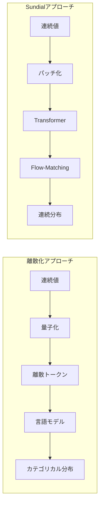

> 本記事は [Sundial: A Family of Highly Capable Time Series Foundation Models (arXiv:2502.00816)](https://arxiv.org/abs/2502.00816) の解説記事です。

## 論文概要（Abstract）

Sundialは、清華大学THUML（Tsinghua Machine Learning）グループが開発した時系列ファウンデーションモデル（TSFM）ファミリーである。従来のTSFMが時系列値を離散トークンに変換して処理するのに対し、Sundialは**flow-matching**に基づくTimeFlow Lossを用いて連続値のまま直接生成する。1兆（$10^{12}$）時点のデータセット「TimeBench」で事前学習され、点予測と確率的予測の両方においてゼロショットで高い性能を達成している。ICML 2025でOral採択（Top 1%）という評価を受けた。

この記事は [Zenn記事: 時系列ファウンデーションモデル2025-2026年最前線：Chronos-2・TimesFM・Sundialを徹底比較](https://zenn.dev/0h_n0/articles/5c2f14f0c06a8e) の深掘りです。

## 情報源

- **arXiv ID**: 2502.00816
- **URL**: [https://arxiv.org/abs/2502.00816](https://arxiv.org/abs/2502.00816)
- **著者**: Yong Liu, Guo Qin, Zhiyuan Shi, Zhi Chen, Caiyin Yang, Xiangdong Huang, Jianmin Wang, Mingsheng Long
- **発表年**: 2025
- **分野**: cs.LG, stat.ML
- **採択**: ICML 2025 Oral（Top 1%）

## 背景と動機（Background & Motivation）

時系列ファウンデーションモデルの多くは、NLPのLLMにおけるトークン化手法を借用し、時系列値を離散トークンに変換して処理する。例えばChronosはスケーリング後の値を量子化ビンにマッピングし、T5で言語モデリングと同様に学習する。

しかし、この離散化アプローチには根本的な問題がある。

1. **情報損失**: 連続値を有限個のビンに丸めるため、微細な変動パターンが失われる
2. **分布の制約**: 離散分布（カテゴリカル分布）では、実際の時系列が持つ多峰性や非対称な分布を柔軟に表現しにくい
3. **ビン数のトレードオフ**: ビン数を増やせば精度は上がるが、語彙サイズの増加により計算コストが増大する

Sundialの著者らは、「時系列の連続的な性質を尊重し、離散化を回避する」ことでこれらの問題を根本的に解決しようとした。

## 主要な貢献（Key Contributions）

- **貢献1**: Flow-matchingに基づく**TimeFlow Loss**の提案。離散トークン化を回避し、連続値の確率分布を直接学習する
- **貢献2**: 1兆時点規模のデータセット**TimeBench**のキュレーション。実世界データと合成データの組み合わせで多様なドメインをカバー
- **貢献3**: ゼロショットで点予測・確率的予測の両方において、既存TSFMと同等以上の性能を達成。推論はミリ秒単位で完了

## 技術的詳細（Technical Details）

### TimeFlow Loss

Sundialの核心技術であるTimeFlow Lossは、**flow-matching**（フローマッチング）に基づく損失関数である。

Flow-matchingは、確率分布間の変換を学習する生成モデルの一手法であり、ノイズ分布から目標分布への連続的なフロー（流れ）を定義する。

$$
\mathcal{L}_{\text{TimeFlow}} = \mathbb{E}_{t, x_0, x_1}\left[\|v_\theta(x_t, t) - (x_1 - x_0)\|^2\right]
$$

ここで、
- $x_0$: ノイズ（標準正規分布からサンプリング）
- $x_1$: 実際の時系列値（次のパッチ）
- $x_t = (1-t)x_0 + tx_1$: 時刻$t$における中間状態（$t \in [0, 1]$）
- $v_\theta$: フローの速度場を推定するニューラルネットワーク（パラメータ$\theta$）
- $(x_1 - x_0)$: ノイズから実際値への最適輸送方向

直感的には、$v_\theta$は「ノイズ$x_0$から実際の時系列値$x_1$へ向かう最短経路の速度」を学習する。学習完了後、推論時にはノイズからスタートしてODEソルバーで経路を辿ることで、予測値を生成する。

### 離散化との比較



離散化アプローチでは出力がカテゴリカル分布に制限されるのに対し、Sundialのflow-matchingは**任意の連続分布**を表現できる。これにより、多峰分布や裾の重い分布など、実世界の時系列が持つ複雑な分布形状を柔軟に捕捉できる。

### アーキテクチャ

Sundialのアーキテクチャは、Transformerを「最小限かつ重要な適応」を施して時系列処理に用いている。

1. **パッチ入力**: 時系列を固定長のパッチに分割し、各パッチを1トークンとして扱う
2. **Decoder-only Transformer**: 因果的注意（causal attention）により、過去の情報のみを参照して未来を予測
3. **Flow-Matchingヘッド**: Transformerの出力をflow-matchingの条件として使用し、次のパッチの確率分布を生成

### 推論プロセス

推論時の予測生成は以下の手順で行われる。

1. 入力時系列をパッチ化してTransformerに入力
2. Transformerが各パッチの潜在表現を出力
3. 最終パッチの潜在表現を条件として、ノイズ$x_0 \sim \mathcal{N}(0, I)$からODEソルバーで$x_1$へフローを辿る
4. 得られた$x_1$が予測値

確率的予測が必要な場合は、異なるノイズ$x_0$から複数回サンプリングすることで、予測分布のサンプルを得る。点予測が必要な場合は、複数サンプルの平均やメディアンを使用する。

```python
# Sundialの推論の概念コード
import torch
from torchdiffeq import odeint

def sundial_predict(
    model: torch.nn.Module,
    context: torch.Tensor,
    n_samples: int = 100,
) -> torch.Tensor:
    """Sundialによる確率的予測

    Args:
        model: 学習済みSundialモデル
        context: 入力時系列パッチ (batch, n_patches, patch_len)
        n_samples: 生成するサンプル数

    Returns:
        予測サンプル (batch, n_samples, prediction_len)
    """
    # Transformerで潜在表現を取得
    hidden = model.transformer(context)  # (batch, n_patches, d_model)
    condition = hidden[:, -1, :]  # 最終パッチの表現

    # 複数のノイズからサンプリング
    samples = []
    for _ in range(n_samples):
        x0 = torch.randn_like(context[:, -1, :])  # ノイズ

        # ODEソルバーでフローを辿る
        def velocity_fn(t, x):
            return model.flow_head(x, t, condition)

        trajectory = odeint(velocity_fn, x0, torch.tensor([0.0, 1.0]))
        x1 = trajectory[-1]  # t=1での値が予測
        samples.append(x1)

    return torch.stack(samples, dim=1)
```

## 実装のポイント（Implementation）

### ODEソルバーの選択

Flow-matchingの推論ではODEソルバーが必要であり、ソルバーの選択が推論速度と精度のトレードオフに影響する。

- **Euler法**: 最も高速だがステップ数が多く必要。ステップ数10-20で実用的な精度
- **Dopri5（適応的ルンゲクッタ）**: 精度は高いが計算コストが増大。高精度な確率推定が必要な場合に使用
- **著者らの推奨**: Euler法でステップ数10-20が推論速度と精度のバランスに優れる

### 推論速度

著者らは、ゼロショット予測がミリ秒単位で完了すると報告している。flow-matchingの推論は、拡散モデルと比較してステップ数が少なくて済むため、実用的な速度を実現している。

### ファインチューニング

Sundialは128Mパラメータのモデルであり、ドメイン固有データでのファインチューニングも可能である。ただし、ゼロショット性能が高いため、ファインチューニングの必要性は対象ドメインの特殊性に依存する。

## Production Deployment Guide

### AWS実装パターン（コスト最適化重視）

| 規模 | 月間リクエスト | 推奨構成 | 月額コスト | 主要サービス |
|------|--------------|---------|-----------|------------|
| **Small** | ~3,000 (100/日) | Serverless | $60-180 | Lambda + SageMaker Serverless |
| **Medium** | ~30,000 (1,000/日) | Hybrid | $350-900 | SageMaker Real-time + ElastiCache |
| **Large** | 300,000+ (10,000/日) | Container | $2,000-5,000 | EKS + GPU Spot + Karpenter |

**コスト削減テクニック**:
- Sundialの128Mパラメータは比較的軽量であり、ml.g5.xlargeで十分な推論速度
- Euler法でのODEステップ数を10に制限することで推論コスト削減
- 確率的予測のサンプル数を要件に応じて調整（10-100サンプル）
- SageMaker Batch Transformで大量バッチ処理時にコスト50%削減

**コスト試算の注意事項**:
- 上記は2026年3月時点のAWS ap-northeast-1（東京）リージョン料金に基づく概算値です
- ODEソルバーのステップ数やサンプル数により、推論時間（≒コスト）が変動します
- 最新料金は [AWS料金計算ツール](https://calculator.aws/) で確認してください

### Terraformインフラコード

```hcl
# --- SageMaker Endpoint for Sundial ---
resource "aws_iam_role" "sagemaker_sundial" {
  name = "sagemaker-sundial-role"

  assume_role_policy = jsonencode({
    Version = "2012-10-17"
    Statement = [{
      Action = "sts:AssumeRole"
      Effect = "Allow"
      Principal = { Service = "sagemaker.amazonaws.com" }
    }]
  })
}

resource "aws_sagemaker_model" "sundial" {
  name               = "sundial-128m"
  execution_role_arn = aws_iam_role.sagemaker_sundial.arn

  primary_container {
    image          = "763104351884.dkr.ecr.ap-northeast-1.amazonaws.com/pytorch-inference:2.1-gpu-py310"
    model_data_url = "s3://sundial-model-artifacts/sundial-128m/model.tar.gz"
    environment = {
      ODE_STEPS    = "15"
      N_SAMPLES    = "50"
    }
  }
}

resource "aws_sagemaker_endpoint_configuration" "sundial" {
  name = "sundial-serverless"
  production_variants {
    variant_name = "primary"
    model_name   = aws_sagemaker_model.sundial.name
    serverless_config {
      memory_size_in_mb = 6144
      max_concurrency   = 5
    }
  }
}

resource "aws_sagemaker_endpoint" "sundial" {
  name                 = "sundial-endpoint"
  endpoint_config_name = aws_sagemaker_endpoint_configuration.sundial.name
}
```

### 運用・監視設定

```sql
-- CloudWatch Logs Insights: 推論レイテンシ分析
fields @timestamp, ModelLatency, InvocationsPerInstance
| stats pct(ModelLatency, 95) as p95_ms, avg(ModelLatency) as avg_ms by bin(5m)
| filter p95_ms > 5000000
```

### コスト最適化チェックリスト

- [ ] ODE Eulerステップ数を10-15に制限（精度とコストのバランス）
- [ ] サンプル数を用途別に調整（点予測: 10, 確率的予測: 50-100）
- [ ] SageMaker Serverlessでアイドルコストゼロ化
- [ ] Batch Transform活用で大量処理50%削減
- [ ] GPU Spot Instancesで最大90%削減
- [ ] CloudWatch + AWS Budgets設定

## 実験結果（Results）

### ベンチマーク性能

著者らは、Sundialがゼロショットの点予測と確率的予測の両方で既存のTSFMと同等以上の性能を達成したと報告している。

論文のAbstractでは「state-of-the-art results on both point and probabilistic forecasting benchmarks」と記載されている。特にCRPS（Continuous Ranked Probability Score）指標での性能が注目される。CRPSは確率的予測の品質を測定する指標であり、flow-matchingの柔軟な分布表現がこの指標で有利に働くと考えられる。

### 推論速度

「ゼロショット予測を数ミリ秒で完了する」と報告されており、実用的な推論レイテンシを実現している。

**注意**: 具体的なベンチマークスコアの比較は、GIFT-Eval公式リーダーボードの最新結果で確認すべきである。論文発表後に登場したChronos-2やTimesFM-2.5との直接比較は、論文中には含まれていない。

## 実運用への応用（Practical Applications）

### 不確実性定量化が重要なユースケース

Sundialのflow-matchingは、任意の連続分布を表現できるため、以下のユースケースで特に有効である。

- **需要予測の安全在庫計算**: 予測分布の裾（95パーセンタイル等）を使って安全在庫量を決定
- **エネルギー市場の価格予測**: 電力価格の多峰分布をモデル化
- **金融リスク管理**: VaR（Value at Risk）やCVaR計算に分布サンプルを直接利用

### スケーリング戦略

128Mパラメータは比較的軽量であり、単一GPU（T4/A10G）で十分な推論性能が得られる。大量の時系列を一括処理する場合は、バッチ処理とGPU並列化を組み合わせることで、コストを抑えつつスループットを確保できる。

## 関連研究（Related Work）

- **Chronos (arXiv:2403.07815)**: T5ベースの量子化アプローチ。Sundialが「離散化の回避」で差別化を図る比較対象
- **TimesFM (arXiv:2310.03589)**: Decoder-onlyのパッチベースモデル。パラメータ効率ではTimesFMが優位
- **Flow Matching for Generative Modeling (Lipman et al., 2023)**: Sundialが採用するflow-matchingの理論的基盤

## まとめと今後の展望

Sundialは、flow-matchingという生成モデル技術を時系列予測に応用することで、離散化の制約を回避した点に学術的な新規性がある。ICML 2025 Oral採択（Top 1%）は、この新規性と実験的成果が高く評価された結果である。

実務的には、確率的予測の品質が特に重要なドメイン（リスク管理、安全在庫計算等）でSundialの強みが発揮される。一方、共変量対応は現時点では限定的であり、共変量が重要なタスクではChronos-2やTimesFM-2.5が優位となる。今後、Sundialに共変量対応やICL能力が追加されるかが注目ポイントである。

## 参考文献

- **arXiv**: [https://arxiv.org/abs/2502.00816](https://arxiv.org/abs/2502.00816)
- **Code**: [https://github.com/thuml/Sundial](https://github.com/thuml/Sundial)
- **TimeBench Dataset**: 論文内で定義（1兆時点）
- **Related Zenn article**: [https://zenn.dev/0h_n0/articles/5c2f14f0c06a8e](https://zenn.dev/0h_n0/articles/5c2f14f0c06a8e)
