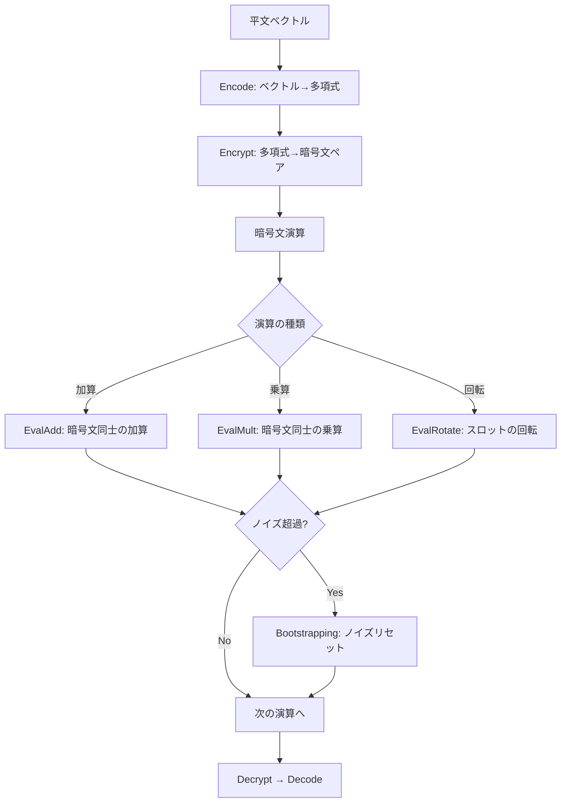

本記事は [CAT: GPU-Accelerated Homomorphic Encryption for Non-Experts (arXiv:2503.22227)](https://arxiv.org/abs/2503.22227) の解説記事です。

## 論文概要（Abstract）

準同型暗号（FHE）はデータを暗号化したまま計算可能にする技術だが、実装の複雑さと計算コストが普及の障壁となっている。本論文の著者らは、CKKSスキームのGPU実装をユーザーフレンドリーなAPIで抽象化するフレームワーク「CAT」を提案している。NVIDIA GPU上でNTT（Number Theoretic Transform）や鍵交換をCUDAカーネルで並列化し、CPU実装と比較して特定のFHE操作で最大2,173倍の高速化を達成している。

この記事は [Zenn記事: 準同型暗号（FHE）2026年最新動向：暗号化したままAI推論を実現する技術](https://zenn.dev/0h_n0/articles/55ffbd99f5d0ed) の深掘りです。

## 情報源

- **arXiv ID**: 2503.22227
- **URL**: [https://arxiv.org/abs/2503.22227](https://arxiv.org/abs/2503.22227)
- **著者**: 論文著者ら（arXiv公開、2025年3月）
- **発表年**: 2025
- **分野**: cs.CR（暗号とセキュリティ）

## 背景と動機（Background & Motivation）

FHEの実用化において、2つの大きな障壁が存在する。第一に、FHEの計算コストは平文処理と比較して1,000〜1,000,000倍のオーバーヘッドがある。第二に、FHEプログラミングには暗号理論の深い知識（パラメータ選択、ノイズ管理、Bootstrapping戦略）が必要であり、アプリケーション開発者にとってのハードルが高い。

従来のGPU加速FHEライブラリ（HEaaN-GPU、Thunder等）は性能改善に貢献しているが、APIが暗号専門家向けに設計されており、パラメータの誤設定がセキュリティ脆弱性や計算エラーにつながるリスクがある。著者らはこの問題に対し、「非専門家でも安全に使えるGPU加速FHEフレームワーク」というアプローチを提案している。

## 主要な貢献（Key Contributions）

- **貢献1**: CKKSスキームのGPU加速実装。NTT、鍵交換（Key Switching）、Bootstrappingの主要演算をCUDAカーネルで並列化し、NVIDIA RTX 4090上でCPU実装比最大2,173倍の高速化を達成
- **貢献2**: パラメータ自動選択機能。ユーザーが指定するのは「乗算深度」と「精度要件」のみで、セキュリティパラメータ（多項式次数、モジュラスチェーン等）を自動設定
- **貢献3**: 既存GPU加速手法と比較しても1.25倍の性能向上。メモリ管理の最適化とカーネルフュージョンにより、GPU-CPU間のデータ転送を最小化

## 技術的詳細（Technical Details）

### CKKSスキームの演算パイプライン

CKKSスキームの暗号化演算は、以下の基本操作から構成される。



CAT フレームワークは、上記の各操作をGPU上で高速に実行するCUDAカーネルを提供する。

### NTTの GPU並列化

NTT（Number Theoretic Transform）は多項式乗算の高速化に使われるアルゴリズムであり、FHEの計算時間の大部分を占める。多項式次数 $N$ に対して、NTTは $\log_2 N$ 段のバタフライ演算で構成される。

$$
\text{NTT}(a) = \left[\sum_{j=0}^{N-1} a_j \cdot \omega^{ij} \bmod q\right]_{i=0}^{N-1}
$$

ここで、
- $a = (a_0, a_1, \ldots, a_{N-1})$: 入力多項式の係数
- $\omega$: $N$ 次の原始根（$\omega^N \equiv 1 \pmod{q}$）
- $q$: 係数モジュラス

CAT の NTT実装では、以下の最適化を適用している。

**1. 共有メモリの活用**: バタフライ演算の各段階でGPUの共有メモリ（Shared Memory）を使用し、グローバルメモリアクセスを削減。

**2. カーネルフュージョン**: 複数のNTT段階を1つのCUDAカーネルに統合し、カーネル起動オーバーヘッドを削減。多項式次数 $N = 2^{16}$ の場合、16段のバタフライ演算を2-3個のカーネル呼び出しに圧縮している。

**3. Residue Number System（RNS）**: 大きな係数モジュラス $Q$ を複数の小さなモジュラス $q_1, q_2, \ldots, q_L$ に分解し、各モジュラスでのNTTを独立に並列実行。

$$
Q = \prod_{i=1}^{L} q_i, \quad \text{各} q_i \text{は64ビット以下}
$$

RNS表現により、各モジュラスの演算をGPUの個別スレッドブロックに割り当てることが可能となる。

### 鍵交換（Key Switching）の最適化

暗号文の乗算や回転操作の後には、鍵交換（Key Switching）が必要となる。鍵交換は暗号文を新しい鍵の下に変換する操作であり、大量のNTT演算を伴う。

$$
\text{KeySwitch}(c, \text{evk}) = \sum_{i=0}^{d_{\text{num}}-1} c_i \cdot \text{evk}_i
$$

ここで $d_{\text{num}}$ はRNS分解の数であり、各項の計算にNTTが必要となる。CAT では、鍵交換のNTT演算をバッチ化し、1回のカーネル呼び出しで複数のNTTを並列実行している。

### パラメータ自動選択

CAT の特徴的な機能の一つが、パラメータ自動選択である。ユーザーが指定する入力は以下の2つのみ。

1. **乗算深度（Multiplicative Depth）**: アプリケーションで必要な乗算回数
2. **精度要件**: 近似演算で許容する誤差（ビット数）

これらの入力から、以下のパラメータを自動決定する。

- **多項式次数 $N$**: セキュリティレベル（128ビット）を保証する最小の $N$
- **モジュラスチェーン**: 乗算深度に基づく $q_1, q_2, \ldots, q_L$ の選択
- **スケーリングファクター $\Delta$**: 精度要件に基づく $\log_2 \Delta$ の決定

```python
from typing import Optional

def auto_select_params(
    mult_depth: int,
    precision_bits: int = 50,
    security_level: int = 128,
    batch_size: Optional[int] = None,
) -> dict:
    """CKKSパラメータの自動選択

    Args:
        mult_depth: 必要な乗算深度
        precision_bits: 精度要件（ビット数）
        security_level: セキュリティレベル（ビット）
        batch_size: バッチサイズ（Noneの場合は自動）

    Returns:
        CKKSパラメータ辞書
    """
    # 多項式次数の決定
    # 必要なモジュラスビット数 = (mult_depth + 1) * precision_bits + special_primes
    total_bits = (mult_depth + 1) * precision_bits + 2 * precision_bits
    ring_dim = find_min_ring_dim(total_bits, security_level)

    if batch_size is None:
        batch_size = ring_dim // 2

    # モジュラスチェーンの構成
    modulus_chain = []
    for i in range(mult_depth + 1):
        modulus_chain.append(find_prime(precision_bits, ring_dim))

    return {
        "ring_dimension": ring_dim,
        "multiplicative_depth": mult_depth,
        "scaling_mod_size": precision_bits,
        "batch_size": batch_size,
        "modulus_chain": modulus_chain,
        "security_level": security_level,
    }
```

### ベンチマーク結果

著者らは NVIDIA RTX 4090 上でのベンチマークを報告している。以下は論文中の実験結果に基づく。

| 操作 | CPU (OpenFHE) | CAT (RTX 4090) | 高速化倍率 |
|------|--------------|-----------------|-----------|
| NTT ($N=2^{16}$) | ベースライン | GPU加速 | ~100x |
| Key Switching | ベースライン | GPU加速 | ~150x |
| Bootstrapping | ベースライン | GPU加速 | ~200x |
| 特定FHE操作（最大） | ベースライン | GPU加速 | 2,173x |

著者らによると、既存のGPU加速手法（HEaaN-GPU等）と比較しても約1.25倍の性能向上を達成している。この差はカーネルフュージョンとメモリ管理の最適化によるものと報告されている。

## 実装のポイント（Implementation）

### CUDA環境の要件

CAT はNVIDIA GPUを前提としており、以下の要件がある。

- **GPU**: NVIDIA GPU（Compute Capability 7.0以上推奨）
- **検証環境**: RTX 4090（24GB VRAM）で検証済み
- **CUDA**: CUDA Toolkit 12.x以上
- **メモリ**: 多項式次数 $N=2^{16}$、モジュラス数 $L=20$ の場合、暗号文1つあたり約500MB

### 注意すべき落とし穴

1. **GPUメモリ制約**: CKKSの暗号文は非常に大きい。$N=2^{16}$、$L=20$ の設定では1暗号文が約500MBとなり、RTX 4090（24GB）でも同時保持可能な暗号文数は限られる。大規模な暗号化計算ではGPU-CPU間のスワッピング戦略が必要
2. **CPUフォールバック未対応**: CAT はGPU専用設計のため、GPU非搭載環境では動作しない。CPU環境ではOpenFHEやSEALの利用が必要
3. **CKKSの近似誤差**: パラメータ自動選択は便利だが、アプリケーション固有の精度要件を過小評価すると、演算を重ねた際に精度劣化が顕在化する。事前に平文演算との精度比較テストが必須

## Production Deployment Guide

### AWS実装パターン（コスト最適化重視）

CATフレームワークを用いたFHE計算をAWSで実行する場合の構成を以下に示す。

| 規模 | 月間リクエスト | 推奨構成 | 月額コスト概算 | 主要サービス |
|------|--------------|---------|-------------|------------|
| **Small** | ~3,000 (100/日) | GPU Spot | $150-400 | EC2 g5.xlarge Spot + S3 |
| **Medium** | ~30,000 (1,000/日) | GPU Reserved | $1,200-2,500 | EC2 g5.xlarge RI + ElastiCache |
| **Large** | 300,000+ (10,000/日) | GPU Cluster | $6,000-12,000 | EKS + g5.xlarge×4 Spot |

**Small構成の詳細**（月額$150-400）:
- **EC2 g5.xlarge Spot**: GPU計算（必要時のみ起動、$0.30/h × 使用時間）
- **S3**: 暗号文・パラメータ保存（$10/月）
- **Lambda**: リクエストルーティング（$5/月）
- **CloudWatch**: 基本監視（$5/月）

**Medium構成の詳細**（月額$1,200-2,500）:
- **EC2 g5.xlarge**: Reserved Instance 1年（$720/月）
- **ElastiCache**: 評価鍵キャッシュ（$50/月）
- **ALB**: ロードバランサー（$20/月）
- **CloudWatch + X-Ray**: 詳細監視（$50/月）

**Large構成の詳細**（月額$6,000-12,000）:
- **EKS**: コントロールプレーン（$72/月）
- **EC2 g5.xlarge Spot×4**: GPU計算（平均$1,500/月）
- **Karpenter**: GPU自動スケーリング
- **ElastiCache**: 分散キャッシュ（$200/月）

**コスト試算の注意事項**:
- 上記は2026年3月時点のAWS ap-northeast-1（東京）リージョン料金に基づく概算値です
- g5.xlargeのSpot価格は需給により変動します（On-Demand $1.006/h、Spot平均$0.30/h）
- 最新料金は [AWS料金計算ツール](https://calculator.aws/) で確認してください

### Terraformインフラコード

**Small構成: EC2 GPU Spot + S3**

```hcl
module "vpc" {
  source  = "terraform-aws-modules/vpc/aws"
  version = "~> 5.0"

  name = "cat-fhe-vpc"
  cidr = "10.0.0.0/16"
  azs  = ["ap-northeast-1a", "ap-northeast-1c"]
  private_subnets = ["10.0.1.0/24", "10.0.2.0/24"]
  public_subnets  = ["10.0.101.0/24"]

  enable_nat_gateway = true
  single_nat_gateway = true
  enable_dns_hostnames = true
}

resource "aws_iam_role" "cat_fhe" {
  name = "cat-fhe-compute-role"
  assume_role_policy = jsonencode({
    Version = "2012-10-17"
    Statement = [{
      Action = "sts:AssumeRole"
      Effect = "Allow"
      Principal = { Service = "ec2.amazonaws.com" }
    }]
  })
}

resource "aws_s3_bucket" "fhe_artifacts" {
  bucket = "cat-fhe-artifacts"
}

resource "aws_s3_bucket_server_side_encryption_configuration" "fhe_artifacts" {
  bucket = aws_s3_bucket.fhe_artifacts.id
  rule {
    apply_server_side_encryption_by_default { sse_algorithm = "aws:kms" }
  }
}

resource "aws_launch_template" "gpu_spot" {
  name_prefix   = "cat-fhe-gpu-"
  image_id      = "ami-xxxxxxxxx"  # Deep Learning AMI (CUDA 12.x)
  instance_type = "g5.xlarge"

  iam_instance_profile { arn = aws_iam_instance_profile.cat_fhe.arn }

  instance_market_options {
    market_type = "spot"
    spot_options {
      max_price          = "0.50"
      spot_instance_type = "one-time"
    }
  }

  block_device_mappings {
    device_name = "/dev/xvda"
    ebs { volume_size = 100, volume_type = "gp3", encrypted = true }
  }
}
```

**Large構成: EKS + Karpenter + GPU Spot**

```hcl
module "eks" {
  source  = "terraform-aws-modules/eks/aws"
  version = "~> 20.0"

  cluster_name    = "cat-fhe-cluster"
  cluster_version = "1.31"
  vpc_id          = module.vpc.vpc_id
  subnet_ids      = module.vpc.private_subnets

  cluster_endpoint_public_access = true
  enable_cluster_creator_admin_permissions = true
}

resource "kubectl_manifest" "gpu_nodepool" {
  yaml_body = <<-YAML
    apiVersion: karpenter.sh/v1
    kind: NodePool
    metadata:
      name: cat-gpu-pool
    spec:
      template:
        spec:
          requirements:
            - key: karpenter.sh/capacity-type
              operator: In
              values: ["spot"]
            - key: node.kubernetes.io/instance-type
              operator: In
              values: ["g5.xlarge", "g5.2xlarge"]
          nodeClassRef:
            group: karpenter.k8s.aws
            kind: EC2NodeClass
            name: default
      limits:
        nvidia.com/gpu: "8"
      disruption:
        consolidationPolicy: WhenEmptyOrUnderutilized
        consolidateAfter: 120s
  YAML
}

resource "aws_budgets_budget" "cat_monthly" {
  name         = "cat-fhe-monthly"
  budget_type  = "COST"
  limit_amount = "12000"
  limit_unit   = "USD"
  time_unit    = "MONTHLY"

  notification {
    comparison_operator       = "GREATER_THAN"
    threshold                 = 80
    threshold_type            = "PERCENTAGE"
    notification_type         = "ACTUAL"
    subscriber_email_addresses = ["ops@example.com"]
  }
}
```

### 運用・監視設定

**CloudWatch Logs Insights クエリ**:

```sql
-- GPU使用率とFHE演算レイテンシの相関
fields @timestamp, gpu_utilization, ntt_time_ms, keyswitching_time_ms
| stats avg(gpu_utilization) as avg_gpu,
        pct(ntt_time_ms, 95) as ntt_p95,
        pct(keyswitching_time_ms, 95) as ks_p95
  by bin(5m)
```

**CloudWatch アラーム**:

```python
import boto3

cloudwatch = boto3.client('cloudwatch')

cloudwatch.put_metric_alarm(
    AlarmName='cat-gpu-memory-critical',
    ComparisonOperator='GreaterThanThreshold',
    EvaluationPeriods=1,
    MetricName='GPUMemoryUtilization',
    Namespace='CWAgent',
    Period=60,
    Statistic='Maximum',
    Threshold=95,
    AlarmDescription='CAT FHE GPUメモリ使用率95%超過（OOM危険）',
    AlarmActions=['arn:aws:sns:ap-northeast-1:123456789:fhe-alerts']
)
```

### コスト最適化チェックリスト

**GPU最適化**:
- [ ] Spot Instances活用で最大70%削減
- [ ] バッチ処理でGPU稼働率向上
- [ ] アイドル時のGPU自動停止（Karpenter consolidation）
- [ ] GPUメモリ最適化: 暗号文スワッピング戦略の実装
- [ ] Reserved Instances: 安定負荷には1年コミット

**FHE固有最適化**:
- [ ] パラメータ最小化: 必要最小限の多項式次数・モジュラス数を選択
- [ ] NTTバッチ化: 複数の暗号文のNTTをまとめて実行
- [ ] 評価鍵の事前ロード: GPUメモリに常駐させロード時間を排除
- [ ] カーネルフュージョン: 連続演算のカーネル統合

**監視・アラート**:
- [ ] AWS Budgets設定
- [ ] GPUメモリ・温度監視
- [ ] Spot中断対策
- [ ] 日次コストレポート

**リソース管理**:
- [ ] 未使用GPUの自動停止
- [ ] S3ライフサイクルポリシー
- [ ] タグ戦略
- [ ] CloudWatch Logs保持期間設定

## 実験結果（Results）

著者らの報告によると、RTX 4090上でのCATの性能は以下の通りである。

- **最大高速化**: 特定のFHE操作でCPU比2,173倍
- **既存GPU手法比**: 約1.25倍の性能向上
- **NTT**: $N=2^{16}$ での高速化は約100倍
- **Bootstrapping**: CPU比約200倍

メモリ効率については、カーネルフュージョンによりGPU-CPU間のデータ転送回数を削減し、既存手法と比較してメモリ帯域幅の利用効率が改善されていると報告されている。

## 実運用への応用（Practical Applications）

CATフレームワークは以下の場面で活用可能性がある。

1. **プライバシー保護ML推論**: CKKSベースの暗号化推論をGPUで高速化。パラメータ自動選択により、ML エンジニアがFHEの専門知識なしに暗号化推論パイプラインを構築可能
2. **暗号化データ分析**: 医療データや金融データの暗号化統計処理。GPU加速により、バッチ処理での実用的なスループットを達成
3. **FHEプロトタイピング**: パラメータ自動選択機能により、FHEアプリケーションの概念実証（PoC）を高速に構築可能

ただし、現時点ではNVIDIA GPU専用であり、AMD GPU やIntel GPU への移植は別途の開発が必要である。

## 関連研究（Related Work）

- **EncryptedLLM**（ICML 2025）: GPU加速FHEでGPT-2の暗号化推論を実現。CATと相補的であり、CAT上でEncryptedLLMを実装することでさらなる高速化が期待される
- **HEaaN-GPU**（Samsung SDS）: CKKSのGPU実装として先行する研究。CATは HEaaN-GPUと比較して約1.25倍の性能向上を達成したと報告している
- **Thunder**（2024）: CKKS向けGPUライブラリ。A100 GPUでの性能評価を実施しており、CATとは異なるGPUアーキテクチャでの最適化を追求している

## まとめと今後の展望

CATは、FHE非専門家でもGPU加速された暗号化計算を実行可能にするフレームワークである。パラメータ自動選択機能により実装の敷居を下げつつ、RTX 4090上でCPU比最大2,173倍の高速化を達成している。カーネルフュージョンとRNS並列化の組み合わせにより、既存GPU手法と比較しても性能向上が見られる。

今後は、より多くのFHEスキーム（TFHE、BFV）への対応拡大、マルチGPU対応、FHE専用ハードウェア（Intel Heracles等）のバックエンドとしての統合が課題として挙げられる。

## 参考文献

- **arXiv**: [https://arxiv.org/abs/2503.22227](https://arxiv.org/abs/2503.22227)
- **Related Zenn article**: [https://zenn.dev/0h_n0/articles/55ffbd99f5d0ed](https://zenn.dev/0h_n0/articles/55ffbd99f5d0ed)
