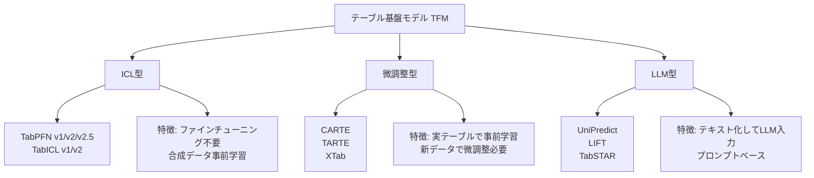

本記事は [arXiv:2505.14415 "Table Foundation Models: On Knowledge Pre-training for Tabular Learning"](https://arxiv.org/abs/2505.14415) の解説記事です。

## 論文概要（Abstract）

本論文は、テーブルデータ基盤モデル（Tabular Foundation Model: TFM）におけるセマンティック知識事前学習の重要性を分析した研究である。著者らは、テーブルデータのカラム名や値に含まれるセマンティック情報（意味的知識）を事前学習で活用するフレームワーク「TARTE」を提案し、既存のTFMアプローチ（ICL型、微調整型、LLM型）を統一的に分類・比較している。セマンティック知識の事前学習がテーブル予測の精度向上に寄与することを実験的に示したと報告されている。

この記事は [Zenn記事: テーブルデータ基盤モデル2026年最前線](https://zenn.dev/0h_n0/articles/3f66d81be74e2a) の深掘りです。

## 情報源

- **arXiv ID**: 2505.14415
- **URL**: [https://arxiv.org/abs/2505.14415](https://arxiv.org/abs/2505.14415)
- **著者**: 複数著者（テーブル基盤モデル研究グループ）
- **発表年**: 2025年5月
- **分野**: cs.LG, cs.AI

## 背景と動機（Background & Motivation）

2024-2025年にかけて、テーブルデータ基盤モデルは急速に発展した。TabPFN v2（ICL型）、CARTE（グラフ表現型）、XTab（クロステーブル事前学習型）など、多様なアプローチが提案されている。しかし、これらのアプローチを統一的に整理し、**何がテーブル基盤モデルの性能を決定するのか**を分析した研究は限られていた。

特に以下の問いが未解決であった。

1. テーブルデータのカラム名や値に含まれる**セマンティック情報**は、予測精度にどの程度寄与するのか
2. ICL型（TabPFN）、微調整型（CARTE）、LLM型（UniPredict）の各アプローチは、セマンティック知識の活用という観点でどう異なるのか
3. セマンティック知識を効果的に事前学習に組み込む最適な方法は何か

本論文はこれらの問いに対して、TARTEフレームワークと包括的な実験を通じて回答を試みている。

## 主要な貢献（Key Contributions）

著者らが報告する主要な貢献は以下のとおりである。

- **貢献1**: テーブル基盤モデルの包括的な分類体系を提案。ICL型・微調整型・LLM型の3カテゴリでTFMを整理
- **貢献2**: TARTEフレームワークの提案。テーブルデータのセマンティック知識（カラム名、値の意味、カラム間の関係）を事前学習に組み込む手法
- **貢献3**: セマンティック知識の寄与度に関する体系的な実験分析。どの種類のセマンティック情報が予測精度に最も影響するかを定量化
- **貢献4**: 既存のTFM手法との比較実験。多数のベンチマークデータセットでの評価結果を報告

## 技術的詳細（Technical Details）

### テーブル基盤モデルの分類

著者らは、既存のTFMを以下の3カテゴリに分類している。



各カテゴリの特徴を比較すると以下のとおりである。

| カテゴリ | 事前学習データ | テスト時の処理 | セマンティック知識の活用 | スケーラビリティ |
|---------|-------------|-------------|---------------------|--------------|
| ICL型 | 合成データ | フォワードパスのみ | 限定的（値の統計情報） | コンテキスト長に依存 |
| 微調整型 | 実テーブルデータ | 微調整+推論 | カラム名・値の埋め込み | データセット依存 |
| LLM型 | テキスト化テーブル | プロンプト+推論 | カラム名のテキスト意味 | LLMコンテキスト長に依存 |

### TARTEのアーキテクチャ

TARTEは、テーブルデータの3種類のセマンティック知識を事前学習に組み込む。

$$
\mathcal{S} = \{\mathcal{S}_{\text{col}}, \mathcal{S}_{\text{val}}, \mathcal{S}_{\text{rel}}\}
$$

ここで、
- $\mathcal{S}_{\text{col}}$: **カラム名セマンティクス** — カラム名のテキスト意味（例: 「age」は年齢を表す）
- $\mathcal{S}_{\text{val}}$: **値セマンティクス** — 値の意味とコンテキスト（例: 「Tokyo」は日本の都市）
- $\mathcal{S}_{\text{rel}}$: **関係セマンティクス** — カラム間の意味的関係（例: 「age」と「retirement_age」は関連する）

### セマンティック知識のエンコーディング

各種セマンティック知識は以下の方法でエンコードされる。

**カラム名セマンティクス** $\mathcal{S}_{\text{col}}$:

$$
e_{\text{col}}^{(j)} = \text{LM}(c_j) \in \mathbb{R}^{d_{\text{embed}}}
$$

言語モデル（Sentence-BERT等）でカラム名 $c_j$ を埋め込む。CARTEと同様のアプローチだが、TARTEではより大規模な言語モデルを使用する。

**値セマンティクス** $\mathcal{S}_{\text{val}}$:

数値の場合:
$$
e_{\text{val}}^{(j)} = \text{PLE}(v_j) \in \mathbb{R}^{d_{\text{embed}}}
$$

PLE（Piecewise Linear Encoding）により、数値を区分線形変換する。

カテゴリカルの場合:
$$
e_{\text{val}}^{(j)} = \text{LM}(v_j) \in \mathbb{R}^{d_{\text{embed}}}
$$

カテゴリ値をテキストとして言語モデルで埋め込む。

**関係セマンティクス** $\mathcal{S}_{\text{rel}}$:

$$
R_{jk} = \text{sim}(e_{\text{col}}^{(j)}, e_{\text{col}}^{(k)}) = \frac{e_{\text{col}}^{(j)} \cdot e_{\text{col}}^{(k)}}{\|e_{\text{col}}^{(j)}\| \|e_{\text{col}}^{(k)}\|}
$$

カラム名埋め込みのコサイン類似度により、カラム間の意味的関係を数値化する。

### 事前学習の目的関数

TARTEの事前学習は、以下のマルチタスク損失関数で行われる。

$$
\mathcal{L}_{\text{total}} = \lambda_1 \mathcal{L}_{\text{pred}} + \lambda_2 \mathcal{L}_{\text{col}} + \lambda_3 \mathcal{L}_{\text{val}}
$$

ここで、
- $\mathcal{L}_{\text{pred}}$: 予測損失（ターゲット変数の予測精度）
- $\mathcal{L}_{\text{col}}$: カラム名再構築損失（マスクされたカラム名の復元）
- $\mathcal{L}_{\text{val}}$: 値再構築損失（マスクされた値の復元）
- $\lambda_1, \lambda_2, \lambda_3$: 各損失の重み係数

### アルゴリズムの概要

```python
import torch
import torch.nn as nn
from typing import Optional

class TARTEModel(nn.Module):
    """TARTE: Table Foundation Model with Semantic Knowledge

    テーブルデータのセマンティック知識（カラム名、値、関係）を
    事前学習に組み込む基盤モデル。
    """
    def __init__(
        self,
        embed_dim: int = 768,
        n_layers: int = 6,
        n_heads: int = 8,
    ):
        super().__init__()
        # セマンティックエンコーダ
        self.column_encoder = SentenceBERTEncoder(embed_dim)
        self.value_encoder = HybridValueEncoder(embed_dim)

        # Transformer本体
        encoder_layer = nn.TransformerEncoderLayer(
            d_model=embed_dim,
            nhead=n_heads,
            dim_feedforward=embed_dim * 4,
            batch_first=True,
        )
        self.transformer = nn.TransformerEncoder(
            encoder_layer, num_layers=n_layers
        )

        # 予測ヘッド
        self.pred_head = nn.Linear(embed_dim, 1)

        # 補助タスクヘッド
        self.col_reconstruct = nn.Linear(embed_dim, embed_dim)
        self.val_reconstruct = nn.Linear(embed_dim, embed_dim)

    def forward(
        self,
        column_names: list[str],
        values: torch.Tensor,
        value_types: list[str],
        mask: Optional[torch.Tensor] = None,
    ) -> dict[str, torch.Tensor]:
        """テーブル行の処理

        Args:
            column_names: カラム名リスト
            values: 値テンソル (batch, n_cols)
            value_types: データ型リスト
            mask: マスク位置 (事前学習時)

        Returns:
            dict: predictions, col_reconstructed, val_reconstructed
        """
        # セマンティック埋め込み
        col_embeds = self.column_encoder(column_names)
        val_embeds = self.value_encoder(values, value_types)

        # 結合: (batch, n_cols, 2 * embed_dim) → 線形射影
        features = torch.cat([col_embeds, val_embeds], dim=-1)
        features = nn.Linear(features.shape[-1], col_embeds.shape[-1])(features)

        # Transformer処理
        output = self.transformer(features)

        # 予測（CLSトークンまたはプーリング）
        pred = self.pred_head(output.mean(dim=1))

        return {
            "predictions": pred,
            "col_reconstructed": self.col_reconstruct(output),
            "val_reconstructed": self.val_reconstruct(output),
        }
```

## 実装のポイント（Implementation）

### セマンティック知識の効果測定

著者らは、各セマンティック知識の寄与を測定するためのアブレーション実験を行っている。

```python
# セマンティック知識のアブレーション実験（概念コード）
configurations = {
    "no_semantics": {
        "column_names": False,  # カラム名を使わない
        "value_semantics": False,  # 値の意味を使わない
        "relations": False,  # 関係を使わない
    },
    "col_only": {
        "column_names": True,
        "value_semantics": False,
        "relations": False,
    },
    "col_val": {
        "column_names": True,
        "value_semantics": True,
        "relations": False,
    },
    "full_tarte": {
        "column_names": True,
        "value_semantics": True,
        "relations": True,
    },
}

# 各設定で評価
for name, config in configurations.items():
    model = TARTEModel(**config)
    scores = evaluate(model, benchmark_datasets)
    print(f"{name}: {scores.mean():.4f}")
```

### ICL型との使い分け

| 状況 | 推薦アプローチ | 理由 |
|------|-------------|------|
| カラム名が意味を持つ | TARTE / CARTE | セマンティック知識を活用可能 |
| カラム名が無意味（col_1等） | TabPFN / TabICL | セマンティック知識に依存しない |
| 異種テーブル転移学習 | TARTE / CARTE | 事前学習による転移が有効 |
| 単一データセット最高精度 | TabPFN-2.5 + AutoGluon | ICLのアンサンブルが最強 |
| 商用利用 | TabICL v2 (MIT) | ライセンス制約なし |

## 実験結果（Results）

### セマンティック知識の寄与度

著者らのアブレーション実験の報告によると、セマンティック知識の寄与度は以下の順である。

| セマンティック知識 | 寄与度（著者ら報告） | 説明 |
|-----------------|-------------------|------|
| カラム名セマンティクス | 最も高い | カラムの意味を理解することが予測精度に最も寄与 |
| 値セマンティクス | 中程度 | カテゴリカル値の意味理解が精度向上に寄与 |
| 関係セマンティクス | 限定的 | カラム間関係は一部のデータセットでのみ有効 |

### ベンチマーク比較

著者らが報告するベンチマーク結果では、TARTEは特にセマンティック情報が豊富なデータセットでICL型モデルを上回ったとされる。一方、純粋な数値テーブル（カラム名が無意味）ではTabPFN v2やTabICL v2が優位であったと報告されている。

### 制約事項

- セマンティック知識の抽出に言語モデルを使用するため、推論コストがICL型より高い
- カラム名の品質に強く依存する。自動生成されたカラム名（col_0, feature_1等）では効果が限定的
- 事前学習データのドメイン偏りが汎化性能に影響する可能性がある

## 実運用への応用（Practical Applications）

TARTEは以下の場面で有効と考えられる。

- **ドメイン知識が豊富なデータ**: 医療検査項目、金融指標等、カラム名自体が専門知識を含むデータセット
- **クロスドメイン転移学習**: 異なる業界のテーブルデータ間で知識を転移する場面
- **メタデータ活用**: テーブルのスキーマ情報（カラム名、データ型、説明文）を積極的に活用したい場面

一方、カラム名に意味がないデータセットや、リアルタイム推論が必要な場面ではICL型（TabPFN, TabICL）やGBDTの方が適している。

## 関連研究（Related Work）

- **CARTE**（Kim et al., 2024, arXiv:2402.16785）: グラフ表現によるテーブル転移学習。TARTEはCARTEのセマンティック知識活用を発展させた手法と位置付けられる
- **TabPFN v2**（Hollmann et al., 2024, arXiv:2511.08667）: ICL型の代表手法。セマンティック知識を使わない点でTARTEとは相補的
- **XTab**（Zhu et al., 2023, ICML 2023）: クロステーブル事前学習。TARTEはXTabよりセマンティック知識の活用を深化させている

## まとめと今後の展望

TARTEは、テーブル基盤モデルにおけるセマンティック知識の役割を体系的に分析し、カラム名・値・関係の3種類のセマンティック情報を事前学習に組み込むフレームワークを提案した。特に、カラム名のセマンティクスが予測精度に最も大きく寄与するという知見は、TFM設計の今後の方向性を示唆している。

今後の研究方向として、(1) より大規模な言語モデルによるセマンティック抽出、(2) ICL型モデルへのセマンティック知識の統合、(3) マルチモーダルテーブルデータ（テキスト列・画像列を含む）への拡張が期待される。

## 参考文献

- **arXiv**: [https://arxiv.org/abs/2505.14415](https://arxiv.org/abs/2505.14415)
- **Related Zenn article**: [https://zenn.dev/0h_n0/articles/3f66d81be74e2a](https://zenn.dev/0h_n0/articles/3f66d81be74e2a)
