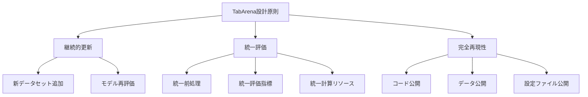
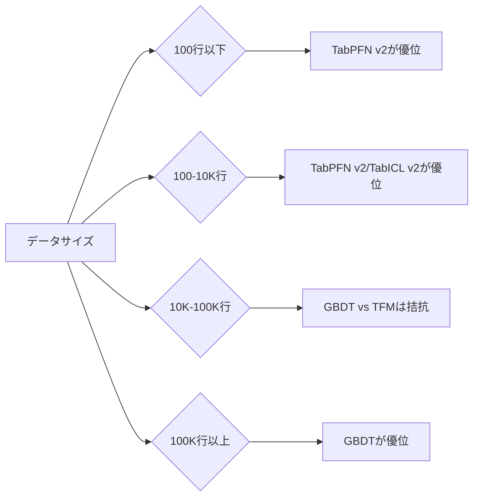

本記事は [arXiv:2506.16791 "TabArena: A Living Benchmark for Tabular Machine Learning"](https://arxiv.org/abs/2506.16791) の解説記事です。

## 論文概要（Abstract）

TabArenaは、Amazon Science（AutoGluonチーム）が主導するテーブルデータ向け機械学習の**初のliving benchmark**である。従来の静的ベンチマーク（OpenML CC-18等）がデータセットの陳腐化やモデルの過適合といった問題を抱えていたのに対し、TabArenaは新たにキュレーションされたデータセットの追加、モデルの再評価、完全な再現性を実現する設計となっている。初期リリースでは16のテーブルモデルが比較評価されている。

この記事は [Zenn記事: テーブルデータ基盤モデル2026年最前線](https://zenn.dev/0h_n0/articles/3f66d81be74e2a) の深掘りです。

## 情報源

- **arXiv ID**: 2506.16791
- **URL**: [https://arxiv.org/abs/2506.16791](https://arxiv.org/abs/2506.16791)
- **著者**: Nick Erickson, Alexander Arno, Lennart Purucker et al.（Amazon Science / AutoGluonチーム）
- **発表年**: 2025年6月
- **分野**: cs.LG, cs.AI

## 背景と動機（Background & Motivation）

テーブルデータの機械学習分野では、ベンチマークの品質がモデル評価の信頼性を左右する。従来のベンチマークには以下の問題が存在していた。

第一に、**データセットの陳腐化**がある。OpenML CC-18やAutoML Benchmark等の静的ベンチマークは、作成後に更新されないため、新しいモデルが古いデータセットに過適合するリスクがあった。第二に、**評価の非統一性**がある。論文ごとに異なるデータセット、前処理、評価指標を使用するため、モデル間の公平な比較が困難であった。第三に、**ベンチマーク汚染**のリスクがある。広く使われるベンチマークデータがモデルの事前学習データに混入する可能性が指摘されていた。

TabArenaはこれらの問題に対処するため、**living benchmark**という新しいベンチマーク設計を提案した。新しいデータセットを随時追加し、モデルの新バージョンがリリースされた際に再評価を行うことで、常に最新の比較を提供する。

## 主要な貢献（Key Contributions）

著者らが報告する主要な貢献は以下のとおりである。

- **貢献1**: テーブルML初のliving benchmarkの設計と実装。データセットの追加・モデルの再評価が継続的に行われる
- **貢献2**: 16のテーブルモデルの統一評価。GBDT（XGBoost, LightGBM, CatBoost）、ニューラルモデル（RealMLP, TabM）、基盤モデル（TabPFN v2, TabICL）を含む
- **貢献3**: モデル横断アンサンブルがstate-of-the-artを更新するという知見の提示
- **貢献4**: 完全な再現性の担保。すべてのコード、データ、評価スクリプトを公開

## 技術的詳細（Technical Details）

### ベンチマーク設計

TabArenaの設計原則は以下の3点である。



### データセット選定基準

TabArenaに含まれるデータセットは、以下の基準で選定されている。

1. **新規性**: 既存のベンチマーク（OpenML CC-18等）に含まれていないデータセットを優先
2. **多様性**: データサイズ（数百行〜数十万行）、特徴量タイプ（数値・カテゴリカル・混合）、タスク（分類・回帰）の多様性を確保
3. **実務関連性**: 実際のビジネス課題に近いデータセットを選定

### 評価方法論

TabArenaの評価は以下のプロトコルに従う。

$$
\text{Score}(m, d) = \frac{1}{K} \sum_{k=1}^{K} \text{Metric}(m, d, k)
$$

ここで、
- $m$: 評価対象モデル
- $d$: データセット
- $K$: クロスバリデーションのフォールド数（TabArenaでは$K = 10$）
- $\text{Metric}$: 評価指標（分類: log loss、回帰: RMSE）

モデル間の比較には**win rate**が使用される。

$$
\text{WinRate}(m_1, m_2) = \frac{1}{|\mathcal{D}|} \sum_{d \in \mathcal{D}} \mathbb{1}[\text{Score}(m_1, d) > \text{Score}(m_2, d)]
$$

ここで $\mathcal{D}$ はベンチマークに含まれる全データセットの集合、$\mathbb{1}[\cdot]$ は指示関数である。

### 比較対象モデル

初期リリースで比較された16モデルは以下のカテゴリに分類される。

**勾配ブースト決定木（GBDT）**:
- XGBoost（デフォルト設定 / チューニング済み）
- LightGBM（デフォルト設定 / チューニング済み）
- CatBoost（デフォルト設定 / チューニング済み）

**ニューラルネットワーク**:
- RealMLP（最適化されたMLP）
- TabM（テーブル特化型アーキテクチャ）
- ModernNCA（Nearest Class Average の現代版）

**基盤モデル（In-Context Learning型）**:
- TabPFN v2（PriorLabs）
- TabICL（INRIA）

**AutoMLフレームワーク**:
- AutoGluon 1.4（内部的にTabPFN v2を含むアンサンブル）
- AutoGluon 1.5.0（TabDPT追加等の改善版）

### 結果の概要

TabArenaの初期評価結果から、著者らは以下の知見を報告している。

**デフォルト設定での比較（チューニングなし）**:

| モデル | 平均ランク（著者ら報告） | 備考 |
|--------|----------------------|------|
| TabPFN v2 | 上位 | 小〜中規模データで優位 |
| CatBoost | 上位 | 大規模データで安定 |
| LightGBM | 中位 | 全体的に安定 |
| XGBoost | 中位 | デフォルト設定では劣る場合あり |
| TabICL | 中〜上位 | 大規模データでTabPFNより高速 |

**チューニング済みでの比較**:

| モデル | 平均ランク（著者ら報告） | チューニング時間 |
|--------|----------------------|----------------|
| AutoGluon 1.4 (4h) | 最上位 | 4時間 |
| AutoGluon 1.5.0 (4h) | 最上位 | 4時間 |
| TabPFN-2.5 | AutoGluon 1.4と同等 | なし（1回のフォワードパス） |
| チューニング済みCatBoost | 上位 | 1-4時間 |

### アンサンブルの有効性

TabArenaの分析で最も注目すべき知見は、**モデル横断のアンサンブルがテーブルML全体のstate-of-the-artを更新する**という点である。

```python
# AutoGluonによるモデル横断アンサンブルの概念コード
from autogluon.tabular import TabularPredictor

predictor = TabularPredictor(
    label="target",
    eval_metric="log_loss",
).fit(
    train_data=train_data,
    time_limit=14400,  # 4時間
    presets="best_quality",  # TabPFN v2含むアンサンブルを自動構築
)

# AutoGluonは内部的に以下を組み合わせる：
# - XGBoost（複数の設定）
# - LightGBM（複数の設定）
# - CatBoost
# - TabPFN v2
# - RealMLP
# - 重み付きアンサンブル
leaderboard = predictor.leaderboard(test_data)
print(leaderboard)
```

AutoGluon 1.4がTabArenaで最上位を達成した理由は、TabPFN v2を含む異なるカテゴリのモデルをアンサンブルすることで、個々のモデルの弱点を補完しているためである。さらに、AutoGluon 1.5.0ではTabDPTモデルの追加等により、中〜大規模データセットでの精度がAutoGluon 1.4 Extremeに対して85%のwin rateで向上したと報告されている。

### データサイズ別の傾向

TabArenaの結果から、データサイズによるモデル優位性の変化が明確に示されている。



## 実装のポイント（Implementation）

### TabArenaの利用方法

TabArenaのリーダーボードはHugging Face Spacesで公開されており、最新の比較結果を確認できる。

```python
# TabArenaの評価を再現する方法
# pip install autogluon.tabular tabpfn tabicl

from sklearn.model_selection import cross_val_score
import numpy as np

def tabarena_evaluate(
    models: dict,
    X,
    y,
    cv: int = 10,
    scoring: str = "neg_log_loss",
) -> dict:
    """TabArena形式でモデル比較

    Args:
        models: {モデル名: sklearn互換estimator} の辞書
        X: 特徴量
        y: ラベル
        cv: フォールド数
        scoring: 評価指標

    Returns:
        {モデル名: (平均スコア, 標準偏差)} の辞書
    """
    results = {}
    for name, model in models.items():
        scores = cross_val_score(model, X, y, cv=cv, scoring=scoring)
        results[name] = (scores.mean(), scores.std())
        print(f"{name}: {scores.mean():.4f} (+/- {scores.std():.4f})")
    return results

# Win Rate計算
def compute_win_rate(
    scores_a: np.ndarray,
    scores_b: np.ndarray,
) -> float:
    """2モデル間のwin rateを計算

    Args:
        scores_a: モデルAの各フォールドのスコア
        scores_b: モデルBの各フォールドのスコア

    Returns:
        モデルAのwin rate（0.0-1.0）
    """
    wins = np.sum(scores_a > scores_b)
    total = len(scores_a)
    return wins / total
```

### 自分のデータでの評価

```python
# 自分のデータセットでTabArena形式の比較を実行
from xgboost import XGBClassifier
from tabpfn import TabPFNClassifier
from tabicl import TabICLClassifier
from sklearn.datasets import fetch_openml

# データ取得
data = fetch_openml("credit-g", version=1, as_frame=True)
X, y = data.data, data.target

models = {
    "XGBoost (default)": XGBClassifier(
        random_state=42,
        eval_metric="logloss",
        enable_categorical=True,
    ),
    "TabPFN v2": TabPFNClassifier(),
    "TabICL v2": TabICLClassifier(),
}

results = tabarena_evaluate(models, X, y, cv=10, scoring="accuracy")
```

## 実験結果（Results）

### レイテンシと精度のトレードオフ

TabArenaの分析では、テーブル基盤モデルとGBDTのレイテンシと精度のトレードオフについても報告されている。

2025年のQuantumZeitgeist報告によると、テーブル基盤モデルは**ツリーアンサンブルの約40,000倍のレイテンシ**を要しながら、精度改善は約0.8%に留まるケースがあると指摘されている。この点は、リアルタイム推論が必要なプロダクション環境で重要な考慮事項となる。

| ユースケース | 推奨アプローチ | 理由 |
|------------|-------------|------|
| Kaggleコンペ | AutoGluon + TabPFN アンサンブル | 精度最優先 |
| 小データ探索 | TabPFN v2 単体 | チューニング不要 |
| 大規模バッチ | TabICL v2 or LightGBM | スループット重視 |
| リアルタイムAPI | XGBoost or TabPFN蒸留 | レイテンシ制約 |

### Living Benchmarkの意義

著者らは、TabArenaがliving benchmarkであることの意義として以下を挙げている。

1. **ベンチマーク汚染の低減**: 新しいデータセットが定期的に追加されるため、事前学習データへの混入リスクが低い
2. **モデル進化の追跡**: TabPFN v2 → v2.5、AutoGluon 1.4 → 1.5.0 等、モデルの進化を継続的に追跡可能
3. **公平な比較環境**: 同一のハードウェア・評価プロトコルで全モデルを評価

## 実運用への応用（Practical Applications）

TabArenaの結果は、実務でのモデル選択に以下の示唆を与える。

- **デフォルト設定での第一選択肢**: 小〜中規模データではTabPFN v2/TabICL v2、大規模データではCatBoost/LightGBMが合理的
- **チューニング時間が確保できる場合**: AutoGluonによるアンサンブルが最も高い精度を達成する可能性が高い
- **継続的なモデル評価**: TabArenaのリーダーボードを定期的に確認し、新しいモデルの出現に対応することが推奨される

## 関連研究（Related Work）

- **OpenML CC-18**: 従来の標準的なテーブルデータベンチマーク。静的であり更新されない点がTabArenaとの主な違い
- **TALENT**: 大規模テーブルデータ評価に特化したベンチマーク。TabArenaとは補完的な関係
- **AutoML Benchmark**（Gijsbers et al., 2024）: AutoMLフレームワークの比較に特化。TabArenaはより広範なモデルカテゴリを含む

## まとめと今後の展望

TabArenaは、テーブルML分野に**living benchmark**という新しい評価パラダイムを導入した。初期評価から得られた主要な知見は、(1) 小〜中規模データではICL型基盤モデルがGBDTを上回る、(2) 大規模データではGBDTが依然として有力、(3) モデル横断アンサンブルがstate-of-the-artを更新する、という3点である。

今後は、TabArenaへのデータセット追加（特に時系列テーブル、マルチモーダルテーブル）、新モデル（TabICL v2、TabFlex等）の評価追加、カンファレンスとの連携（ICML 2025 Workshop on Foundation Models for Structured Data）が期待される。

## 参考文献

- **arXiv**: [https://arxiv.org/abs/2506.16791](https://arxiv.org/abs/2506.16791)
- **Leaderboard**: [https://huggingface.co/spaces/TabArena/leaderboard](https://huggingface.co/spaces/TabArena/leaderboard)
- **Related Zenn article**: [https://zenn.dev/0h_n0/articles/3f66d81be74e2a](https://zenn.dev/0h_n0/articles/3f66d81be74e2a)
