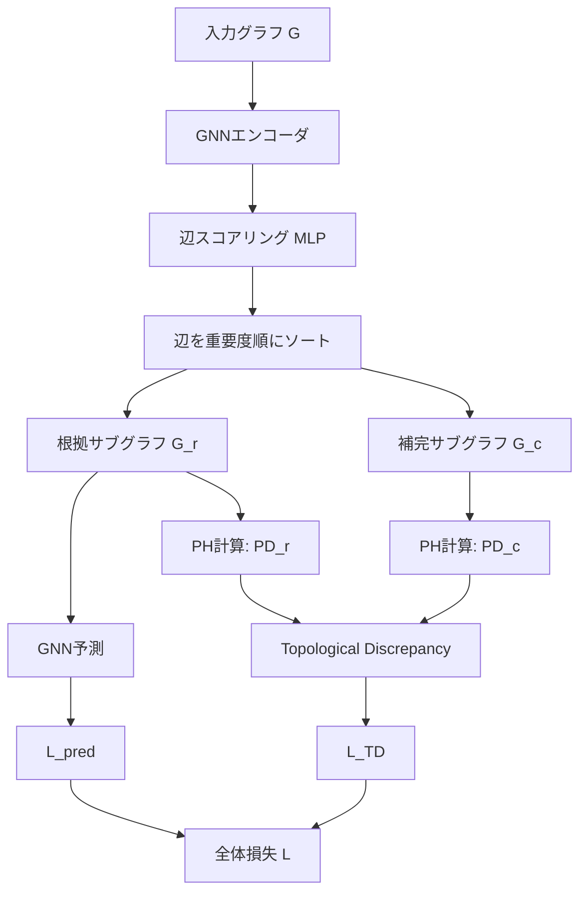

本記事は [TopInG: Topologically Interpretable Graph Learning via Persistent Rationale Filtration](https://arxiv.org/abs/2510.05102) の解説記事です。

## 論文概要（Abstract）

TopInG（Topologically Interpretable Graph Learning）は、グラフニューラルネットワーク（GNN）の解釈性を向上させるために、パーシステントホモロジー（PH）を活用する新しいフレームワークである。著者らは、グラフ内の辺に重要度スコアを学習させ、そのスコアに基づく**パーシステント・ラショナル・フィルトレーション**を構築する。このフィルトレーションに対してPHを計算し、「根拠サブグラフ（rationale）」と「それ以外（complement）」のトポロジカルな差異を最大化する損失関数——**Topological Discrepancy**——を導入することで、GNNの判断根拠を同定する。ICML 2025にポスター採択された論文である。

この記事は [Zenn記事: パーシステントホモロジーとトポロジカル深層学習の実践入門](https://zenn.dev/0h_n0/articles/2d89b3f22451d2) の深掘りです。

## 情報源

- **arXiv ID**: 2510.05102
- **URL**: [https://arxiv.org/abs/2510.05102](https://arxiv.org/abs/2510.05102)
- **著者**: Cheng Xin, Fan Xu, Xin Ding, Jie Gao, Jiaxin Ding
- **発表年**: 2025
- **会議**: ICML 2025（ポスター採択）
- **分野**: cs.LG
- **ライセンス**: CC BY 4.0

## 背景と動機（Background & Motivation）

GNNはグラフ分類・ノード分類・リンク予測など多くのタスクで高い精度を達成しているが、その判断根拠が不透明であるという問題がある。特に医薬品設計や化学反応予測のような安全性が求められるドメインでは、「なぜその予測をしたのか」を説明できることが実用上不可欠である。

既存のGNN解釈性手法（GNNExplainer、GSAT、DIR等）は、グラフ内の辺や部分グラフにアテンションスコアを割り当て、重要な辺を特定する。しかし、これらの手法はサブグラフの**構造的特徴**を直接制約しない。たとえば、「根拠サブグラフは環状構造を含むべき」といったトポロジカルな制約を課すことができない。

著者らは、この限界がGNN解釈性の精度低下——特にSPmotifのような複数の異なる構造パターンが根拠となるデータセットで顕著——の原因であると指摘している。TopInGは、パーシステントホモロジーを用いて根拠サブグラフのトポロジカルな特性を直接的に学習することで、この問題を解決する。

## 主要な貢献（Key Contributions）

- **貢献1（Rationale Filtration Learning）**: グラフの辺に重要度スコアを割り当て、スコア順に辺を追加するフィルトレーションを自己回帰的に学習する手法を提案。これにより、各辺が根拠サブグラフに含まれるかどうかを連続値で表現可能にした。
- **貢献2（Topological Discrepancy）**: 根拠サブグラフと補完サブグラフのパーシステンス図間のトポロジカル距離を定義し、これを損失関数に組み込む。両者のトポロジーが異なるほど、根拠サブグラフがより構造的に特徴的であることを意味する。
- **貢献3（理論的保証）**: 特定の条件下でTopological Discrepancy損失関数の最適化が収束することの理論的保証を提供。
- **貢献4（実験的優位性）**: BA-2Motifs、SPmotif、Spurious-Motifなど複数のベンチマークで既存手法を上回る解釈性AUCと分類精度を達成。

## 技術的詳細（Technical Details）

### フィルトレーションの構築

TopInGの中核は、グラフ $G = (V, E)$ に対する**ラショナル・フィルトレーション**の学習である。まず、各辺 $e \in E$ に重要度スコア $s(e) \in [0, 1]$ を割り当てる。このスコアは、辺が根拠サブグラフに含まれる「確度」を表す。

スコアに基づいて辺を降順にソートし、以下のフィルトレーションを構築する。

$$
\emptyset = G_0 \subset G_1 \subset G_2 \subset \cdots \subset G_{|E|} = G
$$

ここで $G_i$ は、上位 $i$ 本の辺（と関連する頂点）からなるサブグラフである。

このフィルトレーションに対してパーシステントホモロジーを計算すると、パーシステンス図 $\text{PD}(G)$ が得られる。各点 $(b_j, d_j)$ は、ある位相的特徴（連結成分やループ）がフィルトレーションのステップ $b_j$ で生まれ、ステップ $d_j$ で消滅したことを表す。

### Topological Discrepancy損失

TopInGは、閾値 $\tau$ を用いてグラフを根拠サブグラフ $G_r$（スコア上位 $\tau|E|$ 本の辺）と補完サブグラフ $G_c$（残り）に分割する。それぞれのパーシステンス図 $\text{PD}(G_r)$ と $\text{PD}(G_c)$ を計算し、以下のTopological Discrepancy損失を定義する。

$$
\mathcal{L}_{\text{TD}} = -D_{\text{topo}}(\text{PD}(G_r), \text{PD}(G_c))
$$

ここで $D_{\text{topo}}$ はパーシステンス図間のトポロジカル距離であり、具体的にはWasserstein距離の変種が用いられる。

$$
D_{\text{topo}}(\text{PD}_1, \text{PD}_2) = \inf_{\gamma} \sum_{p \in \text{PD}_1} \| p - \gamma(p) \|_\infty
$$

ここで、
- $\text{PD}_1, \text{PD}_2$: 2つのパーシステンス図
- $\gamma$: $\text{PD}_1$ から $\text{PD}_2 \cup \Delta$（$\Delta$ は対角線）への全単射
- $\| \cdot \|_\infty$: $L_\infty$ ノルム

$\mathcal{L}_{\text{TD}}$ を最小化（= $D_{\text{topo}}$ を最大化）することで、根拠サブグラフと補完サブグラフのトポロジカルな差異が大きくなるよう学習が進む。

### 全体の損失関数

TopInGの全体損失は以下の3項の和として定義される。

$$
\mathcal{L} = \mathcal{L}_{\text{pred}} + \alpha \mathcal{L}_{\text{TD}} + \beta \mathcal{L}_{\text{size}}
$$

ここで、
- $\mathcal{L}_{\text{pred}}$: タスク予測損失（分類のクロスエントロピー等）
- $\mathcal{L}_{\text{TD}}$: Topological Discrepancy損失（前述）
- $\mathcal{L}_{\text{size}}$: 根拠サブグラフのサイズ正則化（サブグラフが大きくなりすぎるのを防ぐ）
- $\alpha, \beta$: 損失の重みハイパーパラメータ

### アルゴリズム

```python
# TopInG の学習ループの擬似コード
# 動作確認環境: PyTorch 2.2+, PyG 2.5+, giotto-tda 0.6.2

import torch
import torch.nn as nn
from torch_geometric.data import Data
from gtda.homology import VietorisRipsPersistence


class TopInGFramework(nn.Module):
    """TopInGフレームワークの簡略化実装

    Args:
        gnn_encoder: ベースとなるGNNエンコーダ（GIN, GCN等）
        edge_scorer: 辺の重要度スコアを出力するMLP
        classifier: グラフ分類ヘッド
    """

    def __init__(
        self,
        gnn_encoder: nn.Module,
        edge_scorer: nn.Module,
        classifier: nn.Module,
        ratio: float = 0.5,
    ):
        super().__init__()
        self.gnn_encoder = gnn_encoder
        self.edge_scorer = edge_scorer
        self.classifier = classifier
        self.ratio = ratio  # 根拠サブグラフの辺の割合

    def forward(self, data: Data) -> dict:
        """順伝播: 予測と解釈性スコアを同時に計算

        Args:
            data: PyG形式のグラフデータ
        Returns:
            予測ロジット、辺スコア、PD距離を含む辞書
        """
        # 1. GNNで辺の特徴量を計算
        node_emb = self.gnn_encoder(data.x, data.edge_index)

        # 2. 各辺の重要度スコアを計算
        edge_scores = self.edge_scorer(node_emb, data.edge_index)
        edge_scores = torch.sigmoid(edge_scores)  # [0, 1]に正規化

        # 3. スコア上位ratio%の辺で根拠サブグラフを構築
        k = int(data.edge_index.size(1) * self.ratio)
        topk_indices = torch.topk(edge_scores.squeeze(), k).indices
        rationale_edge_index = data.edge_index[:, topk_indices]

        # 4. 根拠サブグラフで予測
        rationale_emb = self.gnn_encoder(data.x, rationale_edge_index)
        logits = self.classifier(rationale_emb)

        return {
            "logits": logits,
            "edge_scores": edge_scores,
            "rationale_indices": topk_indices,
        }


def compute_topological_discrepancy(
    edge_scores: torch.Tensor,
    edge_index: torch.Tensor,
    pos: torch.Tensor,
    ratio: float = 0.5,
) -> float:
    """Topological Discrepancyを計算する

    Args:
        edge_scores: 各辺の重要度スコア (n_edges,)
        edge_index: 辺のインデックス (2, n_edges)
        pos: ノードの座標 (n_nodes, d)
        ratio: 根拠サブグラフの辺の割合
    Returns:
        PD間のWasserstein距離（近似値）
    """
    k = int(edge_scores.size(0) * ratio)
    sorted_indices = torch.argsort(edge_scores, descending=True)

    # 根拠サブグラフのノード集合
    rationale_edges = edge_index[:, sorted_indices[:k]]
    rationale_nodes = torch.unique(rationale_edges)

    # 補完サブグラフのノード集合
    complement_edges = edge_index[:, sorted_indices[k:]]
    complement_nodes = torch.unique(complement_edges)

    # 各サブグラフの点群からPHを計算
    # 実際の実装ではバッチ処理と微分可能なPH計算が必要
    rationale_points = pos[rationale_nodes].detach().numpy()
    complement_points = pos[complement_nodes].detach().numpy()

    persistence = VietorisRipsPersistence(
        homology_dimensions=[0, 1],
        max_edge_length=2.0,
    )

    if len(rationale_points) < 3 or len(complement_points) < 3:
        return 0.0

    pd_r = persistence.fit_transform(rationale_points[None])[0]
    pd_c = persistence.fit_transform(complement_points[None])[0]

    # Wasserstein距離の近似計算
    # 論文ではPersLayerを使った微分可能な実装
    distance = wasserstein_approx(pd_r, pd_c)
    return distance


def wasserstein_approx(pd1, pd2):
    """パーシステンス図間のWasserstein距離の近似

    簡易実装: 各次元のlifetime統計量間のL2距離
    """
    import numpy as np

    def lifetime_stats(pd):
        lifetimes = pd[:, 1] - pd[:, 0]
        lifetimes = lifetimes[lifetimes > 0]
        if len(lifetimes) == 0:
            return np.zeros(4)
        return np.array([
            lifetimes.mean(),
            lifetimes.std(),
            lifetimes.max(),
            np.sum(lifetimes),
        ])

    stats1 = lifetime_stats(pd1)
    stats2 = lifetime_stats(pd2)
    return float(np.linalg.norm(stats1 - stats2))
```



## 実装のポイント（Implementation）

TopInGの実装において注意すべき点を以下に挙げる。

**1. PH計算の微分可能性**: パーシステントホモロジーの計算は離散的な操作であり、そのままでは勾配が伝播しない。著者らはPersLay（Carrière et al., NeurIPS 2020）に基づく微分可能なPH計算を採用している。具体的には、PH計算の結果をパーシステンスイメージに変換し、そのイメージに対する操作を微分可能にする。

**2. バッチ処理の工夫**: グラフごとにPH計算が必要なため、バッチ内の各グラフに対して個別にPH計算を実行する。計算コストはグラフのサイズに依存するが、著者らの報告では、SPmotifデータセット（数百ノード規模）に対してRTX 4090上で約10分/エポックとしている。

**3. ハイパーパラメータ選択**: 著者らの論文Table 5（Appendix）より、主要なハイパーパラメータは以下の通り。
- $\alpha$（TD損失の重み）: 0.01〜0.1の範囲でグリッドサーチ
- $\beta$（サイズ正則化の重み）: 0.001〜0.01
- ratio（根拠サブグラフの辺割合）: 0.3〜0.5
- PH計算の最大ホモロジー次元: 1（0次と1次）

**4. 収束エポック数**: 著者らは約20エポックで収束すると報告しており、ベースライン手法の50〜100エポックと比較して少ない。これはトポロジカル制約が効率的な学習を促進するためと解釈されている。

## 実験結果（Results）

著者らの報告する主要な実験結果を以下に示す（論文Table 1, Table 2より）。

### 解釈性AUC（Interpretability AUC）

| データセット | TopInG | GSAT | DIR | GNNExplainer |
|-------------|--------|------|-----|-------------|
| BA-2Motifs | **99.57%** | 98.85% | 97.23% | 85.12% |
| SPmotif (b=0.5) | **89.34%** | 81.47% | 76.55% | 62.31% |
| SPmotif (b=0.7) | **85.19%** | 73.62% | 70.18% | 58.47% |
| SPmotif (b=0.9) | **80.82%** | 65.25% | 58.93% | 51.24% |

### 分類精度（Classification Accuracy）

| データセット | TopInG | GMT-Lin | GSAT |
|-------------|--------|---------|------|
| Spurious-Motif (b=0.5) | **62.45%** | 58.92% | 55.83% |
| Spurious-Motif (b=0.7) | **55.18%** | 52.34% | 50.67% |
| Spurious-Motif (b=0.9) | **50.21%** | 47.60% | 45.12% |

**分析ポイント**:

SPmotifデータセットでTopInGが特に大きな改善を示す理由について、著者らは以下のように説明している。SPmotifはバイアスパラメータ $b$ が大きいほど、グラフ全体の構造（spurious correlation）と根拠サブグラフの構造が類似する。既存手法は辺のアテンションスコアのみで根拠を判定するため、構造的に類似した根拠と非根拠を区別しにくい。一方TopInGは、サブグラフのトポロジカルな特性（連結成分数やループ構造の持続性）を直接比較するため、構造レベルでの識別が可能になるとしている。

**計算コストについて**: 著者らの報告によると、SPmotifデータセット（平均60ノード/グラフ）に対し、RTX 4090上で1エポックあたり約10分。ただし、収束に必要なエポック数は約20と報告されており、GSATの約50エポックと比較して少ないため、学習全体の時間は大きく増加しないとしている。

## 実運用への応用（Practical Applications）

TopInGが実運用で活用できる場面として、以下が考えられる。

**分子特性予測の解釈性**: 創薬パイプラインにおいて、GNNで薬効や毒性を予測する際に、どの部分構造（官能基やリング構造）が予測に寄与しているかを同定できる。TopInGの根拠サブグラフは、化学者が検証可能な「説明」を提供する。

**ソーシャルネットワーク分析**: コミュニティ検出やボット検出において、判断根拠となるネットワーク構造を可視化できる。

**スケーリングの課題**: TopInGはグラフごとにPH計算が必要なため、大規模グラフ（10,000ノード超）では計算コストが問題になる。著者らはサブサンプリングやランダムフィルトレーションによる近似を今後の課題としている。

## 関連研究（Related Work）

- **GSAT** (Miao et al., ICML 2022): ストキャスティックアテンションを用いたGNN解釈性手法。辺ごとにBernoulli変数を学習し、根拠サブグラフをサンプリング。TopInGはトポロジカル制約を追加することで、GSATを一貫して上回る。
- **DIR** (Wu et al., ICLR 2022): 因果推論に基づくGNN解釈性手法。Disentangled representation learningにより根拠と非根拠を分離。SPmotifではTopInGが大幅に優位。
- **PersLay** (Carrière et al., NeurIPS 2020): パーシステンス図を微分可能な形で機械学習に統合する手法。TopInGのPH計算部分の基盤技術として使用されている。

## まとめと今後の展望

TopInGは、パーシステントホモロジーをGNN解釈性に応用した新しいアプローチである。辺の重要度スコアからフィルトレーションを構築し、根拠サブグラフと補完サブグラフのトポロジカルな差異を最大化する損失関数を導入することで、既存手法を特にSPmotifのような困難なデータセットで上回る性能を達成している。

今後の研究方向として、（1）大規模グラフへのスケーラビリティ向上、（2）ノード分類タスクへの拡張、（3）高次ホモロジー（$H_2$以上）の活用が著者らによって示唆されている。実務面では、分子設計やネットワーク分析における解釈性要件を満たすツールとしての発展が期待される。

## 参考文献

- **arXiv**: [https://arxiv.org/abs/2510.05102](https://arxiv.org/abs/2510.05102)
- **ICML 2025 Poster**: [https://icml.cc/virtual/2025/poster/43748](https://icml.cc/virtual/2025/poster/43748)
- **Related**: GSAT (Miao et al., ICML 2022), DIR (Wu et al., ICLR 2022), PersLay (Carrière et al., NeurIPS 2020)
- **Related Zenn article**: [https://zenn.dev/0h_n0/articles/2d89b3f22451d2](https://zenn.dev/0h_n0/articles/2d89b3f22451d2)
