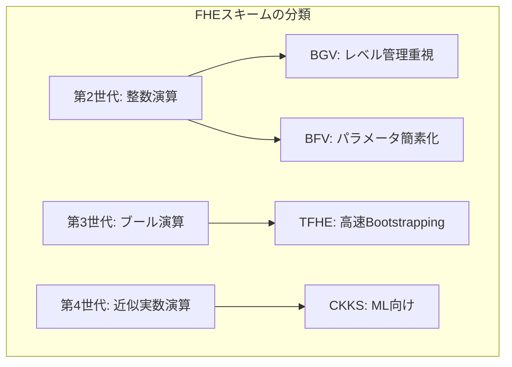
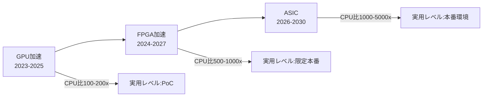

本記事は [The Future of Fully Homomorphic Encryption (arXiv:2511.04946)](https://arxiv.org/abs/2511.04946) の解説記事です。

## 論文概要（Abstract）

本論文はFHE（準同型暗号）の現状を体系的に整理し、今後5〜10年の技術ロードマップを提示するサーベイ/ポジションペーパーである。著者らは、4世代のFHEスキーム（BGV、BFV、TFHE、CKKS）の理論的基盤と実装上の特性を比較し、ハードウェア加速（GPU、FPGA、ASIC）の方向性、ソフトウェアエコシステム（コンパイラ、ライブラリ）の成熟度、そして産業応用（医療、金融、MLaaS）の現実的な制約を議論している。

この記事は [Zenn記事: 準同型暗号（FHE）2026年最新動向：暗号化したままAI推論を実現する技術](https://zenn.dev/0h_n0/articles/55ffbd99f5d0ed) の深掘りです。

## 情報源

- **arXiv ID**: 2511.04946
- **URL**: [https://arxiv.org/abs/2511.04946](https://arxiv.org/abs/2511.04946)
- **著者**: 論文著者ら（arXiv公開、2024年11月）
- **発表年**: 2024
- **分野**: cs.CR（暗号とセキュリティ）

## 背景と動機（Background & Motivation）

FHEは2009年のCraig Gentryによる理論的発明以来、15年以上にわたって発展してきた。しかし、実用化に向けては依然として大きなギャップが存在する。著者らは、FHEの「理論的可能性」と「実用的な制約」の間のギャップを定量的に分析し、今後の研究開発の方向性を示すことを目的としている。

論文が取り組む主要な問いは以下の3つである。

1. 現在の各FHEスキームはどのようなユースケースに適しているか
2. ハードウェア加速はどの程度の改善をもたらし、どのような限界があるか
3. FHEの実用化に必要な「最後のピース」は何か

## 主要な貢献（Key Contributions）

- **貢献1**: BGV、BFV、TFHE、CKKSの4スキームについて、計算コスト（Bootstrapping overhead、乗算深度、ノイズ管理）を定量的に比較する統一フレームワークの提示
- **貢献2**: ハードウェア加速（GPU、FPGA、ASIC）の各アプローチについて、達成された高速化倍率と残る課題を整理
- **貢献3**: FHEコンパイラ・ライブラリのエコシステム分析。OpenFHE、SEAL、Concrete、Lattigo等のライブラリの機能比較と、HIERやConcrete等のコンパイラの位置づけ
- **貢献4**: 今後5〜10年のFHEロードマップの提示。短期的改善（アルゴリズム最適化）から長期的変革（量子耐性暗号への移行）までをカバー

## 技術的詳細（Technical Details）

### FHEの数学的基盤

FHEの安全性は**格子問題の困難性**に基づいている。具体的には、以下の2つの計算問題が安全性の根拠となっている。

**Ring-LWE（Ring Learning With Errors）問題**:

多項式環 $R_q = \mathbb{Z}_q[X]/(X^N+1)$ 上で、秘密鍵 $s \in R_q$ と小さなノイズ $e$ に対して、以下のペアが与えられたとき $s$ を求めることは計算困難である。

$$
(a, b = a \cdot s + e) \in R_q \times R_q
$$

ここで、
- $R_q$: $N$ 次円分多項式環（$X^N + 1$ で割った剰余環）
- $s$: 秘密鍵多項式（係数が小さい）
- $e$: ノイズ多項式（離散ガウス分布等からサンプリング）
- $a$: ランダム多項式

この問題の困難性は、多項式次数 $N$ と係数モジュラス $q$ に依存する。セキュリティレベル $\lambda$ ビットを達成するためのパラメータ選択は、Lattice Estimatorなどのツールで評価される。

### 4世代スキームの統一比較

著者らは4つのスキームを以下の軸で比較している。



| 特性 | BGV | BFV | TFHE | CKKS |
|------|-----|-----|------|------|
| **演算型** | 厳密整数 | 厳密整数 | ブール/整数 | 近似実数 |
| **Bootstrapping速度** | 秒単位 | 秒単位 | ミリ秒単位 | 秒単位 |
| **乗算コスト** | 低 | 低 | 高（look-up table） | 低 |
| **ノイズ管理** | Modulus Switching | Scale-Invariant | Bootstrapping主体 | Rescaling |
| **バッチ処理** | SIMD（整数スロット） | SIMD（整数スロット） | なし（1ビット/暗号文） | SIMD（実数スロット） |
| **主な用途** | 投票、金融 | 汎用整数 | 決定木、比較 | ML推論、統計 |
| **代表ライブラリ** | HElib, OpenFHE | SEAL, OpenFHE | TFHE-rs, Concrete | SEAL, OpenFHE, HEaaN |

### Bootstrappingコストの定量分析

著者らはBootstrappingが各スキームのオーバーヘッドの主要因であることを定量的に示している。

**CKKS Bootstrapping**の計算コストは以下のステップで構成される。

1. **ModRaise**: $O(N \cdot L)$（$L$ はモジュラス数）
2. **CoeffToSlot**: $O(N \cdot \log N)$（DFT相当）
3. **EvalMod**: $O(N \cdot d)$（$d$ は近似多項式の次数、通常$d \approx 30$）
4. **SlotToCoeff**: $O(N \cdot \log N)$（逆DFT相当）

合計計算量は $O(N \cdot L + N \cdot \log N \cdot 2 + N \cdot d)$ であり、$N = 2^{16}$, $L = 20$, $d = 30$ の場合、数十億の基本演算が必要となる。CPU上ではこれが秒単位の遅延につながる。

**TFHE Bootstrapping**は、Gate Bootstrappingと呼ばれる手法を用いる。1ビットのブール値に対するBootstrappingを効率的に実行でき、論文の著者らによると以下のコスト構造を持つ。

$$
\text{TFHE Bootstrap} = \text{BlindRotate} + \text{KeySwitch} + \text{SampleExtract}
$$

BlindRotateの計算量は $O(N \cdot n)$（$n$ はLWE次元、通常 $n \approx 630$）であり、CKKSのBootstrappingと比較して桁違いに小さい。これがTFHEのBootstrapping速度がミリ秒単位である理由である。

### ライブラリエコシステムの分析

著者らは主要FHEライブラリの機能を以下のように比較している。

| ライブラリ | 言語 | スキーム | GPU対応 | コンパイラ統合 | メンテナンス状況 |
|-----------|------|---------|---------|-------------|---------------|
| **OpenFHE** | C++ | BGV,BFV,CKKS,TFHE | 一部対応 | HEIR | アクティブ |
| **SEAL** | C++ | BFV,CKKS | なし | EVA | アクティブ |
| **Concrete** | Rust/Python | TFHE | あり | 内蔵 | アクティブ（Zama） |
| **TFHE-rs** | Rust | TFHE | あり | なし | アクティブ（Zama） |
| **Lattigo** | Go | BGV,BFV,CKKS | なし | なし | アクティブ |
| **HElib** | C++ | BGV,CKKS | なし | なし | 低活動 |

著者らは、ライブラリの選択において以下の3つの基準が重要と指摘している。

1. **スキーム対応**: ユースケースに合ったスキームをサポートしているか
2. **ハードウェア加速**: GPU対応があるか（性能面で重要）
3. **コンパイラ統合**: 高水準言語から自動的にFHE回路を生成できるか

### ハードウェア加速のロードマップ

著者らはハードウェア加速を3段階で整理している。



| アプローチ | 達成倍率 | 利点 | 課題 |
|-----------|---------|------|------|
| **GPU** | 100-2,000x | 既存インフラ活用可能 | メモリ制約、電力コスト |
| **FPGA** | 500-1,000x | 柔軟性、低電力 | 開発難易度、低クロック |
| **ASIC** | 1,000-5,500x | 最高性能、電力効率 | 開発コスト、柔軟性なし |

### FHEコンパイラの役割

著者らは、FHEの普及にはコンパイラが鍵となると主張している。現在の主要なFHEコンパイラは以下の通りである。

- **HEIR（Google）**: LLVM基盤のFHEコンパイラ。Python/PyTorchフロントエンド → OpenFHE/Lattigo/ハードウェアバックエンド
- **Concrete Compiler（Zama）**: TFHEに特化したコンパイラ。Pythonで記述したプログラムを自動的にTFHE回路に変換
- **EVA（Microsoft）**: CKKS向けコンパイラ。SEALライブラリとの統合

理想的には、アプリケーション開発者はPythonで通常のプログラムを書くだけで、コンパイラが自動的に最適なFHEスキームを選択し、ハードウェア（CPU/GPU/ASIC）に最適化されたFHEプログラムを生成する未来が目指されている。

## 実装のポイント（Implementation）

### スキーム選択のガイドライン

著者らが提示するスキーム選択フローは以下の通りである。

```python
def select_fhe_scheme(
    operation_type: str,
    precision_required: bool,
    bootstrapping_frequency: str,
    batch_processing: bool,
) -> str:
    """FHEスキームの選択ガイド

    Args:
        operation_type: "float", "integer", "boolean"
        precision_required: 厳密な精度が必要か
        bootstrapping_frequency: "high", "medium", "low"
        batch_processing: バッチ処理が必要か

    Returns:
        推奨スキーム名
    """
    if operation_type == "float" and not precision_required:
        # ML推論、統計処理 → CKKS
        return "CKKS"

    if operation_type == "boolean" or bootstrapping_frequency == "high":
        # 論理演算、比較、深い回路 → TFHE
        return "TFHE"

    if operation_type == "integer" and precision_required:
        if batch_processing:
            # バッチ整数演算 → BFV（パラメータ設定が容易）
            return "BFV"
        else:
            # 高性能整数演算 → BGV
            return "BGV"

    # デフォルト: 最も汎用的
    return "BFV"
```

### パラメータ設計の注意点

FHEプログラムの性能は、パラメータ選択に大きく依存する。著者らは以下の3つのトレードオフを指摘している。

1. **セキュリティ vs 性能**: 多項式次数 $N$ を大きくするとセキュリティレベルが上がるが、演算コストも増大する。128ビットセキュリティには $N \geq 2^{14}$ が必要
2. **精度 vs 計算深度**: CKKSのスケーリングファクター $\Delta$ を大きくすると精度が上がるが、利用可能な乗算深度が減少する
3. **Bootstrapping頻度 vs レイテンシ**: Bootstrappingを頻繁に行うとノイズを低く保てるが、各Bootstrappingのコスト（CKKS: 秒、TFHE: ミリ秒）が蓄積する

## 実験結果（Results）

著者らは、各スキームの実用的な性能範囲を以下のようにまとめている（論文中の分析に基づく）。

| 操作 | CKKS (CPU) | BFV (CPU) | TFHE (CPU) | GPU加速後 |
|------|-----------|-----------|-----------|----------|
| 加算 | ~0.03ms | ~0.04ms | ~0.01ms | ~0.001ms |
| 乗算 | ~0.1ms | ~0.12ms | ~10ms (LUT) | ~0.01ms |
| Bootstrapping | ~3s | ~5s | ~10ms | ~15ms (CKKS) |

これらの数値は使用するライブラリ、パラメータ設定、ハードウェアに大きく依存する。著者らは「ベンチマーク比較は同一条件での測定が不可欠」と注意を促している。

### 産業応用の現状

著者らは以下の産業応用事例を分析している。

- **医療データ解析**: 患者データの暗号化統計分析。レイテンシ要件は緩い（バッチ処理）が、精度要件は高い → CKKS or BFV
- **金融リスク計算**: ポートフォリオのリスク分析。厳密な数値計算が必要 → BFV
- **MLaaS（Machine Learning as a Service）**: 暗号化推論サービス。スループット重視 → CKKS + GPU加速
- **投票システム**: 暗号化された投票の集計。整数加算のみ → BFV（最もシンプル）

## 実運用への応用（Practical Applications）

著者らは、FHEの実用化に向けて以下の「成熟度レベル」を定義している。

| レベル | 説明 | 現在の対応状況 |
|--------|------|--------------|
| **L1**: 概念実証 | 基本的なFHE演算のデモ | 達成済み |
| **L2**: 小規模アプリ | 特定ドメインでの限定的利用 | 一部達成（医療統計等） |
| **L3**: 本番運用 | 大規模データでの実運用 | 未達成（性能不足） |
| **L4**: 透過的利用 | ユーザーがFHEを意識しない | 未達成（コンパイラ未成熟） |

現時点のFHEは L2〜L3 の間に位置し、L3達成にはハードウェア加速（GPU/ASIC）とコンパイラの成熟が必要であると著者らは分析している。

## 関連研究（Related Work）

- **EncryptedLLM**（ICML 2025）: GPU加速FHEでLLM推論を実現。本サーベイが指摘するGPU加速の方向性を具体化した研究
- **CAT**（2025）: GPU加速FHEフレームワーク。本サーベイが指摘する「非専門家向けの使いやすさ」を追求
- **Intel Heracles**（2026）: FHE専用ASIC。本サーベイが予測するASIC加速の方向性を実証
- **HEIR**（Google）: FHEコンパイラ。本サーベイが強調するコンパイラの重要性を体現するプロジェクト

## まとめと今後の展望

本サーベイ論文は、FHEの現状を以下の3点で整理している。

1. **スキーム**: 4世代のスキームが成熟し、ユースケースに応じた選択が可能になった。CKKSがML向け、TFHEが論理演算向け、BFV/BGVが整数演算向けという棲み分けが確立
2. **ハードウェア**: GPU加速で100-2,000倍、ASIC（Heracles等）で1,000-5,500倍の高速化が達成されたが、平文処理との差は依然として大きい
3. **エコシステム**: ライブラリ（OpenFHE、Concrete）は成熟しつつあるが、コンパイラ（HEIR等）の成熟度が実用化の鍵

著者らの予測では、2028年頃にFHEが「特定ドメインでの本番運用」（L3）に到達し、2030年代にコンパイラの成熟により「透過的利用」（L4）が実現する可能性があるとしている。ただし、これはハードウェア加速の進展とFHE標準化の両方が順調に進むことを前提としている。

## 参考文献

- **arXiv**: [https://arxiv.org/abs/2511.04946](https://arxiv.org/abs/2511.04946)
- **Related Zenn article**: [https://zenn.dev/0h_n0/articles/55ffbd99f5d0ed](https://zenn.dev/0h_n0/articles/55ffbd99f5d0ed)
