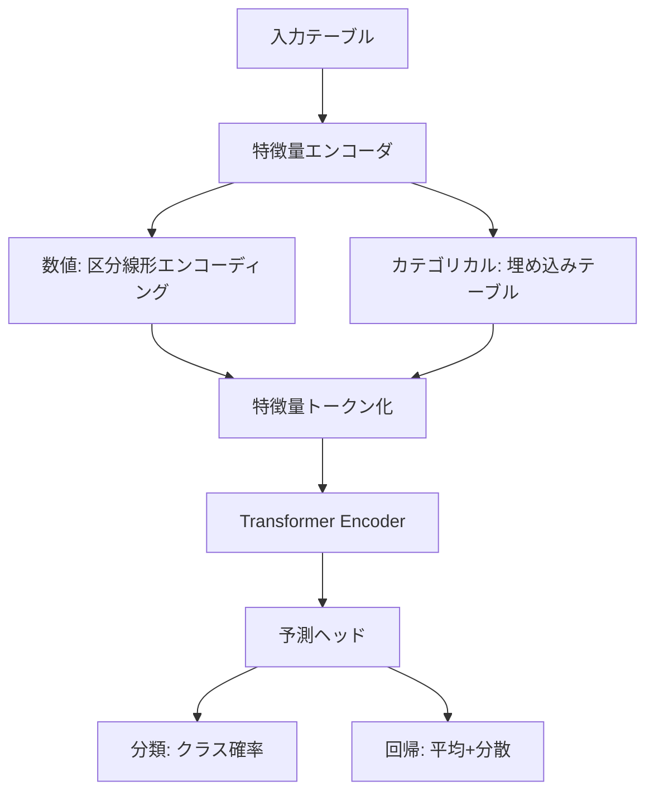

本記事は [arXiv:2511.08667 "TabPFN v2: Scaling In-Context Learning for Tabular Data"](https://arxiv.org/abs/2511.08667) の解説記事です。

## 論文概要（Abstract）

TabPFN v2は、テーブルデータに対するIn-Context Learning（ICL）基盤モデルの大幅なアップデートである。著者らは、合成データで事前学習した単一のTransformerモデルが、ファインチューニングなしで分類・回帰タスクの両方においてstate-of-the-artの性能を達成すると報告している。TabPFN v2は最大10,000行のデータポイントと500特徴量に対応し、さらにTabPFN-2.5では50,000行・2,000特徴量まで拡張された。

この記事は [Zenn記事: テーブルデータ基盤モデル2026年最前線](https://zenn.dev/0h_n0/articles/3f66d81be74e2a) の深掘りです。

## 情報源

- **arXiv ID**: 2511.08667
- **URL**: [https://arxiv.org/abs/2511.08667](https://arxiv.org/abs/2511.08667)
- **著者**: Noah Hollmann, Samuel Müller, Lennart Purucker, Arber Zela, Frank Hutter et al.
- **発表年**: 2024（v2）、2025（v2.5アップデート）
- **分野**: cs.LG, cs.AI, stat.ML
- **関連**: Nature誌掲載版（2025年1月）

## 背景と動機（Background & Motivation）

テーブルデータ（構造化データ）は金融・医療・製造業など実務の大部分を占めるデータ形式であるにもかかわらず、NLPや画像認識で成功したTransformerベース基盤モデルのアプローチが長らく適用困難であった。その主な理由は以下の3点である。

第一に、**スキーマの多様性**の問題がある。データセットごとにカラム数・データ型・意味が異なるため、単一モデルでの汎化が困難であった。第二に、**数値表現の難しさ**がある。テキストのトークン化と異なり、連続値の大小関係やスケールをTransformerで適切にエンコードする標準的手法が確立されていなかった。第三に、**実務データの小規模性**がある。テーブルデータは数百〜数万行が一般的であり、大規模事前学習の恩恵を直接受けにくい。

TabPFNシリーズは、これらの課題に対して「合成データで事前学習し、テスト時にIn-Context Learningで予測する」というアプローチで解決を図った。2022年のv1（1,000行制限）から始まり、v2で10,000行、v2.5で50,000行まで対応を拡大した。

## 主要な貢献（Key Contributions）

著者らが報告する主要な貢献は以下のとおりである。

- **貢献1**: 分類・回帰の両タスクに対応した単一のICL基盤モデルを実現。従来のTabPFN v1が分類のみ対応であったのに対し、v2は回帰タスクにも対応した
- **貢献2**: 最大データポイント数を1,000行（v1）から10,000行（v2）、さらに50,000行（v2.5）まで拡張。最大特徴量数も100（v1）から500（v2）、2,000（v2.5）まで拡張
- **貢献3**: 蒸留エンジン（Distillation Engine）の導入。TabPFNの予測知識をコンパクトなMLPやツリーアンサンブルに転写し、本番環境でのレイテンシを大幅に削減
- **貢献4**: TabArenaベンチマークにおいて、デフォルト設定のXGBoostに対して100%のwin rate（小〜中規模データ）を達成したと報告

## 技術的詳細（Technical Details）

### ベイズ推論としてのIn-Context Learning

TabPFNのコアアイデアは、テーブルデータの予測問題をベイズ推論の近似として定式化することである。具体的には、以下の事後予測分布を単一のTransformerフォワードパスで近似する。

$$
p(y_{\text{test}} \mid x_{\text{test}}, \mathcal{D}_{\text{train}}) = \int p(y_{\text{test}} \mid x_{\text{test}}, \theta) \, p(\theta \mid \mathcal{D}_{\text{train}}) \, d\theta
$$

ここで、
- $\mathcal{D}_{\text{train}} = \{(x_i, y_i)\}_{i=1}^{N}$: 学習データセット（$N$個のサンプル）
- $x_{\text{test}}$: テストサンプルの特徴量ベクトル
- $y_{\text{test}}$: 予測対象のラベル/値
- $\theta$: モデルパラメータ空間上の変数
- $p(\theta \mid \mathcal{D}_{\text{train}})$: 学習データが与えられた場合のパラメータの事後分布

従来の機械学習手法（XGBoost等）はパラメータの点推定 $\hat{\theta} = \arg\max_{\theta} p(\theta \mid \mathcal{D}_{\text{train}})$ を求めるのに対し、TabPFNはパラメータ空間全体にわたる積分をニューラルネットワークで近似する。これにより、小データでもオーバーフィットを抑制した不確実性推定付きの予測が可能になる。

### Prior-Fitted Network（PFN）の学習

TabPFNの事前学習は以下のプロセスで行われる。

1. **合成データ生成**: ベイズ的な構造因果モデル（SCM: Structural Causal Model）に基づき、多様なテーブルデータセットを大量に合成する。各合成データセットは異なるカラム数、データ型、関数関係を持つ
2. **Transformerの学習**: 合成データセット $\mathcal{D}_{\text{synth}}$ を「コンテキスト」としてTransformerに入力し、テストサンプルのラベルを予測するよう学習する

学習時の損失関数は以下のとおりである。

$$
\mathcal{L} = -\mathbb{E}_{\mathcal{D} \sim p(\mathcal{D})} \left[ \sum_{j=1}^{M} \log q_{\phi}(y_j^{\text{test}} \mid x_j^{\text{test}}, \mathcal{D}_{\text{train}}) \right]
$$

ここで、
- $q_{\phi}$: パラメータ $\phi$ を持つTransformerモデル
- $p(\mathcal{D})$: 合成データセットの生成分布（prior）
- $M$: テストサンプル数

この損失関数は、合成データ分布全体にわたる期待値を最小化することで、Transformerが任意のテーブルデータセットに対して適切なベイズ予測を出力するよう学習される。

### v2のアーキテクチャ改善

TabPFN v2では、v1からいくつかの重要な改善が加えられた。



**数値特徴量の区分線形エンコーディング**: v1では単純な正規化を使用していたが、v2では各数値特徴量を複数のビン境界で区分線形変換する。これにより、Transformerが数値の大小関係をより効果的に捉えられるようになったと著者らは報告している。

**特徴量トークン化**: テーブルの各行を「特徴量トークンの列」として扱う。行 $i$ の特徴量ベクトル $x_i = [x_i^{(1)}, \ldots, x_i^{(D)}]$ を $D$ 個のトークンに変換し、学習データの全行とテストサンプルを連結してTransformerに入力する。

### v2.5のスケーリング改善

TabPFN-2.5（2025年11月リリース）では、以下の拡張が行われた。

| 項目 | v2 | v2.5 | 改善倍率 |
|------|-----|------|---------|
| 最大データポイント数 | 10,000 | 50,000 | 5倍 |
| 最大特徴量数 | 500 | 2,000 | 4倍 |
| 最大データセル数 | 500万 | 1億 | 20倍 |

著者らの技術レポートによると、この拡張はメモリ効率の改善とアテンション機構の最適化によって実現された。具体的には、サブサンプリング戦略と効率的なアテンションカーネルの組み合わせにより、計算量をデータサイズに対して準線形にスケールさせている。

### アルゴリズム

TabPFN v2の推論プロセスを擬似コードで示す。

```python
import torch
from typing import Optional

def tabpfn_predict(
    X_train: torch.Tensor,
    y_train: torch.Tensor,
    X_test: torch.Tensor,
    model: torch.nn.Module,
    task: str = "classification",
) -> tuple[torch.Tensor, Optional[torch.Tensor]]:
    """TabPFN v2のフォワードパス推論

    Args:
        X_train: 学習データ特徴量 (N, D)
        y_train: 学習データラベル (N,)
        X_test: テストデータ特徴量 (M, D)
        model: 事前学習済みTabPFN v2モデル
        task: "classification" or "regression"

    Returns:
        predictions: 予測値 (M, C) for classification, (M,) for regression
        uncertainties: 不確実性推定 (M,) — 回帰の場合は分散
    """
    # Step 1: 特徴量エンコーディング（区分線形変換）
    X_train_enc = model.feature_encoder(X_train)  # (N, D, d_enc)
    X_test_enc = model.feature_encoder(X_test)     # (M, D, d_enc)

    # Step 2: コンテキスト構築（学習データ + テストデータを連結）
    # 学習データにはラベル情報を付加、テストデータにはマスクトークンを付加
    context = model.build_context(
        X_train_enc, y_train, X_test_enc
    )  # (N + M, D, d_model)

    # Step 3: Transformerフォワードパス（1回のみ）
    output = model.transformer(context)  # (N + M, D, d_model)

    # Step 4: テストサンプルの予測を抽出
    test_output = output[len(X_train):]  # (M, D, d_model)

    # Step 5: 予測ヘッド
    if task == "classification":
        predictions = model.classification_head(test_output)  # (M, C)
        return predictions, None
    else:
        mean, variance = model.regression_head(test_output)
        return mean, variance  # (M,), (M,)
```

## 実装のポイント（Implementation）

### scikit-learn互換API

TabPFN v2はscikit-learn互換のAPIを提供しており、既存のMLパイプラインに容易に統合できる。

```python
from tabpfn import TabPFNClassifier, TabPFNRegressor
from sklearn.model_selection import cross_val_score
from sklearn.datasets import load_breast_cancer

# 分類タスク
X, y = load_breast_cancer(return_X_y=True)
clf = TabPFNClassifier()
scores = cross_val_score(clf, X, y, cv=5, scoring="accuracy")
print(f"Accuracy: {scores.mean():.4f} (+/- {scores.std():.4f})")

# 回帰タスク
from sklearn.datasets import load_diabetes
X_reg, y_reg = load_diabetes(return_X_y=True)
reg = TabPFNRegressor()
scores_reg = cross_val_score(reg, X_reg, y_reg, cv=5, scoring="r2")
print(f"R2: {scores_reg.mean():.4f} (+/- {scores_reg.std():.4f})")
```

### 蒸留エンジンによる本番デプロイ

TabPFN-2.5には蒸留エンジンが搭載されており、TabPFNの予測をコンパクトなモデルに転写できる。著者らによると、蒸留後のモデルはTabPFN自体と同等の精度を維持しつつ、推論レイテンシを大幅に削減できる。

```python
from tabpfn import TabPFNClassifier

# TabPFNで学習
clf = TabPFNClassifier()
clf.fit(X_train, y_train)

# 蒸留: MLPまたはツリーアンサンブルに変換
# distill()メソッドでコンパクトなモデルを生成
distilled_model = clf.distill(
    model_type="mlp",       # "mlp" or "tree_ensemble"
    X_train=X_train,
    y_train=y_train,
)

# 蒸留後モデルで推論（高速）
fast_predictions = distilled_model.predict(X_test)
```

### ハイパーパラメータ

TabPFN v2の利点の一つは、ユーザーが調整すべきハイパーパラメータがほぼ存在しない点である。主な設定項目は以下のとおりである。

- `n_estimators`: アンサンブル数（デフォルト: 8）。精度とレイテンシのトレードオフ
- `device`: 推論デバイス（`"cuda"` or `"cpu"`）。GPU使用で大幅に高速化
- `random_state`: 再現性のためのシード値

### 落とし穴と注意点

- **メモリ制約**: 50,000行を超えるデータセットではOOMエラーが発生する可能性がある。その場合、サブサンプリングまたはTabICL v2への切り替えを検討すること
- **ライセンス**: RealTabPFN（実データでファインチューニングされた重み）は非商用ライセンスで提供されている。商用利用にはPriorLabsへの問い合わせが必要
- **GPU依存**: Transformerベースのため、CPU推論は大幅に遅くなる。本番環境ではGPU確保が推奨される

## Production Deployment Guide

### AWS実装パターン（コスト最適化重視）

TabPFN v2をプロダクション環境で運用する場合、トラフィック量に応じた構成を選択する。

| 規模 | 月間リクエスト | 推奨構成 | 月額コスト目安 | 主要サービス |
|------|--------------|---------|-------------|------------|
| **Small** | ~3,000 (100/日) | Serverless | $80-200 | Lambda + S3 + DynamoDB |
| **Medium** | ~30,000 (1,000/日) | Hybrid | $400-1,000 | ECS Fargate (GPU) + ElastiCache |
| **Large** | 300,000+ (10,000/日) | Container | $2,500-6,000 | EKS + g5.xlarge Spot + Karpenter |

**Small構成の詳細**（月額$80-200）:
- **Lambda**: 1GB RAM, 60秒タイムアウト — TabPFN蒸留モデル（MLP）をデプロイ（$25/月）
- **S3**: モデル重みストレージ（$5/月）
- **DynamoDB**: 予測結果キャッシュ、On-Demand（$10/月）
- **CloudWatch**: 基本監視（$5/月）
- **API Gateway**: REST API（$5/月）

蒸留モデル使用が前提。Transformer直接推論はLambdaのメモリ・タイムアウト制約に適合しない。

**Medium構成の詳細**（月額$400-1,000）:
- **ECS Fargate**: 4 vCPU, 16GB RAM × 2タスク — TabPFN Transformer直接推論（$300/月）
- **ElastiCache Redis**: cache.t3.micro — 頻出クエリキャッシュ（$15/月）
- **Application Load Balancer**（$20/月）
- **S3**: モデル重み・ログストレージ（$10/月）

GPU非搭載のFargateでもTabPFNは動作するが、推論レイテンシは数秒〜十数秒となる。レイテンシ要件が厳しい場合はLarge構成を推奨。

**Large構成の詳細**（月額$2,500-6,000）:
- **EKS**: コントロールプレーン（$72/月）
- **EC2 Spot Instances**: g5.xlarge × 2-4台（平均$900/月、Spot活用で最大90%削減）
- **Karpenter**: 自動スケーリング（追加コストなし）
- **S3**: モデル重み・結果保存（$20/月）
- **CloudWatch + X-Ray**: 詳細監視（$100/月）

**コスト試算の注意事項**: 上記は2026年3月時点のAWS ap-northeast-1（東京）リージョン料金に基づく概算値です。実際のコストはトラフィックパターンやバースト使用量により変動します。最新料金は [AWS料金計算ツール](https://calculator.aws/) で確認してください。

### Terraformインフラコード

**Small構成（Serverless）: Lambda + S3 + DynamoDB**

```hcl
# --- VPC基盤 ---
module "vpc" {
  source  = "terraform-aws-modules/vpc/aws"
  version = "~> 5.0"

  name = "tabpfn-vpc"
  cidr = "10.0.0.0/16"
  azs  = ["ap-northeast-1a", "ap-northeast-1c"]
  private_subnets = ["10.0.1.0/24", "10.0.2.0/24"]

  enable_nat_gateway   = false
  enable_dns_hostnames = true
}

# --- IAMロール（最小権限） ---
resource "aws_iam_role" "lambda_tabpfn" {
  name = "lambda-tabpfn-role"

  assume_role_policy = jsonencode({
    Version = "2012-10-17"
    Statement = [{
      Action = "sts:AssumeRole"
      Effect = "Allow"
      Principal = { Service = "lambda.amazonaws.com" }
    }]
  })
}

resource "aws_iam_role_policy" "lambda_s3_dynamo" {
  role = aws_iam_role.lambda_tabpfn.id
  policy = jsonencode({
    Version = "2012-10-17"
    Statement = [
      {
        Effect   = "Allow"
        Action   = ["s3:GetObject"]
        Resource = "${aws_s3_bucket.models.arn}/*"
      },
      {
        Effect = "Allow"
        Action = [
          "dynamodb:GetItem",
          "dynamodb:PutItem",
          "dynamodb:Query"
        ]
        Resource = aws_dynamodb_table.cache.arn
      }
    ]
  })
}

# --- S3（モデル重みストレージ） ---
resource "aws_s3_bucket" "models" {
  bucket = "tabpfn-distilled-models"
}

resource "aws_s3_bucket_server_side_encryption_configuration" "models" {
  bucket = aws_s3_bucket.models.id
  rule {
    apply_server_side_encryption_by_default {
      sse_algorithm = "aws:kms"
    }
  }
}

# --- Lambda関数 ---
resource "aws_lambda_function" "tabpfn_handler" {
  filename      = "lambda.zip"
  function_name = "tabpfn-predict"
  role          = aws_iam_role.lambda_tabpfn.arn
  handler       = "index.handler"
  runtime       = "python3.12"
  timeout       = 60
  memory_size   = 1024

  environment {
    variables = {
      MODEL_BUCKET   = aws_s3_bucket.models.id
      MODEL_KEY      = "distilled/tabpfn_mlp_v2.5.pt"
      DYNAMODB_TABLE = aws_dynamodb_table.cache.name
    }
  }
}

# --- DynamoDB（予測キャッシュ） ---
resource "aws_dynamodb_table" "cache" {
  name         = "tabpfn-prediction-cache"
  billing_mode = "PAY_PER_REQUEST"
  hash_key     = "input_hash"

  attribute {
    name = "input_hash"
    type = "S"
  }

  ttl {
    attribute_name = "expire_at"
    enabled        = true
  }
}

# --- CloudWatchアラーム ---
resource "aws_cloudwatch_metric_alarm" "lambda_errors" {
  alarm_name          = "tabpfn-lambda-errors"
  comparison_operator = "GreaterThanThreshold"
  evaluation_periods  = 1
  metric_name         = "Errors"
  namespace           = "AWS/Lambda"
  period              = 300
  statistic           = "Sum"
  threshold           = 5
  alarm_description   = "TabPFN Lambda エラー率異常"

  dimensions = {
    FunctionName = aws_lambda_function.tabpfn_handler.function_name
  }
}
```

**Large構成（Container）: EKS + Karpenter + Spot Instances**

```hcl
# --- EKSクラスタ ---
module "eks" {
  source  = "terraform-aws-modules/eks/aws"
  version = "~> 20.0"

  cluster_name    = "tabpfn-inference"
  cluster_version = "1.31"

  vpc_id     = module.vpc.vpc_id
  subnet_ids = module.vpc.private_subnets

  cluster_endpoint_public_access = true
  enable_cluster_creator_admin_permissions = true
}

# --- Karpenter（Spot優先自動スケーリング） ---
resource "kubectl_manifest" "karpenter_nodepool" {
  yaml_body = <<-YAML
    apiVersion: karpenter.sh/v1
    kind: NodePool
    metadata:
      name: tabpfn-gpu
    spec:
      template:
        spec:
          requirements:
            - key: karpenter.sh/capacity-type
              operator: In
              values: ["spot"]
            - key: node.kubernetes.io/instance-type
              operator: In
              values: ["g5.xlarge", "g5.2xlarge"]
          nodeClassRef:
            group: karpenter.k8s.aws
            kind: EC2NodeClass
            name: default
      limits:
        cpu: "32"
        memory: "128Gi"
      disruption:
        consolidationPolicy: WhenEmptyOrUnderutilized
        consolidateAfter: 30s
  YAML
}

# --- AWS Budgets ---
resource "aws_budgets_budget" "tabpfn_monthly" {
  name         = "tabpfn-monthly"
  budget_type  = "COST"
  limit_amount = "6000"
  limit_unit   = "USD"
  time_unit    = "MONTHLY"

  notification {
    comparison_operator        = "GREATER_THAN"
    threshold                  = 80
    threshold_type             = "PERCENTAGE"
    notification_type          = "ACTUAL"
    subscriber_email_addresses = ["ops@example.com"]
  }
}
```

### セキュリティベストプラクティス

- **ネットワーク**: EKS `cluster_endpoint_public_access = false` を本番では設定（VPN経由アクセス）
- **IAM**: 最小権限の原則。Lambda/ECSタスクロールはS3・DynamoDBへの必要最小限のアクションのみ許可
- **シークレット**: モデルAPIキー等はSecrets Manager使用、環境変数ハードコード禁止
- **暗号化**: S3はKMS暗号化、DynamoDBは暗号化有効、転送中はTLS 1.2以上
- **監査**: CloudTrail全リージョン有効化、Config・GuardDuty有効化

### 運用・監視設定

**CloudWatch Logs Insights クエリ**:

```sql
-- TabPFN推論レイテンシ分析
fields @timestamp, inference_time_ms, dataset_rows, dataset_features
| stats pct(inference_time_ms, 50) as p50,
        pct(inference_time_ms, 95) as p95,
        pct(inference_time_ms, 99) as p99
  by bin(5m)

-- OOMエラー検知
fields @timestamp, @message
| filter @message like /OutOfMemoryError/
| stats count() as oom_count by bin(1h)
```

**CloudWatchアラーム（Python）**:

```python
import boto3

cloudwatch = boto3.client("cloudwatch")

cloudwatch.put_metric_alarm(
    AlarmName="tabpfn-inference-latency",
    ComparisonOperator="GreaterThanThreshold",
    EvaluationPeriods=2,
    MetricName="InferenceLatency",
    Namespace="TabPFN/Inference",
    Period=300,
    Statistic="Average",
    Threshold=10000,  # 10秒超過でアラート
    AlarmDescription="TabPFN推論レイテンシ異常",
)
```

**X-Rayトレーシング**:

```python
from aws_xray_sdk.core import xray_recorder, patch_all

patch_all()

@xray_recorder.capture("tabpfn_predict")
def predict(X_train, y_train, X_test):
    """TabPFN推論のトレーシング"""
    xray_recorder.put_annotation("dataset_rows", len(X_train))
    xray_recorder.put_annotation("dataset_features", X_train.shape[1])

    clf = TabPFNClassifier()
    clf.fit(X_train, y_train)
    predictions = clf.predict(X_test)

    xray_recorder.put_metadata("prediction_count", len(predictions))
    return predictions
```

### コスト最適化チェックリスト

**アーキテクチャ選択**:
- [ ] ~100 req/日 → Lambda + 蒸留モデル（$80-200/月）
- [ ] ~1,000 req/日 → ECS Fargate（$400-1,000/月）
- [ ] 10,000+ req/日 → EKS + GPU Spot（$2,500-6,000/月）

**リソース最適化**:
- [ ] EC2 Spot Instances優先（最大90%削減、Karpenter管理）
- [ ] Reserved Instances（1年コミットで72%削減、予測可能な負荷）
- [ ] Lambda: メモリサイズを1024MB〜3008MBで最適化
- [ ] ECS/EKS: 夜間スケールダウン（アイドル時0台）
- [ ] 蒸留モデル活用でGPU不要化

**推論コスト削減**:
- [ ] 蒸留エンジン: TabPFN → MLP変換でGPU不要
- [ ] 予測キャッシュ: DynamoDB/ElastiCache活用
- [ ] バッチ推論: 複数リクエストをまとめて処理
- [ ] モデル選択: 小データはTabPFN、大データはXGBoost

**監視・アラート**:
- [ ] AWS Budgets: 月額予算80%で警告
- [ ] CloudWatch: 推論レイテンシ・エラー率監視
- [ ] Cost Anomaly Detection有効化
- [ ] 日次コストレポート（SNS/Slack通知）

**リソース管理**:
- [ ] 未使用リソース定期削除（Trusted Advisor）
- [ ] タグ戦略（env/project別コスト可視化）
- [ ] S3ライフサイクル: 古いキャッシュ30日で自動削除
- [ ] CloudWatch Logs: 保存期間設定（90日推奨）

## 実験結果（Results）

### TabArenaベンチマーク

著者らのTabArena-liteベンチマーク（分類タスク）での報告結果を以下に示す。

**小〜中規模データセット（10,000行以下、500特徴量以下）**:

| 比較対象 | TabPFN v2 win rate |
|---------|-------------------|
| デフォルトXGBoost | 100%（著者ら報告） |
| チューニング済みXGBoost | 大幅に優位（具体的数値は論文参照） |
| デフォルトLightGBM | 100%（著者ら報告） |

**大規模データセット（~100K行、2K特徴量、TabPFN-2.5）**:

| 比較対象 | TabPFN-2.5 win rate |
|---------|-------------------|
| デフォルトXGBoost（分類） | 87%（著者ら報告） |
| デフォルトXGBoost（回帰） | 85%（著者ら報告） |
| AutoGluon 1.4（4h チューニング） | 同等（著者ら報告） |

### Nature誌掲載の評価

2025年1月にNature誌に掲載された評価（doi:10.1038/s41586-024-08328-6）では、TabPFN v2がOpenMLの多数のデータセットにおいてstate-of-the-artを達成したと報告されている。ただし、Nature論文の評価時点ではv2.5のスケーリング改善は含まれていない。

### 制約事項

著者ら自身が認めている制約として、以下が挙げられる。

- 50,000行を超えるデータセットでは性能が低下する可能性がある
- 高次元特徴量（2,000超）では勾配ブースト決定木が依然として優位
- GPU依存度が高く、CPU推論は実用的な速度にならない場合がある
- RealTabPFN（実データファインチューニング版）のライセンスが非商用に制限されている

## 実運用への応用（Practical Applications）

### 推奨ユースケース

TabPFN v2/v2.5は以下の場面で効果的と考えられる。

- **迅速なプロトタイピング**: ハイパーパラメータチューニング不要で、データを渡すだけで高精度予測が得られるため、EDA（探索的データ分析）フェーズでの利用に適している
- **小規模データの予測**: 数百〜数千行のデータセット（医療試験データ、製造業の品質検査等）ではGBDTを安定的に上回る可能性がある
- **不確実性推定が必要なタスク**: ベイズ的な予測を提供するため、予測の信頼区間が重要な意思決定（リスク評価等）に適している

### 蒸留によるデプロイ戦略

レイテンシ要件が厳しい本番環境では、TabPFNで学習→蒸留→軽量モデルでサービングという戦略が著者らにより推奨されている。蒸留後のMLPモデルはCPUでミリ秒単位の推論が可能であるため、既存のXGBoostサービングインフラをそのまま流用できる。

## 関連研究（Related Work）

- **TabPFN v1**（Hollmann et al., 2022）: ICLでテーブル予測を初めて実現。1,000行制限が主な課題であった
- **TabICL v2**（arXiv:2602.11139）: TabPFNと同じICLアプローチだが、MIT Licenseで公開され、大規模データへの対応を強化。TabArenaでRealTabPFN-2.5を上回る精度を報告
- **CARTE**（Kim et al., 2024, arXiv:2402.16785）: テーブルのメタデータをグラフ構造でエンコードし、異種テーブル間での転移学習を実現

## まとめと今後の展望

TabPFN v2/v2.5は、テーブルデータにおけるIn-Context Learning基盤モデルの現在の到達点を示している。小〜中規模データでのXGBoostに対する高いwin rateと、ファインチューニング不要という利便性は実務での採用を検討する価値がある。一方で、大規模データやライセンス面での制約も存在するため、TabICL v2やAutoGluonとの比較検討が推奨される。

今後は、蒸留技術の進展によるデプロイの容易化、100万行以上への対応（TabFlexなど）、因果推論への応用が注目される研究方向である。

## 参考文献

- **arXiv**: [https://arxiv.org/abs/2511.08667](https://arxiv.org/abs/2511.08667)
- **Nature**: [https://www.nature.com/articles/s41586-024-08328-6](https://www.nature.com/articles/s41586-024-08328-6)
- **Code**: [https://github.com/PriorLabs/TabPFN](https://github.com/PriorLabs/TabPFN)
- **Related Zenn article**: [https://zenn.dev/0h_n0/articles/3f66d81be74e2a](https://zenn.dev/0h_n0/articles/3f66d81be74e2a)
