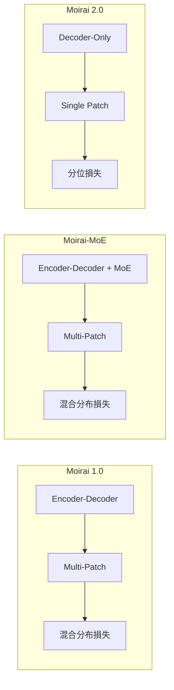

> 本記事は [Moirai 2.0: When Less Is More for Time Series Forecasting (arXiv:2511.11698)](https://arxiv.org/abs/2511.11698) の解説記事です。

## 論文概要（Abstract）

Moirai 2.0は、Salesforce AI Researchが開発した時系列ファウンデーションモデル（TSFM）であり、前身のMoirai 1.0/MoEから大幅なアーキテクチャ刷新を行った。主要な変更点は、(1) masked-encoderからdecoder-onlyアーキテクチャへの転換、(2) マルチパッチ入力からシングルパッチへの簡素化、(3) 混合分布損失から分位損失（quantile loss）への変更の3点である。この簡素化により、著者らはMoirai 1.0-Large比で**30倍のモデルサイズ削減**と**2倍の推論高速化**を達成しつつ、GIFT-Evalベンチマークで同等以上の性能を報告している。3600万時系列で学習されている。

この記事は [Zenn記事: 時系列ファウンデーションモデル2025-2026年最前線：Chronos-2・TimesFM・Sundialを徹底比較](https://zenn.dev/0h_n0/articles/5c2f14f0c06a8e) の深掘りです。

## 情報源

- **arXiv ID**: 2511.11698
- **URL**: [https://arxiv.org/abs/2511.11698](https://arxiv.org/abs/2511.11698)
- **著者**: Chenghao Liu, Taha Aksu, Juncheng Liu, Xu Liu, Hanshu Yan, Quang Pham, Silvio Savarese, Doyen Sahoo, Caiming Xiong, Junnan Li
- **発表年**: 2025
- **分野**: cs.LG, stat.ML

## 背景と動機（Background & Motivation）

Moiraiシリーズは、Salesforce AI Researchが開発するTSFMファミリーである。その発展の経緯を辿ると、TSFMの設計思想の進化が見える。

### Moirai 1.0の設計

初代Moirai（ICML 2024）は、任意の周波数・可変長の時系列を統一的に処理することを目指したencoder-decoderモデルであった。特徴的だったのは、周波数ごとに異なる入出力プロジェクション層を定義する設計であり、これにより日次・時間次・月次など異なる周波数のデータを同一モデルで処理できた。

しかし、この設計には以下の課題があった。
- **周波数ごとのプロジェクション層**: どの周波数にどの層を割り当てるかのヒューリスティックが必要
- **マルチパッチ入力**: 異なるパッチサイズの組み合わせが計算コストを増大
- **混合分布出力**: 複数の分布（正規分布、Student-t等）の混合は表現力が高いが計算コストも高い

### Moirai-MoE（2024年10月）

Moirai-MoEは、周波数ごとのプロジェクション層の問題をSparse Mixture of Experts（MoE）で解決した。単一の入出力プロジェクション層を使いつつ、MoEでデータ駆動のルーティングを実現した。Moirai-MoE-SmallはMoirai-Smallに対して17%の性能改善を達成し、活性パラメータ数はChronosやTimesFMの最大65分の1であった。

### Moirai 2.0の動機

Moirai 2.0の著者らは、「複雑さを増すのではなく、適切な簡素化が性能向上につながる」という仮説に基づいてアーキテクチャ設計を根本的に見直した。

## 主要な貢献（Key Contributions）

- **貢献1**: Decoder-only + シングルパッチ + 分位損失という簡素化されたアーキテクチャが、複雑なencoder-decoder + MoE + 混合分布と同等以上の性能を達成することを実証
- **貢献2**: Moirai 1.0-Large比で30倍のモデルサイズ削減と2倍の推論高速化
- **貢献3**: Recursive Multi-Quantile Decoding（再帰的マルチ分位デコーディング）の提案

## 技術的詳細（Technical Details）

### アーキテクチャの変遷



### Decoder-Onlyアーキテクチャ

Moirai 2.0はdecoder-onlyアーキテクチャを採用している。入力時系列をパッチに分割し、各パッチを1トークンとして因果的self-attentionで処理する。

decoder-only選択の利点は以下の通りである。
- **実装の簡素化**: encoderとdecoderの2つのネットワークが不要
- **自己回帰的生成**: パッチ単位の自己回帰により、任意長の予測が可能
- **効率的なKVキャッシュ**: 推論時に過去のkey-valueをキャッシュして再計算を回避

### シングルパッチ入力

Moirai 1.0/MoEでは、異なるパッチサイズ（例: 8, 16, 32, 64）を組み合わせたマルチパッチ入力を使用していた。Moirai 2.0では単一のパッチサイズに統一し、モデルの複雑さを大幅に削減している。

著者らのアブレーション研究によると、パッチサイズの多様性がもたらす精度向上は限定的であり、単一パッチでも十分な性能が得られることが示されている。

### 分位損失（Quantile Loss）

Moirai 1.0は混合分布（Mixture Distribution）を出力し、各コンポーネント分布のパラメータ（平均、分散、混合重み）を推定していた。Moirai 2.0では、これを分位損失に簡素化している。

$$
\mathcal{L}_q(\hat{y}, y) = \sum_{i=1}^{Q} \left[ q_i \cdot \max(y - \hat{y}_{q_i}, 0) + (1 - q_i) \cdot \max(\hat{y}_{q_i} - y, 0) \right]
$$

ここで、
- $Q$: 分位点の数
- $q_i$: $i$番目の分位点（例: 0.1, 0.25, 0.5, 0.75, 0.9）
- $\hat{y}_{q_i}$: 分位$q_i$での予測値
- $y$: 実測値

分位損失の利点は以下の通りである。
- **計算効率**: 分布パラメータの推定が不要で、直接分位点を予測
- **分布の仮定不要**: 正規分布やStudent-t分布などの仮定なしに確率的予測を提供
- **実用的な出力**: 多くのビジネスアプリケーションでは、分位点（P10, P50, P90等）が直接利用される

### Recursive Multi-Quantile Decoding

Moirai 2.0の独自技術として、**再帰的マルチ分位デコーディング**がある。これは、予測ホライズンの各ステップで複数の分位点を同時に予測し、次のステップの入力として使用する手法である。

```python
# Recursive Multi-Quantile Decodingの概念コード
import torch
import torch.nn as nn

class RecursiveQuantileDecoder(nn.Module):
    """再帰的マルチ分位デコーディング

    各ステップで複数の分位点を同時予測し、
    次のステップの入力として中央値を使用する。
    """

    def __init__(self, d_model: int, n_quantiles: int = 9):
        super().__init__()
        self.d_model = d_model
        self.n_quantiles = n_quantiles
        self.quantile_head = nn.Linear(d_model, n_quantiles)

    def forward(
        self,
        hidden: torch.Tensor,
        horizon: int,
    ) -> torch.Tensor:
        """再帰的予測

        Args:
            hidden: Transformerの最終隠れ状態 (batch, seq_len, d_model)
            horizon: 予測ステップ数

        Returns:
            分位予測 (batch, horizon, n_quantiles)
        """
        predictions = []
        current_hidden = hidden[:, -1:, :]  # 最終パッチ

        for step in range(horizon):
            # 複数の分位点を同時予測
            quantiles = self.quantile_head(current_hidden)
            # shape: (batch, 1, n_quantiles)
            predictions.append(quantiles)

            # 中央値を次のステップの入力として使用
            median_idx = self.n_quantiles // 2
            median_pred = quantiles[:, :, median_idx:median_idx+1]

            # 次のステップの隠れ状態を更新
            # (実際にはTransformerの自己回帰的処理)
            current_hidden = self._update_hidden(
                current_hidden, median_pred
            )

        return torch.cat(predictions, dim=1)
```

## 実装のポイント（Implementation）

### モデルサイズの比較

| モデル | パラメータ数 | 推論速度（相対） |
|--------|-----------|----------------|
| Moirai 1.0-Large | ~300M | 1.0x (基準) |
| Moirai-MoE-Small | ~10M (活性) | 1.5x |
| **Moirai 2.0** | **~10M** | **2.0x** |

著者らによると、Moirai 2.0はMoirai 1.0-Largeの約30分の1のサイズでありながら、GIFT-Evalで同等以上の性能を達成している。

### アブレーション結果

著者らのアブレーション研究では、以下の3要素がMoirai 2.0の性能向上に最も寄与したと報告されている。

1. **Decoder-onlyバックボーン**: 最も大きな性能向上要因
2. **Recursive Multi-Quantile Decoding**: 2番目に大きな要因
3. **分位損失**: 計算効率の改善に最も寄与

### 実装上の注意点

- **パッチサイズの選択**: Moirai 2.0ではシングルパッチを使用するため、パッチサイズの選択が重要。データの周波数に応じて適切なサイズを選択する
- **分位点の数**: デフォルトで9分位点（0.1, 0.2, ..., 0.9）を予測。ビジネス要件に応じてカスタマイズ可能
- **KVキャッシュ**: 推論時にKVキャッシュを有効化することで、自己回帰的予測の速度を大幅に改善

## Production Deployment Guide

### AWS実装パターン（コスト最適化重視）

Moirai 2.0は約10Mパラメータと非常に軽量であり、CPU推論も実用的な速度で動作する。

| 規模 | 月間リクエスト | 推奨構成 | 月額コスト | 主要サービス |
|------|--------------|---------|-----------|------------|
| **Small** | ~3,000 (100/日) | Serverless | $30-80 | Lambda (CPU) + DynamoDB |
| **Medium** | ~30,000 (1,000/日) | Hybrid | $150-400 | ECS Fargate (CPU) + ElastiCache |
| **Large** | 300,000+ (10,000/日) | Container | $500-1,500 | EKS + CPU/GPU混在 |

Moirai 2.0の特筆すべき点は、**GPUなしでも実用的な推論速度が得られる**ことである。10Mパラメータモデルはml.c6i.xlarge（CPU）で1予測あたり数十ミリ秒で処理可能であり、GPU使用時のChronos-2やTimesFM-2.5と比較して大幅なコスト削減が可能である。

**コスト削減テクニック**:
- CPUインスタンス使用でGPUコストを完全回避（最大95%削減）
- Lambda (CPU) でアイドルコストゼロ化
- Fargate Spot（CPU）で最大70%削減
- ECS/EKSのスケールダウンでアイドルタイムコスト削減

**コスト試算の注意事項**:
- 上記は2026年3月時点のAWS ap-northeast-1（東京）リージョン料金に基づく概算値です
- Moirai 2.0の軽量性によりCPU推論が実用的であるため、GPU不要のコスト試算としています
- 最新料金は [AWS料金計算ツール](https://calculator.aws/) で確認してください

### Terraformインフラコード

```hcl
# --- Moirai 2.0: Lambda (CPU) 構成 ---
resource "aws_lambda_function" "moirai2_handler" {
  filename      = "moirai2_lambda.zip"
  function_name = "moirai2-forecast"
  role          = aws_iam_role.lambda_role.arn
  handler       = "handler.predict"
  runtime       = "python3.11"
  timeout       = 30
  memory_size   = 512  # 10Mパラメータは512MBで十分

  environment {
    variables = {
      MODEL_PATH     = "/opt/ml/model"
      N_QUANTILES    = "9"
      PATCH_SIZE     = "32"
      DYNAMODB_TABLE = aws_dynamodb_table.cache.name
    }
  }

  layers = [aws_lambda_layer_version.moirai2_model.arn]
}

# --- モデル重みをLambda Layerとして配置 ---
resource "aws_lambda_layer_version" "moirai2_model" {
  filename            = "moirai2_model_layer.zip"
  layer_name          = "moirai2-model-weights"
  compatible_runtimes = ["python3.11"]
  description         = "Moirai 2.0 model weights (~40MB)"
}

# --- API Gateway ---
resource "aws_apigatewayv2_api" "forecast_api" {
  name          = "moirai2-forecast-api"
  protocol_type = "HTTP"
}

resource "aws_apigatewayv2_integration" "lambda" {
  api_id             = aws_apigatewayv2_api.forecast_api.id
  integration_type   = "AWS_PROXY"
  integration_uri    = aws_lambda_function.moirai2_handler.invoke_arn
  payload_format_version = "2.0"
}
```

### コスト最適化チェックリスト

- [ ] CPU推論でGPUコストを完全回避（10Mパラメータなら512MB Lambda CPU）
- [ ] Lambda Layerにモデル重み配置でコールドスタート最小化
- [ ] DynamoDBキャッシュで重複推論を排除
- [ ] API GatewayのThrottlingで予期しないコスト急増を防止
- [ ] Fargate Spot（CPU）使用で最大70%削減
- [ ] AWS Budgets設定で月額コスト監視

## 実験結果（Results）

### GIFT-Evalでの性能

著者らによると、Moirai 2.0はGIFT-Evalベンチマークで上位に位置しており、特にモデルサイズと推論速度を考慮した「効率性」の面で優位性がある。

### スケーリングの限界

著者らは重要な制約として、「パラメータ数の増加に伴い性能がプラトーに達し、長い予測ホライズンでは性能が低下する」ことを報告している。これは、単純なスケーリング（モデルサイズの拡大）がTSFMの性能向上に直結しないことを示唆しており、データスケーリングや新しいアーキテクチャの探索が今後の課題である。

## 実運用への応用（Practical Applications）

### コスト重視のユースケース

Moirai 2.0の最大の実務的利点は、その軽量性にある。以下のユースケースで特に有効である。

- **エッジデバイスでの推論**: IoTセンサーのリアルタイム異常検知に、デバイス上で直接推論
- **大量バッチ処理**: 数十万時系列の一括予測をCPUクラスタで低コストに処理
- **プロトタイピング**: GPU環境なしでTSFMの性能を素早く評価

### モデル選定における位置づけ

Moirai 2.0は「最高精度」ではなく「コスト効率」を重視する場合の最有力候補である。Chronos-2やTimesFM-2.5が精度面で上回る場合でも、推論コストが10分の1以下であれば、ビジネス全体のROIではMoirai 2.0が勝る可能性がある。

## 関連研究（Related Work）

- **Moirai 1.0 (ICML 2024)**: 周波数別プロジェクション層を持つencoder-decoderモデル
- **Moirai-MoE**: MoE構造で周波数ルーティングを自動化
- **TimesFM-2.5**: Decoder-only + 200Mパラメータ。Moirai 2.0より大規模だがGPU推奨
- **Chronos-2**: Encoder-only + 120Mパラメータ。共変量対応で差別化

## まとめと今後の展望

Moirai 2.0は「Less is More（少ないほど良い）」という設計哲学を体現したモデルである。decoder-onlyへの転換、シングルパッチ化、分位損失への簡素化という3つの変更により、モデルサイズを30分の1に削減しつつ性能を維持・改善した。

著者らが指摘するスケーリングのプラトー問題は、TSFMの今後の研究方向に重要な示唆を与えている。単純なパラメータ増加ではなく、学習データの品質・多様性の改善や、新しいアーキテクチャ（flow-matching等）の探索が必要である可能性がある。

実務的には、GPUなしで実用的な推論が可能な点が最大の差別化要因であり、コスト制約の厳しい環境でのTSFM導入における有力な選択肢となる。

## 参考文献

- **arXiv**: [https://arxiv.org/abs/2511.11698](https://arxiv.org/abs/2511.11698)
- **Moirai 1.0 (ICML 2024)**: [https://arxiv.org/abs/2310.10688](https://arxiv.org/abs/2310.10688)
- **Moirai-MoE**: [https://arxiv.org/abs/2402.02368](https://arxiv.org/abs/2402.02368)
- **uni2ts (GitHub)**: Moiraiシリーズの公式実装
- **Related Zenn article**: [https://zenn.dev/0h_n0/articles/5c2f14f0c06a8e](https://zenn.dev/0h_n0/articles/5c2f14f0c06a8e)
