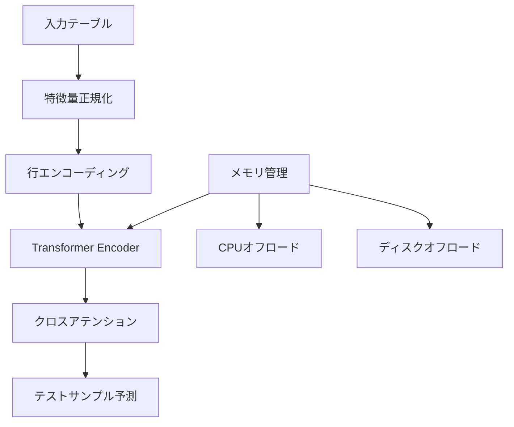

本記事は [arXiv:2602.11139 "TabICL v2: A Scalable and Open Tabular Foundation Model"](https://arxiv.org/abs/2602.11139) の解説記事です。

## 論文概要（Abstract）

TabICL v2は、フランスINRIA（Sodaチーム）が開発したテーブルデータ向けIn-Context Learning（ICL）基盤モデルである。MIT Licenseで完全にオープンソースとして公開されており、TabPFNと同じICLパラダイムを採用しつつ、大規模データセットへの対応と推論速度の改善を実現したと著者らは報告している。TabArenaおよびTALENTベンチマークにおいて、チューニングなしのTabICL v2がRealTabPFN-2.5（ハイパーパラメータチューニング・アンサンブル・実データファインチューニング済み）を上回る精度を達成したと報告されている点が注目に値する。

この記事は [Zenn記事: テーブルデータ基盤モデル2026年最前線](https://zenn.dev/0h_n0/articles/3f66d81be74e2a) の深掘りです。

## 情報源

- **arXiv ID**: 2602.11139
- **URL**: [https://arxiv.org/abs/2602.11139](https://arxiv.org/abs/2602.11139)
- **著者**: Léo Grinsztajn, Théo Mmusic, Gaël Varoquaux et al.（INRIA Soda チーム）
- **発表年**: 2026年2月
- **分野**: cs.LG
- **ライセンス**: MIT License

## 背景と動機（Background & Motivation）

テーブルデータのICL基盤モデルとして、PriorLabsが開発したTabPFN v2/v2.5が高い精度を達成している一方、実務での採用には以下の課題が存在した。

第一に、**ライセンスの制約**がある。TabPFN-2.5のRealTabPFN（実データでファインチューニングされた重み）は非商用ライセンスで提供されており、商用プロダクトへの組み込みが制限される。第二に、**スケーラビリティの限界**がある。TabPFN-2.5は50,000行が上限であり、それ以上のデータセットではGBDT（XGBoost等）に頼らざるを得ない。第三に、**推論速度**の問題がある。Transformerベースの推論は勾配ブースト決定木と比較して桁違いに遅い場合がある。

TabICL v2はこれらの課題すべてに対処することを目的として開発された。特にMIT Licenseでの提供は、商用利用を検討する実務者にとって重要な差別化要因である。

## 主要な貢献（Key Contributions）

著者らが報告する主要な貢献は以下のとおりである。

- **貢献1**: MIT Licenseでの完全オープンソース提供。モデル重み・学習コード・評価スクリプトすべてを公開
- **貢献2**: 最大約500,000行のデータセットに対応。TabPFN-2.5の50,000行制限に対して10倍のスケーラビリティ
- **貢献3**: 大規模データセットにおいてTabPFN-2.5比で約10倍の推論速度を実現
- **貢献4**: TabArenaおよびTALENTベンチマークにおいて、チューニングなしの状態でRealTabPFN-2.5（チューニング済み）を上回る精度を報告

## 技術的詳細（Technical Details）

### ICLアーキテクチャの設計

TabICL v2はTabPFNと同じくICL型のアプローチを採用しているが、アーキテクチャに重要な違いがある。



TabPFNが全データポイントを単一のコンテキストとしてTransformerに入力するのに対し、TabICL v2は**分割コンテキスト戦略**を採用している。大規模データセットを複数のチャンクに分割し、各チャンクの表現をクロスアテンションで統合する。この設計により、メモリ使用量がデータサイズに対して線形にスケールする。

### 事前学習の詳細

TabICL v2の事前学習データは、TabPFNと同様に合成データを使用するが、生成プロセスに違いがある。

著者らは、300行から48,000行までの多様なサイズの合成データセットを生成し、以下の分布からサンプリングしたと報告している。

$$
\mathcal{D}_{\text{synth}} \sim p(\mathcal{D}) = \prod_{k=1}^{K} p(\mathcal{D}_k \mid \phi_k), \quad \phi_k \sim p(\phi)
$$

ここで、
- $K$: 合成データセットの総数
- $\mathcal{D}_k$: $k$番目の合成データセット
- $\phi_k$: $k$番目のデータセットの生成パラメータ（カラム数、関数関係、ノイズレベル等）
- $p(\phi)$: 生成パラメータの事前分布

TabPFN v2との重要な違いは、**合成データのサイズ分布**である。TabPFN v2は比較的小規模な合成データ（最大10K行程度）で学習しているのに対し、TabICL v2は最大48K行の合成データを含む。これにより、大規模データセットへの汎化性能が改善されたと著者らは分析している。

### メモリ管理機構

TabICL v2が大規模データに対応できる技術的な鍵は、**CPUとディスクへのオフロード機構**である。

```python
from typing import Optional
import torch

def chunked_icl_predict(
    X_train: torch.Tensor,
    y_train: torch.Tensor,
    X_test: torch.Tensor,
    model: torch.nn.Module,
    chunk_size: int = 10_000,
    device: str = "cuda",
) -> torch.Tensor:
    """チャンク分割によるICL推論

    大規模データセットをchunk_sizeごとに分割し、
    各チャンクの表現をクロスアテンションで統合する。

    Args:
        X_train: 学習データ (N, D)
        y_train: ラベル (N,)
        X_test: テストデータ (M, D)
        model: 事前学習済みTabICL v2
        chunk_size: チャンクサイズ（デフォルト10,000行）
        device: 推論デバイス

    Returns:
        predictions: 予測結果 (M, C)
    """
    N = X_train.shape[0]
    n_chunks = (N + chunk_size - 1) // chunk_size

    # Step 1: 各チャンクをエンコード（GPU→CPU転送でメモリ節約）
    chunk_representations = []
    for i in range(n_chunks):
        start = i * chunk_size
        end = min((i + 1) * chunk_size, N)

        X_chunk = X_train[start:end].to(device)
        y_chunk = y_train[start:end].to(device)

        # チャンクのコンテキスト表現を計算
        repr_chunk = model.encode_context(X_chunk, y_chunk)

        # CPUにオフロード（GPU VRAM解放）
        chunk_representations.append(repr_chunk.cpu())

    # Step 2: テストサンプルのクロスアテンション
    X_test_gpu = X_test.to(device)
    test_repr = model.encode_query(X_test_gpu)

    # Step 3: 各チャンク表現とクロスアテンション
    aggregated = torch.zeros_like(test_repr)
    for repr_chunk in chunk_representations:
        repr_gpu = repr_chunk.to(device)
        attention_out = model.cross_attention(test_repr, repr_gpu)
        aggregated += attention_out
        del repr_gpu  # 即座にGPU メモリ解放

    aggregated /= n_chunks

    # Step 4: 予測ヘッド
    predictions = model.prediction_head(aggregated)
    return predictions
```

このチャンク分割戦略により、GPU VRAMが限られた環境でも100万サンプル規模のデータセットを処理できるとされている。

### 推論速度の最適化

TabICL v2がTabPFN-2.5比で約10倍高速である理由は、以下の3点に起因すると著者らは分析している。

1. **チャンク並列処理**: 各チャンクのエンコードを独立に実行できるため、GPUの並列性を活用可能
2. **アテンションの計算量削減**: TabPFNの自己アテンション（$O(N^2)$）に対し、チャンク分割により実効的な計算量を$O(N \cdot C)$（$C$はチャンクサイズ）に削減
3. **効率的なメモリ転送**: CPUオフロードにより、GPU VRAMのボトルネックを回避

## 実装のポイント（Implementation）

### 基本的な使用方法

```python
# TabICL v2の基本使用例
# pip install tabicl
from tabicl import TabICLClassifier, TabICLRegressor
from sklearn.model_selection import cross_val_score
from sklearn.datasets import make_classification

# 大規模データ生成（10万行）
X, y = make_classification(
    n_samples=100_000,
    n_features=50,
    n_informative=30,
    random_state=42,
)

# 分類
clf = TabICLClassifier()
scores = cross_val_score(clf, X, y, cv=5, scoring="accuracy")
print(f"Classification Accuracy: {scores.mean():.4f} (+/- {scores.std():.4f})")

# 回帰
from sklearn.datasets import make_regression
X_reg, y_reg = make_regression(
    n_samples=100_000,
    n_features=50,
    n_informative=30,
    random_state=42,
)
reg = TabICLRegressor()
scores_reg = cross_val_score(reg, X_reg, y_reg, cv=5, scoring="r2")
print(f"Regression R2: {scores_reg.mean():.4f} (+/- {scores_reg.std():.4f})")
```

### TabPFNとの使い分け

```python
# データサイズに応じた自動モデル選択
def select_tabular_model(
    n_samples: int,
    n_features: int,
    commercial_use: bool = False,
) -> str:
    """データ特性に応じてモデルを推薦

    Args:
        n_samples: サンプル数
        n_features: 特徴量数
        commercial_use: 商用利用かどうか

    Returns:
        推薦モデル名
    """
    if commercial_use:
        # 商用: MIT LicenseのTabICL v2を優先
        if n_samples <= 500_000:
            return "TabICL v2 (MIT License)"
        else:
            return "XGBoost (Apache 2.0)"

    if n_samples <= 10_000 and n_features <= 500:
        return "TabPFN v2 (highest accuracy, small data)"
    elif n_samples <= 50_000 and n_features <= 2_000:
        return "TabPFN-2.5 (extended scale)"
    elif n_samples <= 500_000:
        return "TabICL v2 (large-scale, fast)"
    else:
        return "XGBoost / LightGBM (very large scale)"
```

### 注意点と落とし穴

- **事前学習データのサイズ範囲**: TabICL v2は300〜48K行の合成データで事前学習されている。48Kを大幅に超えるデータセットでは汎化性能にばらつきが出る可能性がある。著者らは600Kサンプルでも良好な結果を報告しているが、保証はされていない
- **GPU推奨**: CPUでも動作するが、大規模データでの推論にはGPU使用が強く推奨される
- **特徴量前処理**: TabICL v2は内部で特徴量正規化を行うが、欠損値処理はユーザー側で行う必要がある

## Production Deployment Guide

### AWS実装パターン（コスト最適化重視）

TabICL v2をプロダクション環境で運用する場合、MIT Licenseのため商用利用に制約がない点が大きな利点である。

| 規模 | 月間リクエスト | 推奨構成 | 月額コスト目安 | 主要サービス |
|------|--------------|---------|-------------|------------|
| **Small** | ~3,000 (100/日) | Serverless | $60-150 | Lambda + S3 |
| **Medium** | ~30,000 (1,000/日) | Hybrid | $350-800 | ECS Fargate + ElastiCache |
| **Large** | 300,000+ (10,000/日) | Container | $2,000-5,000 | EKS + g5.xlarge Spot |

**Small構成の詳細**（月額$60-150）:
- **Lambda**: 2GB RAM, 120秒タイムアウト — TabICL v2直接推論（中規模データなら可能）（$30/月）
- **S3**: モデル重みストレージ（$5/月）
- **DynamoDB**: 予測キャッシュ（$10/月）
- **API Gateway**: REST API（$5/月）

TabICL v2はTabPFNより軽量なため、Lambda環境でも直接推論が可能。

**Large構成の詳細**（月額$2,000-5,000）:
- **EKS**: コントロールプレーン（$72/月）
- **EC2 Spot**: g5.xlarge × 2-4台（平均$800/月）
- **Karpenter**: 自動スケーリング（追加コストなし）
- **ElastiCache Redis**: 予測キャッシュ（$15/月）
- **CloudWatch + X-Ray**: 監視（$100/月）

**コスト試算の注意事項**: 上記は2026年3月時点のAWS ap-northeast-1リージョン料金に基づく概算値です。最新料金は [AWS料金計算ツール](https://calculator.aws/) で確認してください。

### Terraformインフラコード

**Small構成（Serverless）**:

```hcl
module "vpc" {
  source  = "terraform-aws-modules/vpc/aws"
  version = "~> 5.0"

  name = "tabicl-vpc"
  cidr = "10.0.0.0/16"
  azs  = ["ap-northeast-1a", "ap-northeast-1c"]
  private_subnets = ["10.0.1.0/24", "10.0.2.0/24"]

  enable_nat_gateway   = false
  enable_dns_hostnames = true
}

resource "aws_iam_role" "lambda_tabicl" {
  name = "lambda-tabicl-role"
  assume_role_policy = jsonencode({
    Version = "2012-10-17"
    Statement = [{
      Action    = "sts:AssumeRole"
      Effect    = "Allow"
      Principal = { Service = "lambda.amazonaws.com" }
    }]
  })
}

resource "aws_lambda_function" "tabicl_handler" {
  filename      = "lambda.zip"
  function_name = "tabicl-predict"
  role          = aws_iam_role.lambda_tabicl.arn
  handler       = "index.handler"
  runtime       = "python3.12"
  timeout       = 120
  memory_size   = 2048

  environment {
    variables = {
      MODEL_BUCKET = aws_s3_bucket.models.id
      MODEL_KEY    = "tabicl_v2/weights.pt"
    }
  }
}

resource "aws_s3_bucket" "models" {
  bucket = "tabicl-model-weights"
}

resource "aws_s3_bucket_server_side_encryption_configuration" "models" {
  bucket = aws_s3_bucket.models.id
  rule {
    apply_server_side_encryption_by_default {
      sse_algorithm = "aws:kms"
    }
  }
}
```

**Large構成（EKS + Spot）**:

```hcl
module "eks" {
  source  = "terraform-aws-modules/eks/aws"
  version = "~> 20.0"

  cluster_name    = "tabicl-inference"
  cluster_version = "1.31"
  vpc_id          = module.vpc.vpc_id
  subnet_ids      = module.vpc.private_subnets

  cluster_endpoint_public_access            = true
  enable_cluster_creator_admin_permissions   = true
}

resource "kubectl_manifest" "karpenter_nodepool" {
  yaml_body = <<-YAML
    apiVersion: karpenter.sh/v1
    kind: NodePool
    metadata:
      name: tabicl-gpu
    spec:
      template:
        spec:
          requirements:
            - key: karpenter.sh/capacity-type
              operator: In
              values: ["spot"]
            - key: node.kubernetes.io/instance-type
              operator: In
              values: ["g5.xlarge", "g5.2xlarge"]
      limits:
        cpu: "32"
        memory: "128Gi"
      disruption:
        consolidationPolicy: WhenEmptyOrUnderutilized
        consolidateAfter: 30s
  YAML
}
```

### 運用・監視設定

```python
import boto3

cloudwatch = boto3.client("cloudwatch")

# TabICL推論レイテンシ監視
cloudwatch.put_metric_alarm(
    AlarmName="tabicl-latency-p95",
    ComparisonOperator="GreaterThanThreshold",
    EvaluationPeriods=2,
    MetricName="InferenceLatency",
    Namespace="TabICL/Inference",
    Period=300,
    Statistic="p95",
    Threshold=5000,  # 5秒超過でアラート
    AlarmDescription="TabICL v2 推論P95レイテンシ異常",
)
```

### コスト最適化チェックリスト

- [ ] ~100 req/日 → Lambda直接推論（$60-150/月）
- [ ] ~1,000 req/日 → ECS Fargate（$350-800/月）
- [ ] 10,000+ req/日 → EKS + Spot（$2,000-5,000/月）
- [ ] Spot Instances優先（最大90%削減）
- [ ] 予測キャッシュ（DynamoDB/ElastiCache）で重複推論排除
- [ ] バッチ推論でスループット最適化
- [ ] AWS Budgets月額予算80%警告
- [ ] CloudWatch推論レイテンシ・エラー率監視

## 実験結果（Results）

### TabArenaベンチマーク

著者らの報告によるTabArenaベンチマークでの結果は以下のとおりである。

| 比較 | 結果（著者ら報告） |
|------|------------------|
| TabICL v2（チューニングなし） vs RealTabPFN-2.5（チューニング済み） | TabICL v2が上回る |
| TabICL v2 vs デフォルトXGBoost | TabICL v2が優位 |
| TabICL v2 vs デフォルトLightGBM | TabICL v2が優位 |

### TALENTベンチマーク

TALENTベンチマーク（大規模テーブルデータ評価）においても、TabICL v2はRealTabPFN-2.5を上回ったと報告されている。特に10K〜100K行のデータセットにおいて顕著な差が見られたとされる。

### 推論速度の比較

著者らの報告による推論速度の比較（100Kサンプル、50特徴量、GPU使用時）:

| モデル | 推論時間（相対値） |
|--------|------------------|
| TabPFN-2.5 | 1.0x（基準） |
| TabICL v2 | 約0.1x（約10倍高速） |
| XGBoost | 約0.01x（約100倍高速） |

TabICL v2はTabPFNより大幅に高速であるが、XGBoostのような純粋なツリーベース手法にはまだ及ばない。

### 制約事項

- 48K行を超えるデータでの汎化性能は保証されていない（ただし600Kでも良好な結果が報告されている）
- 事前学習データの合成手法がTabPFNと異なるため、特定のデータ分布では精度差が生じる可能性がある
- CPUオフロード機構はI/Oバウンドになる可能性がある

## 実運用への応用（Practical Applications）

TabICL v2は以下の場面で特に有効と考えられる。

- **商用プロダクト**: MIT Licenseのため、ライセンス面での懸念なく組み込み可能。SaaSプロダクトの予測機能に適している
- **大規模バッチ予測**: 10万行以上のデータセットに対して、TabPFNより高速かつ高精度な予測が可能
- **AutoMLパイプラインの構成要素**: AutoGluon等のAutoMLフレームワークにTabICL v2を組み込むことで、アンサンブルの多様性を向上させる可能性がある

## 関連研究（Related Work）

- **TabPFN v2/v2.5**（Hollmann et al., 2024, arXiv:2511.08667）: ICL型TFMの先駆者。TabICL v2はTabPFNのICLパラダイムを継承しつつ、スケーラビリティとライセンスを改善
- **CARTE**（Kim et al., 2024, arXiv:2402.16785）: グラフ表現による転移学習アプローチ。ICL型とは異なる設計思想だが、テーブルデータの汎用基盤モデルという目標は共通
- **TabArena**（2025, arXiv:2506.16791）: TabICL v2の評価に使用されたliving benchmark。モデル間の公平な比較を可能にする

## まとめと今後の展望

TabICL v2は、MIT Licenseでのオープンソース提供、500K行対応のスケーラビリティ、TabPFN比10倍の推論速度という3つの強みを持つ。特に、チューニングなしの状態でRealTabPFN-2.5（チューニング済み）を上回る精度を達成したという著者らの報告は、TFM分野における重要な進展を示している。

商用利用を検討する実務者にとって、ライセンスの自由度とスケーラビリティの観点からTabICL v2は有力な選択肢である。今後は、さらなる大規模データへの対応、蒸留メカニズムの追加、他のAutoMLフレームワークとの統合が期待される研究方向である。

## 参考文献

- **arXiv**: [https://arxiv.org/abs/2602.11139](https://arxiv.org/abs/2602.11139)
- **Code**: [https://github.com/soda-inria/tabicl](https://github.com/soda-inria/tabicl)
- **Related Zenn article**: [https://zenn.dev/0h_n0/articles/3f66d81be74e2a](https://zenn.dev/0h_n0/articles/3f66d81be74e2a)
