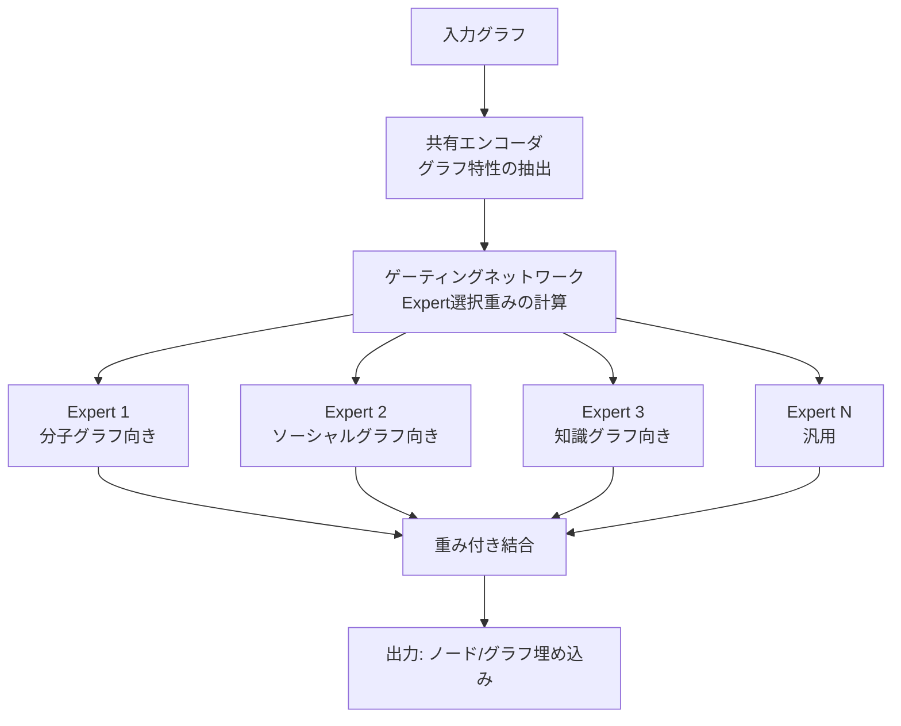

本記事は [AnyGraph: Graph Foundation Model in the Wild（arXiv:2408.10700）](https://arxiv.org/abs/2408.10700) の解説記事です。

## 論文概要（Abstract）

AnyGraph（Xia & Huang, 2024）は、Mixture-of-Experts（MoE）アーキテクチャを採用した汎用グラフファウンデーションモデルである。著者らは、グラフドメインにおける「構造の異質性」と「特徴の異質性」という2つの根本的課題に対し、Expert Routing機構による動的なエキスパート選択で対処する手法を提案した。38の異なるデータセット（ソーシャル、ウェブ、学術、分子等）での評価で、多くのドメインにおいてゼロショットで教師あり手法に匹敵する性能を達成したと報告している。

この記事は [Zenn記事: グラフファウンデーションモデル2025-2026年最前線](https://zenn.dev/0h_n0/articles/e4da90566d7aac) の深掘りです。

## 情報源

- **arXiv ID**: 2408.10700
- **URL**: [https://arxiv.org/abs/2408.10700](https://arxiv.org/abs/2408.10700)
- **著者**: Xia, Huang et al.
- **発表年**: 2024
- **分野**: cs.LG, cs.AI

## 背景と動機（Background & Motivation）

グラフファウンデーションモデルの構築における最大の障壁は、グラフドメインの極端な多様性である。分子グラフ（数十ノード、原子・結合の物理化学的特徴）とソーシャルネットワーク（数百万ノード、ユーザー属性）では、構造も特徴量も根本的に異なる。

この多様性は2つの軸に分解できる。

1. **構造の異質性（Structural Heterogeneity）**: グラフのトポロジー特性（密度、次数分布、クラスタ係数など）がドメイン間で大きく異なる
2. **特徴の異質性（Feature Heterogeneity）**: ノード特徴量の次元数、データ型、意味がドメイン間で異なる

従来のGFMアプローチでは、単一のGNNで全ドメインを処理しようとするため、あるドメインに最適化すると別のドメインで性能が低下する「ドメインシフト」問題が生じていた。AnyGraphは、NLPで成功を収めたMoEアーキテクチャをグラフドメインに適用し、この問題の解決を試みる。

## 主要な貢献（Key Contributions）

- **貢献1**: グラフドメインの構造的・特徴的異質性に対処するMoEベースGFMアーキテクチャの提案
- **貢献2**: 38データセットでのゼロショット評価で、創発的能力（一定規模を超えると汎化性能が急激に改善する現象）を確認
- **貢献3**: Expert Routing機構により、入力グラフの特性に応じた動的なモデル構成を実現

## 技術的詳細（Technical Details）

### MoEアーキテクチャの概要

AnyGraphのアーキテクチャは、共有バックボーン、Expert群、ゲーティングネットワークの3つの主要コンポーネントから構成される。



### Expert Routing機構

AnyGraphの中核は、入力グラフの特性を分析し、適切なExpertを動的に選択するRouting機構である。

まず、入力グラフ $\mathcal{G}$ の構造的特徴ベクトル $\mathbf{s}$ を計算する。

$$
\mathbf{s} = \text{StructEncoder}(\mathcal{G}) = [\bar{d}, \sigma_d, C, \rho, \lambda_2, \ldots]
$$

ここで、
- $\bar{d}$: 平均次数
- $\sigma_d$: 次数の標準偏差
- $C$: グローバルクラスタリング係数
- $\rho$: エッジ密度
- $\lambda_2$: ラプラシアン行列の第2固有値（代数的連結度）

ゲーティングネットワークは、この構造的特徴ベクトルからExpert選択重みを計算する。

$$
\mathbf{g}(\mathbf{s}) = \text{TopK}\left(\text{Softmax}(\mathbf{W}_g \mathbf{s} + \mathbf{b}_g), k\right)
$$

ここで、
- $\mathbf{W}_g, \mathbf{b}_g$: ゲーティングネットワークのパラメータ
- $\text{TopK}(\cdot, k)$: 上位 $k$ 個のExpertのみを選択し、残りをゼロにする操作

最終的な出力は、選択されたExpertの出力の重み付き和となる。

$$
\mathbf{y} = \sum_{i=1}^{N} g_i(\mathbf{s}) \cdot E_i(\mathbf{x})
$$

ここで $g_i(\mathbf{s})$ はExpert $E_i$ に対するゲーティング重み、$\mathbf{x}$ はグラフの特徴量表現である。TopKにより実際に計算されるExpertは $k$ 個のみであるため、Expert数 $N$ を増やしても推論コストは $k$ に比例する。

### 特徴の異質性への対処

異なるドメインのグラフは特徴量の次元数・意味が異なるため、直接的な共有が困難である。AnyGraphは以下の戦略を採用する。

**特徴量プロジェクション**: 各ドメインの特徴量を共通の潜在空間に射影する。

$$
\mathbf{x}_{\text{unified}} = \mathbf{W}_{\text{proj}}^{(d)} \mathbf{x}_{\text{raw}} + \mathbf{b}_{\text{proj}}^{(d)}
$$

ここで $d$ はドメインインデックス、$\mathbf{W}_{\text{proj}}^{(d)} \in \mathbb{R}^{h \times f_d}$ はドメイン $d$ 固有の射影行列、$f_d$ はドメイン $d$ の元の特徴量次元数、$h$ は共通の潜在次元数である。

**グラフ構造エンコーディング**: 特徴量が存在しない場合（構造のみのグラフ）にも対応するため、ノードの構造的特徴（次数、PageRank、クラスタリング係数など）を自動的に計算して特徴量として使用する。

```python
import torch
import torch.nn as nn
import torch.nn.functional as F
from torch_geometric.nn import GCNConv, global_mean_pool
from torch_geometric.data import Data
from typing import List


class ExpertGNN(nn.Module):
    """個別のExpert GNNモジュール。"""

    def __init__(self, in_channels: int, hidden_channels: int, num_layers: int = 3):
        super().__init__()
        self.convs = nn.ModuleList()
        self.convs.append(GCNConv(in_channels, hidden_channels))
        for _ in range(num_layers - 1):
            self.convs.append(GCNConv(hidden_channels, hidden_channels))

    def forward(self, x: torch.Tensor, edge_index: torch.Tensor) -> torch.Tensor:
        for conv in self.convs:
            x = conv(x, edge_index).relu()
        return x


class GatingNetwork(nn.Module):
    """グラフの構造的特徴に基づくゲーティングネットワーク。"""

    def __init__(self, struct_feat_dim: int, num_experts: int, top_k: int = 2):
        super().__init__()
        self.top_k = top_k
        self.gate = nn.Sequential(
            nn.Linear(struct_feat_dim, 64),
            nn.ReLU(),
            nn.Linear(64, num_experts),
        )

    def forward(self, struct_features: torch.Tensor) -> torch.Tensor:
        """Expert選択重みを計算する。

        Args:
            struct_features: グラフの構造的特徴 (batch, struct_feat_dim)
        Returns:
            ゲーティング重み (batch, num_experts)、TopK以外は0
        """
        logits = self.gate(struct_features)
        top_k_vals, top_k_idx = torch.topk(logits, self.top_k, dim=-1)
        gate_weights = torch.zeros_like(logits)
        gate_weights.scatter_(1, top_k_idx, F.softmax(top_k_vals, dim=-1))
        return gate_weights


class AnyGraphMoE(nn.Module):
    """AnyGraph風のMoE-GFMの概念実装。"""

    def __init__(
        self,
        unified_dim: int = 128,
        hidden_channels: int = 256,
        num_experts: int = 8,
        top_k: int = 2,
        struct_feat_dim: int = 6,
    ):
        super().__init__()
        self.experts = nn.ModuleList([
            ExpertGNN(unified_dim, hidden_channels)
            for _ in range(num_experts)
        ])
        self.gating = GatingNetwork(struct_feat_dim, num_experts, top_k)

    def compute_struct_features(self, data: Data) -> torch.Tensor:
        """グラフの構造的特徴を計算する。

        Args:
            data: PyGのDataオブジェクト
        Returns:
            構造的特徴ベクトル (1, struct_feat_dim)
        """
        num_nodes = data.num_nodes
        num_edges = data.num_edges
        avg_degree = num_edges / max(num_nodes, 1)
        density = num_edges / max(num_nodes * (num_nodes - 1), 1)

        features = torch.tensor([[
            num_nodes,
            num_edges,
            avg_degree,
            density,
            0.0,  # クラスタリング係数（簡略化）
            0.0,  # 代数的連結度（簡略化）
        ]], dtype=torch.float32)
        return features

    def forward(self, data: Data) -> torch.Tensor:
        """MoEによるグラフ処理。

        Args:
            data: 入力グラフ
        Returns:
            ノード埋め込み (num_nodes, hidden_channels)
        """
        struct_feat = self.compute_struct_features(data)
        gate_weights = self.gating(struct_feat)  # (1, num_experts)

        expert_outputs: List[torch.Tensor] = []
        for i, expert in enumerate(self.experts):
            if gate_weights[0, i] > 0:
                out = expert(data.x, data.edge_index)
                expert_outputs.append(gate_weights[0, i] * out)
            else:
                expert_outputs.append(
                    torch.zeros(data.num_nodes, out.size(-1) if expert_outputs else 256)
                )

        return sum(expert_outputs)
```

### スケーリング則と創発的能力

著者らは、モデルサイズ（Expert数とExpertサイズ）およびデータ量を変化させた実験で、以下の知見を報告している。

**スケーリング則**: Expert数を増やすほど、また各Expertのパラメータ数を増やすほど、評価損失が予測可能に減少する。

**創発的能力**: 一定のモデル規模を超えると、ゼロショット汎化性能が急激に改善する現象が観察されている。著者らは、これをNLPにおけるLLMの創発的能力と類似した現象と位置づけている。

## 実験結果（Results）

著者らが報告した主要なベンチマーク結果を以下にまとめる。

**38データセットでの評価（論文の実験結果より）**:

| 評価カテゴリ | データセット例 | ゼロショット性能 |
|-------------|-------------|---------------|
| ソーシャルネットワーク | Reddit, IMDB | 教師あり手法に匹敵 |
| 学術ネットワーク | Cora, CiteSeer, PubMed | 一部タスクで教師あり手法を上回る |
| 分子グラフ | PCBA, MolHIV | 競合的だがドメイン固有モデルにはやや劣る |
| ウェブグラフ | Amazon, Yelp | 教師あり手法に匹敵 |

**MoEの効果**: 著者らの報告によると、MoEなしの単一モデルと比較して、MoEアーキテクチャは特にドメイン間の汎化性能で優位性を示す。単一モデルでは「あるドメインに過適合すると別のドメインの性能が低下する」現象が顕著であったが、MoEでは各Expertが異なるドメインを担当することでこの問題が緩和されている。

## 実装のポイント（Implementation）

**Expert数の選択**: 著者らの実験では8-16個のExpertが使用されている。Expert数が少なすぎるとドメイン間の分離が不十分になり、多すぎると各Expertの学習データが減少して性能が低下する。TopK=2が推奨されている。

**負荷バランシング**: MoEの既知の課題として、特定のExpertにリクエストが集中する「負荷不均衡」がある。著者らは、ゲーティングネットワークの学習にauxiliary load balancing lossを追加し、Expert間の使用頻度を均等化している。

$$
\mathcal{L}_{\text{balance}} = N \cdot \sum_{i=1}^{N} f_i \cdot p_i
$$

ここで $f_i$ はExpert $i$ が選択された頻度、$p_i$ はExpert $i$ のゲーティング重みの平均値、$N$ はExpert数である。

**構造的特徴量の計算コスト**: ラプラシアン固有値やクラスタリング係数の計算は大規模グラフでコストがかかる。著者らはサンプリングベースの近似手法を使用している。

## 実運用への応用（Practical Applications）

**適用が見込まれるユースケース**:
- **マルチドメイン推薦**: EC・SNS・コンテンツなど異なるドメインのグラフを単一モデルで処理
- **異常検知**: 金融・サイバーセキュリティなど複数の異なるグラフ構造での汎用的な異常検知
- **創薬**: 分子グラフと相互作用ネットワークの同時処理

**コスト効率**: TopKルーティングにより、Expert数を増やしても推論コストは一定に保てる。これは、ドメイン数が増えてもスケーラブルに対応できることを意味する。

公式リポジトリ: [GitHub: HKUDS/AnyGraph](https://github.com/HKUDS/AnyGraph)

## 関連研究（Related Work）

- **GraphBFF（arXiv 2602.04768）**: 14億パラメータの単一モデルGFM。AnyGraphのMoEとは対照的に、単一の大規模モデルでスケーリングを追求するアプローチ
- **Switch Transformer（Fedus et al., 2022）**: NLPにおけるMoEの先行研究。TopK=1のルーティングを採用し、計算効率を極限まで追求
- **UniGraph（arXiv 2402.13630）**: テキスト属性をLLMで統一的にエンコードするGFM。AnyGraphとは異なり、特徴の異質性をLLMの言語理解能力で解決

## まとめと今後の展望

AnyGraphは、グラフドメインの多様性という根本的課題に対し、MoEアーキテクチャによる実用的な解を示した。38データセットでのゼロショット評価で教師あり手法に匹敵する性能を達成し、創発的能力の存在も確認されている。

今後の課題として、Expert数の自動調整（Auto-MoE）、ドメイン間の知識転移の理論的分析、および推論時のExpert選択の解釈可能性が挙げられる。GraphBFFのような単一大規模モデルとMoEベースのモデルのどちらが最終的に優位になるかは、今後のスケーリング実験の結果に依存する。

## 参考文献

- **arXiv**: [https://arxiv.org/abs/2408.10700](https://arxiv.org/abs/2408.10700)
- **Code**: [https://github.com/HKUDS/AnyGraph](https://github.com/HKUDS/AnyGraph)
- **Related**: [GraphBFF (arXiv 2602.04768)](https://arxiv.org/abs/2602.04768)
- **Related Zenn article**: [https://zenn.dev/0h_n0/articles/e4da90566d7aac](https://zenn.dev/0h_n0/articles/e4da90566d7aac)
