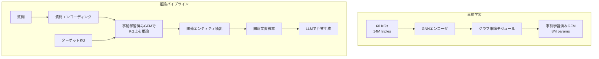

本記事は [GFM-RAG: Graph Foundation Model for Retrieval Augmented Generation（arXiv:2502.01113）](https://arxiv.org/abs/2502.01113) の解説記事です。

## 論文概要（Abstract）

GFM-RAG（Graph Foundation Model for Retrieval Augmented Generation）は、知識グラフの構造的推論を活用したゼロショットRAGフレームワークである。著者らは、60の知識グラフ・14Mトリプル・700kドキュメントで事前学習した8Mパラメータの軽量GFMを構築し、未知のデータセットに対してファインチューニングなしで検索拡張生成を実現した。NeurIPS 2025およびICLR 2026にて発表されている。

この記事は [Zenn記事: グラフファウンデーションモデル2025-2026年最前線](https://zenn.dev/0h_n0/articles/e4da90566d7aac) の深掘りです。

## 情報源

- **arXiv ID**: 2502.01113
- **URL**: [https://arxiv.org/abs/2502.01113](https://arxiv.org/abs/2502.01113)
- **発表年**: 2025-2026
- **分野**: cs.CL, cs.AI, cs.IR
- **発表会議**: NeurIPS 2025 / ICLR 2026

## 背景と動機（Background & Motivation）

従来のRAG（Retrieval-Augmented Generation）は、ベクトル類似度検索に基づく文書検索が主流である。しかし、マルチホップ推論（複数の事実を連鎖的につなげて回答する必要がある質問）では、単純なベクトル検索では関連文書を十分に取得できない。

例えば、「映画Xの監督が卒業した大学はどの都市にあるか？」という質問では、「映画X → 監督A」「監督A → 大学B」「大学B → 都市C」の3ホップの推論が必要となる。ベクトル検索では質問文と直接的に類似した文書しか取得できず、中間エンティティを経由した推論パスの発見が困難である。

知識グラフ（KG）ベースのアプローチはこの問題を緩和できるが、従来手法はタスクごとのファインチューニングが必要であり、新しいKGへの適用に追加のコストがかかる。GFM-RAGは、グラフ構造上の推論能力を事前学習で獲得し、ゼロショットで未知のKGに適用可能なモデルを目指す。

## 主要な貢献（Key Contributions）

- **貢献1**: 60知識グラフ・14Mトリプルでの大規模事前学習により、ゼロショットでのKGベースRAGを実現
- **貢献2**: 8Mパラメータという軽量さで、ファインチューニングベースの手法に匹敵する性能を達成
- **貢献3**: マルチホップQAとドメイン特化RAGの両方に適用可能な汎用フレームワーク

## 技術的詳細（Technical Details）

### アーキテクチャ概要

GFM-RAGは、2段階の学習プロセスと推論パイプラインで構成される。



### 2段階学習プロセス

**Stage 1: KG構造の学習**

GNNエンコーダにより、KGのノード（エンティティ）とエッジ（リレーション）の表現を学習する。著者らは、複数KGを横断した学習によりリレーションの意味的共通性を捉えることを目指している。

エンティティ $e$ の埋め込みは、近傍エンティティとリレーションのメッセージパッシングにより更新される。

$$
\mathbf{h}_e^{(l+1)} = \text{AGG}\left(\left\{ f_r\left(\mathbf{h}_{e'}^{(l)}\right) : (e', r, e) \in \mathcal{E} \right\}\right)
$$

ここで、
- $\mathbf{h}_e^{(l)}$: 層 $l$ におけるエンティティ $e$ の埋め込み
- $f_r$: リレーション $r$ に対するメッセージ関数
- $\mathcal{E}$: KGのエッジ集合
- $\text{AGG}$: 集約関数（例: mean, sum）

**Stage 2: 質問-回答ペアでの学習**

KG上での推論能力を質問応答タスクに結びつける。質問埋め込み $\mathbf{q}$ から出発し、KG上をホップしながら回答エンティティに到達するパスの確率を最大化する。

$$
P(e_{\text{ans}} \mid q) = \prod_{t=1}^{T} P(e_t \mid e_{t-1}, q, \mathcal{G})
$$

ここで、
- $e_{\text{ans}}$: 回答エンティティ
- $T$: ホップ数
- $e_t$: $t$ ステップ目のエンティティ
- $\mathcal{G}$: 知識グラフ

各ホップでの遷移確率は、質問埋め込みとエンティティ埋め込みの内積に基づく。

$$
P(e_t \mid e_{t-1}, q, \mathcal{G}) = \frac{\exp(\mathbf{q}^T \mathbf{h}_{e_t})}{\sum_{e' \in \mathcal{N}(e_{t-1})} \exp(\mathbf{q}^T \mathbf{h}_{e'})}
$$

ここで $\mathcal{N}(e_{t-1})$ はエンティティ $e_{t-1}$ の近傍ノード集合である。

### ゼロショット汎化の仕組み

GFM-RAGのゼロショット汎化は、以下の設計により実現されている。

1. **リレーションの意味的埋め込み**: KG固有のリレーションIDではなく、テキスト記述からの埋め込みを使用。これにより未知のKGでもリレーションの意味を理解可能
2. **構造的パターンの転移**: 「AがBの一部である」「CがDを生成した」のような構造的パターンは、ドメインを超えて共通する
3. **スケールによる汎化**: 60 KGの多様なドメインで学習することで、未知のドメインへの汎化能力を獲得

### 実装パターン

```python
import torch
import torch.nn as nn
from torch_geometric.nn import GATConv
from typing import List, Tuple


class GFMRAGRetriever(nn.Module):
    """GFM-RAG風のグラフベースリトリーバ。

    KG上で質問に基づくマルチホップ推論を行い、
    関連エンティティを検索する。
    """

    def __init__(
        self,
        entity_dim: int = 256,
        relation_dim: int = 256,
        num_layers: int = 3,
        max_hops: int = 3,
    ):
        super().__init__()
        self.max_hops = max_hops
        self.gnn_layers = nn.ModuleList([
            GATConv(entity_dim, entity_dim, heads=4, concat=False)
            for _ in range(num_layers)
        ])
        self.relation_proj = nn.Linear(relation_dim, entity_dim)
        self.query_proj = nn.Linear(entity_dim, entity_dim)

    def encode_graph(
        self, x: torch.Tensor, edge_index: torch.Tensor
    ) -> torch.Tensor:
        """GNNでノード埋め込みを計算する。

        Args:
            x: ノード特徴量 (num_nodes, entity_dim)
            edge_index: エッジインデックス (2, num_edges)
        Returns:
            ノード埋め込み (num_nodes, entity_dim)
        """
        for layer in self.gnn_layers:
            x = layer(x, edge_index).relu()
        return x

    def retrieve(
        self,
        query_emb: torch.Tensor,
        node_emb: torch.Tensor,
        edge_index: torch.Tensor,
        start_nodes: List[int],
        top_k: int = 10,
    ) -> List[Tuple[int, float]]:
        """質問埋め込みに基づきKG上でマルチホップ検索を行う。

        Args:
            query_emb: 質問埋め込み (entity_dim,)
            node_emb: ノード埋め込み (num_nodes, entity_dim)
            edge_index: エッジインデックス
            start_nodes: 質問に含まれるエンティティのID
            top_k: 返却するエンティティ数
        Returns:
            (エンティティID, スコア) のリスト
        """
        query = self.query_proj(query_emb)

        # 到達可能なエンティティのスコアを計算
        scores = torch.matmul(node_emb, query)  # (num_nodes,)

        # 開始ノードからのホップ制限を適用
        reachable = self._get_reachable(
            edge_index, start_nodes, self.max_hops
        )
        mask = torch.zeros_like(scores, dtype=torch.bool)
        mask[reachable] = True
        scores[~mask] = float("-inf")

        top_scores, top_indices = torch.topk(scores, min(top_k, mask.sum()))
        return list(zip(top_indices.tolist(), top_scores.tolist()))

    def _get_reachable(
        self,
        edge_index: torch.Tensor,
        start_nodes: List[int],
        max_hops: int,
    ) -> List[int]:
        """BFSでmax_hops以内に到達可能なノードを取得する。"""
        import networkx as nx

        G = nx.Graph()
        src, dst = edge_index[0].tolist(), edge_index[1].tolist()
        G.add_edges_from(zip(src, dst))

        reachable = set(start_nodes)
        for node in start_nodes:
            if node in G:
                lengths = nx.single_source_shortest_path_length(
                    G, node, cutoff=max_hops
                )
                reachable.update(lengths.keys())
        return list(reachable)
```

## 実験結果（Results）

著者らが報告した主要な実験結果を以下にまとめる。

**GNN-RAGとの比較（論文の実験結果より）**:

| 項目 | GNN-RAG | GFM-RAG |
|------|---------|---------|
| ファインチューニング | タスクごとに必要 | 不要（ゼロショット） |
| パラメータ数 | タスク依存 | 8M（固定） |
| 対応タスク | KGQA特化 | マルチホップQA + ドメイン特化RAG |
| 汎化性能 | 学習済みKGに依存 | 未知データセットにも適用可能 |

**ゼロショット性能**: 著者らは、事前学習のみでファインチューニングベースの手法に匹敵するマルチホップQA性能を報告している。特に3ホップ以上の複雑な質問での優位性が示されている。

**学習データの規模効果**: 学習に使用するKGの数を増やすにつれて、ゼロショット性能が単調に向上することが確認されている。60 KGでの学習が最も高い性能を達成したと報告されている。

## 実運用への応用（Practical Applications）

**適用が見込まれるユースケース**:
- **社内ナレッジベースQA**: 部門ごとに異なるKGを持つ組織で、新規KGへの即座の適用が可能
- **マルチドメインRAG**: 医療・法律・技術など複数ドメインのKGを統合したRAGシステム
- **動的KGへの対応**: エンティティやリレーションが頻繁に更新されるKGでも、再学習なしで対応

**制約事項**: 8Mパラメータと軽量だが、60 KGでの事前学習が前提となる。カスタムドメインでの利用にはKGの構築自体がボトルネックとなるケースがある。ドメイン固有のKGの品質がRAG性能を左右する点に注意が必要である。

**推論コスト**: GNNの推論はLLMと比較して計算コストが低い。GFM-RAGのリトリーバ部分は数十ミリ秒で動作し、LLMの生成が支配的なレイテンシとなる。

## 関連研究（Related Work）

- **GNN-RAG（ACL 2025 Findings, arXiv 2405.20139）**: GNNとLLMの2段階パイプラインによるKGQA。GFM-RAGの直接的な先行研究であり、タスクごとのファインチューニングが必要な点がGFM-RAGとの主要な差異
- **GraphRAG（Microsoft, 2024）**: LLMでテキストからグラフを構築し、コミュニティ検出によるサマリー生成を行うアプローチ。KGが事前に存在しないケースに適するが、構築コストが高い
- **KAPING（arXiv 2306.04136）**: KGの情報をプロンプトに埋め込むことでLLMの知識を補完する手法。GFM-RAGと比較して構造的推論が限定的

## まとめと今後の展望

GFM-RAGは、グラフファウンデーションモデルのアイデアをRAGに適用し、ゼロショットでのKGベース検索拡張生成を実現した。8Mパラメータという軽量さでありながら、60 KGでの事前学習により高い汎化性能を達成している。

今後の方向性として、KG構築の自動化（LLMによるKG抽出との統合）、リアルタイム推論の最適化、およびマルチモーダルKG（テキスト・画像・構造の統合）への拡張が考えられる。公式リポジトリ（GitHub: RManLuo/gfm-rag）でコードが公開されている。

## 参考文献

- **arXiv**: [https://arxiv.org/abs/2502.01113](https://arxiv.org/abs/2502.01113)
- **Code**: [https://github.com/RManLuo/gfm-rag](https://github.com/RManLuo/gfm-rag)
- **Related**: [GNN-RAG (arXiv 2405.20139)](https://arxiv.org/abs/2405.20139)
- **Related Zenn article**: [https://zenn.dev/0h_n0/articles/e4da90566d7aac](https://zenn.dev/0h_n0/articles/e4da90566d7aac)
