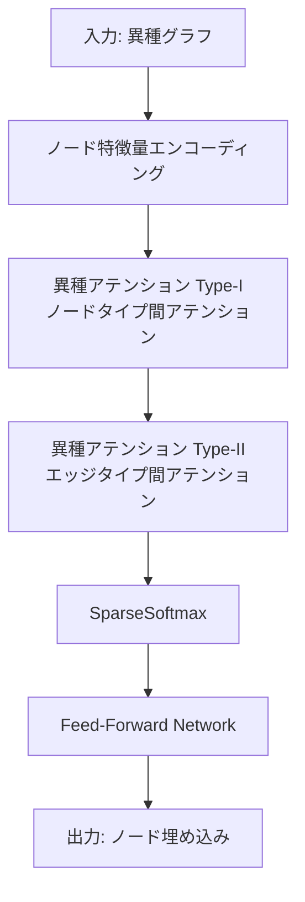

本記事は [GraphBFF: Scaling Graph Foundation Models（arXiv:2602.04768）](https://arxiv.org/abs/2602.04768) の解説記事です。

## 論文概要（Abstract）

GraphBFF（Graph Billion-Foundation-Fusion）は、2026年2月に発表された初の**14億パラメータ規模**のグラフファウンデーションモデル（GFM）である。著者らは、異種グラフを効率的に処理するGraphBFF Transformerアーキテクチャを提案し、グラフドメインにおいて初めてニューラルスケーリング則を実証した。10億サンプル以上での事前学習により、ゼロショット・Few-shot・プロービングの各評価で一貫した性能向上が報告されている。

この記事は [Zenn記事: グラフファウンデーションモデル2025-2026年最前線](https://zenn.dev/0h_n0/articles/e4da90566d7aac) の深掘りです。

## 情報源

- **arXiv ID**: 2602.04768
- **URL**: [https://arxiv.org/abs/2602.04768](https://arxiv.org/abs/2602.04768)
- **発表年**: 2026
- **分野**: cs.LG, cs.AI

## 背景と動機（Background & Motivation）

自然言語処理や画像認識では、GPTやViTに代表されるファウンデーションモデルが「スケーリング則」に従い、モデルサイズ・データ量の増加に伴い性能が予測可能に向上することが実証されている。しかしグラフドメインでは、以下の固有の課題からスケーリング則の成立が確認されていなかった。

1. **非ユークリッド構造**: グラフはテキストや画像と異なり、固定的なグリッド構造を持たない
2. **異種性（Heterogeneity）**: ノードタイプ・エッジタイプが複数存在する異種グラフの統一的処理が困難
3. **可変サイズ**: グラフごとにノード数・エッジ数が大きく異なり、バッチ構成が自明でない
4. **ドメインの多様性**: 分子グラフ・ソーシャルネットワーク・知識グラフなど、データ分布が極めて異なる

GraphBFFは、これらの課題に対し専用のアーキテクチャとバッチング戦略を導入することで、グラフドメインで初めてスケーリング則が成立することを示した。

## 主要な貢献（Key Contributions）

- **貢献1**: 14億パラメータのGFMを構築し、グラフドメイン初のニューラルスケーリング則を実証
- **貢献2**: 異種アテンションとSparseSoftmaxを組み合わせたGraphBFF Transformerの提案
- **貢献3**: KL-BatchingとRound-Robin Batchingによるドメイン間の学習効率化

## 技術的詳細（Technical Details）

### GraphBFF Transformerアーキテクチャ

GraphBFF Transformerは、異種グラフを効率的に処理するために設計された専用Transformerである。標準的なTransformerのSelf-Attentionを拡張し、2つの異種アテンションコンポーネントとスパースSoftmaxを組み合わせている。



#### スパースSoftmaxによるアテンション

標準的なSelf-Attentionではすべてのノードペア間のスコアを計算するが、大規模グラフではこれが計算のボトルネックとなる。GraphBFFはSparseSoftmaxを導入し、関連性の低いノードペアのアテンション重みを明示的にゼロにする。

$$
\text{SparseSoftmax}(\mathbf{z})_i = \frac{[\exp(z_i - \tau)]_+}{\sum_{j=1}^{N} [\exp(z_j - \tau)]_+}
$$

ここで、
- $\mathbf{z}$: アテンションスコアベクトル
- $\tau$: 閾値パラメータ（学習可能）
- $[\cdot]_+$: ReLU関数（$\max(0, \cdot)$）
- $N$: ノード数

閾値 $\tau$ を下回るスコアは自動的にゼロになるため、密なアテンション行列がスパースになり、計算量が $O(N^2)$ から実効的に $O(N \cdot k)$（$k$: 平均非ゼロエントリ数）に削減される。

これを全体のアテンション計算に組み込むと以下となる。

$$
\text{Attention}(Q, K, V) = \text{SparseSoftmax}\left(\frac{QK^T}{\sqrt{d_k}}\right)V
$$

ここで $Q, K, V \in \mathbb{R}^{N \times d_k}$ はそれぞれクエリ・キー・バリュー行列、$d_k$ はヘッドあたりの次元数である。

#### 異種アテンションの2段階構成

異種グラフでは、ノードタイプ（例: 論文・著者・会議）やエッジタイプ（例: 引用・執筆・発表）が複数存在する。GraphBFFは以下の2段階で異種性を処理する。

**Type-I（ノードタイプ間アテンション）**: ノードタイプごとに異なるプロジェクション行列を使用する。

$$
Q_t = \mathbf{x}_t \mathbf{W}_Q^{(t)}, \quad K_t = \mathbf{x}_t \mathbf{W}_K^{(t)}, \quad V_t = \mathbf{x}_t \mathbf{W}_V^{(t)}
$$

ここで $t$ はノードタイプのインデックス、$\mathbf{W}_Q^{(t)}, \mathbf{W}_K^{(t)}, \mathbf{W}_V^{(t)}$ はタイプ $t$ 固有の重み行列である。

**Type-II（エッジタイプ間アテンション）**: エッジタイプに応じてアテンションスコアにバイアスを加算する。

$$
\alpha_{ij} = \frac{Q_i K_j^T}{\sqrt{d_k}} + b_{r(i,j)}
$$

ここで $r(i,j)$ はノード $i$ と $j$ を結ぶエッジのタイプ、$b_{r}$ はエッジタイプ $r$ 固有の学習可能なバイアス項である。

### KL-BatchingとRound-Robin Batching

グラフドメインの多様性に対処するため、GraphBFFは2つのバッチング戦略を導入している。

**KL-Batching**: 各ドメインからのサンプリング比率を目標分布に近づけるよう制御する。学習中にKL-divergenceを最小化し、ドメイン間の不均衡を防ぐ。

**Round-Robin Batching**: バッチ単位でドメインを順番に切り替える。あるバッチではドメインAのグラフのみ、次のバッチではドメインBのグラフのみというように構成する。

```python
import torch
from torch_geometric.data import Data, Batch
from typing import Dict, List
import random


def kl_batching(
    domain_datasets: Dict[str, List[Data]],
    batch_size: int,
    target_distribution: Dict[str, float] | None = None,
) -> Batch:
    """KL-Batchingの概念実装。

    各ドメインからの目標分布に従ってサンプリングし、
    ドメイン間の不均衡を防止する。

    Args:
        domain_datasets: ドメイン名 -> グラフリストのマッピング
        batch_size: バッチサイズ
        target_distribution: 各ドメインの目標サンプリング比率
    Returns:
        構成されたバッチ
    """
    if target_distribution is None:
        n_domains = len(domain_datasets)
        target_distribution = {
            d: 1.0 / n_domains for d in domain_datasets
        }

    sampled_graphs: List[Data] = []
    for domain, ratio in target_distribution.items():
        n_samples = max(1, int(batch_size * ratio))
        graphs = domain_datasets[domain]
        sampled = random.choices(graphs, k=n_samples)
        sampled_graphs.extend(sampled)

    random.shuffle(sampled_graphs)
    return Batch.from_data_list(sampled_graphs[:batch_size])


def round_robin_batching(
    domain_datasets: Dict[str, List[Data]],
    batch_size: int,
    current_epoch_step: int,
) -> Batch:
    """Round-Robin Batchingの概念実装。

    バッチ単位でドメインを順番に切り替える。

    Args:
        domain_datasets: ドメイン名 -> グラフリストのマッピング
        batch_size: バッチサイズ
        current_epoch_step: 現在のステップ番号
    Returns:
        単一ドメインから構成されたバッチ
    """
    domains = sorted(domain_datasets.keys())
    current_domain = domains[current_epoch_step % len(domains)]
    graphs = domain_datasets[current_domain]
    sampled = random.choices(graphs, k=batch_size)
    return Batch.from_data_list(sampled)
```

著者らの報告によると、KL-Batchingはドメイン間の均等化に優れ、Round-Robin Batchingは各ドメイン内の学習安定性に寄与する。実験ではこれらを組み合わせたハイブリッド戦略が採用されている。

### スケーリング則の実証

GraphBFFの中核的な貢献は、グラフドメインにおけるニューラルスケーリング則の実証である。著者らは、モデルパラメータ数 $P$ とデータ量 $D$ に対し、損失 $L$ が以下のべき乗則に従うことを確認している。

$$
L(P) = \alpha \cdot P^{-\beta} + L_{\infty}
$$

ここで、
- $\alpha, \beta$: スケーリング係数
- $L_{\infty}$: 不可約損失（irreducible loss）
- $P$: モデルパラメータ数

データ量に対しても同様の関係が成り立つ。

$$
L(D) = \gamma \cdot D^{-\delta} + L_{\infty}
$$

この結果は、NLPにおけるKaplanらのスケーリング則（2020年）やChinchilla則（2022年）のグラフ版に相当し、グラフ領域でも「より大きなモデル・より多くのデータ」が予測可能に性能を向上させることを意味する。

## 実装のポイント（Implementation）

GraphBFFの学習を実際に行う際の主要な検討事項を以下に整理する。

**計算リソース**: 14億パラメータの学習にはTPU/GPU環境が必要である。論文ではTPU Pod構成が使用されており、個人環境での事前学習からの再現は困難である。事前学習済みモデルの利用やファインチューニングからの活用が現実的である。

**異種グラフの前処理**: 入力グラフのノードタイプ・エッジタイプを統一的なIDにマッピングする前処理が必要となる。PyGのHeteroDataを活用した実装パターンが推奨される。

**SparseSoftmaxの勾配計算**: SparseSoftmaxはReLU関数を含むため、標準的なSoftmaxとは異なる勾配計算が必要である。PyTorchのカスタムAutograd関数として実装するか、既存のentmaxライブラリの活用が選択肢となる。

```python
import torch
import torch.nn as nn
from torch_geometric.nn import MessagePassing
from torch_geometric.data import HeteroData


class SparseSoftmax(nn.Module):
    """学習可能な閾値を持つSparseSoftmax。"""

    def __init__(self, init_tau: float = 0.0):
        super().__init__()
        self.tau = nn.Parameter(torch.tensor(init_tau))

    def forward(self, scores: torch.Tensor) -> torch.Tensor:
        """SparseSoftmaxを適用する。

        Args:
            scores: アテンションスコア (batch, heads, N, N)
        Returns:
            スパースなアテンション重み
        """
        shifted = scores - self.tau
        sparse_exp = torch.clamp(torch.exp(shifted), min=0.0)
        denom = sparse_exp.sum(dim=-1, keepdim=True) + 1e-8
        return sparse_exp / denom
```

**ハイパーパラメータの推奨値（論文に基づく）**:
- 学習率: 1e-4（線形ウォームアップ + コサインスケジュール）
- バッチサイズ: ドメインあたり32-128グラフ
- 事前学習エポック: データ量に応じてスケーリング則から決定

## 実験結果（Results）

著者らが報告した主要なベンチマーク結果を以下にまとめる。

**スケーリング則の検証（論文Figure 2より）**:
- モデルサイズを100M → 500M → 1.4Bとスケールさせた場合、検証損失が一貫して減少
- データ量を1億 → 5億 → 10億サンプルとスケールさせた場合も同様の傾向
- べき乗則へのフィッティングのR²値は0.98以上と報告

**タスク別性能（論文Table 1より）**:

| 評価設定 | 結果の傾向 |
|---------|-----------|
| ゼロショット | 事前学習のみで未知グラフに汎化 |
| Few-shot（16サンプル） | 少数サンプルのファインチューニングで性能が大幅向上 |
| 線形プロービング | 凍結した表現の上に線形層を追加し、高い性能を達成 |

著者らは、モデルサイズの増加に伴いゼロショット性能が特に大きく改善されることを報告しており、これはNLPにおける「創発的能力」と類似した現象である。

## 実運用への応用（Practical Applications）

GraphBFFの実運用適用を検討する際のポイントを以下に整理する。

**適用が見込まれるユースケース**:
- **不正検出**: 金融取引のグラフ構造から不正パターンを検出。異種ノード（口座・取引・デバイス）を統一的に処理可能
- **推薦システム**: ユーザー・アイテム・属性の異種グラフ上でゼロショット推薦
- **創薬**: 分子グラフの性質予測。事前学習により未知の分子構造への汎化が期待

**スケーリングの観点**: 14億パラメータのモデルは推論時にもGPUメモリを必要とする。推論のレイテンシを許容できるバッチ処理タスク（例: 夜間の不正検出スキャン）に適している。リアルタイム推論には蒸留モデルの活用が現実的である。

**コスト効率**: 事前学習済みモデルのファインチューニングにより、タスク固有のGNN訓練と比較してデータ収集・ラベリングコストを削減できる可能性がある。

## 関連研究（Related Work）

- **AnyGraph（arXiv 2408.10700）**: MoEアーキテクチャによる汎用GFM。GraphBFFとは異なり、Expert Routingでドメイン適応を行う。38データセットでのゼロショット評価を実施
- **GFM Survey（arXiv 2505.15116）**: GFMの体系的サーベイ。GNN-based / LLM-based / GNN+LLMの3分類を提案
- **GraphGPS（NeurIPS 2022）**: Graph Transformerの基盤レシピ。PE + MPNN + Global Attentionの組み合わせを提案。GraphBFFのアテンション機構はこの延長線上にある

## まとめと今後の展望

GraphBFFは、グラフドメインで初めて「より大きなモデル・より多くのデータが予測可能に性能を向上させる」というスケーリング則を実証した。14億パラメータという規模は、NLPにおけるGPT-2（15億パラメータ）に相当し、グラフAIが「スケーリングの時代」に入ったことを示唆している。

今後の課題として、著者らは推論効率化（蒸留・量子化）、さらなるスケールアップ（数百億パラメータ）、およびテキスト属性との統合を挙げている。事前学習済みモデルの公開が進めば、下流タスクでの実用化が加速すると期待される。

## 参考文献

- **arXiv**: [https://arxiv.org/abs/2602.04768](https://arxiv.org/abs/2602.04768)
- **Related**: [AnyGraph (arXiv 2408.10700)](https://arxiv.org/abs/2408.10700)
- **Related**: [GFM Survey (arXiv 2505.15116)](https://arxiv.org/abs/2505.15116)
- **Related Zenn article**: [https://zenn.dev/0h_n0/articles/e4da90566d7aac](https://zenn.dev/0h_n0/articles/e4da90566d7aac)
