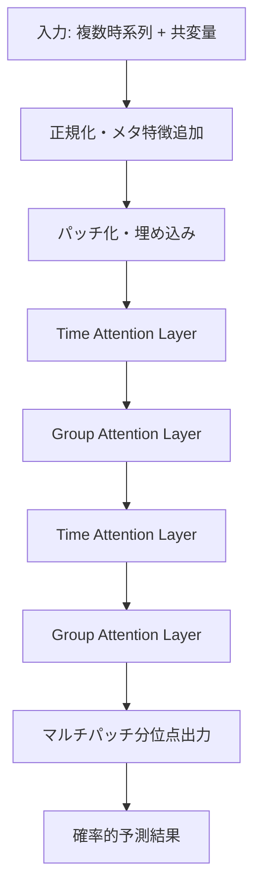

> 本記事は [Introducing Chronos-2: From Univariate to Universal Forecasting — Amazon Science](https://www.amazon.science/blog/introducing-chronos-2-from-univariate-to-universal-forecasting) の解説記事です。

## ブログ概要（Summary）

AmazonはChronos-2を発表し、時系列ファウンデーションモデル（TSFM）を「単変量予測」から「汎用予測」へと拡張した。Chronos-2は120Mパラメータのencoder-onlyモデルであり、前身のT5ベースencoder-decoder構成から大きくアーキテクチャを刷新している。最大の技術的革新はgroup attentionとtime attentionを交互に配置するデュアルアテンション構造であり、単変量・多変量・共変量付き予測の3つのシナリオをゼロショットで処理できる。fev-bench・GIFT-Eval・Chronos Bench IIの3ベンチマークにおいて、事前学習モデル中トップの性能を達成している（Amazon Science、2025年12月時点）。

この記事は [Zenn記事: 時系列ファウンデーションモデル2025-2026年最前線：Chronos-2・TimesFM・Sundialを徹底比較](https://zenn.dev/0h_n0/articles/5c2f14f0c06a8e) の深掘りです。

## 情報源

- **種別**: 企業テックブログ
- **URL**: [https://www.amazon.science/blog/introducing-chronos-2-from-univariate-to-universal-forecasting](https://www.amazon.science/blog/introducing-chronos-2-from-univariate-to-universal-forecasting)
- **組織**: Amazon Science
- **発表日**: 2025年10月

## 技術的背景（Technical Background）

時系列予測は、需要予測・異常検知・エネルギー管理など幅広いビジネスで利用されている。従来のアプローチでは、各時系列ごとにARIMAやProphetなどのモデルを個別に構築・チューニングする必要があった。NLPにおけるLLMの成功を受けて、大規模な時系列データで事前学習し、ゼロショットで汎用的に予測できるTSFMの開発が進んでいる。

前身のChronosは、T5アーキテクチャをベースに時系列値を離散トークンに量子化して処理するアプローチを採用していた。しかし、以下の課題があった。

1. **共変量非対応**: 天気予報やプロモーション情報などの外部情報を入力できない
2. **単変量のみ**: 複数の関連する時系列を同時に処理できない
3. **量子化の情報損失**: 連続値を離散トークンに変換する際に精度が低下する

Chronos-2はこれらの課題に対し、アーキテクチャレベルで解決を図っている。

## 実装アーキテクチャ（Architecture）

### デュアルアテンション構造

Chronos-2の核心は、**time attention**と**group attention**を交互に配置するデュアルアテンション構造にある。

- **Time attention**: 単一時系列内のパッチ間で情報を集約する。従来のTransformerにおけるself-attentionに相当し、時間方向の依存関係を捉える。
- **Group attention**: 同一パッチインデックスにおける全系列間で情報を集約する。異なる時系列間の相関関係（例: 気温と電力消費量の相関）を捉える。



この二重構造により、Chronos-2は「任意サイズのグループに属する時系列間の相互作用を、情報交換を通じて考慮する」ことが可能になった（Amazon Science blogより）。

### 処理パイプライン

Amazon Scienceのブログによると、Chronos-2の推論パイプラインは以下の5段階で構成される。

1. **正規化（Normalization）**: ロバストスケーリングにより入力系列を標準化
2. **特徴エンジニアリング**: 時間インデックスとマスクのメタ特徴を追加
3. **トークン化**: 非重複パッチを残差ネットワーク経由で高次元埋め込みにマッピング
4. **Transformerスタック**: time attentionとgroup attentionを交互に適用
5. **出力**: マスクされた未来パッチに対するマルチパッチ分位点予測を生成

### Encoder-onlyアーキテクチャの選択理由

Chronos-2がencoder-onlyアーキテクチャを選択した理由は、共変量の取り扱いにある。Decoder-onlyモデルでは自己回帰的に1トークンずつ生成するため、未来の共変量（天気予報、プロモーション予定など）を自然に入力するのが困難である。一方、encoder-onlyモデルでは全入力を一度に処理するため、過去の時系列値・過去の共変量・未来の既知共変量を統一的に扱える。

### 3つの予測シナリオ

Chronos-2は以下の3つのシナリオをゼロショットで処理する。

| シナリオ | 説明 | 入力 |
|---------|------|------|
| **単変量予測** | 単一時系列の予測（系列間のcross-learning付き） | 過去のターゲット値 |
| **多変量予測** | 複数の共進化する時系列の同時予測 | 複数系列の過去値 |
| **共変量付き予測** | 外部情報を組み込んだ予測 | ターゲット + past/future/categorical共変量 |

## 学習データと合成データ戦略

Amazon Scienceのブログでは、「汎用TSFMは異種の時系列タスクで学習する必要があるが、多変量依存関係と有益な共変量を持つ高品質なプレトレーニングデータは不足している」と述べられている。

この問題に対し、Chronos-2では**合成マルチバリエートデータ生成**というアプローチが採られている。単変量のデータ生成器に多変量構造を課すことで、学習データの多様性を確保している。

**注意**: 合成データに基づく学習は、実際のドメイン固有の多変量依存関係を完全には捉えられない可能性がある。ファインチューニングなしで本番投入する場合は、自ドメインのデータで予測精度を必ず検証すべきである。

## In-Context Learning（ICL）能力

Chronos-2はIn-Context Learning能力を備えており、ブログでは「大規模なファインチューニングを必要とせず、下流タスクにそのまま適用可能な汎用予測モデル」として位置づけられている。プロンプトとして関連する時系列や共変量を入力するだけで、モデルが文脈を理解し予測を調整する。

## 実装のポイント（Implementation）

### コード例

```python
# Chronos-2の推論例
# pip install "chronos-forecasting>=2.0"
import pandas as pd
from chronos import Chronos2Pipeline

# モデルのロード（GPU推奨）
pipeline = Chronos2Pipeline.from_pretrained(
    "amazon/chronos-2",
    device_map="cuda",
)

# 過去のターゲット値と共変量を含むDataFrame
# columns: id, timestamp, target, covariate_1, covariate_2, ...
context_df = pd.read_parquet("historical_data.parquet")

# 未来の共変量（祝日フラグ、天気予報など）
future_df = pd.read_parquet("future_covariates.parquet")

# 共変量付き予測の実行
pred_df = pipeline.predict_df(
    context_df,
    future_df=future_df,
    prediction_length=24,
    quantile_levels=[0.1, 0.5, 0.9],
    id_column="id",
    timestamp_column="timestamp",
    target="target",
)
```

### 実装上の注意点

- **GPU推奨**: 120MパラメータのモデルはGPU上での推論が推奨される。CPUでも動作するが、大量系列の一括予測ではスループットが大幅に低下する
- **パッチサイズ**: 非重複パッチを使用するため、入力系列の長さがパッチサイズの倍数に近いと効率的
- **分位点出力**: 21分位点の確率的予測を返す。点予測が必要な場合は中央値（0.5分位）を使用する
- **Amazon SageMaker統合**: SageMakerエンドポイントとしてのデプロイメントノートブックが公開されており、AWSインフラとの統合がスムーズ

## Production Deployment Guide

### AWS実装パターン（コスト最適化重視）

Chronos-2はAmazon製であるため、AWSとの統合が特に良好である。以下にトラフィック量別の推奨構成を示す。

**トラフィック量別の推奨構成**:

| 規模 | 月間リクエスト | 推奨構成 | 月額コスト | 主要サービス |
|------|--------------|---------|-----------|------------|
| **Small** | ~3,000 (100/日) | Serverless | $80-200 | Lambda + SageMaker Serverless + DynamoDB |
| **Medium** | ~30,000 (1,000/日) | Hybrid | $400-1,000 | SageMaker Real-time + ElastiCache |
| **Large** | 300,000+ (10,000/日) | Container | $2,500-6,000 | EKS + GPU Instances + Karpenter |

**Small構成の詳細** (月額$80-200):
- **SageMaker Serverless Inference**: ml.g5.xlarge相当 ($60/月)
- **Lambda**: イベントトリガー・前処理 ($20/月)
- **DynamoDB**: 予測結果キャッシュ, On-Demand ($10/月)
- **S3**: モデルアーティファクト・入力データ ($5/月)
- **CloudWatch**: 基本監視 ($5/月)

**Medium構成の詳細** (月額$400-1,000):
- **SageMaker Real-time Endpoint**: ml.g5.xlarge × 1台 ($300/月)
- **ElastiCache Redis**: cache.r6g.large ($150/月)
- **Lambda**: 前処理・キュー処理 ($50/月)
- **Application Load Balancer**: ($20/月)

**Large構成の詳細** (月額$2,500-6,000):
- **EKS**: コントロールプレーン ($72/月)
- **EC2 GPU Spot**: g5.xlarge × 2-4台 ($800/月、最大90%削減)
- **Karpenter**: GPU自動スケーリング（追加コストなし）
- **SageMaker Batch Transform**: 大量バッチ処理 ($1,000/月)
- **CloudWatch + X-Ray**: 詳細監視 ($100/月)

**コスト削減テクニック**:
- SageMaker Serverless Inferenceでアイドルタイムゼロコスト化
- Spot Instances使用で最大90%削減（EKS + Karpenter）
- SageMaker Batch Transformで非リアルタイム処理を50%削減
- AutoGluon-TimeSeriesとの統合でモデル選択自動化

**コスト試算の注意事項**:
- 上記は2026年3月時点のAWS ap-northeast-1（東京）リージョン料金に基づく概算値です
- 実際のコストはトラフィックパターン、推論バッチサイズ、GPU利用率により変動します
- 最新料金は [AWS料金計算ツール](https://calculator.aws/) で確認してください

### Terraformインフラコード

**Small構成 (Serverless): SageMaker Serverless + Lambda**

```hcl
# --- IAMロール（SageMaker推論用、最小権限） ---
resource "aws_iam_role" "sagemaker_chronos2" {
  name = "sagemaker-chronos2-role"

  assume_role_policy = jsonencode({
    Version = "2012-10-17"
    Statement = [{
      Action = "sts:AssumeRole"
      Effect = "Allow"
      Principal = {
        Service = "sagemaker.amazonaws.com"
      }
    }]
  })
}

resource "aws_iam_role_policy" "sagemaker_s3" {
  role = aws_iam_role.sagemaker_chronos2.id
  policy = jsonencode({
    Version = "2012-10-17"
    Statement = [{
      Effect = "Allow"
      Action = ["s3:GetObject", "s3:ListBucket"]
      Resource = [
        aws_s3_bucket.model_artifacts.arn,
        "${aws_s3_bucket.model_artifacts.arn}/*"
      ]
    }]
  })
}

# --- S3（モデルアーティファクト） ---
resource "aws_s3_bucket" "model_artifacts" {
  bucket = "chronos2-model-artifacts"
}

resource "aws_s3_bucket_server_side_encryption_configuration" "model_artifacts" {
  bucket = aws_s3_bucket.model_artifacts.id
  rule {
    apply_server_side_encryption_by_default {
      sse_algorithm = "aws:kms"
    }
  }
}

# --- SageMaker Serverless Endpoint ---
resource "aws_sagemaker_model" "chronos2" {
  name               = "chronos2-model"
  execution_role_arn = aws_iam_role.sagemaker_chronos2.arn

  primary_container {
    image          = "763104351884.dkr.ecr.ap-northeast-1.amazonaws.com/pytorch-inference:2.1-gpu-py310"
    model_data_url = "s3://${aws_s3_bucket.model_artifacts.id}/chronos2/model.tar.gz"
    environment = {
      MODEL_NAME = "amazon/chronos-2"
    }
  }
}

resource "aws_sagemaker_endpoint_configuration" "chronos2" {
  name = "chronos2-serverless"

  production_variants {
    variant_name = "primary"
    model_name   = aws_sagemaker_model.chronos2.name
    serverless_config {
      memory_size_in_mb = 6144
      max_concurrency   = 5
    }
  }
}

resource "aws_sagemaker_endpoint" "chronos2" {
  name                 = "chronos2-endpoint"
  endpoint_config_name = aws_sagemaker_endpoint_configuration.chronos2.name
}

# --- DynamoDB（予測結果キャッシュ） ---
resource "aws_dynamodb_table" "prediction_cache" {
  name         = "chronos2-prediction-cache"
  billing_mode = "PAY_PER_REQUEST"
  hash_key     = "series_hash"

  attribute {
    name = "series_hash"
    type = "S"
  }

  ttl {
    attribute_name = "expire_at"
    enabled        = true
  }
}

# --- CloudWatchアラーム ---
resource "aws_cloudwatch_metric_alarm" "endpoint_latency" {
  alarm_name          = "chronos2-latency-spike"
  comparison_operator = "GreaterThanThreshold"
  evaluation_periods  = 2
  metric_name         = "ModelLatency"
  namespace           = "AWS/SageMaker"
  period              = 300
  statistic           = "Average"
  threshold           = 10000000
  alarm_description   = "Chronos-2推論レイテンシ異常"

  dimensions = {
    EndpointName = aws_sagemaker_endpoint.chronos2.name
    VariantName  = "primary"
  }
}
```

### セキュリティベストプラクティス

1. **IAMロール最小権限**: SageMakerにはモデルアーティファクトのS3読み取りのみ許可
2. **KMS暗号化**: S3バケット、DynamoDBテーブルでKMS暗号化を有効化
3. **VPCエンドポイント**: SageMaker/S3/DynamoDBへのアクセスはVPCエンドポイント経由
4. **CloudTrail**: 全APIコールの監査ログを記録

### 運用・監視設定

**CloudWatch Logs Insights クエリ**:
```sql
-- 推論レイテンシ分析: P95, P99
fields @timestamp, ModelLatency
| stats pct(ModelLatency, 95) as p95, pct(ModelLatency, 99) as p99 by bin(5m)

-- エラー率監視
fields @timestamp, @message
| filter @message like /Error/
| stats count() as error_count by bin(1h)
```

**コスト最適化チェックリスト**:
- [ ] SageMaker Serverless Inferenceでアイドルコストゼロ化
- [ ] 非リアルタイム処理はBatch Transformで50%削減
- [ ] Spot InstancesでGPUコスト最大90%削減
- [ ] DynamoDBキャッシュで重複推論を排除
- [ ] CloudWatch + AWS Budgetsで月額予算アラート設定
- [ ] AutoGluon-TimeSeriesで軽量モデルとのルーティング最適化

## ベンチマーク結果（Results）

Amazon Scienceのブログによると、Chronos-2は以下のベンチマークで事前学習モデル中のトップ性能を達成している。

### fev-bench

fev-benchは特に共変量対応のタスクを含むベンチマークであり、Chronos-2は「既存の全事前学習モデルを大幅に上回る」性能を示したと報告されている。共変量付きタスクにおけるICLの効果が特に顕著であった。

### GIFT-Eval

GIFT-Evalベンチマークでは「事前学習モデル中1位」にランクされ、前身のChronos-Boltとの1対1比較では「90%以上の勝率」を達成したとされている。

### Chronos Bench II

Amazon独自のベンチマークでも一貫して高い性能を示している。

**注意**: ベンチマーク結果はリーダーボードの更新により変動する。最新の結果はGIFT-Eval公式リーダーボードで確認することを推奨する。

## 実運用への応用（Practical Applications）

### 小売需要予測

共変量対応は小売需要予測で特に有用である。セール期間、祝日フラグ、天気予報を未来の既知共変量として入力することで、ゼロショットでもプロモーション効果を反映した予測が得られる。

### エネルギー管理

電力消費量の予測では、気温予報や曜日情報を共変量として利用できる。多変量予測により、複数の建物やゾーンの電力消費を同時に予測し、系列間の相関を活用できる。

### 製造業・サプライチェーン

部品の需要予測において、複数の関連部品の需要を多変量として同時予測することで、在庫最適化に活用できる。

### 導入時の判断基準

Chronos-2はAWSインフラとの統合が特にスムーズであるため、以下のケースで優先的に検討すべきである。
- AWS環境を既に利用しているチーム
- 共変量（外部情報）が予測精度に大きく影響するドメイン
- SageMakerベースのMLパイプラインを持つ組織

一方、以下のケースでは他のモデルも検討すべきである。
- 共変量が不要な単純なゼロショット予測 → TimesFM-2.5
- 確率分布の柔軟性が最重要 → Sundial
- GPUなし環境での推論 → 統計モデル（ETS, ARIMA）

## 学術研究との関連（Academic Connection）

Chronos-2はChronos（arXiv:2403.07815）の直接的な後継であり、T5ベースからencoder-onlyへのアーキテクチャ転換が行われた。Group attentionの設計はVision Transformerにおけるグループ化手法からの影響が見られる。

GIFT-Eval（arXiv:2410.10393）ベンチマークでの評価は、TSFMの標準的な比較基盤として広く利用されている。また、TimesFM-ICF（Google Research）やSundial（arXiv:2502.00816）との競争関係の中で、共変量対応という差別化ポイントを確立している。

## まとめと実践への示唆

Chronos-2は、TSFMにおける共変量対応の実用化において重要なマイルストーンである。group attentionとtime attentionのデュアルアテンション構造により、単変量・多変量・共変量付き予測を統一的に処理できる点は、実務上の大きな利点である。

ただし、合成マルチバリエートデータに基づく学習の限界も認識すべきであり、ファインチューニングなしでの本番投入時は自ドメインでの検証が不可欠である。GIFT-Evalリーダーボードは継続的に更新されるため、モデル選定時は最新結果を確認すること。

## 参考文献

- **Blog URL**: [https://www.amazon.science/blog/introducing-chronos-2-from-univariate-to-universal-forecasting](https://www.amazon.science/blog/introducing-chronos-2-from-univariate-to-universal-forecasting)
- **GitHub**: [https://github.com/amazon-science/chronos-forecasting](https://github.com/amazon-science/chronos-forecasting)
- **Chronos原論文**: [https://arxiv.org/abs/2403.07815](https://arxiv.org/abs/2403.07815)
- **GIFT-Eval**: [https://arxiv.org/abs/2410.10393](https://arxiv.org/abs/2410.10393)
- **Related Zenn article**: [https://zenn.dev/0h_n0/articles/5c2f14f0c06a8e](https://zenn.dev/0h_n0/articles/5c2f14f0c06a8e)
