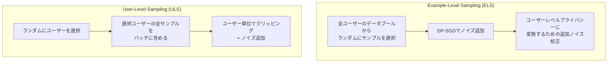

本記事は [Fine-tuning LLMs with user-level differential privacy](https://research.google/blog/fine-tuning-llms-with-user-level-differential-privacy/) の解説記事です。

## ブログ概要（Summary）

Google Researchの研究者Arun GaneshとZachary Charlesは、LLMのファインチューニングにユーザーレベル差分プライバシー（User-Level DP）を適用する手法を発表した（2025年5月）。従来のDP-SGDはサンプル単位のプライバシーを保証するが、ユーザーレベルDPは「ある個人の全データが学習に含まれていたかどうか」を攻撃者が判別できないことを保証する、より強力なプライバシー概念である。著者らは、Example-Level Sampling（ELS）とUser-Level Sampling（ULS）の2つのアルゴリズムを提案し、従来手法がノイズ量を桁違いに過大評価していたことを証明した。350Mパラメータのtransformerモデルでの実験において、厳格なプライバシー制約下でも事前学習ベースラインを上回る性能を達成したと報告している。

この記事は [Zenn記事: 連合学習×LLM時代の到来：Federated Learningの実装と運用2026](https://zenn.dev/0h_n0/articles/3de76140bdaf41) の深掘りです。

## 情報源

- **種別**: 企業テックブログ
- **URL**: [https://research.google/blog/fine-tuning-llms-with-user-level-differential-privacy/](https://research.google/blog/fine-tuning-llms-with-user-level-differential-privacy/)
- **組織**: Google Research
- **発表日**: 2025年5月23日
- **関連論文**: [arXiv:2407.07737](https://arxiv.org/abs/2407.07737) "Learning with User-Level Differential Privacy Under Fixed Compute Budgets"

## 技術的背景（Technical Background）

### なぜユーザーレベルDPが必要か

標準的なDP-SGDは「サンプルレベル」のプライバシーを提供する。つまり、学習データセットから1つのサンプル（例: 1つのテキスト文）を追加・削除しても出力分布が大きく変わらないことを保証する。しかし、実際のサービスでは1人のユーザーが複数のデータサンプルを提供する（メール、検索クエリ、チャット履歴等）。

サンプルレベルDPでは、個々のサンプルのプライバシーは保護されるが、「あるユーザーが全体として学習に参加していたか」は漏洩する可能性がある。ユーザーレベルDPはこの問題を解決し、「個人の全データセットが学習に含まれていたかどうか」を攻撃者が判別できないことを数学的に保証する。

Zenn記事で紹介されている連合学習環境では、各クライアント（ユーザー）が複数のデータサンプルを保持するCross-Silo設定が一般的であり、ユーザーレベルDPの重要性はさらに高まる。

### ユーザーレベルDPの数学的定義

メカニズム $\mathcal{M}$ がユーザーレベル $(\varepsilon, \delta)$-差分プライバシーを満たすとは、任意の1人のユーザーのデータセット全体を追加・削除しても出力分布の変化が制限されることを意味する。

$$
\Pr[\mathcal{M}(D) \in S] \leq e^{\varepsilon} \cdot \Pr[\mathcal{M}(D') \in S] + \delta
$$

ここで $D$ と $D'$ は1人のユーザーの全データが異なるデータセットである。サンプルレベルDPとの違いは、$D$ と $D'$ の差が「1サンプル」ではなく「1ユーザーの全サンプル（数百〜数千件）」である点にある。

## 実装アーキテクチャ（Architecture）

### 2つのアルゴリズム

著者らは、ユーザーレベルDPを達成する2つの主要アルゴリズムを提案している。



**Example-Level Sampling (ELS)**:
1. 全ユーザーのデータプールからランダムにサンプル（テキスト）を選択してバッチを構成
2. 標準的なDP-SGDを適用（勾配クリッピング + ガウシアンノイズ）
3. サンプルレベルのプライバシー保証をユーザーレベルに変換するための追加ノイズ校正

**User-Level Sampling (ULS)**:
1. ランダムにユーザーを選択し、選択されたユーザーの全サンプルをバッチに含める
2. ユーザー単位で勾配をクリッピングし、ノイズを追加
3. 連合学習のFedAvg+DP-SGDに近い構造

ULSは連合学習のアーキテクチャと親和性が高く、Zenn記事で紹介されているDP付きFedAvgの中央集権版と見なせる。

### プライバシーバウンドの改善

著者らの最大の技術的貢献は、従来のプライバシー解析が必要なノイズ量を「桁違いに過大評価していた」ことの証明である。

従来の解析では、1ユーザーが $m$ サンプルを持つ場合、ユーザーレベルDPのノイズ要件は「Contribution Bound」（貢献バウンド）に対して指数関数的に増加すると考えられていた：

$$
\sigma_{\text{old}} \propto e^{c \cdot m}
$$

著者らは、新しい解析により、必要なノイズ量が貢献バウンドに対してほぼ線形に減衰することを証明した：

$$
\sigma_{\text{new}} \propto m
$$

この改善により、同じプライバシーバジェット $\varepsilon$ でモデル精度を大幅に向上させることが可能になった。

### Contribution Bound（貢献バウンド）の最適化

ELSアルゴリズムでは、各ユーザーが学習に貢献できるサンプル数の上限（Contribution Bound $B$）を設定する。

著者らの実験によると、$B$ をユーザーあたりのサンプル数の中央値に設定すると最良の結果が得られると報告されている。中央値を使用することで、大量のサンプルを持つユーザーのプライバシー保護と、データ活用効率のバランスを取ることができる。

ULSアルゴリズムでは、著者らはノイズ量を最小化するための予測式を導出し、複数回の学習実行なしに最適な設定を決定できるようにした。

## パフォーマンス最適化（Performance）

### 実験設定と結果

著者らは350Mパラメータのtransformerモデルを用いて、StackOverflowとCC-Newsの2つのデータセットで評価を行っている。

**主要な実験結果（ブログ記載の内容より）**:

| 手法 | StackOverflow (PPL↓) | CC-News (PPL↓) | プライバシー保証 |
|------|---------------------|-----------------|----------------|
| 事前学習ベースライン（DPなし） | 基準値 | 基準値 | なし |
| ELS (User-Level DP) | 基準値より改善 | 基準値より改善 | User-Level DP |
| ULS (User-Level DP) | 基準値より改善 | 基準値より改善 | User-Level DP |
| 従来のDP-SGD | 基準値以下 | 基準値以下 | Sample-Level DP |

著者らの報告によれば、ELSとULSの両方が厳格なプライバシー制約下でも事前学習ベースラインを上回る性能を達成している。ULSはELSよりも一般的に優れた性能を示すが、「最大限のプライバシー」または「最小限の計算リソース」が必要なシナリオではELSが有利であると報告されている。

### データセンター学習 vs 連合学習

著者らは、データセンターでの集中学習が連合学習よりも柔軟なサンプリングを可能にすると指摘している。連合学習ではクライアント選択が物理的な制約（デバイスのオンライン状態、ネットワーク帯域幅等）に依存するが、データセンターでは個々のサンプルとユーザーの両方を自由にサンプリングできる。

ただし、データがデータセンターに集約されている前提であり、GDPRやHIPAAの規制下でデータを移動できない場合は、連合学習+ユーザーレベルDPの組み合わせが必要になる。

## 運用での学び（Production Lessons）

### Googleの本番展開実績

Google Researchのブログ内容と関連する別のブログ記事によると、Googleは数十のDP-FL言語モデルを本番展開しており、Gboardのすべてのユーザーデータ学習モデルに差分プライバシーを適用している。

**本番環境での適用例**:
- **Gboard**: キーデコーダーモデル、次単語予測モデル
- **BLT-DP-FTRL**: 2024年に採用された新しいDP最適化アルゴリズム
- **SI-CIFG**: オンデバイス学習に対応したDPと互換性のあるモデルアーキテクチャ

### 合成データによる事前学習の改善

著者らの関連研究では、LLMからの合成データを事前学習に使用することで、次単語予測精度が22.8%改善したと報告されている。この手法は、プライベートデータに直接触れることなくモデルの基盤品質を向上させるアプローチであり、DP付きファインチューニングの効果をさらに高める。

## 学術研究との関連（Academic Connection）

### 関連論文との位置づけ

この研究は以下の学術的文脈に位置づけられる。

- **DP-SGD** (Abadi et al., 2016): サンプルレベルDPの基盤論文。本研究はこれをユーザーレベルに拡張
- **DP-FTRL** (Kairouz et al., 2021): 連合学習用のDP最適化。本研究はデータセンター環境に適応
- **FedLLM研究** (Ye et al., 2023; OpenFedLLM): 連合LLMの基盤フレームワーク。本研究はプライバシー保証を追加
- **FedKSeed** (Chen et al., 2024): 勾配不要のDP達成。本研究は勾配ベースのアプローチでより高い精度を維持

### Zenn記事との関連

Zenn記事で紹介されているOpacusを使ったDP-FL実装は、サンプルレベルDPに対応している。本研究のULSアルゴリズムは、Opacusの`make_private_with_epsilon`をユーザーレベルに拡張した実装と見なすことができる。特に、Cross-Silo設定（病院間、金融機関間）では、各クライアントが1ユーザーに対応するため、ユーザーレベルDPの保証が直接適用可能である。

### 実装のポイント

```python
import torch
from opacus import PrivacyEngine

def setup_user_level_dp_training(
    model: torch.nn.Module,
    train_loader: torch.utils.data.DataLoader,
    target_epsilon: float = 8.0,
    target_delta: float = 1e-5,
    contribution_bound: int = 50,
    sampling_method: str = "uls",
) -> tuple:
    """ユーザーレベルDP学習のセットアップ

    Args:
        model: ファインチューニング対象のモデル
        train_loader: ユーザーごとにグループ化されたデータローダー
        target_epsilon: 目標プライバシーバジェット
        target_delta: DP失敗確率
        contribution_bound: ユーザーあたりの最大サンプル数
        sampling_method: "els" (Example-Level) or "uls" (User-Level)

    Returns:
        (model, optimizer, train_loader) のタプル
    """
    optimizer = torch.optim.Adam(model.parameters(), lr=2e-5)

    if sampling_method == "uls":
        # ULS: ユーザー単位でサンプリング
        # Opacusをユーザーレベルで使用
        privacy_engine = PrivacyEngine()
        model, optimizer, train_loader = privacy_engine.make_private_with_epsilon(
            module=model,
            optimizer=optimizer,
            data_loader=train_loader,
            epochs=3,
            target_epsilon=target_epsilon,
            target_delta=target_delta,
            max_grad_norm=1.0,
        )
    elif sampling_method == "els":
        # ELS: サンプル単位でサンプリング
        # 貢献バウンドに基づくノイズ校正が追加で必要
        privacy_engine = PrivacyEngine()
        model, optimizer, train_loader = privacy_engine.make_private_with_epsilon(
            module=model,
            optimizer=optimizer,
            data_loader=train_loader,
            epochs=3,
            target_epsilon=target_epsilon / contribution_bound,
            target_delta=target_delta,
            max_grad_norm=1.0,
        )

    return model, optimizer, train_loader
```

**注意**: 上記のコードはOpacusの標準APIを用いた簡略化された実装例であり、著者らの論文で提案されている厳密なプライバシーバウンドの計算は含まれていない。本番環境での使用には、論文の式に基づいた正確なノイズ校正が必要である。

## Production Deployment Guide

### AWS実装パターン（コスト最適化重視）

| 規模 | 推奨構成 | 月額コスト | 特記事項 |
|------|---------|-----------|---------|
| **Small** | Lambda + Bedrock | $100-250 | DP付き推論のみ |
| **Medium** | ECS Fargate + GPU | $500-1,500 | DP-SGD学習対応 |
| **Large** | EKS + GPU Cluster | $3,000-10,000 | User-Level DP学習 |

User-Level DP学習はDP-SGDより計算コストが高い（ユーザーごとの勾配クリッピングが必要）。

**コスト試算の注意事項**: 上記は2026年3月時点のAWS ap-northeast-1料金に基づく概算値です。

### Terraformインフラコード

```hcl
# DP学習用ECSタスク定義
resource "aws_ecs_task_definition" "dp_training" {
  family                   = "dp-llm-training"
  requires_compatibilities = ["FARGATE"]
  network_mode             = "awsvpc"
  cpu                      = "4096"
  memory                   = "16384"

  container_definitions = jsonencode([{
    name  = "dp-trainer"
    image = "${var.ecr_repo}:latest"
    environment = [
      { name = "TARGET_EPSILON", value = "8.0" },
      { name = "TARGET_DELTA", value = "1e-5" },
      { name = "SAMPLING_METHOD", value = "uls" },
      { name = "CONTRIBUTION_BOUND", value = "50" },
    ]
    logConfiguration = {
      logDriver = "awslogs"
      options = {
        awslogs-group  = "/ecs/dp-training"
        awslogs-region = "ap-northeast-1"
      }
    }
  }])
}

# CloudWatch: プライバシーバジェット消費監視
resource "aws_cloudwatch_metric_alarm" "epsilon_consumption" {
  alarm_name          = "dp-epsilon-consumption-high"
  comparison_operator = "GreaterThanThreshold"
  evaluation_periods  = 1
  metric_name         = "EpsilonConsumed"
  namespace           = "Custom/DPTraining"
  period              = 3600
  statistic           = "Maximum"
  threshold           = 6.0
  alarm_description   = "プライバシーバジェット消費が目標εの75%を超過"
}
```

### セキュリティベストプラクティス

- **プライバシーバジェット管理**: εの消費量をCloudWatch Metricsで追跡し、上限に近づいたらアラート
- **ログのDP保護**: 学習ログにプライベートデータの断片が含まれないよう、DP保護付きロギングを実装
- **監査証跡**: CloudTrailでDP設定パラメータの変更を追跡

### コスト最適化チェックリスト

- [ ] ULS優先: 一般的にELSより高精度
- [ ] 貢献バウンド最適化: 中央値ベースの設定で不要なノイズを削減
- [ ] GPU Spot Instances: DP学習にはSpot推奨（最大90%削減）
- [ ] バッチサイズ最適化: 大バッチでDPノイズの影響を軽減
- [ ] AWS Budgets: 月額予算設定（80%で警告）
- [ ] CloudWatch: εの消費量と学習進捗を監視
- [ ] ECS Fargate: アイドル時自動停止でコスト削減

## まとめと実践への示唆

Google Researchのこの研究は、ユーザーレベル差分プライバシーのLLMファインチューニングへの適用において、従来のプライバシー解析が過度に悲観的であったことを示した。新しいプライバシーバウンドにより、必要なノイズ量が桁違いに削減され、プライバシーとモデル精度のトレードオフが大幅に改善された。

Zenn記事で紹介されているOpacus + Flowerを用いたDP-FL実装の延長線上に、本研究のULSアルゴリズムが位置づけられる。特にCross-Silo設定（医療、金融）でのユーザーレベルDP保証は、規制準拠の観点から実用上不可欠である。Googleが数十のDP-FL言語モデルを本番展開している事実は、この技術の実用性を裏付けている。

## 参考文献

- **Blog URL**: [https://research.google/blog/fine-tuning-llms-with-user-level-differential-privacy/](https://research.google/blog/fine-tuning-llms-with-user-level-differential-privacy/)
- **Related Paper**: [arXiv:2407.07737](https://arxiv.org/abs/2407.07737)
- **Related Zenn article**: [https://zenn.dev/0h_n0/articles/3de76140bdaf41](https://zenn.dev/0h_n0/articles/3de76140bdaf41)
