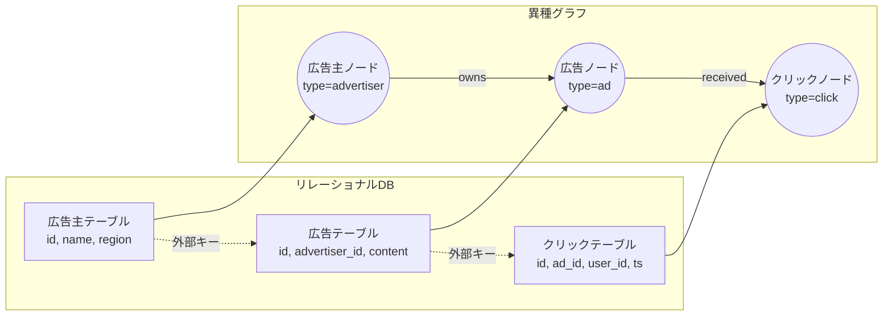

本記事は [Google Research Blog: Graph Foundation Models for Relational Data](https://research.google/blog/graph-foundation-models-for-relational-data/) の解説記事です。

## ブログ概要（Summary）

Google Researchは2025年7月、リレーショナルデータベースのテーブルをグラフに変換し、グラフファウンデーションモデル（GFM）で処理するアプローチを発表した。著者ら（Michael Galkin, Pramod Doguparty et al.）は、広告スパム検出などのタスクで単一テーブルのベースラインと比較して**平均精度（Average Precision）3〜40倍**の向上を報告している。JAX+TPU基盤での数十億ノード規模の処理が実現されている。

この記事は [Zenn記事: グラフファウンデーションモデル2025-2026年最前線](https://zenn.dev/0h_n0/articles/e4da90566d7aac) の深掘りです。

## 情報源

- **種別**: 企業テックブログ
- **URL**: [https://research.google/blog/graph-foundation-models-for-relational-data/](https://research.google/blog/graph-foundation-models-for-relational-data/)
- **組織**: Google Research / Google Ads
- **著者**: Michael Galkin (Research Scientist), Pramod Doguparty (Software Engineer)
- **発表日**: 2025年7月10日

## 技術的背景（Technical Background）

### なぜリレーショナルデータにグラフが必要か

企業のデータベースは通常、複数のリレーショナルテーブルで構成されている。例えば、広告プラットフォームでは「広告主テーブル」「広告テーブル」「クリックテーブル」「ユーザーテーブル」などが外部キーで結合されている。

従来のML手法（XGBoost、ニューラルネットワーク等）は、これらのテーブルを個別に、あるいは手動でJOINした単一テーブルに対してモデルを構築する。しかし、このアプローチにはテーブル間の関係構造の情報が失われるという根本的な限界がある。

著者らは、ブログにおいて「絶対的な特徴量に基づいて学習したモデルは汎化しないが、特徴量がどのように相互作用するかを捉えることで多様なタスクへの汎化が可能になる」と述べている。

### テーブル→グラフの変換

ブログで説明されている変換ルールは以下の通りである。



1. **各テーブル → ノードタイプ**: テーブル名がノードタイプとなる
2. **各行 → ノード**: テーブルの各行が対応するタイプのノードとなる
3. **外部キー → 型付きエッジ**: 外部キー関係がエッジとなり、テーブル間の関係タイプがエッジタイプとなる
4. **カラム → ノード特徴量**: テーブルのカラム値がノードの特徴量ベクトルとなる

## 実装アーキテクチャ（Architecture）

### GFMの学習と推論

ブログの著者らによると、Googleの GFMは「転移可能なグラフ表現を学習し、スキーマ・構造・特徴量を含む未知のグラフに汎化可能な単一モデル」として設計されている。

**学習パイプライン**:

1. **多様なリレーショナルデータセットからグラフを構築**: 複数の異なるスキーマを持つデータベースからグラフを生成
2. **異種グラフ上でGNNを事前学習**: ノードタイプ・エッジタイプの多様性に対応したGNNで表現学習
3. **下流タスクへのゼロショット/Few-shot適用**: 新しいスキーマのデータベースに対してファインチューニングなしで適用

**インフラ基盤**: JAX環境とTPUインフラを活用し、数十億ノード・エッジ規模のグラフ処理を実現している。

### RelBenchとの関係

ブログで言及されているRelBench（Relational Learning Benchmark）は、リレーショナルデータ上のMLタスクのための標準ベンチマークである。RelGT（Relational Graph Transformer, arXiv 2505.10960）は、RelBenchの21タスクでGNNベースラインを最大18%上回る性能を報告しており、GoogleのGFMとRelGTは相互に関連する研究である。

## パフォーマンス（Performance）

ブログで報告されている主要な性能指標は以下の通りである。

**平均精度の向上（ブログの報告より）**:

| 比較対象 | 改善倍率 |
|---------|---------|
| 単一テーブルベースライン | 3〜40倍 |

著者らは「タスクに応じて3倍から40倍の平均精度の向上」と報告しており、特に複数テーブルにまたがる関係性が重要なタスク（例: 広告スパム検出）で大きな改善が得られている。

**ゼロショット・Few-shot汎化**: 事前学習済みモデルが未知のスキーマを持つデータベースに対しても有効であることが示されている。これは、テーブル間の関係パターン（1対多、多対多など）がドメインを超えて共通していることに起因する。

## 運用での学び（Production Lessons）

### 広告スパム検出への適用

ブログでは、Google Adsにおけるスパム検出が主要なユースケースとして紹介されている。広告プラットフォームでは「数十の大規模かつ接続されたリレーショナルテーブル」が存在し、スパム行為はしばしば複数テーブルにまたがるパターン（例: 同一デバイスから複数アカウントで類似広告を出稿）として現れる。

**従来の手法の限界**: 単一テーブル内の特徴量のみでスパムを検出しようとすると、テーブル間の関連パターンを見逃す。手動での特徴量エンジニアリング（JOIN + 集約）は可能だが、スケーラビリティとメンテナンスに課題がある。

**GFMの優位性**: テーブル間の関係構造を自動的に捉えるため、手動の特徴量エンジニアリングが不要になる。さらに、新しいスパムパターンに対してもゼロショットで対応できる可能性がある。

### スケーリングの実現

数十億ノード規模のグラフ処理は、以下の技術によって実現されている。

1. **JAX最適化**: XLA（Accelerated Linear Algebra）コンパイラによる計算グラフの最適化
2. **TPU分散処理**: Pod構成でのデータ並列・モデル並列
3. **ミニバッチサンプリング**: 大規模グラフ全体を処理する代わりに、局所的なサブグラフをサンプリング

## 学術研究との関連（Academic Connection）

GoogleのGFMは、以下の学術研究の流れの延長線上にある。

- **RelGT（arXiv 2505.10960）**: リレーショナルテーブル専用のGraph Transformer。GoogleのGFMと相補的な研究
- **GraphBFF（arXiv 2602.04768）**: Billion-scaleのGFM。Googleの取り組みはGraphBFFとは独立だが、大規模GFMという方向性を共有
- **R-GCN（Schlichtkrull et al., 2018）**: リレーショナルグラフ畳み込みネットワーク。異種グラフ処理のGNN基盤技術

GoogleのGFMの特筆すべき点は、学術的な研究を超えて実際のプロダクション環境（Google Ads）で運用されていることである。学術ベンチマークでの性能向上だけでなく、数十億規模のデータでのスケーラビリティと運用安定性が実証されている。

## Production Deployment Guide

### AWS実装パターン（コスト最適化重視）

リレーショナルデータのGFM推論をAWS上に構築する場合の推奨構成を以下に示す。

**トラフィック量別の推奨構成**:

| 規模 | 月間リクエスト | 推奨構成 | 月額コスト | 主要サービス |
|------|--------------|---------|-----------|------------|
| **Small** | ~3,000 (100/日) | Serverless | $80-200 | Lambda + SageMaker Serverless + DynamoDB |
| **Medium** | ~30,000 (1,000/日) | Hybrid | $500-1,200 | ECS Fargate + ElastiCache + Neptune |
| **Large** | 300,000+ (10,000/日) | Container | $3,000-8,000 | EKS + Neptune + ElastiCache Cluster |

**Small構成の詳細** (月額$80-200):
- **Lambda**: GNN推論のトリガー ($20/月)
- **SageMaker Serverless Inference**: GNNモデルのホスティング ($50/月)
- **DynamoDB**: グラフデータの保存 ($10/月)
- **Neptune Serverless**: 小規模グラフクエリ ($30/月)

**Medium構成の詳細** (月額$500-1,200):
- **ECS Fargate**: GNNサービング 0.5vCPU×2タスク ($120/月)
- **Neptune**: db.r5.large グラフDB ($350/月)
- **ElastiCache Redis**: ノード埋め込みキャッシュ ($50/月)
- **S3**: 学習データ・モデルアーティファクト ($10/月)

**Large構成の詳細** (月額$3,000-8,000):
- **EKS**: コントロールプレーン ($72/月)
- **EC2 GPU**: g5.xlarge × 2-4台 GNN推論 ($1,500/月、Spot活用で$500/月)
- **Neptune Cluster**: db.r5.xlarge × 2台 ($1,400/月)
- **ElastiCache Cluster**: cache.r6g.large × 2台 ($400/月)

**コスト試算の注意事項**:
- 上記は2026年3月時点のAWS ap-northeast-1（東京）リージョン料金に基づく概算値です
- Neptune Serverlessの料金はNCU使用量に応じて変動します
- 最新料金は [AWS料金計算ツール](https://calculator.aws/) で確認してください

### Terraformインフラコード

**Small構成 (Serverless): Lambda + SageMaker + Neptune Serverless**

```hcl
# --- VPC基盤 ---
module "vpc" {
  source  = "terraform-aws-modules/vpc/aws"
  version = "~> 5.0"

  name = "gfm-vpc"
  cidr = "10.0.0.0/16"
  azs  = ["ap-northeast-1a", "ap-northeast-1c"]
  private_subnets = ["10.0.1.0/24", "10.0.2.0/24"]

  enable_nat_gateway   = false
  enable_dns_hostnames = true
}

# --- IAMロール（最小権限） ---
resource "aws_iam_role" "lambda_gfm" {
  name = "lambda-gfm-role"

  assume_role_policy = jsonencode({
    Version = "2012-10-17"
    Statement = [{
      Action = "sts:AssumeRole"
      Effect = "Allow"
      Principal = { Service = "lambda.amazonaws.com" }
    }]
  })
}

resource "aws_iam_role_policy" "sagemaker_invoke" {
  role = aws_iam_role.lambda_gfm.id
  policy = jsonencode({
    Version = "2012-10-17"
    Statement = [{
      Effect   = "Allow"
      Action   = ["sagemaker:InvokeEndpoint"]
      Resource = aws_sagemaker_endpoint.gfm_inference.arn
    }]
  })
}

# --- Lambda関数（グラフ構築 + 推論トリガー） ---
resource "aws_lambda_function" "gfm_handler" {
  filename      = "lambda.zip"
  function_name = "gfm-relational-handler"
  role          = aws_iam_role.lambda_gfm.arn
  handler       = "index.handler"
  runtime       = "python3.12"
  timeout       = 120
  memory_size   = 2048

  environment {
    variables = {
      SAGEMAKER_ENDPOINT = aws_sagemaker_endpoint.gfm_inference.name
      NEPTUNE_ENDPOINT   = aws_neptune_cluster.gfm.endpoint
    }
  }
}

# --- SageMaker Serverless推論 ---
resource "aws_sagemaker_endpoint" "gfm_inference" {
  name = "gfm-inference"
  endpoint_config_name = aws_sagemaker_endpoint_configuration.gfm.name
}

resource "aws_sagemaker_endpoint_configuration" "gfm" {
  name = "gfm-config"

  production_variants {
    variant_name           = "default"
    model_name             = aws_sagemaker_model.gfm.name
    serverless_config {
      max_concurrency = 5
      memory_size_in_mb = 4096
    }
  }
}

# --- Neptune Serverless ---
resource "aws_neptune_cluster" "gfm" {
  cluster_identifier  = "gfm-graph-db"
  engine              = "neptune"
  serverless_v2_scaling_configuration {
    min_capacity = 1.0
    max_capacity = 8.0
  }
  skip_final_snapshot = true
}

# --- CloudWatchアラーム ---
resource "aws_cloudwatch_metric_alarm" "lambda_errors" {
  alarm_name          = "gfm-lambda-errors"
  comparison_operator = "GreaterThanThreshold"
  evaluation_periods  = 1
  metric_name         = "Errors"
  namespace           = "AWS/Lambda"
  period              = 300
  statistic           = "Sum"
  threshold           = 5
  alarm_description   = "GFM Lambda エラー率異常"

  dimensions = {
    FunctionName = aws_lambda_function.gfm_handler.function_name
  }
}
```

### セキュリティベストプラクティス

1. **ネットワーク**: Neptune/SageMakerはVPC内のプライベートサブネットに配置
2. **IAM**: 最小権限原則。Lambda→SageMakerは`InvokeEndpoint`のみ許可
3. **暗号化**: Neptune/S3はKMS暗号化、転送中はTLS 1.2以上
4. **監査**: CloudTrail有効化、Neptune監査ログ有効化

### 運用・監視設定

**CloudWatch Logs Insights クエリ**:
```sql
-- GNN推論レイテンシの分析
fields @timestamp, graph_size, inference_time_ms
| stats pct(inference_time_ms, 95) as p95, pct(inference_time_ms, 99) as p99 by bin(5m)
| filter inference_time_ms > 0

-- グラフ構築エラーの検出
fields @timestamp, @message
| filter @message like /ERROR.*graph_construction/
| stats count() as error_count by bin(1h)
```

**コスト最適化チェックリスト**:

- [ ] ~100 req/日 → Lambda + SageMaker Serverless - $80-200/月
- [ ] ~1000 req/日 → ECS Fargate + Neptune - $500-1,200/月
- [ ] 10000+ req/日 → EKS + GPU + Neptune Cluster - $3,000-8,000/月
- [ ] Neptune Serverless: NCU自動スケーリングでアイドルコスト削減
- [ ] SageMaker Serverless: ゼロスケーリングで非使用時コストなし
- [ ] EC2 Spot Instances: GPU推論で最大90%削減
- [ ] ElastiCache: ノード埋め込みキャッシュで再計算コスト削減
- [ ] S3 Lifecycle: 古いモデルアーティファクト自動削除（30日）
- [ ] AWS Budgets: 月額予算設定（80%で警告、100%でアラート）
- [ ] CloudWatch: 推論レイテンシ・エラー率の監視
- [ ] Cost Anomaly Detection: 自動異常検知有効化

## まとめと実践への示唆

GoogleのGFMは、リレーショナルデータの分類タスクにおいてグラフ構造の活用が劇的な性能向上をもたらすことを産業規模で実証した。テーブル→グラフ変換という比較的シンプルなアプローチにより、3〜40倍の精度向上を達成している点は、エンタープライズのMLパイプラインに直接適用可能な知見である。

自社のリレーショナルDBに対して同様のアプローチを試す場合、まずPyGのHeteroDataでプロトタイプを構築し、RelBenchベンチマークで性能を検証することが推奨される。

## 参考文献

- **Blog URL**: [https://research.google/blog/graph-foundation-models-for-relational-data/](https://research.google/blog/graph-foundation-models-for-relational-data/)
- **Related Papers**: [RelGT (arXiv 2505.10960)](https://arxiv.org/abs/2505.10960)
- **Related**: [GraphBFF (arXiv 2602.04768)](https://arxiv.org/abs/2602.04768)
- **Related Zenn article**: [https://zenn.dev/0h_n0/articles/e4da90566d7aac](https://zenn.dev/0h_n0/articles/e4da90566d7aac)
