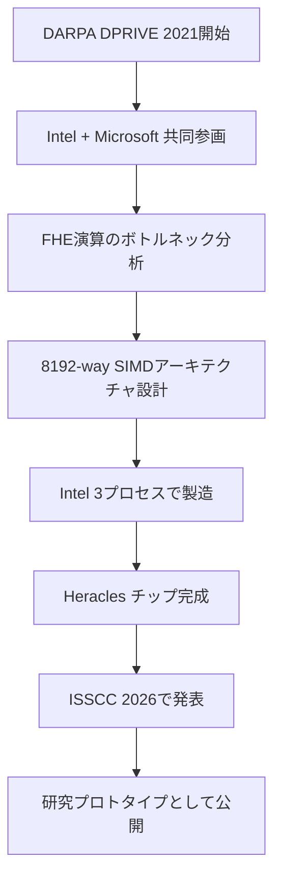
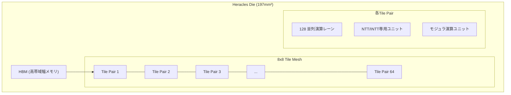

本記事は [Intel's Heracles Chip Speeds Up FHE Computing (IEEE Spectrum, 2026年3月10日)](https://spectrum.ieee.org/fhe-intel) の解説記事です。

## ブログ概要（Summary）

Intelは DARPA DPRIVE（Data Protection in Virtual Environments）プログラムの成果として、FHE専用ASIC「Heracles」を発表した。Intel 3プロセスで製造され、8192-way SIMDエンジンを搭載したこのチップは、24コアIntel Xeon W7-3455サーバーと比較してFHE演算で1,074〜5,547倍の高速化を達成している。2026年3月のISSCC（International Solid-State Circuits Conference）で発表された研究プロトタイプであり、商用製品としての出荷予定はまだ発表されていない。

この記事は [Zenn記事: 準同型暗号（FHE）2026年最新動向：暗号化したままAI推論を実現する技術](https://zenn.dev/0h_n0/articles/55ffbd99f5d0ed) の深掘りです。

## 情報源

- **種別**: 技術メディア記事（IEEE Spectrum）
- **URL**: [https://spectrum.ieee.org/fhe-intel](https://spectrum.ieee.org/fhe-intel)
- **著者**: Samuel K. Moore（IEEE Spectrum半導体エディター）
- **発表日**: 2026年3月10日
- **発表会議**: ISSCC 2026

## 技術的背景（Technical Background）

### なぜFHE専用ハードウェアが必要か

FHEの最大の課題は計算オーバーヘッドである。平文での処理と比較して、FHEは1,000〜1,000,000倍の計算コストを要する。この原因は、FHEの基本演算が「大きな多項式環上の演算」に帰着するためである。

具体的には、CKKSやBFVスキームでは多項式次数 $N = 2^{15} \sim 2^{17}$ の多項式に対して以下の演算を大量に実行する必要がある。

- **NTT（Number Theoretic Transform）**: 多項式乗算を $O(N \log N)$ に高速化する変換
- **INTT（Inverse NTT）**: NTTの逆変換
- **モジュラ算術**: 大きなモジュラスでの加減乗算
- **鍵交換（Key Switching）**: 暗号文の鍵を変換する演算

汎用CPU上ではこれらの演算がメモリ帯域幅とALUの制約を受けるため、GPU加速でも限界がある。FHE専用のハードウェアアーキテクチャが求められる理由はここにある。

### DARPA DPRIVEプログラム

DPRIVEは米国国防高等研究計画局（DARPA）が2021年に開始したプログラムであり、FHEの実用化に向けたハードウェア加速を目的としている。IntelはMicrosoftと共同で参画し、Heraclesチップの開発に至った。

## 実装アーキテクチャ（Architecture）

### チップ仕様

IEEE Spectrumおよび関連報道によると、Heraclesの主要仕様は以下の通りである。

| 項目 | 仕様 |
|------|------|
| **製造プロセス** | Intel 3（旧称Intel 4の改良版、3nm FinFET相当） |
| **ダイサイズ** | 197 mm² |
| **TDP** | 176 W |
| **動作クロック** | 1.20 GHz |
| **SIMDエンジン** | 8192-way（64タイルペア × 128並列演算レーン） |
| **メモリ** | 高帯域幅メモリ（HBM）搭載 |
| **フォームファクタ** | PCIeアクセラレータカード（液冷） |
| **比較対象** | 24コア Intel Xeon W7-3455 |

### 8192-way SIMDアーキテクチャ

Heraclesの核心は、FHE演算に特化した8192-way SIMDコンピュートエンジンである。

64個のタイルペアが8×8メッシュ構造で配置されており、各タイルペアは128個の並列演算レーンを持つ。合計で $64 \times 128 = 8192$ のSIMDレーンが同時に動作する。

各タイルには以下の専用ユニットが統合されている。

- **モジュラ算術ユニット**: モジュラ加算、減算、乗算を1サイクルで実行
- **バタフライ演算ユニット**: NTT/INTTに必要なバタフライ操作を専用ハードウェアで高速化
- **メモリインターフェース**: HBMとの高帯域接続

### NTT/INTT最適化

FHE演算の計算時間の大部分を占めるNTTに対して、Heraclesは専用のバタフライ演算ユニットを搭載している。

多項式次数 $N = 2^{16}$ の場合、NTTは16段のバタフライ演算で構成される。各段で $N/2 = 32768$ 個のバタフライ演算が独立に実行可能であり、8192-way SIMDエンジンにより4サイクルで1段を処理できる計算になる。

$$
\text{NTTの1段あたりのサイクル数} = \lceil N/2 \div 8192 \rceil = \lceil 32768 / 8192 \rceil = 4
$$

$$
\text{NTT全体のサイクル数} \approx 4 \times 16 = 64 \text{ サイクル}
$$

1.2 GHzのクロックでは、NTT 1回あたり約53ナノ秒で完了する計算となる。これは汎用CPUでの実行時間（マイクロ秒〜ミリ秒オーダー）と比較して桁違いの高速化である。

### HBMの役割

FHEの暗号文は非常に大きい。多項式次数 $N = 2^{16}$、RNSモジュラス数 $L = 20$ の場合、1つの暗号文は以下のサイズとなる。

$$
\text{暗号文サイズ} = 2 \times N \times L \times 8 \text{ bytes} = 2 \times 65536 \times 20 \times 8 \approx 20 \text{ MB}
$$

鍵交換に必要な評価鍵はさらに大きく、GBオーダーに達する。HBMの高帯域幅（数百GB/s〜TB/s）により、これらの大容量データを高速にチップに供給できる。汎用CPUのDDRメモリでは帯域幅が不足し、演算ユニットがアイドル状態になるが、HBMによりこのボトルネックが解消されている。

## 性能ベンチマーク

IEEE SpectrumおよびTom's Hardwareの報道によると、Heraclesは24コアIntel Xeon W7-3455との比較で以下の高速化を達成している。

| FHE操作 | 高速化倍率 | 備考 |
|---------|-----------|------|
| 最小（特定操作） | 1,074x | NTTなど基本演算 |
| 最大（特定操作） | 5,547x | Bootstrapping等の複合演算 |

この高速化倍率の幅は、FHE操作の種類によって並列化の効果が異なるためである。バタフライ演算が支配的なNTTではSIMDの効果が最大化されるのに対し、データ依存性のある逐次的な処理ではSIMDの利用率が低下する。

**GPU加速との比較**: 現時点では、HeraclesとGPU加速（CATやEncryptedLLM等）の直接比較ベンチマークは公開されていない。ただし、GPU加速がCPU比100〜200倍程度であるのに対し、HeraclesはCPU比1,074〜5,547倍を達成していることから、専用ASICの優位性が示唆されている。

## パフォーマンス最適化（Performance）

### 専用ASICの利点

1. **演算レーンの最適化**: 汎用GPUのCUDAコアは浮動小数点演算に最適化されているが、FHEの主要演算はモジュラ整数演算である。Heraclesはモジュラ演算に特化した演算レーンを搭載しており、不要な回路によるダイ面積の浪費がない
2. **メモリ階層の最適化**: FHE演算のデータアクセスパターンに合わせたメモリ階層設計。NTTのバタフライ構造に最適なデータレイアウト
3. **電力効率**: 専用ASICは汎用プロセッサと比較してワットあたりの演算性能が高い。176W TDPで8192-way SIMDを駆動

### 制約と課題

報道によると、Heraclesには以下の制約がある。

1. **研究プロトタイプ**: 2026年3月時点では商用製品ではない。Intelは商用化計画を発表していないと報じられている
2. **価格・入手性**: 未定。DARPA研究プログラムの成果であり、一般市場での入手は当面困難と見られる
3. **プログラマビリティ**: 汎用GPUと比較してプログラミングモデルが限定される可能性がある。ソフトウェアスタック（コンパイラ、ライブラリ）の成熟度は不明
4. **液冷要件**: PCIeアクセラレータカード形態で液冷が必要であり、一般的なデータセンター環境への導入には設備投資が必要

## 運用での学び（Production Lessons）

### FHE専用ハードウェアの導入戦略

IEEE Spectrumの報道に基づくと、FHE専用ハードウェアの導入は以下の段階で進むと予想される。

1. **短期（2026-2027）**: GPU加速（CAT、EncryptedLLM等）を用いた暗号化計算の概念実証（PoC）
2. **中期（2027-2028）**: FHE専用ASICの商用製品化。クラウドプロバイダ（AWS、Azure、GCP）でのマネージドサービス提供開始
3. **長期（2029以降）**: FHE専用ハードウェアの標準化。FHEコンパイラ（HEIR等）を介した透過的なハードウェア選択

### 実務への影響

現時点でFHEの導入を検討するエンジニアは、以下の戦略が現実的である。

- **即座に始められること**: OpenFHEやConcrete MLを使ったCPUベースのFHEプロトタイプ開発
- **GPU環境がある場合**: CATフレームワークを用いたGPU加速FHE（CPU比100-200倍）
- **将来への準備**: HIERコンパイラ（Googleが開発）を用いたFHEプログラムの記述。HIERはバックエンドとしてCPU、GPU、そして将来的にASICをサポートする設計となっている

## 学術研究との関連（Academic Connection）

Heraclesは以下の学術研究の成果を統合したものと考えられる。

- **NTT最適化**: FHE向けNTTの並列化に関する研究（2020年代前半から多数発表）。Heraclesのバタフライ演算ユニットはこれらの研究成果を集約したハードウェア実装
- **FHEアクセラレータ設計**: FPGAベースのFHEアクセラレータ研究（F1、CraterLake等）が先行しており、Heraclesはこれらの知見をASICに適用
- **DARPA DPRIVEの他の参画者**: Microsoftも同プログラムに参画しており、SEALライブラリとの統合が将来的に期待される

## まとめと実践への示唆

Intel Heraclesは、FHE専用ASICとしてCPU比最大5,547倍の高速化を実証した研究プロトタイプである。8192-way SIMDエンジン、NTT専用バタフライユニット、HBMの組み合わせにより、FHE演算のボトルネックであった計算オーバーヘッドを大幅に削減している。

ただし、2026年3月時点では研究プロトタイプであり、商用利用可能な製品はまだ出荷されていない。実プロジェクトでは、GPU加速（CATフレームワーク等）から始め、HIERコンパイラによるハードウェア抽象化レイヤーを採用しておくことで、将来的なASIC移行への道筋を確保することが現実的なアプローチである。

## 参考文献

- **Blog URL**: [https://spectrum.ieee.org/fhe-intel](https://spectrum.ieee.org/fhe-intel)
- **Tom's Hardware**: [Intel's Heracles chip computes fully-encrypted data](https://www.tomshardware.com/tech-industry/cyber-security/intels-heracles-chip-computes-fully-encrypted-data-without-decrypting-it-chip-is-1-074-to-5-547-times-faster-than-a-24-core-intel-xeon-in-fhe-math-operations)
- **DARPA DPRIVE**: [Intel to Collaborate with Microsoft on DARPA Program](https://www.intc.com/news-events/press-releases/detail/1445/intel-to-collaborate-with-microsoft-on-darpa-program)
- **Related Zenn article**: [https://zenn.dev/0h_n0/articles/55ffbd99f5d0ed](https://zenn.dev/0h_n0/articles/55ffbd99f5d0ed)
