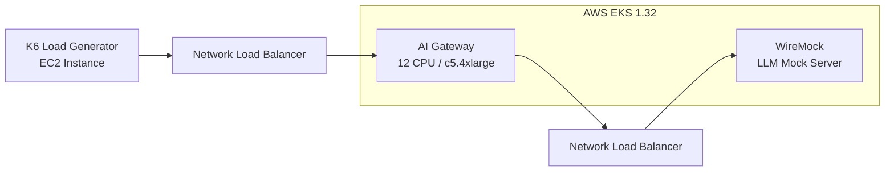
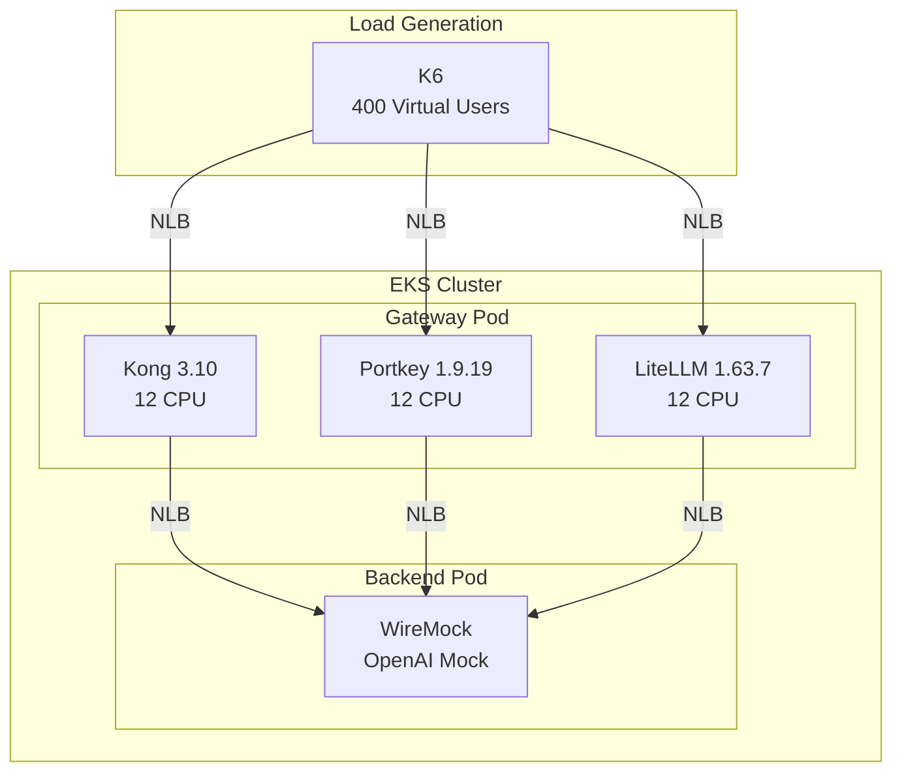

本記事は [AI Gateway Benchmark: Kong AI Gateway, Portkey, and LiteLLM（Kong Inc.公式ブログ）](https://konghq.com/blog/engineering/ai-gateway-benchmark-kong-ai-gateway-portkey-litellm) の解説記事です。

## ブログ概要（Summary）

Kong社が2025年に公開した本ベンチマークは、AWS EKSクラスタ上でKong Gateway 3.10、Portkey OSS 1.9.19、LiteLLM 1.63.7の3つのAI Gatewayを同一リソース条件（12 CPU）で比較した、数少ない定量的な第三者性能評価データである。結果として、プロキシのみの構成（ポリシー無効化）でKongが約23,400 RPS、Portkeyが約10,300 RPS、LiteLLMが約2,700 RPSを記録し、KongがPortkey比228%、LiteLLM比859%のスループット優位を示している。

この記事は [Zenn記事: Portkey AIゲートウェイ本番ベンチマーク：日本リージョンでの性能実測と運用設計](https://zenn.dev/0h_n0/articles/0e6ba8818ec5b5) の深掘りです。

## 情報源

- **種別**: 企業テックブログ
- **URL**: [https://konghq.com/blog/engineering/ai-gateway-benchmark-kong-ai-gateway-portkey-litellm](https://konghq.com/blog/engineering/ai-gateway-benchmark-kong-ai-gateway-portkey-litellm)
- **組織**: Kong Inc.（API Gateway/Service Meshベンダー）
- **発表日**: 2025年
- **ベンチマークコード**: [GitHub - Kong/kong_ai_gateway-portkey-litellm-benchmark](https://github.com/Kong/kong_ai_gateway-portkey-litellm-benchmark)

## 技術的背景（Technical Background）

AI Gatewayは、LLMプロバイダとアプリケーション間に位置するプロキシレイヤーであり、認証・レートリミット・キャッシュ・ルーティング・オブザーバビリティ等の横断的機能を提供する。2024-2025年にかけて、Kong、Portkey、LiteLLM、Bifrost、Helicone等の複数ベンダーがこの領域に参入しているが、標準化されたベンチマーク手法が存在しないため、性能比較は各ベンダーの自己報告に依存してきた。

Kong社のベンチマークは、LLMをWireMockでモック化し、ゲートウェイの純粋なプロキシ性能（スループット・レイテンシ）を同一条件で測定するという点で、AI Gateway領域における初の体系的な第三者ベンチマークと位置づけられる。ただし、テストがKong社自身により実施されている点については、バイアスの可能性を考慮する必要がある。

## ベンチマーク方法論（Methodology）

### テスト環境



| パラメータ | 値 |
|-----------|-----|
| **クラスタ** | AWS EKS 1.32 |
| **ノード** | c5.4xlarge（16 vCPU / 32 GiB RAM） |
| **CPU割当（ゲートウェイ）** | 12 CPU |
| **同時接続数** | 400 VU（仮想ユーザー） |
| **テスト時間** | 3分間 |
| **ペイロード** | 1,000プロンプトトークン/リクエスト |
| **LLMモック** | WireMock（OpenAI互換エンドポイント） |
| **負荷生成** | K6（同一VPC内のEC2インスタンスから実行） |

### WireMockベースライン

LLMモックサーバー（WireMock）への直接接続のベースライン性能は以下のとおりである：

| 指標 | ベースライン値 |
|------|-------------|
| **RPS** | 29,005 |
| **P95レイテンシ** | 24.07 ms |
| **P99レイテンシ** | 30.35 ms |

このベースラインに対する各ゲートウェイのオーバーヘッドが、ベンチマークの本質的な評価対象である。

### テスト条件の制約

ブログ記事が明記しているとおり、以下の条件でテストが実施されている：
- **プロキシのみ**: 認証、レートリミット、キャッシュ等のポリシーは無効化
- **非ストリーミング**: SSEストリーミングは使用せず、通常のHTTPリクエスト/レスポンス
- **単一ワーカー設定**: 各ゲートウェイのデフォルト設定を使用

## 実験結果（Performance Results）

### スループット比較

ブログ記事の結果セクションより：

| ゲートウェイ | バージョン | RPS | ベースライン比 | Kong比 |
|------------|----------|------|-------------|--------|
| **Kong Gateway** | 3.10 | 約23,400 | 80.7% | 基準 |
| **Portkey OSS** | 1.9.19 | 約10,300 | 35.5% | 44% |
| **LiteLLM** | 1.63.7 | 約2,700 | 9.3% | 11.5% |
| **WireMock（ベースライン）** | — | 29,005 | 100% | — |

Kong Gatewayはベースラインの80.7%のスループットを維持しているのに対し、Portkeyは35.5%、LiteLLMは9.3%にとどまっている。

### レイテンシ比較

| ゲートウェイ | P95レイテンシ（Kong比） | P99レイテンシ（Kong比） |
|------------|----------------------|----------------------|
| **Kong Gateway** | 基準 | 基準 |
| **Portkey OSS** | +65% | — |
| **LiteLLM** | +86% | — |

### リソース使用率

ブログ記事によると、3ゲートウェイとも割り当てられた12 CPUに対して70-80%のCPU使用率を示している。ただし、KongはWireMock（バックエンド）のCPUも飽和させるレベルの負荷を生成できたのに対し、PortkeyとLiteLLMはバックエンドを飽和させるに至らなかったと報告されている。

## ベンチマーク結果の批判的分析

### Kong社バイアスの考慮

このベンチマークはKong社が企画・実施・公開している。以下の点でバイアスの可能性がある：

1. **テスト条件の設定**: 「プロキシのみ」のテストはKongの強み（Nginx/OpenRestyベースの高速プロキシ）を最大化する条件である。PortkeyやLiteLLMの強みであるLLMネイティブ機能（セマンティックキャッシュ、モデルルーティング、コスト追跡）は評価対象外となっている

2. **バージョン選定**: Portkey OSS 1.9.19は2025年初頭のバージョンであり、2025年後半にリリースされたPortkey Gateway 2.0ではパフォーマンスが改善されている可能性がある

3. **再現性**: ベンチマークのソースコードは[GitHub上で公開](https://github.com/Kong/kong_ai_gateway-portkey-litellm-benchmark)されており、手法自体は第三者が検証可能

### 実運用との乖離

ベンチマーク結果を本番環境のゲートウェイ選定に直接適用する際には、以下の乖離を考慮する必要がある：

1. **LLMレスポンス時間の支配的影響**: 実際のLLM APIレスポンスは500ms〜数十秒であり、ゲートウェイのオーバーヘッド差（数十ms）は全体レイテンシの数%に過ぎない。Zenn記事の分析でも、ゲートウェイ処理時間（OSSで1ms未満、管理型SaaSで20-40ms）はLLMレスポンスのTTFB（200-800ms）と比較して小さい

2. **ポリシー有効時の性能変化**: 認証・レートリミット・キャッシュ等を有効にした場合、各ゲートウェイの性能特性は大きく変わる可能性がある。特にPortkeyのセマンティックキャッシュはキャッシュヒット時にLLM呼び出しを完全にスキップするため、実効スループットが大幅に向上しうる

3. **スケーリング特性の未評価**: 400 VUでの3分間テストは定常状態の性能を測定しているが、バースト時の性能やオートスケーリング挙動は評価されていない

## 実装アーキテクチャ（Architecture）

### 各ゲートウェイの技術スタック

| ゲートウェイ | コア技術 | 言語 | 特徴 |
|------------|---------|------|------|
| **Kong Gateway** | Nginx/OpenResty + Lua | C/Lua | L7プロキシとして成熟、汎用API Gateway拡張 |
| **Portkey OSS** | Node.js | TypeScript | LLMネイティブ設計、軽量（122KB） |
| **LiteLLM** | Python/FastAPI | Python | 200+プロバイダ対応、Pythonエコシステム統合 |

スループット差の主因は技術スタックの違いにある。Kongは高性能プロキシとして実績のあるNginx/OpenRestyをベースとしており、C言語レベルのI/O処理が強みである。一方、Portkeyはノンブロッキングのevent-drivenアプローチ（Node.js）であり、LiteLLMはPythonのGIL制約を受ける。

### ベンチマーク構成図



## パフォーマンス最適化（Performance）

### ゲートウェイ選定の判断基準

ベンチマーク結果を踏まえた実運用でのゲートウェイ選定基準を以下に整理する：

| 判断軸 | Kong Gateway | Portkey | LiteLLM |
|--------|-------------|---------|---------|
| **プロキシスループット** | 最高（23,400 RPS） | 中（10,300 RPS） | 低（2,700 RPS） |
| **LLMネイティブ機能** | プラグインで追加 | ネイティブ組込 | ネイティブ組込 |
| **セマンティックキャッシュ** | 別途構築必要 | 組込（Enterprise） | 外部連携 |
| **モデルルーティング** | AI Proxyプラグイン | ネイティブ対応 | ネイティブ対応 |
| **コスト追跡** | 別途構築必要 | 組込 | 組込 |
| **適合ユースケース** | 高トラフィック汎用API | LLM特化中規模 | Python開発環境 |

### スループットが重要になるケース

23,400 RPSと10,300 RPSの差が実運用で問題になるのは、以下の条件がすべて揃う場合に限られる：

1. ゲートウェイがボトルネックになるレベルのトラフィック（1万RPS以上）
2. LLMレスポンス時間が極めて短い（数十ms。キャッシュヒットやファインチューン済みモデル等）
3. 水平スケーリングに制約がある

一般的なLLMアプリケーション（レスポンス1-30秒）では、ゲートウェイのスループット差よりもLLMネイティブ機能の充実度がROIに直結する。

## 運用での学び（Production Lessons）

### ベンチマーク再現のポイント

Kong社のベンチマークを自環境で再現する際の注意点：

1. **WireMockの設定**: レスポンスサイズ（トークン数）を本番ワークロードに合わせて調整する。ベンチマークの1,000トークンは比較的小さく、大きなレスポンスでは結果が変わる可能性がある

2. **CPU割当**: 12 CPUは本番環境の典型的な構成。ただし、Pod内のworker数やスレッド設定はゲートウェイごとに異なるため、デフォルト設定での比較が公平かは議論の余地がある

3. **ネットワーク**: 同一VPC内でのテストはネットワークレイテンシを最小化しているが、本番ではAZ間通信やNAT Gatewayのオーバーヘッドが加わる

### ポリシー有効時のベンチマーク推奨

本番環境のゲートウェイ選定には、以下の追加ベンチマークを実施することを推奨する：

```bash
# K6スクリプト例: ポリシー有効時のベンチマーク
# 認証 + レートリミット + ログ記録を有効化した状態でテスト
k6 run \
  --vus 400 \
  --duration 3m \
  --out json=results_with_policies.json \
  benchmark_with_policies.js
```

## 学術研究との関連（Academic Connection）

このベンチマークは、AI Gatewayの「プロキシ性能」という狭い側面のみを評価しているが、学術研究では「ゲートウェイが提供すべき機能」がより広く議論されている：

- **RouteLLM** (ICLR 2025): クエリルーティングの学習手法。ゲートウェイにルーティング機能を統合する際の設計指針を提供
- **FrugalGPT** (Stanford, 2023): LLMカスケードの定式化。ゲートウェイのフォールバック機能の理論的根拠
- **MeanCache** (2024): セマンティックキャッシュの最適化。ゲートウェイのキャッシュ機能の精度向上手法

プロキシ性能のみでゲートウェイを評価することの限界は、これらの研究が示す「LLMネイティブ機能によるコスト・品質最適化」の価値と対比することで明確になる。

## まとめと実践への示唆

Kong社のベンチマークは、AI Gatewayの性能比較における貴重な定量データを提供している。Kong 23,400 RPS対Portkey 10,300 RPSという結果は、純粋なプロキシ性能ではKongが優位であることを示している。

ただし、この結果の解釈には以下の文脈が不可欠である：（1）テストはプロキシのみの構成であり、LLMネイティブ機能は評価対象外、（2）実運用ではLLMレスポンス時間がボトルネックであり、ゲートウェイのオーバーヘッド差は相対的に小さい、（3）ベンチマーク主催者のバイアスを考慮する必要がある。ゲートウェイ選定においては、プロキシ性能だけでなく、セマンティックキャッシュ・モデルルーティング・コスト追跡等のLLMネイティブ機能を含めた総合的な評価を推奨する。

## 参考文献

- **Blog URL**: [https://konghq.com/blog/engineering/ai-gateway-benchmark-kong-ai-gateway-portkey-litellm](https://konghq.com/blog/engineering/ai-gateway-benchmark-kong-ai-gateway-portkey-litellm)
- **Benchmark Code**: [https://github.com/Kong/kong_ai_gateway-portkey-litellm-benchmark](https://github.com/Kong/kong_ai_gateway-portkey-litellm-benchmark)
- **Related Zenn article**: [https://zenn.dev/0h_n0/articles/0e6ba8818ec5b5](https://zenn.dev/0h_n0/articles/0e6ba8818ec5b5)
