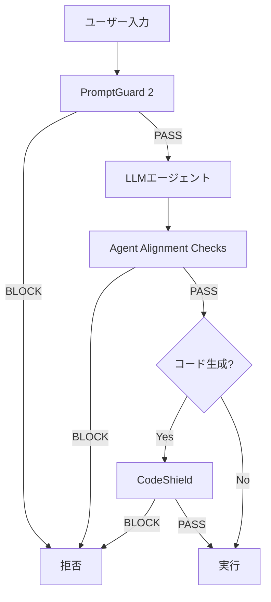

本記事は [LlamaFirewall: An Open Source Guardrail System for Building Secure AI Agents (Meta AI Research)](https://ai.meta.com/research/publications/llamafirewall-an-open-source-guardrail-system-for-building-secure-ai-agents/) の解説記事です。

## ブログ概要（Summary）

LlamaFirewallは、Metaが開発・公開したAIエージェント向けのオープンソースセキュリティフレームワークである。3つのコアガードレール——**PromptGuard 2**（ジェイルブレーク検出）、**Agent Alignment Checks**（推論チェーン監査）、**CodeShield**（静的解析エンジン）——を統合し、プロンプトインジェクション、エージェント誤整合、安全でないコード生成の3つの脅威に対応する。Metaの公式発表によれば、同フレームワークは**Meta社内の本番環境で使用されている**とのことである。

この記事は [Zenn記事: プロンプトインジェクション検出パイプラインを本番構築する：3層設計の実装](https://zenn.dev/0h_n0/articles/bfd0f1e2f8cba0) の深掘りです。

## 情報源

- **種別**: 企業テックブログ / 研究論文
- **URL**: [https://ai.meta.com/research/publications/llamafirewall-an-open-source-guardrail-system-for-building-secure-ai-agents/](https://ai.meta.com/research/publications/llamafirewall-an-open-source-guardrail-system-for-building-secure-ai-agents/)
- **組織**: Meta AI Research
- **発表日**: 2025年

## 技術的背景（Technical Background）

LLMエージェントの普及に伴い、従来のチャットボット向けガードレール（入出力の有害コンテンツフィルタ）では対応できない新たなセキュリティ課題が顕在化している。

1. **間接プロンプトインジェクション**: エージェントが外部ツール経由で取得したコンテンツに攻撃が埋め込まれる
2. **エージェント誤整合**: 推論チェーン（Chain-of-Thought）の途中で目標が逸れ、意図しないアクションを実行
3. **安全でないコード生成**: コーディングエージェントがSQLインジェクションやコマンドインジェクション等の脆弱性を含むコードを生成

Metaはこれらの課題に対し、既存のモデルファインチューニングやLlama Guardのような分類器だけでは対応が不十分であるとし、**エージェント全体のライフサイクルをカバーするセキュリティレイヤー**としてLlamaFirewallを設計している。

## 実装アーキテクチャ（Architecture）

LlamaFirewallは3つのコアコンポーネントで構成される。



### コンポーネント1: PromptGuard 2

PromptGuard 2はMeta独自の**ユニバーサルジェイルブレーク検出器**である。Zenn記事で紹介したMeta Prompt Guard 2と同一のモデルであり、LlamaFirewallの入力フィルタとして統合されている。

**主な特徴**:
- バイナリ分類（BENIGN/MALICIOUS）
- 86Mパラメータ（軽量）と22Mパラメータ（超軽量）の2バリアント
- Metaの発表によれば「state-of-the-art performance」を達成

**LlamaFirewallでの役割**: エージェントへの入力（ユーザープロンプト＋外部取得コンテンツ）をリアルタイムでスクリーニングする最前線の防御層。

### コンポーネント2: Agent Alignment Checks

Agent Alignment Checksは**推論チェーン（Chain-of-Thought）の監査エンジン**である。エージェントの推論過程を検査し、プロンプトインジェクションによる目標逸脱や誤整合を検出する。

**動作原理**:
1. エージェントの推論ステップを逐次監視
2. 各ステップが元のユーザー目標と整合しているかを検証
3. 目標からの逸脱を検出した場合にブロック

**Metaの発表によれば**、Agent Alignment Checksは「preventing indirect injections in general scenarios」において従来手法よりも有効であるとされている。ただし、Meta自身もこのコンポーネントを**experimental（実験的）**と位置づけている。

```python
class AgentAlignmentChecker:
    """エージェントの推論チェーンを監査する。

    各推論ステップが元のユーザー目標と整合しているかを検証。
    """

    def __init__(self, judge_model: str = "meta-llama/Llama-3-8B") -> None:
        self.judge_model = judge_model

    def check_alignment(
        self,
        original_goal: str,
        reasoning_step: str,
        planned_action: str,
    ) -> tuple[bool, str]:
        """推論ステップの整合性を検証する。

        Args:
            original_goal: ユーザーの元の目標
            reasoning_step: エージェントの現在の推論ステップ
            planned_action: エージェントが実行しようとするアクション

        Returns:
            (is_aligned, reason) のタプル
        """
        prompt = f"""以下のエージェント推論を検証してください。

元のユーザー目標: {original_goal}
現在の推論: {reasoning_step}
計画されたアクション: {planned_action}

質問: このアクションはユーザーの元の目標に沿っていますか？
JSON形式で回答: {{"aligned": bool, "reason": str}}"""

        # Judge LLMで判定
        result = self._invoke_judge(prompt)
        return result["aligned"], result["reason"]
```

### コンポーネント3: CodeShield

CodeShieldは**オンライン静的解析エンジン**であり、コーディングエージェントが生成するコードの安全性をリアルタイムで検証する。

**検出対象**:
- SQLインジェクション脆弱性
- コマンドインジェクション
- パストラバーサル
- ハードコードされたシークレット
- 安全でないデシリアライゼーション

**Metaの発表によれば**、CodeShieldは「fast and extensible」を設計原則とし、コード生成の完了を待たずにストリーミング解析が可能である。

### カスタマイズ可能なスキャナー

LlamaFirewallは上記3コンポーネントに加え、**カスタムスキャナー**の追加をサポートしている。開発者は正規表現やLLMプロンプトベースのスキャナーを簡単に追加でき、ドメイン固有のセキュリティポリシーに対応できる。

```python
from llamafirewall import LlamaFirewall, CustomScanner

# カスタムスキャナーの定義例
class PIIScanner(CustomScanner):
    """個人情報（PII）の出力を検出するカスタムスキャナー。"""

    PATTERNS = [
        r"\b\d{3}-\d{4}-\d{4}\b",  # 電話番号
        r"\b[A-Z0-9._%+-]+@[A-Z0-9.-]+\.[A-Z]{2,}\b",  # メールアドレス
    ]

    def scan(self, text: str) -> bool:
        import re
        return any(
            re.search(p, text, re.IGNORECASE) for p in self.PATTERNS
        )

# LlamaFirewallに統合
firewall = LlamaFirewall(
    prompt_guard=True,
    agent_alignment=True,
    code_shield=True,
    custom_scanners=[PIIScanner()],
)
```

## パフォーマンス最適化（Performance）

### 推論レイテンシ

Metaの発表に基づくコンポーネント別のレイテンシ概要は以下の通りである。

| コンポーネント | レイテンシ | 実行タイミング |
|--------------|----------|-------------|
| PromptGuard 2 (86M) | 10-30ms | 入力時（毎回） |
| PromptGuard 2 (22M) | 5-15ms | 入力時（毎回） |
| Agent Alignment Checks | 500-2000ms | 推論ステップごと |
| CodeShield | 50-200ms | コード生成時 |

### スケーリング戦略

- PromptGuard 2はGPU不要（CPU推論で10-30ms）のため、Lambdaやコンテナで水平スケーリングが容易
- Agent Alignment ChecksはLLM推論を含むため、GPUリソースが必要。ただし全リクエストではなくツール呼び出し時のみ発動させることでコストを抑制可能

## 運用での学び（Production Lessons）

Metaは本番環境での運用から以下の知見を共有している。

1. **多層防御の重要性**: 単一コンポーネントでは全攻撃ベクトルをカバーできない。PromptGuard 2（入力）、Agent Alignment Checks（推論）、CodeShield（出力）の3層が相互補完する
2. **カスタマイズ性**: ドメイン固有の脅威に対応するには、汎用モデルだけでなくカスタムスキャナーの追加が不可欠
3. **実験的コンポーネントの段階的導入**: Agent Alignment Checksは実験的と位置づけ、まずはログモード（ブロックせず記録のみ）で導入し、精度を確認してからブロックモードに移行

## 学術研究との関連（Academic Connection）

LlamaFirewallの各コンポーネントは学術研究に基づいている。

- **PromptGuard 2**: Meta Llama Prompt Guard（HuggingFace公開モデル）の後継。CyberSecEval（Meta Purple Llama）での評価に基づく
- **Agent Alignment Checks**: InjecAgent（ACL 2024 Findings）やAgentDojo等のエージェント攻撃ベンチマークの知見を実装に反映
- **CodeShield**: CyberSecEval 3のInsecure Code Detectionタスクでの評価結果に基づく

## Production Deployment Guide

### AWS実装パターン（コスト最適化重視）

LlamaFirewallの3コンポーネントをAWS上にデプロイする構成を示す。

**トラフィック量別の推奨構成**:

| 規模 | 月間リクエスト | 推奨構成 | 月額コスト | 主要サービス |
|------|--------------|---------|-----------|------------|
| **Small** | ~3,000 (100/日) | Serverless | $80-200 | Lambda (PromptGuard) + Bedrock (Alignment) |
| **Medium** | ~30,000 (1,000/日) | Hybrid | $400-1,000 | ECS Fargate + SageMaker |
| **Large** | 300,000+ (10,000/日) | Container | $2,000-4,000 | EKS + GPU Spot |

**Small構成の詳細** (月額$80-200):
- **Lambda**: PromptGuard 2 (22M) 推論 ($30/月、CPU十分)
- **Bedrock (Claude 3.5 Haiku)**: Agent Alignment Checks ($50-120/月、ツール呼び出し時のみ)
- **Lambda**: CodeShield静的解析 ($10/月)
- **CloudWatch**: 監視 ($10/月)

**コスト試算の注意事項**:
- 上記は2026年3月時点のAWS ap-northeast-1（東京）リージョン料金に基づく概算値です
- Agent Alignment Checksのコストは全リクエストではなくツール呼び出し時のみ発動する前提
- 最新料金は [AWS料金計算ツール](https://calculator.aws/) で確認してください

**コスト削減テクニック**:
- PromptGuard 2 (22M) はCPUで5-15ms。Lambda最小メモリ（128MB）で動作
- Agent Alignment ChecksはBedrock Batch APIで50%割引（非リアルタイムの場合）
- CodeShieldは静的解析のためGPU不要

### Terraformインフラコード

**Small構成: Lambda + Bedrock統合**

```hcl
# --- PromptGuard 2 Lambda ---
resource "aws_lambda_function" "prompt_guard" {
  filename      = "prompt_guard.zip"
  function_name = "llamafirewall-prompt-guard"
  role          = aws_iam_role.lambda_firewall.arn
  handler       = "index.handler"
  runtime       = "python3.12"
  timeout       = 10
  memory_size   = 256

  environment {
    variables = {
      MODEL_PATH = "/opt/models/prompt-guard-22m"
      THRESHOLD  = "0.85"
    }
  }

  layers = [aws_lambda_layer_version.prompt_guard_model.arn]
}

# --- Agent Alignment Checks (Bedrock) ---
resource "aws_iam_role_policy" "bedrock_alignment" {
  role = aws_iam_role.lambda_firewall.id

  policy = jsonencode({
    Version = "2012-10-17"
    Statement = [{
      Effect   = "Allow"
      Action   = ["bedrock:InvokeModel"]
      Resource = "arn:aws:bedrock:ap-northeast-1::foundation-model/anthropic.claude-3-5-haiku*"
    }]
  })
}

resource "aws_lambda_function" "alignment_check" {
  filename      = "alignment_check.zip"
  function_name = "llamafirewall-alignment-check"
  role          = aws_iam_role.lambda_firewall.arn
  handler       = "index.handler"
  runtime       = "python3.12"
  timeout       = 30
  memory_size   = 512

  environment {
    variables = {
      BEDROCK_MODEL_ID = "anthropic.claude-3-5-haiku-20241022-v1:0"
    }
  }
}

# --- CodeShield Lambda ---
resource "aws_lambda_function" "code_shield" {
  filename      = "code_shield.zip"
  function_name = "llamafirewall-code-shield"
  role          = aws_iam_role.lambda_firewall.arn
  handler       = "index.handler"
  runtime       = "python3.12"
  timeout       = 15
  memory_size   = 512

  environment {
    variables = {
      RULES_PATH = "s3://${aws_s3_bucket.config.id}/codeshield-rules.json"
    }
  }
}

# --- CloudWatch アラーム ---
resource "aws_cloudwatch_metric_alarm" "firewall_block_rate" {
  alarm_name          = "llamafirewall-block-rate-spike"
  comparison_operator = "GreaterThanThreshold"
  evaluation_periods  = 2
  metric_name         = "BlockRate"
  namespace           = "Custom/LlamaFirewall"
  period              = 300
  statistic           = "Average"
  threshold           = 0.1
  alarm_description   = "LlamaFirewallブロック率異常（攻撃急増の可能性）"
}
```

### セキュリティベストプラクティス

- **Lambda層分離**: 各コンポーネントを独立したLambda関数として実装し、1つのコンポーネント障害が全体に波及しないようにする
- **IAM最小権限**: Bedrock呼び出しは特定モデルのみ許可
- **ログ**: ブロック理由の詳細はCloudWatch Logsに記録するが、ユーザー入力全文は記録しない

### コスト最適化チェックリスト

- [ ] PromptGuard 2: 22Mモデル使用でLambda最小メモリ（128MB）
- [ ] Agent Alignment Checks: ツール呼び出し時のみ発動（全リクエスト不可）
- [ ] Bedrock Batch API: 非リアルタイム処理で50%割引
- [ ] CodeShield: コード生成時のみ発動
- [ ] CloudWatch Logs: 保持期間30日（コスト削減）
- [ ] Lambda Provisioned Concurrency: 不要（コールドスタート許容）

## まとめと実践への示唆

LlamaFirewallの主な貢献は、エージェント時代のセキュリティ課題に対して**入力・推論・出力の3層で包括的に対応するオープンソースフレームワーク**を提供した点にある。Zenn記事の3層パイプライン（ルールベース・分類器・LLM Judge）と対比すると、LlamaFirewallはエージェント固有の脅威（推論チェーン逸脱、安全でないコード生成）にまで防御範囲を拡張している。

実装者にとっての最大の利点は、Meta本番環境で実証済みのコンポーネントがオープンソースとして利用可能な点である。PromptGuard 2をLayer 2の分類器として、Agent Alignment ChecksをLayer 3のLLM Judgeの補完として活用できる。

## 参考文献

- **Blog URL**: [https://ai.meta.com/research/publications/llamafirewall-an-open-source-guardrail-system-for-building-secure-ai-agents/](https://ai.meta.com/research/publications/llamafirewall-an-open-source-guardrail-system-for-building-secure-ai-agents/)
- **Related Zenn article**: [https://zenn.dev/0h_n0/articles/bfd0f1e2f8cba0](https://zenn.dev/0h_n0/articles/bfd0f1e2f8cba0)

---

:::message
この記事はAI（Claude Code）により自動生成されました。内容の正確性については公式発表で検証していますが、詳細は公式ドキュメントもご確認ください。
:::
