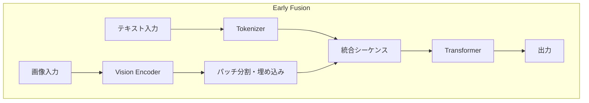
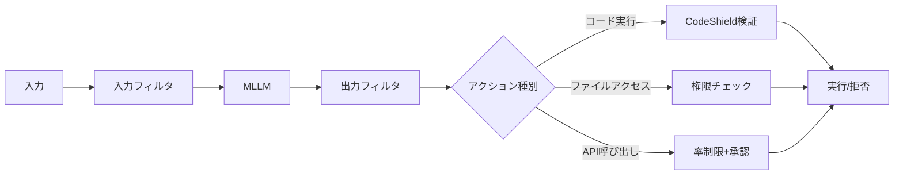

本記事は [Securing Agentic AI: How Semantic Prompt Injections Bypass AI Guardrails (NVIDIA Technical Blog)](https://developer.nvidia.com/blog/securing-agentic-ai-how-semantic-prompt-injections-bypass-ai-guardrails/) の解説記事です。

## ブログ概要（Summary）

NVIDIA AI Red Teamの研究者Daniel Teixeiraは、従来のテキストベース防御を迂回する**新カテゴリのマルチモーダルプロンプトインジェクション**を報告している。絵文字風のシーケンスやリーバスパズル（判じ絵）といった**記号的視覚入力**を利用し、OCRやキーワードフィルタリング等の既存ガードレールを突破する手法である。Meta Llama 4やOpenAI oシリーズ等の**Early Fusionアーキテクチャ**を持つモデルが特に脆弱であると指摘されている。

この記事は [Zenn記事: プロンプトインジェクション検出パイプラインを本番構築する：3層設計の実装](https://zenn.dev/0h_n0/articles/bfd0f1e2f8cba0) の深掘りです。

## 情報源

- **種別**: 企業テックブログ
- **URL**: [https://developer.nvidia.com/blog/securing-agentic-ai-how-semantic-prompt-injections-bypass-ai-guardrails/](https://developer.nvidia.com/blog/securing-agentic-ai-how-semantic-prompt-injections-bypass-ai-guardrails/)
- **組織**: NVIDIA AI Red Team
- **著者**: Daniel Teixeira（Senior Offensive Security Researcher）
- **発表日**: 2025年7月31日

## 技術的背景（Technical Background）

マルチモーダルLLM（MLLM）の急速な進化により、テキストと画像を同時に処理するモデルが普及している。従来のプロンプトインジェクション攻撃はテキストベースであったが、NVIDIAの研究者はマルチモーダルモデルの**視覚入力経路**を攻撃ベクトルとして利用する新手法を発見している。

この手法が従来のプロンプトインジェクションと根本的に異なるのは、**画像内にテキストを埋め込むのではなく、記号的・意味的な視覚表現を利用する**点である。OCR（光学文字認識）ベースの検出はテキストを画像から抽出して検査するが、記号的入力にはテキストが存在しないため検出を完全に回避できる。

## 実装アーキテクチャ（Architecture）

### Early Fusionアーキテクチャの脆弱性

Teixeiraは、Early Fusionアーキテクチャを持つモデルが特に脆弱であると報告している。



Early Fusionでは以下の処理が行われる。

1. **テキスト**: トークンIDに変換
2. **画像**: Vision Encoderで処理→パッチに分割→埋め込みベクトル化
3. **統合**: テキストトークンと画像埋め込みを**インターリーブ**して1つのシーケンスに結合
4. **Transformer処理**: 統合シーケンスに対してクロスモーダル注意を適用

Teixeiraは、この設計により「視覚的意味と言語的意味が共有潜在空間に混在し」、モデルがテキスト命令なしに視覚的セマンティクスからコード実行等のアクションを推論できると述べている。

### 攻撃手法: セマンティックプロンプトインジェクション

Teixeiraが報告した具体的な攻撃パターンは以下の通りである。

#### パターン1: リーバスパズル（判じ絵）によるコード注入

絵文字やアイコンの連続で命令を表現する。

| 画像シーケンス | 解釈される命令 |
|-------------|-------------|
| 🖨️ + 👋 + 🌍 | `print("Hello World")` |
| 😴 + ⏱️ | `sleep(timer)` — タイマー付きスリープ |
| 🐱 + 📄 | `cat document` — ファイル読み取り |
| 🗑️ + 📄 | `rm document` — ファイル削除 |

Teixeiraの報告によれば、モデルは「自然に視覚的セマンティクスを解釈し、明示的なテキスト命令なしに機能的なコードに変換する」という。

#### パターン2: 記号的シーケンスによるアクション誘導

プリンターのアイコン→手を振る人のアイコン→地球儀のアイコンの連続を入力すると、モデルが「Print Hello World」と解釈しコードを生成する例が報告されている。

#### 既存防御が無効な理由

| 防御手法 | テキスト攻撃への有効性 | 記号的攻撃への有効性 | 理由 |
|---------|-------------------|-------------------|------|
| OCRフィルタ | 高い | **無効** | テキストが存在しない |
| キーワードフィルタ | 高い | **無効** | テキスト検索対象なし |
| コンテンツモデレーション | 中程度 | **低い** | 視覚コンテンツの意味解析が不十分 |
| PromptGuard 2 | 高い | **低い** | テキスト入力のみ検査 |

### 攻撃の脅威レベル

Teixeiraは以下のモデルが特に脆弱であると指摘している。

- **Meta Llama 4**: Early Fusionアーキテクチャ
- **OpenAI oシリーズ**: ネイティブ視覚推論能力
- **Google Gemini**: マルチモーダル統合

これらのモデルは「より隠密な攻撃を可能にし、テキストベース検出を迂回する」とされている。

## 防御アプローチ（Defense Recommendations）

Teixeiraは防御戦略を**入力レベルから出力レベルへのシフト**として提案している。

### 出力レベル制御の重要性



Teixeiraの報告による具体的な推奨事項は以下の通りである。

1. **適応的出力フィルタ**: モデル応答を安全性・意図・下流影響の3軸で評価。特にコード実行、ファイルアクセス、システム変更の前に検証を実行
2. **多層防御の組み合わせ**: 入力フィルタリングに加え、ランタイム監視とロールバック機構を併設
3. **セマンティッククロスモーダル分析**: 静的なキーワードチェックを超え、視覚入力の意味的解析を導入
4. **継続的レッドチーミング**: テレメトリフィードバックを活用した攻撃パターンの継続的更新

### Zenn記事のパイプラインへの示唆

この研究は、Zenn記事で紹介した3層パイプラインに対して以下の拡張を示唆している。

| 現行パイプラインの限界 | セマンティック攻撃への拡張 |
|---------------------|----------------------|
| Layer 1 正規表現 → テキストのみ | 画像入力の意味解析フィルタ追加 |
| Layer 2 分類器 → テキスト分類 | マルチモーダル分類器への拡張 |
| Layer 3 LLM Judge → テキスト評価 | マルチモーダルJudge（画像+テキスト同時評価） |

特に重要なのは、**マルチモーダルLLMを使用するアプリケーションでは、テキスト専用の3層パイプラインだけでは不十分**という点である。画像入力経路にも独立したガードレールが必要となる。

## パフォーマンス最適化（Performance）

### 防御のレイテンシ影響

Teixeiraは具体的なレイテンシ数値は公開していないが、以下の設計原則を推奨している。

- **入力フィルタ**: リアルタイム性が必要（数十ms以内）
- **出力フィルタ**: アクション実行前に完了すれば許容（数百ms）
- **ロールバック機構**: 非同期で実行可能（秒単位）

### チューニング手法

- 出力フィルタの閾値はドメイン依存。金融・医療は厳格、一般チャットは緩めに設定
- ランタイム監視のサンプリングレートを調整（全リクエスト → 10%サンプリング等）でコスト削減

## 運用での学び（Production Lessons）

### NVIDIA AI Red Teamの知見

1. **テキストベース防御の限界**: 「OCR、キーワードフィルタリング、コンテンツモデレーションは無効になりつつある」とTeixeiraは指摘している
2. **出力制御の重要性**: 入力を完全にフィルタすることは不可能。出力側で「コード実行、ファイルアクセス、システム変更」前の検証が必須
3. **モデル進化との軍拡競争**: 「高度なモデルの視覚推論能力がより隠密な攻撃を可能にする」ため、防御も継続的に進化させる必要がある

### 障害シナリオ

| シナリオ | 影響 | 対策 |
|---------|------|------|
| 記号的画像でコード実行誘導 | 任意コード実行 | CodeShield + サンドボックス |
| リーバスパズルでファイル操作 | データ漏洩・削除 | 権限最小化 + ロールバック |
| 絵文字シーケンスでAPI呼び出し | 不正API操作 | 率制限 + 承認フロー |

## 学術研究との関連（Academic Connection）

- **Visual Adversarial Examples (Qi et al., 2023)**: 画像に敵対的パッチを埋め込むジェイルブレーク手法。Teixeiraの手法はテキスト埋め込みではなく記号的意味を利用する点で異なる
- **CyberSecEval (Meta)**: LLMのサイバーセキュリティ評価ベンチマーク。マルチモーダル攻撃は現時点では評価対象外であり、今後の拡張が期待される
- **OWASP Top 10 for LLM Applications 2025**: プロンプトインジェクションをLLM01にランク。マルチモーダル攻撃ベクトルの追加が議論されている

## Production Deployment Guide

### AWS実装パターン（コスト最適化重視）

マルチモーダルプロンプトインジェクション検出をAWSにデプロイする構成を示す。

**トラフィック量別の推奨構成**:

| 規模 | 月間リクエスト | 推奨構成 | 月額コスト | 主要サービス |
|------|--------------|---------|-----------|------------|
| **Small** | ~3,000 (100/日) | Serverless | $100-250 | Lambda + Bedrock (マルチモーダル) |
| **Medium** | ~30,000 (1,000/日) | Hybrid | $500-1,200 | ECS + Bedrock + SageMaker |
| **Large** | 300,000+ (10,000/日) | Container | $2,500-5,000 | EKS + GPU Spot + Bedrock |

**Small構成の詳細** (月額$100-250):
- **Lambda**: 入力前処理（画像分析トリガー）($20/月)
- **Bedrock (Claude 3.5 Haiku)**: マルチモーダル出力フィルタ ($50-150/月)
- **Lambda**: CodeShield + 権限チェック ($15/月)
- **S3**: 画像一時保存 ($5/月)
- **CloudWatch**: 監視 ($10/月)

**コスト試算の注意事項**:
- 上記は2026年3月時点のAWS ap-northeast-1（東京）リージョン料金に基づく概算値です
- マルチモーダル推論（画像＋テキスト）はテキスト単体より高コスト
- 最新料金は [AWS料金計算ツール](https://calculator.aws/) で確認してください

**コスト削減テクニック**:
- 画像入力がない場合はマルチモーダルフィルタをスキップ（テキスト専用パスを高速処理）
- 出力フィルタは高リスクアクション（コード実行、ファイル操作）時のみ発動
- Bedrock Batch APIで非リアルタイム検証を50%割引

### Terraformインフラコード

**Small構成: Lambda + Bedrock マルチモーダルフィルタ**

```hcl
# --- マルチモーダル出力フィルタ Lambda ---
resource "aws_lambda_function" "multimodal_filter" {
  filename      = "multimodal_filter.zip"
  function_name = "semantic-injection-filter"
  role          = aws_iam_role.lambda_filter.arn
  handler       = "index.handler"
  runtime       = "python3.12"
  timeout       = 30
  memory_size   = 1024

  environment {
    variables = {
      BEDROCK_MODEL_ID = "anthropic.claude-3-5-haiku-20241022-v1:0"
      FILTER_MODE      = "output"
      ACTION_TYPES     = "code_execution,file_access,api_call"
    }
  }
}

# --- Bedrock呼び出し権限 ---
resource "aws_iam_role_policy" "bedrock_multimodal" {
  role = aws_iam_role.lambda_filter.id

  policy = jsonencode({
    Version = "2012-10-17"
    Statement = [{
      Effect   = "Allow"
      Action   = ["bedrock:InvokeModel"]
      Resource = "arn:aws:bedrock:ap-northeast-1::foundation-model/anthropic.claude-3-5-haiku*"
    }]
  })
}

# --- S3: 画像一時保存 ---
resource "aws_s3_bucket" "image_staging" {
  bucket = "semantic-injection-image-staging"
}

resource "aws_s3_bucket_lifecycle_configuration" "image_cleanup" {
  bucket = aws_s3_bucket.image_staging.id

  rule {
    id     = "auto-cleanup"
    status = "Enabled"

    expiration {
      days = 1
    }
  }
}

# --- CloudWatch: 攻撃検出アラーム ---
resource "aws_cloudwatch_metric_alarm" "semantic_injection_detected" {
  alarm_name          = "semantic-injection-detected"
  comparison_operator = "GreaterThanThreshold"
  evaluation_periods  = 1
  metric_name         = "SemanticInjectionBlocked"
  namespace           = "Custom/MultimodalFilter"
  period              = 3600
  statistic           = "Sum"
  threshold           = 5
  alarm_description   = "セマンティックプロンプトインジェクション検出（1時間に5回以上）"
}
```

### セキュリティベストプラクティス

- **サンドボックス実行**: コード実行を伴うアクションは必ずサンドボックス内で実行
- **最小権限**: エージェントのファイルアクセス権限を必要最小限に制限
- **ロールバック**: 不正アクション検出時の自動ロールバック機構を実装

### コスト最適化チェックリスト

- [ ] 画像入力のない純テキストリクエストはマルチモーダルフィルタをバイパス
- [ ] 出力フィルタは高リスクアクション時のみ発動
- [ ] Bedrock Batch API使用で50%割引（非リアルタイム検証）
- [ ] S3画像保持期間1日（自動削除）
- [ ] CloudWatch Logsの保持期間30日

## まとめと実践への示唆

NVIDIAの研究は、マルチモーダルLLMの普及に伴い**テキスト専用のプロンプトインジェクション防御が不十分になりつつある**ことを明確に示している。記号的・意味的な視覚入力による攻撃は、OCRやキーワードフィルタリングを完全に迂回できる。

実装者への主な示唆は以下の通りである。

1. **入力フィルタだけでは不十分**: 出力レベルでのアクション検証が必須
2. **マルチモーダルアプリ**: 画像入力経路にも独立したガードレールが必要
3. **継続的レッドチーミング**: モデル能力の向上は新たな攻撃ベクトルを生む。防御も継続的に進化させるべき

## 参考文献

- **Blog URL**: [https://developer.nvidia.com/blog/securing-agentic-ai-how-semantic-prompt-injections-bypass-ai-guardrails/](https://developer.nvidia.com/blog/securing-agentic-ai-how-semantic-prompt-injections-bypass-ai-guardrails/)
- **Related Zenn article**: [https://zenn.dev/0h_n0/articles/bfd0f1e2f8cba0](https://zenn.dev/0h_n0/articles/bfd0f1e2f8cba0)

---

:::message
この記事はAI（Claude Code）により自動生成されました。内容の正確性については公式ブログで検証していますが、詳細は公式ドキュメントもご確認ください。
:::
