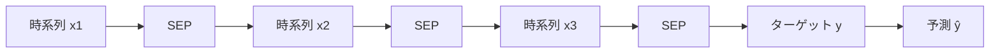

> 本記事は [Time Series Foundation Models Can Be Few-Shot Learners — Google Research Blog](https://research.google/blog/time-series-foundation-models-can-be-few-shot-learners/) の解説記事です。

## ブログ概要（Summary）

Google Researchは、時系列ファウンデーションモデル（TSFM）にfew-shot学習能力を付与する手法「TimesFM-ICF（In-Context Fine-tuning）」を発表した。NLPのLLMがプロンプト内の数例から学習するfew-shot promptingと同様に、TimesFM-ICFは予測対象の時系列に加えて関連する複数の時系列を「コンテキスト」として入力することで、タスクごとの教師ありファインチューニングなしに精度を向上させる。著者らは23のOOD（Out-of-Distribution）データセットでの評価において、ベースTimesFMに対して+6.8%の精度向上を報告している。

この記事は [Zenn記事: 時系列ファウンデーションモデル2025-2026年最前線：Chronos-2・TimesFM・Sundialを徹底比較](https://zenn.dev/0h_n0/articles/5c2f14f0c06a8e) の深掘りです。

## 情報源

- **種別**: 企業テックブログ
- **URL**: [https://research.google/blog/time-series-foundation-models-can-be-few-shot-learners/](https://research.google/blog/time-series-foundation-models-can-be-few-shot-learners/)
- **組織**: Google Research
- **発表日**: 2025年（ICML 2025で発表）

## 技術的背景（Technical Background）

### ゼロショット予測の限界

TSFMのゼロショット予測は、追加学習なしに未知の時系列を予測できる点で大きな利点がある。しかし、ゼロショット予測は以下の状況で性能が低下しやすい。

- **ドメイン固有のパターン**: 特定の業界に固有の季節性やトレンドを十分に捉えられない
- **分布シフト**: プレトレーニングデータと大きく異なる分布を持つ時系列
- **複雑な外部要因**: 単純な時系列パターンだけでは説明できない変動

従来の解決策は**ファインチューニング**であったが、これには各タスクごとに学習データの準備・学習ループの実行・ハイパーパラメータ調整が必要であり、TSFMの「学習不要」という利点が失われる。

### NLPからの着想

NLPのLLMでは、few-shot promptingにより「プロンプト内の数例から推論時にタスクを学習する」能力が確認されている。TimesFM-ICFはこの概念を時系列予測に適用する。

## 実装アーキテクチャ（Architecture）

### 基本アイデア

TimesFM-ICFでは、予測対象の時系列に加えて、$K$個の関連する時系列を「in-context examples」として入力する。

$$
\hat{y}_{T+1:T+H} = f_\theta(y_{1:T}, \{x_1, x_2, \ldots, x_K\})
$$

ここで、
- $y_{1:T}$: 予測対象の時系列の履歴（長さ$T$）
- $\{x_1, \ldots, x_K\}$: コンテキストとして与える$K$個の関連時系列
- $H$: 予測ホライズン（予測する未来の長さ）
- $f_\theta$: TimesFM-ICFモデル（パラメータ$\theta$）

### セパレータトークンの導入

Google Researchのブログでは、「in-contextの例をセパレータなしで連結すると、モデルが混乱する可能性がある」と述べられている。異なる時系列のトレンドが単一の連続パターンとして解釈されてしまうためである。

この問題を解決するため、TimesFM-ICFでは**学習可能なセパレータトークン**を導入している。各in-context例の間にセパレータを挿入することで、モデルが異なるデータソースを区別できるようにする。



### 学習パイプライン

TimesFM-ICFの学習は、ベースTimesFMに対する**continued pre-training**として行われる。

1. **ベースモデル**: 事前学習済みTimesFM（200Mパラメータ、decoder-only）
2. **追加学習**: in-context例+セパレータトークンを含むデータで継続学習
3. **損失関数**: 標準的なnext-token prediction（パッチ単位）
4. **パッチ構造**: 32時点を1パッチとし、因果的self-attentionで処理

### データ構成

学習時のデータ構成は以下の通りである。

```
[in-context例1のパッチ列] [SEP] [in-context例2のパッチ列] [SEP] ... [ターゲットのパッチ列] → [予測パッチ列]
```

in-context例はデータセット内の関連時系列（例: 同一店舗の他の商品の売上）から選択される。学習時に評価データとの重複がないよう、データリーケージ対策が講じられている。

## パフォーマンス最適化（Performance）

### ベンチマーク結果

Google Researchのブログによると、23のOODデータセットでの評価において、TimesFM-ICFはベースTimesFMに対して**+6.8%の精度向上**を達成した。

| 比較対象 | TimesFM-ICFとの関係 |
|---------|-------------------|
| ベースTimesFM | ICFが+6.8%上回る |
| 教師ありファインチューニング | ICFが同等性能を達成（データセットごとの学習ループなし） |

この結果は注目に値する。教師ありファインチューニングと**同等の性能**を、**タスクごとの学習なし**で達成しているためである。

### 計算コスト

ICFの追加コストは推論時のコンテキスト長の増加のみである。$K$個のin-context例を追加すると、入力トークン数が$K$倍程度に増加するが、学習ループのコスト（GPU時間、データ準備）は発生しない。

## 実装のポイント（Implementation）

### In-Context例の選択戦略

ICFの性能はin-context例の選択に大きく依存する。Google Researchのブログでは、以下のアプローチが示唆されている。

- **同一データセット内の関連系列**: 同じ小売チェーンの他店舗の売上、同じセンサーネットワークの他センサーの測定値
- **類似性ベースの選択**: DTW（Dynamic Time Warping）やユークリッド距離で類似度の高い系列を選択
- **ドメイン知識ベース**: 業務知識に基づく関連系列の選定（例: 競合店舗の売上、地域平均）

### コード例

```python
# TimesFM-ICFのfew-shot予測（概念コード）
import numpy as np
import timesfm

# モデルの初期化
model = timesfm.TimesFM_2p5_200M_torch.from_pretrained(
    "google/timesfm-2.5-200m-pytorch"
)

model.compile(
    timesfm.ForecastConfig(
        max_context=4096,
        max_horizon=128,
        normalize_inputs=True,
        use_continuous_quantile_head=True,
    )
)

# ターゲット時系列
target_series = np.array([...])  # 予測対象の店舗売上

# In-context例：類似店舗の売上データ
context_series = [
    np.array([...]),  # 類似店舗Aの売上
    np.array([...]),  # 類似店舗Bの売上
    np.array([...]),  # 地域平均売上
]

# ICF推論：コンテキスト系列を連結して入力
# セパレータトークンは内部で自動挿入
all_series = context_series + [target_series]

point_forecast, quantile_forecast = model.forecast(
    horizon=30,
    inputs=all_series,
)
# 最後の系列（ターゲット）の予測結果を取得
target_prediction = point_forecast[-1]
```

### 実装上の注意点

- **コンテキスト長の制限**: TimesFM-2.5のコンテキスト長は最大16,384であり、in-context例の数×系列長がこの制限を超えないようにする
- **in-context例の品質**: 無関係な系列をコンテキストに含めると性能が低下する可能性がある
- **系列の前処理**: 全系列のスケールを統一する正規化が推奨される

## Production Deployment Guide

### AWS実装パターン（コスト最適化重視）

| 規模 | 月間リクエスト | 推奨構成 | 月額コスト | 主要サービス |
|------|--------------|---------|-----------|------------|
| **Small** | ~3,000 (100/日) | Serverless | $70-180 | Lambda + SageMaker Serverless |
| **Medium** | ~30,000 (1,000/日) | Hybrid | $400-900 | ECS Fargate + ElastiCache |
| **Large** | 300,000+ (10,000/日) | Container | $2,000-5,000 | EKS + GPU Spot |

**TimesFM-ICF固有の考慮事項**:
- in-context例のキャッシュがコスト削減に有効（同一コンテキストの再利用）
- コンテキスト長が長いため、GPU メモリ要件がベースTimesFMより高い
- in-context例の前処理（類似度計算）をLambdaで非同期実行

**コスト試算の注意事項**:
- 上記は2026年3月時点のAWS ap-northeast-1（東京）リージョン料金に基づく概算値です
- コンテキスト長の増加に伴い、推論時間がベースTimesFMの2-4倍になる場合があります
- 最新料金は [AWS料金計算ツール](https://calculator.aws/) で確認してください

### Terraformインフラコード

```hcl
# --- TimesFM-ICF用SageMaker Endpoint ---
resource "aws_sagemaker_model" "timesfm_icf" {
  name               = "timesfm-icf-200m"
  execution_role_arn = aws_iam_role.sagemaker_role.arn

  primary_container {
    image          = "763104351884.dkr.ecr.ap-northeast-1.amazonaws.com/pytorch-inference:2.1-gpu-py310"
    model_data_url = "s3://timesfm-model-artifacts/timesfm-icf/model.tar.gz"
    environment = {
      MAX_CONTEXT = "4096"
      MAX_HORIZON = "128"
    }
  }
}

# --- ElastiCache（in-context例キャッシュ） ---
resource "aws_elasticache_cluster" "context_cache" {
  cluster_id           = "timesfm-icf-context-cache"
  engine               = "redis"
  node_type            = "cache.r6g.large"
  num_cache_nodes      = 1
  parameter_group_name = "default.redis7"
  port                 = 6379

  subnet_group_name = aws_elasticache_subnet_group.private.name
  security_group_ids = [aws_security_group.redis.id]
}
```

### コスト最適化チェックリスト

- [ ] in-context例をElastiCacheにキャッシュ（重複計算回避）
- [ ] 類似度計算はバッチ処理でLambdaへオフロード
- [ ] コンテキスト長制限でGPUメモリ使用量を制御
- [ ] SageMaker Serverlessでアイドルコストゼロ化
- [ ] GPU Spot Instancesで最大90%削減
- [ ] AWS Budgets設定で月額コスト監視

## 運用での学び（Production Lessons）

### ICFのROI判定

ICFを本番投入する前に、以下の判断フレームワークを推奨する。

1. **ゼロショットで十分か**: まずベースTimesFM（ゼロショット）の精度を評価
2. **+6.8%の改善が必要か**: ビジネス要件として、その精度差が意味のある改善かを定量評価
3. **in-context例が利用可能か**: 類似系列が存在し、アクセス可能かを確認
4. **推論コストの増加が許容範囲か**: コンテキスト長増加による推論時間・コスト増を評価

### in-context例の選択パイプライン

本番環境では、in-context例の選択を自動化するパイプラインが必要である。

```python
def select_context_series(
    target: np.ndarray,
    candidates: list[np.ndarray],
    k: int = 3,
    method: str = "dtw",
) -> list[np.ndarray]:
    """ターゲット系列に最も類似するK個の系列を選択

    Args:
        target: 予測対象の時系列
        candidates: 候補となる関連時系列のリスト
        k: 選択する系列数
        method: 類似度計算手法 ("dtw" or "euclidean")

    Returns:
        選択されたK個のin-context例
    """
    from dtw import dtw as dtw_distance

    similarities = []
    for i, candidate in enumerate(candidates):
        if method == "dtw":
            dist = dtw_distance(target, candidate).distance
        else:
            min_len = min(len(target), len(candidate))
            dist = np.linalg.norm(target[-min_len:] - candidate[-min_len:])
        similarities.append((i, dist))

    similarities.sort(key=lambda x: x[1])
    selected_indices = [s[0] for s in similarities[:k]]
    return [candidates[i] for i in selected_indices]
```

## 学術研究との関連（Academic Connection）

TimesFM-ICFは、NLPにおけるIn-Context Learning（ICL）の時系列版といえる。NLPでのICL研究（Brown et al., 2020; Min et al., 2022）が理論的基盤となっている。

他のTSFMとの関係では、Chronos-2もICL能力を備えているが、TimesFM-ICFの方がICLに特化した学習（continued pre-training with separator tokens）を行っている点で差別化される。

## まとめと実践への示唆

TimesFM-ICFは、TSFMにfew-shot学習能力を付与する初の体系的アプローチであり、「ファインチューニングのコストなしでファインチューニング相当の精度」を実現した点で実務的価値が高い。

ただし、ICFの効果はin-context例の品質に大きく依存するため、類似系列の選択パイプラインの構築が本番投入の鍵となる。また、コンテキスト長の増加による推論コストの増加も考慮すべきである。現時点ではTimesFMベースのみで利用可能であるが、今後他のTSFMにもICL能力が導入される可能性がある。

## 参考文献

- **Blog URL**: [https://research.google/blog/time-series-foundation-models-can-be-few-shot-learners/](https://research.google/blog/time-series-foundation-models-can-be-few-shot-learners/)
- **TimesFM GitHub**: [https://github.com/google-research/timesfm](https://github.com/google-research/timesfm)
- **TimesFM 2.5 HuggingFace**: google/timesfm-2.5-200m-pytorch
- **Related Zenn article**: [https://zenn.dev/0h_n0/articles/5c2f14f0c06a8e](https://zenn.dev/0h_n0/articles/5c2f14f0c06a8e)
