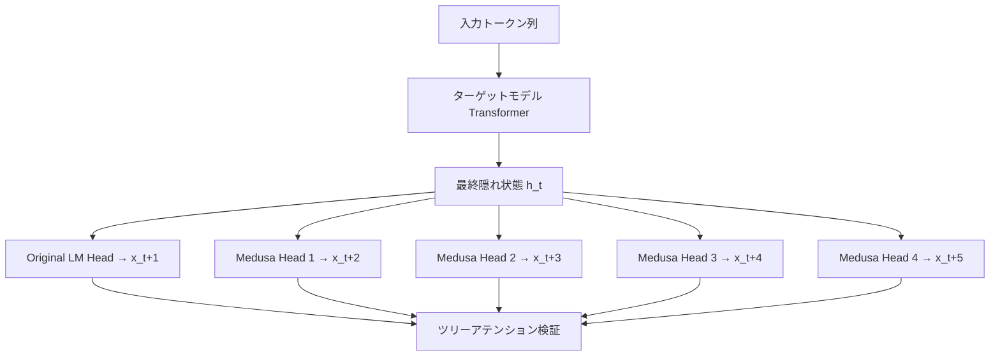

本記事は [Medusa: Simple LLM Inference Acceleration Framework with Multiple Decoding Heads](https://arxiv.org/abs/2310.07177) の解説記事です。

## 論文概要（Abstract）

Medusaは、LLMの推論高速化のために**ターゲットモデル自体に複数の予測ヘッド**を追加するフレームワークである。従来の投機的デコーディングが外部のドラフトモデルを必要とするのに対し、Medusaは追加のフィードフォワードネットワーク（Medusa Head）のみで次の複数トークンを並列予測する。著者らは、ツリーアテンション機構を用いて候補トークンの組み合わせを効率的に検証し、Medusa-1（ベースモデル凍結）で2.2倍、Medusa-2（共同ファインチューニング）で2.3〜3.6倍の高速化を報告している。出力品質を維持するロスレスな加速（Medusa-1）が可能な点が大きな特徴である。

この記事は [Zenn記事: vLLM投機的デコーディング＋Medusa Headで推論レイテンシを半減させる](https://zenn.dev/0h_n0/articles/b3d1a3bb93a18e) の深掘りです。

## 情報源

- **arXiv ID**: 2310.07177
- **URL**: [https://arxiv.org/abs/2310.07177](https://arxiv.org/abs/2310.07177)
- **著者**: Tianle Cai, Yuhong Li, Zhengyang Geng et al.
- **発表年**: 2024（初版2023年10月）
- **分野**: cs.CL, cs.LG

## 背景と動機（Background & Motivation）

LLMの自己回帰生成はメモリバウンドな処理であり、GPUの計算能力が十分に活用されていない。投機的デコーディング（Leviathan et al., 2023; Chen et al., 2023）はこの問題に対処するが、外部のドラフトモデルを管理する必要があり、以下の実用上の課題がある：

1. ドラフトモデルとターゲットモデルの語彙が一致する必要がある
2. 2つのモデル分のGPUメモリが必要（KVキャッシュも含む）
3. 分散推論環境でドラフトモデルの配置を別途設計する必要がある

Medusaは「追加ヘッドのみでドラフト生成を行う」という発想で、これらの課題を解決する。ドラフトモデルが不要なため、メモリ増加は最小限（ヘッドパラメータ分のみ）であり、既存の分散推論設定をそのまま使用できる。

## 主要な貢献（Key Contributions）

- **貢献1**: LLMの最終隠れ層に複数の並列予測ヘッドを追加し、外部ドラフトモデルなしで投機的デコーディングを実現するアーキテクチャを提案
- **貢献2**: ツリーアテンション（Tree Attention）機構により、候補トークンの直積（Cartesian product）を効率的に並列検証する手法を開発
- **貢献3**: Medusa-1（ロスレス、ベースモデル凍結）とMedusa-2（高速、共同ファインチューニング）の2つの学習方式を提案し、品質と速度のトレードオフを明確化

## 技術的詳細（Technical Details）

### Medusa Headのアーキテクチャ

Medusaは$k$個の追加ヘッド $\{H_1, H_2, \ldots, H_k\}$ をターゲットモデルの最終隠れ層の出力に接続する。各ヘッド $H_i$ は、現在の隠れ状態から$i$ステップ先のトークンを予測する。

各Medusa Headの構造は以下の通り：

$$
H_i(\mathbf{h}_t) = \text{Linear}(\text{SiLU}(\text{Linear}(\mathbf{h}_t)) + \mathbf{h}_t)
$$

ここで：
- $\mathbf{h}_t$: ターゲットモデルの第$t$ステップの最終隠れ状態ベクトル（次元: $d_{\text{model}}$）
- $\text{Linear}$: 全結合層（$d_{\text{model}} \to d_{\text{model}}$、および $d_{\text{model}} \to V$）
- $\text{SiLU}$: SiLU活性化関数（$\text{SiLU}(x) = x \cdot \sigma(x)$）
- $+ \mathbf{h}_t$: 残差接続（residual connection）
- $V$: 語彙サイズ

各ヘッドは1層のフィードフォワードネットワーク + 残差接続という非常に軽量な構造であり、パラメータ数はターゲットモデルの0.5〜1%程度に収まる。



### ツリーアテンションによる並列検証

Medusaでは、$k$個のヘッドからそれぞれ上位$s$個の候補トークンを取得し、その直積（Cartesian product）からツリー構造の候補列を構築する。例えば$k=4$、$s=3$の場合、各ヘッドから3候補ずつ取得し、$3^4 = 81$通りの候補パスが生まれる（実際には枝刈りにより削減される）。

ツリーアテンション機構では、以下のアテンションマスクを使用する：

$$
\text{Mask}_{ij} = \begin{cases}
1 & \text{if token } j \text{ is an ancestor of token } i \text{ in the tree} \\
0 & \text{otherwise}
\end{cases}
$$

このマスクにより、各候補トークンはツリー上の自身の先祖トークンにのみアテンションを向ける。これにより、バッチサイズを増やすことなく、1回のフォワードパスで全候補パスを同時に検証できる。

### 候補選択：Typical Acceptance

従来の投機的デコーディングでは、ドラフトトークンの受理判定に**重点サンプリング**（importance sampling）を用いる。Medusaは代わりに**Typical Acceptance**を提案している。

Typical Acceptanceの受理条件は以下の通り：

$$
p(x) > \min\left(\epsilon, \delta \cdot \exp(-H(p))\right)
$$

ここで：
- $p(x)$: ターゲットモデルが候補トークン$x$に割り当てる確率
- $H(p) = -\sum_x p(x) \log p(x)$: ターゲットモデルの出力分布のエントロピー
- $\epsilon$: 最小閾値（デフォルト: 0.09）
- $\delta$: エントロピー依存の閾値（デフォルト: 0.6）

エントロピーが高い（不確実性が高い）分布では閾値が低くなり、より多くの候補が受理される。逆にエントロピーが低い（確信度が高い）分布では閾値が上がり、高確率トークンのみが受理される。

**Greedy decodingの場合（temperature=0）**: Typical Acceptanceではなく、通常のargmax比較による検証が行われるため、完全にロスレスである。

### Medusa-1 vs Medusa-2

**Medusa-1**（ベースモデル凍結）:
- ターゲットモデルの重みを固定し、Medusa Headのパラメータのみを学習
- 出力分布がターゲットモデルと完全に一致（ロスレス）
- Together AIのブログ報告によると、約2倍の速度向上
- 学習コスト: 8 GPU × 数時間（A100）

**Medusa-2**（共同ファインチューニング）:
- ターゲットモデルとMedusa Headを同時にファインチューニング
- より高い受理率が得られるが、ベースモデルの出力分布が変化する
- 論文の報告によると、2.3〜3.6倍の速度向上
- ベースモデルの性能を維持するために特別な学習レシピが必要（蒸留損失の追加等）

```python
import torch
import torch.nn as nn

class MedusaHead(nn.Module):
    """Medusa Headの1つ（i番目のヘッド）

    Args:
        hidden_size: ターゲットモデルの隠れ状態の次元数
        vocab_size: 語彙サイズ
    """
    def __init__(self, hidden_size: int, vocab_size: int):
        super().__init__()
        self.linear1 = nn.Linear(hidden_size, hidden_size, bias=False)
        self.act = nn.SiLU()
        self.linear2 = nn.Linear(hidden_size, vocab_size, bias=False)

    def forward(self, hidden_states: torch.Tensor) -> torch.Tensor:
        """隠れ状態からトークンのlogitsを予測

        Args:
            hidden_states: ターゲットモデルの最終隠れ状態 (batch, seq_len, hidden_size)

        Returns:
            logits: 予測トークンのlogits (batch, seq_len, vocab_size)
        """
        residual = hidden_states
        h = self.act(self.linear1(hidden_states)) + residual  # 残差接続
        logits = self.linear2(h)
        return logits


class MedusaModel(nn.Module):
    """Medusa Head群を管理するラッパー

    Args:
        hidden_size: ターゲットモデルの隠れ状態次元
        vocab_size: 語彙サイズ
        num_heads: Medusa Headの数（何ステップ先まで予測するか）
    """
    def __init__(self, hidden_size: int, vocab_size: int, num_heads: int = 4):
        super().__init__()
        self.heads = nn.ModuleList([
            MedusaHead(hidden_size, vocab_size) for _ in range(num_heads)
        ])

    def forward(
        self, hidden_states: torch.Tensor
    ) -> list[torch.Tensor]:
        """全Medusa Headの予測を返す

        Args:
            hidden_states: (batch, seq_len, hidden_size)

        Returns:
            各ヘッドのlogitsのリスト、各要素は (batch, seq_len, vocab_size)
        """
        return [head(hidden_states) for head in self.heads]
```

## 実装のポイント（Implementation）

**ヘッド数の選択**: 論文ではヘッド数$k=4$〜5が推奨されている。ヘッド数を増やすと予測可能なステップ数が増えるが、遠い先のトークン予測は精度が低下するため、$k=6$以上では改善が頭打ちになる。

**学習データ**: Medusa-1ではSFTデータ（例: ShareGPT 90K件）を使用する。ターゲットモデルにデータを入力してFeatureを収集し、各Medusa Headを独立に学習する。

**vLLMでの使用**: vLLMではMedusa対応モデル（例: `FasterDecoding/medusa-vicuna-7b-v1.3`）を指定し、`speculative_config`で設定する。

```python
from vllm import LLM, SamplingParams

llm = LLM(
    model="FasterDecoding/medusa-vicuna-7b-v1.3",
    speculative_config={
        "method": "medusa",
        "num_speculative_tokens": 5,
    },
    gpu_memory_utilization=0.90,
)
```

**Medusa対応モデルの入手**: Hugging Face上に公開されているMedusa対応モデルは限られている。独自モデルにMedusa Headを適用するには、[FasterDecoding/Medusa](https://github.com/FasterDecoding/Medusa)リポジトリの学習スクリプトを使用する必要がある。

**ツリーサイズの調整**: ツリーの最大深さと幅はメモリとレイテンシのトレードオフを決める。デフォルトでは深さ4、幅63（63ノード）が使用される。

**Top-k予測の影響**: 各ヘッドから取得する候補数$s$を増やすとツリーが大きくなり、受理確率は上がるが検証コストも増大する。$s=3$がバランスの取れた設定として推奨されている。

## Production Deployment Guide

### AWS実装パターン（コスト最適化重視）

Medusa方式では追加のドラフトモデルが不要なため、GPUメモリの増加が小さく、同一インスタンスサイズで投機的デコーディングを有効化できるメリットがある。

| 規模 | 月間リクエスト | 推奨構成 | 月額コスト | 主要サービス |
|------|--------------|---------|-----------|------------|
| **Small** | ~3,000 (100/日) | Serverless | $50-150 | Lambda + Bedrock + DynamoDB |
| **Medium** | ~30,000 (1,000/日) | Hybrid | $300-800 | Lambda + ECS Fargate + ElastiCache |
| **Large** | 300,000+ (10,000/日) | Container | $2,000-5,000 | EKS + Karpenter + EC2 Spot |

**Medium構成の詳細** (月額$300-800):
- **ECS Fargate**: vLLM + Medusa Headモデル、g5.xlarge相当 ($400/月)
- **ElastiCache Redis**: キャッシュ、cache.t3.micro ($15/月)
- **ALB**: ヘルスチェック + ルーティング ($20/月)
- **CloudWatch**: 基本監視 ($10/月)

Medusa方式はドラフトモデル分のGPUメモリが不要なため、同じg5.xlargeインスタンスでもドラフトモデル方式よりも大きなバッチサイズを確保でき、スループットが向上する。

**コスト試算の注意事項**: 上記は2026年3月時点のAWS ap-northeast-1（東京）リージョン料金に基づく概算値です。実際のコストはトラフィックパターンにより変動します。最新料金は [AWS料金計算ツール](https://calculator.aws/) で確認してください。

### Terraformインフラコード

**Small構成 (Serverless)**

```hcl
module "vpc" {
  source  = "terraform-aws-modules/vpc/aws"
  version = "~> 5.0"

  name = "medusa-inference-vpc"
  cidr = "10.0.0.0/16"
  azs  = ["ap-northeast-1a", "ap-northeast-1c"]
  private_subnets = ["10.0.1.0/24", "10.0.2.0/24"]
  enable_nat_gateway   = false
  enable_dns_hostnames = true
}

resource "aws_iam_role" "lambda_role" {
  name = "medusa-lambda-role"
  assume_role_policy = jsonencode({
    Version = "2012-10-17"
    Statement = [{
      Action    = "sts:AssumeRole"
      Effect    = "Allow"
      Principal = { Service = "lambda.amazonaws.com" }
    }]
  })
}

resource "aws_lambda_function" "medusa_handler" {
  filename      = "lambda.zip"
  function_name = "medusa-inference-handler"
  role          = aws_iam_role.lambda_role.arn
  handler       = "index.handler"
  runtime       = "python3.12"
  timeout       = 60
  memory_size   = 1024

  environment {
    variables = {
      BEDROCK_MODEL_ID = "anthropic.claude-3-5-haiku-20241022-v1:0"
      DYNAMODB_TABLE   = aws_dynamodb_table.cache.name
    }
  }
}

resource "aws_dynamodb_table" "cache" {
  name         = "medusa-prompt-cache"
  billing_mode = "PAY_PER_REQUEST"
  hash_key     = "prompt_hash"
  attribute {
    name = "prompt_hash"
    type = "S"
  }
  ttl {
    attribute_name = "expire_at"
    enabled        = true
  }
}
```

**Large構成 (Container): EKS + Spot**

```hcl
module "eks" {
  source  = "terraform-aws-modules/eks/aws"
  version = "~> 20.0"

  cluster_name    = "medusa-inference-cluster"
  cluster_version = "1.31"
  vpc_id          = module.vpc.vpc_id
  subnet_ids      = module.vpc.private_subnets
  cluster_endpoint_public_access = true
  enable_cluster_creator_admin_permissions = true
}

resource "kubectl_manifest" "karpenter_nodepool" {
  yaml_body = <<-YAML
    apiVersion: karpenter.sh/v1
    kind: NodePool
    metadata:
      name: gpu-spot-medusa
    spec:
      template:
        spec:
          requirements:
            - key: karpenter.sh/capacity-type
              operator: In
              values: ["spot"]
            - key: node.kubernetes.io/instance-type
              operator: In
              values: ["g5.xlarge", "g5.2xlarge"]
          limits:
            cpu: "32"
            memory: "128Gi"
      disruption:
        consolidationPolicy: WhenEmpty
        consolidateAfter: 30s
  YAML
}
```

### セキュリティベストプラクティス

- **IAMロール**: 最小権限の原則、Bedrock/DynamoDB操作のみ許可
- **ネットワーク**: プライベートサブネット配置、VPC Endpoint活用
- **シークレット**: Secrets Manager使用、ハードコード禁止
- **暗号化**: KMS暗号化必須（S3/DynamoDB/EBS）
- **監査**: CloudTrail/GuardDuty有効化

### 運用・監視設定

```python
import boto3

cloudwatch = boto3.client('cloudwatch')

cloudwatch.put_metric_alarm(
    AlarmName='medusa-inference-latency',
    ComparisonOperator='GreaterThanThreshold',
    EvaluationPeriods=2,
    MetricName='Duration',
    Namespace='AWS/Lambda',
    Period=300,
    Statistic='Average',
    Threshold=30000,
    AlarmDescription='Medusa推論レイテンシ異常'
)
```

### コスト最適化チェックリスト

- [ ] ~100 req/日 → Lambda + Bedrock - $50-150/月
- [ ] ~1000 req/日 → ECS Fargate + vLLM + Medusa - $300-800/月
- [ ] 10000+ req/日 → EKS + Spot - $2,000-5,000/月
- [ ] Spot Instances: 最大90%削減
- [ ] Reserved Instances: 1年72%削減
- [ ] Prompt Caching有効化: 30-90%削減
- [ ] Bedrock Batch API: 50%割引
- [ ] AWS Budgets: 月額予算80%で警告
- [ ] CloudWatch: レイテンシ・コストスパイク監視
- [ ] Cost Anomaly Detection: 自動異常検知
- [ ] タグ戦略: 環境別コスト可視化
- [ ] アイドルタイムのスケールダウン

## 実験結果（Results）

著者らはVicuna-7B、13B、33Bの各モデルでMT-benchデータセットを用いて評価している。

| モデル | Medusa-1速度向上 | Medusa-2速度向上 | ヘッド数 |
|--------|-----------------|-----------------|---------|
| Vicuna-7B | 2.18x | 2.83x | 4 |
| Vicuna-13B | 2.22x | 2.54x | 4 |
| Vicuna-33B | 2.31x | 3.60x | 4 |

**分析**: 論文Table 1より、Medusa-1でもモデルサイズに関わらず2倍以上の高速化が得られている。Medusa-2はさらに高い速度向上を示すが、特にVicuna-33Bで3.6倍と顕著である。著者らはこれをモデルサイズが大きいほどフォワードパスのコストが高く、追加ヘッドの相対コストが小さくなるためと説明している。

**Medusa Headの予測精度**: Together AIのブログ報告によると、各ヘッドのTop-1精度は約60%、Top-5精度は80%以上である。1番目のヘッド（1ステップ先予測）が最も精度が高く、遠い先のヘッドほど精度が低下する。

**受理率の推移**: 論文Figure 3より、ステップ位置が遠いほど受理率が低下する。ヘッド1（2番目のトークン予測）は約70%の受理率だが、ヘッド4（5番目のトークン予測）は約30%程度まで低下する。

## 実運用への応用（Practical Applications）

**メモリ制約のある環境**: Medusaはドラフトモデルが不要なため、単一GPU（例: A100 80GB）でもターゲットモデルとMedusa Headの両方を動作させられる。EAGLEやドラフトモデル方式では2モデル分のKVキャッシュが必要になるケースがあり、その点でMedusaは有利である。

**既存インフラの最小変更での導入**: Medusa対応モデルさえ用意すれば、vLLMの設定変更のみで導入可能。分散推論のトポロジを変更する必要がない。

**制約**: Medusa Headのファインチューニングが必要であり、対象モデルごとにヘッドを学習する必要がある。公開されているMedusa対応モデルは限られており（Vicuna系列が中心）、LLaMA 3やMistral等の新しいモデルに適用するには自前で学習パイプラインを構築する必要がある。

## 関連研究（Related Work）

- **Speculative Decoding** (Leviathan et al., 2023; Chen et al., 2023): 外部ドラフトモデルを用いる元祖手法。Medusaは追加ヘッドで代替することで、ドラフトモデル管理の課題を解決
- **EAGLE** (Li et al., 2024): Featureレベルのドラフト予測で3.0〜3.5倍の高速化を実現。Medusaより高速だが、ドラフトヘッドの学習コストが大きい
- **Hydra** (2024): Medusaのヘッド間に逐次依存性を導入し、ヘッド精度を向上させる拡張。Medusaのヘッドが独立なのに対し、Hydraは前のヘッドの出力を次のヘッドの入力として使用
- **Lookahead Decoding** (Fu et al., 2024): N-gramベースの投機的デコーディング。学習不要だが速度向上率はMedusaより低い

## まとめと今後の展望

Medusaは、外部ドラフトモデルを不要とし、軽量な追加ヘッドのみでLLM推論を2.2〜3.6倍高速化するフレームワークである。Medusa-1はベースモデルを凍結したロスレスな加速を提供し、Medusa-2は共同ファインチューニングによりさらなる高速化を実現する。メモリ効率の高さが大きな利点であり、単一GPUでの導入や既存インフラへの最小変更での統合が可能である。一方、EAGLE系手法と比較すると速度向上率は控えめであり、Medusa対応モデルの事前学習が必要な点が制約となる。今後はヘッド間の依存性モデリング（Hydra）やEAGLEとの手法統合が研究の方向性として注目されている。

## 参考文献

- **arXiv**: [https://arxiv.org/abs/2310.07177](https://arxiv.org/abs/2310.07177)
- **Code**: [https://github.com/FasterDecoding/Medusa](https://github.com/FasterDecoding/Medusa)（Apache 2.0）
- **Together AI Blog**: [https://www.together.ai/blog/medusa](https://www.together.ai/blog/medusa)
- **Related Zenn article**: [https://zenn.dev/0h_n0/articles/b3d1a3bb93a18e](https://zenn.dev/0h_n0/articles/b3d1a3bb93a18e)
- **EAGLE**: [https://arxiv.org/abs/2401.10774](https://arxiv.org/abs/2401.10774)
- **Hydra**: [https://arxiv.org/abs/2406.19930](https://arxiv.org/abs/2406.19930)
