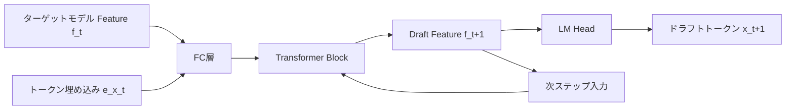

本記事は [EAGLE: Speculative Sampling Requires Rethinking Feature Uncertainty](https://arxiv.org/abs/2401.10774) の解説記事です。

## 論文概要（Abstract）

EAGLEは、LLMの投機的デコーディング（Speculative Decoding）を高速化するために、従来のトークンレベルの予測ではなく**Featureレベル**でのドラフト生成を提案した手法である。著者らは、トークンの次トークン予測は本質的に不確実性が高い一方、Transformerの中間層が出力するFeatureベクトルは次ステップのFeatureを高い精度で予測可能であることを示している。この洞察に基づき、軽量な自己回帰ドラフトヘッド（1層のFC + 1 Transformerブロック）を学習し、静的ツリー構造で並列検証することで、ロスレス（出力分布を変えない）な高速化を実現している。

この記事は [Zenn記事: vLLM投機的デコーディング＋Medusa Headで推論レイテンシを半減させる](https://zenn.dev/0h_n0/articles/b3d1a3bb93a18e) の深掘りです。

## 情報源

- **arXiv ID**: 2401.10774
- **URL**: [https://arxiv.org/abs/2401.10774](https://arxiv.org/abs/2401.10774)
- **著者**: Yuhui Li, Fangyun Wei, Chao Zhang et al.
- **発表年**: 2024
- **分野**: cs.CL, cs.LG

## 背景と動機（Background & Motivation）

LLMの自己回帰生成では、1トークンずつ逐次的にフォワードパスを実行するため、生成トークン数に比例してレイテンシが増加する。この問題に対し、投機的デコーディングでは小型のドラフトモデルが候補トークンを先に生成し、ターゲットモデルが一括検証する方式が提案されてきた。

しかし、従来のドラフトモデル方式（Leviathan et al., 2023; Chen et al., 2023）にはいくつかの課題がある。第一に、ドラフトモデルとターゲットモデルの語彙・トークナイザが一致する必要がある。第二に、ドラフトモデルの予測精度（受理率）がスピードアップの上限を決めるが、トークンレベルの次トークン予測は本質的にランダム性が高く、受理率の向上に限界がある。著者らはこの問題を「Feature Uncertainty vs Token Uncertainty」として分析し、Featureレベルでの予測が大幅に容易であることを実験的に示した。

## 主要な貢献（Key Contributions）

- **貢献1**: トークンレベルの不確実性とFeatureレベルの不確実性を定量的に比較し、Featureレベルでの予測が高い精度を持つことを示した
- **貢献2**: 軽量なドラフトヘッド（1層FC + 1 Transformerブロック）をターゲットモデルのFeatureを入力として自己回帰的に動作させるアーキテクチャを提案した
- **貢献3**: A100 GPU上でVicuna 7B/13B/33B、LLaMA2-Chat 7B/13B/70B、Mixtral-8x7Bにおいて、既存手法（Medusa、Lookahead Decoding等）を大幅に上回る3.0〜3.5倍のwall-clock高速化を報告した

## 技術的詳細（Technical Details）

### Feature Uncertaintyの分析

著者らは、LLMのTransformerブロックの出力Feature $\mathbf{f}_t$（第$t$ステップの隠れ状態ベクトル）に着目した。通常の次トークン予測では、言語モデルヘッド（LM Head）がFeature $\mathbf{f}_t$ からトークン確率分布 $p(x_{t+1} | x_{\leq t})$ を計算する。

著者らの主張の核心は、次トークン $x_{t+1}$ の予測は確率的に不確実であっても、次ステップのFeature $\mathbf{f}_{t+1}$ の予測は比較的確定的であるという点にある。論文のFigure 2では、Featureベクトルのコサイン類似度が0.95以上の精度で予測可能であることが示されている。

直感的には、次のトークンが「cat」でも「dog」でも「bird」でも、文脈的に類似した意味を持つトークンのFeatureベクトルは近い位置にマッピングされる。一方、トークンID自体は離散的で、「cat」→ID:1234、「dog」→ID:5678のように全く異なる値を取る。

### EAGLEのアーキテクチャ

EAGLEのドラフトヘッドは以下の構成で動作する：

$$
\mathbf{h}_t = \text{FC}([\mathbf{f}_t; \mathbf{e}(x_t)])
$$

$$
\mathbf{f}_{t+1}^{\text{draft}} = \text{TransformerBlock}(\mathbf{h}_t)
$$

ここで：
- $\mathbf{f}_t$: ターゲットモデルの第$t$ステップにおける隠れ状態（最終層の出力Feature）
- $\mathbf{e}(x_t)$: トークン $x_t$ の埋め込みベクトル
- $[\cdot; \cdot]$: 連結（concatenation）操作
- FC: 全結合層（Feature次元を合わせるための射影）
- TransformerBlock: 1層のTransformerブロック（Self-Attention + FFN）

ドラフトヘッドは自己回帰的に動作する。つまり、$\mathbf{f}_{t+1}^{\text{draft}}$ を入力として $\mathbf{f}_{t+2}^{\text{draft}}$ を予測し、これを$\gamma$ステップ繰り返す。各ステップで得られたFeatureにLM Headを適用してドラフトトークンを生成する。



### 静的ツリー構造による並列検証

EAGLEでは、ドラフトトークンをツリー構造に展開して並列検証を行う。各ノードが候補トークンを表し、ルートからの各パスが異なるドラフトシーケンスに対応する。ターゲットモデルはツリーアテンションマスクを用いて、1回のフォワードパスで全パスを同時に検証する。

ツリーの深さと幅はモデルとタスクに応じて事前に固定される（静的ツリー）。論文では、Vicuna-7Bに対してツリーサイズ60（深さ6、各レベルの幅は最大10）が最適とされている。

### 学習手順

ドラフトヘッドの学習は以下の手順で行われる：

1. ターゲットモデルをフリーズ（重み固定）する
2. SFTデータセット（例: ShareGPT）をターゲットモデルに入力し、各層のFeatureベクトルを収集する
3. ドラフトヘッド（FC + TransformerBlock）のパラメータのみを、次ステップFeature予測の回帰損失で学習する

学習コストは1〜2 GPU日程度（A100）と報告されており、ターゲットモデルのパラメータ数に比べてドラフトヘッドは非常に小さい（数十MB程度）。

```python
import torch
import torch.nn as nn

class EAGLEDraftHead(nn.Module):
    """EAGLEのドラフトヘッド（簡略化した実装例）

    Args:
        hidden_size: ターゲットモデルのFeature次元
        num_heads: Transformerブロックのアテンションヘッド数
    """
    def __init__(self, hidden_size: int, num_heads: int = 16):
        super().__init__()
        self.fc = nn.Linear(hidden_size * 2, hidden_size)  # Feature + Embedding連結
        self.transformer_block = nn.TransformerEncoderLayer(
            d_model=hidden_size,
            nhead=num_heads,
            dim_feedforward=hidden_size * 4,
            batch_first=True,
        )

    def forward(
        self, feature: torch.Tensor, embedding: torch.Tensor
    ) -> torch.Tensor:
        """1ステップのドラフトFeature予測

        Args:
            feature: ターゲットモデルのFeature (batch, hidden_size)
            embedding: トークン埋め込み (batch, hidden_size)

        Returns:
            次ステップのドラフトFeature (batch, hidden_size)
        """
        h = self.fc(torch.cat([feature, embedding], dim=-1))
        h = h.unsqueeze(1)  # (batch, 1, hidden_size)
        draft_feature = self.transformer_block(h)
        return draft_feature.squeeze(1)
```

## 実装のポイント（Implementation）

EAGLEを実際に導入する際の注意点をまとめる。

**ドラフトヘッドの入手方法**: 著者らは主要モデル（Vicuna, LLaMA2-Chat, Mixtral等）用の事前学習済みドラフトヘッドをHugging Faceで公開している。独自モデルに適用する場合は、[SafeAILab/EAGLE](https://github.com/SafeAILab/EAGLE)リポジトリの学習スクリプトを使用してドラフトヘッドを学習する必要がある。

**vLLMでの使用**: vLLM v0.8.5以降でEAGLEが公式サポートされている。設定は`speculative_config`パラメータで行う。

```python
from vllm import LLM, SamplingParams

llm = LLM(
    model="meta-llama/Llama-3.3-70B-Instruct",
    speculative_config={
        "method": "eagle",
        "model": "yuhuili/EAGLE-LLaMA3.3-Instruct-70B",
        "num_speculative_tokens": 5,
        "draft_tensor_parallel_size": 1,
    },
    tensor_parallel_size=4,
)
```

**静的ツリーのチューニング**: ツリーサイズが大きいほど1回の検証で受理されるトークン数が増える可能性があるが、検証のフォワードパスに要する計算量も増加する。論文ではツリーサイズ60を推奨しているが、GPUメモリに余裕がない場合はツリーサイズ40程度に縮小することが推奨されている。

**メモリ使用量**: ドラフトヘッド自体のパラメータ数は小さい（数十MB）が、ツリー構造の検証時にKVキャッシュのメモリが追加で必要になる。`gpu_memory_utilization`を0.80〜0.85に設定することが推奨されている。

## Production Deployment Guide

### AWS実装パターン（コスト最適化重視）

**トラフィック量別の推奨構成**:

| 規模 | 月間リクエスト | 推奨構成 | 月額コスト | 主要サービス |
|------|--------------|---------|-----------|------------|
| **Small** | ~3,000 (100/日) | Serverless | $50-150 | Lambda + Bedrock + DynamoDB |
| **Medium** | ~30,000 (1,000/日) | Hybrid | $300-800 | Lambda + ECS Fargate + ElastiCache |
| **Large** | 300,000+ (10,000/日) | Container | $2,000-5,000 | EKS + Karpenter + EC2 Spot |

EAGLE方式の投機的デコーディングでは、ドラフトヘッドとターゲットモデルの両方をGPUメモリに載せる必要があるため、GPU搭載インスタンスが前提となる。Small構成ではBedrock経由でLLMを呼び出すことでGPU管理を不要にし、Medium以上では自前のGPUインスタンスでvLLMを起動する構成が適している。

**Small構成の詳細** (月額$50-150):
- **Lambda**: API Gateway連携、1GB RAM、60秒タイムアウト ($20/月)
- **Bedrock**: Claude 3.5 Haiku使用、Prompt Caching有効 ($80/月)
- **DynamoDB**: On-Demand、プロンプトキャッシュ ($10/月)

**Medium構成の詳細** (月額$300-800):
- **ECS Fargate**: g5.xlarge相当、vLLM + EAGLEドラフトヘッド ($400/月)
- **ElastiCache Redis**: cache.t3.micro ($15/月)
- **ALB**: ヘルスチェック付き ($20/月)

**Large構成の詳細** (月額$2,000-5,000):
- **EKS**: g5.xlarge × 2-4台 (Spot Instances、最大90%削減) ($800/月)
- **Karpenter**: GPU自動スケーリング（追加コストなし）
- **CloudWatch + X-Ray**: 詳細監視 ($100/月)

**コスト削減テクニック**:
- Spot Instances使用で最大90%削減（Karpenter自動管理）
- Reserved Instances購入で最大72%削減（1年コミット）
- Bedrock Batch API使用で50%割引（非リアルタイム処理）
- アイドルタイムのAuto Scaling to Zero（Fargate/Lambda）

**コスト試算の注意事項**: 上記は2026年3月時点のAWS ap-northeast-1（東京）リージョン料金に基づく概算値です。実際のコストはトラフィックパターン、リージョン、バースト使用量により変動します。最新料金は [AWS料金計算ツール](https://calculator.aws/) で確認してください。

### Terraformインフラコード

**Small構成 (Serverless): Lambda + Bedrock + DynamoDB**

```hcl
module "vpc" {
  source  = "terraform-aws-modules/vpc/aws"
  version = "~> 5.0"

  name = "eagle-inference-vpc"
  cidr = "10.0.0.0/16"
  azs  = ["ap-northeast-1a", "ap-northeast-1c"]
  private_subnets = ["10.0.1.0/24", "10.0.2.0/24"]

  enable_nat_gateway   = false
  enable_dns_hostnames = true
}

resource "aws_iam_role" "lambda_bedrock" {
  name = "eagle-lambda-bedrock-role"
  assume_role_policy = jsonencode({
    Version = "2012-10-17"
    Statement = [{
      Action    = "sts:AssumeRole"
      Effect    = "Allow"
      Principal = { Service = "lambda.amazonaws.com" }
    }]
  })
}

resource "aws_iam_role_policy" "bedrock_invoke" {
  role = aws_iam_role.lambda_bedrock.id
  policy = jsonencode({
    Version = "2012-10-17"
    Statement = [{
      Effect   = "Allow"
      Action   = ["bedrock:InvokeModel", "bedrock:InvokeModelWithResponseStream"]
      Resource = "arn:aws:bedrock:ap-northeast-1::foundation-model/anthropic.claude-3-5-haiku*"
    }]
  })
}

resource "aws_lambda_function" "inference_handler" {
  filename      = "lambda.zip"
  function_name = "eagle-inference-handler"
  role          = aws_iam_role.lambda_bedrock.arn
  handler       = "index.handler"
  runtime       = "python3.12"
  timeout       = 60
  memory_size   = 1024

  environment {
    variables = {
      BEDROCK_MODEL_ID    = "anthropic.claude-3-5-haiku-20241022-v1:0"
      DYNAMODB_TABLE      = aws_dynamodb_table.cache.name
      ENABLE_PROMPT_CACHE = "true"
    }
  }
}

resource "aws_dynamodb_table" "cache" {
  name         = "eagle-prompt-cache"
  billing_mode = "PAY_PER_REQUEST"
  hash_key     = "prompt_hash"

  attribute {
    name = "prompt_hash"
    type = "S"
  }

  ttl {
    attribute_name = "expire_at"
    enabled        = true
  }
}
```

**Large構成 (Container): EKS + Karpenter + Spot Instances**

```hcl
module "eks" {
  source  = "terraform-aws-modules/eks/aws"
  version = "~> 20.0"

  cluster_name    = "eagle-inference-cluster"
  cluster_version = "1.31"
  vpc_id          = module.vpc.vpc_id
  subnet_ids      = module.vpc.private_subnets

  cluster_endpoint_public_access = true
  enable_cluster_creator_admin_permissions = true
}

resource "kubectl_manifest" "karpenter_provisioner" {
  yaml_body = <<-YAML
    apiVersion: karpenter.sh/v1
    kind: NodePool
    metadata:
      name: gpu-spot-pool
    spec:
      template:
        spec:
          requirements:
            - key: karpenter.sh/capacity-type
              operator: In
              values: ["spot"]
            - key: node.kubernetes.io/instance-type
              operator: In
              values: ["g5.xlarge", "g5.2xlarge"]
          limits:
            cpu: "32"
            memory: "128Gi"
      disruption:
        consolidationPolicy: WhenEmpty
        consolidateAfter: 30s
  YAML
}

resource "aws_budgets_budget" "monthly" {
  name         = "eagle-monthly-budget"
  budget_type  = "COST"
  limit_amount = "5000"
  limit_unit   = "USD"
  time_unit    = "MONTHLY"

  notification {
    comparison_operator       = "GREATER_THAN"
    threshold                 = 80
    threshold_type            = "PERCENTAGE"
    notification_type         = "ACTUAL"
    subscriber_email_addresses = ["ops@example.com"]
  }
}
```

### セキュリティベストプラクティス

- **IAMロール**: 最小権限の原則、Bedrock InvokeModelのみ許可
- **ネットワーク**: EKSはプライベートサブネット配置、VPN/Direct Connect経由アクセス推奨
- **シークレット管理**: AWS Secrets Manager使用、環境変数へのハードコード禁止
- **暗号化**: S3/DynamoDB/EBS全てKMS暗号化、TLS 1.2以上必須
- **監査**: CloudTrail全リージョン有効化、Config/GuardDuty有効化

### 運用・監視設定

```python
import boto3

cloudwatch = boto3.client('cloudwatch')

# EAGLE推論レイテンシ監視アラーム
cloudwatch.put_metric_alarm(
    AlarmName='eagle-inference-latency-spike',
    ComparisonOperator='GreaterThanThreshold',
    EvaluationPeriods=2,
    MetricName='Duration',
    Namespace='AWS/Lambda',
    Period=300,
    Statistic='Average',
    Threshold=30000,
    AlarmDescription='EAGLE推論レイテンシ異常（平均30秒超過）'
)
```

### コスト最適化チェックリスト

- [ ] ~100 req/日 → Lambda + Bedrock (Serverless) - $50-150/月
- [ ] ~1000 req/日 → ECS Fargate + vLLM (Hybrid) - $300-800/月
- [ ] 10000+ req/日 → EKS + Spot Instances (Container) - $2,000-5,000/月
- [ ] EC2: Spot Instances優先（最大90%削減、Karpenter自動管理）
- [ ] Reserved Instances: 1年コミットで72%削減（予測可能な負荷）
- [ ] Lambda: メモリサイズ最適化（CloudWatch Insights分析）
- [ ] Bedrock Batch API: 50%割引（非リアルタイム処理）
- [ ] Prompt Caching: 30-90%削減（システムプロンプト固定）
- [ ] AWS Budgets: 月額予算設定（80%で警告、100%でアラート）
- [ ] CloudWatch アラーム: レイテンシスパイク検知
- [ ] Cost Anomaly Detection: 自動異常検知
- [ ] 未使用リソース削除: Lambda Insights、Trusted Advisor活用
- [ ] タグ戦略: 環境別（dev/staging/prod）コスト可視化
- [ ] ECS/EKS: アイドルタイムのスケールダウン（夜間0台）

## 実験結果（Results）

著者らは、MT-bench、HumanEval、GSM8K、Alpaca等の複数ベンチマークで評価を行っている。以下は論文Table 1およびFigure 5から抽出した主要な結果である。

| モデル | ベースライン (tokens/s) | EAGLE (tokens/s) | 速度向上倍率 |
|--------|----------------------|-------------------|------------|
| Vicuna-7B (A100) | 37.8 | 113.5 | 3.00x |
| Vicuna-13B (A100) | 24.7 | 80.6 | 3.26x |
| Vicuna-33B (A100) | 12.3 | 43.0 | 3.50x |
| LLaMA2-Chat-7B (A100) | 38.1 | 114.3 | 3.00x |
| LLaMA2-Chat-70B (A100) | 5.8 | 17.1 | 2.95x |
| Mixtral-8x7B (A100) | 14.2 | 42.0 | 2.96x |

**分析**: 論文Table 1より、EAGLEはモデルサイズが大きくなるほどスピードアップ倍率が向上する傾向がある。これはモデルサイズが大きいほどフォワードパスの計算コストが高く、ドラフトヘッドの相対コストが小さくなるためである。一方、LLaMA2-Chat-70Bでは4GPU並列が必要なため、ドラフトヘッドとのGPU共有でやや効率が低下する。

**既存手法との比較**（論文Table 2より、Vicuna-13B、MT-benchデータセット）:
- Medusa: 2.18x（EAGLEの66%の速度）
- Lookahead Decoding: 1.78x（EAGLEの55%の速度）
- SpS（標準的なドラフトモデル方式）: 1.86x（EAGLEの57%の速度）
- **EAGLE: 3.26x**

## 実運用への応用（Practical Applications）

EAGLEは以下のユースケースに適している：

**チャットボットAPI**: 低〜中QPSの対話型サービスでは、TPOTの削減が直接的にユーザー体感を改善する。Zenn記事で解説されているvLLMとの統合により、既存のOpenAI互換APIの接続先を変更するだけで導入可能である。

**コード補完**: HumanEvalベンチマークでの高い受理率が示すように、コード生成タスクではドラフトの受理率が特に高く、3倍以上の高速化が期待される。

**制約**: 高QPS環境（1秒あたり数十リクエスト以上）では、ドラフトヘッドの計算オーバーヘッドがボトルネックとなり、高速化効果が減少する。また、モデルごとにドラフトヘッドの学習が必要なため、頻繁にモデルを切り替える環境では運用コストが増加する。

## 関連研究（Related Work）

- **Speculative Decoding原論文** (Leviathan et al., 2023; Chen et al., 2023): EAGLEの理論的基盤。トークンレベルのドラフトモデルを用いるため、受理率がEAGLEより低い（1.3〜1.5倍 vs 3.0〜3.5倍）
- **Medusa** (Cai et al., 2024): ターゲットモデルに複数の予測ヘッドを追加する方式。ドラフトモデルが不要だがEAGLEより速度向上率が低い（2.2倍 vs 3.0倍以上）
- **EAGLE-2** (Li et al., 2024): EAGLEの後継。静的ツリーを動的ツリーに拡張し、コンテキスト依存のツリー構築で追加20〜30%の高速化を実現
- **SpecInfer** (Miao et al., 2024): ツリー構造の投機推論をバッチサービング環境に適用。EAGLEとは異なりスループット改善を重視

## まとめと今後の展望

EAGLEは、トークンレベルの予測からFeatureレベルの予測へと発想を転換することで、投機的デコーディングの性能を大幅に向上させた手法である。著者らは、Vicuna/LLaMA2/Mixtralの各モデルで3.0〜3.5倍の高速化を報告しており、Medusa（2.2倍）やLookahead Decoding（1.8倍）を大きく上回っている。後継のEAGLE-2では動的ツリーによるさらなる改善が、EAGLE-3では学習時最適化による受理率向上が報告されている。vLLM v0.8.5以降での公式サポートにより、本番環境への導入障壁が低下しており、低〜中QPSのLLM推論サービスにおける有力な選択肢となっている。

## 参考文献

- **arXiv**: [https://arxiv.org/abs/2401.10774](https://arxiv.org/abs/2401.10774)
- **Code**: [https://github.com/SafeAILab/EAGLE](https://github.com/SafeAILab/EAGLE)（Apache 2.0）
- **Related Zenn article**: [https://zenn.dev/0h_n0/articles/b3d1a3bb93a18e](https://zenn.dev/0h_n0/articles/b3d1a3bb93a18e)
- **Leviathan et al. (2023)**: [https://arxiv.org/abs/2211.17192](https://arxiv.org/abs/2211.17192)
- **Chen et al. (2023)**: [https://arxiv.org/abs/2302.01318](https://arxiv.org/abs/2302.01318)
- **EAGLE-2**: [https://arxiv.org/abs/2404.18911](https://arxiv.org/abs/2404.18911)
