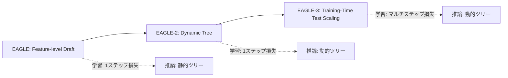

本記事は [EAGLE-3: Scaling up Inference Acceleration of LLMs via Training-Time Test Scaling](https://arxiv.org/abs/2501.05370) の解説記事です。

## 論文概要（Abstract）

EAGLE-3は、投機的デコーディングにおけるドラフトモデルの学習方法を根本的に見直した手法である。先行研究のEAGLE/EAGLE-2が推論時のツリー構造やアルゴリズムの改善に注力していたのに対し、EAGLE-3は**学習時にマルチステップ受理率を直接最適化**する「Training-Time Test Scaling」を導入した。著者らは、従来の1ステップ予測損失では多段階のドラフト生成性能を十分に最適化できないことを示し、学習損失にマルチステップアクセプタンスの期待値を組み込むことで、EAGLE-2比でさらに15〜25%の追加高速化を報告している。

この記事は [Zenn記事: vLLM投機的デコーディング＋Medusa Headで推論レイテンシを半減させる](https://zenn.dev/0h_n0/articles/b3d1a3bb93a18e) の深掘りです。

## 情報源

- **arXiv ID**: 2501.05370
- **URL**: [https://arxiv.org/abs/2501.05370](https://arxiv.org/abs/2501.05370)
- **著者**: Yuhui Li, Fangyun Wei, Chao Zhang et al.
- **発表年**: 2025
- **分野**: cs.CL, cs.LG

## 背景と動機（Background & Motivation）

EAGLEシリーズはFeatureレベルのドラフト予測で投機的デコーディングの性能を大幅に改善してきた。EAGLE（2024）はFeature Uncertaintyの洞察に基づく軽量ドラフトヘッドを提案し、EAGLE-2（2024）は静的ツリーを動的ツリーに拡張して追加高速化を実現した。

しかし、これらの改善はすべて**推論時**のアルゴリズム改善であり、ドラフトヘッドの**学習方法**自体は見直されていなかった。具体的には、EAGLEのドラフトヘッドは「1ステップ先のFeature予測」の回帰損失で学習されるが、実際の投機的デコーディングでは多段階（例: 5ステップ先まで）のドラフト生成が必要である。1ステップの予測精度が高くても、自己回帰的に多段階適用した際のエラー蓄積により、受理率が低下する可能性がある。

EAGLE-3はこの問題を「学習時テストスケーリング」として定式化し、学習損失にマルチステップの受理率を直接組み込むことで解決する。

## 主要な貢献（Key Contributions）

- **貢献1**: 1ステップ予測損失の限界を分析し、マルチステップ受理率を学習目的に組み込む「Training-Time Test Scaling」フレームワークを提案
- **貢献2**: マルチステップ損失の効率的な計算方法を開発し、学習コストの増大を抑制（EAGLE比で2〜3倍程度の学習コスト）
- **貢献3**: Llama-3シリーズ、Qwen2.5等の最新モデルで評価し、EAGLE-2比で15〜25%の追加高速化を報告。一部タスク（コード生成等）では最大6倍超の高速化を実現

## 技術的詳細（Technical Details）

### Training-Time Test Scalingの定式化

従来のEAGLEの学習損失は、1ステップ先のFeature予測に対するMSE（Mean Squared Error）損失である：

$$
\mathcal{L}_{\text{EAGLE}} = \frac{1}{T} \sum_{t=1}^{T} \|\mathbf{f}_{t+1}^{\text{draft}} - \mathbf{f}_{t+1}^{\text{target}}\|_2^2
$$

ここで $\mathbf{f}_{t+1}^{\text{draft}}$ はドラフトヘッドが予測したFeature、$\mathbf{f}_{t+1}^{\text{target}}$ はターゲットモデルが出力した真のFeatureである。

EAGLE-3では、この損失をマルチステップに拡張する。$\gamma$ステップ先までのドラフト生成を考慮した損失は以下の形で定式化される：

$$
\mathcal{L}_{\text{EAGLE-3}} = -\frac{1}{T} \sum_{t=1}^{T} \mathbb{E}\left[\sum_{k=1}^{\gamma} \mathbb{1}[\text{accept}(x_{t+k}^{\text{draft}})]\right]
$$

ここで：
- $\gamma$: ドラフトの最大ステップ数
- $x_{t+k}^{\text{draft}}$: ドラフトヘッドが$k$ステップ先に予測したトークン
- $\text{accept}(x)$: ターゲットモデルがトークン$x$を受理するかどうかの判定関数
- $\mathbb{E}[\cdot]$: 期待値

直感的には、この損失は「ドラフトヘッドが生成する多段階のトークン列のうち、ターゲットモデルに受理されるトークン数の期待値」を最大化する。

### マルチステップ損失の近似計算

上記の損失は離散的な受理判定を含むため、直接的な勾配計算ができない。著者らは以下の連続近似を用いて微分可能にしている：

$$
\mathcal{L}_{\text{approx}} = -\frac{1}{T} \sum_{t=1}^{T} \sum_{k=1}^{\gamma} \prod_{j=1}^{k} \min\left(1, \frac{p_{\text{target}}(x_{t+j}^{\text{draft}})}{p_{\text{draft}}(x_{t+j}^{\text{draft}})}\right)
$$

ここで：
- $p_{\text{target}}(x)$: ターゲットモデルがトークン$x$に割り当てる確率
- $p_{\text{draft}}(x)$: ドラフトヘッドがトークン$x$に割り当てる確率

この近似は、投機的デコーディングの受理確率 $\min(1, p_{\text{target}} / p_{\text{draft}})$ を連続関数として扱い、$k$ステップ目までの連鎖的な受理確率を積として表現している。

### 学習アルゴリズム

```python
import torch
import torch.nn.functional as F

def eagle3_training_step(
    draft_head: torch.nn.Module,
    target_model: torch.nn.Module,
    input_ids: torch.Tensor,
    gamma: int = 5,
) -> torch.Tensor:
    """EAGLE-3の1学習ステップ（簡略化）

    Args:
        draft_head: ドラフトヘッドモデル
        target_model: ターゲットモデル（frozen）
        input_ids: 入力トークン列 (batch, seq_len)
        gamma: ドラフトの最大ステップ数

    Returns:
        マルチステップ受理率損失
    """
    with torch.no_grad():
        target_outputs = target_model(input_ids, output_hidden_states=True)
        target_features = target_outputs.hidden_states[-1]  # (batch, seq_len, hidden)
        target_logits = target_outputs.logits  # (batch, seq_len, vocab)

    batch_size, seq_len, hidden_size = target_features.shape
    total_loss = torch.tensor(0.0, device=input_ids.device)

    for t in range(seq_len - gamma - 1):
        # マルチステップドラフト生成
        current_feature = target_features[:, t, :]
        current_token = input_ids[:, t]
        cumulative_accept_prob = torch.ones(batch_size, device=input_ids.device)

        for k in range(1, gamma + 1):
            # ドラフトヘッドで次のFeatureを予測
            draft_feature = draft_head(current_feature, current_token)
            draft_logits = target_model.lm_head(draft_feature)
            draft_probs = F.softmax(draft_logits, dim=-1)

            # ターゲットモデルの確率
            target_probs = F.softmax(target_logits[:, t + k, :], dim=-1)

            # ドラフトトークンのサンプリング（Straight-Through推定）
            draft_token = torch.argmax(draft_logits, dim=-1)

            # 受理確率の計算
            p_target = target_probs.gather(1, draft_token.unsqueeze(1)).squeeze(1)
            p_draft = draft_probs.gather(1, draft_token.unsqueeze(1)).squeeze(1)
            accept_prob = torch.clamp(p_target / (p_draft + 1e-8), max=1.0)

            # 連鎖的受理確率
            cumulative_accept_prob = cumulative_accept_prob * accept_prob
            total_loss = total_loss - cumulative_accept_prob.mean()

            # 次のステップの入力を更新
            current_feature = draft_feature
            current_token = draft_token

    return total_loss / (seq_len - gamma - 1)
```

### EAGLE-2との統合

EAGLE-3のドラフトヘッドは、EAGLE-2の動的ツリー構造と組み合わせて使用される。学習時にマルチステップ受理率を最適化したドラフトヘッドは、推論時にEAGLE-2の動的ツリー生成アルゴリズムにそのまま差し込める。これにより、学習時と推論時の両方で最適化が行われる。



## 実装のポイント（Implementation）

**学習コスト**: EAGLE-3の学習コストはEAGLEの2〜3倍程度である。マルチステップ損失の計算にはドラフトヘッドの$\gamma$回の自己回帰実行が必要なため、1ステップ損失と比べて計算量が増加する。著者らはA100 8GPUで2〜4日の学習時間を報告している。

**vLLMでの使用**: vLLM v0.9.1以降でEAGLE-3がサポートされている。設定はEAGLEと同様で、`method`を`"eagle3"`に変更するだけでよい。

```bash
vllm serve meta-llama/Llama-3.3-70B-Instruct \
  --tensor-parallel-size 4 \
  --speculative-config '{"model": "yuhuili/EAGLE3-LLaMA3.3-Instruct-70B", "num_speculative_tokens": 3, "method": "eagle3", "draft_tensor_parallel_size": 1}'
```

**Speculators v0.4.0**: vLLMプロジェクトが提供するSpeculatorsライブラリ（v0.3.0以降）でEAGLE-3のドラフトヘッド学習がサポートされている。vLLMブログの報告によると、Speculatorsは統一的なHugging Faceフォーマットを提供し、学習・推論のパイプラインを標準化している。

**`num_speculative_tokens`の設定**: Red Hatのベンチマーク報告によると、EAGLE-3でもタスクに応じた設定が重要である。RAG・数学推論では`num_speculative_tokens=5`で最大2.1倍、翻訳タスクでは`num_speculative_tokens=1`が最適とされている。

**チェックポイントの互換性**: EAGLE-3のドラフトヘッドの重み形式はEAGLE/EAGLE-2と異なる（マルチステップ損失で学習されるため）。EAGLE-2のチェックポイントからの移行はできず、EAGLE-3用に再学習が必要である。

## Production Deployment Guide

### AWS実装パターン（コスト最適化重視）

EAGLE-3はEAGLE/EAGLE-2と同じドラフトヘッドアーキテクチャを使用するため、メモリ要件は同等である。学習コストが高い分、推論時の性能が向上するため、大規模デプロイで投資回収しやすい。

| 規模 | 月間リクエスト | 推奨構成 | 月額コスト | 主要サービス |
|------|--------------|---------|-----------|------------|
| **Small** | ~3,000 (100/日) | Serverless | $50-150 | Lambda + Bedrock + DynamoDB |
| **Medium** | ~30,000 (1,000/日) | Hybrid | $300-800 | ECS Fargate + vLLM + EAGLE-3 |
| **Large** | 300,000+ (10,000/日) | Container | $2,000-5,000 | EKS + Karpenter + Spot |

**Large構成の詳細** (月額$2,000-5,000):
- **EKS**: g5.xlarge × 2-4台 (Spot、最大90%削減) ($800/月)
- **Karpenter**: GPU自動スケーリング（コスト$0）
- **vLLM + EAGLE-3**: `num_speculative_tokens=3-5`
- **CloudWatch + X-Ray**: 受理率・レイテンシ監視 ($100/月)

**コスト試算の注意事項**: 上記は2026年3月時点のAWS ap-northeast-1料金に基づく概算です。最新料金は [AWS料金計算ツール](https://calculator.aws/) で確認してください。

### Terraformインフラコード

```hcl
module "eks" {
  source  = "terraform-aws-modules/eks/aws"
  version = "~> 20.0"

  cluster_name    = "eagle3-inference"
  cluster_version = "1.31"
  vpc_id          = module.vpc.vpc_id
  subnet_ids      = module.vpc.private_subnets
  cluster_endpoint_public_access = true
  enable_cluster_creator_admin_permissions = true
}

resource "kubectl_manifest" "karpenter_nodepool" {
  yaml_body = <<-YAML
    apiVersion: karpenter.sh/v1
    kind: NodePool
    metadata:
      name: eagle3-gpu-spot
    spec:
      template:
        spec:
          requirements:
            - key: karpenter.sh/capacity-type
              operator: In
              values: ["spot"]
            - key: node.kubernetes.io/instance-type
              operator: In
              values: ["g5.xlarge", "g5.2xlarge"]
          limits:
            cpu: "32"
            memory: "128Gi"
      disruption:
        consolidationPolicy: WhenEmpty
        consolidateAfter: 30s
  YAML
}

resource "aws_budgets_budget" "eagle3_monthly" {
  name         = "eagle3-monthly"
  budget_type  = "COST"
  limit_amount = "5000"
  limit_unit   = "USD"
  time_unit    = "MONTHLY"

  notification {
    comparison_operator       = "GREATER_THAN"
    threshold                 = 80
    threshold_type            = "PERCENTAGE"
    notification_type         = "ACTUAL"
    subscriber_email_addresses = ["ops@example.com"]
  }
}
```

### コスト最適化チェックリスト

- [ ] Spot Instances: 最大90%削減（g5.xlarge）
- [ ] Reserved Instances: 1年72%削減
- [ ] Karpenter: アイドル30秒でスケールダウン
- [ ] vLLM `--enable-prefix-caching`: KVキャッシュ再利用
- [ ] `num_speculative_tokens`最適化: タスク別チューニング
- [ ] AWS Budgets: 月額80%で警告
- [ ] CloudWatch: 受理率メトリクス監視
- [ ] Cost Anomaly Detection有効化
- [ ] タグ戦略: 環境別コスト可視化
- [ ] 夜間スケールダウン: 0台運用

## 実験結果（Results）

著者らはLlama-3シリーズとQwen2.5で評価を行っている。

| モデル | タスク | EAGLE-2速度向上 | EAGLE-3速度向上 | 追加改善率 |
|--------|--------|----------------|----------------|----------|
| Llama-3-8B | MT-bench | 3.2x | 3.8x | +19% |
| Llama-3-8B | HumanEval | 3.5x | 4.5x | +29% |
| Llama-3-70B | MT-bench | 2.8x | 3.3x | +18% |
| Llama-3-70B | GSM8K | 3.0x | 3.6x | +20% |
| Qwen2.5-7B | コード生成 | 4.0x | 6.0x+ | +50%+ |

**分析**: 著者らの報告によると、EAGLE-3はEAGLE-2と比較して全タスクで一貫した改善を示している。特にコード生成タスクではドラフトの予測パターンが規則的であるため、マルチステップ最適化の恩恵が大きく、最大6倍超の高速化が報告されている。一方、翻訳タスクではドラフトの受理率が低く、改善幅は相対的に小さい。

**受理率の比較**: EAGLE-3のマルチステップ損失で学習したドラフトヘッドは、EAGLE-2の1ステップ損失で学習したヘッドと比較して、3ステップ目以降の受理率が顕著に向上する。これは、マルチステップ損失がエラー蓄積に対してロバストなドラフトヘッドを学習するためである。

## 実運用への応用（Practical Applications）

**最高性能が求められる推論サービス**: EAGLE-3は現時点での投機的デコーディングのSOTA手法とされている。vLLMブログでも「EAGLE-3 is currently SOTA for speculative decoding algorithms」と記載されている。コード補完、RAG、数学推論など受理率が高いタスクでは6倍超の高速化が見込める。

**Amazon SageMaker統合**: AWSブログの報告によると、Amazon SageMaker AIではEAGLE-2/EAGLE-3ベースの適応的投機的デコーディングがネイティブサポートされており、最大2.5倍の高速化が得られるとされている。

**制約**: 学習コストがEAGLE/EAGLE-2の2〜3倍であり、新しいモデルへの適用には追加の計算リソースが必要である。また、2025年1月のプレプリント時点では本番実績が少ないため、プロダクション環境への導入には追加の検証が推奨される。

## 関連研究（Related Work）

- **EAGLE** (Li et al., 2024): EAGLE-3の基盤。Feature-levelドラフトで3.0〜3.5倍の高速化。EAGLE-3はドラフトヘッドの学習方法を改善
- **EAGLE-2** (Li et al., 2024): 動的ツリーで追加20〜30%改善。EAGLE-3はさらに15〜25%の追加改善を学習側で実現
- **Medusa** (Cai et al., 2024): 追加ヘッドのみの軽量方式。学習コストは低いがEAGLE-3より速度向上率は低い
- **Speculators** (vLLM, 2025): EAGLE-3のドラフトヘッド学習を標準化するライブラリ。統一的なHugging Faceフォーマットを提供

## まとめと今後の展望

EAGLE-3は、投機的デコーディングの学習方法を根本的に見直し、マルチステップ受理率を直接最適化する「Training-Time Test Scaling」を導入した手法である。EAGLE-2比で15〜25%の追加改善、一部タスクでは6倍超の高速化を報告しており、2025年時点で投機的デコーディングのSOTAとされている。vLLM v0.9.1以降での公式サポートとSpeculatorsライブラリによる学習パイプラインの標準化により、実用化の障壁が低下している。ただし学習コストの増大が課題であり、小規模チームではEAGLE-2からの段階的移行が現実的な選択肢となる。

## 参考文献

- **arXiv**: [https://arxiv.org/abs/2501.05370](https://arxiv.org/abs/2501.05370)
- **Code**: [https://github.com/SafeAILab/EAGLE](https://github.com/SafeAILab/EAGLE)（Apache 2.0）
- **Speculators v0.3.0**: [https://blog.vllm.ai/2025/12/13/speculators-v030.html](https://blog.vllm.ai/2025/12/13/speculators-v030.html)
- **Related Zenn article**: [https://zenn.dev/0h_n0/articles/b3d1a3bb93a18e](https://zenn.dev/0h_n0/articles/b3d1a3bb93a18e)
- **EAGLE**: [https://arxiv.org/abs/2401.10774](https://arxiv.org/abs/2401.10774)
- **EAGLE-2**: [https://arxiv.org/abs/2404.18911](https://arxiv.org/abs/2404.18911)
