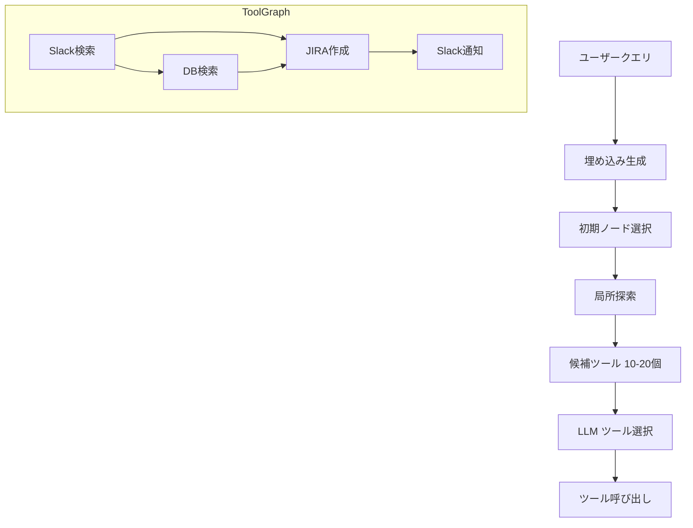

## 論文概要（Abstract）

本記事は [arXiv:2502.11157 "ToolNet: Connecting Large Language Models with Massive Tools via Tool Graph"](https://arxiv.org/abs/2502.11157) の解説記事です。

ToolNetは、数百〜数千規模の外部ツールをグラフ構造でモデル化し、LLMエージェントが効率的にツールを選択・連鎖実行できるようにする手法です。著者らは、従来のFlat Retrieval（全ツールの説明をプロンプトに含める方式）がコンテキスト長の制約に直面する問題を指摘し、ツール間の「後継関係」をグラフのエッジとして学習することで、局所的なグラフ探索によるツール選択を提案しています。

この記事は [Zenn記事: MCP Gatewayで社内ツール統合エージェントを設計する実践パターン](https://zenn.dev/0h_n0/articles/c55263b7af78bf) の深掘りです。

## 情報源

- **arXiv ID**: 2502.11157
- **URL**: [https://arxiv.org/abs/2502.11157](https://arxiv.org/abs/2502.11157)
- **著者**: Li et al.
- **発表年**: 2025年
- **分野**: cs.AI, cs.CL

## 背景と動機（Background & Motivation）

MCP Gatewayが管理するツール数が増加すると、LLMに全ツールの説明を提示することが困難になります。Zenn記事の`MCPGateway`クラスでは`_tool_to_server`辞書でツール名からサーバーへの静的マッピングを管理していますが、ツール数が数百〜数千規模になると以下の課題が発生します。

1. **コンテキスト長の制約**: GPT-4oで128Kトークン、Claude 4.5 Sonnetで200Kトークンが上限。数千ツールの説明は数百万トークンに達し得る
2. **ツール選択精度の低下**: プロンプト内のツール数が増えると、LLMの選択精度が低下する（情報過負荷）
3. **ツール連鎖の最適化**: あるツールの出力が次のツールの入力になるパイプライン的な利用パターンの効率化

著者らは、これらの課題に対してグラフ構造によるツール管理を提案しています。

## 主要な貢献（Key Contributions）

- **貢献1**: ツール間の後継関係（あるツールの出力が次のツールの入力になる確率）をグラフのエッジとして定義し、ツール利用履歴から学習する手法の提案
- **貢献2**: 全ツールの説明をプロンプトに含める代わりに、グラフ上の局所探索でツール候補を絞り込むアルゴリズムの設計
- **貢献3**: ToolBench（16,000+ APIツール）での大規模評価。ツール数2,000規模でFlat Retrieval比+12ポイントの精度改善

## 技術的詳細（Technical Details）

### ToolGraph の構成

ToolNetのコアは、ツール集合をノード、ツール間の後継確率をエッジとするグラフ $G = (V, E)$ です。

$$
G = (V, E), \quad V = \{t_1, t_2, \ldots, t_N\}, \quad E = \{(t_i, t_j, w_{ij})\}
$$

ここで、
- $V$: ツールノードの集合（$N$はツール総数）
- $E$: 有向エッジの集合
- $w_{ij}$: ツール $t_i$ の後にツール $t_j$ が呼び出される確率（後継確率）

後継確率 $w_{ij}$ は、ツール利用履歴から以下の式で推定されます。

$$
w_{ij} = \frac{\text{count}(t_i \to t_j)}{\sum_{k=1}^{N} \text{count}(t_i \to t_k)}
$$

ここで $\text{count}(t_i \to t_j)$ は、ツール $t_i$ の直後に $t_j$ が呼び出された回数です。

### グラフベースのツール選択アルゴリズム

著者らが提案するツール選択アルゴリズムは、以下の3ステップで構成されています。

**ステップ1: 初期ノード選択**

ユーザーのクエリ $q$ とツール説明の類似度に基づいて、開始ノードを選択します。

$$
t_{\text{start}} = \arg\max_{t \in V} \text{sim}(\text{emb}(q), \text{emb}(\text{desc}(t)))
$$

ここで $\text{emb}(\cdot)$ はテキスト埋め込み関数（例: text-embedding-ada-002）、$\text{desc}(t)$ はツール $t$ の説明文です。

**ステップ2: 局所探索**

開始ノードから、後継確率が高い隣接ノードを探索します。

$$
\mathcal{C}_k = \text{TopK}(\{(t_j, w_{ij}) \mid (t_i, t_j, w_{ij}) \in E, t_i \in \mathcal{C}_{k-1}\}, K)
$$

ここで $\mathcal{C}_k$ は $k$ ステップ目の候補ツール集合、$K$ は各ステップで保持する候補数です。

**ステップ3: LLMによる最終選択**

絞り込まれた候補ツール（通常10-20個）の説明のみをLLMに提示し、最終的なツール選択を行います。

```python
from dataclasses import dataclass, field
import heapq

@dataclass
class ToolNode:
    """ToolGraph のノード"""
    tool_id: str
    description: str
    embedding: list[float]
    successors: dict[str, float] = field(default_factory=dict)  # {tool_id: weight}

class ToolGraph:
    """ToolNet のグラフ構造実装

    ツール間の後継関係をグラフとして管理し、
    局所探索で候補ツールを効率的に絞り込む。
    """

    def __init__(self) -> None:
        self._nodes: dict[str, ToolNode] = {}

    def add_tool(self, node: ToolNode) -> None:
        """ツールノードを追加する"""
        self._nodes[node.tool_id] = node

    def update_edge(self, from_id: str, to_id: str, weight: float) -> None:
        """後継確率を更新する

        Args:
            from_id: 先行ツールID
            to_id: 後続ツールID
            weight: 後継確率 (0.0-1.0)
        """
        if from_id in self._nodes:
            self._nodes[from_id].successors[to_id] = weight

    def select_tools(
        self,
        query_embedding: list[float],
        max_candidates: int = 20,
        search_depth: int = 3,
        beam_width: int = 5,
    ) -> list[str]:
        """グラフベースのツール選択

        Args:
            query_embedding: クエリの埋め込みベクトル
            max_candidates: 最終候補数
            search_depth: 探索深さ
            beam_width: ビーム幅

        Returns:
            候補ツールIDのリスト（スコア降順）
        """
        # ステップ1: 初期ノード選択（コサイン類似度）
        scores: list[tuple[float, str]] = []
        for node in self._nodes.values():
            sim = self._cosine_similarity(query_embedding, node.embedding)
            scores.append((sim, node.tool_id))
        scores.sort(reverse=True)
        current = [tid for _, tid in scores[:beam_width]]

        # ステップ2: 局所探索
        visited: set[str] = set(current)
        all_candidates: list[tuple[float, str]] = scores[:beam_width]

        for _ in range(search_depth):
            next_candidates: list[tuple[float, str]] = []
            for tid in current:
                node = self._nodes[tid]
                for succ_id, weight in node.successors.items():
                    if succ_id not in visited:
                        visited.add(succ_id)
                        next_candidates.append((weight, succ_id))
            next_candidates.sort(reverse=True)
            current = [tid for _, tid in next_candidates[:beam_width]]
            all_candidates.extend(next_candidates[:beam_width])

        # ステップ3: スコアでソートしてTop K を返す
        all_candidates.sort(reverse=True)
        return [tid for _, tid in all_candidates[:max_candidates]]

    @staticmethod
    def _cosine_similarity(a: list[float], b: list[float]) -> float:
        """コサイン類似度を計算する"""
        dot = sum(x * y for x, y in zip(a, b))
        norm_a = sum(x * x for x in a) ** 0.5
        norm_b = sum(x * x for x in b) ** 0.5
        if norm_a == 0 or norm_b == 0:
            return 0.0
        return dot / (norm_a * norm_b)
```

### MCP Gateway への適用

Zenn記事の`MCPGateway`クラスの`_tool_to_server`辞書を`ToolGraph`に置き換えることで、大規模ツール環境でのスケーラブルなツール選択が可能になります。



## 実装のポイント（Implementation）

### グラフ構築のコールドスタート問題

論文の主要な制約として、ToolGraphの構築にはツール利用履歴が必要です。新規MCP環境では履歴がないため、以下の対策が考えられます。

1. **合成データ生成**: LLMにツール説明を与え、典型的な利用シナリオを生成させてエッジを初期化
2. **ツール説明ベースの初期化**: ツール間の入出力型の互換性を分析してエッジを推定
3. **段階的学習**: 運用開始後に実際の利用ログからエッジを更新

### グラフ更新のオーバーヘッド

MCPサーバーの動的な追加・削除が頻繁な環境では、ToolGraphの更新コストが問題になります。著者らはこの点について、エッジの再計算は差分更新で効率化できると述べていますが、具体的なオーバーヘッドの測定は今後の課題とされています。

### 実装上の注意点

- **埋め込みモデルの選択**: ツール説明が短文（数十単語）のため、短文特化の埋め込みモデルが有効
- **グラフストレージ**: 小規模（〜100ノード）ではNetworkXで十分。大規模（1,000+ノード）ではNeo4j等のグラフDBを検討
- **エッジの正規化**: 後継確率は定期的に再正規化（新ツール追加時に確率分布が変化するため）

## 実験結果（Results）

著者らはToolBench（16,000+ APIツール）で評価を行い、以下の結果を報告しています。

**ToolBench 上の SolvRate 比較（論文 Table 3 より）**:

| 手法 | ツール数 200 | ツール数 2,000 | 改善幅 |
|-----|------------|--------------|--------|
| Flat Retrieval | 55.3% | 48.7% | - |
| ToolNet (提案手法) | 60.6% (+5.3pt) | 60.8% (+12.1pt) | ツール数増加時に顕著 |

注目すべき点は、ToolNetの精度がツール数の増加に対してほぼ一定である一方、Flat Retrievalは大幅に低下していることです。著者らはこの理由について、Flat Retrievalではプロンプト内のツール説明が増えるにつれてLLMの注意が分散し、適切なツールを選択しにくくなるためと分析しています。

**GPT-4ベースでの評価（論文 Table 4 より）**:

| 評価指標 | Flat Retrieval | ToolNet | 差分 |
|---------|---------------|---------|------|
| SolvRate | 52.3% | 60.6% | +8.3pt |
| ToolAccuracy | 64.1% | 71.8% | +7.7pt |
| PathEfficiency | 0.72 | 0.85 | +0.13 |

PathEfficiencyは、正解のツール選択パスに対して実際に選択されたパスの効率性を測定する指標です。ToolNetは不要なツール呼び出しを削減し、より効率的なパスを選択できることを示しています。

## 実運用への応用（Practical Applications）

### MCP Gatewayでの活用

Zenn記事のMCP Gatewayアーキテクチャに ToolNet を統合する場合、以下のメリットが期待できます。

1. **スケーラビリティ**: ツール数50以上の環境でツール選択精度の維持
2. **レイテンシ削減**: 全ツール説明をプロンプトに含める必要がないため、入力トークン数の大幅削減
3. **ツール連鎖の最適化**: あるツールの出力を次のツールの入力に効率的にパイプライン

### 制約と注意点

- **コールドスタート**: 新規環境では利用履歴がないためグラフが構築できない
- **動的環境**: MCPサーバーの頻繁な追加・削除にはグラフの即時更新が必要
- **評価の限界**: ToolBenchは英語のAPIツールが対象であり、日本語環境や社内ツールでの有効性は未検証

## 関連研究（Related Work）

- **EASYTOOL**（Xu et al., 2024, arXiv:2405.00253）: ツール説明の簡潔化でトークン消費を削減。ToolNetとは補完的（説明を短くし、かつ候補数も絞る）
- **AgentTool**（2025, arXiv:2503.16557）: 自律的なツール統合・生成。ToolNetが既存ツールの管理に焦点を当てるのに対し、AgentToolは必要に応じてツール自体を動的に生成
- **ToolBench**（Qin et al., 2024）: 16,000+ APIツールのベンチマーク。ToolNetの評価基盤

## まとめと今後の展望

ToolNetは、大規模ツールセットにおけるLLMエージェントのツール選択を効率化するグラフベースの手法です。MCP Gatewayが管理するツール数が50を超える環境では、Flat Retrieval（全ツール説明をプロンプトに含める方式）の精度低下が顕著になるため、ToolNetのようなグラフ構造によるツール管理が有効です。

今後の研究方向として、著者らは動的グラフ更新の効率化とマルチモーダルツール（画像生成、音声認識等）への対応を挙げています。MCP Gatewayの文脈では、MCPサーバーの動的追加・削除に追従するリアルタイムグラフ更新が実用化の鍵になると考えられます。

## 参考文献

- **arXiv**: [https://arxiv.org/abs/2502.11157](https://arxiv.org/abs/2502.11157)
- **Related Zenn article**: [https://zenn.dev/0h_n0/articles/c55263b7af78bf](https://zenn.dev/0h_n0/articles/c55263b7af78bf)

---

:::message
この記事はAI（Claude Code）により自動生成されました。内容の正確性については原論文 [arXiv:2502.11157](https://arxiv.org/abs/2502.11157) もご確認ください。
:::
