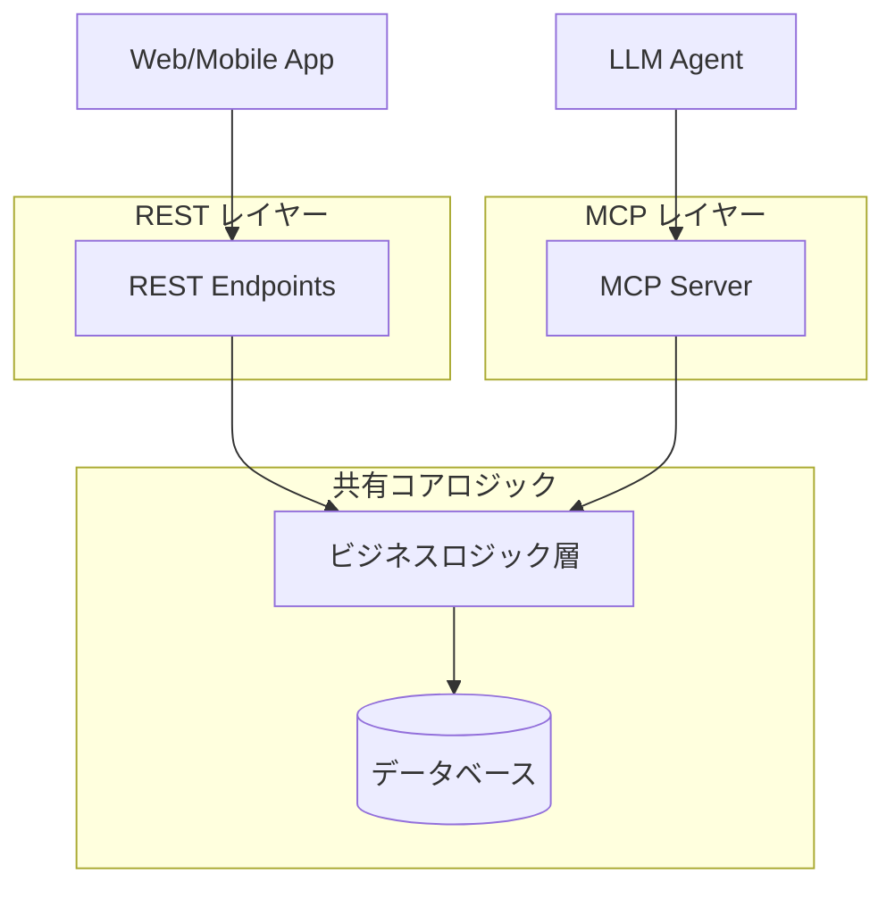

## ブログ概要（Summary）

本記事は [Microsoft Azure Architecture Blog: "Decision Matrix: API vs MCP Tools — The Great Integration Showdown"](https://techcommunity.microsoft.com/blog/azurearchitectureblog/decision-matrix-api-vs-mcp-tools-%E2%80%94-the-great-integration-showdown-%F0%9F%A5%8A/4499385) の解説記事です。

Microsoftの Azure Architecture チームは、エンタープライズ環境でのツール統合において、**Custom REST Service**・**Custom SDK/Client Library**・**Custom MCP Server** の3つのアプローチを定量的に比較し、それぞれの最適なユースケースを判断マトリクスとして整理しています。ブログによると、単一呼び出しレイテンシはREST（約850ms）が最速でMCP（約1,100ms）が最も遅いものの、MCPはLLMトークン消費を50-80%削減できるため、エージェント主体のワークフローでは総コスト効率で逆転する可能性があると報告されています。

この記事は [Zenn記事: MCP Gatewayで社内ツール統合エージェントを設計する実践パターン](https://zenn.dev/0h_n0/articles/c55263b7af78bf) の深掘りです。

## 情報源

- **種別**: 企業テックブログ（Microsoft Azure Architecture Blog）
- **URL**: [https://techcommunity.microsoft.com/blog/azurearchitectureblog/decision-matrix-api-vs-mcp-tools-the-great-integration-showdown/4499385](https://techcommunity.microsoft.com/blog/azurearchitectureblog/decision-matrix-api-vs-mcp-tools-%E2%80%94-the-great-integration-showdown-%F0%9F%A5%8A/4499385)
- **組織**: Microsoft Azure Architecture チーム
- **発表日**: 2025年

## 技術的背景（Technical Background）

Zenn記事では、MCP Gateway を中心としたアーキテクチャが推奨されていますが、すべてのユースケースでMCPが最適解とは限りません。Microsoftのブログは、REST APIが依然として有効な場面を含め、3つの統合パターンを客観的に比較している点で実用的です。

MCPの登場以前、LLMエージェントが外部ツールを呼び出す際は、各ツールに対して個別のREST APIラッパーを実装し、ツールの説明をプロンプトに含める必要がありました。MCPはこの統合コストを標準化で削減しますが、JSON-RPCプロトコルの追加レイヤーによるオーバーヘッドが発生します。

## 3つの統合パターンの定量比較

### レイテンシベンチマーク

ブログで報告されているベンチマーク結果は以下の通りです。

**単一呼び出しレイテンシ（ブログ Table 1 より）**:

| アプローチ | 単一呼び出し | 50並列リクエスト時 | オーバーヘッド要因 |
|-----------|------------|-------------------|-----------------|
| Custom REST API | ~850ms | 900-1,200ms | HTTP処理のみ |
| Custom SDK | ~900ms | 900-1,200ms | ライブラリ初期化 |
| Custom MCP Server | ~1,100ms | 900-1,200ms | JSON-RPCホップ（+100-300ms） |

著者らは、MCPのオーバーヘッドは「JSON-RPCの追加ホップ」に起因し、プロトコルのシリアライゼーションとトランスポートネゴシエーションで100-300msが追加されると分析しています。

注目すべき点は、50並列リクエスト時にはすべてのアプローチが900-1,200msに収束し、ボトルネックがバックエンドAPIのレートリミットに移行するという報告です。つまり、高負荷時にはプロトコル選択よりもバックエンド設計が支配的になります。

**MCP固有のコールドスタート**:

ブログによると、MCPサーバーの初回呼び出し時には200-500msのコールドスタートオーバーヘッドが発生します。これはサーバー初期化とトランスポートネゴシエーションによるもので、2回目以降は発生しません。

$$
T_{\text{MCP}}^{(1)} = T_{\text{backend}} + T_{\text{jsonrpc}} + T_{\text{cold\_start}}
$$

$$
T_{\text{MCP}}^{(n)} = T_{\text{backend}} + T_{\text{jsonrpc}} \quad (n \geq 2)
$$

ここで、
- $T_{\text{backend}}$: バックエンドAPI処理時間（~850ms）
- $T_{\text{jsonrpc}}$: JSON-RPCオーバーヘッド（100-300ms）
- $T_{\text{cold\_start}}$: 初回接続オーバーヘッド（200-500ms）

### トークン効率分析

MCPの最大の優位点はLLMトークン消費の削減です。ブログでは以下の比較が報告されています。

**レスポンスサイズ比較（ブログより）**:

| レスポンスタイプ | Raw API | MCP最適化 | トークン削減率 |
|---------------|---------|-----------|-------------|
| 小規模（~800 bytes） | ~200 tokens | ~45 tokens | 78% |
| 大規模（~50KB） | ~12,500 tokens | ~37 tokens | 99.7% |

ブログの著者らはこの差について、MCPサーバーがバックエンドAPIのレスポンスをLLMに渡す前に構造化・要約する機能を持つためと説明しています。REST APIでは生のJSONレスポンス全体がLLMのコンテキストに入りますが、MCPサーバーは必要な情報のみを抽出して返します。

トークンコストを金額に換算すると、以下の概算が得られます。

$$
C_{\text{savings}} = N_{\text{calls}} \times (T_{\text{raw}} - T_{\text{mcp}}) \times P_{\text{token}}
$$

ここで、
- $N_{\text{calls}}$: 1日のツール呼び出し回数
- $T_{\text{raw}}$: REST APIの平均トークン数
- $T_{\text{mcp}}$: MCPの平均トークン数
- $P_{\text{token}}$: トークン単価（例: Claude 4.5 Sonnet 入力 $3/MTok）

例えば、1日1,000回のAPI呼び出しで平均200トークン削減できる場合：

$$
C_{\text{savings}} = 1000 \times 200 \times \frac{3}{1{,}000{,}000} = \$0.60/\text{日} \approx \$18/\text{月}
$$

大規模レスポンス（50KB）が多い環境では、削減効果は数十倍になります。

### 各パターンの最適ユースケース

ブログの判断マトリクスを整理すると以下の通りです。

#### REST APIを選択すべき場合

- 複数の非LLMクライアントがデータを共有する場合
- 最速のパフォーマンスが求められる場合
- 標準的なHTTP APIを構築する場合
- 利用者が通常のアプリケーションである場合

#### SDKを選択すべき場合

- 単一言語のコードベース内で完結する場合
- 型付きモデルとIDEオートコンプリートが必要な場合
- ネットワークサービスよりインプロセスライブラリを好む場合

#### MCPを選択すべき場合

- LLMエージェント（Claude, GPT, Copilot）がツールを利用する場合
- 標準化されたツールディスカバリが必要な場合
- エージェントワークフローを構築する場合
- クレデンシャルの一元管理が必要な場合

### ハイブリッドアーキテクチャ

ブログでは、LLMクライアントと従来のアプリケーションクライアントの両方をサポートするシステムに対して、**REST + MCP ハイブリッドパターン**が推奨されています。



このパターンでは、ビジネスロジックを共有コアとして維持し、REST エンドポイントとMCPサーバーがそれぞれ薄いアダプター層として機能します。

**マイグレーションコスト概算（ブログより）**:

| パス | 期間 | リスク |
|-----|------|------|
| ゼロからREST構築 | 2-4週間 | 中 |
| ゼロからMCP構築 | 2-4週間 | 中 |
| 既存REST → MCP追加 | 1-3週間 | 低（推奨パス） |

## セキュリティ比較

### クレデンシャル管理

ブログで報告されているセキュリティ比較の中で、クレデンシャル管理の違いは設計判断に大きな影響を与えます。

| 項目 | REST | SDK | MCP |
|------|------|-----|-----|
| トークン配置 | サービスレベル | アプリケーションごと | サーバーレベル |
| クライアントの露出 | バックエンドトークン保持 | 各アプリに配布 | **クライアントはバックエンドトークンを保持しない** |
| 攻撃面 | HTTP標準（WAF対応済み） | ライブラリ依存 | 間接プロンプトインジェクション（新脅威） |

ブログによると、MCPの最大のセキュリティ上の利点は「バックエンドトークンがサーバー側に留まり、クライアントはバックエンドトークンを一切送信しない」点です。一方で、MCPはツール応答内の敵対的データがLLMの指示として機能する「間接プロンプトインジェクション」という新しい脅威を導入します。

### 認可モデル

ブログによると、MCPはHTTPトランスポートにおいて**OAuth 2.1 + PKCE**を使用し、ツールまたはリソースカテゴリごとのトークンスコーピングをサポートしています。

```python
# OAuth 2.1 + PKCE フローの概略（ブログの記述に基づく）
from dataclasses import dataclass

@dataclass
class MCPAuthConfig:
    """MCP認証設定"""
    authorization_url: str
    token_url: str
    client_id: str
    redirect_uri: str
    scopes: list[str]  # ツール/リソースカテゴリ単位

    def generate_pkce_challenge(self) -> tuple[str, str]:
        """PKCE チャレンジを生成する

        Returns:
            (code_verifier, code_challenge): PKCEペア
        """
        import secrets
        import hashlib
        import base64

        code_verifier = secrets.token_urlsafe(64)
        code_challenge = base64.urlsafe_b64encode(
            hashlib.sha256(code_verifier.encode()).digest()
        ).rstrip(b"=").decode()
        return code_verifier, code_challenge
```

Zenn記事の`AuthMiddleware`ではJWTベースの認証を実装していますが、本番環境ではOAuth 2.1 + PKCEへの移行が推奨されます。

## 実装アーキテクチャ（Architecture）

### REST → MCP マイグレーションパターン

既存のREST APIにMCPレイヤーを追加する場合の実装パターンです。

```python
# rest_to_mcp_adapter.py
from typing import Any
import httpx

class RESTtoMCPAdapter:
    """既存REST APIをMCPツールとして公開するアダプター

    既存のREST APIエンドポイントをラップし、
    MCP JSON-RPCプロトコルで応答する薄いアダプター層。
    """

    def __init__(self, rest_base_url: str, api_key: str) -> None:
        self._base_url = rest_base_url
        self._client = httpx.AsyncClient(
            base_url=rest_base_url,
            headers={"Authorization": f"Bearer {api_key}"},
            timeout=httpx.Timeout(30.0),
        )

    async def handle_tool_call(
        self, tool_name: str, arguments: dict[str, Any]
    ) -> dict[str, Any]:
        """MCP tools/call を REST API 呼び出しに変換する

        Args:
            tool_name: MCPツール名（例: "jira_get_issue"）
            arguments: ツール引数

        Returns:
            MCPレスポンス形式に変換された結果
        """
        # ツール名からRESTエンドポイントへのマッピング
        endpoint_map: dict[str, tuple[str, str]] = {
            "jira_get_issue": ("GET", "/rest/api/3/issue/{issue_key}"),
            "jira_create_issue": ("POST", "/rest/api/3/issue"),
            "slack_search": ("GET", "/api/search.messages"),
        }

        method, path_template = endpoint_map[tool_name]
        path = path_template.format(**arguments)

        if method == "GET":
            resp = await self._client.get(path, params=arguments)
        else:
            resp = await self._client.post(path, json=arguments)

        # レスポンスをMCP形式に変換（トークン削減のため要約）
        raw = resp.json()
        return self._summarize_response(tool_name, raw)

    def _summarize_response(
        self, tool_name: str, raw: dict
    ) -> dict[str, Any]:
        """REST レスポンスを要約してトークン削減する

        ブログで報告されている78-99.7%のトークン削減の実装基盤。
        """
        # ツール固有の要約ロジック
        if tool_name == "jira_get_issue":
            return {
                "key": raw.get("key"),
                "summary": raw.get("fields", {}).get("summary"),
                "status": raw.get("fields", {}).get("status", {}).get("name"),
                "assignee": raw.get("fields", {}).get("assignee", {}).get("displayName"),
            }
        return raw  # フォールバック: 全データ返却
```

## パフォーマンス最適化（Performance）

### APIキャッシュ効率

ブログによると、REST・SDK・MCPのいずれも、バックエンドAPIとの呼び出し比率は1:1であり、プロトコルレベルでの組み込みキャッシュの違いはないとされています。レスポンスキャッシュはすべてのパターンでカスタム実装が必要です。

Zenn記事のGateway実装では`_cache`辞書による単純なTTLベースのキャッシュを実装していますが、これはブログの指摘と整合しています。

### レイテンシ最適化戦略

MCPのオーバーヘッド（100-300ms）を最小化するための戦略：

1. **接続プーリング**: Zenn記事の`httpx.Limits`設定と同等
2. **HTTP/2多重化**: 1つのTCPコネクションで複数のJSON-RPCリクエストを送信
3. **バッチリクエスト**: 独立したツール呼び出しを並列実行（Zenn記事の`batch_tool_calls`）
4. **コールドスタート回避**: MCPサーバーのウォームアップ（keep-alive接続の維持）

## 運用での学び（Production Lessons）

### 判断フレームワークの適用

ブログの判断マトリクスを実際のプロジェクトに適用する際のチェックリスト：

1. **クライアント分析**: 主要な利用者はLLMエージェントか、通常のアプリケーションか
2. **レイテンシ要件**: 100-300msの追加オーバーヘッドは許容可能か
3. **トークンコスト**: 月間のLLMトークン消費量と、MCP導入による削減見込み
4. **セキュリティ要件**: クレデンシャルの集中管理が必要か
5. **既存資産**: 既存のREST APIがある場合は、追加コスト1-3週間でMCPレイヤーを追加可能

### コスト分析モデル

ブログの数値に基づく簡易コスト比較モデルです。

```python
from dataclasses import dataclass

@dataclass
class IntegrationCostModel:
    """統合パターンのコスト比較モデル

    ブログのベンチマーク値に基づく概算。
    実際のコストは環境により変動する。
    """
    daily_tool_calls: int
    avg_response_tokens_rest: int = 200
    avg_response_tokens_mcp: int = 45
    token_price_per_mtok: float = 3.0  # USD, Claude 4.5 Sonnet 入力

    @property
    def monthly_token_cost_rest(self) -> float:
        """REST API利用時の月間トークンコスト"""
        monthly_tokens = self.daily_tool_calls * 30 * self.avg_response_tokens_rest
        return monthly_tokens * self.token_price_per_mtok / 1_000_000

    @property
    def monthly_token_cost_mcp(self) -> float:
        """MCP利用時の月間トークンコスト"""
        monthly_tokens = self.daily_tool_calls * 30 * self.avg_response_tokens_mcp
        return monthly_tokens * self.token_price_per_mtok / 1_000_000

    @property
    def monthly_savings(self) -> float:
        """月間コスト削減額"""
        return self.monthly_token_cost_rest - self.monthly_token_cost_mcp

    def break_even_analysis(self, mcp_infra_cost: float) -> float:
        """MCP導入の損益分岐点を計算する

        Args:
            mcp_infra_cost: MCPインフラの月額コスト

        Returns:
            損益分岐点までの月数
        """
        if self.monthly_savings <= 0:
            return float("inf")
        return mcp_infra_cost / self.monthly_savings
```

## 学術研究との関連（Academic Connection）

ブログで報告されているトークン効率の改善は、学術研究でも裏付けられています。

- **EASYTOOL**（Xu et al., 2024, arXiv:2405.00253）: ツール説明の簡潔化により、ツール選択精度を向上させつつトークン消費を削減する手法。MCPサーバーのレスポンス要約と同じ方向性
- **ToolNet**（Li et al., 2025, arXiv:2502.11157）: 大規模ツールセットのグラフ構造管理。ブログの判断マトリクスにおける「ツールディスカバリ」の学術的基盤
- **Unified Tool Integration**（2025, arXiv:2508.02979）: プロトコル非依存のFunction Calling統合アプローチ。REST/MCP/SDKの統一フレームワーク

## まとめと実践への示唆

Microsoftの判断マトリクスは、MCPを盲目的に採用するのではなく、ユースケースに応じた選択が重要であることを示しています。

主要な判断基準をまとめると：

1. **LLMエージェント主体** → MCP（トークン50-80%削減が総コストで逆転）
2. **従来アプリ主体** → REST API（100-300ms速い、成熟したセキュリティツール）
3. **両方サポート** → REST + MCP ハイブリッド（ブログ推奨パス、既存REST → MCP追加は1-3週間）

Zenn記事のMCP Gatewayアーキテクチャは「LLMエージェント主体」のユースケースに最適化されていますが、非LLMクライアントも利用するシステムでは、ハイブリッドパターンの検討が推奨されます。

## 参考文献

- **Blog URL**: [Decision Matrix: API vs MCP Tools — The Great Integration Showdown](https://techcommunity.microsoft.com/blog/azurearchitectureblog/decision-matrix-api-vs-mcp-tools-%E2%80%94-the-great-integration-showdown-%F0%9F%A5%8A/4499385)
- **Related Papers**: EASYTOOL (arXiv:2405.00253), ToolNet (arXiv:2502.11157)
- **Related Zenn article**: [https://zenn.dev/0h_n0/articles/c55263b7af78bf](https://zenn.dev/0h_n0/articles/c55263b7af78bf)

---

:::message
この記事はAI（Claude Code）により自動生成されました。内容の正確性については原典の [Microsoft Azure Architecture Blog](https://techcommunity.microsoft.com/blog/azurearchitectureblog/decision-matrix-api-vs-mcp-tools-%E2%80%94-the-great-integration-showdown-%F0%9F%A5%8A/4499385) もご確認ください。
:::
