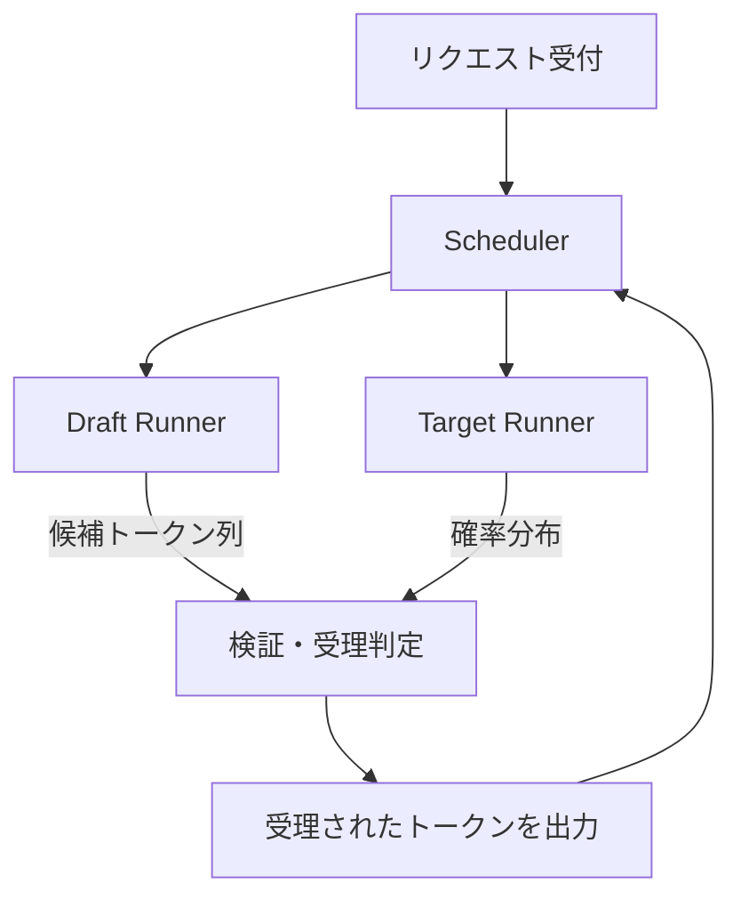

本記事は [How Speculative Decoding Boosts vLLM Performance](https://vllm.ai/blog/spec-decode) の解説記事です。

## ブログ概要（Summary）

vLLMプロジェクトが2024年10月に公開した公式ブログでは、vLLMにおける投機的デコーディングの実装アーキテクチャ、サポートする3つの手法（ドラフトモデル方式、Prompt Lookup Decoding、Medusa/EAGLE/MLPSpeculator）、およびベンチマーク結果が解説されている。ブログの報告によると、ドラフトモデル方式でShareGPTデータセット上で最大1.5倍、Prompt Lookup DecodingでCNN/DailyMailデータセット上で最大2.8倍の高速化が達成されている。また、vLLMの内部アーキテクチャ（Draft Runner、Target Runner、Scheduler統合）の設計思想と、今後の動的投機的デコーディングの開発計画についても記述されている。

この記事は [Zenn記事: vLLM投機的デコーディング＋Medusa Headで推論レイテンシを半減させる](https://zenn.dev/0h_n0/articles/b3d1a3bb93a18e) の深掘りです。

## 情報源

- **種別**: 企業テックブログ
- **URL**: [https://vllm.ai/blog/spec-decode](https://vllm.ai/blog/spec-decode)
- **組織**: vLLMプロジェクト
- **発表日**: 2024年10月17日

## 技術的背景（Technical Background）

vLLMは、PagedAttentionを基盤とするオープンソースのLLM推論フレームワークであり、高スループット・低レイテンシのLLMサービングを目標としている。投機的デコーディングは、vLLMの中核機能の一つとして位置づけられており、特に低QPSのオンライン推論シナリオでのレイテンシ削減に大きな効果を発揮する。

ブログでは、投機的デコーディングが「精度を犠牲にすることなく生成を高速化するロスレスかつ高効率な手法」であると説明されている。GPUの計算能力がメモリ帯域幅に対して大幅に余っている状況（メモリバウンド）を活用し、ドラフト生成と並列検証を組み合わせることでレイテンシを削減する。

## 実装アーキテクチャ（Architecture）

### vLLMの投機的デコーディング内部設計

ブログでは、vLLMの投機的デコーディングが2つの主要コンポーネントで構成されることが説明されている：



**Draft Runner**: ドラフトモデル（小型モデル、N-gramマッチング、またはMLPヘッド）を実行し、候補トークン列を生成する。

**Target Runner**: ターゲットモデル（大型モデル）を実行し、候補トークン列を一括検証する。1回のフォワードパスで複数トークンの確率分布を計算し、修正棄却サンプリングによる受理/棄却判定を行う。

**Scheduler統合**: vLLMのスケジューラは、投機的デコーディング用に拡張されている。通常の推論では1リクエストにつき1トークンのスロットを割り当てるが、投機的デコーディングでは1リクエストにつき$\gamma + 1$スロット（ドラフトトークン数 + 1）を割り当てる。

**KVキャッシュ管理**: PagedAttentionのKVキャッシュ管理が投機的デコーディング用に拡張されている。ドラフトモデルとターゲットモデルの両方のKVキャッシュを管理し、トークンの棄却時にはキャッシュのロールバックを行う。

### 3つのサポート手法

#### 1. ドラフトモデル方式

最も基本的な手法。小型の同系列モデルをドラフトモデルとして使用する。

```python
from vllm import LLM

llm = LLM(
    model="facebook/opt-6.7b",
    speculative_model="facebook/opt-125m",
    num_speculative_tokens=5,
)
outputs = llm.generate("The future of AI is")
```

ブログの報告によると、ShareGPTデータセット上でLlama 2 70B（ターゲット）+ Llama 68M（ドラフト）の組み合わせで**最大1.5倍**の高速化が達成されている。

**テンソル並列の設定**: 大型モデルを複数GPUで分散する場合、ドラフトモデルは単一GPUで実行することが推奨されている。

```python
llm = LLM(
    model="meta-llama/Meta-Llama-3.1-70B-Instruct",
    tensor_parallel_size=4,
    speculative_model="ibm-fms/llama3-70b-accelerator",
    speculative_draft_tensor_parallel_size=1,
)
```

#### 2. Prompt Lookup Decoding (N-gram Matching)

N-gramマッチングにより、プロンプト内の既出パターンからドラフトトークンを予測する手法。ブログでは「要約やQAのようにプロンプトと回答の重複が多いユースケースに効果的」と説明されている。

```python
llm = LLM(
    model="facebook/opt-6.7b",
    speculative_model="[ngram]",
    num_speculative_tokens=5,
    ngram_prompt_lookup_max=4,
    ngram_prompt_lookup_min=1,
)
```

CNN/DailyMailデータセット（要約タスク）上で**最大2.8倍**の高速化が報告されている。追加モデルが不要なため、GPUメモリの増加がゼロであり、導入障壁が最も低い。

#### 3. Medusa/EAGLE/MLPSpeculator

ターゲットモデルに追加のヘッドを装着し、並列トークン予測を行う方式群。ブログではこれらを同カテゴリとして扱い、外部ドラフトモデルが不要な点を利点として挙げている。

vLLMでは、Eagle方式（v0.8.5以降）、Eagle-3方式（v0.9.1以降）、Medusa方式がサポートされている。

## Production Deployment Guide

### AWS実装パターン（コスト最適化重視）

vLLMの投機的デコーディングを本番環境にデプロイする場合の構成を示す。

| 規模 | 月間リクエスト | 推奨構成 | 月額コスト | 主要サービス |
|------|--------------|---------|-----------|------------|
| **Small** | ~3,000 (100/日) | Serverless | $50-150 | Lambda + Bedrock + DynamoDB |
| **Medium** | ~30,000 (1,000/日) | GPU Hybrid | $500-1,200 | ECS Fargate (GPU) + vLLM |
| **Large** | 300,000+ (10,000/日) | GPU Cluster | $3,000-8,000 | EKS + Karpenter + vLLM |

**Medium構成の詳細** (月額$500-1,200):
- **ECS Fargate (GPU)**: g5.xlarge (24GB VRAM)、vLLM + 投機的デコーディング ($600/月)
- **Application Load Balancer**: ヘルスチェック ($25/月)
- **ElastiCache Redis**: プロンプトキャッシュ ($15/月)
- **CloudWatch**: メトリクス監視 ($10/月)

vLLMの投機的デコーディングはGPUインスタンス上で動作するため、Bedrock（Small構成）からGPUインスタンス（Medium以上）への移行はコスト増を伴う。ただし、投機的デコーディングによるレイテンシ削減が同一GPUでのスループット向上に直結するため、リクエスト単価は低下する。

**コスト試算の注意事項**: 上記は2026年3月時点のAWS ap-northeast-1料金に基づく概算です。GPU インスタンスの料金はインスタンスタイプとSpot/On-Demandの選択により大きく変動します。最新料金は [AWS料金計算ツール](https://calculator.aws/) で確認してください。

### Terraformインフラコード

**Medium構成 (GPU Hybrid): ECS Fargate + vLLM**

```hcl
module "vpc" {
  source  = "terraform-aws-modules/vpc/aws"
  version = "~> 5.0"

  name = "vllm-spec-decode-vpc"
  cidr = "10.0.0.0/16"
  azs  = ["ap-northeast-1a", "ap-northeast-1c"]
  private_subnets = ["10.0.1.0/24", "10.0.2.0/24"]
  public_subnets  = ["10.0.101.0/24", "10.0.102.0/24"]
  enable_nat_gateway = true
  single_nat_gateway = true  # コスト削減
}

resource "aws_ecs_cluster" "vllm" {
  name = "vllm-inference"
}

resource "aws_ecs_task_definition" "vllm" {
  family                   = "vllm-spec-decode"
  network_mode             = "awsvpc"
  requires_compatibilities = ["FARGATE"]
  cpu                      = "4096"
  memory                   = "16384"

  container_definitions = jsonencode([{
    name  = "vllm"
    image = "vllm/vllm-openai:latest"
    command = [
      "--model", "meta-llama/Llama-3.1-8B-Instruct",
      "--speculative-config",
      "{\"method\":\"eagle3\",\"model\":\"yuhuili/EAGLE3-LLaMA3.1-Instruct-8B\",\"num_speculative_tokens\":3}",
      "--enable-prefix-caching",
      "--host", "0.0.0.0",
      "--port", "8000"
    ]
    portMappings = [{
      containerPort = 8000
      protocol      = "tcp"
    }]
    logConfiguration = {
      logDriver = "awslogs"
      options = {
        "awslogs-group"         = "/ecs/vllm-spec-decode"
        "awslogs-region"        = "ap-northeast-1"
        "awslogs-stream-prefix" = "vllm"
      }
    }
  }])
}

resource "aws_cloudwatch_log_group" "vllm" {
  name              = "/ecs/vllm-spec-decode"
  retention_in_days = 30
}
```

**Large構成 (GPU Cluster): EKS + Spot**

```hcl
module "eks" {
  source  = "terraform-aws-modules/eks/aws"
  version = "~> 20.0"

  cluster_name    = "vllm-spec-decode-cluster"
  cluster_version = "1.31"
  vpc_id          = module.vpc.vpc_id
  subnet_ids      = module.vpc.private_subnets
  cluster_endpoint_public_access = true
  enable_cluster_creator_admin_permissions = true
}

resource "kubectl_manifest" "karpenter_nodepool" {
  yaml_body = <<-YAML
    apiVersion: karpenter.sh/v1
    kind: NodePool
    metadata:
      name: vllm-gpu-spot
    spec:
      template:
        spec:
          requirements:
            - key: karpenter.sh/capacity-type
              operator: In
              values: ["spot"]
            - key: node.kubernetes.io/instance-type
              operator: In
              values: ["g5.xlarge", "g5.2xlarge", "g5.4xlarge"]
          limits:
            cpu: "64"
            memory: "256Gi"
      disruption:
        consolidationPolicy: WhenEmpty
        consolidateAfter: 30s
  YAML
}
```

### セキュリティベストプラクティス

- **ネットワーク**: vLLMサーバーはプライベートサブネット配置、ALB経由でのみアクセス
- **IAMロール**: ECSタスクロールは最小権限（ECR pull、CloudWatch logs）
- **シークレット**: モデルアクセストークンはSecrets Manager経由
- **暗号化**: ALBはTLS 1.2以上、S3/EBSはKMS暗号化

### 運用・監視設定

vLLMは`/metrics`エンドポイントでPrometheusメトリクスを提供する。投機的デコーディング固有のメトリクスも含まれる。

```python
import boto3

cloudwatch = boto3.client('cloudwatch')

# vLLM投機的デコーディング受理率監視
cloudwatch.put_metric_alarm(
    AlarmName='vllm-spec-decode-acceptance-rate',
    ComparisonOperator='LessThanThreshold',
    EvaluationPeriods=3,
    MetricName='SpecDecodeAcceptanceRate',
    Namespace='vLLM/Inference',
    Period=300,
    Statistic='Average',
    Threshold=0.6,
    AlarmDescription='投機的デコーディングの受理率が60%を下回った。num_speculative_tokens削減を検討'
)
```

### コスト最適化チェックリスト

- [ ] 低QPS（~100/日） → Bedrock Serverless構成 - $50-150/月
- [ ] 中QPS（~1000/日） → ECS Fargate + vLLM + Spec Decode - $500-1,200/月
- [ ] 高QPS（10000+/日） → EKS + Spot + vLLM - $3,000-8,000/月
- [ ] Spot Instances: 最大90%削減（g5.xlarge Spot）
- [ ] Prompt Lookup Decoding: 追加メモリゼロで最大2.8倍高速化
- [ ] `--enable-prefix-caching`: KVキャッシュ再利用でTTFT削減
- [ ] `num_speculative_tokens`チューニング: タスク別最適化
- [ ] 受理率メトリクス監視: 0.6未満で設定見直し
- [ ] AWS Budgets: 月額予算80%で警告
- [ ] Karpenter: アイドル30秒でGPUノード回収
- [ ] CloudWatch: レイテンシ・スループット・コストダッシュボード
- [ ] タグ戦略: 環境別・モデル別コスト可視化

## パフォーマンス最適化（Performance）

ブログの報告による主要ベンチマーク結果は以下の通りである。

| 手法 | データセット | モデル | スピードアップ |
|------|------------|--------|-------------|
| ドラフトモデル | ShareGPT | Llama 2 70B + 68M | 最大1.5倍 |
| Prompt Lookup | CNN/DailyMail | opt-6.7b | 最大2.8倍 |
| Eagle3 | MT-bench | Llama 3.3 70B | 最大1.6倍 |
| Eagle3 | RAG/Math | Llama 3.3 70B | 最大2.1倍 |

**パフォーマンスの依存性**: ブログでは「投機的デコーディングのパフォーマンスはリクエストの内容とリクエストレートの両方に大きく依存する」と強調されている。低QPSのメモリバウンドなシナリオで最も効果が大きく、高QPSでコンピュートバウンドになると逆効果になる可能性がある。

**Prompt Lookup Decodingが有効なタスク**: 要約（CNN/DailyMail）やQA（SQuAD等）のように、プロンプトと回答に大きな重複がある場合に効果が顕著である。追加モデルもヘッド学習も不要なため、最も導入障壁が低い手法である。

## 運用での学び（Production Lessons）

**QPSに応じた手法切り替え**: ブログでは、動的投機的デコーディング（Dynamic Speculative Decoding）の開発が進行中であることが言及されている。システム負荷とドラフトモデルの精度に基づいて、提案するトークン数を自動調整し、ワークロードに関わらず最適なパフォーマンスを提供することを目標としている。

**受理率の監視の重要性**: vLLM v0.9.1以降では`/metrics`エンドポイントで`vllm:spec_decode_draft_acceptance_rate`等のメトリクスが取得可能であり、受理率が0.6を下回る場合は`num_speculative_tokens`の削減や投機的デコーディング自体の無効化が推奨される。

**Prefix Cachingとの併用**: vLLMの`--enable-prefix-caching`オプションは投機的デコーディングと併用可能であり、チャットボットのようにシステムプロンプトが共通のユースケースではKVキャッシュの再利用によりさらなるレイテンシ削減が得られる。

## 学術研究との関連（Academic Connection）

vLLMの投機的デコーディング実装は、以下の学術論文に基づいている：

- **Speculative Decoding原論文** (Leviathan et al., 2023): 修正棄却サンプリングによるロスレス保証
- **EAGLE** (Li et al., 2024): Feature-levelドラフトヘッド
- **EAGLE-3** (Li et al., 2025): Training-Time Test Scaling
- **Medusa** (Cai et al., 2024): 複数デコーディングヘッド

vLLMの実装では、これらの学術的手法を産業グレードのサービングフレームワークに統合し、PagedAttentionのKVキャッシュ管理、テンソル並列、CUDAグラフ等との整合性を確保している。

## まとめと実践への示唆

vLLM公式ブログの報告に基づくと、投機的デコーディングは低〜中QPSのオンライン推論で最も効果が高く、手法選択はタスク特性に大きく依存する。Prompt Lookup Decodingは追加リソース不要で最大2.8倍の高速化が可能であり、最も低リスクな導入方法である。EAGLE-3は現時点のSOTAであるが、ドラフトヘッドの学習コストが必要となる。本番環境では受理率メトリクスの継続的監視が不可欠であり、受理率0.6未満では設定変更を検討すべきである。vLLMの動的投機的デコーディング機能の開発が進行中であり、将来的にはワークロード適応型の自動チューニングが実現される見込みである。

## 参考文献

- **Blog URL**: [https://vllm.ai/blog/spec-decode](https://vllm.ai/blog/spec-decode)
- **vLLM Docs**: [https://docs.vllm.ai/en/latest/features/spec_decode/](https://docs.vllm.ai/en/latest/features/spec_decode/)
- **Speculators v0.3.0**: [https://blog.vllm.ai/2025/12/13/speculators-v030.html](https://blog.vllm.ai/2025/12/13/speculators-v030.html)
- **Red Hat Eagle3 Benchmark**: [https://developers.redhat.com/articles/2025/07/01/fly-eagle3-fly-faster-inference-vllm-speculative-decoding](https://developers.redhat.com/articles/2025/07/01/fly-eagle3-fly-faster-inference-vllm-speculative-decoding)
- **Related Zenn article**: [https://zenn.dev/0h_n0/articles/b3d1a3bb93a18e](https://zenn.dev/0h_n0/articles/b3d1a3bb93a18e)
