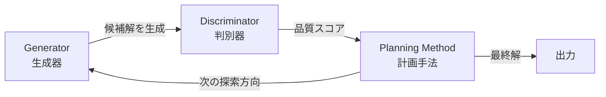
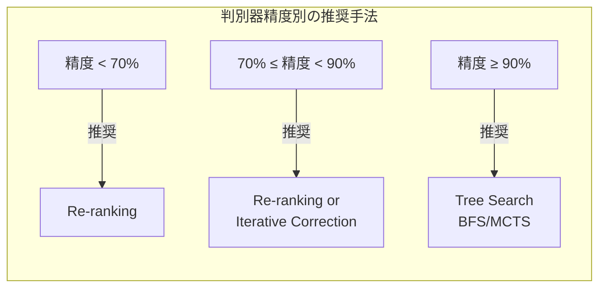

本記事は [When is Tree Search Useful for LLM Planning? It Depends on the Discriminator](https://aclanthology.org/2024.acl-long.738/)（Chen et al., ACL 2024）の解説記事です。

## 論文概要（Abstract）

LLMが多段階の問題を解く際に、木探索（Tree Search）がどのような条件下で有効かを分析した論文である。著者らは、LLMベースの計画システムを「生成器（Generator）」「判別器（Discriminator）」「計画手法（Planning Method）」の3つのコンポーネントに分解し、4つの計画手法（Re-ranking、Iterative Correction、BFS木探索、MCTS木探索）を比較している。主要な発見として、木探索が単純なRe-rankingを有意に上回るためには、判別器の精度が少なくとも90%必要であることを実証している。現在のLLMの判別能力ではこの閾値に達していないケースが多く、木探索は10-20倍の計算コストに見合う性能向上を得られないと著者らは報告している。

この記事は [Zenn記事: AIエージェント内部アーキテクチャの最前線：認知・メモリ・推論の3層設計](https://zenn.dev/0h_n0/articles/03d9ea70e316b4) の深掘りです。

## 情報源

- **会議名**: ACL 2024（62nd Annual Meeting of the Association for Computational Linguistics）
- **年**: 2024
- **URL**: [https://aclanthology.org/2024.acl-long.738/](https://aclanthology.org/2024.acl-long.738/)
- **著者**: Ziru Chen, Michael White, Ray Mooney, Ali Payani, Yu Su, Huan Sun
- **発表形式**: Long Paper（pp. 13659-13678）
- **DOI**: 10.18653/v1/2024.acl-long.738

## カンファレンス情報

ACL（Association for Computational Linguistics）は自然言語処理（NLP）分野の最高峰会議の一つである。2024年はタイ・バンコクで開催された。Long Paper枠の採択率は例年20-25%程度であり、厳しい査読を経て採択されている。

## 技術的詳細（Technical Details）

### 3コンポーネントフレームワーク

著者らは、LLMベースの計画システムを以下の3つのコンポーネントに分解している。



**Generator（生成器）**: 問題に対する候補解（部分解または完全解）を生成するLLM。Temperature $> 0$ で複数の候補を生成する。

**Discriminator（判別器）**: 生成された候補の品質を評価する。LLM自身が評価する場合（Self-Evaluation）と、外部の検証器（テスト実行、構文チェック等）を使う場合がある。

**Planning Method（計画手法）**: 生成器と判別器を組み合わせて最終解を探索するアルゴリズム。

### 4つの計画手法の比較

著者らは以下の4つの手法を統一的なフレームワーク上で比較している。

**手法1: Re-ranking（再ランキング）**

生成器が$n$個の候補を独立に生成し、判別器が最もスコアの高い候補を選択する。計算コストは$O(n)$のLLM呼び出し。

$$
y^* = \arg\max_{y \in \{y_1, \ldots, y_n\}} D(y \mid x)
$$

ここで、$x$は入力問題、$y_i$は$i$番目の候補解、$D(y \mid x)$は判別器のスコアである。

**手法2: Iterative Correction（反復修正）**

1つの候補を生成し、判別器のフィードバックに基づいて反復的に修正する。Reflexionに類似する手法。

$$
y_{t+1} = G(x, y_t, D(y_t \mid x))
$$

**手法3: BFS木探索（幅優先探索）**

解を部分ステップに分解し、各ステップで$b$個の候補を幅優先で展開する。幅$b$、深さ$d$の場合、計算コストは$O(b^d)$。

**手法4: MCTS（モンテカルロ木探索）**

LATSと同様のMCTSアルゴリズム。UCB1スコアでノードを選択し、LLMで展開、LLMで評価、スコアをバックプロパゲーションする。

### 90%精度閾値の実証

著者らの主要な発見は、判別器の精度と計画手法の有効性の関係である。



判別器精度が90%未満の場合、木探索はRe-rankingと比較して有意な性能差を示さない。一方、計算コストは10-20倍増加する。この発見は、「高度な計画手法を使えば必ず性能が向上する」という直観に反する重要な結果である。

形式的には、判別器の精度$\text{acc}(D)$と計画手法の性能$P$の関係は以下のように要約される：

$$
\Delta P_{\text{tree vs re-rank}} \approx 0 \quad \text{when } \text{acc}(D) < 0.9
$$

$$
\Delta P_{\text{tree vs re-rank}} > 0 \quad \text{when } \text{acc}(D) \geq 0.9
$$

ここで、$\Delta P$は木探索とRe-rankingの性能差である。

### 実験設定

著者らは2つのタスクで実験を実施している。

**Text-to-SQL（テキストからSQL生成）**:
- データセット: Spider（7,000+ 問題）
- 評価指標: Execution Accuracy（実行結果の一致率）
- 判別器: SQL構文チェック + 実行結果検証

**Mathematical Reasoning（数学推論）**:
- データセット: GSM8K（8,500問）
- 評価指標: 最終回答の正答率
- 判別器: LLMベースのSelf-Evaluation + 計算検証

### 計算コスト分析

著者らの報告による各手法のコスト比較：

| 計画手法 | LLM呼び出し数（相対） | 精度向上（Re-ranking比） | コスト効率 |
|---------|---------------------|----------------------|----------|
| Re-ranking (n=10) | 1x | ベースライン | 高 |
| Iterative Correction (k=3) | 1.5x | +1-3% | 中 |
| BFS (b=3, d=3) | 10-15x | +0-2% (acc<90%) | 低 |
| MCTS (100 iterations) | 15-20x | +0-3% (acc<90%) | 低 |

（著者らの実験結果に基づく。判別器精度が90%未満の場合の値）

## 実装のポイント（Implementation）

**判別器の精度測定**: 木探索の導入を検討する前に、まず判別器の精度を測定すべきである。具体的には、正解が分かっているテストセットで判別器の二値分類精度（正しい解を「良い」、間違った解を「悪い」と判定できるか）を計測する。

**Re-rankingを最初に試す**: 著者らの結論として、多くの場合Re-ranking（$n=10$程度の候補を生成して最良を選択）が最もコスト効率が高い。木探索は判別器精度90%以上が確認できた場合にのみ検討すべきである。

**外部判別器の活用**: LLMのSelf-Evaluationは判別器として精度が不十分な場合が多い。Text-to-SQLではSQL実行結果の検証、コード生成ではテスト実行など、外部の検証メカニズムを判別器として使用することで精度が向上する。

**段階的な高度化**: Re-ranking → Iterative Correction → 木探索の順に段階的に導入し、各段階で精度向上とコスト増加のトレードオフを評価する。

## Production Deployment Guide

### AWS実装パターン（コスト最適化重視）

本論文の知見に基づき、計画手法の選択によるコスト差は大きい。

| 規模 | 月間リクエスト | Re-ranking構成 | 木探索構成 | コスト差 |
|------|--------------|---------------|----------|---------|
| **Small** | ~3,000 | $50-150/月 | $500-1,500/月 | 10x |
| **Medium** | ~30,000 | $300-800/月 | $3,000-8,000/月 | 10x |
| **Large** | 300,000+ | $2,000-5,000/月 | $20,000-50,000/月 | 10x |

**コスト試算の注意事項**: 上記は2026年3月時点のAWS ap-northeast-1（東京）リージョン料金に基づく概算値です。木探索はRe-rankingの10-20倍のLLM呼び出しを必要とするため、コスト差が顕著です。最新料金は[AWS料金計算ツール](https://calculator.aws/)で確認してください。

**推奨戦略**: 本論文の知見に基づき、まずRe-ranking構成でデプロイし、判別器精度が90%以上達成できた場合にのみ木探索への移行を検討する。これにより、不要なコスト増加を回避できる。

**Small構成の詳細**（Re-ranking、月額$50-150）:
- **Lambda**: 1GB RAM, 60秒タイムアウト $20/月
- **Bedrock**: Claude 3.5 Haiku（候補生成n=10）$80/月
- **DynamoDB**: 候補・判定結果キャッシュ $10/月
- **Step Functions**: Re-rankingワークフロー管理 $5/月

**コスト削減テクニック**:
- Re-ranking候補数$n$を5-10に制限（$n > 10$でも精度向上は限定的）
- Prompt Caching有効化（システムプロンプト共通化で30-90%削減）
- 判別器に外部検証（テスト実行等）を使用しLLM呼び出しを削減
- Bedrock Batch APIで非リアルタイム処理を50%削減

### Terraformインフラコード

```hcl
# --- Step Functions（Re-rankingワークフロー） ---
resource "aws_sfn_state_machine" "reranking_workflow" {
  name     = "llm-reranking-planner"
  role_arn = aws_iam_role.sfn_role.arn

  definition = jsonencode({
    StartAt = "GenerateCandidates"
    States = {
      GenerateCandidates = {
        Type     = "Task"
        Resource = aws_lambda_function.generator.arn
        Next     = "RankCandidates"
      }
      RankCandidates = {
        Type     = "Task"
        Resource = aws_lambda_function.discriminator.arn
        Next     = "SelectBest"
      }
      SelectBest = {
        Type = "Task"
        Resource = aws_lambda_function.selector.arn
        End = true
      }
    }
  })
}

# --- Lambda（生成器） ---
resource "aws_lambda_function" "generator" {
  filename      = "generator.zip"
  function_name = "llm-candidate-generator"
  role          = aws_iam_role.lambda_role.arn
  handler       = "index.handler"
  runtime       = "python3.12"
  timeout       = 60
  memory_size   = 1024

  environment {
    variables = {
      BEDROCK_MODEL_ID = "anthropic.claude-3-5-haiku-20241022-v1:0"
      NUM_CANDIDATES   = "10"
      TEMPERATURE      = "0.8"
    }
  }
}
```

### コスト最適化チェックリスト

- [ ] 判別器精度を計測（90%未満ならRe-rankingを採用）
- [ ] Re-ranking候補数n=10で開始（n > 10の効果は限定的）
- [ ] 外部検証器を判別器として使用（LLM Self-Evaluation避ける）
- [ ] Prompt Caching有効化（共通システムプロンプト）
- [ ] Bedrock Batch API活用（非リアルタイム処理）
- [ ] Step Functionsで候補生成を並列化（コスト削減ではないが速度向上）
- [ ] AWS Budgets月額予算設定（80%で警告）
- [ ] CloudWatchで候補生成数・判定精度を監視
- [ ] 判別器精度が90%を超えたら木探索への移行を検討
- [ ] 木探索移行時はSpot Instances活用（最大90%削減）

## 実験結果（Results）

著者らの主要な実験結果を以下に要約する。

**Text-to-SQL（Spider）での結果**:

| 手法 | Execution Accuracy | LLM呼び出し数 |
|------|-------------------|-------------|
| Re-ranking (n=10) | 78.2% | 10 |
| Iterative Correction (k=3) | 79.5% | 15 |
| BFS (b=3, d=3) | 78.8% | 120+ |
| MCTS (100 iter) | 79.1% | 150+ |

（著者らのTable 2より概算値。判別器はSQL実行検証ベース）

著者らの分析によると、Text-to-SQLタスクにおいて、BFS/MCTSはRe-rankingと比較して計算コストが10倍以上増加しているにもかかわらず、精度差は1%未満にとどまっている。これは、SQL実行ベースの判別器の精度が約85%であり、90%閾値に達していないことが原因と報告されている。

**数学推論（GSM8K）での結果**: 同様の傾向が確認されており、木探索の計算コスト増加に対する精度向上が限定的であることが報告されている。

## 実運用への応用（Practical Applications）

**エージェント設計の指針**: Zenn記事の推論パターン選定フローチャートに対する重要な補足情報を提供する。LATSやTree-of-Thoughtsの採用を検討する際、まず「判別器の精度は90%以上か?」を確認すべきである。

**コスト最適化**: 多くのプロダクション環境では、Re-ranking（n=5-10）が最もコスト効率が高い。木探索は、外部検証器（テスト実行、型チェック、構文検証等）により判別器精度90%以上が確保できるコード生成タスクに限定して使用すべきである。

**段階的な導入戦略**: Re-ranking → Iterative Correction → Tree Searchの順に導入し、各段階でA/Bテストによる精度・コストの比較を行うことが著者らの推奨するアプローチである。

## まとめと今後の展望

本論文は、木探索が「いつ有効か」を定量的に分析し、判別器精度90%という具体的な閾値を提示した。Zenn記事で解説されているLATS（HumanEvalでpass@1精度92.7%）がReActを大きく上回る理由も、コード生成タスクでテスト実行という高精度な外部判別器が利用可能であることで説明できる。

今後の方向性として、著者らはより高精度な判別器の開発（Reward Model、Process Reward Model等）、および判別器精度に応じて計画手法を動的に切り替える適応型システムの設計を課題として挙げている。

## 参考文献

- **Conference URL**: [https://aclanthology.org/2024.acl-long.738/](https://aclanthology.org/2024.acl-long.738/)
- **arXiv**: [https://arxiv.org/abs/2407.01476](https://arxiv.org/abs/2407.01476)
- **Related Zenn article**: [https://zenn.dev/0h_n0/articles/03d9ea70e316b4](https://zenn.dev/0h_n0/articles/03d9ea70e316b4)
