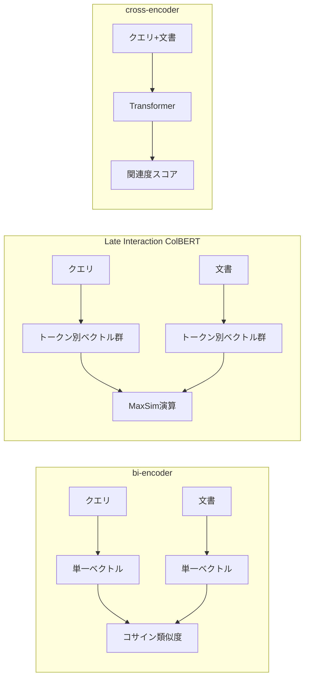

本記事は [Jina-ColBERT-v2: A General-Purpose Multilingual Late Interaction Retriever](https://aclanthology.org/2024.mrl-1.11/)（Jha et al., MRL 2024）の解説記事です。

## 論文概要（Abstract）

著者らは、ColBERTのLate Interaction機構を多言語・汎用のリトリーバーとして改良したJina-ColBERT-v2を提案している。ColBERTのLate Interactionスコアリングは、cross-encoderに近い精度とbi-encoderに近い推論効率を両立する点が特徴である。Jina-ColBERT-v2では、拡張されたコンテキストウィンドウ、多言語対応、およびMatryoshka Representation Lossの導入により、Embedding次元を128から64に削減してもストレージ要件を最大50%削減しつつ検索性能への影響を最小限に抑えたと著者らは報告している。

この記事は [Zenn記事: セマンティック検索の本番精度チューニング：クエリ最適化×多段リランキング×評価ループ実践](https://zenn.dev/0h_n0/articles/42ecab7378cf0b) の深掘りです。

## 情報源

- **会議名**: MRL 2024（Fourth Workshop on Multilingual Representation Learning）
- **年**: 2024年11月
- **URL**: [https://aclanthology.org/2024.mrl-1.11/](https://aclanthology.org/2024.mrl-1.11/)
- **著者**: Rohan Jha, Bo Wang, Michael Günther, Georgios Mastrapas, Saba Sturua, Isabelle Mohr, Andreas Koukounas, Mohammad Kalim Akram, Nan Wang, Han Xiao
- **DOI**: 10.18653/v1/2024.mrl-1.11
- **開催地**: Miami, Florida, USA

## カンファレンス情報

**MRL（Workshop on Multilingual Representation Learning）**について:
- MRLはEMNLP 2024に併設されたワークショップであり、多言語自然言語処理の表現学習に焦点を当てている
- 本論文はJina AI（ベルリン拠点のAI企業）の研究チームによる実用的な多言語検索モデルの提案である

## 技術的詳細（Technical Details）

### Late Interactionとは

Late Interactionは、bi-encoderとcross-encoderの中間に位置するアーキテクチャである。Zenn記事で紹介しているbi-encoder（初期検索）→ cross-encoder（リランキング）の2段階パイプラインに対して、Late Interactionは単一モデルで両方の利点を近似的に実現する。



**bi-encoder**: クエリと文書を独立にエンコードし、各1つのベクトルとしてコサイン類似度を計算。高速だが精度に限界がある。

**cross-encoder**: クエリと文書を結合して同時にTransformerに入力。高精度だがペアごとの推論が必要で遅い。

**Late Interaction（ColBERT）**: クエリと文書を独立にエンコードするが、各トークンのベクトルを保持する。スコアリング時にトークン間のMaxSim演算を行い、cross-encoderに近い精度を実現する。

### ColBERTのMaxSim演算

ColBERTのスコアリングは、クエリの各トークンベクトルと文書の全トークンベクトル間の最大コサイン類似度の総和で計算される。

$$
S(q, d) = \sum_{i=1}^{|q|} \max_{j=1}^{|d|} \mathbf{q}_i^{\top} \mathbf{d}_j
$$

ここで、
- $\mathbf{q}_i$: クエリの$i$番目のトークンベクトル（$\mathbf{q}_i \in \mathbb{R}^{m}$）
- $\mathbf{d}_j$: 文書の$j$番目のトークンベクトル（$\mathbf{d}_j \in \mathbb{R}^{m}$）
- $|q|$: クエリのトークン数
- $|d|$: 文書のトークン数
- $m$: Embedding次元（ColBERTv2では128、Jina-ColBERT-v2では64に削減可能）

この演算のポイントは、クエリの各トークンが文書中で最も関連の高いトークンとマッチする点にある。これにより、クエリと文書の部分的な意味的対応が捉えられる。

### Matryoshka Representation Loss

Jina-ColBERT-v2の主要な技術的貢献の一つが、Matryoshka Representation Loss（MRL）の導入である。MRLは、Embedding ベクトルの先頭 $d'$ 次元だけを使用しても検索性能が維持されるよう、学習時に複数の次元でのロスを同時に最適化する手法である。

$$
\mathcal{L}_{\text{MRL}} = \sum_{d' \in \mathcal{D}} \alpha_{d'} \cdot \mathcal{L}_{\text{retrieval}}(f_{d'}(\mathbf{q}), f_{d'}(\mathbf{d}))
$$

ここで、
- $\mathcal{D}$: 評価する次元の集合（例: {32, 64, 96, 128}）
- $\alpha_{d'}$: 次元 $d'$ に対する重み
- $f_{d'}$: ベクトルの先頭 $d'$ 次元を取り出す射影関数
- $\mathcal{L}_{\text{retrieval}}$: 検索タスクの損失関数（対照学習ロス等）

著者らの報告によると、次元を128から64に削減した場合のストレージ削減は最大50%であり、検索性能への影響は「insignificant（無視できる程度）」とされている。

### ColBERTv2からの改良点

ColBERTv2（Santhanam et al., 2022）からの主な改良点を整理する。

| 特徴 | ColBERTv2 | Jina-ColBERT-v2 |
|------|-----------|-----------------|
| 多言語対応 | 英語中心 | 多言語（100+言語） |
| Embedding次元 | 128固定 | 64-128（Matryoshkaで可変） |
| ストレージ効率 | 残差圧縮 | 残差圧縮 + MRL |
| コンテキスト長 | 制限あり | 拡張コンテキストウィンドウ |
| ベースモデル | BERT系 | XLM-RoBERTa系（推定） |

### 実装例

```python
import torch
from transformers import AutoModel, AutoTokenizer


class ColBERTScorer:
    """ColBERT Late Interactionスコアラー。

    クエリと文書のトークン別ベクトルを使い、
    MaxSim演算でスコアを計算する。

    動作確認: Python 3.11, transformers 4.x, torch 2.x
    """

    def __init__(
        self,
        model_name: str = "jinaai/jina-colbert-v2",
        dim: int = 64,
        device: str | None = None,
    ):
        self.device = device or ("cuda" if torch.cuda.is_available() else "cpu")
        self.tokenizer = AutoTokenizer.from_pretrained(model_name)
        self.model = AutoModel.from_pretrained(model_name, trust_remote_code=True)
        self.model.to(self.device)
        self.model.eval()
        self.dim = dim

    def encode(self, texts: list[str], is_query: bool = False) -> torch.Tensor:
        """テキストをトークン別ベクトルにエンコードする。

        Args:
            texts: テキストのリスト
            is_query: クエリかどうか（プレフィックスが異なる）

        Returns:
            トークン別ベクトルのテンソル
        """
        prefix = "[Q] " if is_query else "[D] "
        prefixed = [prefix + t for t in texts]

        inputs = self.tokenizer(
            prefixed,
            padding=True,
            truncation=True,
            max_length=512,
            return_tensors="pt",
        ).to(self.device)

        with torch.no_grad():
            outputs = self.model(**inputs)
            # 先頭dim次元を使用（Matryoshka）
            embeddings = outputs.last_hidden_state[:, :, :self.dim]
            # L2正規化
            embeddings = torch.nn.functional.normalize(embeddings, p=2, dim=-1)

        return embeddings

    def score(
        self,
        query_embeddings: torch.Tensor,
        doc_embeddings: torch.Tensor,
    ) -> float:
        """MaxSim演算でスコアを計算する。

        Args:
            query_embeddings: クエリのトークン別ベクトル (1, q_len, dim)
            doc_embeddings: 文書のトークン別ベクトル (1, d_len, dim)

        Returns:
            MaxSimスコア
        """
        # (q_len, d_len) の類似度行列
        sim_matrix = torch.matmul(
            query_embeddings.squeeze(0),
            doc_embeddings.squeeze(0).transpose(0, 1),
        )
        # 各クエリトークンについて最大類似度を取り、合計
        max_sim = sim_matrix.max(dim=1).values.sum()
        return float(max_sim)
```

## 実装のポイント（Implementation）

**ストレージとのトレードオフ**: ColBERTのLate Interaction方式では、各文書のトークン別ベクトルを保存する必要がある。これは単一ベクトルのbi-encoderと比較して10-100倍のストレージを必要とする。Jina-ColBERT-v2のMRLによる次元削減（128→64）はこの問題に対する実用的な解決策である。

**インデックス構築**: ColBERTのインデックスは、トークン別ベクトルの効率的な近傍探索を必要とする。ColBERTv2で導入された残差圧縮（residual compression）により、ストレージフットプリントを6-10倍削減しつつ検索品質を維持できる。

**Zenn記事のパイプラインとの関係**: Late Interactionモデルは、bi-encoderの初期検索とcross-encoderのリランキングの間に位置づけられる。bi-encoder → ColBERT → cross-encoderの3段階パイプラインを構成することで、各段階で精度とコストのバランスを取れる。ただし、パイプラインの複雑さが増すため、まずは2段階（bi-encoder → cross-encoder）で十分な精度が得られるか評価することを推奨する。

**多言語対応**: Jina-ColBERT-v2は100以上の言語をサポートしており、日本語ドキュメントの検索にも対応する。Zenn記事で推奨しているBGE-reranker-v2-m3と同様の多言語対応を、Late Interactionアーキテクチャで実現している。

## Production Deployment Guide

### AWS実装パターン（コスト最適化重視）

ColBERTのLate Interactionはトークン別ベクトルの保存と検索が必要であり、ストレージコストの管理が重要となる。

| 規模 | 月間リクエスト | 推奨構成 | 月額コスト | 主要サービス |
|------|--------------|---------|-----------|------------|
| **Small** | ~3,000 (100/日) | Serverless | $70-180 | Lambda + SageMaker Serverless + S3 |
| **Medium** | ~30,000 (1,000/日) | Hybrid | $400-1,000 | ECS Fargate + SageMaker + ElastiCache |
| **Large** | 300,000+ (10,000/日) | Container | $2,000-5,000 | EKS + GPU Spot + PLAID Index |

**ストレージコスト試算**: Matryoshka次元64を使用した場合、1文書あたり平均200トークンとすると、1文書のインデックスサイズは約25KB（200 × 64 × 2バイト）。100万文書で約25GBのストレージが必要。次元128の場合は約50GBとなり、MRLの50%削減効果が顕著に現れる。

**コスト試算の注意事項**:
上記は2026年3月時点のAWS ap-northeast-1（東京）リージョン料金に基づく概算値です。ストレージコストは文書数とトークン長に比例します。最新料金は [AWS料金計算ツール](https://calculator.aws/) で確認してください。

### Terraformインフラコード

**Small構成（Serverless）**

```hcl
resource "aws_iam_role" "lambda_colbert" {
  name = "lambda-colbert-role"
  assume_role_policy = jsonencode({
    Version = "2012-10-17"
    Statement = [{
      Action    = "sts:AssumeRole"
      Effect    = "Allow"
      Principal = { Service = "lambda.amazonaws.com" }
    }]
  })
}

resource "aws_sagemaker_model" "colbert" {
  name               = "jina-colbert-v2"
  execution_role_arn = aws_iam_role.sagemaker_colbert.arn
  primary_container {
    image          = "763104351884.dkr.ecr.ap-northeast-1.amazonaws.com/huggingface-pytorch-inference:2.3.0-transformers4.44.0-gpu-py311-cu121-ubuntu22.04"
    model_data_url = "s3://colbert-models/jina-colbert-v2/model.tar.gz"
    environment = {
      HF_MODEL_ID  = "jinaai/jina-colbert-v2"
      COLBERT_DIM  = "64"
    }
  }
}

resource "aws_sagemaker_endpoint_configuration" "colbert" {
  name = "colbert-serverless-config"
  production_variants {
    variant_name = "default"
    model_name   = aws_sagemaker_model.colbert.name
    serverless_config {
      max_concurrency   = 5
      memory_size_in_mb = 6144
    }
  }
}

resource "aws_sagemaker_endpoint" "colbert" {
  name                 = "colbert-endpoint"
  endpoint_config_name = aws_sagemaker_endpoint_configuration.colbert.name
}

# --- S3（トークン別ベクトルインデックス） ---
resource "aws_s3_bucket" "colbert_index" {
  bucket = "colbert-token-embeddings-index"
}

resource "aws_s3_bucket_server_side_encryption_configuration" "colbert_index" {
  bucket = aws_s3_bucket.colbert_index.id
  rule {
    apply_server_side_encryption_by_default {
      sse_algorithm = "aws:kms"
    }
  }
}

resource "aws_cloudwatch_metric_alarm" "colbert_latency" {
  alarm_name          = "colbert-latency-high"
  comparison_operator = "GreaterThanThreshold"
  evaluation_periods  = 2
  metric_name         = "ModelLatency"
  namespace           = "AWS/SageMaker"
  period              = 300
  statistic           = "p95"
  threshold           = 3000
  alarm_description   = "ColBERT推論P95レイテンシが3秒超過"
}
```

### セキュリティベストプラクティス

- **ネットワーク**: SageMakerエンドポイントはVPCエンドポイント経由
- **認証**: IAMロール最小権限
- **暗号化**: S3インデックス・SageMakerモデルすべてKMS暗号化
- **監査**: CloudTrail有効化

### 運用・監視設定

```sql
-- CloudWatch Logs Insights: ColBERT推論レイテンシ分析
fields @timestamp, query_tokens, doc_tokens, maxsim_latency_ms
| stats avg(maxsim_latency_ms) as avg_lat, pct(maxsim_latency_ms, 95) as p95 by bin(5m)
```

```python
import boto3

cloudwatch = boto3.client('cloudwatch')

cloudwatch.put_metric_alarm(
    AlarmName='colbert-storage-growth',
    ComparisonOperator='GreaterThanThreshold',
    EvaluationPeriods=1,
    MetricName='BucketSizeBytes',
    Namespace='AWS/S3',
    Period=86400,
    Statistic='Average',
    Threshold=50_000_000_000,
    AlarmDescription='ColBERTインデックスが50GBを超過'
)
```

### コスト最適化チェックリスト

- [ ] Matryoshka次元64使用（ストレージ50%削減）
- [ ] ColBERTv2残差圧縮適用（6-10倍削減）
- [ ] S3 Intelligent-Tiering（アクセス頻度に応じた自動階層化）
- [ ] SageMaker Serverless（アイドル時ゼロコスト）
- [ ] GPU Spot Instances（EKS構成で最大90%削減）
- [ ] インデックスの差分更新（全体再構築を回避）
- [ ] バッチエンコード（文書追加時に一括処理）
- [ ] 不要なインデックスバージョンの自動削除
- [ ] Reserved Instances（SageMaker、1年コミットで最大72%削減）
- [ ] AWS Budgets設定（月額予算の80%で警告）
- [ ] Cost Anomaly Detection有効化
- [ ] タグ戦略（インデックス別・言語別でコスト可視化）
- [ ] CloudTrail/Config有効化
- [ ] KMS暗号化（S3/SageMaker）
- [ ] 日次コストレポート（SNS/Slack通知）
- [ ] ストレージ使用量モニタリング（S3 Metrics）
- [ ] モデルバージョニング（A/Bテスト対応）
- [ ] 開発環境のSageMakerエンドポイント夜間停止
- [ ] S3ライフサイクルポリシー（古いインデックスの自動削除）
- [ ] EBS最適化インスタンス使用

## 実験結果（Results）

著者らの報告に基づき、Jina-ColBERT-v2の性能を整理する。

**Matryoshka次元削減の影響**

著者らによると、Embedding次元を128から64に削減した場合の検索性能への影響は「insignificant」（無視できる程度）とされている。これにより、ストレージ要件を最大50%削減できるとのことである。

**英語・多言語ベンチマーク**

英語の検索ベンチマーク（BEIR等）および多言語検索ベンチマークにおいて、Jina-ColBERT-v2は強い性能を示したと報告されている。ColBERTv2が英語中心であったのに対し、100以上の言語をサポートしている点が大きな進歩である。

**Late Interactionの精度-効率トレードオフ**

Late Interactionは、bi-encoderの推論速度（文書エンコードはオフライン）とcross-encoderに近い精度を両立する。ただし、ストレージフットプリントはbi-encoderの10-100倍であり、この点がMatryoshka RLによる次元削減で大幅に改善されている。

## 実運用への応用（Practical Applications）

**Zenn記事のパイプラインへの統合**: Jina-ColBERT-v2は、bi-encoder初期検索の代替として使用できる。MaxSim演算はbi-encoderのコサイン類似度よりも精度が高いため、後段のcross-encoderリランキングの負担を軽減できる。ただし、ストレージ要件の増大を考慮する必要がある。

**多言語RAGシステム**: 日本語を含む多言語ドキュメントの検索において、言語ごとに異なるモデルを使用する必要がなく、単一モデルで統一的な検索パイプラインを構築できる。

**段階的な精度改善**: 現在bi-encoderのみで検索している場合、Jina-ColBERT-v2への移行により、cross-encoderリランキングなしでも精度改善が期待できる。リランキングの追加が不要になる場合、レイテンシ削減にもつながる。

## 関連研究（Related Work）

- **ColBERTv2（Santhanam et al., 2022）**: 残差圧縮とdenoised supervision戦略でLate Interactionのストレージフットプリントを6-10倍削減した基盤論文。Jina-ColBERT-v2はこれを多言語に拡張している
- **ColBERT-XM（2025）**: ゼロショット多言語情報検索のためのモジュラー型マルチベクトル表現モデル。Jina-ColBERT-v2と同時期の多言語Late Interaction研究である
- **TRIAL（EMNLP 2025）**: トークンの重要度を明示的にモデル化するLate Interaction手法。ColBERTのMaxSim演算の限界（全トークンが等価に扱われる）に対処している
- **Matryoshka Representation Learning（Kusupati et al., 2022）**: 複数の次元で同時にロスを最適化する手法。Jina-ColBERT-v2で採用されている次元削減の基盤技術である

## まとめと今後の展望

Jina-ColBERT-v2は、ColBERTのLate Interaction機構を多言語対応に拡張し、Matryoshka Representation Lossによるストレージ効率化を実現したモデルである。著者らの報告では、次元128→64の削減で性能低下を最小限に抑えつつストレージを50%削減できるとされている。

実務への示唆として、bi-encoderの精度不足に悩んでいるがcross-encoderのレイテンシが許容できない場面で、Late Interactionは有力な選択肢となる。特に多言語検索が必要な場面では、Jina-ColBERT-v2の統一的なモデルアーキテクチャが運用面で有利である。今後は、さらなるストレージ圧縮技術や、Late Interactionのリアルタイム検索への適用（近似最近傍探索との組み合わせ）が研究課題として残されている。

## 参考文献

- **Conference URL**: [https://aclanthology.org/2024.mrl-1.11/](https://aclanthology.org/2024.mrl-1.11/)
- **DOI**: [10.18653/v1/2024.mrl-1.11](https://doi.org/10.18653/v1/2024.mrl-1.11)
- **Related Zenn article**: [https://zenn.dev/0h_n0/articles/42ecab7378cf0b](https://zenn.dev/0h_n0/articles/42ecab7378cf0b)

---

:::message
この記事はAI（Claude Code）により自動生成されました。内容は論文の解説であり、筆者自身が実験を行ったものではありません。実際の利用時は原論文もご確認ください。
:::
