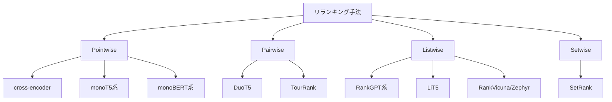

本記事は [How Good are LLM-based Rerankers? An Empirical Analysis of State-of-the-Art Reranking Models](https://aclanthology.org/2025.findings-emnlp.305/)（Abdallah et al., EMNLP 2025 Findings）の解説記事です。

## 論文概要（Abstract）

本論文は、LLMベース・軽量コンテキスト型・ゼロショット型を含む最先端のリランキング手法22種類（40バリエーション）を体系的に評価した実証研究である。著者らはTREC DL19、DL20、BEIRなどの確立されたベンチマークに加え、未知のクエリに対する汎化能力を測定するための新規データセットを用いて評価を行っている。主要な知見として、LLMベースのリランカーは既知のクエリに対して優れた性能を示すが、新規クエリへの汎化能力にはばらつきがあること、また軽量モデルが同等の効率性を示すケースがあることが報告されている。

この記事は [Zenn記事: セマンティック検索の本番精度チューニング：クエリ最適化×多段リランキング×評価ループ実践](https://zenn.dev/0h_n0/articles/42ecab7378cf0b) の深掘りです。

## 情報源

- **会議名**: EMNLP 2025 Findings（Findings of the Association for Computational Linguistics）
- **年**: 2025年11月
- **URL**: [https://aclanthology.org/2025.findings-emnlp.305/](https://aclanthology.org/2025.findings-emnlp.305/)
- **著者**: Abdelrahman Abdallah, Bhawna Piryani, Jamshid Mozafari, Mohammed Ali, Adam Jatowt
- **DOI**: 10.18653/v1/2025.findings-emnlp.305
- **開催地**: Suzhou, China

## カンファレンス情報

**EMNLP（Empirical Methods in Natural Language Processing）**について:
- EMNLPはACL（Association for Computational Linguistics）が主催する自然言語処理分野の主要国際会議の一つである
- Findings trackは本会議に採択されなかった高品質な論文を収録する副会議であり、査読を通過した研究論文が掲載される

## 技術的詳細（Technical Details）

### リランキング手法の分類体系

著者らは、リランキング手法を以下の4つのパラダイムに分類して評価を行っている。



**Pointwise（各文書を独立にスコアリング）**

クエリと文書のペアを入力とし、関連度スコアを独立に算出する方式。cross-encoderモデルが代表例であり、Zenn記事で紹介しているBGE-reranker-v2-m3もこのカテゴリに属する。

$$
s_i = f_{\text{rerank}}(q, d_i), \quad i = 1, \ldots, n
$$

ここで、
- $q$: クエリ
- $d_i$: $i$番目の候補文書
- $s_i$: リランキングスコア
- $f_{\text{rerank}}$: リランキングモデル

計算量は $O(n)$ であり、各ペアの推論を並列化可能だが、候補数に比例してコストが増加する。

**Pairwise（文書ペアの相対的な比較）**

2つの文書を比較し、どちらがクエリにより関連しているかを判定する方式。

$$
p(d_i \succ d_j \mid q) = \sigma(f_{\text{pair}}(q, d_i, d_j))
$$

ここで $\sigma$ はシグモイド関数、$d_i \succ d_j$ は $d_i$ が $d_j$ より関連度が高いことを表す。全ペアの比較には $O(n^2)$ の計算量が必要であり、大規模な候補セットには不向きである。

**Listwise（候補リスト全体を一括処理）**

LLMにTOP-kの候補文書リストを一括で入力し、並べ替え結果を生成させる方式。RankGPT（Sun et al., 2023）が代表的な手法であり、GPT-4やGPT-3.5をリランカーとして使用する。

$$
\pi^* = \arg\max_{\pi} p(\pi \mid q, \{d_1, \ldots, d_n\})
$$

ここで $\pi$ は文書の順列、$\pi^*$ は最適な並び順を表す。LLMのコンテキストウィンドウの制約から、一度に処理できる文書数に上限がある点が制約となる。

**Setwise（集合選択型）**

文書の集合から最適な部分集合を選択する方式。排他的な順位付けではなく、クエリの情報要求を満たす文書群の選定に焦点を当てる。

### 評価に使用されたベンチマーク

| ベンチマーク | 特徴 | クエリ数 | 評価指標 |
|---|---|---|---|
| TREC DL 2019 | MS MARCOパッセージ、深い関連度判定 | 43 | nDCG@10 |
| TREC DL 2020 | MS MARCOパッセージ、深い関連度判定 | 54 | nDCG@10 |
| BEIR | 18種の異種IRデータセット | 多様 | nDCG@10 |
| 新規データセット | 未知クエリへの汎化能力測定 | 論文参照 | nDCG@10 |

著者らは、TREC DLのような訓練データと分布が近いベンチマークと、BEIRのようなドメイン外データセットの両方で評価することにより、既知の分布での性能と汎化能力の両面を測定している。

### 主要な知見

著者らの報告に基づき、主要な知見を整理する。

**1. LLMベースリランカーの強みと弱み**

著者らによると、LLMベースのリランカー（RankGPT系など）は、訓練データの分布に近いクエリ（TREC DL等）では高い精度を示す。しかし、分布が異なる新規クエリに対しては汎化能力にばらつきがあり、一部の軽量モデルが同等以上の性能を示すケースが報告されている。

**2. 軽量モデルの実用的価値**

cross-encoderベースの軽量リランカー（BERTベース等）は、LLMベースの手法と比較してレイテンシが大幅に低く、特定の条件下では性能面でも遜色ないと著者らは指摘している。本番環境でのコスト・レイテンシ制約を考慮すると、軽量モデルの選択が合理的な場面が存在する。

**3. クエリの新規性が性能に与える影響**

著者らが新規に構築したデータセットでの実験により、クエリの新規性（novelty）がリランキング精度に与える影響が明らかにされている。これは、Zenn記事で指摘している「自社データでの計測が必須」というポイントを裏付ける結果である。

## 実装のポイント（Implementation）

本論文の知見をセマンティック検索の本番環境に適用する際の実装上の注意点を整理する。

**パラダイムの選択基準**: pointwise（cross-encoder）は実装のシンプルさとレイテンシのバランスが良く、Zenn記事で推奨しているbi-encoder → cross-encoderの2段階パイプラインに最適である。listwise（RankGPT系）はLLM呼び出しコストが高いため、精度が最重要でコスト制約が緩い場面に限定すべきである。

**汎化能力の事前評価**: 著者らの知見から、自社ドメインのクエリがベンチマークの分布から離れている場合、LLMベースリランカーの性能低下が予想される。Zenn記事で紹介している評価駆動チューニングループの構築が不可欠である。

**モデル選択の実装例**:

```python
from dataclasses import dataclass
from enum import Enum


class RerankParadigm(Enum):
    POINTWISE = "pointwise"
    LISTWISE = "listwise"
    PAIRWISE = "pairwise"


@dataclass
class RerankConfig:
    """リランキング設定。

    本番環境での選択基準:
    - レイテンシ重視: pointwise (cross-encoder)
    - 精度最優先: listwise (RankGPT)
    - コスト重視: pointwise (lightweight cross-encoder)
    """
    paradigm: RerankParadigm
    model_name: str
    max_candidates: int
    top_k: int


def select_reranker(
    latency_budget_ms: int,
    accuracy_priority: bool = False,
) -> RerankConfig:
    """レイテンシ予算と精度要求に基づきリランカーを選択する。

    Args:
        latency_budget_ms: 許容レイテンシ（ミリ秒）
        accuracy_priority: 精度最優先かどうか

    Returns:
        推奨リランキング設定
    """
    if accuracy_priority and latency_budget_ms > 2000:
        return RerankConfig(
            paradigm=RerankParadigm.LISTWISE,
            model_name="gpt-4o-mini",
            max_candidates=20,
            top_k=10,
        )
    elif latency_budget_ms > 200:
        return RerankConfig(
            paradigm=RerankParadigm.POINTWISE,
            model_name="BAAI/bge-reranker-v2-m3",
            max_candidates=100,
            top_k=20,
        )
    else:
        return RerankConfig(
            paradigm=RerankParadigm.POINTWISE,
            model_name="cross-encoder/ms-marco-MiniLM-L-6-v2",
            max_candidates=50,
            top_k=10,
        )
```

## Production Deployment Guide

### AWS実装パターン（コスト最適化重視）

リランキングパイプラインのAWS構成は、選択するパラダイム（pointwise vs listwise）によって大きく異なる。

| 規模 | 月間リクエスト | 推奨構成 | 月額コスト | 主要サービス |
|------|--------------|---------|-----------|------------|
| **Small** | ~3,000 (100/日) | Serverless | $60-150 | Lambda + SageMaker Serverless (cross-encoder) |
| **Medium** | ~30,000 (1,000/日) | Hybrid | $350-900 | ECS Fargate + SageMaker + ElastiCache |
| **Large** | 300,000+ (10,000/日) | Container | $2,000-5,000 | EKS + GPU Spot + SageMaker Endpoint |

**Small構成の詳細**（月額$60-150）:
- **Lambda**: リクエストルーティング、1GB RAM（$15/月）
- **SageMaker Serverless**: cross-encoderモデルホスティング（$80/月）
- **OpenSearch Serverless**: 初期検索+ベクトルインデックス（$25/月）
- **CloudWatch**: 基本監視（$5/月）

**コスト削減テクニック**:
- Pointwiseリランカー選択でLLM API呼び出しコストを回避
- SageMaker Serverless Inferenceでアイドル時コストゼロ
- ElastiCacheでリランキング結果をキャッシュ（同一クエリ対応）
- GPU Spot Instancesでcross-encoder推論コスト最大90%削減

**コスト試算の注意事項**:
上記は2026年3月時点のAWS ap-northeast-1（東京）リージョン料金に基づく概算値です。実際のコストはモデルサイズ、候補文書数、推論バッチサイズにより変動します。最新料金は [AWS料金計算ツール](https://calculator.aws/) で確認してください。

### Terraformインフラコード

**Small構成（Serverless）: Lambda + SageMaker Serverless**

```hcl
# --- IAMロール（最小権限） ---
resource "aws_iam_role" "lambda_rerank" {
  name = "lambda-rerank-role"
  assume_role_policy = jsonencode({
    Version = "2012-10-17"
    Statement = [{
      Action    = "sts:AssumeRole"
      Effect    = "Allow"
      Principal = { Service = "lambda.amazonaws.com" }
    }]
  })
}

resource "aws_iam_role_policy" "sagemaker_invoke" {
  role = aws_iam_role.lambda_rerank.id
  policy = jsonencode({
    Version = "2012-10-17"
    Statement = [{
      Effect   = "Allow"
      Action   = ["sagemaker:InvokeEndpoint"]
      Resource = aws_sagemaker_endpoint.reranker.arn
    }]
  })
}

# --- SageMaker Serverless Endpoint (cross-encoder) ---
resource "aws_sagemaker_model" "reranker" {
  name               = "bge-reranker-v2-m3"
  execution_role_arn = aws_iam_role.sagemaker_rerank.arn

  primary_container {
    image          = "763104351884.dkr.ecr.ap-northeast-1.amazonaws.com/huggingface-pytorch-inference:2.3.0-transformers4.44.0-cpu-py311-ubuntu22.04"
    model_data_url = "s3://reranker-models/bge-reranker-v2-m3/model.tar.gz"
    environment = {
      HF_MODEL_ID = "BAAI/bge-reranker-v2-m3"
      HF_TASK     = "text-classification"
    }
  }
}

resource "aws_sagemaker_endpoint_configuration" "reranker" {
  name = "reranker-serverless-config"
  production_variants {
    variant_name           = "default"
    model_name             = aws_sagemaker_model.reranker.name
    serverless_config {
      max_concurrency = 5
      memory_size_in_mb = 4096
    }
  }
}

resource "aws_sagemaker_endpoint" "reranker" {
  name                 = "reranker-endpoint"
  endpoint_config_name = aws_sagemaker_endpoint_configuration.reranker.name
}

# --- Lambda関数 ---
resource "aws_lambda_function" "rerank_handler" {
  filename      = "rerank_lambda.zip"
  function_name = "rerank-pipeline-handler"
  role          = aws_iam_role.lambda_rerank.arn
  handler       = "index.handler"
  runtime       = "python3.12"
  timeout       = 60
  memory_size   = 512

  environment {
    variables = {
      SAGEMAKER_ENDPOINT = aws_sagemaker_endpoint.reranker.name
      TOP_K              = "20"
      MAX_CANDIDATES     = "100"
    }
  }
}

# --- CloudWatch アラーム ---
resource "aws_cloudwatch_metric_alarm" "rerank_latency" {
  alarm_name          = "rerank-latency-high"
  comparison_operator = "GreaterThanThreshold"
  evaluation_periods  = 2
  metric_name         = "ModelLatency"
  namespace           = "AWS/SageMaker"
  period              = 300
  statistic           = "p95"
  threshold           = 5000
  alarm_description   = "リランキングP95レイテンシが5秒超過"
}
```

**Large構成（Container）: EKS + GPU Spot**

```hcl
module "eks" {
  source          = "terraform-aws-modules/eks/aws"
  version         = "~> 20.0"
  cluster_name    = "rerank-cluster"
  cluster_version = "1.31"
  vpc_id          = module.vpc.vpc_id
  subnet_ids      = module.vpc.private_subnets
  cluster_endpoint_public_access = true
  enable_cluster_creator_admin_permissions = true
}

resource "kubectl_manifest" "gpu_nodepool" {
  yaml_body = <<-YAML
    apiVersion: karpenter.sh/v1
    kind: NodePool
    metadata:
      name: reranker-gpu
    spec:
      template:
        spec:
          requirements:
            - key: karpenter.sh/capacity-type
              operator: In
              values: ["spot"]
            - key: node.kubernetes.io/instance-type
              operator: In
              values: ["g5.xlarge", "g5.2xlarge"]
          limits:
            cpu: "32"
            memory: "128Gi"
            nvidia.com/gpu: "4"
      disruption:
        consolidationPolicy: WhenEmptyOrUnderutilized
        consolidateAfter: 60s
  YAML
}

resource "aws_budgets_budget" "rerank_monthly" {
  name         = "rerank-monthly-budget"
  budget_type  = "COST"
  limit_amount = "5000"
  limit_unit   = "USD"
  time_unit    = "MONTHLY"

  notification {
    comparison_operator        = "GREATER_THAN"
    threshold                  = 80
    threshold_type             = "PERCENTAGE"
    notification_type          = "ACTUAL"
    subscriber_email_addresses = ["ops@example.com"]
  }
}
```

### セキュリティベストプラクティス

- **ネットワーク**: SageMakerエンドポイントはVPCエンドポイント経由アクセス
- **認証**: IAMロール最小権限、SageMaker InvokeEndpoint権限をモデル単位で制限
- **暗号化**: モデルアーティファクト（S3）、推論データすべてKMS暗号化
- **監査**: CloudTrail有効化、SageMaker推論ログをCloudWatch Logsに出力

### 運用・監視設定

```sql
-- CloudWatch Logs Insights: リランキングレイテンシ分析
fields @timestamp, query, rerank_latency_ms, model_name, candidates_count
| stats avg(rerank_latency_ms) as avg_lat, pct(rerank_latency_ms, 95) as p95 by bin(5m)
| filter rerank_latency_ms > 1000
```

```python
import boto3

cloudwatch = boto3.client('cloudwatch')

cloudwatch.put_metric_alarm(
    AlarmName='reranker-invocation-spike',
    ComparisonOperator='GreaterThanThreshold',
    EvaluationPeriods=1,
    MetricName='InvocationsPerInstance',
    Namespace='AWS/SageMaker',
    Period=3600,
    Statistic='Sum',
    Threshold=10000,
    AlarmDescription='リランカー呼び出し数が1時間1万回を超過'
)
```

### コスト最適化チェックリスト

- [ ] ~100 req/日 → Lambda + SageMaker Serverless - $60-150/月
- [ ] ~1,000 req/日 → ECS + SageMaker Real-time - $350-900/月
- [ ] 10,000+ req/日 → EKS + GPU Spot - $2,000-5,000/月
- [ ] Pointwiseリランカー選択でLLM APIコスト回避
- [ ] SageMaker Serverless Inferenceでアイドル時ゼロコスト
- [ ] GPU Spot Instances使用（最大90%削減、Karpenter管理）
- [ ] リランキング結果キャッシュ（ElastiCache、TTL 1時間）
- [ ] 初期検索Top-k削減でリランキング対象数最適化
- [ ] cross-encoderのバッチ推論（複数ペアを一括処理）
- [ ] Reserved Instances（SageMaker、1年コミットで最大72%削減）
- [ ] AWS Budgets設定（月額予算の80%で警告）
- [ ] SageMaker Model Monitorでモデル劣化検知
- [ ] Cost Anomaly Detection有効化
- [ ] タグ戦略（環境別・モデル別でコスト可視化）
- [ ] SageMaker推論ログをCloudWatch Logsで分析
- [ ] 不要なSageMakerエンドポイント自動削除
- [ ] モデル蒸留による軽量化検討（推論コスト削減）
- [ ] A/Bテスト環境のコスト管理（Traffic Splitting）
- [ ] CloudTrail/Config有効化（セキュリティ監査）
- [ ] 日次コストレポート（SNS/Slack通知）

## 実験結果（Results）

著者らの評価結果から読み取れる主要な知見を整理する。

**LLMベースvs軽量リランカーの性能比較**

著者らの報告によると、LLMベースのリランカー（RankGPT系のlistwise手法等）はTREC DL19/DL20のような訓練分布に近いベンチマークで高い性能を示す。一方、BEIRのようなドメイン外データセットでは、軽量なcross-encoderモデルが同等以上の性能を達成するケースが確認されている。

**クエリ新規性の影響**

著者らが新規に構築したデータセットを用いた実験では、既存ベンチマークで高性能を示すLLMベースリランカーであっても、未知のクエリ分布に対しては性能低下が観察されている。この知見は、特定のベンチマークスコアだけでモデルを選定することのリスクを示唆している。

**パラダイム別の特性**

著者らの分析によると、pointwise（cross-encoder）手法は安定した性能とスケーラビリティのバランスに優れ、listwise（LLM）手法は少数の候補に対して精密な順位付けが可能だが、コストとレイテンシが高い。pairwise手法は計算量の制約から大規模候補セットには不向きである。

## 実運用への応用（Practical Applications）

本論文の知見は、Zenn記事で紹介しているリランカー選定戦略を裏付ける実証的根拠を提供している。

**モデル選定への示唆**: 著者らの結果から、自社ドメインのクエリ分布が標準ベンチマーク（TREC DL等）と異なる場合は、LLMベースリランカーの優位性が減少する可能性がある。Zenn記事で推奨しているように、自社データでの評価が不可欠である。

**コスト効率**: pointwise cross-encoderは推論コストがLLMベースの1/10以下であり、多くの本番環境で十分な精度を達成できる。GPUサーバーでBGE-reranker-v2-m3を運用する場合、100候補のリランキングが50-100msで完了する。

**段階的な導入**: まずcross-encoderリランカーを導入し、評価ループで効果を確認した後、必要に応じてLLMベースのリランカーを追加するアプローチが、著者らの知見と整合する。

## 関連研究（Related Work）

- **RankGPT（Sun et al., 2023）**: GPT-4をlistwiseリランカーとして使用する先駆的研究。本論文で評価されているLLMベースリランカーの主要手法の一つである
- **monoT5/duoT5（Nogueira et al., 2020）**: T5をpointwise/pairwiseリランカーとして使用する手法。軽量でありながら高い性能を示すことが報告されている
- **BGE-reranker（BAAI, 2024）**: 多言語対応のpointwise cross-encoderリランカー。Zenn記事でも推奨されており、本論文の評価でもOSSモデルとして高い性能を示している
- **ColBERTv2（Santhanam et al., 2022）**: Late interactionによるリランキング手法。cross-encoderとbi-encoderの中間的な計算量で効率的な検索を実現する

## まとめと今後の展望

本論文は、22手法・40バリエーションのリランカーを体系的に比較した包括的な実証研究である。著者らの主要な知見として、LLMベースリランカーは既知のクエリ分布では高い性能を示すが汎化能力にばらつきがあること、軽量cross-encoderが多くの場面で実用的な選択肢であることが報告されている。

実務への示唆として、ベンチマークスコアのみでモデルを選定するのではなく、自社ドメインのクエリ分布に対する評価が不可欠であるという点が、本論文の最も重要なメッセージである。Zenn記事で紹介している評価駆動チューニングループの構築を通じて、最適なリランカーと設定を特定することが推奨される。

## 参考文献

- **Conference URL**: [https://aclanthology.org/2025.findings-emnlp.305/](https://aclanthology.org/2025.findings-emnlp.305/)
- **DOI**: [10.18653/v1/2025.findings-emnlp.305](https://doi.org/10.18653/v1/2025.findings-emnlp.305)
- **Related Zenn article**: [https://zenn.dev/0h_n0/articles/42ecab7378cf0b](https://zenn.dev/0h_n0/articles/42ecab7378cf0b)

---

:::message
この記事はAI（Claude Code）により自動生成されました。内容は論文の解説であり、筆者自身が実験を行ったものではありません。実際の利用時は原論文もご確認ください。
:::
