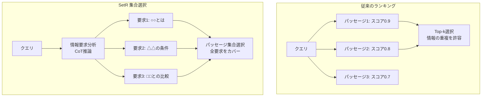

本記事は [Shifting from Ranking to Set Selection for Retrieval Augmented Generation](https://aclanthology.org/2025.acl-long.861/)（Lee et al., ACL 2025）の解説記事です。

## 論文概要（Abstract）

従来のRAGパイプラインでは、検索結果の順位付け（ランキング）に基づいてLLMに渡すパッセージを選択する。著者らはこのアプローチの限界を指摘し、**SetR（Set-wise passage selection for RAG）**を提案している。SetRは、クエリの情報要求をChain-of-Thought（CoT）推論で分析し、個々のパッセージの順位ではなく、情報要求を集合的に満たす最適なパッセージ群を選択する手法である。著者らの報告によると、SetRは商用LLMベースリランカーやオープンソースのリランキングベースラインに対して、回答精度と検索品質の両面で上回る性能を達成したとされている。

この記事は [Zenn記事: セマンティック検索の本番精度チューニング：クエリ最適化×多段リランキング×評価ループ実践](https://zenn.dev/0h_n0/articles/42ecab7378cf0b) の深掘りです。

## 情報源

- **会議名**: ACL 2025（63rd Annual Meeting of the Association for Computational Linguistics）
- **年**: 2025年
- **URL**: [https://aclanthology.org/2025.acl-long.861/](https://aclanthology.org/2025.acl-long.861/)
- **著者**: Dahyun Lee, Yongrae Jo, Haeju Park, Moontae Lee
- **DOI**: 10.18653/v1/2025.acl-long.861
- **開催地**: Vienna, Austria
- **公式コード**: [https://github.com/LGAI-Research/SetR](https://github.com/LGAI-Research/SetR)

## カンファレンス情報

**ACL（Association for Computational Linguistics）**について:
- ACLは自然言語処理・計算言語学分野の最高峰国際会議の一つであり、Long Paperとしての採択は高い評価を意味する
- 本論文はLong Paper（Volume 1）として採択されている

## 技術的詳細（Technical Details）

### ランキング vs 集合選択

従来のリランキングアプローチでは、各パッセージを独立にスコアリングして上位k件を選択する。この方式の根本的な限界は、パッセージ間の情報の重複や補完関係を考慮しない点にある。



例えば、「Pythonの非同期処理でWebスクレイピングのエラーハンドリングを行うには？」というクエリを考える。このクエリには複数の情報要求が含まれている。

1. Pythonの非同期処理の仕組み
2. Webスクレイピングの技術
3. エラーハンドリングのパターン

従来のランキングでは、各パッセージを個別にスコアリングするため、1番と2番の情報は高スコアのパッセージに含まれるが、3番のエラーハンドリングに関する情報が欠落する可能性がある。SetRは情報要求を明示的に分析し、すべての要求をカバーするパッセージ集合を選択する。

### SetRのアルゴリズム

著者らのSetRは以下の3ステップで構成される。

**Step 1: 情報要求の分析（CoT推論）**

LLMにクエリを入力し、Chain-of-Thought推論で情報要求を明示的に分解する。

$$
\mathcal{R} = \text{CoT}(q) = \{r_1, r_2, \ldots, r_m\}
$$

ここで、
- $q$: ユーザークエリ
- $\mathcal{R}$: 分解された情報要求の集合
- $r_i$: 個別の情報要求
- $m$: 情報要求の数

**Step 2: パッセージ-要求マッチング**

各候補パッセージが、各情報要求を満たすかどうかを判定する。

$$
M(p_j, r_i) = \begin{cases} 1 & \text{if } p_j \text{ satisfies } r_i \\ 0 & \text{otherwise} \end{cases}
$$

ここで $p_j$ は $j$ 番目の候補パッセージである。

**Step 3: 最適集合選択**

すべての情報要求をカバーしつつ、最小のパッセージ集合を選択する（集合被覆問題に帰着）。

$$
S^* = \arg\min_{S \subseteq P} |S| \quad \text{s.t.} \quad \bigcup_{p \in S} \{r_i : M(p, r_i) = 1\} = \mathcal{R}
$$

実装上は、LLMに候補パッセージのリストと情報要求のリストを同時に入力し、最適な部分集合を出力させる。

### 実装例

```python
from dataclasses import dataclass
from openai import OpenAI

client = OpenAI()


@dataclass
class InformationRequirement:
    """情報要求。"""
    description: str
    satisfied_by: list[int]  # パッセージインデックスのリスト


@dataclass
class SetRResult:
    """SetRの出力。"""
    selected_passages: list[str]
    requirements: list[InformationRequirement]
    coverage: float  # カバー率


def analyze_information_requirements(query: str) -> list[str]:
    """クエリからCoT推論で情報要求を分析する。

    Args:
        query: ユーザークエリ

    Returns:
        情報要求のリスト
    """
    prompt = f"""以下のクエリに回答するために必要な情報要求を分析してください。
Chain-of-Thought推論を使い、必要な情報を明示的にリストアップしてください。
各要求は1行ずつ出力してください。

クエリ: {query}

情報要求:"""

    response = client.chat.completions.create(
        model="gpt-4o-mini",
        messages=[{"role": "user", "content": prompt}],
        temperature=0.0,
        max_tokens=512,
    )
    requirements = response.choices[0].message.content.strip().split("\n")
    return [r.strip().lstrip("0123456789.-) ") for r in requirements if r.strip()]


def select_optimal_set(
    query: str,
    candidates: list[str],
    requirements: list[str],
    max_passages: int = 5,
) -> SetRResult:
    """SetR: 情報要求を最大限カバーするパッセージ集合を選択する。

    Args:
        query: ユーザークエリ
        candidates: 候補パッセージのリスト
        requirements: 情報要求のリスト
        max_passages: 選択する最大パッセージ数

    Returns:
        選択結果
    """
    candidates_text = "\n".join(
        f"[{i}] {c[:200]}..." for i, c in enumerate(candidates)
    )
    requirements_text = "\n".join(
        f"({j}) {r}" for j, r in enumerate(requirements)
    )

    prompt = f"""以下の情報要求をすべてカバーするパッセージの最小集合を選択してください。
最大{max_passages}個まで選択できます。各パッセージがどの情報要求を満たすかも示してください。

クエリ: {query}

情報要求:
{requirements_text}

候補パッセージ:
{candidates_text}

JSON形式で出力してください:
{{"selected": [パッセージ番号のリスト], "coverage": {{番号: [満たす要求番号リスト]}}}}"""

    response = client.chat.completions.create(
        model="gpt-4o-mini",
        messages=[{"role": "user", "content": prompt}],
        temperature=0.0,
        max_tokens=512,
        response_format={"type": "json_object"},
    )

    import json
    result = json.loads(response.choices[0].message.content)
    selected_indices = result.get("selected", [])

    return SetRResult(
        selected_passages=[candidates[i] for i in selected_indices if i < len(candidates)],
        requirements=[
            InformationRequirement(
                description=requirements[j],
                satisfied_by=selected_indices,
            )
            for j in range(len(requirements))
        ],
        coverage=len(set().union(*result.get("coverage", {}).values())) / len(requirements)
        if requirements else 0.0,
    )
```

## 実装のポイント（Implementation）

**マルチホップQAでの優位性**: SetRは、複数のパッセージにまたがる情報を統合する必要があるマルチホップ質問応答で特に有効である。単一パッセージで回答できる単純なクエリに対しては、従来のランキングと同等の性能が期待される。

**計算コスト**: SetRはLLM呼び出しが必要であり、pointwise cross-encoderよりもレイテンシとコストが高い。ただし、listwise LLMリランカー（RankGPT等）と比較すると、情報要求分析が一度の呼び出しで完了するため、候補数に依存するlistwiseの複数回呼び出しよりも効率的な場合がある。

**段階的統合**: Zenn記事のパイプラインへの統合としては、cross-encoderリランキング（Top 100 → Top 20）の後段にSetRを配置し、Top 20 → Top 5の最終選択に使用する構成が考えられる。これにより、SetRのLLM呼び出しコストを候補数20件に限定できる。

**評価指標の選択**: SetRは順位ではなく集合の品質を最適化するため、NDCG@kよりもRecall@kやAnswer Correctnessでの評価が適している。Zenn記事で紹介している評価ループにAnswer Correctness指標を追加することが推奨される。

## 実験結果（Results）

著者らの報告に基づき、SetRの性能を整理する。

**マルチホップQAベンチマーク**

著者らによると、SetRは商用LLMベースリランカー（GPT-4ベース等）およびオープンソースのリランキングベースラインに対して、回答正確性（Answer Correctness）と検索品質（Retrieval Quality）の両面で上回る性能を達成したとされている。特にマルチホップQAタスク（HotpotQA、MuSiQue等）で顕著な改善が報告されている。

**従来リランカーとの比較**

SetRの集合選択アプローチは、従来のpointwise/listwise/pairwiseリランキングとは異なるパラダイムであり、情報の重複排除と補完性を明示的に最適化する点が特徴的である。著者らはこれにより、LLMに渡されるコンテキストの情報密度が向上し、最終的な回答品質が改善されたと分析している。

## 実運用への応用（Practical Applications）

**適用場面**: SetRは以下の場面で特に有効である。
- 複合質問（複数の情報を必要とするクエリ）の検索
- RAGパイプラインでLLMに渡すコンテキストウィンドウが限られている場合
- 検索結果の多様性（diversity）が重要な場面

**Zenn記事のパイプラインとの統合**: Zenn記事で紹介しているbi-encoder → cross-encoder → 最終結果のパイプラインに、SetRを最終段として追加することで、情報の網羅性を改善できる。ただし、LLM呼び出しコストとレイテンシの増加を考慮する必要がある。

**制約事項**: SetRはCoT推論をLLMに依存するため、推論品質がLLMの能力に左右される。また、単純なキーワード検索やFAQ検索では、従来のリランキングで十分な場合が多い。

## 関連研究（Related Work）

- **RankGPT（Sun et al., 2023）**: LLMをlistwiseリランカーとして使用する手法。SetRと同様にLLMを活用するが、RankGPTは順位付けに焦点を当てており、情報の重複排除は考慮しない
- **MMR（Maximal Marginal Relevance, Carbonell & Goldstein, 1998）**: 検索結果の多様性を確保する古典的手法。SetRのカバレッジ概念と関連するが、MMRは貪欲法による近似であり、情報要求の明示的分析は行わない
- **RAG-Fusion（Rackauckas, 2023）**: 複数クエリで検索し結果を統合する手法。SetRはクエリ側ではなく結果側の最適化に焦点を当てている
- **Self-RAG（Asai et al., 2023）**: 検索結果の品質を自己評価するRAG手法。SetRの集合選択と相補的に使用可能である

## まとめと今後の展望

SetRは、RAGにおけるパッセージ選択をランキングから集合選択にパラダイムシフトさせた研究である。著者らのCoT推論による情報要求分析と最適集合選択は、特にマルチホップQAタスクで有効性が報告されている。

実務への示唆として、Zenn記事で紹介しているリランキングパイプラインの最終段にSetRの集合選択を配置することで、LLMに渡すコンテキストの情報密度を向上させる可能性がある。ただし、LLM呼び出しコストと複雑さの増加を考慮し、まずは評価ループで効果を計測してから導入することが推奨される。

## 参考文献

- **Conference URL**: [https://aclanthology.org/2025.acl-long.861/](https://aclanthology.org/2025.acl-long.861/)
- **Code**: [https://github.com/LGAI-Research/SetR](https://github.com/LGAI-Research/SetR)
- **DOI**: [10.18653/v1/2025.acl-long.861](https://doi.org/10.18653/v1/2025.acl-long.861)
- **Related Zenn article**: [https://zenn.dev/0h_n0/articles/42ecab7378cf0b](https://zenn.dev/0h_n0/articles/42ecab7378cf0b)

---

:::message
この記事はAI（Claude Code）により自動生成されました。内容は論文の解説であり、筆者自身が実験を行ったものではありません。実際の利用時は原論文および公式実装もご確認ください。
:::
