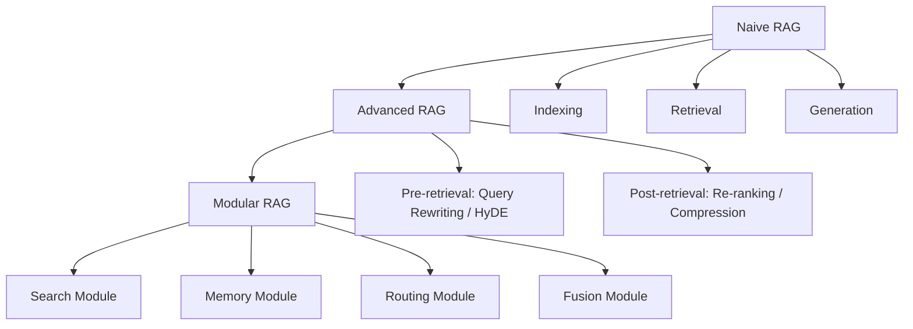

本記事は <https://arxiv.org/abs/2312.10997> の解説記事です。本記事は論文の引用・解説であり、筆者自身が実験を行ったものではありません。

## 論文概要（Abstract）

Gao et al. (2023) は、Retrieval-Augmented Generation（RAG）に関する包括的サーベイを提示している。LLMが抱えるハルシネーション、知識の陳腐化、推論根拠の不透明性といった課題に対し、外部知識ベースからの検索を生成プロセスに統合するRAGの手法群を体系的に整理した。著者らはRAGの発展段階をNaive RAG、Advanced RAG、Modular RAGの3パラダイムに分類し、各段階の技術的特徴と課題を論じている。さらに、検索・生成・拡張の各コンポーネントにおける最新技術と、RAGASやARES等の評価フレームワークを網羅的に調査している。

この記事は [Zenn記事: Haystack 2.xのQAパイプラインを本番運用する：カスタムComponent・非同期実行・監視まで](https://zenn.dev/0h_n0/articles/6555f50d3f85ce) の深掘りです。

## 情報源

- **arXiv ID**: 2312.10997
- **URL**: <https://arxiv.org/abs/2312.10997>
- **著者**: Yunfan Gao, Yun Xiong, Xinyu Gao et al.
- **発表年**: 2023
- **分野**: cs.CL, cs.AI

## 背景と動機（Background & Motivation）

LLMは大規模コーパスで事前学習されるが、学習データに含まれない知識やカットオフ以降の情報を扱えないという本質的な制約がある。また、生成テキストの根拠を追跡できないため、事実と異なる出力（ハルシネーション）が発生する。RAGは検索によって外部知識を動的に取得し、生成モデルのコンテキストに挿入することでこれらの課題を緩和する。

著者らは、RAGの手法が急速に多様化する一方で、体系的な整理が不足していると指摘している。Naive RAGの単純なパイプラインでは検索精度やチャンク分割の問題が顕在化し、それを解決するAdvanced RAG、さらにモジュール単位で組み替え可能なModular RAGへと進化した経緯がある。本サーベイは、この発展を俯瞰的に捉え、実務者と研究者の双方に向けた技術マップを提供することを目的としている。

## 主要な貢献（Key Contributions）

- **RAGの3段階パラダイム分類**: Naive RAG → Advanced RAG → Modular RAGという発展段階を定義し、各段階の技術的特徴・課題・代表手法を整理した
- **コンポーネント別技術の網羅的調査**: 検索（sparse/dense/hybrid）、生成（prompt engineering/fine-tuning）、拡張（pre-retrieval/post-retrieval）の各要素技術を分類・比較している
- **評価フレームワークの体系化**: RAGAS、ARES、TruLens、RGBといった評価手法の比較と、Faithfulness・Answer Relevance・Context Precision等の評価指標を整理した
- **今後の研究方向の提示**: Long-context RAG、Multi-modal RAG、Agent統合RAG等の発展方向を示している

## 技術的詳細（Technical Details）

### RAGの3パラダイム

著者らはRAGの発展を以下の3段階に分類している。

**Naive RAG** は Indexing → Retrieval → Generation の3ステップで構成される基本パイプラインである。文書をチャンクに分割し埋め込みベクトルとしてインデックス化し、クエリとのベクトル類似度で検索し、検索結果をプロンプトに含めてLLMで回答を生成する。著者らは、このアプローチには検索精度の低さ、不適切なチャンク分割、コンテキスト中間部の情報を見落とす"Lost in the middle"問題があると報告している。

**Advanced RAG** はPre-retrievalとPost-retrievalの処理を導入して検索品質を改善する。Pre-retrieval段階ではクエリ書き換え（Query Rewriting）、仮説的文書生成（HyDE）、段階的抽象化（Step-Back Prompting）等の手法でクエリを最適化する。Post-retrieval段階ではRe-ranking、コンテキスト圧縮、Maximal Marginal Relevance（MMR）による多様性確保を行う。

**Modular RAG** は交換可能なモジュールとしてRAGパイプラインを構成する設計思想である。Search、Memory、Fusion、Routing、Predict、Task Adapterといったモジュールを組み合わせることで、タスクやドメインに応じた柔軟なパイプライン構築が可能となる。



### 検索技術の分類

著者らは検索手法を以下のように分類している。

**Sparse retrieval** はBM25やTF-IDFに基づく語彙マッチングで、キーワードの一致度で文書をランク付けする。計算コストが低く解釈性が高いが、同義語や言い換えを捉えられない。

**Dense retrieval** はDPR、Contriever、E5、BGE等の埋め込みモデルを用いた意味的類似度検索である。クエリと文書をベクトル空間にマッピングし、コサイン類似度やドット積で近傍を探索する。

**Hybrid retrieval** はsparseとdenseの検索結果をReciprocal Rank Fusion（RRF）等で統合する手法である。RRFのスコアは以下の式で計算される。

$$
\text{RRF\_score}(d) = \sum_{r \in R} \frac{1}{k + r(d)}
$$

ここで、
- $R$: ランク付けリストの集合（例: BM25のリストとdense retrievalのリスト）
- $r(d)$: リスト$r$における文書$d$の順位
- $k$: 平滑化パラメータ（論文では$k = 60$が標準的とされる）

RRFは各リストでの順位の逆数を合算する単純な手法だが、異なる検索手法のスコアスケールを正規化せずに統合できる利点がある。

### 高度なRAG手法

著者らは以下の代表的な高度RAG手法を紹介している。

**Self-RAG** (Asai et al., 2023) は生成過程で4種類の反射トークンを用いて自己評価を行う手法である。

```python
from dataclasses import dataclass
from enum import Enum

class RetrievalDecision(Enum):
    """Self-RAGの検索判断トークン"""
    RETRIEVE = "yes"
    NO_RETRIEVE = "no"
    CONTINUE = "continue"

@dataclass
class ReflectionTokens:
    """Self-RAGの4つの反射トークン

    Attributes:
        retrieve: 検索が必要かの判断
        is_relevant: 検索結果がクエリに関連するか
        is_supported: 生成文が検索結果に裏付けられるか
        is_useful: 最終回答がユーザに有用か
    """
    retrieve: RetrievalDecision   # [Retrieve]
    is_relevant: bool             # [IsREL]
    is_supported: bool            # [IsSUP]
    is_useful: int                # [IsUSE] (1-5)

def self_rag_generate(
    query: str,
    generator,
    retriever,
    threshold: float = 0.5,
) -> str:
    """Self-RAGの生成ループ（簡略化）

    Args:
        query: ユーザクエリ
        generator: 反射トークン付き生成モデル
        retriever: 文書検索器
        threshold: 検索トリガーの確率閾値

    Returns:
        生成されたテキスト
    """
    output_segments: list[str] = []
    current_input = query

    for _ in range(max_segments := 10):
        # Step 1: 検索要否の判断
        retrieve_prob = generator.predict_retrieve(current_input)
        if retrieve_prob > threshold:
            docs = retriever.search(current_input, top_k=5)
            # Step 2: 各文書の関連性評価
            relevant_docs = [
                d for d in docs
                if generator.predict_relevance(current_input, d)
            ]
            if not relevant_docs:
                relevant_docs = docs[:1]  # fallback
            context = "\n".join(relevant_docs)
        else:
            context = ""

        # Step 3: コンテキスト付き生成
        segment = generator.generate(current_input, context)

        # Step 4: 生成文の裏付け評価
        if context and not generator.predict_support(segment, context):
            segment = generator.regenerate(current_input, context)

        output_segments.append(segment)
        if generator.is_complete(segment):
            break
        current_input = query + " " + " ".join(output_segments)

    return " ".join(output_segments)
```

**HyDE** (Hypothetical Document Embeddings) はクエリからLLMで仮説的な回答文書を生成し、その埋め込みベクトルで検索する手法である。実際のクエリよりも回答に近い文書表現を得ることで、検索精度を向上させる。

**RAG-Fusion** は元のクエリから複数のバリアントを生成し、各バリアントで並列に検索を実行した後、RRFで結果を統合する手法である。クエリの多様性により、単一クエリでは到達できない関連文書を網羅的に取得できる。

**FLARE** (Forward-Looking Active REtrieval) は生成中に低確率トークンを検出し、その時点で動的に検索を実行する手法である。生成モデルが確信度の低い箇所でのみ検索を行うため、不要な検索を抑制しつつ事実性を担保する。

### 評価フレームワーク

著者らは以下の評価フレームワークを比較している。

| フレームワーク | 手法 | 評価指標 | 特徴 |
|:---|:---|:---|:---|
| RAGAS | LLM-as-Judge | Faithfulness, Answer Relevance, Context Precision | コード不要、即座に利用可能 |
| ARES | Fine-tuned DeBERTa分類器 | 同上 + Context Relevance | LLM評価よりコスト効率的 |
| TruLens | LLMフィードバック関数 | カスタム指標定義可能 | 柔軟だが設定コスト高 |
| RGB | 4軸ロバスト性評価 | Noise Robustness, Negative Rejection, Information Integration, Counterfactual Robustness | ノイズ耐性に特化 |

主要な定量指標として、検索段階ではHit Rate、MRR（Mean Reciprocal Rank）、NDCG（Normalized Discounted Cumulative Gain）が使用され、生成段階ではFaithfulness、Answer Relevance、BERTScoreが使用される。

## 実装のポイント（Implementation）

本サーベイの内容をHaystackのようなRAGフレームワークで実装する際の要点を以下に示す。

**チャンク分割戦略**: Naive RAGでの課題として著者らが指摘するチャンク分割問題に対しては、固定長分割ではなく文書構造を考慮した分割（段落・セクション単位）や、オーバーラップ付き分割（前後50-100トークンの重複）が有効とされる。Haystackでは`DocumentSplitter`でこれらの戦略を指定できる。

**Hybrid Retrieval の実装**: sparseとdenseの統合にはRRFが推奨される。RRFのパラメータ$k = 60$が論文で標準とされているが、ドメインやデータセットに応じた調整が必要である。Haystackでは`DocumentJoiner`コンポーネントでRRF統合を実装できる。

**Re-ranking の導入**: 検索結果の精度向上にはCross-encoder（BGE Reranker、Cohere Rerank等）によるRe-rankingが有効である。ただし、Cross-encoderはクエリと各文書のペアを個別に処理するため、候補文書数に比例して計算コストが増大する。実用上はtop-k検索の後にtop-n Re-rankingを行う2段階構成（例: top-100 → Re-rank → top-10）が一般的である。

**評価パイプラインの構築**: RAGASを用いた自動評価をCI/CDに組み込むことで、パイプライン変更時の品質劣化を検知できる。Faithfulness（忠実度）の閾値を設定し、閾値未満のケースを自動フラグすることが実運用では重要とされる。

## Production Deployment Guide

### AWS実装パターン（コスト最適化重視）

本サーベイで整理されたRAGパイプラインをAWS上で構築する場合の推奨構成を以下に示す。コスト試算は2026年3月時点のAWS ap-northeast-1（東京）リージョン料金に基づく概算値であり、実際のコストはトラフィックパターンやバースト使用量により変動する。最新料金はAWS料金計算ツールで確認を推奨する。

**Small構成（~100 req/日）: Serverless**

| サービス | 用途 | 月額概算 |
|:---|:---|:---|
| Lambda | RAGオーケストレーション | $5-10 |
| Amazon Bedrock (Claude 3.5 Haiku) | 生成 | $20-50 |
| Amazon OpenSearch Serverless | ベクトル検索 | $30-50 |
| DynamoDB (On-Demand) | チャンクメタデータ | $5-10 |
| **合計** | | **$60-120/月** |

**Medium構成（~1,000 req/日）: Hybrid**

| サービス | 用途 | 月額概算 |
|:---|:---|:---|
| ECS Fargate (0.5 vCPU, 1GB) x2 | RAGサービス | $60-100 |
| Amazon Bedrock (Claude 3.5 Sonnet) | 生成 | $150-350 |
| OpenSearch (r6g.large.search x2) | Hybrid検索 | $200-250 |
| ElastiCache (r7g.medium) | セマンティックキャッシュ | $50-80 |
| **合計** | | **$460-780/月** |

**Large構成（10,000+ req/日）: Container**

| サービス | 用途 | 月額概算 |
|:---|:---|:---|
| EKS (Karpenter + Spot) | RAG/Re-rankingサービス | $500-800 |
| Amazon Bedrock (Claude 3.5 Sonnet) | 生成 | $1,200-2,500 |
| OpenSearch (r6g.xlarge.search x3) | Hybrid検索クラスタ | $600-900 |
| ElastiCache (r7g.large x2) | キャッシュ/セッション | $150-200 |
| **合計** | | **$2,450-4,400/月** |

**コスト削減テクニック**:
- **Spot Instances**: EKSワーカーノードをSpot優先に設定し、最大90%削減
- **Bedrock Prompt Caching**: システムプロンプトをキャッシュし、30-90%のトークンコスト削減
- **Bedrock Batch API**: 非同期処理可能なワークロードでは50%削減
- **セマンティックキャッシュ**: 類似クエリの結果をElastiCacheに保存し、LLM呼び出し削減

### Terraformインフラコード

**Small構成（Serverless）**:

```hcl
# RAG Pipeline - Small Serverless構成
# Lambda + Bedrock + OpenSearch Serverless + DynamoDB

terraform {
  required_version = ">= 1.9"
  required_providers {
    aws = {
      source  = "hashicorp/aws"
      version = "~> 5.80"
    }
  }
}

provider "aws" {
  region = "ap-northeast-1"
}

# IAMロール（最小権限）
resource "aws_iam_role" "rag_lambda" {
  name = "rag-pipeline-lambda-role"
  assume_role_policy = jsonencode({
    Version = "2012-10-17"
    Statement = [{
      Action    = "sts:AssumeRole"
      Effect    = "Allow"
      Principal = { Service = "lambda.amazonaws.com" }
    }]
  })
}

resource "aws_iam_role_policy" "rag_lambda_policy" {
  name = "rag-pipeline-lambda-policy"
  role = aws_iam_role.rag_lambda.id
  policy = jsonencode({
    Version = "2012-10-17"
    Statement = [
      {
        Effect = "Allow"
        Action = [
          "bedrock:InvokeModel",      # Bedrock生成
          "bedrock:InvokeModelWithResponseStream"
        ]
        Resource = "arn:aws:bedrock:ap-northeast-1::foundation-model/anthropic.claude-3-5-haiku-*"
      },
      {
        Effect = "Allow"
        Action = [
          "aoss:APIAccessAll"          # OpenSearch Serverlessアクセス
        ]
        Resource = "*"
      },
      {
        Effect = "Allow"
        Action = [
          "dynamodb:GetItem",
          "dynamodb:PutItem",
          "dynamodb:Query"
        ]
        Resource = aws_dynamodb_table.chunks.arn
      },
      {
        Effect   = "Allow"
        Action   = ["logs:CreateLogGroup", "logs:CreateLogStream", "logs:PutLogEvents"]
        Resource = "arn:aws:logs:*:*:*"
      }
    ]
  })
}

# DynamoDB - チャンクメタデータ（On-Demandでコスト最適化）
resource "aws_dynamodb_table" "chunks" {
  name         = "rag-chunk-metadata"
  billing_mode = "PAY_PER_REQUEST"  # On-Demand: 低トラフィックに最適
  hash_key     = "doc_id"
  range_key    = "chunk_id"

  attribute {
    name = "doc_id"
    type = "S"
  }
  attribute {
    name = "chunk_id"
    type = "S"
  }

  server_side_encryption {
    enabled = true  # KMS暗号化
  }

  point_in_time_recovery {
    enabled = true
  }
}

# Lambda関数
resource "aws_lambda_function" "rag_orchestrator" {
  function_name = "rag-pipeline-orchestrator"
  runtime       = "python3.12"
  handler       = "handler.lambda_handler"
  role          = aws_iam_role.rag_lambda.arn
  timeout       = 120     # RAGパイプラインは検索+生成で時間がかかる
  memory_size   = 512     # 埋め込み計算用に余裕を持たせる
  filename      = "lambda.zip"

  environment {
    variables = {
      BEDROCK_MODEL_ID     = "anthropic.claude-3-5-haiku-20241022-v1:0"
      OPENSEARCH_ENDPOINT  = "https://example.aoss.ap-northeast-1.amazonaws.com"
      DYNAMODB_TABLE       = aws_dynamodb_table.chunks.name
      RETRIEVAL_TOP_K      = "10"
      RERANK_TOP_N         = "5"
      RRF_K                = "60"  # RRF平滑化パラメータ
    }
  }

  tracing_config {
    mode = "Active"  # X-Rayトレーシング有効
  }
}

# CloudWatchアラーム（コスト監視）
resource "aws_cloudwatch_metric_alarm" "lambda_duration" {
  alarm_name          = "rag-lambda-high-duration"
  comparison_operator = "GreaterThanThreshold"
  evaluation_periods  = 3
  metric_name         = "Duration"
  namespace           = "AWS/Lambda"
  period              = 300
  statistic           = "Average"
  threshold           = 30000  # 30秒超過でアラート
  alarm_description   = "RAG Lambda実行時間が閾値超過"
  dimensions = {
    FunctionName = aws_lambda_function.rag_orchestrator.function_name
  }
}
```

**Large構成（Container）**:

```hcl
# RAG Pipeline - Large Container構成
# EKS + Karpenter + Spot Instances

module "eks" {
  source  = "terraform-aws-modules/eks/aws"
  version = "~> 20.31"

  cluster_name    = "rag-pipeline-cluster"
  cluster_version = "1.31"

  vpc_id     = module.vpc.vpc_id
  subnet_ids = module.vpc.private_subnets

  cluster_endpoint_public_access = false  # セキュリティ: プライベートのみ

  eks_managed_node_groups = {
    system = {
      instance_types = ["m7g.medium"]
      min_size       = 2
      max_size       = 3
      desired_size   = 2
      capacity_type  = "ON_DEMAND"  # システムノードは安定性優先
    }
  }
}

# Karpenter Provisioner（Spot優先でコスト最適化）
resource "kubectl_manifest" "karpenter_nodepool" {
  yaml_body = yamlencode({
    apiVersion = "karpenter.sh/v1"
    kind       = "NodePool"
    metadata   = { name = "rag-workload" }
    spec = {
      template = {
        spec = {
          requirements = [
            { key = "karpenter.sh/capacity-type", operator = "In", values = ["spot", "on-demand"] },
            { key = "node.kubernetes.io/instance-type", operator = "In",
              values = ["m7g.xlarge", "m7g.2xlarge", "r7g.xlarge", "c7g.xlarge"] },
          ]
          nodeClassRef = { name = "default" }
        }
      }
      limits   = { cpu = "128", memory = "512Gi" }
      disruption = {
        consolidationPolicy = "WhenEmptyOrUnderutilized"
        consolidateAfter    = "30s"
      }
    }
  })
}

# AWS Budgets（月額予算アラート）
resource "aws_budgets_budget" "rag_monthly" {
  name         = "rag-pipeline-monthly"
  budget_type  = "COST"
  limit_amount = "5000"
  limit_unit   = "USD"
  time_unit    = "MONTHLY"

  notification {
    comparison_operator       = "GREATER_THAN"
    threshold                 = 80
    threshold_type            = "PERCENTAGE"
    notification_type         = "ACTUAL"
    subscriber_email_addresses = ["ops-team@example.com"]
  }
}
```

### 運用・監視設定

**CloudWatch Logs Insights クエリ**:

```
# RAGパイプラインのレイテンシ分析（P95, P99）
fields @timestamp, @message
| filter @message like /rag_pipeline/
| stats percentile(duration_ms, 95) as p95,
        percentile(duration_ms, 99) as p99,
        avg(duration_ms) as avg_latency,
        count() as request_count
  by bin(1h)

# Bedrockトークン使用量の異常検知
fields @timestamp, input_tokens, output_tokens
| filter @message like /bedrock_invoke/
| stats sum(input_tokens) as total_input,
        sum(output_tokens) as total_output,
        sum(input_tokens + output_tokens) as total_tokens
  by bin(1h)
| sort total_tokens desc
```

**CloudWatch アラーム設定（Python）**:

```python
import boto3

def create_bedrock_token_alarm(sns_topic_arn: str) -> None:
    """Bedrockトークン使用量スパイク検知アラームを作成

    Args:
        sns_topic_arn: 通知先SNSトピックのARN
    """
    cw = boto3.client("cloudwatch", region_name="ap-northeast-1")
    cw.put_metric_alarm(
        AlarmName="rag-bedrock-token-spike",
        MetricName="InputTokenCount",
        Namespace="AWS/Bedrock",
        Statistic="Sum",
        Period=3600,
        EvaluationPeriods=1,
        Threshold=500000,  # 1時間あたり50万トークン超過
        ComparisonOperator="GreaterThanThreshold",
        AlarmActions=[sns_topic_arn],
        Dimensions=[
            {"Name": "ModelId", "Value": "anthropic.claude-3-5-haiku-20241022-v1:0"},
        ],
    )
```

**X-Ray トレーシング設定（Python）**:

```python
from aws_xray_sdk.core import xray_recorder, patch_all

# boto3を含む全ライブラリを自動計装
patch_all()

@xray_recorder.capture("rag_pipeline")
def handle_rag_request(query: str) -> dict:
    """RAGリクエスト処理（X-Rayトレース付き）

    Args:
        query: ユーザクエリ

    Returns:
        生成結果とメタデータ
    """
    subsegment = xray_recorder.begin_subsegment("retrieval")
    subsegment.put_annotation("query_length", len(query))
    subsegment.put_metadata("query", query, "rag")
    docs = retrieve_documents(query)
    xray_recorder.end_subsegment()

    subsegment = xray_recorder.begin_subsegment("generation")
    subsegment.put_annotation("num_docs", len(docs))
    result = generate_answer(query, docs)
    xray_recorder.end_subsegment()

    return result
```

**Cost Explorer自動レポート（Python）**:

```python
import boto3
from datetime import datetime, timedelta

def daily_cost_report(sns_topic_arn: str, threshold_usd: float = 100.0) -> None:
    """日次コストレポート取得・閾値超過でSNS通知

    Args:
        sns_topic_arn: 通知先SNSトピックARN
        threshold_usd: アラート閾値（USD/日）
    """
    ce = boto3.client("ce", region_name="us-east-1")
    today = datetime.utcnow().strftime("%Y-%m-%d")
    yesterday = (datetime.utcnow() - timedelta(days=1)).strftime("%Y-%m-%d")

    response = ce.get_cost_and_usage(
        TimePeriod={"Start": yesterday, "End": today},
        Granularity="DAILY",
        Metrics=["UnblendedCost"],
        Filter={
            "Tags": {"Key": "Project", "Values": ["rag-pipeline"]}
        },
        GroupBy=[{"Type": "DIMENSION", "Key": "SERVICE"}],
    )

    total_cost = sum(
        float(g["Metrics"]["UnblendedCost"]["Amount"])
        for result in response["ResultsByTime"]
        for g in result["Groups"]
    )

    if total_cost > threshold_usd:
        sns = boto3.client("sns", region_name="ap-northeast-1")
        sns.publish(
            TopicArn=sns_topic_arn,
            Subject=f"RAG Pipeline Cost Alert: ${total_cost:.2f}/day",
            Message=f"日次コストが閾値${threshold_usd}を超過: ${total_cost:.2f}",
        )
```

### コスト最適化チェックリスト

**アーキテクチャ選択**:
- [ ] トラフィック100 req/日以下 → Serverless（Lambda + Bedrock）
- [ ] トラフィック100-5,000 req/日 → Hybrid（ECS Fargate + Bedrock）
- [ ] トラフィック5,000 req/日以上 → Container（EKS + Karpenter）

**リソース最適化**:
- [ ] EKSワーカーノードはSpot Instances優先（最大90%削減）
- [ ] 安定稼働ノードはReserved Instances（1年: 最大40%、3年: 最大72%削減）
- [ ] Compute Savings Plans検討（柔軟性とコスト削減の両立）
- [ ] Lambdaメモリサイズを実測ベースで最適化（Power Tuning Tool使用）
- [ ] ECS/EKSのアイドル時スケールダウン（Karpenter consolidation設定）
- [ ] OpenSearch Serverlessの最小OCU設定を見直し

**LLMコスト削減**:
- [ ] Bedrock Batch APIで非同期処理（50%削減）
- [ ] Prompt Caching有効化（システムプロンプトのキャッシュで30-90%削減）
- [ ] 簡易クエリはHaiku、複雑なクエリはSonnetへルーティング
- [ ] max_tokensを適切に制限（不要な生成を抑制）
- [ ] セマンティックキャッシュで同一・類似クエリの再生成を回避

**監視・アラート**:
- [ ] AWS Budgets設定（月額予算の80%でアラート）
- [ ] CloudWatch Metric Alarm（トークン使用量スパイク検知）
- [ ] Cost Anomaly Detection有効化（機械学習ベースの異常検知）
- [ ] 日次コストレポート自動化（SNS通知）
- [ ] X-Rayトレーシングで検索・生成のレイテンシ分解

**リソース管理**:
- [ ] 未使用OpenSearchインデックスの定期削除
- [ ] Projectタグによるコスト配分（rag-pipeline統一タグ）
- [ ] S3ライフサイクルポリシー（古いインデックスデータをGlacierに移行）
- [ ] 開発環境の夜間・週末停止（EventBridgeスケジュール）
- [ ] CloudFormation/TerraformでIaCを徹底（手動リソース放置防止）

## 実験結果（Results）

本論文はサーベイ論文であり、著者ら自身が独自の実験を実施しているわけではない。ただし、著者らはサーベイ対象の各手法について、既存の実験結果を以下のように整理している。

**検索手法の比較**: 著者らの調査によれば、dense retrieval（DPR等）は意味的類似度の捕捉に優れるが、固有名詞や数値等の正確な一致が求められるケースではBM25が依然として有効であると報告されている。Hybrid retrieval（BM25 + dense + RRF）は、著者らの分析では多くのベンチマークで単独手法を上回る性能を示すとされている。

**RAG評価指標**: RAGASを用いた評価では、Faithfulness（生成テキストが検索コンテキストに忠実か）とAnswer Relevance（回答がクエリに関連するか）が主要指標として使用される。著者らは、これらの指標がLLMベースの評価であるため、評価モデル自体の偏りに注意が必要であると指摘している。

**RGBベンチマーク**: RGB（Retrieval-Generation Benchmark）では、Noise Robustness（ノイズのある検索結果への耐性）、Negative Rejection（関連文書がない場合に「わからない」と回答する能力）、Information Integration（複数文書からの情報統合）、Counterfactual Robustness（反事実情報への耐性）の4軸で評価される。著者らの報告では、現行のLLMはNegative Rejectionの性能が特に低い傾向にあるとされている。

## 実運用への応用（Practical Applications）

本サーベイの知見は、Zenn記事で紹介されているHaystack 2.xを用いたRAGパイプラインの設計・運用に直接活用できる。

**Modular RAGとHaystackの対応**: Modular RAGの設計思想はHaystack 2.xのComponentアーキテクチャと整合する。Haystackでは各処理（Retriever、Reranker、Generator等）を独立したComponentとして実装し、Pipelineで接続する。サーベイで整理されたSearch/Memory/Fusion/Routingの各モジュールは、HaystackのカスタムComponentとして実装可能である。

**Hybrid Retrieval**: BM25（ElasticsearchRetriever）とdense（EmbeddingRetriever）の結果をDocumentJoinerでRRF統合する構成は、本サーベイの推奨パターンと一致する。$k = 60$をベースラインとし、ドメイン固有データで調整することが実用的である。

**モニタリング**: Zenn記事で紹介されているOpenTelemetry連携と、本サーベイで整理されたRAGAS評価指標を組み合わせることで、パイプラインの品質とパフォーマンスを継続的に監視できる。Faithfulness、Context Precision等の指標をPrometheus経由で収集し、Grafanaでダッシュボード化する運用が有効である。

## 関連研究（Related Work）

- **Lewis et al. (2020)**: RAGの原初の論文。事前学習済みのseq2seqモデルにDense Passage Retrieval（DPR）を統合し、知識集約型タスクでの性能向上を示した。本サーベイはこの原初の手法をNaive RAGとして位置づけ、その後の発展を体系化している
- **Asai et al. (2023) - Self-RAG (arXiv: 2310.11511)**: 反射トークンによる自己評価機構を導入し、検索の要否と生成品質を動的に判断する手法。本サーベイではAdvanced RAGからModular RAGへの橋渡しとして重要な位置づけとされている
- **Jiang et al. (2023) - FLARE (arXiv: 2305.06983)**: 生成中の低確率トークンをトリガーに動的検索を行う手法。本サーベイでは生成段階での拡張手法として紹介されている
- **Es et al. (2023) - RAGAS (arXiv: 2309.15217)**: LLM-as-Judgeを用いたRAG評価フレームワーク。Faithfulness、Answer Relevance、Context Precisionの3指標でRAGパイプラインの品質を定量化する。本サーベイでは評価手法の代表例として詳細に分析されている

## まとめと今後の展望

Gao et al. のサーベイは、RAGの技術的発展をNaive/Advanced/Modularの3パラダイムとして整理し、検索・生成・拡張・評価の各コンポーネントにおける技術選択肢を網羅的に提示している。実務的には、Haystackのようなモジュラーフレームワークとの親和性が高く、パイプライン設計の指針として有用である。

著者らは今後の方向性として、Long-context LLMの発展に伴うRAGの役割の再定義、マルチモーダルRAG（画像・音声・動画を含む検索と生成）、エージェント型RAG（ツール使用と検索の統合）、知識グラフとベクトル検索のハイブリッド、大規模データにおける効率的な検索の5領域を挙げている。

## 参考文献

- **arXiv**: <https://arxiv.org/abs/2312.10997>
- **Related Zenn article**: <https://zenn.dev/0h_n0/articles/6555f50d3f85ce>
- **Self-RAG**: <https://arxiv.org/abs/2310.11511>
- **FLARE**: <https://arxiv.org/abs/2305.06983>
- **RAGAS**: <https://arxiv.org/abs/2309.15217>
- **DPR**: <https://arxiv.org/abs/2004.04906>
- **RAG (Lewis et al.)**: <https://arxiv.org/abs/2005.11401>
