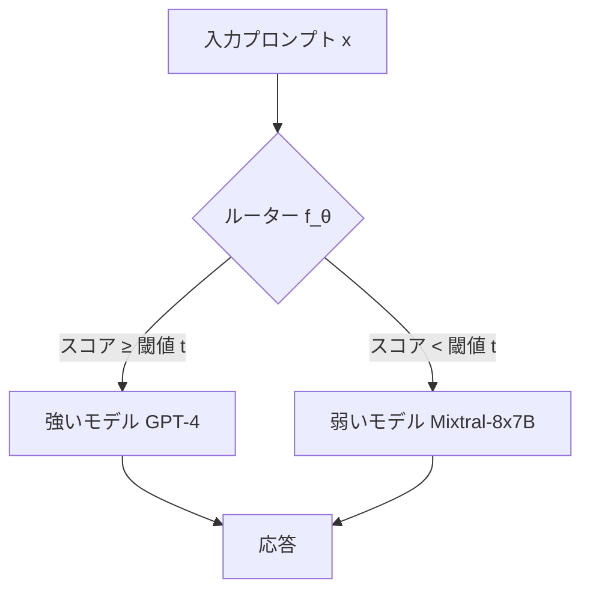

本記事は [RouteLLM: Learning to Route LLMs with Preference Data](https://arxiv.org/abs/2406.18665)（ICLR 2025採択）の解説記事です。

## 論文概要（Abstract）

RouteLLMは、推論時にクエリの複雑度に応じて強いLLM（GPT-4等）と弱いLLM（Mixtral-8x7B等）を動的に振り分けるルーターモデルの学習フレームワークである。Chatbot Arenaの人間の嗜好データを用いてルーターを訓練し、品質を95%維持しつつコストを最大85%削減（MT Benchの場合）することを著者らは報告している。

この記事は [Zenn記事: AIソフトウェアアーキテクチャ2026年版：MLOps・LLMOps・AgentOpsの実践設計](https://zenn.dev/0h_n0/articles/7b88993fccf7f8) の深掘りです。

## 情報源

- **arXiv ID**: 2406.18665
- **URL**: [https://arxiv.org/abs/2406.18665](https://arxiv.org/abs/2406.18665)
- **著者**: Isaac Ong, Amjad Almahairi, Vincent Wu, Wei-Lin Chiang, Tianhao Wu, Joseph E. Gonzalez, M Waleed Kadous, Ion Stoica（UC Berkeley, LMSYS Org, Anyscale）
- **発表年**: 2024年（ICLR 2025に採択）
- **分野**: cs.LG, cs.AI, cs.CL
- **GitHub**: [lm-sys/RouteLLM](https://github.com/lm-sys/RouteLLM)（Apache 2.0）

## 背景と動機（Background & Motivation）

LLMの商用利用において、モデル選択は品質とコストのトレードオフを伴う。GPT-4やClaude Opus等の高性能モデルはトークン単価が高く、一方でMixtral-8x7BやClaude Haiku等の軽量モデルは安価だが複雑なタスクでは精度が不足する。

従来のアプローチでは、全リクエストに同一モデルを使用するか、ルールベースのヒューリスティクス（入力長やキーワード検出）でモデルを切り替えていた。しかし、ルールベースの手法はクエリの**意味的な複雑度**を捉えられないため、簡単なタスクに高価なモデルを使い続けるコスト非効率が発生する。著者らはこの問題に対し、人間の嗜好データから**学習ベース**のルーターを訓練するアプローチを提案している。

## 主要な貢献（Key Contributions）

- **貢献1**: Chatbot Arenaの人間嗜好データを用いた4種類のルーターアーキテクチャの提案と評価
- **貢献2**: データ拡張技法により、少量のラベルデータ（約1,500件）でも効果的なルーター訓練が可能であることの実証
- **貢献3**: 訓練時と異なるモデルペア（例: Claude 3 Opus + Llama 3 8B）に対しても再訓練なしでルーターが汎化することの確認
- **貢献4**: `pip install routellm`で利用可能なOSSフレームワークとして公開

## 技術的詳細（Technical Details）

### 問題定式化

ルーティング問題は、入力プロンプト $x$ に対して強いモデル $M_s$ と弱いモデル $M_w$ のどちらを使用するかを決定する二値分類問題として定式化される。

$$
r(x) = \begin{cases} M_s & \text{if } f_\theta(x) \geq t \\ M_w & \text{otherwise} \end{cases}
$$

ここで、
- $f_\theta(x)$: パラメータ $\theta$ を持つルーターの出力スコア（0〜1）
- $t$: 閾値パラメータ（コスト-品質トレードオフを制御）
- $t = 0$: 全リクエストを強いモデルに振り分け（最高品質・最高コスト）
- $t = 1$: 全リクエストを弱いモデルに振り分け（最低コスト・品質低下のリスク）

### 4つのルーターアーキテクチャ

著者らは以下の4つの異なるアーキテクチャを提案・評価している。



**1. Similarity-Weighted (SW) Ranking**

Chatbot Arenaの嗜好データに基づく重み付きEloスコアを計算する。入力プロンプトとの類似度で重み付けした加重Eloスコアの差分により、強いモデルが必要かどうかを判定する。

$$
f_{SW}(x) = \sum_{i=1}^{N} w_i \cdot \mathbb{1}[M_s \succ M_w \mid x_i]
$$

ここで $w_i = \text{sim}(x, x_i)$ は入力 $x$ と訓練サンプル $x_i$ の類似度（文埋め込みのコサイン類似度）。

**2. Matrix Factorization**

ユーザー-アイテム推薦の手法を応用する。プロンプトの埋め込み $\mathbf{e}_x$ とモデルの埋め込み $\mathbf{e}_m$ の内積でスコアリングを行う。

$$
s(x, m) = \sigma(\mathbf{e}_x^T \mathbf{e}_m + b_m)
$$

ここで $\sigma$ はシグモイド関数、$b_m$ はモデルのバイアス項。ルーティング判定は $s(x, M_s) - s(x, M_w)$ のスコア差に基づく。

**3. BERT Classifier**

BERTベースのテキスト分類器を用いて、入力プロンプトから直接「強いモデルが必要か否か」を二値分類する。

**4. Causal LLM Classifier**

因果言語モデル（LLaMA系）をファインチューニングし、プロンプトの複雑度を直接予測する。最も高い精度を実現するが、推論コスト自体も高くなるトレードオフがある。

### 訓練データとデータ拡張

訓練データの中核はChatbot Arenaから取得した55K件の人間嗜好データ（プロンプト＋2モデルの応答＋勝敗判定）である。

著者らはさらにデータ拡張として、GPT-4による自動評価を用いてラベルを生成する手法を採用している。論文Table 2によると、わずか約1,500件の拡張データ（全体の2%未満）を追加するだけで、ルーターの性能が大幅に向上することが報告されている。

## 実装のポイント（Implementation）

RouteLLMはOpenAI互換APIとして実装されており、既存のシステムに最小限の変更で導入可能である。

```python
# RouteLLM導入例
# pip install routellm

from routellm.controller import Controller

# ルーターの初期化
client = Controller(
    routers=["mf"],  # Matrix Factorizationルーターを使用
    strong_model="gpt-4-turbo",
    weak_model="mixtral-8x7b-instruct",
)

# OpenAI互換APIで呼び出し
# model名に "router-{ルーター名}-{閾値}" を指定
response = client.chat.completions.create(
    model="router-mf-0.11593",  # 閾値0.11593（MT Benchで50%コスト削減の設定）
    messages=[
        {"role": "user", "content": "Pythonでクイックソートを実装してください"}
    ],
)
```

**実装上の注意点**:

- **閾値のキャリブレーション**: 閾値 $t$ はベンチマークごとに最適値が異なる。MT Benchで50%コスト削減を目指す場合は $t \approx 0.116$、MMLU向けには別の値が推奨される
- **レイテンシオーバーヘッド**: ルーター推論自体の追加レイテンシは数ms程度（SW/MFルーター使用時）。BERTやCausal LLMルーターはオーバーヘッドが大きい
- **モデルペアの選択**: 訓練時のペア（GPT-4 + Mixtral）と異なるペアでも汎化するが、性能差が小さすぎるペアではルーティングの効果が薄い

## 実験結果（Results）

著者らが報告した主要なベンチマーク結果を以下に示す（論文Table 1, Figure 3より）。

### コスト削減率（GPT-4の95%性能を維持した場合）

| ベンチマーク | 強いモデルへの呼び出し比率 | コスト削減率 |
|-------------|------------------------|-----------|
| **MT Bench** | 約15% | **約85%削減** |
| **MMLU** | 約55% | **約45%削減** |
| **GSM8K** | 約65% | **約35%削減** |

### ルーター別の性能比較（MT Bench、GPT-4 Turbo vs Mixtral-8x7B）

| ルーター | GPT-4呼び出し率 | コスト削減率 |
|---------|---------------|-----------|
| Matrix Factorization（拡張データあり） | 14% | 75% |
| Matrix Factorization（Arenaデータのみ） | 26% | 48% |
| SW Ranking | 18% | 68% |
| BERT Classifier | 22% | 56% |

### 商用ルーターとの比較

著者らの報告（論文Section 5.3）によると、RouteLLMは商用ルーティングサービス（Martian、Unify AI）と比較して**40%以上安価**で同等の品質を維持している。

### 汎化性能

訓練時のモデルペア（GPT-4 + Mixtral）以外のペア（Claude 3 Opus + Llama 3 8B）でも再訓練なしで有効に機能することが確認されている（論文Section 5.4）。

## 実運用への応用（Practical Applications）

RouteLLMの実運用における適用パターンは、Zenn記事で解説されている**モデルルーティングによるコスト最適化**の具体的実装に直結する。

**プロダクション適用パターン**:

1. **カスタマーサポート**: 定型的なFAQ応答は軽量モデル、複雑なトラブルシューティングは高性能モデルに振り分け
2. **コード生成**: 単純なボイラープレートコードは軽量モデル、複雑なアルゴリズム実装は高性能モデルに振り分け
3. **コンテンツ要約**: 短文要約は軽量モデル、長文・技術文書の要約は高性能モデルに振り分け

**スケーリング考慮事項**:

- ルーター自体は数ms以内で応答するため、推論レイテンシのボトルネックにはならない
- Matrix Factorizationルーターは軽量で、Lambda等のサーバーレス環境でも動作可能
- 社内ドメインに特化する場合は、自社データで追加ファインチューニングが推奨される

## Production Deployment Guide

### AWS実装パターン（コスト最適化重視）

RouteLLMのルーターをAWS上にデプロイし、Bedrockの複数モデル間でルーティングを行う構成を示す。

**トラフィック量別の推奨構成**:

| 規模 | 月間リクエスト | 推奨構成 | 月額コスト概算 | 主要サービス |
|------|--------------|---------|-------------|------------|
| **Small** | ~3,000 (100/日) | Serverless | $50-150 | Lambda + Bedrock + DynamoDB |
| **Medium** | ~30,000 (1,000/日) | Hybrid | $300-800 | Lambda + ECS Fargate + ElastiCache |
| **Large** | 300,000+ (10,000/日) | Container | $2,000-5,000 | EKS + Karpenter + EC2 Spot |

**Small構成の詳細**（月額$50-150）:
- **Lambda**: 1GB RAM, 60秒タイムアウト（$20/月）
- **Bedrock**: Claude 3.5 Haiku（弱モデル）+ Claude 3.5 Sonnet（強モデル）、Prompt Caching有効（$80/月）
- **DynamoDB**: On-Demand、ルーティング結果キャッシュ用（$10/月）
- **CloudWatch**: 基本監視（$5/月）

**コスト削減テクニック**:
- RouteLLMのルーティングにより、強いモデルへの呼び出しを70-85%削減
- Prompt Caching有効化で追加30-90%削減
- Bedrock Batch API（非リアルタイム処理）で50%割引適用

**コスト試算の注意事項**:
上記は2026年3月時点のAWS ap-northeast-1（東京）リージョン料金に基づく概算値です。実際のコストはトラフィックパターンにより変動します。最新料金は[AWS料金計算ツール](https://calculator.aws/)で確認してください。

### Terraformインフラコード

**Small構成（Serverless）: Lambda + Bedrock + RouteLLMルーター**

```hcl
# --- IAMロール（最小権限） ---
resource "aws_iam_role" "lambda_router" {
  name = "routellm-lambda-role"

  assume_role_policy = jsonencode({
    Version = "2012-10-17"
    Statement = [{
      Action = "sts:AssumeRole"
      Effect = "Allow"
      Principal = { Service = "lambda.amazonaws.com" }
    }]
  })
}

resource "aws_iam_role_policy" "bedrock_invoke" {
  role = aws_iam_role.lambda_router.id
  policy = jsonencode({
    Version = "2012-10-17"
    Statement = [{
      Effect   = "Allow"
      Action   = ["bedrock:InvokeModel", "bedrock:InvokeModelWithResponseStream"]
      Resource = [
        "arn:aws:bedrock:ap-northeast-1::foundation-model/anthropic.claude-3-5-haiku*",
        "arn:aws:bedrock:ap-northeast-1::foundation-model/anthropic.claude-3-5-sonnet*"
      ]
    }]
  })
}

# --- Lambda関数（RouteLLMルーター内蔵） ---
resource "aws_lambda_function" "routellm_handler" {
  filename      = "routellm_lambda.zip"
  function_name = "routellm-router"
  role          = aws_iam_role.lambda_router.arn
  handler       = "index.handler"
  runtime       = "python3.12"
  timeout       = 60
  memory_size   = 1024

  environment {
    variables = {
      STRONG_MODEL   = "anthropic.claude-3-5-sonnet-20241022-v2:0"
      WEAK_MODEL     = "anthropic.claude-3-5-haiku-20241022-v1:0"
      ROUTER_TYPE    = "mf"
      THRESHOLD      = "0.11593"
      DYNAMODB_TABLE = aws_dynamodb_table.routing_cache.name
    }
  }
}

# --- DynamoDB（ルーティング結果キャッシュ） ---
resource "aws_dynamodb_table" "routing_cache" {
  name         = "routellm-cache"
  billing_mode = "PAY_PER_REQUEST"
  hash_key     = "prompt_hash"

  attribute {
    name = "prompt_hash"
    type = "S"
  }

  ttl {
    attribute_name = "expire_at"
    enabled        = true
  }
}

# --- CloudWatchアラーム（コスト監視） ---
resource "aws_cloudwatch_metric_alarm" "strong_model_ratio" {
  alarm_name          = "routellm-strong-model-ratio-high"
  comparison_operator = "GreaterThanThreshold"
  evaluation_periods  = 1
  metric_name         = "StrongModelCalls"
  namespace           = "RouteLLM"
  period              = 3600
  statistic           = "Sum"
  threshold           = 500
  alarm_description   = "強いモデルへの呼び出しが1時間に500回を超過（コスト急増の可能性）"
}
```

### セキュリティベストプラクティス

- **IAMロール**: Bedrockの特定モデルのみInvoke権限（最小権限の原則）
- **シークレット管理**: API鍵はSecrets Manager使用、環境変数ハードコード禁止
- **ネットワーク**: Lambda VPC内配置、パブリックアクセス最小化
- **暗号化**: DynamoDB KMS暗号化、転送中はTLS 1.2以上

### 運用・監視設定

```python
# CloudWatch カスタムメトリクス: ルーティング統計
import boto3

cloudwatch = boto3.client('cloudwatch')

def publish_routing_metrics(
    router_decision: str,
    latency_ms: float,
    input_tokens: int,
) -> None:
    """ルーティング結果をCloudWatchに記録"""
    cloudwatch.put_metric_data(
        Namespace='RouteLLM',
        MetricData=[
            {
                'MetricName': 'StrongModelCalls' if router_decision == 'strong' else 'WeakModelCalls',
                'Value': 1,
                'Unit': 'Count',
            },
            {
                'MetricName': 'RouterLatencyMs',
                'Value': latency_ms,
                'Unit': 'Milliseconds',
            },
            {
                'MetricName': 'InputTokens',
                'Value': input_tokens,
                'Unit': 'Count',
            },
        ],
    )
```

### コスト最適化チェックリスト

- [ ] RouteLLM閾値を本番ワークロードでキャリブレーション済み
- [ ] 強いモデルへの呼び出し率を日次監視（目標: 30%以下）
- [ ] Bedrock Prompt Caching有効化（システムプロンプト固定部分）
- [ ] DynamoDBキャッシュでルーティング結果を再利用
- [ ] CloudWatch Budgetsで月額予算アラート設定
- [ ] 非リアルタイム処理はBedrock Batch API使用（50%割引）
- [ ] Lambda メモリサイズ最適化（CloudWatch Insights分析）
- [ ] Cost Anomaly Detection有効化

## 関連研究（Related Work）

- **FrugalGPT**（Chen et al., 2023）: LLMカスケードによるコスト削減の先行研究。RouteLLMは嗜好データからの学習で汎化性能を向上させた
- **Hybrid LLM**（Ding et al., 2024）: 2段階ルーティングの提案。RouteLLMはシンプルな閾値ベースの手法で同等以上の性能を達成
- **AutoMix**（Madaan et al., 2023）: 自己評価に基づくモデル切り替え。RouteLLMは外部の嗜好データを活用する点が異なる

## まとめと今後の展望

RouteLLMは、LLMルーティングを**学習ベース**で実現した実用的なフレームワークである。MT Benchで最大85%のコスト削減を達成しつつ、pip installで即座に導入可能な点が強みである。今後の課題として、著者らはドメイン固有タスクへの転移学習やマルチモデル（3つ以上）ルーティングへの拡張を挙げている。

## 参考文献

- **arXiv**: [https://arxiv.org/abs/2406.18665](https://arxiv.org/abs/2406.18665)
- **ICLR 2025 Proceedings**: [https://proceedings.iclr.cc/paper_files/paper/2025/hash/5503a7c69d48a2f86fc00b3dc09de686-Abstract-Conference.html](https://proceedings.iclr.cc/paper_files/paper/2025/hash/5503a7c69d48a2f86fc00b3dc09de686-Abstract-Conference.html)
- **Code**: [https://github.com/lm-sys/RouteLLM](https://github.com/lm-sys/RouteLLM)
- **LMSYS Blog**: [https://lmsys.org/blog/2024-07-01-routellm/](https://lmsys.org/blog/2024-07-01-routellm/)
- **Related Zenn article**: [https://zenn.dev/0h_n0/articles/7b88993fccf7f8](https://zenn.dev/0h_n0/articles/7b88993fccf7f8)
