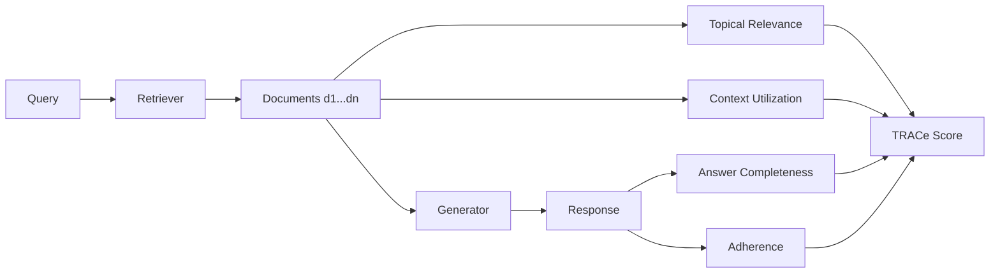
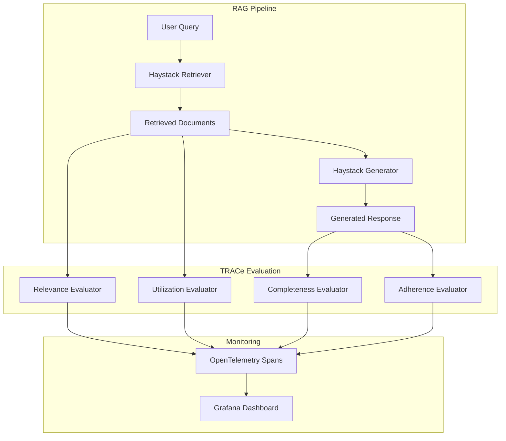

> この記事はAIによって生成されたものであり、内容の正確性については読者自身でご確認ください。
{: .prompt-warning }

## 論文概要

RAGBench（Friel, Belyi, Sanyal, 2024）は、Retrieval-Augmented Generation（RAG）システムの包括的評価を目的とした大規模ベンチマークデータセットである。著者らは約10万件のラベル付き事例を12のソースデータセットから構築し、検索・生成の両段階を4つのメトリクスで評価するTRACe（Topical Relevance, Answer Completeness, Context Utilization, Adherence）フレームワークを提案している。Fine-tuned DeBERTa-v3-LargeがGPT-3.5やRAGAS、TruLensなどの既存手法を大幅に上回る評価性能を達成したことが報告されている。

本記事は [https://arxiv.org/abs/2407.11005](https://arxiv.org/abs/2407.11005) の解説記事です。

この記事は [Zenn記事: Haystack 2.xのQAパイプラインを本番運用する：カスタムComponent・非同期実行・監視まで](https://zenn.dev/0h_n0/articles/6555f50d3f85ce) の深掘りです。Haystackなどのフレームワークで構築したRAGパイプラインの品質をどのように定量評価するかという実運用上の課題に対して、RAGBenchは体系的な評価基盤を提供する。

### 情報源

- [arXiv: RAGBench: Explainable Benchmark for Retrieval-Augmented Generation Systems (2407.11005)](https://arxiv.org/abs/2407.11005)
- [HuggingFace Dataset: galileo-ai/ragbench](https://huggingface.co/datasets/galileo-ai/ragbench)

---

## 背景と動機

RAGシステムは大規模言語モデル（LLM）に外部知識を注入する手法として広く普及しているが、その評価は依然として標準化が不十分な領域である。著者らは以下の課題を指摘している。

第一に、既存の評価手法（RAGAS、TruLensなど）はLLMベースの評価に依存しているが、これらの手法には位置バイアス（先頭の選択肢を選びやすい傾向）や冗長バイアス（長い回答を高く評価する傾向）が存在する。第二に、評価メトリクスが検索段階と生成段階を統合的にカバーしていない。第三に、ドメイン横断的なベンチマークが存在しないため、異なるRAGシステム間の公正な比較が困難である。

これらの課題を解決するために、著者らは5つの産業ドメイン（生物医学、一般知識、法律、カスタマーサポート、金融）を網羅する10万件規模のデータセットと、説明可能な4次元評価フレームワークTRACeを構築した。

---

## 主要な貢献

著者らが報告している本論文の主要な貢献は以下の通りである。

- **TRACeフレームワークの形式化**: 検索・生成の両段階を4つの説明可能なメトリクスで評価する体系的な枠組みを提案
- **大規模ベンチマークデータセット**: 12のソースデータセットから約10万件（学習78k、検証12k、テスト11k）のラベル付き事例を構築
- **LLM-as-Judge手法の限界の実証**: GPT-3.5ベースの評価がFine-tuned分類器に対して系統的に劣ることを定量的に示した
- **コスト効率の高い評価モデル**: Fine-tuned DeBERTa-v3-LargeがLLMベースの手法を上回る性能をはるかに低いコストで実現
- **オープンデータ**: データセットをHuggingFace上で公開（CC-BY-4.0ライセンス）

---

## 技術的詳細: TRACeフレームワーク

### メトリクスの定義

TRACeは4つのメトリクスで構成される。各メトリクスはトークンレベルのアノテーションから算出される。



#### 1. Context Relevance（文脈関連度）

検索されたコンテキスト中で、クエリに関連するトークンの割合を測定する。文書 $d_i$ に対する関連トークン集合を $R_i$ とすると、文書レベルのスコアは以下で定義される。

$$
\text{Relevance}(d_i) = \frac{\text{Len}(R_i)}{\text{Len}(d_i)}
$$

事例レベルでは、全文書にわたって集約する。

$$
\text{Relevance} = \frac{\sum_{i} \text{Len}(R_i)}{\sum_{i} \text{Len}(d_i)}
$$

この指標は検索段階（Retriever）の品質を直接評価する。

#### 2. Context Utilization（文脈利用度）

生成器が検索コンテキストをどの程度実際に利用したかを測定する。文書 $d_i$ 中の利用済みトークン集合を $U_i$ とすると、

$$
\text{Utilization}(d_i) = \frac{\text{Len}(U_i)}{\text{Len}(d_i)}
$$

事例レベルでは全文書にわたって集約される。この指標が低い場合、検索されたが使われなかった情報が多いことを意味し、検索精度の改善余地を示唆する。

#### 3. Completeness（完全度）

関連情報のうち、生成器が実際に回答に取り込んだ割合を測定する。

$$
\text{Completeness} = \frac{\text{Len}(R_i \cap U_i)}{\text{Len}(R_i)}
$$

Relevanceが高くてCompletenessが低い場合、関連情報は検索できているが生成器がそれを十分に活用していないことを意味する。

#### 4. Adherence（忠実度）

回答のすべての主張が検索コンテキストに基づいているかどうかを判定する。ハルシネーション検出に直結するメトリクスであり、事例レベルのブーリアン値として定義される。コンテキストに裏付けのない主張が1つでもあればFalse（非忠実）と判定される。

### 評価対象の分離

著者らが強調しているのは、TRACeがRAGパイプラインの検索段階と生成段階を明確に分離して評価する点である。

| メトリクス | 評価対象 | 改善アクション |
|---|---|---|
| Context Relevance | Retriever | チャンク戦略、埋め込みモデルの変更 |
| Context Utilization | Generator | プロンプト設計、コンテキスト窓の調整 |
| Completeness | Generator | プロンプトの網羅性指示の強化 |
| Adherence | Generator | ハルシネーション抑制、温度パラメータの調整 |

---

## 実装のポイント

### データセットの利用方法

RAGBenchはHuggingFace Datasetsから直接ロードできる。以下にPythonでの基本的な利用例を示す。

```python
from datasets import load_dataset

# 特定のサブデータセットをロード
hotpotqa = load_dataset("galileo-ai/ragbench", name="hotpotqa", split="test")

# 各事例のカラム構成を確認
print(hotpotqa.column_names)
# ['id', 'question', 'documents', 'response',
#  'generation_model_name', 'annotating_model_name',
#  'dataset_name', 'documents_sentences', 'response_sentences',
#  'sentence_support_information',
#  'relevance_score', 'utilization_score', 'completeness_score',
#  'adherence_score']
```

### アノテーション方式

著者らはGPT-4（gpt-4-0125-preview）をアノテータとして使用し、Chain-of-Thought（CoT）プロンプティングで文レベルの関連性・利用情報を抽出した。このアノテーションをトークンレベルのメトリクスに変換する処理が論文のSection 3.2で定義されている。

回答の各文について、検索コンテキスト中のどの文がその主張を支持するかを`sentence_support_information`カラムに記録しており、`fully_supported`フラグと`supporting_sentence_keys`により説明可能性を担保している。

---

## Production Deployment Guide

RAGBenchのTRACeフレームワークをHaystackベースのRAGパイプラインの本番評価に統合する方法を解説する。

### アーキテクチャ概要



### 1. TRACeメトリクス計算の実装

RAGBenchの定義に従い、トークンレベルのメトリクスを計算するユーティリティを実装する。

```python
from dataclasses import dataclass
from typing import Optional


@dataclass(frozen=True)
class TRACeScores:
    """TRACe evaluation scores for a single RAG example."""

    relevance: float
    utilization: float
    completeness: float
    adherence: bool

    def to_dict(self) -> dict[str, float | bool]:
        return {
            "relevance": self.relevance,
            "utilization": self.utilization,
            "completeness": self.completeness,
            "adherence": self.adherence,
        }
```

### 2. DeBERTaベースのAdherence判定器

著者らの報告に基づき、Fine-tuned DeBERTa-v3-Largeを用いたAdherence判定器を実装する例を示す。LLMベースの評価と比較して推論コストが大幅に低い。

```python
import torch
from transformers import AutoModelForSequenceClassification, AutoTokenizer


class AdherenceClassifier:
    """DeBERTa-based adherence (hallucination) detector.

    Fine-tuned on RAGBench training data to detect
    whether a response is fully grounded in the context.
    """

    def __init__(self, model_name: str = "microsoft/deberta-v3-large") -> None:
        self.tokenizer = AutoTokenizer.from_pretrained(model_name)
        self.model = AutoModelForSequenceClassification.from_pretrained(
            model_name, num_labels=2
        )
        self.model.eval()

    def predict(self, context: str, response: str) -> tuple[bool, float]:
        """Predict adherence score.

        Args:
            context: Retrieved document text.
            response: Generated response text.

        Returns:
            Tuple of (is_adherent, confidence_score).
        """
        inputs = self.tokenizer(
            context,
            response,
            truncation=True,
            max_length=512,
            return_tensors="pt",
        )
        with torch.no_grad():
            logits = self.model(**inputs).logits
            probs = torch.softmax(logits, dim=-1)

        adherent_prob = probs[0][1].item()
        return adherent_prob > 0.5, adherent_prob
```

### 3. Haystack Componentとしての統合

HaystackのカスタムComponentとしてTRACe評価を組み込む方法を示す。

```python
from typing import Any

from haystack import Document, component


@component
class TRACeEvaluator:
    """Haystack component that evaluates RAG output using TRACe metrics.

    Integrates with Haystack 2.x pipeline as a post-generation
    evaluation step. Results are emitted as OpenTelemetry spans.
    """

    def __init__(self, adherence_model_name: str | None = None) -> None:
        self._adherence_model_name = (
            adherence_model_name or "microsoft/deberta-v3-large"
        )
        self._classifier: AdherenceClassifier | None = None

    def warm_up(self) -> None:
        """Load the adherence classifier model."""
        self._classifier = AdherenceClassifier(self._adherence_model_name)

    @component.output_types(
        scores=dict,
        adherence=bool,
    )
    def run(
        self,
        query: str,
        documents: list[Document],
        response: str,
    ) -> dict[str, Any]:
        """Evaluate RAG output against TRACe metrics.

        Args:
            query: The original user query.
            documents: Retrieved documents from the retriever.
            response: Generated response from the generator.

        Returns:
            Dictionary containing TRACe scores and adherence flag.
        """
        if self._classifier is None:
            msg = "Call warm_up() before run()"
            raise RuntimeError(msg)

        context = " ".join(doc.content or "" for doc in documents)
        is_adherent, confidence = self._classifier.predict(context, response)

        scores = {
            "adherence": is_adherent,
            "adherence_confidence": confidence,
            "num_documents": len(documents),
            "context_length": len(context),
            "response_length": len(response),
        }
        return {"scores": scores, "adherence": is_adherent}
```

### 4. OpenTelemetryによるメトリクス送信

Zenn記事で解説されているOpenTelemetry連携と組み合わせ、TRACeスコアをテレメトリデータとして送信する。

```python
from opentelemetry import metrics, trace

tracer = trace.get_tracer("rag-pipeline")
meter = metrics.get_meter("rag-pipeline")

adherence_counter = meter.create_counter(
    "rag.adherence.total",
    description="Total number of adherence evaluations",
)
adherence_histogram = meter.create_histogram(
    "rag.adherence.confidence",
    description="Adherence confidence score distribution",
)


def record_trace_metrics(
    scores: dict[str, float | bool],
    query: str,
) -> None:
    """Record TRACe evaluation metrics via OpenTelemetry.

    Args:
        scores: TRACe scores from the evaluator.
        query: Original user query for span context.
    """
    with tracer.start_as_current_span("trace_evaluation") as span:
        span.set_attribute("rag.query", query[:200])
        span.set_attribute("rag.adherence", scores["adherence"])
        span.set_attribute(
            "rag.adherence_confidence", scores["adherence_confidence"]
        )
        span.set_attribute("rag.num_documents", scores["num_documents"])

        adherence_counter.add(
            1,
            {"adherent": str(scores["adherence"])},
        )
        adherence_histogram.record(scores["adherence_confidence"])
```

### 5. バッチ評価パイプライン

本番データに対するオフライン評価バッチを構築する例を示す。RAGBenchデータセットを使ったベースライン測定にも利用できる。

```python
import json
import logging
from pathlib import Path

from datasets import load_dataset

logger = logging.getLogger(__name__)


def run_batch_evaluation(
    dataset_name: str = "hotpotqa",
    split: str = "test",
    output_path: Path = Path("evaluation_results.jsonl"),
    max_samples: int = 100,
) -> dict[str, float]:
    """Run batch TRACe evaluation on RAGBench subset.

    Args:
        dataset_name: RAGBench sub-dataset name.
        split: Dataset split to evaluate.
        output_path: Path for JSONL output.
        max_samples: Maximum number of samples to evaluate.

    Returns:
        Aggregated metrics dictionary.
    """
    ds = load_dataset(
        "galileo-ai/ragbench", name=dataset_name, split=split
    )
    ds = ds.select(range(min(max_samples, len(ds))))

    classifier = AdherenceClassifier()
    results: list[dict] = []
    adherent_count = 0

    for example in ds:
        context = " ".join(example["documents"])
        is_adherent, confidence = classifier.predict(
            context, example["response"]
        )
        result = {
            "id": example["id"],
            "adherence_pred": is_adherent,
            "adherence_confidence": confidence,
            "adherence_label": example.get("adherence_score", None),
            "dataset": dataset_name,
        }
        results.append(result)
        if is_adherent:
            adherent_count += 1

    with output_path.open("w") as f:
        for r in results:
            f.write(json.dumps(r) + "\n")

    adherence_rate = adherent_count / len(results) if results else 0.0
    logger.info(
        "Batch evaluation complete: %d samples, adherence_rate=%.3f",
        len(results),
        adherence_rate,
    )
    return {"adherence_rate": adherence_rate, "total_samples": len(results)}
```

### 6. CI/CDへの統合

RAGパイプラインの回帰テストとしてTRACe評価を組み込む。Adherenceスコアが閾値を下回った場合にアラートを発火する構成例を示す。

```yaml
# .github/workflows/rag-evaluation.yml (構成例)
# name: RAG TRACe Evaluation
# on:
#   push:
#     paths: ['prompts/**', 'config/**']
# jobs:
#   evaluate:
#     runs-on: ubuntu-latest
#     steps:
#       - uses: actions/checkout@v4
#       - name: Run TRACe evaluation
#         run: |
#           python -m evaluation.batch \
#             --dataset hotpotqa \
#             --threshold 0.80 \
#             --max-samples 500
```

上記のパイプラインにより、プロンプト変更やモデル更新時にAdherenceスコアの劣化を自動検出できる。

---

## 実験結果

### ベンチマーク比較

著者らは、ハルシネーション検出（Adherence）タスクにおけるAUROCスコアを以下のように報告している（論文 Table 3より）。

| 評価手法 | Adherence AUROC（平均） | Context Relevance RMSE | Utilization RMSE |
|---|---|---|---|
| Fine-tuned DeBERTa-v3-Large | **約0.80** | **0.08-0.27** | **0.04-0.23** |
| GPT-3.5（ゼロショット） | 約0.57 | 0.10-0.31 | 0.05-0.23 |
| RAGAS | 約0.60 | 0.06-0.37 | N/A |
| TruLens | 約0.61 | 0.45-0.79 | N/A |

著者らはFine-tuned DeBERTa-v3-Largeが「すべての評価において一貫して優れた性能指標を達成した」と報告している。特にAdherence検出では、DeBERTaがGPT-3.5を23ポイント以上上回っている。

### ドメイン別の難易度

著者らの報告によると、ドメインによって評価の難易度が異なる。法律ドメイン（CUAD）と金融ドメイン（FinQA、TatQA）は特に困難なドメインとして報告されている。これは、専門用語の正確な利用や数値推論の正確性が要求されるためと著者らは分析している。

### データセット構成

| サブデータセット | ドメイン | 事例数 | コンテキスト長（トークン） |
|---|---|---|---|
| HotpotQA | 一般知識 | 多数 | 中 |
| MedQA / PubMedQA | 生物医学 | 中 | 中-長 |
| CUAD | 法律 | 中 | 長（契約書） |
| FinQA / TatQA | 金融 | 中 | 中 |
| TechQA | カスタマーサポート | 中 | 中 |
| ExpertQA | 一般知識 | 中 | 中 |
| HAGRID | 一般知識 | 中 | 短-中 |
| CovidQA | 生物医学 | 少 | 中 |
| EManual | カスタマーサポート | 中 | 中 |
| MSMarco | 一般知識 | 多数 | 短-中 |
| DelucionQA | 一般知識 | 中 | 中 |
| Databricks-Dolly-15K | 一般知識 | 中 | 短 |

---

## 実運用への応用

RAGBenchの知見は、Haystackを用いたRAGパイプラインの運用改善に直接応用できる。

### 検索品質の継続的モニタリング

TRACeのContext Relevanceをリアルタイムで計測することで、検索品質の劣化を早期検知できる。著者らが示したように、ドメインによって評価の難易度が大きく異なるため、ドメイン別のベースラインを設定することが重要である。

### コスト効率の高い評価体制

著者らの実験結果は、RAG評価にGPT-4を使う必要がないことを示唆している。Fine-tuned DeBERTa-v3-Largeは同等以上の評価性能を大幅に低いコスト（著者らの試算でGPT-4の約1/100）で実現する。本番環境では、DeBERTaベースの評価器をサイドカープロセスとしてデプロイし、全リクエストに対してAdherence判定を実行する構成が現実的である。

### ハルシネーション検出パイプラインの構築

Adherenceメトリクスは直接的なハルシネーション検出に利用できる。Adherence=Falseと判定されたレスポンスに対して、ユーザーへの警告表示やフォールバック応答の生成を行うことで、RAGシステムの信頼性を向上させることができる。

---

## 関連研究

- **RAGAS** (Shahul Es et al., 2023): LLMベースのRAG評価フレームワーク。Faithfulness、Answer Relevance、Context Relevanceの3指標を提案。RAGBenchの著者らは、RAGASのContext RelevanceがRMSE 0.06-0.37と不安定であることを報告している。
- **LLM-as-a-Judge** (Zheng et al., 2023, arXiv: 2306.05685): LLMを評価者として使用する手法の体系化。位置バイアスや冗長バイアスの存在を報告しており、RAGBenchの動機の一つとなっている。
- **TruLens** (TruEra): オープンソースのLLMアプリケーション評価ツール。RAGBenchの実験では、TruLensのContext Relevance RMSEが0.45-0.79と高く、信頼性に課題があることが示されている。
- **ARES** (Saad-Falcon et al., 2023): 自動RAG評価システム。少数のラベル付きデータとPPI（Prediction-Powered Inference）を用いた統計的推定により、RAGシステムの性能を推定する。RAGBenchはARESと比較してはるかに大規模なラベル付きデータを提供している。

---

## まとめ

RAGBenchは、RAGシステムの評価における3つの重要な課題（メトリクスの体系性、ドメイン横断性、LLM評価者の限界）に対して、10万件規模のベンチマークとTRACeフレームワークという具体的な解決策を提示した論文である。著者らが実験で示した「Fine-tuned DeBERTa-v3-LargeがLLMベースの評価手法を上回る」という結果は、本番RAGシステムの品質保証においてコスト効率の高い評価パイプラインの構築が可能であることを示唆している。Haystackなどのフレームワークを用いたRAGパイプラインの運用者にとって、TRACeの4次元評価は検索・生成それぞれの改善ポイントを特定するための有用な指針となる。

---

## 参考文献

1. Friel, R., Belyi, M., & Sanyal, A. (2024). RAGBench: Explainable Benchmark for Retrieval-Augmented Generation Systems. arXiv preprint arXiv:2407.11005. [https://arxiv.org/abs/2407.11005](https://arxiv.org/abs/2407.11005)
2. Shahul Es, J., James, J., Espinosa-Anke, L., & Schockaert, S. (2023). RAGAS: Automated Evaluation of Retrieval Augmented Generation. arXiv preprint arXiv:2309.15217.
3. Zheng, L., et al. (2023). Judging LLM-as-a-Judge with MT-Bench and Chatbot Arena. arXiv preprint arXiv:2306.05685.
4. Saad-Falcon, J., et al. (2023). ARES: An Automated Evaluation Framework for Retrieval-Augmented Generation Systems. arXiv preprint arXiv:2311.09476.
5. HuggingFace Dataset: galileo-ai/ragbench. [https://huggingface.co/datasets/galileo-ai/ragbench](https://huggingface.co/datasets/galileo-ai/ragbench)
