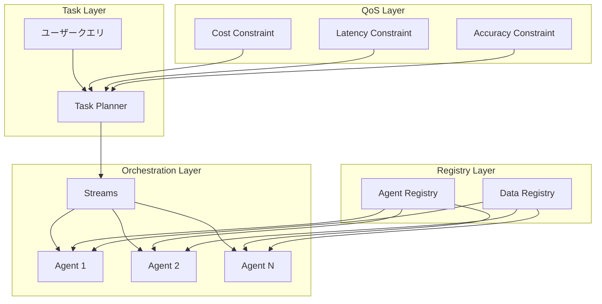

本記事は [Compound AI Systems Blueprint Architecture](https://arxiv.org/abs/2504.08148)（ICDE 2025 DAISワークショップ）の解説記事です。

## 論文概要（Abstract）

LLMの産業利用が進む中、単一モデルから**Compound AIシステム**（複数AIコンポーネントの協調システム）への移行が加速している。著者らは、エンタープライズ環境でエージェントとデータをオーケストレーションするための「Blueprint Architecture」を提案している。この設計では、**Streams**（データ・命令フロー制御）、**Agent Registry**（エージェントメタデータ管理）、**Data Registry**（マルチモーダルデータ管理）、**Task Planner**（QoS制約下でのタスク最適化）の4つのコア概念が定義されている。

この記事は [Zenn記事: AIソフトウェアアーキテクチャ2026年版：MLOps・LLMOps・AgentOpsの実践設計](https://zenn.dev/0h_n0/articles/7b88993fccf7f8) の深掘りです。

## 情報源

- **arXiv ID**: 2504.08148
- **URL**: [https://arxiv.org/abs/2504.08148](https://arxiv.org/abs/2504.08148)
- **著者**: Eser Kandogan, Nikita Bhutani, Dan Zhang, Rafael Li Chen, Sairam Gurajada, Estevam Hruschka
- **発表年**: 2025年
- **会議**: ICDE 2025 First Workshop on Data-AI Systems (DAIS)
- **分野**: cs.AI, cs.SE

## カンファレンス情報

**ICDE（IEEE International Conference on Data Engineering）** はデータ工学分野の最高峰会議の1つで、データ管理・システム設計に関する研究が集まる。DAISワークショップは2025年に新設されたData-AIシステム統合に特化したワークショップであり、LLMとエンタープライズデータの統合設計という新興領域をカバーしている。

## 背景と動機（Background & Motivation）

LLMの商用利用において、以下の構造的課題が存在する。

1. **既存システムとの統合**: エンタープライズ環境には既存のAPI・データベース・ビジネスロジックが存在し、LLMを単体でデプロイしても価値が限定的
2. **プロプライエタリデータの活用**: 社内データ・API・モデルをLLMから安全にアクセスする仕組みが必要
3. **QoS要件**: コスト・品質・レイテンシのバランスを制御可能な設計が求められる
4. **断片的な提案**: エージェントワークフロー、プログラミングモデル、LLM拡張機能が個別に提案されているが、全体アーキテクチャの統合的なビジョンが欠如

著者らは、これらの課題に対し、エンタープライズ全体を見渡す**統合的なアーキテクチャ設計**が必要であると主張している。

## 主要な貢献（Key Contributions）

- **貢献1**: Compound AIシステムのためのBlueprint Architecture（設計青写真）の提案。Streams・Agent Registry・Data Registry・Plannerの4コンポーネントによる統合設計
- **貢献2**: 既存のプロプライエタリモデル・APIを「エージェント」として抽象化し、Agent Registryで統合管理するメタデータ駆動の設計
- **貢献3**: HRドメインでのユースケースによる設計の実証

## 技術的詳細（Technical Details）

### Blueprint Architectureの全体構成



### 4つのコアコンポーネント

**1. Streams（ストリーム）**

Streamsはエージェント間のデータフローと命令フローを制御するオーケストレーションの中核概念である。従来のDAG（有向非巡回グラフ）ベースのワークフローとは異なり、動的な分岐・合流・フィードバックループをサポートする。

著者らはStreamsを以下のように形式化している。

$$
S = (V, E, \phi)
$$

ここで、
- $V$: エージェントノードの集合
- $E$: ストリームエッジ（データ・命令の伝搬路）の集合
- $\phi: E \rightarrow \{data, instruction, feedback\}$: エッジ種別の分類関数

**2. Agent Registry（エージェントレジストリ）**

エンタープライズ内の既存モデル・API・ツールを「エージェント」として登録し、メタデータと学習済み表現で検索・計画可能にする。

エージェントのメタデータスキーマ:

```python
from dataclasses import dataclass, field


@dataclass
class AgentMetadata:
    """Agent Registry内のエージェント定義"""
    agent_id: str
    name: str
    description: str
    capabilities: list[str]
    input_schema: dict  # JSON Schema
    output_schema: dict  # JSON Schema
    cost_per_call: float  # USD
    avg_latency_ms: float
    accuracy_score: float  # 0.0-1.0
    embedding: list[float] = field(default_factory=list)  # 検索用ベクトル表現
    tags: list[str] = field(default_factory=list)
```

著者らは、エージェントの**学習済み表現**（embedding）を用いて、Task Plannerがタスクに適したエージェントをセマンティック検索で発見できる仕組みを提案している。

**3. Data Registry（データレジストリ）**

マルチモーダルなエンタープライズデータ（テーブル、文書、画像、API応答等）を統合的に登録・管理する。Data Registryはデータのスキーマ、アクセス権限、品質メトリクスをメタデータとして保持する。

**4. Task Planner（タスクプランナー）**

ユーザーのクエリを受け取り、QoS制約（コスト・レイテンシ・精度）の下でタスクを分解・最適化する。

$$
\text{Planner}(q, C) = \arg\min_{p \in \mathcal{P}} \text{cost}(p) \quad \text{s.t.} \quad \text{accuracy}(p) \geq \alpha, \; \text{latency}(p) \leq \tau
$$

ここで、
- $q$: ユーザークエリ
- $C$: QoS制約集合
- $\mathcal{P}$: 実行可能なプラン（エージェントの組み合わせ）の集合
- $\alpha$: 精度の下限
- $\tau$: レイテンシの上限

Task Plannerは、Agent Registryのメタデータ（コスト、レイテンシ、精度）を参照して、制約を満たす最小コストのプランを選択する。

### モノリシックモデルとの比較

| 特性 | モノリシックモデル | Blueprint Architecture |
|------|-----------------|----------------------|
| コスト効率 | 全タスクに同一モデル | タスクに応じたエージェント選択 |
| 障害耐性 | 単一障害点 | エージェント単位の分離 |
| 更新容易性 | 全体再デプロイ | エージェント単位の更新 |
| データ統合 | プロンプト内に限定 | Data Registryで統合管理 |

## 実装のポイント（Implementation）

**Agent Registryの設計指針**:

1. **粒度の決定**: エージェントの粒度は「1つの明確な責務」を原則とする。例えばHRドメインでは「従業員検索エージェント」「給与計算エージェント」「休暇管理エージェント」のように分割
2. **メタデータの正確性**: コスト・レイテンシ・精度のメタデータは定期的に実測値で更新する必要がある。陳腐化したメタデータはTask Plannerの判断を劣化させる
3. **エージェント表現の学習**: embeddingの品質がセマンティック検索の性能を左右する。著者らはタスク実行ログからの対照学習を推奨している

**Streams設計の注意点**:

- フィードバックループの実装では無限ループ防止のためのmax_steps設定が必須
- データストリームと命令ストリームの混同はデバッグを困難にするため、明確に分離する

## 実験結果（Results）

著者らはHRドメインのユースケースで設計を実証している。具体的には以下のタスクを対象としている。

- **従業員プロファイル照会**: 構造化データの検索・集約
- **HR文書の要約**: 非構造化テキストの処理
- **福利厚生の比較分析**: 複数データソースの統合推論

論文ではアーキテクチャの妥当性を定性的に示しており、大規模な定量ベンチマークは今後の課題として位置づけられている。

## 実運用への応用（Practical Applications）

Blueprint Architectureは、Zenn記事で解説されている**Compound AIシステムの8つの構成要素**を統合的に設計するためのフレームワークとして機能する。

**具体的な適用例**:

1. **カスタマーサポートシステム**: FAQ検索エージェント・チケット作成エージェント・エスカレーション判定エージェントをStreamsで連携
2. **データ分析パイプライン**: データ取得エージェント・前処理エージェント・可視化エージェントをData Registry経由で統合
3. **コード開発支援**: コード生成エージェント・テスト実行エージェント・レビューエージェントをTask Plannerで最適化

**スケーリング考慮事項**:

- Agent Registryのエージェント数が増えるとTask Plannerの探索空間が爆発的に増大する。著者らはembeddingベースのフィルタリングで候補を絞る手法を提案している
- Streams内のエージェント呼び出しは並列化可能だが、データ依存関係のある箇所は逐次実行が必要

## Production Deployment Guide

### AWS実装パターン（コスト最適化重視）

Blueprint ArchitectureのAgent Registry・Data Registry・Task PlannerをAWS上に実装するパターンを示す。

**トラフィック量別の推奨構成**:

| 規模 | 月間リクエスト | 推奨構成 | 月額コスト概算 | 主要サービス |
|------|--------------|---------|-------------|------------|
| **Small** | ~3,000 (100/日) | Serverless | $80-200 | Lambda + Step Functions + DynamoDB |
| **Medium** | ~30,000 (1,000/日) | Hybrid | $400-1,000 | ECS Fargate + ElastiCache + Bedrock |
| **Large** | 300,000+ (10,000/日) | Container | $2,500-6,000 | EKS + Karpenter + API Gateway |

**Small構成の詳細**（月額$80-200）:
- **Lambda**: Agent Registry APIとTask Planner（$20/月）
- **Step Functions**: Streamsオーケストレーション（$15/月）
- **DynamoDB**: Agent/Data Registryメタデータ保存（$10/月）
- **Bedrock**: エージェント推論（$100/月）
- **S3**: Data Registryストレージ（$5/月）

**コスト削減テクニック**:
- Step Functionsの Express Workflows 使用で最大80%コスト削減（短時間ワークフロー向け）
- Agent Registry内のコスト情報を活用し、Task Plannerがコスト最小のエージェント組み合わせを自動選択
- DynamoDB DAXキャッシュでRegistry検索の高速化・コスト削減

**コスト試算の注意事項**:
上記は2026年3月時点のAWS ap-northeast-1（東京）リージョン料金に基づく概算値です。最新料金は[AWS料金計算ツール](https://calculator.aws/)で確認してください。

### Terraformインフラコード

**Small構成: Step Functions + Lambda（Streamsオーケストレーション）**

```hcl
# --- Agent Registry (DynamoDB) ---
resource "aws_dynamodb_table" "agent_registry" {
  name         = "compound-ai-agent-registry"
  billing_mode = "PAY_PER_REQUEST"
  hash_key     = "agent_id"

  attribute {
    name = "agent_id"
    type = "S"
  }

  ttl {
    attribute_name = "expire_at"
    enabled        = true
  }
}

# --- Task Planner Lambda ---
resource "aws_lambda_function" "task_planner" {
  filename      = "task_planner.zip"
  function_name = "compound-ai-task-planner"
  role          = aws_iam_role.planner_role.arn
  handler       = "planner.handler"
  runtime       = "python3.12"
  timeout       = 120
  memory_size   = 1024

  environment {
    variables = {
      AGENT_REGISTRY_TABLE = aws_dynamodb_table.agent_registry.name
      MAX_COST_PER_QUERY   = "0.10"
      MAX_LATENCY_MS       = "5000"
    }
  }
}

# --- Step Functions（Streamsオーケストレーション） ---
resource "aws_sfn_state_machine" "streams_orchestrator" {
  name     = "compound-ai-streams"
  role_arn = aws_iam_role.sfn_role.arn

  definition = jsonencode({
    StartAt = "PlanTask"
    States = {
      PlanTask = {
        Type     = "Task"
        Resource = aws_lambda_function.task_planner.arn
        Next     = "ExecuteAgents"
      }
      ExecuteAgents = {
        Type = "Parallel"
        Branches = []  # Task Plannerの出力に基づき動的に構成
        Next = "AggregateResults"
      }
      AggregateResults = {
        Type = "Task"
        Resource = "arn:aws:lambda:ap-northeast-1:ACCOUNT:function:result-aggregator"
        End  = true
      }
    }
  })
}
```

### コスト最適化チェックリスト

- [ ] Agent Registryのコスト・レイテンシメタデータを週次で実測値更新
- [ ] Task PlannerのQoS制約値をビジネス要件に合わせて設定
- [ ] Step Functions Express Workflowsを5分以内のワークフローに適用
- [ ] DynamoDB DAXキャッシュでRegistry検索を高速化
- [ ] Bedrock Prompt Cachingで繰り返し呼び出しのコスト削減
- [ ] CloudWatch Budgetsで月額予算アラート設定
- [ ] 未使用エージェントの定期的な棚卸しとRegistry整理

## 関連研究（Related Work）

- **LangChain / LlamaIndex**: エージェントチェーンのフレームワーク。Blueprint Architectureはこれらのフレームワークが提供するプリミティブの上位に位置する設計レイヤー
- **DSPy**（Khattab et al., 2023）: Compound AIプログラムのコンパイラ。Blueprint Architectureのプログラミングモデル層として統合可能
- **AutoGen**（Wu et al., 2023）: マルチエージェント会話フレームワーク。Blueprint Architectureではエージェント間通信をStreamsで抽象化

## まとめと今後の展望

Blueprint Architectureは、エンタープライズ環境でCompound AIシステムを構築するための統合的な設計指針を提供している。Streams・Agent Registry・Data Registry・Task Plannerの4要素により、既存のプロプライエタリリソースをAIシステムに統合しつつ、QoS制約下でのタスク最適化を実現する。著者らは今後、大規模なベンチマーク評価とオープンソース実装の公開を予定していると述べている。

## 参考文献

- **arXiv**: [https://arxiv.org/abs/2504.08148](https://arxiv.org/abs/2504.08148)
- **ICDE 2025 DAIS Workshop**: First Workshop on Data-AI Systems
- **Related Zenn article**: [https://zenn.dev/0h_n0/articles/7b88993fccf7f8](https://zenn.dev/0h_n0/articles/7b88993fccf7f8)
