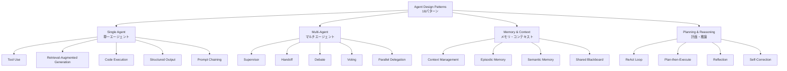
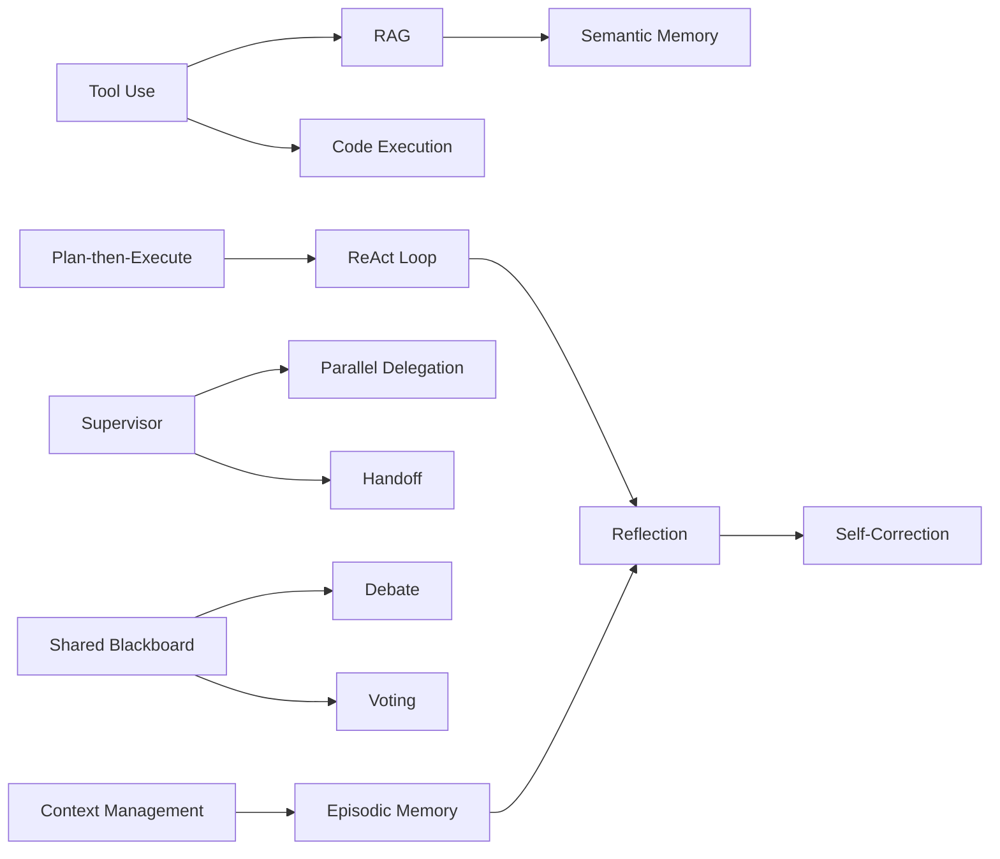

本記事は [Agent Design Pattern Catalogue: A Collection of Architectural Patterns for Foundation Model based Agents](https://arxiv.org/abs/2404.13712)（Yilmaz et al., 2024）の解説記事です。

## 論文概要（Abstract）

本論文は、基盤モデル（Foundation Model）ベースのAIエージェントを構築する際に利用できるアーキテクチャパターンを18個特定し、体系的にカタログ化したものである。ソフトウェア工学におけるGoFデザインパターン（Gamma et al., 1994）の手法をAIエージェント設計に適用し、各パターンの問題・解決策・構造・トレードオフを記述している。著者らは既存のエージェントフレームワーク（LangChain, AutoGen, CrewAI等）と学術論文を分析し、繰り返し現れる設計上の判断をパターンとして抽出している。

この記事は [Zenn記事: AIエージェント内部アーキテクチャの最前線：認知・メモリ・推論の3層設計](https://zenn.dev/0h_n0/articles/03d9ea70e316b4) の深掘りです。

## 情報源

- **arXiv ID**: 2404.13712
- **URL**: [https://arxiv.org/abs/2404.13712](https://arxiv.org/abs/2404.13712)
- **著者**: Yilmaz et al.
- **発表年**: 2024
- **分野**: cs.SE, cs.AI

## 背景と動機（Background & Motivation）

Zenn記事では、エージェントアーキテクチャとして Chain型・Star型・Mesh型・Graph型の4つの通信トポロジーを紹介しているが、実際のエージェント設計にはトポロジー以外にも多くの設計判断が必要となる。たとえば、「ツール呼び出しをどう管理するか」「複数エージェントの協調をどう制御するか」「メモリをどう永続化するか」といった判断は、プロジェクトごとに繰り返し発生する。

ソフトウェア工学の分野では、こうした繰り返し発生する設計判断をデザインパターンとして記述する手法が確立されている（GoFパターン、マイクロサービスパターン等）。本論文は、この手法をAIエージェント設計に適用し、再利用可能な設計知識をカタログとして体系化している。

## 主要な貢献（Key Contributions）

- **貢献1**: 基盤モデルエージェントに特化した18の設計パターンを特定・定義
- **貢献2**: 各パターンの問題・コンテキスト・解決策・構造・結果（Force）・トレードオフを統一的なフォーマットで記述
- **貢献3**: パターン間の関係（使用・拡張・代替）をパターンマップとして可視化

## 技術的詳細（Technical Details）

### 18パターンの分類体系

著者らは18のパターンを以下の4つのカテゴリに分類している。



### カテゴリ1: 単一エージェントパターン（5パターン）

**Pattern 1: Tool Use（ツール使用）**

- **問題**: LLMは内部知識のみでは現実世界の操作（API呼び出し、データベースクエリ等）ができない
- **解決策**: LLMの出力をパースし、外部ツールへのfunction callingとして実行する。ツール実行結果をコンテキストに追加して次のLLM呼び出しに渡す
- **トレードオフ**: ツール定義の数が増えるとLLMの選択精度が低下する。著者らは1回のプロンプトに含めるツール定義を20個以下に推奨している

**Pattern 2: Retrieval-Augmented Generation（RAG）**

- **問題**: LLMの学習データに含まれない最新情報や社内データにアクセスできない
- **解決策**: クエリに基づいてベクトルDBやキーワード検索で関連文書を取得し、コンテキストに挿入してからLLMに回答を生成させる
- **トレードオフ**: 検索精度が低いと無関係な文書がコンテキストを汚染し、かえって精度が低下する

**Pattern 3: Code Execution（コード実行）**

- **問題**: LLMは自然言語では正確な計算や複雑なデータ処理が困難
- **解決策**: LLMにPython等のコードを生成させ、サンドボックス環境で実行し、実行結果をフィードバックする
- **トレードオフ**: セキュリティリスク（任意コード実行）の管理が必要。サンドボックスの制約とエージェントの自由度のバランスを取る必要がある

**Pattern 4: Structured Output（構造化出力）**

- **問題**: LLMの自由形式出力をプログラムで処理するのが困難
- **解決策**: JSON Schema等で出力形式を制約し、型安全な出力を強制する
- **トレードオフ**: 出力形式の制約が強すぎると、LLMの推論能力が低下する場合がある

**Pattern 5: Prompt Chaining（プロンプト連鎖）**

- **問題**: 複雑なタスクを1回のLLM呼び出しで完了するのが困難
- **解決策**: タスクを複数のサブタスクに分解し、各サブタスクの出力を次のサブタスクの入力として連鎖させる
- **トレードオフ**: 連鎖が長くなるとエラーが蓄積する。各ステップの出力品質が後続ステップに影響する

### カテゴリ2: マルチエージェントパターン（5パターン）

**Pattern 6: Supervisor（監督者）**

Zenn記事のStar型トポロジーに対応する。中央のSupervisorエージェントがタスクを分配し、結果を集約する。

```python
# Supervisorパターンの概念的な実装
# Python 3.11+
from dataclasses import dataclass


@dataclass
class SupervisorAgent:
    """中央集権型のタスク分配"""
    workers: dict[str, "WorkerAgent"]

    def delegate(self, task: str) -> str:
        """タスクを適切なワーカーに委任"""
        # LLMがタスクの種類を判定し、適切なワーカーを選択
        worker_name = self.route_task(task)
        worker = self.workers[worker_name]
        result = worker.execute(task)
        return self.synthesize(task, result)

    def route_task(self, task: str) -> str:
        """タスクの種類に基づいてワーカーを選択"""
        # LLMベースのルーティング
        ...
        return "researcher"  # 例

    def synthesize(self, task: str, result: str) -> str:
        """ワーカーの結果を統合"""
        ...
        return result
```

- **トレードオフ**: Supervisorが単一障害点（Single Point of Failure）になる。Supervisorの判断精度がシステム全体の性能を制約する

**Pattern 7: Handoff（引き渡し）**

Zenn記事のChain型トポロジーに対応する。タスクの状態と制御をエージェント間で明示的に引き渡す。OpenAI Swarmがこのパターンの代表的実装である。

**Pattern 8: Debate（議論）**

複数のエージェントが異なる立場から議論し、合意形成を行う。Zenn記事のMesh型トポロジーの一形態。

**Pattern 9: Voting（投票）**

複数エージェントが独立に回答を生成し、多数決で最終回答を決定する。Ensemble手法のエージェント版。

**Pattern 10: Parallel Delegation（並列委任）**

独立したサブタスクを複数のワーカーに同時に委任し、結果を集約する。MapReduceパターンに類似する。

### カテゴリ3: メモリ・コンテキストパターン（4パターン）

**Pattern 11: Context Management（コンテキスト管理）**

コンテキストウィンドウの使用を最適化する。前述のWorking Memoryの論文と密接に関連する。

**Pattern 12: Episodic Memory（エピソード記憶）**

過去のタスク実行履歴を保存し、類似タスクの際に参照する。Reflexionのメモリ機構がこのパターンの実装例である。

**Pattern 13: Semantic Memory（意味記憶）**

ベクトルDBやナレッジグラフに知識を永続化する。RAGパターンと組み合わせて使用される。

**Pattern 14: Shared Blackboard（共有黒板）**

マルチエージェント環境で、すべてのエージェントがアクセスできる共有メモリ空間を提供する。LangGraphのStateGraphがこのパターンの実装例である。

### カテゴリ4: 計画・推論パターン（4パターン）

**Pattern 15: ReAct Loop**

Zenn記事で詳述されているThought → Action → Observationの線形推論ループ。

**Pattern 16: Plan-then-Execute（計画→実行）**

まず全体の計画を策定し、その後各ステップを実行する2段階パターン。

**Pattern 17: Reflection（振り返り）**

Reflexion論文のパターン化。実行結果を評価し、失敗時に自己振り返りを生成する。

**Pattern 18: Self-Correction（自己修正）**

出力を自動検証し、エラーがあれば修正を試みる。テスト駆動のコード生成に適用される。

### パターン間の関係

著者らは、パターン間の関係を以下のように整理している。



**主な関係パターン**:
- **uses（使用）**: Tool UseはRAGやCode Executionを内部で使用する
- **extends（拡張）**: ReflectionはReAct Loopを自己振り返りで拡張する
- **alternative（代替）**: SupervisorとHandoffは同じ問題に対する代替的な解決策

## 実装のポイント（Implementation）

**パターン選択のガイドライン**: 著者らは以下の判断基準を提示している。

| 判断基準 | 推奨パターン | 理由 |
|---------|------------|------|
| タスクが分解可能か | Plan-then-Execute | 計画段階で全体像を把握 |
| リアルタイム応答が必要か | ReAct Loop | 各ステップで即座に行動 |
| 高精度が求められるか | Voting / Debate | 複数の視点で品質向上 |
| コスト制約が厳しいか | Prompt Chaining | LLM呼び出し回数の制御が容易 |

**複合パターンの活用**: 実際のシステムでは、複数のパターンを組み合わせて使用することが一般的である。たとえば、LangGraphベースのシステムでは「Supervisor + Shared Blackboard + ReAct Loop + Tool Use」の組み合わせが頻繁に見られる。

**アンチパターンの回避**: 著者らは以下のアンチパターンも指摘している。
- **God Agent**: 単一のエージェントにすべての責務を詰め込む
- **Chatty Agents**: エージェント間で不要な情報を過剰に共有する
- **Blind Delegation**: Supervisorが結果を検証せずに受け入れる

## 実験結果（Results）

本論文はカタログ論文であるため、特定のベンチマークでの定量的評価は行われていない。代わりに、著者らは既存のフレームワークを分析し、各フレームワークが実装しているパターンのマッピングを提示している。

| フレームワーク | 実装パターン数 | 特に強いカテゴリ |
|--------------|-------------|--------------|
| LangChain/LangGraph | 16/18 | 全カテゴリ |
| AutoGen | 12/18 | マルチエージェント |
| CrewAI | 10/18 | マルチエージェント |
| OpenAI Swarm | 8/18 | Handoff特化 |

（著者らの分析に基づく概算）

## 実運用への応用（Practical Applications）

**設計レビューのチェックリスト**: 18のパターンをチェックリストとして使い、設計レビュー時に「このシステムはどのパターンを採用しているか」「採用していないパターンの中に必要なものはないか」を確認できる。

**新規プロジェクトの設計**: プロジェクトの要件（リアルタイム性、精度、コスト）に基づいて適切なパターンの組み合わせを選択する際のリファレンスとなる。

**技術負債の識別**: 既存システムがアンチパターン（God Agent, Chatty Agents等）に陥っていないかを評価し、リファクタリングの方針を立てる際に有用である。

## 関連研究（Related Work）

- **GoFデザインパターン**（Gamma et al., 1994）: ソフトウェア設計パターンの元祖。本論文はこの手法論をAIエージェントに適用
- **Agentic Design Patterns 2026 Guide**（SitePoint）: 実務者向けにパターンの使い方をまとめたガイド。本論文の学術的な分類を補完する位置づけ
- **Microsoft AI Agent Orchestration Patterns**: Azureアーキテクチャセンターが提示するエンタープライズ向けパターン集。本論文より実装寄りの視点

## まとめと今後の展望

本論文は、AIエージェント設計の「共通言語」を提供するカタログとして価値がある。Zenn記事で解説されている4つの通信トポロジー（Chain, Star, Mesh, Graph）は、本論文ではHandoff, Supervisor, Debate/Voting, そしてLangGraphのStateGraphとしてパターン化されている。

著者らは、今後の方向性として、パターンの自動検出（既存コードベースからパターンを自動特定）、パターンの性能比較（同じタスクに異なるパターンを適用した際のベンチマーク）、およびドメイン特化パターン（医療・金融等）の整理を課題として挙げている。

## 参考文献

- **arXiv**: [https://arxiv.org/abs/2404.13712](https://arxiv.org/abs/2404.13712)
- **Related Zenn article**: [https://zenn.dev/0h_n0/articles/03d9ea70e316b4](https://zenn.dev/0h_n0/articles/03d9ea70e316b4)
