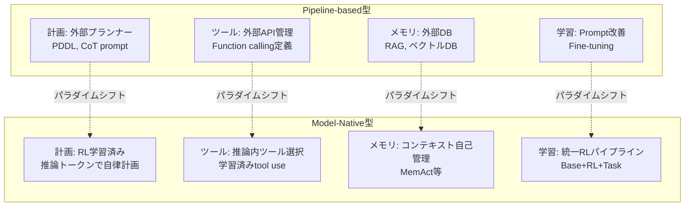

本記事は [Towards Model-Native Agentic AI](https://arxiv.org/abs/2503.04543)（2025）の解説記事です。

## 論文概要（Abstract）

本論文は、AIエージェントアーキテクチャが「Pipeline-based（パイプライン型）」から「Model-Native（モデルネイティブ型）」へ移行しつつあるパラダイムシフトを体系的に分析している。Pipeline-based型では計画・ツール使用・メモリといった能力を外部コンポーネントで実装するのに対し、Model-Native型ではこれらの能力をモデルパラメータ内に内在化する。著者らは、強化学習（RL）による統一的な学習パイプラインがこの移行を可能にしていると主張し、o1/o3（OpenAI）やR1（DeepSeek）などの推論モデルを具体例として分析している。

この記事は [Zenn記事: AIエージェント内部アーキテクチャの最前線：認知・メモリ・推論の3層設計](https://zenn.dev/0h_n0/articles/03d9ea70e316b4) の深掘りです。

## 情報源

- **arXiv ID**: 2503.04543
- **URL**: [https://arxiv.org/abs/2503.04543](https://arxiv.org/abs/2503.04543)
- **発表年**: 2025
- **分野**: cs.AI, cs.CL, cs.LG

## 背景と動機（Background & Motivation）

Zenn記事では、Pipeline-based型からModel-Native型へのパラダイムシフトを概観し、計画・ツール使用・メモリ・学習の4つの軸で両者を比較している。本論文は、このシフトの技術的背景をより深く掘り下げ、なぜ2025年以降にModel-Native型が実現可能になったのかを分析している。

従来のPipeline-based型エージェント（LangChain、AutoGen等）は、LLMを「汎用テキスト生成器」として使い、計画・ツール管理・メモリ管理を外部のPythonコードで制御する。このアプローチには以下の課題がある：

1. **コンポーネント間の統合コスト**: 各コンポーネントのインターフェースを手動で設計・維持する必要がある
2. **エラーの伝播**: あるコンポーネントの出力エラーが後続コンポーネントに伝播し、デバッグが困難
3. **最適化の非統一性**: 各コンポーネントが個別に最適化されるため、全体最適が困難

著者らは、強化学習（特にRLHF/RLEF）の進展により、これらの能力をモデルの重みに直接学習させることが可能になったと主張している。

## 主要な貢献（Key Contributions）

- **貢献1**: Pipeline-basedとModel-Nativeの2つのパラダイムを、計画・ツール使用・メモリ・学習の4軸で体系的に比較分類
- **貢献2**: Model-Native型を実現する統一的なRLパイプライン（Base Model → SFT → RL → Task Specialization）の定式化
- **貢献3**: 両パラダイムの長所を組み合わせるハイブリッドアーキテクチャの設計指針を提示

## 技術的詳細（Technical Details）

### Pipeline-based vs Model-Nativeの4軸比較

著者らは、エージェントの能力を4つの軸に分解し、各軸でのパラダイムの違いを分析している。



#### 軸1: 計画（Planning）の内在化

**Pipeline-based**: 外部プランナー（PDDL）やChain-of-Thought（CoT）プロンプトで計画を制御。計画の質はプロンプト設計に依存する。

**Model-Native**: 推論モデル（o1, o3, R1等）は、計画能力を推論トークン生成プロセスに内在化している。著者らは、この内在化がRL（強化学習）によるトレーニングで実現されていると分析している。

$$
\pi_\text{native}(a \mid s) = \pi_\text{base}(a \mid s) \cdot \prod_{k=1}^{K} \text{RL}_k(\Delta \theta_k \mid \mathcal{D}_k)
$$

ここで、
- $\pi_\text{native}$: Model-Native型のポリシー
- $\pi_\text{base}$: 事前学習済みベースモデル
- $\text{RL}_k$: $k$番目のRL段階でのパラメータ更新
- $\mathcal{D}_k$: $k$番目のRL段階の学習データ
- $K$: RLの段階数

#### 軸2: ツール使用（Tool Use）の内在化

**Pipeline-based**: ツールの定義（名前、説明、パラメータスキーマ）をプロンプトに含め、LLMがJSON形式でツール呼び出しを出力する。ツールの実行管理は外部コードが担当する。

**Model-Native**: モデルが推論プロセスの中でツール呼び出しの必要性を判断し、適切なツールを選択する。著者らは、OpenAIのo3やGoogleのK2が、ツール使用をRL報酬に組み込んだ学習を行っていると分析している。

#### 軸3: メモリ（Memory）の内在化

**Pipeline-based**: RAGやベクトルDBで外部メモリを管理。検索クエリの生成とコンテキストへの挿入を外部コードが制御する。

**Model-Native**: MemActなどの手法では、メモリ操作（検索、保存、更新）をツール呼び出しとして扱い、モデルがいつメモリにアクセスすべきかを自律的に判断する。コンテキスト管理自体がモデルの能力の一部となる。

#### 軸4: 学習（Learning）の統一化

**Pipeline-based**: プロンプトエンジニアリング、Few-shot学習、Fine-tuning（SFT/LoRA）といった個別の手法を組み合わせる。各手法の適用範囲が限定的。

**Model-Native**: 著者らは以下の統一的なRLパイプラインを提示している：

```
Base Model → SFT（教師あり微調整）→ RL（強化学習）→ Task Specialization
```

各段階の役割：
1. **Base Model**: 大規模コーパスからの事前学習で基本的な言語能力を獲得
2. **SFT**: 指示に従う能力と基本的なツール使用パターンを学習
3. **RL**: 計画・推論・ツール使用の品質を報酬信号で最適化
4. **Task Specialization**: 特定ドメインでの性能を強化

### ハイブリッドアーキテクチャの設計指針

著者らは、2025年時点ではPipeline-basedとModel-Nativeの「どちらか一方」ではなく、両者を組み合わせるハイブリッドアプローチが実用的と主張している。

```python
# ハイブリッドアーキテクチャの概念的な実装
# Python 3.11+

def hybrid_agent(query: str, complexity: float) -> str:
    """タスクの複雑さに応じてパラダイムを切り替える"""
    if complexity < 0.3:
        # 単純なタスク: Model-Native型で直接処理
        return model_native_inference(query)

    elif complexity < 0.7:
        # 中程度のタスク: Model-Nativeの推論 + 外部ツール管理
        plan = model_native_plan(query)
        results = []
        for step in plan:
            if step.requires_tool:
                # ツール実行は外部で管理（信頼性確保）
                result = external_tool_executor(step)
            else:
                result = model_native_inference(step.prompt)
            results.append(result)
        return synthesize(results)

    else:
        # 複雑なタスク: フルPipeline-based型
        plan = external_planner(query)
        return pipeline_executor(plan)
```

**設計指針**:
- **計画**: 短期計画（1-3ステップ）はModel-Native、長期計画（4ステップ以上）はPipeline-basedを推奨
- **ツール使用**: ツール数が10個以下ならModel-Native、10個超ならPipeline-based（ツール選択精度の問題）
- **メモリ**: セッション内メモリはModel-Native、長期記憶はPipeline-based（RAG/ベクトルDB）
- **学習**: タスク特化の学習はRL（Model-Native）、ドメイン知識の追加はRAG（Pipeline-based）

## 実装のポイント（Implementation）

**推論モデルの選択**: 2025年3月時点で、Model-Native型の能力が高いモデルとして著者らはo3（OpenAI）、R1（DeepSeek）、Claude 3.5（Anthropic）を挙げている。これらのモデルは、推論トークンを用いた計画能力が従来モデルより向上している。

**段階的移行**: 既存のPipeline-basedシステムからModel-Nativeへの移行は段階的に行うべきである。著者らは以下の順序を推奨している：
1. まずツール使用をModel-Nativeに移行（function callingの改善）
2. 次に短期計画をModel-Nativeに移行（推論モデルの活用）
3. 最後にメモリ管理のModel-Native化を検討

**評価指標の変更**: Pipeline-based型では各コンポーネントを個別に評価できるが、Model-Native型ではEnd-to-Endの評価が中心となる。著者らは、Zenn記事でも紹介されているCLASSicフレームワーク（Cost, Latency, Accuracy, Security, Stability）の5軸評価を推奨している。

**注意点**: Model-Native型は推論トークンの生成によりレイテンシが増加する傾向がある。o1/o3の推論トークンは100-10000トークンに達することがあり、応答時間が数秒から数十秒になる場合がある。リアルタイム応答が必要な場面ではPipeline-based型が依然として有利である。

## 実験結果（Results）

著者らは直接的なベンチマーク比較ではなく、既存論文の結果を整理する形で両パラダイムの性能を比較している。

| ベンチマーク | Pipeline-based (最良) | Model-Native (最良) | 情報源 |
|-------------|---------------------|-------------------|--------|
| SWE-bench Verified | 33.2% (Devin等) | 49.0% (o3) | OpenAI報告 |
| HumanEval | 91.0% (Reflexion) | 96.3% (o3) | 各論文の報告値 |
| WebArena | 35.8% (Agent-E) | 未公開 | Agent-E論文 |
| GAIA Level 1 | 56.1% | 74.5% (o1) | GAIA Leaderboard |

（著者らが各論文から集計した値。実験条件は統一されていないため、直接比較には注意が必要）

著者らの分析によると、Model-Native型はコード生成・数学推論など「正解が検証可能」なタスクで特に優位性を示す。一方、Web操作やマルチステップの情報収集タスクではPipeline-based型が依然として競争力を持つと報告されている。

## 実運用への応用（Practical Applications）

**新規プロジェクトでの選択**: 新規にエージェントシステムを構築する場合、まずModel-Native型（推論モデル + 最小限のツール定義）で構築し、精度やレイテンシが要件を満たさない場合にPipeline-basedコンポーネントを追加する「Model-Native First」アプローチを著者らは推奨している。

**既存システムの移行**: 既存のPipeline-basedシステムは、段階的にModel-Native化を進めることが可能である。特にツール使用と短期計画は、推論モデルへの移行による即座の効果が見込まれる。

**制約と限界**: Model-Native型は（1）推論トークンによるレイテンシ増加、（2）RL学習のための大規模計算リソース要件、（3）推論プロセスの透明性の低さ（デバッグの困難さ）という課題を抱えている。著者らはこれらの制約を明示的に認めたうえで、ハイブリッドアプローチの重要性を強調している。

## 関連研究（Related Work）

- **Beyond Pipelines**（2025）: 同時期に発表されたサーベイ論文で、本論文と相補的な分析を提供。「Beyond Pipelines」がより広範なサーベイであるのに対し、本論文はModel-Native化の技術的メカニズムに焦点を当てている
- **CoALA**（Sumers et al., 2023）: LLMエージェントの認知アーキテクチャフレームワーク。本論文はCoALAの各コンポーネントがModel-Nativeでどう変化するかを分析した位置づけ
- **OpenAI o1/o3技術レポート**: 推論モデルの具体的な実装。本論文はこれらの技術レポートをModel-Nativeパラダイムの代表例として引用している
- **Agentic AI: Architectures and Evaluation**（Arunkumar et al., 2026）: CLASSicフレームワークを提案した論文。Model-Native型エージェントの評価にCLASSicの5軸（Cost, Latency, Accuracy, Security, Stability）が特に有用であると本論文でも言及されている

## まとめと今後の展望

本論文は、AIエージェントアーキテクチャのパラダイムシフトを体系的に分析し、Pipeline-basedとModel-Nativeの両パラダイムの長所と限界を明らかにした。Zenn記事で概観されている「Pipeline-based → Model-Native」の移行トレンドに対して、技術的な裏付けと実践的な移行指針を提供する位置づけにある。

著者らは今後の方向性として、（1）Model-Nativeエージェントの安全性と制御可能性の確保、（2）ドメイン特化型のRL学習パイプラインの効率化、（3）Model-NativeとPipeline-basedの最適な組み合わせを自動決定するメタアーキテクチャの設計を課題として挙げている。

## 参考文献

- **arXiv**: [https://arxiv.org/abs/2503.04543](https://arxiv.org/abs/2503.04543)
- **Related Zenn article**: [https://zenn.dev/0h_n0/articles/03d9ea70e316b4](https://zenn.dev/0h_n0/articles/03d9ea70e316b4)
