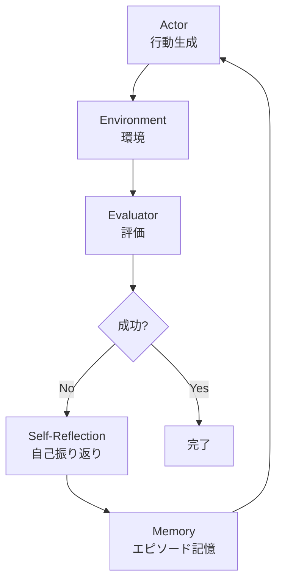

本記事は [Reflexion: Language Agents with Verbal Reinforcement Learning](https://arxiv.org/abs/2303.17760)（Shinn et al., NeurIPS 2023）の解説記事です。

## 論文概要（Abstract）

Reflexionは、大規模言語モデル（LLM）エージェントが勾配更新なしに過去の経験から学習するためのフレームワークである。従来の強化学習がスカラー報酬を用いてモデルパラメータを更新するのに対し、Reflexionは自然言語による「自己振り返り（self-reflection）」をフィードバック信号として使い、エピソード記憶に蓄積する。著者らはHumanEval（コード生成）で91.0%のpass@1精度、AlfWorld（意思決定）で134/134タスクの完全解決を報告している。

この記事は [Zenn記事: AIエージェント内部アーキテクチャの最前線：認知・メモリ・推論の3層設計](https://zenn.dev/0h_n0/articles/03d9ea70e316b4) の深掘りです。

## 情報源

- **arXiv ID**: 2303.17760
- **URL**: [https://arxiv.org/abs/2303.17760](https://arxiv.org/abs/2303.17760)
- **著者**: Noah Shinn, Federico Cassano, Ashwin Gopinath, Karthik Narasimhan, Shunyu Yao
- **発表年**: 2023（NeurIPS 2023採択）
- **分野**: cs.AI, cs.CL, cs.LG

## 背景と動機（Background & Motivation）

LLMエージェントの推論ループにおいて、ReActパターン（Thought → Action → Observation）は1回の試行で答えを出す「ワンショット」構造を持つ。この構造では、エージェントが行動の途中で誤った方向に進んだ場合、その失敗から学ぶ仕組みがない。

従来の強化学習（RL）では、スカラー報酬信号を用いてポリシーを更新するが、LLMベースのエージェントではモデルパラメータの更新（fine-tuning）が高コストであり、小規模なフィードバック信号からの学習効率が低い。著者らはこの問題に対して、「言語そのもの」をフィードバック信号として用いる言語的強化学習（Verbal Reinforcement Learning）を提案した。具体的には、エージェントが失敗した試行を自然言語で振り返り、その反省を次の試行の入力コンテキストに含めることで、パラメータ更新なしに行動改善を実現する。

## 主要な貢献（Key Contributions）

- **貢献1**: 言語的強化学習（Verbal RL）という新しいパラダイムの提案。スカラー報酬ではなく自然言語テキストをフィードバック信号として使用する
- **貢献2**: Actor・Evaluator・Self-Reflection・Memoryの4コンポーネントからなるReflexionアーキテクチャの設計
- **貢献3**: HumanEval（コード生成）、AlfWorld（意思決定）、HotpotQA（知識推論）の3タスクで従来手法を上回る性能を実証

## 技術的詳細（Technical Details）

### Reflexionアーキテクチャ

Reflexionは以下の4つのコンポーネントで構成される。



**Actor（行動生成器）**: ReActエージェントなどの行動生成モデル。環境からの観察とメモリ内の過去の振り返りをコンテキストとして受け取り、次の行動を生成する。

**Evaluator（評価器）**: タスクの成否を判定する。コード生成ではテスト実行結果、意思決定タスクではヒューリスティックな成功判定が用いられる。

**Self-Reflection（自己振り返り）**: 失敗した試行の軌跡（trajectory）全体を入力として受け取り、「何が悪かったか」「次はどうすべきか」を自然言語で生成するLLM。

**Memory（エピソード記憶）**: 過去の自己振り返りテキストを蓄積するスライディングウィンドウ。次の試行時にActorのプロンプトに挿入される。

### 言語的強化学習の形式化

著者らは従来のRL formulation を以下のように拡張している。

従来のポリシー勾配法では、報酬$r$がスカラーであり、ポリシー$\pi_\theta$のパラメータ$\theta$を以下の式で更新する：

$$
\theta_{t+1} = \theta_t + \alpha \nabla_\theta \mathbb{E}_{\tau \sim \pi_\theta} [R(\tau)]
$$

ここで、$\tau$は軌跡（trajectory）、$R(\tau)$は累積報酬、$\alpha$は学習率である。

Reflexionでは、パラメータ更新の代わりに、自然言語による振り返りテキスト$\text{ref}_t$を生成し、これを次の試行のコンテキストに追加する：

$$
a_{t+1} = \pi_\text{LLM}(s_{t+1}, \text{mem}_{t})
$$

$$
\text{mem}_{t} = \{\text{ref}_1, \text{ref}_2, \ldots, \text{ref}_t\}
$$

ここで、
- $a_{t+1}$: 次の試行での行動
- $\pi_\text{LLM}$: LLMベースのポリシー（パラメータ固定）
- $s_{t+1}$: 現在の状態
- $\text{mem}_{t}$: 蓄積された振り返りテキストの集合
- $\text{ref}_t$: $t$回目の試行後に生成された振り返りテキスト

この定式化の重要な点は、$\pi_\text{LLM}$のパラメータ自体は更新されないことである。改善は、コンテキストウィンドウに挿入される振り返りテキストの蓄積によって実現される。

### 自己振り返りの生成プロセス

Self-Reflectionコンポーネントは、以下の情報を入力として受け取る：

1. 失敗した試行の完全な軌跡（全Thought/Action/Observationペア）
2. 最終的な評価結果（失敗の種類、エラーメッセージ）
3. 過去の振り返り履歴（同じ問題に対する以前の反省）

生成される振り返りテキストの例（著者らの論文Table 6より引用）：

```
コード生成タスクの場合:
"前回の実装ではリスト内包表記で空リストの場合を
考慮していなかった。次回は空入力のエッジケースを
最初にチェックするガード節を追加すべきである。"
```

```
意思決定タスクの場合:
"棚の上を探索したが目的のオブジェクトが見つからなかった。
前回は別の引き出しを順番に調べるべきだった。
次の試行では机の引き出しを先に確認する。"
```

### アルゴリズム

```python
# Reflexionの核心ループ（概念的な実装）
# Python 3.11+
from dataclasses import dataclass, field


@dataclass
class ReflexionAgent:
    """Reflexionエージェント: 自己振り返りによる逐次改善"""

    actor_model: str = "gpt-4"
    reflector_model: str = "gpt-4"
    max_trials: int = 5
    memory: list[str] = field(default_factory=list)

    def solve(self, task: str) -> str:
        """複数回の試行で問題を解く"""
        for trial in range(self.max_trials):
            # Step 1: Actor がメモリ付きで行動を生成
            trajectory = self.act(task, self.memory)

            # Step 2: Evaluator が成否を判定
            success, feedback = self.evaluate(trajectory)

            if success:
                return trajectory.final_answer

            # Step 3: Self-Reflection で振り返りを生成
            reflection = self.reflect(
                task=task,
                trajectory=trajectory,
                feedback=feedback,
                past_reflections=self.memory,
            )

            # Step 4: Memory に振り返りを蓄積
            self.memory.append(reflection)

        return "最大試行回数に達しました。"

    def reflect(
        self,
        task: str,
        trajectory: "Trajectory",
        feedback: str,
        past_reflections: list[str],
    ) -> str:
        """失敗した試行から振り返りテキストを生成"""
        prompt = f"""以下のタスクで失敗しました。
タスク: {task}
実行した行動の軌跡: {trajectory}
失敗の詳細: {feedback}
過去の振り返り: {past_reflections}

何が悪かったか、次にどうすべきかを具体的に述べてください。"""

        # LLM呼び出しで自然言語の振り返りを生成
        reflection = call_llm(self.reflector_model, prompt)
        return reflection
```

## 実装のポイント（Implementation）

Reflexionを実装する際の注意点：

**メモリのウィンドウサイズ管理**: 著者らは過去3回分の振り返りテキストを保持するスライディングウィンドウを使用している。全ての履歴を保持するとコンテキストウィンドウが圧迫され、かえって性能が低下する。

**Evaluatorの設計**: タスクによって評価器の設計が異なる。コード生成（HumanEval）ではテスト実行の合否、意思決定（AlfWorld）ではヒューリスティックルール、知識推論（HotpotQA）ではExact Match + LLM判定のハイブリッドが用いられている。

**Self-Reflectionのプロンプト設計**: 振り返りが具体的（actionableな指示を含む）でないと効果が低い。「もっと頑張る」のような抽象的な振り返りではなく、「関数Xの戻り値の型をintからlistに変更する」のような具体的な修正指示が性能向上に寄与する。

**試行回数の設定**: 著者らの実験では、多くのタスクが2-3回の試行で収束する。5回を超えても改善しないケースでは、振り返りの質自体を見直す必要がある。

## Production Deployment Guide

### AWS実装パターン（コスト最適化重視）

Reflexionの試行ループは1タスクあたり複数回のLLM呼び出しを伴うため、コスト管理が重要である。

| 規模 | 月間リクエスト | 推奨構成 | 月額コスト目安 | 主要サービス |
|------|--------------|---------|-------------|------------|
| **Small** | ~3,000 (100/日) | Serverless | $50-150 | Lambda + Bedrock + DynamoDB |
| **Medium** | ~30,000 (1,000/日) | Hybrid | $300-800 | Lambda + ECS Fargate + ElastiCache |
| **Large** | 300,000+ (10,000/日) | Container | $2,000-5,000 | EKS + Karpenter + EC2 Spot |

**コスト試算の注意事項**: 上記は2026年3月時点のAWS ap-northeast-1（東京）リージョン料金に基づく概算値です。Reflexionは1タスクあたり平均3回のLLM呼び出しを行うため、単純なReActエージェントの3倍のトークンコストを見込む必要があります。最新料金は[AWS料金計算ツール](https://calculator.aws/)で確認してください。

**Small構成の詳細**（月額$50-150）:
- **Lambda**: 1GB RAM, 120秒タイムアウト（Reflexionループ対応）$20/月
- **Bedrock**: Claude 3.5 Haiku, Prompt Caching有効 $80/月
- **DynamoDB**: On-Demand（振り返りメモリ保存）$10/月
- **S3**: 軌跡ログ保存 $5/月

**コスト削減テクニック**:
- Prompt Caching有効化でシステムプロンプト部分を30-90%削減
- Bedrock Batch APIで非リアルタイム処理を50%削減
- 試行回数の上限設定でトークン消費を制御（max_trials=3推奨）
- Evaluatorにルールベース判定を使用しLLM呼び出しを削減

### Terraformインフラコード

**Small構成（Serverless）: Lambda + Bedrock + DynamoDB**

```hcl
# --- IAMロール（最小権限） ---
resource "aws_iam_role" "reflexion_lambda" {
  name = "reflexion-lambda-role"

  assume_role_policy = jsonencode({
    Version = "2012-10-17"
    Statement = [{
      Action = "sts:AssumeRole"
      Effect = "Allow"
      Principal = { Service = "lambda.amazonaws.com" }
    }]
  })
}

resource "aws_iam_role_policy" "bedrock_invoke" {
  role = aws_iam_role.reflexion_lambda.id
  policy = jsonencode({
    Version = "2012-10-17"
    Statement = [{
      Effect   = "Allow"
      Action   = ["bedrock:InvokeModel", "bedrock:InvokeModelWithResponseStream"]
      Resource = "arn:aws:bedrock:ap-northeast-1::foundation-model/anthropic.claude-3-5-haiku*"
    }]
  })
}

# --- Lambda関数（Reflexionループ対応） ---
resource "aws_lambda_function" "reflexion_handler" {
  filename      = "reflexion_lambda.zip"
  function_name = "reflexion-agent-handler"
  role          = aws_iam_role.reflexion_lambda.arn
  handler       = "index.handler"
  runtime       = "python3.12"
  timeout       = 120  # Reflexionは複数回試行のため長めに設定
  memory_size   = 1024

  environment {
    variables = {
      BEDROCK_MODEL_ID   = "anthropic.claude-3-5-haiku-20241022-v1:0"
      DYNAMODB_TABLE     = aws_dynamodb_table.reflection_memory.name
      MAX_TRIALS         = "3"
      ENABLE_PROMPT_CACHE = "true"
    }
  }
}

# --- DynamoDB（振り返りメモリ保存） ---
resource "aws_dynamodb_table" "reflection_memory" {
  name         = "reflexion-memory"
  billing_mode = "PAY_PER_REQUEST"
  hash_key     = "task_id"
  range_key    = "trial_number"

  attribute {
    name = "task_id"
    type = "S"
  }
  attribute {
    name = "trial_number"
    type = "N"
  }

  ttl {
    attribute_name = "expire_at"
    enabled        = true
  }
}

# --- CloudWatch アラーム（コスト監視） ---
resource "aws_cloudwatch_metric_alarm" "lambda_cost" {
  alarm_name          = "reflexion-cost-spike"
  comparison_operator = "GreaterThanThreshold"
  evaluation_periods  = 1
  metric_name         = "Duration"
  namespace           = "AWS/Lambda"
  period              = 3600
  statistic           = "Sum"
  threshold           = 300000  # 300秒/時間超過でアラート（Reflexionは長時間実行）
  alarm_description   = "Reflexion Lambda実行時間異常"

  dimensions = {
    FunctionName = aws_lambda_function.reflexion_handler.function_name
  }
}
```

### セキュリティベストプラクティス

- **IAMロール**: Bedrock InvokeModelとDynamoDBのみ許可（最小権限）
- **シークレット管理**: API KeyはSecrets Manager経由、環境変数ハードコード禁止
- **ネットワーク**: Lambda VPC内配置、パブリックアクセス不可
- **データ保護**: DynamoDB暗号化（AWS管理KMS）有効

### 運用・監視設定

```python
# CloudWatch アラーム: Reflexion試行回数監視
import boto3

cloudwatch = boto3.client('cloudwatch')

cloudwatch.put_metric_alarm(
    AlarmName='reflexion-max-trials-exceeded',
    ComparisonOperator='GreaterThanThreshold',
    EvaluationPeriods=1,
    MetricName='TrialCount',
    Namespace='Custom/Reflexion',
    Period=3600,
    Statistic='Average',
    Threshold=4,  # 平均試行回数が4回を超えたらアラート
    AlarmDescription='Reflexionの平均試行回数が高すぎる（コスト増加の兆候）'
)
```

### コスト最適化チェックリスト

- [ ] ~100 req/日 → Lambda + Bedrock（Serverless）$50-150/月
- [ ] ~1000 req/日 → ECS Fargate + Bedrock（Hybrid）$300-800/月
- [ ] 10000+ req/日 → EKS + Spot Instances（Container）$2,000-5,000/月
- [ ] max_trials=3に設定（コストと精度のバランス）
- [ ] Prompt Caching有効化（30-90%削減）
- [ ] Evaluatorにルールベース判定を優先使用
- [ ] Bedrock Batch API活用（非リアルタイム処理で50%削減）
- [ ] 試行ごとのトークン使用量をCloudWatch Metricsに記録
- [ ] AWS Budgets月額予算設定（80%で警告）
- [ ] DynamoDB TTL設定で古い振り返りメモリを自動削除

## 実験結果（Results）

著者らは3つのベンチマークで評価を実施している。

| ベンチマーク | タスク | ベースライン (ReAct) | Reflexion | 改善 |
|-------------|--------|---------------------|-----------|------|
| HumanEval | コード生成 (pass@1) | 80.1% | 91.0% | +10.9pt |
| AlfWorld | 意思決定 (成功率) | 75/134 | 134/134 | +44% |
| HotpotQA | 知識推論 (EM) | 29% | 51% | +22pt |

（論文Table 1, Table 2, Table 3より）

**HumanEval（コード生成）**: 著者らはGPT-4をベースモデルとして使用し、pass@1精度でReActの80.1%からReflexionの91.0%への改善を報告している。特にエッジケース処理（空リスト、型不一致）でのバグ修正が振り返りによって効果的に行われている。

**AlfWorld（意思決定）**: テキストベースのインタラクティブ環境で、134タスク中134タスクを完全解決した。ReActベースラインでは75タスクに留まっていた。振り返りにより「探索すべき場所の優先順位付け」が学習されている。

**HotpotQA（知識推論）**: Wikipedia検索を用いた多段階推論タスクで、Exact Match精度が29%から51%に向上している。ただし、このタスクでは他の2タスクほど劇的な改善は見られず、知識検索の精度がボトルネックとなっている。

**試行回数の分析**: 著者らの報告では、HumanEvalにおいて全体の約78%のタスクが3回以内の試行で収束する。試行回数が増えると改善幅が逓減し、5回目以降の試行ではほとんど改善が見られない。

## 実運用への応用（Practical Applications）

Reflexionパターンは、以下のプロダクション場面で活用が考えられる。

**コード生成パイプライン**: CI/CDの一部として、テスト失敗→振り返り→再生成のループを組み込むことで、自動コード修正の精度を向上できる。テスト実行結果がEvaluatorの役割を果たすため、追加のLLM呼び出しなしに評価が可能である。

**対話型エージェント**: カスタマーサポートエージェントが、ユーザーの不満足な反応をフィードバックとして次の応答を改善する。ただし、リアルタイム性が求められるため、試行回数は1-2回に制限する必要がある。

**データ分析ワークフロー**: SQLクエリ生成→実行→エラー→振り返り→再生成のループにより、複雑なクエリの自動生成精度を向上させる。

**制約事項**: Reflexionはタスクごとに独立した振り返りを行うため、タスク間の知識転移は限定的である。また、試行ごとにLLM呼び出しが発生するため、レイテンシ要件が厳しいリアルタイムシステムには適さない。

## 関連研究（Related Work）

- **ReAct**（Yao et al., 2022）: Reflexionの基盤となる推論ループ。Reflexionは ReActの軌跡にself-reflectionを追加した拡張として位置づけられる
- **LATS**（Zhou et al., ICML 2024）: ReflexionのSelf-Reflection機構をモンテカルロ木探索と組み合わせ、さらに高精度な推論を実現している。HumanEvalでpass@1精度92.7%を報告
- **Self-Refine**（Madaan et al., 2023）: 同時期に提案された自己改善手法。Reflexionとの違いは、Self-Refineが単一の出力を反復的に改善するのに対し、Reflexionが試行全体の軌跡を振り返る点にある

## まとめと今後の展望

Reflexionは、LLMエージェントの推論ループにおいて「失敗からの学習」を勾配更新なしで実現する手法である。言語的強化学習というパラダイムは、Zenn記事で議論されているエピソード記憶の実装パターンと直接的に対応している。

今後の研究方向としては、タスク間での振り返り知識の転移（意味記憶への昇格）、振り返りテキストの自動品質評価、およびマルチエージェント環境での相互振り返りなどが著者らによって示唆されている。

## 参考文献

- **arXiv**: [https://arxiv.org/abs/2303.17760](https://arxiv.org/abs/2303.17760)
- **Code**: [https://github.com/noahshinn/reflexion](https://github.com/noahshinn/reflexion)
- **Related Zenn article**: [https://zenn.dev/0h_n0/articles/03d9ea70e316b4](https://zenn.dev/0h_n0/articles/03d9ea70e316b4)
