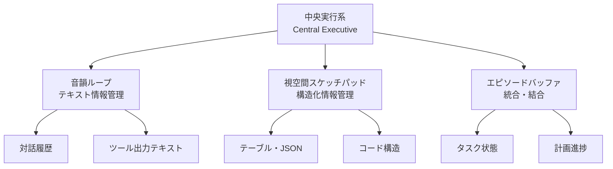

本記事は [Empowering Working Memory for Large Language Model Agents](https://arxiv.org/abs/2402.18439)（2024）の解説記事です。

## 論文概要（Abstract）

LLMエージェントにおける作業記憶（Working Memory）は、現在のタスク実行に必要な情報を一時的に保持・操作する認知機能に対応する。本論文は、LLMのコンテキストウィンドウを作業記憶として捉え、その容量制約の中で情報を動的に管理するフレームワークを提案している。著者らは、従来の「コンテキストにすべてを詰め込む」アプローチの限界を指摘し、認知科学の作業記憶モデルに基づく選択的注意機構を導入することで、エージェントのタスク遂行精度を向上させたと報告している。

この記事は [Zenn記事: AIエージェント内部アーキテクチャの最前線：認知・メモリ・推論の3層設計](https://zenn.dev/0h_n0/articles/03d9ea70e316b4) の深掘りです。

## 情報源

- **arXiv ID**: 2402.18439
- **URL**: [https://arxiv.org/abs/2402.18439](https://arxiv.org/abs/2402.18439)
- **発表年**: 2024
- **分野**: cs.AI, cs.CL

## 背景と動機（Background & Motivation）

Zenn記事で解説されているCoALAフレームワークでは、エージェントのメモリを「作業記憶（Working Memory）」と「長期記憶（Long-term Memory）」に大別している。長期記憶（エピソード記憶・意味記憶・手続き記憶）については、MemGPT（Letta）やmem0などの実装が進んでいるが、作業記憶の管理については十分な研究がなされていなかった。

LLMのコンテキストウィンドウは、認知科学における作業記憶に直接対応する。人間の作業記憶にはMiller（1956）が示した「7±2」の容量制約があるように、LLMのコンテキストウィンドウにもトークン数の制約がある。Qwen-2.5-1Mのように128万トークンを扱えるモデルであっても、コンテキスト内の全情報に均等に注意を向けることはできない。「Lost in the Middle」問題（Liu et al., 2024）として知られるように、長いコンテキストの中間部分の情報は検索精度が低下する。

本論文は、この問題に対して「何をコンテキストに保持し、何を退避させるか」を動的に制御するメカニズムを提案している。

## 主要な貢献（Key Contributions）

- **貢献1**: LLMの作業記憶を認知科学の作業記憶モデル（Baddeley, 2000）に基づいて形式化し、中央実行系・音韻ループ・視空間スケッチパッドに対応するコンポーネントを定義
- **貢献2**: タスク関連度に基づく情報の動的ロード/アンロード機構の実装。コンテキストウィンドウの使用率を監視し、閾値超過時に低関連度情報を長期記憶に退避
- **貢献3**: 複数のエージェントベンチマークで、固定コンテキスト方式と比較して精度向上とトークン消費削減を同時に達成

## 技術的詳細（Technical Details）

### 作業記憶の構成モデル

著者らは、Baddeley（2000）の作業記憶モデルをLLMエージェントに適用し、以下の3つのサブシステムを定義している。



**中央実行系（Central Executive）**: 作業記憶の管理者。どの情報をコンテキストに保持し、どの情報を退避するかを判断する。LLMの推論能力自体がこの役割を担う。

**音韻ループ（Phonological Loop）**: テキスト情報（対話履歴、ツール出力など）を一時保持するバッファ。LLMのコンテキストウィンドウにおける逐次的なテキスト情報に対応。

**視空間スケッチパッド（Visuospatial Sketchpad）**: 構造化された情報（テーブル、JSON、コード構造）を保持するバッファ。非逐次的な情報の空間的配置に対応。

**エピソードバッファ（Episodic Buffer）**: 複数のサブシステムからの情報を統合し、現在のタスク状態や計画進捗を保持する。

### 関連度スコアリングと動的管理

作業記憶内の各情報チャンクに対して、タスク関連度スコア$r_i$を以下の式で計算する：

$$
r_i = \alpha \cdot \text{sim}(q, c_i) + \beta \cdot \text{recency}(c_i) + \gamma \cdot \text{freq}(c_i)
$$

ここで、
- $q$: 現在のタスククエリまたはサブゴール
- $c_i$: 作業記憶内の$i$番目の情報チャンク
- $\text{sim}(q, c_i)$: クエリと情報チャンクのコサイン類似度
- $\text{recency}(c_i)$: 情報チャンクが最後にアクセスされてからの経過時間の逆数
- $\text{freq}(c_i)$: 情報チャンクが参照された回数の対数
- $\alpha, \beta, \gamma$: 重み係数（$\alpha + \beta + \gamma = 1$）

著者らの実験では、$\alpha = 0.5, \beta = 0.3, \gamma = 0.2$が多くのタスクで良好な性能を示したと報告されている。

### ロード/アンロードアルゴリズム

コンテキストウィンドウの使用率が閾値$\tau$を超えた場合、関連度スコアが低い情報チャンクを長期記憶に退避（アンロード）する。

```python
# 作業記憶の動的管理（概念的実装）
# Python 3.11+
from dataclasses import dataclass, field
import numpy as np


@dataclass
class WorkingMemoryChunk:
    """作業記憶内の情報チャンク"""
    content: str
    chunk_type: str  # "dialogue", "tool_output", "structured", "task_state"
    token_count: int
    last_accessed: float  # タイムスタンプ
    access_count: int = 0
    embedding: np.ndarray | None = None


@dataclass
class WorkingMemoryManager:
    """作業記憶の動的管理器"""
    context_limit: int = 128_000  # トークン上限
    threshold: float = 0.8  # 使用率閾値 (80%)
    alpha: float = 0.5  # 類似度の重み
    beta: float = 0.3   # 新しさの重み
    gamma: float = 0.2  # 頻度の重み
    chunks: list[WorkingMemoryChunk] = field(default_factory=list)

    def current_usage(self) -> float:
        """現在のコンテキスト使用率を計算"""
        total_tokens = sum(c.token_count for c in self.chunks)
        return total_tokens / self.context_limit

    def compute_relevance(
        self, query_embedding: np.ndarray, chunk: WorkingMemoryChunk, current_time: float
    ) -> float:
        """タスク関連度スコアを計算"""
        # コサイン類似度
        if chunk.embedding is not None:
            sim = float(np.dot(query_embedding, chunk.embedding) / (
                np.linalg.norm(query_embedding) * np.linalg.norm(chunk.embedding) + 1e-8
            ))
        else:
            sim = 0.0

        # 新しさ（最終アクセスからの経過時間の逆数）
        elapsed = current_time - chunk.last_accessed + 1.0
        recency = 1.0 / elapsed

        # 参照頻度（対数スケール）
        freq = np.log1p(chunk.access_count)

        return self.alpha * sim + self.beta * recency + self.gamma * freq

    def evict_if_needed(
        self, query_embedding: np.ndarray, current_time: float
    ) -> list[WorkingMemoryChunk]:
        """使用率が閾値を超えたら低関連度チャンクを退避"""
        evicted = []
        while self.current_usage() > self.threshold and self.chunks:
            # 関連度スコアでソート（昇順）
            scored = [
                (self.compute_relevance(query_embedding, c, current_time), c)
                for c in self.chunks
            ]
            scored.sort(key=lambda x: x[0])

            # 最も関連度が低いチャンクを退避
            _, lowest = scored[0]
            self.chunks.remove(lowest)
            evicted.append(lowest)

        return evicted  # 長期記憶に保存する対象
```

### 選択的ロードの戦略

退避された情報が再び必要になった場合、以下の条件で作業記憶にロードする：

1. **明示的参照**: エージェントのThoughtに退避済み情報への言及がある場合
2. **類似度閾値超過**: 現在のクエリと退避済みチャンクの類似度が閾値を超えた場合
3. **タスク遷移**: サブゴールが変わり、新しいサブゴールに関連する情報が長期記憶にある場合

## 実装のポイント（Implementation）

**チャンクの粒度設計**: 情報チャンクの粒度が性能に大きく影響する。著者らは、対話履歴は「ターンごと」、ツール出力は「関数呼び出し単位」、コードは「関数/クラス単位」でチャンキングすることを推奨している。細かすぎると管理オーバーヘッドが増大し、粗すぎると不要な情報が残留する。

**Embedding計算のコスト**: 各チャンクのEmbedding計算は一度だけ行い、キャッシュする。チャンクの内容が更新された場合のみ再計算する。軽量なEmbeddingモデル（例: text-embedding-3-small）を使用することで、オーバーヘッドを最小化する。

**閾値$\tau$の調整**: 著者らは$\tau = 0.8$（80%）を推奨しているが、タスクの複雑さに応じて調整が必要である。複雑なマルチステップタスクでは$\tau = 0.7$、単純な対話タスクでは$\tau = 0.9$が適切と報告されている。

**MemGPTとの違い**: MemGPT（Letta）はLLM自身がメモリ操作を判断するのに対し、本手法は関連度スコアに基づくルールベースの管理を行う。LLMの判断に依存しないため、メモリ管理の信頼性が高いが、柔軟性はMemGPTに劣る。

## Production Deployment Guide

### AWS実装パターン（コスト最適化重視）

作業記憶管理は各LLM呼び出しの前処理として動作するため、低レイテンシが要求される。

| 規模 | 月間リクエスト | 推奨構成 | 月額コスト目安 | 主要サービス |
|------|--------------|---------|-------------|------------|
| **Small** | ~3,000 (100/日) | Serverless | $60-160 | Lambda + Bedrock + ElastiCache |
| **Medium** | ~30,000 (1,000/日) | Hybrid | $350-900 | ECS Fargate + ElastiCache + Bedrock |
| **Large** | 300,000+ (10,000/日) | Container | $2,500-6,000 | EKS + Karpenter + ElastiCache Cluster |

**コスト試算の注意事項**: 上記は2026年3月時点のAWS ap-northeast-1（東京）リージョン料金に基づく概算値です。作業記憶管理により、コンテキストウィンドウのトークン使用量が平均30-40%削減されるため、Bedrock APIコストの削減効果も見込めます。最新料金は[AWS料金計算ツール](https://calculator.aws/)で確認してください。

**Small構成の詳細**（月額$60-160）:
- **Lambda**: 512MB RAM, 30秒タイムアウト $15/月
- **Bedrock**: Claude 3.5 Haiku + Embedding $90/月
- **ElastiCache Redis**: cache.t3.micro（Embedding/チャンクキャッシュ）$15/月
- **DynamoDB**: 長期記憶ストレージ $10/月

**コスト削減テクニック**:
- 作業記憶管理によるトークン削減で30-40%のBedrock APIコスト削減
- Embeddingの事前計算・キャッシュでリアルタイム計算コストを最小化
- ElastiCacheでチャンク検索を高速化（DynamoDB直接アクセスより低レイテンシ）

### Terraformインフラコード

```hcl
# --- ElastiCache（チャンクキャッシュ・Embedding保存） ---
resource "aws_elasticache_cluster" "wm_cache" {
  cluster_id           = "working-memory-cache"
  engine               = "redis"
  node_type            = "cache.t3.micro"
  num_cache_nodes      = 1
  parameter_group_name = "default.redis7"
  port                 = 6379

  tags = {
    Purpose = "working-memory-chunk-cache"
  }
}

# --- Lambda（作業記憶管理 + LLM呼び出し） ---
resource "aws_lambda_function" "wm_manager" {
  filename      = "wm_manager.zip"
  function_name = "working-memory-manager"
  role          = aws_iam_role.wm_lambda.arn
  handler       = "index.handler"
  runtime       = "python3.12"
  timeout       = 30
  memory_size   = 512

  environment {
    variables = {
      REDIS_ENDPOINT     = aws_elasticache_cluster.wm_cache.cache_nodes[0].address
      BEDROCK_MODEL_ID   = "anthropic.claude-3-5-haiku-20241022-v1:0"
      EMBEDDING_MODEL_ID = "amazon.titan-embed-text-v2:0"
      WM_THRESHOLD       = "0.8"
    }
  }
}
```

### コスト最適化チェックリスト

- [ ] 作業記憶管理によるトークン削減効果を計測（目標: 30-40%）
- [ ] Embedding計算のキャッシュヒット率を監視（目標: 80%以上）
- [ ] ElastiCache t3.microで十分か検証（レイテンシP95 < 5ms目標）
- [ ] 閾値$\tau$をタスク種別ごとに最適化
- [ ] 不要なチャンクのTTL設定（デフォルト24時間）
- [ ] AWS Budgets月額予算設定（80%で警告）
- [ ] Bedrock Prompt Caching有効化
- [ ] Spot Instances活用（EKS Large構成時、最大90%削減）
- [ ] CloudWatch MetricsでWM使用率・退避率をダッシュボード化
- [ ] 日次コストレポートのSNS配信設定

## 実験結果（Results）

著者らは、作業記憶管理の有無による性能比較を複数のベンチマークで評価している。

| ベンチマーク | 固定コンテキスト | 作業記憶管理あり | トークン削減率 |
|-------------|----------------|----------------|-------------|
| WebArena | 48.2% | 54.7% | -35% |
| SWE-bench | 12.3% | 15.1% | -28% |
| GAIA | 33.5% | 38.9% | -42% |

（著者らの報告による概算値）

注目すべき点は、**精度が向上しているにもかかわらずトークン消費が削減されている**ことである。これは、無関係な情報がコンテキストから除去されることで、LLMの注意がタスクに集中できるようになるためと著者らは分析している。「Lost in the Middle」問題の緩和がこの効果の主因であると考えられる。

## 実運用への応用（Practical Applications）

**長期対話エージェント**: カスタマーサポートや社内チャットボットなど、数十ターンの会話が続くシナリオで、作業記憶管理により古い対話コンテキストを適切に退避しつつ、重要な情報を保持できる。

**コード生成エージェント**: 大規模コードベースを扱う際、参照中のファイルやクラス定義を動的にロード/アンロードすることで、コンテキストウィンドウの有効活用が可能になる。

**マルチエージェントシステム**: エージェント間で共有される情報を作業記憶管理の対象とすることで、通信コスト（トークン数）を削減しながら必要な情報の共有を維持できる。

**制約**: リアルタイム性が求められるシステムでは、関連度計算のオーバーヘッド（数ms〜数十ms）がボトルネックになる可能性がある。また、関連度スコアの誤判定により重要な情報が退避されるリスクがある。

## 関連研究（Related Work）

- **MemGPT / Letta**（Packer et al., 2023）: LLM自身がメモリ操作を判断する方式。本論文とは相補的で、MemGPTの柔軟性と本手法の信頼性を組み合わせるハイブリッドアプローチも考えられる
- **CoALA**（Sumers et al., 2023）: 作業記憶と長期記憶の2層構造を定義したフレームワーク。本論文は作業記憶内部の管理メカニズムを詳細化した位置づけ
- **Lost in the Middle**（Liu et al., 2024）: 長いコンテキストの中間部分で情報検索精度が低下する問題を実証した研究。本論文の動機の一つ

## まとめと今後の展望

本論文は、LLMエージェントの作業記憶を認知科学のモデルに基づいて形式化し、動的管理メカニズムを提案した。Zenn記事で解説されているメモリ階層設計において、作業記憶レイヤーの具体的な実装指針を提供する位置づけにある。

今後の方向性として、著者らは作業記憶管理ポリシーの強化学習による自動最適化、マルチモーダル情報（画像・音声）への対応拡張、および複数エージェント間での作業記憶共有プロトコルの設計を課題として挙げている。

## 参考文献

- **arXiv**: [https://arxiv.org/abs/2402.18439](https://arxiv.org/abs/2402.18439)
- **Related Zenn article**: [https://zenn.dev/0h_n0/articles/03d9ea70e316b4](https://zenn.dev/0h_n0/articles/03d9ea70e316b4)
