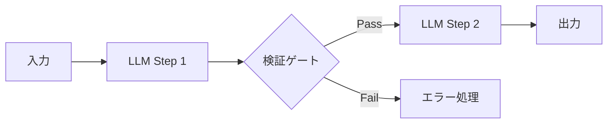
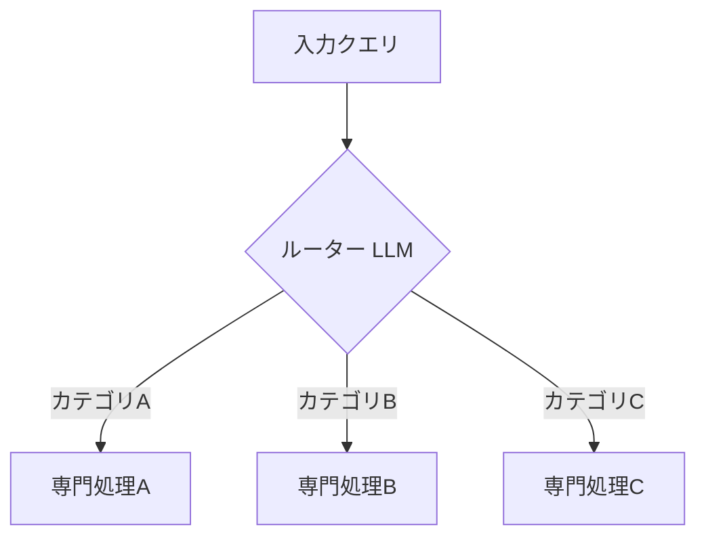
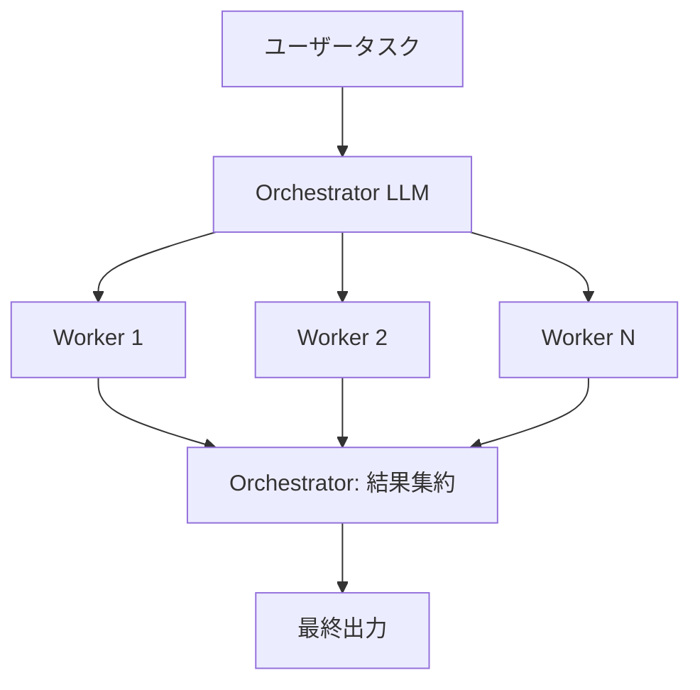
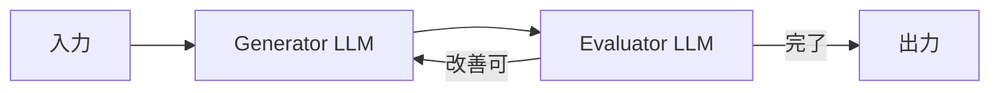

本記事は [Building Effective AI Agents](https://www.anthropic.com/research/building-effective-agents)（Anthropic Research、2024年12月19日公開）の解説記事です。

## ブログ概要（Summary）

Anthropicが2024年12月に公開したAIエージェント設計の公式ガイドである。著者のErik SchluntzとBarry Zhangは、数十チームのエージェント構築を支援した経験から、**ワークフロー**（事前定義されたコードパスでLLMを制御）と**エージェント**（LLMが自律的にプロセスを制御）を明確に区別し、5つのワークフローパターンと3つの設計原則を提示している。

この記事は [Zenn記事: AIソフトウェアアーキテクチャ2026年版：MLOps・LLMOps・AgentOpsの実践設計](https://zenn.dev/0h_n0/articles/7b88993fccf7f8) の深掘りです。

## 情報源

- **種別**: 企業テックブログ（Research記事）
- **URL**: [https://www.anthropic.com/research/building-effective-agents](https://www.anthropic.com/research/building-effective-agents)
- **組織**: Anthropic
- **著者**: Erik Schluntz, Barry Zhang
- **発表日**: 2024年12月19日

## 技術的背景（Technical Background）

LLMベースのエージェントシステムは急速に普及しているが、「エージェント」の定義と設計パターンは開発者によって大きく異なる。過度に複雑なフレームワークを採用してデバッグが困難になるケースや、逆にシンプルなプロンプトチェーンで十分なのにエージェントフレームワークを導入するケースが散見される。

Anthropicの著者らは、**シンプルさ**を最重要原則として掲げ、タスクの複雑度に応じて段階的にアーキテクチャを選択する指針を提示している。

## ワークフローとエージェントの区別

著者らは「エージェント的システム」を以下の2つに明確に分類している。

**ワークフロー**: LLMとツールが**事前定義されたコードパス**でオーケストレーションされるシステム。決定論的な制御フローを持ち、予測可能な動作をする。

**エージェント**: LLMが**自律的に**プロセスとツール使用を制御するシステム。動的な判断を行い、実行パスが入力によって異なる。

## 5つのワークフローパターン

### パターン1: Prompt Chaining（プロンプトチェーン）

タスクを逐次的なステップに分解し、前のステップの出力を次のステップの入力に使用する。各ステップ間にプログラム的な検証ゲートを設置できる。



**適用場面**: マーケティングコピー生成→翻訳、文書要約→品質チェック

**トレードオフ**: レイテンシが増加するが、各ステップのタスクが簡素化されるため精度が向上する。

### パターン2: Routing（ルーティング）

入力を分類し、専門化された下流プロセスに振り分ける。



**適用場面**: カスタマーサポートの問い合わせ分類、モデルルーティング（Claude HaikuとSonnetの切り替え）

**実装のポイント**: ルーティング判定は軽量モデル（Claude Haiku等）で十分な場合が多く、コスト効率が良い。

### パターン3: Parallelization（並列化）

独立したサブタスクを並列に実行する。2つのバリエーションがある。

- **Sectioning**: 異なるサブタスクを同時実行（例: コードレビューでセキュリティ・パフォーマンス・可読性を並列チェック）
- **Voting**: 同一タスクを複数回実行し、多数決や集約（例: 複数のLLMに同じ翻訳を依頼して最良を選択）

### パターン4: Orchestrator-Workers（オーケストレータ-ワーカー）

中央のオーケストレータLLMがタスクを動的に分解し、ワーカーLLMに委託する。



**パターン3との違い**: 並列化はサブタスクが事前に決まっているが、Orchestrator-Workersではオーケストレータが入力に応じてサブタスクを動的に決定する。

**適用場面**: 複数ファイルにまたがるコード修正、複数ソースからの情報収集

### パターン5: Evaluator-Optimizer（評価者-最適化者）

生成LLMと評価LLMのフィードバックループで反復的に品質を改善する。



**適用場面**: 文学翻訳のニュアンス調整、検索の網羅性向上

**前提条件**: 評価基準が明確で、反復により実際に品質が向上するタスクに限定される。

## エージェント設計の3原則

### 原則1: Simplicity（シンプルさ）

著者らは以下のように述べている。

> "Success in the LLM space isn't about building the most sophisticated system. It's about building the right system for your needs."

複雑さの追加は、**測定可能な性能改善**がある場合にのみ正当化される。多くのアプリケーションでは、検索付きの単一LLM呼び出しで十分であるとされている。

### 原則2: Transparency（透明性）

エージェントの計画ステップを明示的に表示し、デバッグと信頼性向上を図る。内部の推論過程が不透明なエージェントは、障害時の原因特定が困難になる。

### 原則3: Tool Design（ツール設計の品質）

Agent-Computer Interface（ACI）の設計に、人間向けUIと同等の投資を行うべきだと著者らは主張している。具体的には以下が推奨されている。

- ツール説明にエッジケースと使用例を含める
- 引数設計で誤りを構造的に防ぐ（poka-yoke設計）
- 絶対パスを要求することでファイルパスの曖昧さを排除

```python
# 悪い例: 相対パスを許容（エラーの温床）
def read_file(path: str) -> str:
    """ファイルを読み込む"""
    ...

# 良い例: 絶対パスを強制（poka-yoke設計）
def read_file(absolute_path: str) -> str:
    """ファイルを読み込む

    Args:
        absolute_path: ファイルの絶対パス（/から始まること）。
            相対パスはエラーになります。
            例: /home/user/project/src/main.py
    """
    if not absolute_path.startswith("/"):
        raise ValueError(f"絶対パスが必要です: {absolute_path}")
    ...
```

## 本番適用事例

### カスタマーサポート

著者らは、カスタマーサポートがエージェントの最適な適用先の1つであると述べている。理由は以下の通り。

- チャットインターフェースが自然に統合される
- ツール呼び出し（チケット作成、DB検索）との組み合わせが容易
- 解決率という明確な成功指標がある
- 一部の実装では解決成功時のみ課金するモデルが採用されている

### コーディングエージェント

- テスト実行による自動検証が可能
- テスト結果のフィードバックで反復改善できる
- SWE-bench Verifiedベンチマークでの評価が確立されている
- ただし、システム要件との整合性確認には人間のレビューが不可欠

## 実装アーキテクチャ（Architecture）

著者らが推奨するアーキテクチャの段階的な選択指針を以下に整理する。

| タスクの複雑度 | 推奨アーキテクチャ | 例 |
|-------------|----------------|---|
| **単純** | 単一LLM + Retrieval | FAQ応答、定型文生成 |
| **中程度** | Prompt Chaining / Routing | 文書処理パイプライン |
| **複雑・決定論的** | Orchestrator-Workers | マルチファイルコード修正 |
| **複雑・非決定論的** | 自律エージェント | オープンエンドな調査 |

**フレームワーク選択の指針**:

著者らは、Claude Agent SDK、AWS Strands Agents SDK、Rivet、Vellum等を紹介しつつも、以下を推奨している。

1. まずLLM APIを直接呼び出してパターンを実装する
2. フレームワークの抽象化レイヤーの中身を理解する
3. 本番環境では抽象化レイヤーを削減し、制御可能性を確保する

## Production Deployment Guide

### AWS実装パターン（コスト最適化重視）

Anthropicのワークフローパターンに基づくエージェントシステムをAWS上に構築する構成を示す。

**トラフィック量別の推奨構成**:

| 規模 | 月間リクエスト | 推奨パターン | 月額コスト概算 | 主要サービス |
|------|--------------|-------------|-------------|------------|
| **Small** | ~3,000 (100/日) | Prompt Chaining | $60-180 | Lambda + Bedrock + SQS |
| **Medium** | ~30,000 (1,000/日) | Routing + Workers | $400-1,200 | Step Functions + ECS + Bedrock |
| **Large** | 300,000+ (10,000/日) | Orchestrator-Workers | $3,000-8,000 | EKS + Bedrock Batch + ElastiCache |

**Small構成の詳細**（月額$60-180）:
- **Lambda**: 各ワークフローステップを独立関数化（$15/月）
- **Bedrock**: Claude 3.5 Haiku（ルーティング判定）+ Claude 3.5 Sonnet（生成）（$120/月）
- **SQS**: ステップ間の非同期メッセージング（$5/月）
- **DynamoDB**: 会話状態・ツール実行結果の保存（$10/月）

**コスト削減テクニック**:
- Routingパターンで軽量モデル（Haiku）に振り分けることで平均コストを50-70%削減
- Prompt Cachingでシステムプロンプト固定部分のコスト30-90%削減
- SQSバッファリングによるBedrock APIのバースト制御

**コスト試算の注意事項**: 上記は2026年3月時点のAWS ap-northeast-1料金に基づく概算値です。

### Terraformインフラコード

**Prompt Chaining構成: Lambda Chain + SQS**

```hcl
# --- Lambda関数（チェーンの各ステップ） ---
resource "aws_lambda_function" "chain_step" {
  for_each      = toset(["classifier", "generator", "evaluator"])
  filename      = "${each.key}_lambda.zip"
  function_name = "agent-${each.key}"
  role          = aws_iam_role.agent_lambda.arn
  handler       = "${each.key}.handler"
  runtime       = "python3.12"
  timeout       = 120
  memory_size   = 1024

  environment {
    variables = {
      BEDROCK_REGION  = "ap-northeast-1"
      ROUTING_MODEL   = "anthropic.claude-3-5-haiku-20241022-v1:0"
      GENERATOR_MODEL = "anthropic.claude-3-5-sonnet-20241022-v2:0"
      STATE_TABLE     = aws_dynamodb_table.agent_state.name
    }
  }
}

# --- SQS（ステップ間メッセージング） ---
resource "aws_sqs_queue" "chain_queue" {
  for_each                  = toset(["classify-to-generate", "generate-to-evaluate"])
  name                      = "agent-chain-${each.key}"
  visibility_timeout_seconds = 300
  message_retention_seconds  = 86400

  redrive_policy = jsonencode({
    deadLetterTargetArn = aws_sqs_queue.dlq.arn
    maxReceiveCount     = 3
  })
}

resource "aws_sqs_queue" "dlq" {
  name = "agent-chain-dlq"
}

# --- DynamoDB（エージェント状態管理） ---
resource "aws_dynamodb_table" "agent_state" {
  name         = "agent-conversation-state"
  billing_mode = "PAY_PER_REQUEST"
  hash_key     = "session_id"

  attribute {
    name = "session_id"
    type = "S"
  }

  ttl {
    attribute_name = "expire_at"
    enabled        = true
  }
}
```

### コスト最適化チェックリスト

- [ ] Routingパターンで軽量モデル（Haiku）への振り分け率を70%以上に設定
- [ ] Prompt Caching有効化（システムプロンプト固定部分）
- [ ] SQSデッドレターキューで失敗リクエストの再処理コスト削減
- [ ] Evaluator-Optimizerの最大反復回数を制限（3回以下推奨）
- [ ] CloudWatch Budgetsで月額予算アラート設定
- [ ] Bedrock Batch APIを非リアルタイム処理に適用（50%割引）
- [ ] Lambda Provisioned Concurrencyは不使用（コスト増大防止）
- [ ] DynamoDB TTLで古い会話状態を自動削除

## 学術研究との関連（Academic Connection）

- **ReAct**（Yao et al., 2023）: 推論と行動を交互に行うエージェントパターン。Anthropicの「自律エージェント」パターンはReActの実装ガイドラインと位置づけられる
- **Toolformer**（Schick et al., 2023）: LLMにツール使用を学習させる手法。Anthropicの「ツール設計の品質」原則はToolformerの知見を実務に落とし込んだもの
- **RouteLLM**（Ong et al., 2024）: Anthropicの「Routing」パターンはRouteLLMの学習ベースルーティングと相補的

## まとめと実践への示唆

Anthropicのガイドは、エージェントシステムの設計において**シンプルさを第一原則**とすることを強調している。5つのワークフローパターンは複雑度の段階的なスペクトルを形成しており、タスクの特性に応じて最も単純なパターンから選択すべきであるとされている。AgentOpsの文脈では、各パターンの選択基準と移行判断を明確にすることが、運用コストとデバッグ容易性の両面で重要である。

## 参考文献

- **Blog URL**: [https://www.anthropic.com/research/building-effective-agents](https://www.anthropic.com/research/building-effective-agents)
- **Claude Agent SDK**: [https://github.com/anthropics/claude-code-sdk](https://github.com/anthropics/claude-code-sdk)
- **Related Zenn article**: [https://zenn.dev/0h_n0/articles/7b88993fccf7f8](https://zenn.dev/0h_n0/articles/7b88993fccf7f8)
