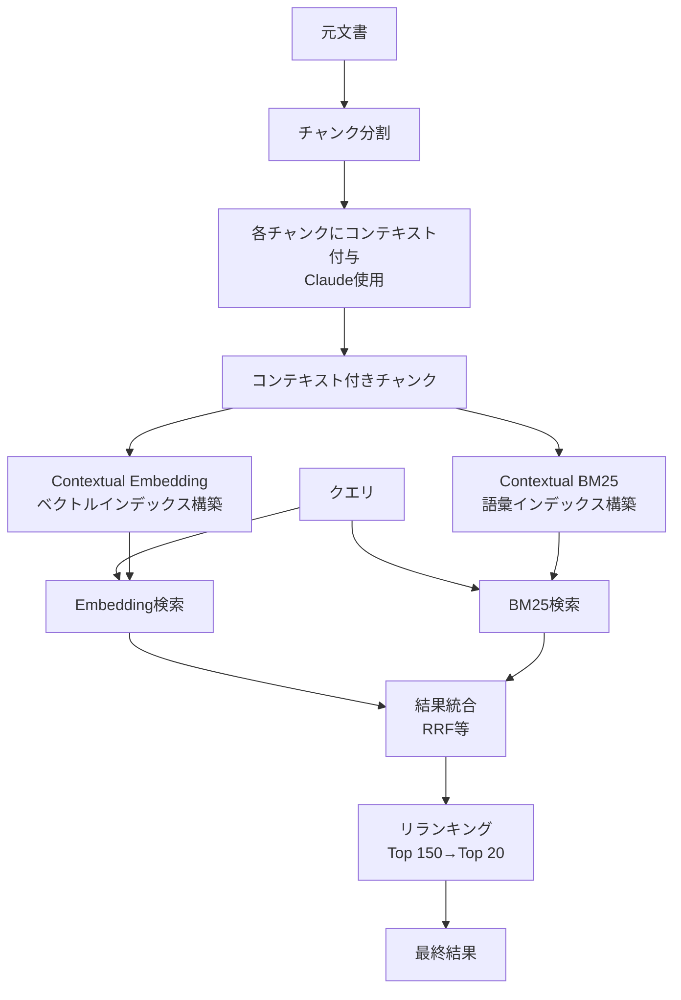

本記事は [Introducing Contextual Retrieval](https://www.anthropic.com/news/contextual-retrieval)（Anthropic, 2024年9月）の解説記事です。

## ブログ概要（Summary）

Anthropicは、RAG（Retrieval-Augmented Generation）パイプラインにおける検索精度の課題を解決するために**Contextual Retrieval**を提案している。従来のチャンク分割では文書全体のコンテキストが失われ、検索精度が低下する問題があった。Contextual Retrievalでは、各チャンクにClaudeを用いて簡潔なコンテキスト（50-100トークン）を自動付与し、このコンテキスト付きチャンクでEmbeddingとBM25インデックスを構築する。Anthropicの報告によると、Contextual Embeddings単体で検索失敗を35%削減、BM25との組み合わせで49%削減、さらにリランキングとの組み合わせで**67%削減**を達成したとされている。

この記事は [Zenn記事: セマンティック検索の本番精度チューニング：クエリ最適化×多段リランキング×評価ループ実践](https://zenn.dev/0h_n0/articles/42ecab7378cf0b) の深掘りです。

## 情報源

- **種別**: 企業テックブログ
- **URL**: [https://www.anthropic.com/news/contextual-retrieval](https://www.anthropic.com/news/contextual-retrieval)
- **組織**: Anthropic
- **発表日**: 2024年9月

## 技術的背景（Technical Background）

RAGシステムでは、長い文書をチャンク（断片）に分割してベクトル化し、クエリとの類似度で関連チャンクを取得する。しかし、チャンク分割によって元の文書コンテキストが失われるという根本的な課題がある。

Anthropicのブログでは以下の例が挙げられている。「Q3の収益は$9.4 billionで、前年同期比40%増であった」というチャンクがあった場合、このチャンクだけでは「どの会社の」「何年の」Q3収益なのかがわからない。この情報欠損により、「2023年のAcme Corp.のQ3収益は？」というクエリに対して、正しいチャンクが検索結果の上位に来ない問題が発生する。

この課題は、Zenn記事で紹介している「検索意図と文書表現のギャップ」の一形態であり、クエリ最適化（HyDE、Multi-Query等）だけでは解決困難な文書側の問題である。

## 実装アーキテクチャ（Architecture）

### Contextual Retrievalの処理フロー



### コンテキスト生成

各チャンクに対して、Claudeを用いて以下のようなプロンプトでコンテキストを生成する。Anthropicのブログで示されているプロンプトテンプレートは以下の通りである。

```
<document>
{{WHOLE_DOCUMENT}}
</document>
Here is the chunk we want to situate within the whole document
<chunk>
{{CHUNK_CONTENT}}
</chunk>
Please give a short succinct context to situate this chunk within the
overall document for the purposes of improving search retrieval of the
chunk. Answer only with the succinct context and nothing else.
```

生成されるコンテキストは50-100トークン程度で、チャンクの元文書内での位置づけを要約したものとなる。このコンテキストがチャンクの前に付与され、Embedding生成とBM25インデックスの両方に使用される。

### ハイブリッド検索の統合

Contextual Retrievalでは、Embedding検索（意味的類似度）とBM25検索（語彙的マッチング）の結果をRRF（Reciprocal Rank Fusion）等で統合することが推奨されている。

$$
\text{RRF}(d) = \sum_{r \in R} \frac{1}{k + r(d)}
$$

ここで、
- $R$: 各検索手法の結果セット
- $r(d)$: 文書 $d$ のランキング順位
- $k$: 定数（通常60）

Embeddingモデルは意味的な関連性を捉えるが、エラーコードや固有名詞のような正確な語彙マッチには弱い。BM25はこの弱点を補完する。

### リランキングの追加

初期検索で取得したTop 150チャンクに対してリランカー（cross-encoder等）を適用し、Top 20に絞り込む。この段階でさらなる精度向上を実現している。

## Production Deployment Guide

### AWS実装パターン（コスト最適化重視）

Contextual Retrievalパイプラインは「前処理（コンテキスト生成）」と「オンライン検索」の2フェーズに分かれる。前処理は一度実行すればよく、オンライン検索のみがリアルタイムで発生する。

| 規模 | 月間リクエスト | 推奨構成 | 月額コスト | 主要サービス |
|------|--------------|---------|-----------|------------|
| **Small** | ~3,000 (100/日) | Serverless | $80-200 | Lambda + Bedrock + OpenSearch Serverless |
| **Medium** | ~30,000 (1,000/日) | Hybrid | $400-1,200 | Lambda + ECS + OpenSearch + ElastiCache |
| **Large** | 300,000+ (10,000/日) | Container | $2,500-6,000 | EKS + OpenSearch + Bedrock Batch |

**Small構成の詳細**（月額$80-200）:
- **Lambda（前処理）**: コンテキスト生成バッチ処理（$10/月、初回のみ）
- **Bedrock**: Claude 3.5 Haiku（コンテキスト生成）、Prompt Caching有効（$80/月、前処理時）
- **OpenSearch Serverless**: Embedding + BM25ハイブリッドインデックス（$50/月）
- **Lambda（オンライン検索）**: クエリ処理、512MB RAM（$10/月）
- **CloudWatch**: 基本監視（$5/月）

**前処理コストの最適化**: Anthropicのブログによると、Prompt Cachingを活用することでコンテキスト生成のコストを「100万文書トークンあたり約$1.02」に抑えられるとされている。これは一度のインデックス構築で発生する一時的なコストである。

**コスト試算の注意事項**:
上記は2026年3月時点のAWS ap-northeast-1（東京）リージョン料金に基づく概算値です。前処理コストは文書量に比例し、オンライン検索コストはリクエスト数に比例します。最新料金は [AWS料金計算ツール](https://calculator.aws/) で確認してください。

### Terraformインフラコード

**Small構成（Serverless）: Lambda + Bedrock + OpenSearch Serverless**

```hcl
# --- IAMロール（最小権限） ---
resource "aws_iam_role" "lambda_contextual" {
  name = "lambda-contextual-retrieval-role"
  assume_role_policy = jsonencode({
    Version = "2012-10-17"
    Statement = [{
      Action    = "sts:AssumeRole"
      Effect    = "Allow"
      Principal = { Service = "lambda.amazonaws.com" }
    }]
  })
}

resource "aws_iam_role_policy" "bedrock_and_opensearch" {
  role = aws_iam_role.lambda_contextual.id
  policy = jsonencode({
    Version = "2012-10-17"
    Statement = [
      {
        Effect   = "Allow"
        Action   = ["bedrock:InvokeModel"]
        Resource = "arn:aws:bedrock:ap-northeast-1::foundation-model/anthropic.claude-3-5-haiku*"
      },
      {
        Effect   = "Allow"
        Action   = ["aoss:APIAccessAll"]
        Resource = aws_opensearchserverless_collection.contextual.arn
      }
    ]
  })
}

# --- OpenSearch Serverless（ハイブリッド検索） ---
resource "aws_opensearchserverless_collection" "contextual" {
  name = "contextual-retrieval"
  type = "VECTORSEARCH"
}

resource "aws_opensearchserverless_security_policy" "encryption" {
  name = "contextual-encryption"
  type = "encryption"
  policy = jsonencode({
    Rules   = [{ ResourceType = "collection", Resource = ["collection/contextual-retrieval"] }]
    AWSOwnedKey = true
  })
}

# --- Lambda関数（コンテキスト生成） ---
resource "aws_lambda_function" "context_generator" {
  filename      = "context_gen.zip"
  function_name = "contextual-retrieval-generator"
  role          = aws_iam_role.lambda_contextual.arn
  handler       = "index.handler"
  runtime       = "python3.12"
  timeout       = 300
  memory_size   = 1024

  environment {
    variables = {
      BEDROCK_MODEL_ID    = "anthropic.claude-3-5-haiku-20241022-v1:0"
      OPENSEARCH_ENDPOINT = aws_opensearchserverless_collection.contextual.collection_endpoint
      ENABLE_PROMPT_CACHE = "true"
    }
  }
}

# --- Lambda関数（オンライン検索） ---
resource "aws_lambda_function" "search_handler" {
  filename      = "search.zip"
  function_name = "contextual-retrieval-search"
  role          = aws_iam_role.lambda_contextual.arn
  handler       = "index.handler"
  runtime       = "python3.12"
  timeout       = 30
  memory_size   = 512

  environment {
    variables = {
      OPENSEARCH_ENDPOINT = aws_opensearchserverless_collection.contextual.collection_endpoint
      RERANKER_ENDPOINT   = "sagemaker-reranker-endpoint"
      TOP_K_INITIAL       = "150"
      TOP_K_RERANKED      = "20"
    }
  }
}

# --- CloudWatch アラーム ---
resource "aws_cloudwatch_metric_alarm" "search_latency" {
  alarm_name          = "contextual-search-latency-high"
  comparison_operator = "GreaterThanThreshold"
  evaluation_periods  = 2
  metric_name         = "Duration"
  namespace           = "AWS/Lambda"
  period              = 300
  statistic           = "p95"
  threshold           = 10000
  alarm_description   = "検索P95レイテンシが10秒超過"

  dimensions = {
    FunctionName = aws_lambda_function.search_handler.function_name
  }
}
```

### セキュリティベストプラクティス

- **ネットワーク**: OpenSearch ServerlessへのアクセスはVPCエンドポイント経由
- **認証**: IAMロール最小権限、Bedrockモデル呼び出し権限はモデル単位で制限
- **暗号化**: OpenSearchインデックス・S3すべてKMS暗号化
- **データ保護**: PII情報を含むチャンクのコンテキスト生成時にマスキング処理
- **監査**: CloudTrail有効化、Lambda実行ログをCloudWatch Logsに出力

### 運用・監視設定

```sql
-- CloudWatch Logs Insights: 前処理コスト監視
fields @timestamp, chunk_id, context_tokens, bedrock_cost_usd
| stats sum(bedrock_cost_usd) as total_cost, count() as chunks_processed by bin(1h)
| filter total_cost > 10
```

```python
import boto3

cloudwatch = boto3.client('cloudwatch')

# 前処理バッチのコスト監視
cloudwatch.put_metric_alarm(
    AlarmName='context-gen-cost-spike',
    ComparisonOperator='GreaterThanThreshold',
    EvaluationPeriods=1,
    MetricName='ContextGenCost',
    Namespace='Custom/ContextualRetrieval',
    Period=3600,
    Statistic='Sum',
    Threshold=50,
    AlarmDescription='コンテキスト生成コストが$50/時間を超過'
)
```

### コスト最適化チェックリスト

- [ ] ~100 req/日 → Lambda + Bedrock + OpenSearch Serverless - $80-200/月
- [ ] ~1,000 req/日 → ECS + OpenSearch Managed - $400-1,200/月
- [ ] 10,000+ req/日 → EKS + OpenSearch + Bedrock Batch - $2,500-6,000/月
- [ ] Prompt Caching有効化（コンテキスト生成で30-90%削減）
- [ ] Bedrock Batch API（大量文書の前処理で50%削減）
- [ ] OpenSearch Serverlessのアイドル時自動スケールダウン
- [ ] 前処理結果のS3キャッシュ（再インデックス時のコスト削減）
- [ ] チャンクサイズ最適化（大きすぎるとコンテキスト生成コスト増）
- [ ] BM25インデックスとEmbeddingインデックスの分離管理
- [ ] リランカーのSageMaker Serverless（アイドル時ゼロコスト）
- [ ] Spot Instances使用（EKS構成で最大90%削減）
- [ ] AWS Budgets設定（月額予算の80%で警告）
- [ ] Cost Anomaly Detection有効化
- [ ] タグ戦略（前処理/オンライン検索でコスト分離）
- [ ] 差分更新（変更チャンクのみコンテキスト再生成）
- [ ] モデル選択: Claude 3.5 Haiku（コンテキスト生成は軽量タスク）
- [ ] CloudTrail/Config有効化（セキュリティ監査）
- [ ] KMS暗号化（OpenSearch/S3）
- [ ] 日次コストレポート（SNS/Slack通知）
- [ ] 不要なインデックス定期削除

## パフォーマンス最適化（Performance）

Anthropicのブログで報告されている改善効果を整理する。

| 手法 | 検索失敗率 | ベースラインからの削減 |
|------|-----------|-------------------|
| 通常のEmbedding（ベースライン） | 5.7% | — |
| Contextual Embeddings | 3.7% | **35%削減** |
| Contextual Embeddings + BM25 | 2.9% | **49%削減** |
| Contextual Embeddings + BM25 + リランキング | 1.9% | **67%削減** |

Anthropicの報告によると、Top-20チャンクの検索失敗率（正解チャンクが含まれない割合）を基準として測定されている。ベースラインの5.7%から最終的に1.9%まで改善されたとされている。

**レイテンシ影響**: コンテキスト付与は前処理（インデックス構築時）に行われるため、オンライン検索のレイテンシには影響しない。追加のレイテンシはリランキングステップ（Top 150 → Top 20）のみである。

**前処理コスト**: Prompt Cachingを活用した場合、100万文書トークンあたり約$1.02とされている。これは一度の前処理コストであり、運用コストには含まれない。

## 運用での学び（Production Lessons）

Anthropicのブログから読み取れる運用上の知見を整理する。

**コンテキスト品質がカギ**: 生成されるコンテキストの品質が検索精度に直結する。プロンプトテンプレートの調整により、ドメインに特化したコンテキスト生成が可能だが、過剰なコンテキスト（長すぎる）はかえってノイズとなる可能性がある。

**BM25との組み合わせが重要**: Embeddingだけでは正確な語彙マッチング（エラーコード、型番等）が弱く、BM25との併用が推奨されている。これはZenn記事で紹介しているハイブリッド検索と同じ考え方である。

**リランキングの追加効果**: Contextual Retrieval単体で49%削減を達成した上で、リランキング追加でさらに67%削減まで改善されている。リランキングの追加効果は単体で約18ポイントであり、Zenn記事で紹介しているcross-encoderリランキングの効果と整合する。

## 学術研究との関連（Academic Connection）

- **HyDE（Gao et al., 2022）**: HyDEがクエリ側のコンテキスト補完であるのに対し、Contextual Retrievalは文書側のコンテキスト補完である。両者は相補的なアプローチである
- **Chunk Augmentation研究**: チャンクにメタデータやサマリーを付与して検索精度を向上させる研究は複数存在するが、Contextual RetrievalはLLMを用いた自動コンテキスト生成をPrompt Cachingで実用的なコストに抑えた点が特徴的である
- **ハイブリッド検索**: Embedding + BM25の組み合わせは情報検索研究で広く研究されており、Contextual Retrievalはこの枠組みの上にコンテキスト付与を追加したものと位置づけられる

## まとめと実践への示唆

Contextual Retrievalは、文書チャンクにLLMでコンテキストを自動付与するという前処理手法を通じて、RAG検索精度を大幅に改善するアプローチである。Anthropicの報告では、Contextual Embeddings + BM25 + リランキングの組み合わせで検索失敗率を67%削減したとされている。

Zenn記事で紹介しているパイプライン（クエリ最適化 → 多段リランキング → 評価ループ）に加えて、文書側のContextual Retrieval前処理を組み込むことで、さらなる精度改善が期待できる。特に、前処理はインデックス構築時に一度実行すればよく、オンライン検索のレイテンシに影響しない点が実用的である。

## 参考文献

- **Blog URL**: [https://www.anthropic.com/news/contextual-retrieval](https://www.anthropic.com/news/contextual-retrieval)
- **Related Zenn article**: [https://zenn.dev/0h_n0/articles/42ecab7378cf0b](https://zenn.dev/0h_n0/articles/42ecab7378cf0b)

---

:::message
この記事はAI（Claude Code）により自動生成されました。内容はAnthropicブログの解説であり、筆者自身が実験を行ったものではありません。実際の利用時は公式ブログもご確認ください。
:::
