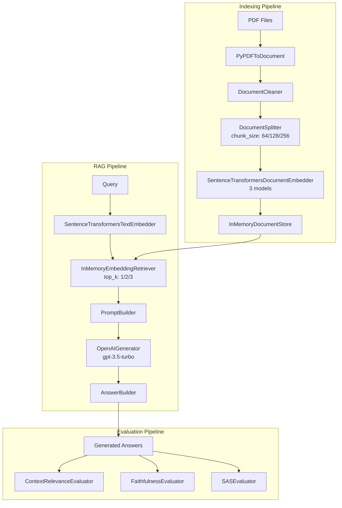

本記事は [Benchmarking Haystack Pipelines for Optimal Performance](https://haystack.deepset.ai/blog/benchmarking-haystack-pipelines)（deepset公式ブログ、2024年6月24日公開）の解説記事です。

## ブログ概要（Summary）

deepset社のSenior NLP EngineerであるDavid Batistaは、Haystack 2.xのRAGパイプラインを系統的にベンチマークする手法と結果を報告している。ARAGOGデータセット（423本のTransformer/LLM関連論文、107の質問-回答ペア）を使用し、**埋め込みモデル**、**top_k**、**チャンクサイズ**の3パラメータについて27パターンの組み合わせを網羅的に評価した。評価にはContext Relevance、Faithfulness、SASの3メトリクスを用い、msmarco-distilroberta-base-v2がtop_k=3、chunk_size=128の組み合わせで最高のSASスコア0.686を達成したと報告している。

この記事は [Zenn記事: Haystack 2.xのQAパイプラインを本番運用する：カスタムComponent・非同期実行・監視まで](https://zenn.dev/0h_n0/articles/6555f50d3f85ce) の深掘りです。

## 情報源

- **種別**: 企業テックブログ
- **URL**: [https://haystack.deepset.ai/blog/benchmarking-haystack-pipelines](https://haystack.deepset.ai/blog/benchmarking-haystack-pipelines)
- **組織**: deepset（Haystack開発元）
- **著者**: David Batista, Senior NLP Engineer
- **発表日**: 2024年6月24日

## 技術的背景（Technical Background）

RAGパイプラインの性能はモデル選択やハイパーパラメータに大きく依存するが、最適な設定を見つけるための体系的手法は十分に確立されていない。ドキュメントのチャンクサイズが小さすぎれば文脈情報が失われ、大きすぎればノイズが増加する。top_kの選択も同様で、取得件数を増やせば網羅性は高まるが、不要な情報の混入によりLLMの回答品質が低下するリスクがある。

Batistaは、これらの相互依存するパラメータの影響を分離して評価するために、グリッドサーチ方式による系統的ベンチマークを実施した。Haystack 2.xの宣言的パイプラインAPIにより、パイプラインの構築・再構成がプログラマティックに行えるため、大規模な実験を自動化できる点がこの手法の基盤となっている。

## 実装アーキテクチャ（Architecture）

Batistaが報告しているベンチマークシステムは、3つの独立したパイプラインで構成される。



**Indexingパイプライン**は、PDFからテキストを抽出し、クリーニング、分割、埋め込みベクトル化を経てDocumentStoreに格納する。**RAGパイプライン**は、クエリの埋め込み、ベクトル検索、プロンプト構築、LLM生成、回答構築を直列に実行する。**Evaluationパイプライン**は、3つの評価メトリクスを並列に計算する。

この3段階の分離設計により、Indexingパイプラインのパラメータ（チャンクサイズ、埋め込みモデル）とRAGパイプラインのパラメータ（top_k）を独立に変更し、27パターンの全組み合わせを系統的に評価できる構成となっている。

### Indexingパイプラインの実装

Batistaが公開しているIndexingパイプラインの実装コードは以下の通りである。

```python
from haystack import Pipeline
from haystack.components.converters import PyPDFToDocument
from haystack.components.preprocessors import DocumentCleaner, DocumentSplitter
from haystack.components.embedders import SentenceTransformersDocumentEmbedder
from haystack.document_stores.in_memory import InMemoryDocumentStore


def indexing(embedding_model: str, chunk_size: int) -> InMemoryDocumentStore:
    """Indexingパイプラインを構築・実行する。

    Args:
        embedding_model: SentenceTransformersの埋め込みモデル名
        chunk_size: DocumentSplitterのトークン分割長

    Returns:
        埋め込み済みドキュメントを格納したDocumentStore
    """
    document_store = InMemoryDocumentStore()
    pipeline = Pipeline()
    pipeline.add_component("converter", PyPDFToDocument())
    pipeline.add_component("cleaner", DocumentCleaner())
    pipeline.add_component(
        "splitter", DocumentSplitter(split_length=chunk_size)
    )
    pipeline.add_component(
        "embedder",
        SentenceTransformersDocumentEmbedder(embedding_model),
    )
    pipeline.add_component(
        "writer",
        DocumentWriter(document_store=document_store),
    )
    pipeline.connect("converter", "cleaner")
    pipeline.connect("cleaner", "splitter")
    pipeline.connect("splitter", "embedder")
    pipeline.connect("embedder", "writer")
    return document_store
```

Haystack 2.xの`Pipeline.add_component`と`Pipeline.connect`によるDAGベースの宣言的パイプライン構築が使われている。各コンポーネントは入出力ソケットを持ち、`connect`で接続することでデータフローを定義する。

## 評価メトリクスの詳細

Batistaは3つの評価メトリクスを使い分けている。それぞれが評価する品質の側面が異なり、組み合わせることでRAGシステムの総合的な品質を把握できる。

### 1. Context Relevance（コンテキスト関連度）

検索されたドキュメントが質問に対して関連しているかを評価する。Haystack 2.xの`ContextRelevanceEvaluator`はLLMベースの評価器であり、検索結果の各文について「質問に答えるために有用か」を判定し、有用な文の割合をスコアとして返す。

$$
\text{ContextRelevance} = \frac{|\{s \in C \mid \text{relevant}(s, q)\}|}{|C|}
$$

ここで、$C$は検索されたコンテキスト中の文の集合、$q$はクエリ、$\text{relevant}(s, q)$は文$s$がクエリ$q$に関連しているかのLLM判定である。

### 2. Faithfulness（忠実度）

生成された回答がコンテキストに基づいているかを評価する。ハルシネーション（LLMがコンテキストに含まれない情報を生成する現象）の検出に直結するメトリクスである。

$$
\text{Faithfulness} = \frac{|\{s \in A \mid \text{supported}(s, C)\}|}{|A|}
$$

ここで、$A$は生成回答中の文の集合、$\text{supported}(s, C)$は文$s$がコンテキスト$C$から導出可能かのLLM判定である。

### 3. SAS（Semantic Answer Similarity）

生成された回答と正解回答の意味的類似度を、埋め込みベクトルのコサイン類似度で測定する。BLEU等のn-gramベースのメトリクスとは異なり、表現が異なっていても意味的に同等であれば高いスコアを返す。

$$
\text{SAS}(a, a^*) = \cos(\mathbf{e}_a, \mathbf{e}_{a^*}) = \frac{\mathbf{e}_a \cdot \mathbf{e}_{a^*}}{\|\mathbf{e}_a\| \|\mathbf{e}_{a^*}\|}
$$

ここで、$a$は生成回答、$a^*$は正解回答、$\mathbf{e}_a$と$\mathbf{e}_{a^*}$はそれぞれの埋め込みベクトルである。

### メトリクス間の関係

3つのメトリクスは相互に独立ではない。Context Relevanceが低い（無関係なドキュメントが検索される）場合、Faithfulnessは高くても回答品質（SAS）は低くなり得る。逆にContext Relevanceが高くても、LLMがコンテキストを無視してハルシネーションを起こせばFaithfulnessが低下する。

## パラメータ空間と実験設計

Batistaは以下の3軸によるグリッドサーチを実施した。

| パラメータ | 探索値 | 根拠 |
|-----------|-------|------|
| **embedding_model** | all-MiniLM-L6-v2, msmarco-distilroberta-base-v2, all-mpnet-base-v2 | 異なるアーキテクチャ・訓練データの代表的モデル |
| **top_k** | 1, 2, 3 | 少数のドキュメント検索における精度とノイズのトレードオフ |
| **chunk_size** | 64, 128, 256 tokens | 短い文脈から段落レベルまでの粒度 |

合計 $3 \times 3 \times 3 = 27$ パターンの組み合わせを評価している。

### 実験の計算要件

Batistaは実験の計算要件を以下のように報告している。

- **9回のインデックス作成**: 3つの埋め込みモデル x 3つのチャンクサイズ
- **2,889回のRAGパイプライン実行**: 27パターン x 107質問
- **7,667回のOpenAI API呼び出し**: RAG生成 + LLMベース評価
- **実行環境**: MacBook Pro M3 Pro, 36GB RAM, Haystack 2.2.1

### データセット: ARAGOG

使用されたARAGOG（Advanced RAG Output Grading）データセットは、Transformer/LLMテーマに関する423本の研究論文と107の質問-回答ペアで構成されている。実験ではこのうち16本の論文が使用された。このデータセットはRAGシステムの評価に特化しており、質問に対する正解回答が人手で作成されているため、SASメトリクスによる自動評価が可能である。

## パフォーマンス最適化（Performance）

### ベンチマーク結果の詳細分析

Batistaが報告したSASスコア上位5パターンを以下に示す。

| 順位 | embedding_model | top_k | chunk_size | SAS | Context Relevance | Faithfulness |
|------|----------------|-------|-----------|-----|-------------------|-------------|
| 1 | msmarco-distilroberta-base-v2 | 3 | 128 | **0.686** | 0.945 | 0.937 |
| 2 | all-MiniLM-L6-v2 | 3 | 256 | 0.676 | - | - |
| 3 | msmarco-distilroberta-base-v2 | 3 | 64 | 0.673 | - | - |
| 4 | msmarco-distilroberta-base-v2 | 2 | 128 | 0.664 | - | - |
| 5 | msmarco-distilroberta-base-v2 | 2 | 256 | 0.663 | - | - |

この結果から以下の傾向が読み取れる。

**埋め込みモデルの影響**: msmarco-distilroberta-base-v2が上位5パターンのうち4つを占めており、情報検索（IR）タスクで訓練されたモデルがRAGパイプラインでも高い性能を発揮している。MS MARCOは大規模なPassage Retrievalデータセットであり、クエリと関連文書のマッチングに最適化されたモデルが、RAGの文脈検索においても有利であることを示している。

**top_kの影響**: 上位5パターンすべてでtop_k=2以上が選択されており、top_k=1は含まれていない。複数のドキュメントを検索することで、単一ドキュメントでは不足する情報を補完できるためと考えられる。ただし、このベンチマークではtop_k=3までしか検証されていないため、より大きなtop_kの効果は不明である。

**chunk_sizeの影響**: 128トークンが最頻出であるが、64や256でも上位に入っており、チャンクサイズの影響はモデルやtop_kとの組み合わせに依存する。128トークンは段落程度の長さであり、文脈の保持とノイズの排除のバランスが取れていると解釈できる。

### Context RelevanceとFaithfulnessの分析

最高SASスコアを達成した設定（msmarco-distilroberta-base-v2, top_k=3, chunk_128）では、Context Relevanceが0.945、Faithfulnessが0.937と報告されている。これは、検索されたドキュメントの94.5%が質問に関連しており、生成された回答の93.7%がコンテキストに基づいているということを意味する。

この高いFaithfulnessスコアは、gpt-3.5-turboが与えられたコンテキストに忠実に回答を生成する傾向があることを示唆している。ただし、SASスコア自体は0.686であり、意味的類似度の観点では改善の余地がある。

## 実験の再現と応用

Batistaは実験コードをGitHubで公開しており、読者が同様のベンチマークを自身のデータセットとユースケースで再現できるようにしている。

```python
from haystack import Pipeline
from haystack.components.embedders import SentenceTransformersTextEmbedder
from haystack.components.retrievers.in_memory import InMemoryEmbeddingRetriever
from haystack.components.builders import PromptBuilder, AnswerBuilder
from haystack.components.generators import OpenAIGenerator


def build_rag_pipeline(
    document_store: "InMemoryDocumentStore",
    embedding_model: str,
    top_k: int,
) -> Pipeline:
    """RAGパイプラインを構築する。

    Args:
        document_store: 埋め込み済みドキュメントストア
        embedding_model: クエリ埋め込みに使用するモデル
        top_k: 検索するドキュメント数

    Returns:
        構築済みRAGパイプライン
    """
    prompt_template = """
    Given the following context, answer the question.
    Context: 
        {{ doc.content }}
    
    Question: {{ query }}
    Answer:
    """
    pipeline = Pipeline()
    pipeline.add_component(
        "embedder",
        SentenceTransformersTextEmbedder(model=embedding_model),
    )
    pipeline.add_component(
        "retriever",
        InMemoryEmbeddingRetriever(
            document_store=document_store, top_k=top_k
        ),
    )
    pipeline.add_component(
        "prompt_builder",
        PromptBuilder(template=prompt_template),
    )
    pipeline.add_component(
        "llm",
        OpenAIGenerator(model="gpt-3.5-turbo"),
    )
    pipeline.add_component("answer_builder", AnswerBuilder())

    pipeline.connect("embedder.embedding", "retriever.query_embedding")
    pipeline.connect("retriever", "prompt_builder.documents")
    pipeline.connect("prompt_builder", "llm")
    pipeline.connect("llm.replies", "answer_builder.replies")
    pipeline.connect("retriever", "answer_builder.documents")

    return pipeline
```

### グリッドサーチの自動化

27パターンの全組み合わせを自動実行するには、以下のようなループ構造が必要となる。

```python
import itertools
from typing import Any


EMBEDDING_MODELS: list[str] = [
    "sentence-transformers/all-MiniLM-L6-v2",
    "sentence-transformers/msmarco-distilroberta-base-v2",
    "sentence-transformers/all-mpnet-base-v2",
]
TOP_K_VALUES: list[int] = [1, 2, 3]
CHUNK_SIZES: list[int] = [64, 128, 256]


def run_benchmark() -> list[dict[str, Any]]:
    """全パラメータ組み合わせでベンチマークを実行する。

    Returns:
        各パラメータ組み合わせのスコアを格納した辞書のリスト
    """
    results: list[dict[str, Any]] = []

    for model, chunk_size in itertools.product(
        EMBEDDING_MODELS, CHUNK_SIZES
    ):
        # Indexingは(model, chunk_size)ごとに1回
        document_store = indexing(model, chunk_size)

        for top_k in TOP_K_VALUES:
            rag_pipeline = build_rag_pipeline(
                document_store, model, top_k
            )
            scores = evaluate(rag_pipeline)
            results.append({
                "model": model,
                "chunk_size": chunk_size,
                "top_k": top_k,
                **scores,
            })

    return results
```

Batistaはこの構造について、**ノートブック（Jupyter Notebook）ではなくPythonスクリプトで実行すべき**と推奨している。長時間にわたるAPI呼び出しを含む実験では、ノートブックのカーネルクラッシュやネットワーク切断によるデータロスが発生しやすいためである。

### API呼び出しの堅牢化

Batistaは大規模ベンチマーク実行時のベストプラクティスとして、API呼び出しをtry-exceptで保護することを推奨している。7,667回のOpenAI API呼び出しを含む実験では、レート制限、タイムアウト、一時的なサーバーエラーが不可避であるためである。

```python
import time
import logging

logger = logging.getLogger(__name__)


def safe_run_pipeline(
    pipeline: Pipeline,
    inputs: dict[str, Any],
    max_retries: int = 3,
    base_delay: float = 1.0,
) -> dict[str, Any] | None:
    """リトライ付きでパイプラインを実行する。

    Args:
        pipeline: 実行するHaystackパイプライン
        inputs: パイプラインへの入力
        max_retries: 最大リトライ回数
        base_delay: 初回リトライ待機時間（秒）

    Returns:
        パイプラインの出力。全リトライ失敗時はNone
    """
    for attempt in range(max_retries):
        try:
            return pipeline.run(inputs)
        except Exception as e:
            delay = base_delay * (2 ** attempt)
            logger.warning(
                "Pipeline execution failed (attempt %d/%d): %s. "
                "Retrying in %.1f seconds.",
                attempt + 1,
                max_retries,
                str(e),
                delay,
            )
            time.sleep(delay)

    logger.error(
        "Pipeline execution failed after %d attempts.", max_retries
    )
    return None
```

### コスト事前計算

Batistaは大規模実験前にAPIコスト・実行時間を事前計算すべきと述べている。本ベンチマークの場合、以下の計算が成り立つ。

- RAGパイプライン: 27パターン x 107質問 = 2,889回のAPI呼び出し
- ContextRelevanceEvaluator: 2,889回のLLM評価
- FaithfulnessEvaluator: 2,889回のLLM評価
- 合計: 約7,667回のOpenAI API呼び出し

gpt-3.5-turboの料金体系（入力: $0.5/1Mトークン、出力: $1.5/1Mトークン）で試算すると、1回のAPI呼び出しで平均500入力トークン・100出力トークンと仮定した場合、総コストは約$3-5程度となる。GPT-4oに置き換えた場合は$15-30程度に増加するため、事前のコスト見積もりは重要である。

## Production Deployment Guide

Batistaのベンチマーク手法をプロダクション環境で継続的に実行するためのAWS構成を以下に示す。

### AWS実装パターン（コスト最適化重視）

| 構成 | トラフィック | 主要サービス | 月額概算 |
|------|-----------|------------|---------|
| **Small** | ~100 req/日 | Lambda + S3 + DynamoDB | $50-120 |
| **Medium** | ~1,000 req/日 | ECS Fargate + ElastiCache + RDS | $400-900 |
| **Large** | 10,000+ req/日 | EKS + Karpenter + OpenSearch | $2,500-5,500 |

**注意**: コスト試算は2026年3月時点のAWS ap-northeast-1（東京）リージョン料金に基づく概算値である。実際のコストはトラフィックパターン、リージョン、バースト使用量により変動する。最新料金はAWS料金計算ツールで確認を推奨する。

**Small構成**: Lambda関数でHaystackパイプラインを実行し、InMemoryDocumentStoreの代わりにS3上のFAISSインデックスをロードする。埋め込みモデルはSageMaker Serverless Endpointにデプロイし、コールドスタートを許容する。ベンチマーク結果はDynamoDBに記録する。

**Medium構成**: ECS Fargateでパイプラインワーカーを常駐させ、ElastiCacheでドキュメント埋め込みをキャッシュする。DocumentStoreにはOpenSearch Serverlessを使用し、ベクトル検索のスケーラビリティを確保する。

**Large構成**: EKS上でHaystackワーカーをKarpenterで自動スケーリングする。OpenSearch（マネージド）をDocumentStoreとし、SageMakerエンドポイントで埋め込みモデルをGPUインスタンス上にデプロイする。ベンチマーク実行はStep Functionsでオーケストレーションする。

**コスト削減テクニック**:
- SageMaker Serverless Endpointで埋め込みモデルのアイドルコストを排除（最大90%削減）
- OpenSearch Serverlessで未使用時のOCU自動削減
- Bedrock Batch APIで評価用LLM呼び出しコストを50%削減
- S3 Intelligent-Tieringでインデックスストレージコストを最適化

### Terraformインフラコード

**Small構成（Serverless）**:

```hcl
# Haystack RAG Benchmark - Small構成
# Lambda + S3 + DynamoDB

terraform {
  required_version = ">= 1.9"
  required_providers {
    aws = {
      source  = "hashicorp/aws"
      version = "~> 5.80"
    }
  }
}

provider "aws" {
  region = "ap-northeast-1"
}

# S3: FAISSインデックス格納
resource "aws_s3_bucket" "index_store" {
  bucket = "haystack-benchmark-index-${data.aws_caller_identity.current.account_id}"
}

resource "aws_s3_bucket_server_side_encryption_configuration" "index_store" {
  bucket = aws_s3_bucket.index_store.id
  rule {
    apply_server_side_encryption_by_default {
      sse_algorithm = "aws:kms"
    }
  }
}

# DynamoDB: ベンチマーク結果記録（On-Demandでコスト最適化）
resource "aws_dynamodb_table" "benchmark_results" {
  name         = "haystack-benchmark-results"
  billing_mode = "PAY_PER_REQUEST"
  hash_key     = "experiment_id"
  range_key    = "timestamp"

  attribute {
    name = "experiment_id"
    type = "S"
  }
  attribute {
    name = "timestamp"
    type = "S"
  }

  server_side_encryption {
    enabled = true
  }
}

# IAMロール: 最小権限原則
resource "aws_iam_role" "lambda_role" {
  name = "haystack-benchmark-lambda-role"
  assume_role_policy = jsonencode({
    Version = "2012-10-17"
    Statement = [{
      Action    = "sts:AssumeRole"
      Effect    = "Allow"
      Principal = { Service = "lambda.amazonaws.com" }
    }]
  })
}

resource "aws_iam_role_policy" "lambda_policy" {
  name = "haystack-benchmark-lambda-policy"
  role = aws_iam_role.lambda_role.id
  policy = jsonencode({
    Version = "2012-10-17"
    Statement = [
      {
        Effect   = "Allow"
        Action   = ["s3:GetObject", "s3:PutObject"]
        Resource = "${aws_s3_bucket.index_store.arn}/*"
      },
      {
        Effect   = "Allow"
        Action   = ["dynamodb:PutItem", "dynamodb:Query"]
        Resource = aws_dynamodb_table.benchmark_results.arn
      },
      {
        Effect   = "Allow"
        Action   = ["logs:CreateLogGroup", "logs:CreateLogStream", "logs:PutLogEvents"]
        Resource = "arn:aws:logs:*:*:*"
      },
      {
        Effect   = "Allow"
        Action   = ["secretsmanager:GetSecretValue"]
        Resource = aws_secretsmanager_secret.openai_key.arn
      }
    ]
  })
}

# Secrets Manager: OpenAI APIキー
resource "aws_secretsmanager_secret" "openai_key" {
  name        = "haystack-benchmark/openai-api-key"
  description = "OpenAI API key for Haystack benchmark"
}

# Lambda関数
resource "aws_lambda_function" "benchmark_runner" {
  function_name = "haystack-benchmark-runner"
  role          = aws_iam_role.lambda_role.arn
  handler       = "handler.lambda_handler"
  runtime       = "python3.12"
  timeout       = 900 # 15分（最大値）
  memory_size   = 3008 # 埋め込みモデルロードに必要

  environment {
    variables = {
      INDEX_BUCKET    = aws_s3_bucket.index_store.id
      RESULTS_TABLE   = aws_dynamodb_table.benchmark_results.name
      SECRET_NAME     = aws_secretsmanager_secret.openai_key.name
    }
  }

  tracing_config {
    mode = "Active" # X-Ray有効化
  }
}

# CloudWatchアラーム: コスト監視
resource "aws_cloudwatch_metric_alarm" "lambda_cost" {
  alarm_name          = "haystack-benchmark-lambda-duration"
  comparison_operator = "GreaterThanThreshold"
  evaluation_periods  = 1
  metric_name         = "Duration"
  namespace           = "AWS/Lambda"
  period              = 3600
  statistic           = "Sum"
  threshold           = 600000 # 10分以上の累積実行時間で警告
  alarm_actions       = [] # SNSトピックARNを設定

  dimensions = {
    FunctionName = aws_lambda_function.benchmark_runner.function_name
  }
}

data "aws_caller_identity" "current" {}
```

**Large構成（Container）**:

```hcl
# Haystack RAG Benchmark - Large構成
# EKS + Karpenter + OpenSearch

module "eks" {
  source  = "terraform-aws-modules/eks/aws"
  version = "~> 20.31"

  cluster_name    = "haystack-benchmark"
  cluster_version = "1.31"

  vpc_id     = module.vpc.vpc_id
  subnet_ids = module.vpc.private_subnets

  # Karpenter用のIRSA設定
  enable_cluster_creator_admin_permissions = true
}

# Karpenter: Spot優先でコスト最適化
resource "kubectl_manifest" "karpenter_nodepool" {
  yaml_body = yamlencode({
    apiVersion = "karpenter.sh/v1"
    kind       = "NodePool"
    metadata   = { name = "benchmark-workers" }
    spec = {
      template = {
        spec = {
          requirements = [
            { key = "karpenter.sh/capacity-type", operator = "In", values = ["spot", "on-demand"] },
            { key = "node.kubernetes.io/instance-type", operator = "In", values = ["m7i.xlarge", "m6i.xlarge", "c7i.xlarge"] },
          ]
          nodeClassRef = { name = "default" }
        }
      }
      limits   = { cpu = "64", memory = "256Gi" }
      disruption = {
        consolidationPolicy = "WhenEmptyOrUnderutilized"
        consolidateAfter    = "30s"
      }
    }
  })
}

# AWS Budgets: 予算アラート
resource "aws_budgets_budget" "benchmark" {
  name         = "haystack-benchmark-monthly"
  budget_type  = "COST"
  limit_amount = "5000"
  limit_unit   = "USD"
  time_unit    = "MONTHLY"

  notification {
    comparison_operator       = "GREATER_THAN"
    threshold                 = 80
    threshold_type            = "PERCENTAGE"
    notification_type         = "ACTUAL"
    subscriber_email_addresses = ["admin@example.com"]
  }
}
```

### 運用・監視設定

**CloudWatch Logs Insights クエリ**: ベンチマーク実行のレイテンシ分析。

```
# P95/P99レイテンシ分析
fields @timestamp, @message
| filter @message like /pipeline_duration/
| stats percentile(duration_ms, 95) as p95,
        percentile(duration_ms, 99) as p99,
        avg(duration_ms) as avg_ms
  by bin(1h)
```

**CloudWatch アラーム設定（Python）**:

```python
import boto3


def create_benchmark_alarms(function_name: str, sns_topic_arn: str) -> None:
    """ベンチマーク実行の監視アラームを設定する。

    Args:
        function_name: Lambda関数名
        sns_topic_arn: 通知先SNSトピックのARN
    """
    cloudwatch = boto3.client("cloudwatch", region_name="ap-northeast-1")

    # Lambda実行時間の異常検知
    cloudwatch.put_metric_alarm(
        AlarmName=f"{function_name}-duration-spike",
        MetricName="Duration",
        Namespace="AWS/Lambda",
        Statistic="Average",
        Period=300,
        EvaluationPeriods=2,
        Threshold=300000,  # 5分超過で警告
        ComparisonOperator="GreaterThanThreshold",
        Dimensions=[{"Name": "FunctionName", "Value": function_name}],
        AlarmActions=[sns_topic_arn],
    )
```

**X-Ray トレーシング設定**:

```python
from aws_xray_sdk.core import xray_recorder, patch_all

# boto3を自動計装
patch_all()


@xray_recorder.capture("benchmark_run")
def run_single_benchmark(
    model: str, top_k: int, chunk_size: int
) -> dict:
    """X-Rayトレース付きで単一ベンチマークを実行する。"""
    subsegment = xray_recorder.current_subsegment()
    subsegment.put_annotation("embedding_model", model)
    subsegment.put_annotation("top_k", top_k)
    subsegment.put_annotation("chunk_size", chunk_size)

    # パイプライン実行
    result = safe_run_pipeline(pipeline, inputs)

    subsegment.put_metadata("sas_score", result.get("sas", 0))
    return result
```

**Cost Explorer日次レポート**:

```python
import boto3
from datetime import date, timedelta


def get_daily_benchmark_cost() -> dict[str, float]:
    """前日のベンチマーク関連コストを取得する。

    Returns:
        サービス別コストの辞書
    """
    ce = boto3.client("ce", region_name="us-east-1")
    yesterday = (date.today() - timedelta(days=1)).isoformat()
    today = date.today().isoformat()

    response = ce.get_cost_and_usage(
        TimePeriod={"Start": yesterday, "End": today},
        Granularity="DAILY",
        Metrics=["UnblendedCost"],
        Filter={
            "Tags": {
                "Key": "Project",
                "Values": ["haystack-benchmark"],
            }
        },
        GroupBy=[{"Type": "DIMENSION", "Key": "SERVICE"}],
    )

    costs: dict[str, float] = {}
    for group in response["ResultsByTime"][0]["Groups"]:
        service = group["Keys"][0]
        amount = float(group["Metrics"]["UnblendedCost"]["Amount"])
        costs[service] = amount

    return costs
```

### コスト最適化チェックリスト

**アーキテクチャ選択**:
- [ ] トラフィック量に基づく構成選択（~100 req/日: Serverless、~1000: Hybrid、10000+: Container）
- [ ] ベンチマーク頻度に応じたバッチ実行設計（日次/週次/月次）

**リソース最適化**:
- [ ] EC2/EKSノード: Spot Instances優先（最大90%削減）
- [ ] Reserved Instances: 常時稼働コンポーネントに1年コミット（最大72%削減）
- [ ] Savings Plans: Compute Savings Plans検討
- [ ] Lambda: メモリサイズ最適化（Power Tuningツール使用）
- [ ] ECS/EKS: Karpenterによるアイドル時自動スケールダウン

**LLMコスト削減**:
- [ ] Bedrock Batch API: 評価用LLM呼び出しにバッチ処理（50%削減）
- [ ] Prompt Caching: 同一プロンプトテンプレートのキャッシュ有効化（30-90%削減）
- [ ] モデル選択: 評価にはgpt-3.5-turbo相当、生成にはgpt-4o-miniを使い分け
- [ ] トークン制限: max_tokensを回答長に応じて適切に設定

**監視・アラート**:
- [ ] AWS Budgets: 月額上限設定
- [ ] CloudWatch アラーム: Lambda実行時間・エラー率
- [ ] Cost Anomaly Detection: 日次異常検知
- [ ] 日次コストレポート: SNS通知連携

**リソース管理**:
- [ ] 未使用S3オブジェクト: ライフサイクルポリシーで自動削除
- [ ] タグ戦略: Project/Environment/Ownerタグ必須
- [ ] FAISSインデックス: バージョニングと古いバージョンの自動削除
- [ ] 開発環境: 夜間・週末のEKSノード停止
- [ ] SageMaker Endpoint: Serverless構成でアイドルコスト排除

## 運用での学び（Production Lessons）

Batistaのベンチマーク実験から得られる運用上の教訓を以下に整理する。

**1. API呼び出しの堅牢性**: 7,667回のAPI呼び出しを含む実験では、レート制限やタイムアウトが不可避である。Batistaはtry-exceptによるエラーハンドリングを推奨しており、本番環境ではexponential backoff付きのリトライロジックが不可欠である。

**2. 実行環境の選択**: Batistaはノートブックではなく**Pythonスクリプトでの実行**を推奨している。長時間実行においてノートブックカーネルの不安定性が問題となるためである。プロダクションでは、Step FunctionsやAirflowによるワークフロー管理が適切である。

**3. コスト見積もりの重要性**: 大規模ベンチマーク前にAPIコスト・実行時間を事前計算すべきである。パラメータ空間を拡大する（例: top_k=1-10、chunk_size=32-512）と、組み合わせ数が爆発的に増加し、コストも比例して増大する。

**4. 中間結果の永続化**: パイプライン実行ごとに結果をDynamoDBやS3に書き出し、実験途中でプロセスがクラッシュしても再開できる設計が重要である。

## 学術研究との関連（Academic Connection）

Batistaのベンチマーク手法は、RAG評価の学術研究と密接に関連している。使用されたARAGOGデータセットは、Eliasof et al.による"ARAGOG: Advanced RAG Output Grading"（arXiv:2404.01037, 2024）で提案されたものである。SASメトリクスはBulian et al.の研究（2022）に基づき、BERTScoreやMOVERScoreと同系統の埋め込みベースの評価手法に位置付けられる。

RAGASフレームワーク（Es et al., 2023, arXiv:2309.15217）が提案するContext Relevance、Faithfulnessの概念は、Haystack 2.xの評価コンポーネントに直接実装されており、Batistaのベンチマークでもこれらが採用されている。

## まとめと実践への示唆

Batistaのベンチマーク結果は、RAGパイプラインの性能が**埋め込みモデルの選択**に最も強く依存し、特にIRタスクで訓練されたmsmarco-distilroberta-base-v2が安定して高いスコアを達成することを示している。top_k=3とchunk_size=128の組み合わせが最高のSASスコア0.686を記録しているが、これはARAGOGデータセット固有の結果であり、異なるドメイン・言語のデータセットでは最適なパラメータが変わる可能性がある。

実務への示唆として、本番RAGシステムを構築する際には、まずBatistaの手法に倣ってグリッドサーチによるパラメータ最適化を実施し、自身のデータセットに最適な設定を見つけることが重要である。Haystack 2.xの宣言的パイプラインAPIは、このような系統的実験を容易にする設計となっている。

## 参考文献

- **Blog URL**: [https://haystack.deepset.ai/blog/benchmarking-haystack-pipelines](https://haystack.deepset.ai/blog/benchmarking-haystack-pipelines)
- **GitHub**: [https://github.com/deepset-ai/haystack-evaluation/blob/main/evaluations/evaluation_aragog.py](https://github.com/deepset-ai/haystack-evaluation/blob/main/evaluations/evaluation_aragog.py)
- **ARAGOG Paper**: [https://arxiv.org/abs/2404.01037](https://arxiv.org/abs/2404.01037)
- **RAGAS**: [https://arxiv.org/abs/2309.15217](https://arxiv.org/abs/2309.15217)
- **Related Zenn article**: [https://zenn.dev/0h_n0/articles/6555f50d3f85ce](https://zenn.dev/0h_n0/articles/6555f50d3f85ce)
