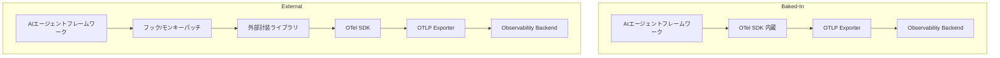
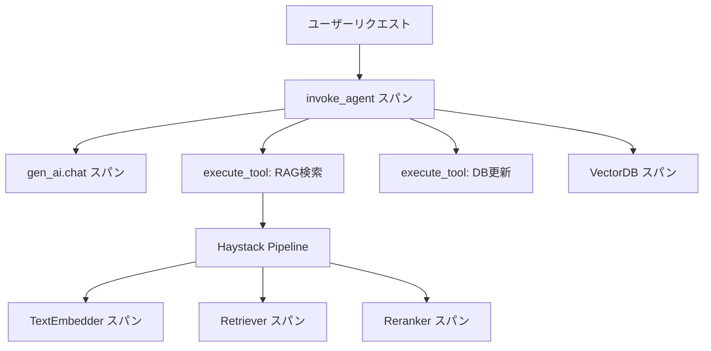

## ブログ概要

AIエージェントが本番環境で増加するなか、可観測性（Observability）の標準化が急務となっている。OpenTelemetry公式ブログに掲載された本記事では、Guangya Liu（IBM）とSujay Solomon（Google）が、AIエージェントの可観測性を確保するための2つの計装アプローチ（Baked-InとExternal）を比較し、フレームワーク開発者・アプリケーション開発者それぞれに向けたベストプラクティスを提示している。あわせて、OpenTelemetry GenAI SIG（Special Interest Group）が策定中のセマンティック規約の現状と今後の方向性が整理されている。

## 情報源

本記事は [AI Agent Observability - Evolving Standards and Best Practices](https://opentelemetry.io/blog/2025/ai-agent-observability/) の解説記事です。

この記事は [Zenn記事: Haystack 2.xのQAパイプラインを本番運用する：カスタムComponent・非同期実行・監視まで](https://zenn.dev/0h_n0/articles/6555f50d3f85ce) の深掘りです。Zenn記事ではHaystack 2.xパイプラインにOpenTelemetryを導入して分散トレーシングを実現する方法を紹介しましたが、本記事ではその上位レイヤーにあたる「AIエージェント全体の可観測性をどう標準化するか」という問題を掘り下げます。

**主要な情報源:**
- [OpenTelemetry Blog: AI Agent Observability](https://opentelemetry.io/blog/2025/ai-agent-observability/) --- 本記事の主題
- [OpenTelemetry Semantic Conventions for GenAI Agent Spans](https://opentelemetry.io/docs/specs/semconv/gen-ai/gen-ai-agent-spans/) --- セマンティック規約の仕様
- [OpenTelemetry Semantic Conventions for Generative AI Systems](https://opentelemetry.io/docs/specs/semconv/gen-ai/) --- GenAIセマンティック規約の全体像

## 技術的背景

Liu, Solomonは、AIエージェントを「LLM能力、外部システムへのツール接続、高レベルの推論を組み合わせて目標を達成するアプリケーション」と定義している。ここで重要なのは、**AIエージェントアプリケーション**と**AIエージェントフレームワーク**の区別である。

- **AIエージェントアプリケーション**: 特定のタスクを自律的に実行するエンティティ（例: カスタマーサポートBot、コード生成エージェント）
- **AIエージェントフレームワーク**: エージェント開発の基盤となるプラットフォーム（例: CrewAI、AutoGen、Semantic Kernel、LangGraph、PydanticAI）

従来のWebアプリケーションでは、HTTPリクエストのレイテンシやエラーレートをトレーシングすれば十分だった。しかしAIエージェントでは、LLM呼び出し、ツール実行、推論ステップ、ベクトルDB検索など、非決定的かつ多段的な処理が連鎖するため、各ステップの挙動を横断的に追跡する仕組みが必要になる。Liu, Solomonは、テレメトリが単なる監視を超えて「エージェントの品質を継続的に改善するための評価ツールへの入力としてのフィードバックループ」として機能すると述べている。

## 実装アーキテクチャ: 2つの計装パターン

Liu, Solomonは、AIエージェントフレームワークにOpenTelemetryテレメトリを組み込む方法として2つのアプローチを提示している。

### パターン比較図



### アプローチ1: Baked-In（フレームワーク組み込み）

フレームワーク自体がOpenTelemetryのSDKを内包し、ネイティブにテレメトリを送信するパターンである。CrewAIなどがこの方式を採用している。

**利点:**
- ユーザーは追加パッケージなしで可観測性を利用でき、設定の摩擦が少ない
- フレームワークの新機能追加時に即座に計装が反映される
- フレームワーク開発者が最新状態を維持できる

**欠点:**
- 可観測性機能を使わないユーザーにとってもフレームワークが肥大化する
- OpenTelemetryライブラリのバージョンにロックインされるリスクがある
- OTelコントリビュータによるレビューが受けにくい

### アプローチ2: External（外部計装ライブラリ）

フレームワークとは別のパッケージとして計装ライブラリを公開するパターンである。Traceloop OpenLLMetry、Langtrace、OpenTelemetry contribリポジトリなどがこの方式に該当する。

**利点:**
- フレームワークのコアコードが軽量に保たれる
- コミュニティ主導で保守・レビューが行われる
- 複数の計装ライブラリを柔軟に組み合わせられる

**欠点:**
- 非互換パッケージの断片化リスクがある
- レビュープロセスによる開発速度の低下が生じうる

### Haystack 2.xの計装はどちらか

Zenn記事で紹介したHaystack 2.xは、Baked-Inに近いアプローチを採用している。OpenTelemetry SDKがインストールされていると自動検出してトレースを送信する仕組みであり、`haystack.tracing.auto_enable_tracing()` の1行で有効化できる。一方、`opentelemetry-instrument`コマンドによるExternal計装も併用可能であり、両方のアプローチの利点を取り込んでいるといえる。

## Production Deployment Guide: AIエージェント可観測性の実装

### GenAI SIGのセマンティック規約を理解する

OpenTelemetry内のGenAI SIG（Special Interest Group）は、AIエージェント関連のテレメトリを標準化するため、以下の3領域でセマンティック規約を策定している。

1. **LLM/モデル規約** --- LLM呼び出しのスパン属性（`gen_ai.request.model`、`gen_ai.usage.input_tokens`等）
2. **VectorDB規約** --- ベクトルデータベースのクエリ・インデックス操作の属性
3. **AIエージェント規約** --- エージェント固有の操作（`create_agent`、`invoke_agent`等）

Google AI Agent Whitepaperから初期規約が導出され、現在は各フレームワーク共通の規約策定が進行中である。

### エージェントスパンの具体的な属性

[OpenTelemetry GenAI Agent Spans仕様](https://opentelemetry.io/docs/specs/semconv/gen-ai/gen-ai-agent-spans/)では、現在Development（開発中）ステータスとして以下のスパンが定義されている。

#### create_agentスパン

エージェントの生成時に記録されるスパンである。

| 属性名 | 必須レベル | 説明 |
|--------|-----------|------|
| `gen_ai.operation.name` | Required | `"create_agent"` |
| `gen_ai.provider.name` | Required | プロバイダ名（例: `"openai"`、`"aws.bedrock"`） |
| `gen_ai.agent.name` | Conditionally Required | エージェントの人間可読な名前 |
| `gen_ai.agent.id` | Conditionally Required | エージェントの一意識別子 |
| `gen_ai.request.model` | Conditionally Required | 使用するモデル名 |

#### invoke_agentスパン

エージェントの呼び出し時に記録されるスパンである。リモートエージェントの場合は`SpanKind.CLIENT`、インプロセスエージェント（LangChain等）の場合は`SpanKind.INTERNAL`が設定される。

| 属性名 | 必須レベル | 説明 |
|--------|-----------|------|
| `gen_ai.operation.name` | Required | `"invoke_agent"` |
| `gen_ai.provider.name` | Required | プロバイダ名 |
| `gen_ai.conversation.id` | Conditionally Required | セッション/スレッド識別子 |
| `gen_ai.usage.input_tokens` | Recommended | 入力トークン数 |
| `gen_ai.usage.output_tokens` | Recommended | 出力トークン数 |
| `gen_ai.response.finish_reasons` | Recommended | 完了理由の配列 |

オプトインで`gen_ai.input.messages`（チャット履歴のJSON）や`gen_ai.tool.definitions`（利用可能ツール一覧）も記録できるが、個人情報保護の観点から本番環境での有効化には慎重な判断が求められる。

### Python実装例: エージェントへのセマンティック規約適用

以下は、OpenTelemetryのセマンティック規約に沿ってAIエージェントの呼び出しをトレーシングする実装例である。

```python
# agent_tracing.py
from opentelemetry import trace
from opentelemetry.sdk.trace import TracerProvider
from opentelemetry.sdk.trace.export import BatchSpanProcessor
from opentelemetry.exporter.otlp.proto.grpc.trace_exporter import (
    OTLPSpanExporter,
)
from opentelemetry.trace import StatusCode

# TracerProviderのセットアップ
provider = TracerProvider()
processor = BatchSpanProcessor(
    OTLPSpanExporter(endpoint="http://localhost:4317")
)
provider.add_span_processor(processor)
trace.set_tracer_provider(provider)

tracer = trace.get_tracer("ai.agent.service", "0.1.0")


def invoke_agent(
    agent_name: str,
    query: str,
    conversation_id: str,
    model: str = "gpt-4o",
) -> dict:
    """セマンティック規約に準拠したエージェント呼び出し"""
    with tracer.start_as_current_span(
        f"invoke_agent {agent_name}",
        kind=trace.SpanKind.CLIENT,
        attributes={
            "gen_ai.operation.name": "invoke_agent",
            "gen_ai.provider.name": "openai",
            "gen_ai.agent.name": agent_name,
            "gen_ai.request.model": model,
            "gen_ai.conversation.id": conversation_id,
        },
    ) as span:
        try:
            # エージェントのロジック実行（ここではダミー）
            result = _run_agent_logic(query, model)

            # トークン使用量を記録
            span.set_attribute(
                "gen_ai.usage.input_tokens",
                result.get("input_tokens", 0),
            )
            span.set_attribute(
                "gen_ai.usage.output_tokens",
                result.get("output_tokens", 0),
            )
            span.set_attribute(
                "gen_ai.response.finish_reasons",
                ["stop"],
            )

            return result

        except Exception as e:
            span.set_status(StatusCode.ERROR, str(e))
            span.set_attribute("error.type", type(e).__name__)
            raise
```

### ツール実行のトレーシング

エージェントがツールを呼び出す場合、`invoke_agent`スパンの子スパンとしてツール実行を記録する。これにより、エージェントの推論ステップとツール呼び出しの関係がトレースとして可視化される。

```python
# tool_tracing.py
from opentelemetry import trace

tracer = trace.get_tracer("ai.agent.tools", "0.1.0")


def execute_tool(tool_name: str, parameters: dict) -> dict:
    """セマンティック規約に準拠したツール実行トレーシング"""
    with tracer.start_as_current_span(
        f"execute_tool {tool_name}",
        kind=trace.SpanKind.INTERNAL,
        attributes={
            "gen_ai.operation.name": "execute_tool",
            "gen_ai.tool.name": tool_name,
        },
    ) as span:
        result = _call_tool(tool_name, parameters)
        span.set_attribute(
            "gen_ai.tool.call.id", result.get("call_id", "")
        )
        return result
```

### Haystack 2.xパイプラインとの統合パターン

Zenn記事で紹介したHaystack 2.xパイプラインの可観測性と、AIエージェントのセマンティック規約を統合する場合のアーキテクチャを示す。



この構成では、エージェントレベルの`invoke_agent`スパンの配下に、Haystackパイプラインの各Componentスパンがネストされる。Haystackの自動計装が生成するスパンと、エージェントレベルのセマンティック規約に基づくスパンが一つのトレースとして結合されるため、エンドツーエンドのレイテンシ分析が可能になる。

### フレームワーク開発者向けベストプラクティス

Liu, Solomonは、フレームワーク開発者に対して以下の指針を提示している。

1. **テレメトリの有効/無効切り替え設定を提供する**: 環境変数やコンフィグファイルでON/OFFを制御可能にする。Haystack 2.xでは`HAYSTACK_CONTENT_TRACING_ENABLED`環境変数でプロンプト内容の送信を制御している
2. **外部計装パッケージとの互換性を計画する**: Baked-In計装を採用する場合でも、外部ライブラリとの共存を妨げない設計にする
3. **OTelレジストリにフレームワークを登録する**: OpenTelemetry Registryに登録することで、ユーザーが計装ライブラリを検索しやすくなる
4. **統一AIエージェントセマンティック規約を採用する**: `gen_ai.operation.name`、`gen_ai.agent.name`等の標準属性を使い、ベンダー固有の属性名を避ける

### アプリケーション開発者向け選択基準

| 優先事項 | 推奨アプローチ | 理由 |
|---------|-------------|------|
| 導入の簡便さ | Baked-In | 追加依存なし、設定最小 |
| 細粒度の制御 | External | フィルタリング・カスタム属性の柔軟性 |
| 複数フレームワーク統合 | External | 統一的な計装レイヤーで横断管理 |
| フレームワーク更新追従 | Baked-In | 新機能と計装が同期リリース |

### Collector構成の実践例

複数のAIエージェントフレームワークを運用する場合、OpenTelemetry Collectorを中間レイヤーとして配置し、テレメトリの集約・フィルタリング・ルーティングを行う構成が有効である。

```yaml
# otel-collector-config.yaml
receivers:
  otlp:
    protocols:
      grpc:
        endpoint: 0.0.0.0:4317
      http:
        endpoint: 0.0.0.0:4318

processors:
  batch:
    timeout: 5s
    send_batch_size: 1024
  # gen_ai属性でフィルタリング
  filter:
    traces:
      span:
        - 'attributes["gen_ai.operation.name"] == "invoke_agent"'
  # トークン使用量のメトリクス変換
  spanmetrics:
    metrics_exporter: prometheus
    dimensions:
      - name: gen_ai.agent.name
      - name: gen_ai.request.model

exporters:
  otlp/jaeger:
    endpoint: jaeger:4317
    tls:
      insecure: true
  prometheus:
    endpoint: 0.0.0.0:8889

service:
  pipelines:
    traces:
      receivers: [otlp]
      processors: [batch]
      exporters: [otlp/jaeger]
    metrics:
      receivers: [otlp]
      processors: [batch, spanmetrics]
      exporters: [prometheus]
```

この構成では、`spanmetrics`プロセッサにより`gen_ai.agent.name`や`gen_ai.request.model`をディメンションとしたメトリクスが自動生成される。Grafanaダッシュボードでエージェントごとのレイテンシ分布やトークン消費量を可視化できる。

### コンテンツトレーシングと個人情報保護

Liu, Solomonの記事では直接言及されていないが、セマンティック規約の`gen_ai.input.messages`や`gen_ai.output.messages`はオプトイン属性として定義されている。Haystack 2.xの`HAYSTACK_CONTENT_TRACING_ENABLED`と同様に、本番環境ではデフォルトで無効とし、ステージング環境でのデバッグ時のみ有効にする運用が推奨される。

```python
# content_tracing_guard.py
import os


def should_enable_content_tracing() -> bool:
    """環境に応じてコンテンツトレーシングを制御する"""
    env = os.getenv("DEPLOYMENT_ENV", "production")
    if env == "production":
        return False
    return os.getenv("ENABLE_CONTENT_TRACING", "false").lower() == "true"
```

### サンプリング戦略

AIエージェントのトレースは、LLM呼び出しごとに大量のスパンが生成されるため、サンプリング戦略が重要になる。セマンティック規約では、以下の属性がサンプリング判定時に利用可能であると定義されている。

- `gen_ai.operation.name`
- `gen_ai.provider.name`
- `gen_ai.request.model`
- `server.address`
- `server.port`

これらの属性はスパン生成時に設定される必要があり、サンプラーが判定に使用する。例えば、高コストなモデル（GPT-4o）の呼び出しは100%サンプリングし、軽量モデル（GPT-4o-mini）は10%サンプリングするといった制御が可能である。

```python
# custom_sampler.py
from opentelemetry.sdk.trace.sampling import Sampler, SamplingResult, Decision
from opentelemetry.trace import SpanKind
from opentelemetry.util.types import Attributes
from typing import Optional, Sequence

HIGH_COST_MODELS = {"gpt-4o", "claude-sonnet-4-20250514"}


class ModelBasedSampler(Sampler):
    """モデル名に基づくサンプリング戦略"""

    def should_sample(
        self, parent_context, trace_id: int, name: str,
        kind: SpanKind, attributes: Attributes = None,
        links: Optional[Sequence] = None,
    ) -> SamplingResult:
        model = (attributes or {}).get("gen_ai.request.model", "")
        rate = 1.0 if model in HIGH_COST_MODELS else 0.1
        if (trace_id % 100) < (rate * 100):
            return SamplingResult(Decision.RECORD_AND_SAMPLE, attributes)
        return SamplingResult(Decision.DROP, attributes)

    def get_description(self) -> str:
        return "ModelBasedSampler"
```

## パフォーマンス最適化

計装のオーバーヘッドはAIエージェントの応答時間に影響を与えるため、以下の点に注意が必要である。

- **BatchSpanProcessorの利用**: スパンをバッチで非同期送信することで、エージェントの処理をブロックしない。Haystack 2.xの自動計装もこの方式を採用している
- **サンプリングの適用**: 前述のモデルベースサンプラーや、確率的サンプリングを組み合わせて、テレメトリの量を制御する
- **属性の選択的記録**: `gen_ai.input.messages`等のペイロード属性は、データ量が大きいため本番環境では無効にする。Haystack 2.xで`HAYSTACK_CONTENT_TRACING_ENABLED=false`がデフォルトである理由もここにある
- **Collectorのバッファリング**: OTel Collectorの`batch`プロセッサで`timeout`と`send_batch_size`を適切に設定し、バックエンドへの送信頻度を最適化する

Liu, Solomonの記事では、テレメトリは監視目的だけでなく「エージェントの品質改善のための入力」として機能すると述べられている。パフォーマンスオーバーヘッドを抑えつつ、改善に必要なデータを確保するバランスが求められる。

## 運用での学び

AIエージェントの可観測性を本番環境で運用する際に考慮すべき点を整理する。

**セマンティック規約の成熟度に注意する**: GenAI SIGのエージェント規約はDevelopment（開発中）ステータスであり、属性名や構造が変更される可能性がある。2025年3月時点の仕様に依存したカスタムダッシュボードやアラートは、規約更新時に修正が必要になりうる。

**フレームワーク間の一貫性を確保する**: 複数のAIエージェントフレームワーク（例: Haystackのパイプラインとは別にLangGraph製のエージェントを運用するケース）を併用する場合、セマンティック規約の統一が相互運用性の鍵となる。Liu, Solomonは「すべてのAIエージェントフレームワークがAIエージェントフレームワークのセマンティック規約を採用し、可観測性データの相互運用性と一貫性を確保すること」が重要だと述べている。

**コミュニティへの参加**: CNCF Slackの`#otel-genai-instrumentation`チャンネルやGenAI SIGの定期ミーティングに参加することで、規約の最新動向を把握し、実装上の課題をフィードバックできる。

## 学術研究との関連

AIエージェントの可観測性は、分散システムの可観測性研究の延長線上にある。Google Dapperに始まる分散トレーシングの概念が、LLMベースのエージェントシステムに拡張されている。Google AI Agent Whitepaperでは、エージェントの動作を「計画→実行→観察→反省」のサイクルとして定式化しており、この各段階をスパンとして記録することで、エージェントの推論過程を事後分析可能にしている。GenAI SIGのセマンティック規約は、このホワイトペーパーの定式化を実装レベルに落とし込んだものである。

## まとめ

Liu, Solomonの記事は、AIエージェントの可観測性における2つの計装パターン（Baked-In/External）と、GenAI SIGが策定中のセマンティック規約の現状を整理したものである。フレームワーク開発者はセマンティック規約の採用とテレメトリの有効/無効制御を、アプリケーション開発者は自身の要件に応じたアプローチ選択を行うことが推奨されている。Haystack 2.xのような既存フレームワークも、この標準化の流れのなかで計装の改善が進んでいる。今後、規約がStableに移行するにつれて、フレームワーク間の相互運用性が向上し、AIエージェントの本番運用における可観測性の実践がより容易になると考えられる。

## 参考文献

- [AI Agent Observability - Evolving Standards and Best Practices](https://opentelemetry.io/blog/2025/ai-agent-observability/)
- [Semantic Conventions for GenAI Agent and Framework Spans](https://opentelemetry.io/docs/specs/semconv/gen-ai/gen-ai-agent-spans/)
- [Semantic Conventions for Generative AI Systems](https://opentelemetry.io/docs/specs/semconv/gen-ai/)
- [OpenTelemetry for Generative AI (2024)](https://opentelemetry.io/blog/2024/otel-generative-ai/)
- [Haystack公式ドキュメント: Tracing](https://docs.haystack.deepset.ai/docs/tracing)
- [Zenn記事: Haystack 2.xのQAパイプラインを本番運用する](https://zenn.dev/0h_n0/articles/6555f50d3f85ce)

---

*この記事はAI（Claude Code）により自動生成されました。内容の正確性については複数の情報源で検証していますが、最新の仕様変更については公式ドキュメントをご確認ください。*
