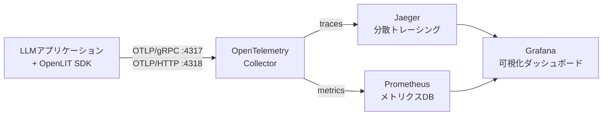
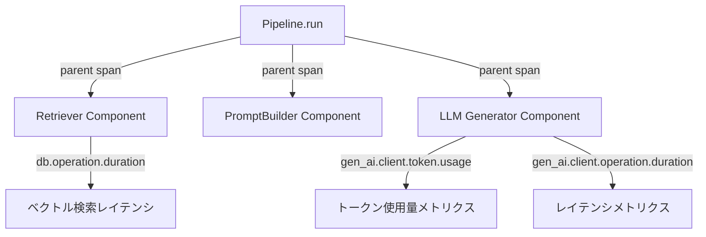

## ブログ概要

Ishan Jain（Grafana）は、OpenTelemetry公式ブログにおいて、LLMベースアプリケーションに対する可観測性の設計パターンを解説している。従来のWebアプリケーション監視とは異なり、LLMアプリケーションではトークン消費量・コスト追跡・可変レイテンシ・外部APIレートリミットといった固有の監視課題がある。本ブログでは、OpenTelemetry Collector、OpenLIT（自動計装ライブラリ）、Prometheus、Jaeger、Grafanaを組み合わせた実践的な可観測性スタックの構築方法が示されている。

本記事は [https://opentelemetry.io/blog/2024/llm-observability/](https://opentelemetry.io/blog/2024/llm-observability/) の解説記事です。

この記事は [Zenn記事: Haystack 2.xのQAパイプラインを本番運用する：カスタムComponent・非同期実行・監視まで](https://zenn.dev/0h_n0/articles/6555f50d3f85ce) の深掘りです。Zenn記事ではHaystack 2.xパイプラインにOpenTelemetryを統合する実装を扱っているが、本記事ではOpenTelemetry側の設計思想とGenAIセマンティック規約の詳細に焦点を当てる。

## 情報源

- **種別**: 企業テックブログ（OpenTelemetry公式）
- **URL**: [https://opentelemetry.io/blog/2024/llm-observability/](https://opentelemetry.io/blog/2024/llm-observability/)
- **著者**: Ishan Jain（Grafana）
- **発表日**: 2024年6月4日

## 技術的背景

LLMアプリケーションの可観測性は、従来のマイクロサービス監視とは質的に異なる課題を持つ。Jainは以下の3点を主要な課題として挙げている。

**1. 使用量とコストの追跡**: LLM APIはトークン単位の従量課金であり、リクエストごとにコストが大きく変動する。プロンプトの長さ、生成トークン数、モデルの選択によってコストが数桁異なることがある。

**2. 可変レスポンスタイムのレイテンシ監視**: 生成トークン数に比例してレスポンスタイムが変動するため、固定的なタイムアウト設計が適用しにくい。ストリーミングレスポンスでは、Time to First Token（TTFT）とTime per Output Token（TPOT）の両方を監視する必要がある。

**3. 外部APIレートリミット管理**: OpenAI、Anthropic等の外部LLM APIにはレートリミットがあり、バーストトラフィック時の制御が不可欠となる。

これらの課題に対し、OpenTelemetryはトレース・メトリクス・ログの3つの信号を標準化することで、ベンダー非依存の可観測性基盤を提供する。特に2024年4月に発足したGenerative AI Observability SIG（Special Interest Group）は、GenAIセマンティック規約の策定を進め、LLM固有のテレメトリデータの標準化に取り組んでいる。

## 実装アーキテクチャ

### システム全体構成

Jainが提示するアーキテクチャは、4層構造で構成される。



**計装層（Instrumentation Layer）**: アプリケーションコードにOpenLIT SDKを組み込み、LLM呼び出しのテレメトリデータを自動収集する。OpenLITは`pip install openlit`でインストール可能で、初期化は2行で完了する。

```python
import openlit

openlit.init(otlp_endpoint="YOUR_OTELCOL_URL:4318")
```

あるいは環境変数を使用する方法も提供されている。

```python
import openlit

openlit.init()
# 環境変数: OTEL_EXPORTER_OTLP_ENDPOINT=YOUR_OTELCOL_URL:4318
```

**収集層（Collection Layer）**: OpenTelemetry Collectorがテレメトリデータを受信・処理・エクスポートする。OTLPプロトコルでgRPC（ポート4317）とHTTP（ポート4318）の両方をサポートしている。

**ストレージ層（Storage Layer）**: メトリクスはPrometheus、トレースはJaegerに保存される。それぞれ異なる特性のデータに最適化されたバックエンドが担当する。

**可視化層（Visualization Layer）**: GrafanaがPrometheusとJaegerの両方のデータソースを統合し、OpenLITが提供するプリビルトダッシュボードでLLM運用状況を可視化する。

### OpenTelemetry Collector設定

Jainが示すCollector設定は以下の通りである。

```yaml
receivers:
  otlp:
    protocols:
      grpc:
        endpoint: 0.0.0.0:4317
      http:
        endpoint: 0.0.0.0:4318

processors:
  batch:
  memory_limiter:
    limit_mib: 1500
    spike_limit_mib: 512
    check_interval: 5s

exporters:
  prometheusremotewrite:
    endpoint: 'YOUR_PROMETHEUS_REMOTE_WRITE_URL'
    add_metric_suffixes: false
  otlp:
    endpoint: 'YOUR_JAEGER_URL'

service:
  pipelines:
    traces:
      receivers: [otlp]
      processors: [memory_limiter, batch]
      exporters: [otlp]
    metrics:
      receivers: [otlp]
      processors: [memory_limiter, batch]
      exporters: [prometheusremotewrite]
```

この設定のポイントは以下の通りである。

- **memory_limiter**: `limit_mib: 1500`は最大メモリの約80%（2GBを想定）、`spike_limit_mib: 512`はその約25%に設定されている。これはバーストトラフィック時のOOM（Out of Memory）を防ぐための設計である
- **batch processor**: テレメトリデータをバッチ化してエクスポートすることで、ネットワークオーバーヘッドを削減する
- **パイプライン分離**: tracesとmetricsが別パイプラインで処理されるため、一方の障害が他方に影響しない

## Production Deployment Guide

### AWS実装パターン（コスト最適化重視）

OpenTelemetryベースのLLM可観測性スタックをAWS上に構築する場合、トラフィック規模に応じた3つの構成パターンが考えられる。

| 構成 | トラフィック | AWSサービス | 月額コスト概算 |
|------|------------|------------|--------------|
| Small | ~100 req/日 | Lambda + Bedrock + CloudWatch | $50-150 |
| Medium | ~1,000 req/日 | ECS Fargate + OTel Collector + Managed Prometheus | $300-800 |
| Large | 10,000+ req/日 | EKS + Karpenter + Amazon Managed Grafana + Managed Prometheus | $2,000-5,000 |

**Small構成（~100 req/日）**: Lambda関数でLLMアプリケーションを実行し、CloudWatch Logs + X-Rayでトレースを収集する。OTel Collectorを別途起動せず、AWS X-Ray SDK経由でテレメトリを送信する構成。月額はBedrock利用料が大半を占める。

**Medium構成（~1,000 req/日）**: ECS FargateでOTel Collectorをサイドカーコンテナとして実行し、Amazon Managed Service for Prometheus（AMP）にメトリクスを、AWS X-Rayにトレースを送信する。Fargateの0.25 vCPU / 0.5 GB RAMタスクで十分な処理能力を確保できる。

**Large構成（10,000+ req/日）**: EKS上にOTel Collectorを DaemonSetとしてデプロイし、Karpenterで自動スケーリングする。Amazon Managed GrafanaでOpenLITダッシュボードをホストし、AMPとX-Rayの両方をデータソースとして統合する。

**コスト試算の注意事項**: 上記はAWS ap-northeast-1（東京）リージョンの2026年3月時点の概算値である。実際のコストはトラフィックパターン、バースト使用量、Bedrockモデル選択により変動する。最新料金はAWS Pricing Calculatorで確認を推奨する。

**コスト削減テクニック**:
- EKS Spot Instances活用: 最大90%削減（`m5.large`オンデマンド$0.096/h → Spot $0.029/h程度）
- Reserved Instances（1年コミット）: 最大40%削減
- Bedrock Batch API: 50%削減（リアルタイム不要な推論タスク）
- Prompt Caching有効化: キャッシュヒット時30-90%削減

### Terraformインフラコード

#### Small構成（Serverless）

```hcl
# OTel LLM Observability - Small構成
# Lambda + X-Ray + CloudWatch

terraform {
  required_version = ">= 1.9"
  required_providers {
    aws = {
      source  = "hashicorp/aws"
      version = "~> 5.80"
    }
  }
}

provider "aws" {
  region = "ap-northeast-1"
}

# IAMロール（最小権限）
resource "aws_iam_role" "llm_app_lambda" {
  name = "llm-observability-lambda-role"
  assume_role_policy = jsonencode({
    Version = "2012-10-17"
    Statement = [{
      Action = "sts:AssumeRole"
      Effect = "Allow"
      Principal = { Service = "lambda.amazonaws.com" }
    }]
  })
}

resource "aws_iam_role_policy" "llm_app_policy" {
  name = "llm-app-policy"
  role = aws_iam_role.llm_app_lambda.id
  policy = jsonencode({
    Version = "2012-10-17"
    Statement = [
      {
        Effect   = "Allow"
        Action   = ["bedrock:InvokeModel", "bedrock:InvokeModelWithResponseStream"]
        Resource = "arn:aws:bedrock:ap-northeast-1::foundation-model/*"
      },
      {
        Effect   = "Allow"
        Action   = ["xray:PutTraceSegments", "xray:PutTelemetryRecords"]
        Resource = "*"
      },
      {
        Effect = "Allow"
        Action = [
          "logs:CreateLogGroup", "logs:CreateLogStream", "logs:PutLogEvents"
        ]
        Resource = "arn:aws:logs:ap-northeast-1:*:*"
      }
    ]
  })
}

# Lambda関数
resource "aws_lambda_function" "llm_app" {
  function_name = "llm-observability-app"
  runtime       = "python3.12"
  handler       = "main.handler"
  role          = aws_iam_role.llm_app_lambda.arn
  timeout       = 300
  memory_size   = 512

  # X-Ray有効化
  tracing_config {
    mode = "Active"
  }

  environment {
    variables = {
      OTEL_SERVICE_NAME                = "llm-app"
      OTEL_EXPORTER_OTLP_ENDPOINT     = ""  # X-Ray SDKで代替
      POWERTOOLS_METRICS_NAMESPACE     = "LLMObservability"
    }
  }

  filename         = "lambda_package.zip"
  source_code_hash = filebase64sha256("lambda_package.zip")
}

# CloudWatchアラーム（コスト異常検知）
resource "aws_cloudwatch_metric_alarm" "lambda_duration" {
  alarm_name          = "llm-lambda-high-duration"
  comparison_operator = "GreaterThanThreshold"
  evaluation_periods  = 2
  metric_name         = "Duration"
  namespace           = "AWS/Lambda"
  period              = 300
  statistic           = "p99"
  threshold           = 60000  # 60秒
  alarm_description   = "Lambda実行時間P99が60秒超過"
  dimensions = {
    FunctionName = aws_lambda_function.llm_app.function_name
  }
}
```

#### Large構成（Container）

```hcl
# OTel LLM Observability - Large構成
# EKS + Karpenter + Managed Prometheus + Managed Grafana

module "eks" {
  source  = "terraform-aws-modules/eks/aws"
  version = "~> 20.31"

  cluster_name    = "llm-observability"
  cluster_version = "1.31"

  vpc_id     = module.vpc.vpc_id
  subnet_ids = module.vpc.private_subnets

  # Spot Instances優先でコスト最適化
  eks_managed_node_groups = {
    spot = {
      instance_types = ["m5.large", "m5a.large", "m6i.large"]
      capacity_type  = "SPOT"
      min_size       = 2
      max_size       = 10
      desired_size   = 3
    }
  }
}

# Amazon Managed Service for Prometheus
resource "aws_prometheus_workspace" "llm_metrics" {
  alias = "llm-observability-metrics"

  tags = {
    Environment = "production"
    Service     = "llm-observability"
  }
}

# Amazon Managed Grafana
resource "aws_grafana_workspace" "llm_dashboard" {
  name                     = "llm-observability"
  account_access_type      = "CURRENT_ACCOUNT"
  authentication_providers = ["AWS_SSO"]
  permission_type          = "SERVICE_MANAGED"
  role_arn                 = aws_iam_role.grafana.arn

  data_sources = ["PROMETHEUS", "XRAY"]
}

# AWS Budgets（月額予算アラート）
resource "aws_budgets_budget" "llm_cost" {
  name         = "llm-observability-monthly"
  budget_type  = "COST"
  limit_amount = "5000"
  limit_unit   = "USD"
  time_unit    = "MONTHLY"

  notification {
    comparison_operator       = "GREATER_THAN"
    threshold                 = 80
    threshold_type            = "PERCENTAGE"
    notification_type         = "ACTUAL"
    subscriber_email_addresses = ["ops-team@example.com"]
  }
}
```

### 運用・監視設定

#### CloudWatch Logs Insightsクエリ

```
# LLMトークン使用量の時系列分析
fields @timestamp, @message
| filter @message like /gen_ai.client.token.usage/
| stats sum(token_count) as total_tokens by bin(1h)
| sort @timestamp desc
```

```
# レイテンシ分析（P95/P99）
fields @timestamp, duration_ms
| filter service_name = "llm-app"
| stats percentile(duration_ms, 95) as p95,
        percentile(duration_ms, 99) as p99
        by bin(5m)
| sort @timestamp desc
```

#### CloudWatchアラーム設定

```python
import boto3
from typing import Any


def create_token_usage_alarm(
    cloudwatch_client: boto3.client,
    alarm_name: str = "llm-token-usage-spike",
    threshold: float = 100000.0,
) -> dict[str, Any]:
    """トークン使用量スパイク検知アラームを作成する。

    Args:
        cloudwatch_client: CloudWatch boto3クライアント
        alarm_name: アラーム名
        threshold: 1時間あたりのトークン数閾値

    Returns:
        CloudWatch APIレスポンス
    """
    return cloudwatch_client.put_metric_alarm(
        AlarmName=alarm_name,
        MetricName="gen_ai_client_token_usage",
        Namespace="LLMObservability",
        Statistic="Sum",
        Period=3600,
        EvaluationPeriods=1,
        Threshold=threshold,
        ComparisonOperator="GreaterThanThreshold",
        AlarmActions=["arn:aws:sns:ap-northeast-1:ACCOUNT:llm-alerts"],
        AlarmDescription="1時間あたりのトークン使用量が閾値超過",
    )
```

#### X-Rayトレーシング設定

```python
from aws_xray_sdk.core import xray_recorder, patch_all
from aws_xray_sdk.core.models.subsegment import Subsegment


# boto3自動計装
patch_all()


def trace_llm_call(model_id: str, prompt: str) -> Subsegment:
    """LLM呼び出しにX-Rayアノテーションを付与する。

    Args:
        model_id: 使用するモデルのID
        prompt: 入力プロンプト

    Returns:
        X-Rayサブセグメント
    """
    subsegment = xray_recorder.begin_subsegment("llm_inference")
    subsegment.put_annotation("gen_ai.request.model", model_id)
    subsegment.put_metadata("prompt_length", len(prompt))
    return subsegment
```

#### Cost Explorer自動レポート

```python
import boto3
from datetime import datetime, timedelta
from typing import Any


def get_daily_llm_cost(
    ce_client: boto3.client,
    days_back: int = 1,
) -> dict[str, Any]:
    """直近のLLM関連AWSコストを取得する。

    Args:
        ce_client: Cost Explorer boto3クライアント
        days_back: 遡る日数

    Returns:
        サービス別コスト辞書
    """
    end = datetime.utcnow().strftime("%Y-%m-%d")
    start = (datetime.utcnow() - timedelta(days=days_back)).strftime("%Y-%m-%d")

    response = ce_client.get_cost_and_usage(
        TimePeriod={"Start": start, "End": end},
        Granularity="DAILY",
        Metrics=["UnblendedCost"],
        Filter={
            "Or": [
                {"Dimensions": {"Key": "SERVICE", "Values": ["Amazon Bedrock"]}},
                {"Dimensions": {"Key": "SERVICE", "Values": ["AWS Lambda"]}},
                {"Dimensions": {"Key": "SERVICE", "Values": ["Amazon Elastic Kubernetes Service"]}},
                {"Dimensions": {"Key": "SERVICE", "Values": ["Amazon Managed Service for Prometheus"]}},
            ]
        },
        GroupBy=[{"Type": "DIMENSION", "Key": "SERVICE"}],
    )
    return response
```

### コスト最適化チェックリスト

**アーキテクチャ選択**:
- [ ] トラフィック量に応じた構成選択（Small: Serverless / Medium: Hybrid / Large: Container）
- [ ] OTel Collectorのデプロイ方式選定（サイドカー vs DaemonSet vs Gateway）

**リソース最適化**:
- [ ] EC2/EKSノードはSpot Instances優先（最大90%削減）
- [ ] Reserved Instances 1年コミットで安定ワークロードをカバー
- [ ] Savings Plans検討（Compute Savings Plans: 最大66%）
- [ ] Lambda メモリサイズ最適化（AWS Lambda Power Tuning利用）
- [ ] ECS/EKS アイドル時スケールダウン（Karpenter Consolidation）
- [ ] NAT Gateway費用削減（VPCエンドポイント活用）

**LLMコスト削減**:
- [ ] Bedrock Batch API使用（非リアルタイムタスクで50%削減）
- [ ] Prompt Caching有効化（繰り返しプロンプトで30-90%削減）
- [ ] モデル選択ロジック（軽量モデルでの事前フィルタリング）
- [ ] 最大トークン数制限（`max_tokens`パラメータ）
- [ ] プロンプト圧縮（LLMLingua等）

**監視・アラート**:
- [ ] AWS Budgets設定（月額予算アラート）
- [ ] CloudWatchアラーム（トークン使用量、レイテンシP99）
- [ ] Cost Anomaly Detection有効化
- [ ] 日次コストレポート（Cost Explorer API + SNS通知）
- [ ] Grafanaダッシュボード（OpenLITプリビルトダッシュボード）

**リソース管理**:
- [ ] 未使用リソース定期削除（Trusted Advisor活用）
- [ ] タグ戦略（`Service`, `Environment`, `CostCenter`）
- [ ] ログ保持期間設定（CloudWatch Logs ライフサイクルポリシー）
- [ ] 開発環境の夜間・週末停止
- [ ] Prometheusデータ保持期間設定（AMP: デフォルト150日）

## トレース設計: イベントレベルのテレメトリ

Jainはブログの中で、LLMアプリケーションのトレースにおいてspan attributesではなくeventsでの記録を推奨するLLM Working Groupの方針に言及している。これはGenAIセマンティック規約の重要な設計判断である。

### リクエストメタデータ

LLM呼び出しのリクエスト側で記録すべきメタデータとして、以下が挙げられている。

- **Temperature**: モデルの出力ランダム性制御パラメータ。$T \in [0, 2]$の範囲で設定され、$T \to 0$では決定論的出力、$T \to 2$ではランダム性が増加する
- **Top_p**: 核サンプリングのパラメータ。累積確率が$p$に達するまでのトークン集合からサンプリングする
- **モデル名/バージョン**: 使用するモデルの識別子（例: `gpt-4-turbo-2024-04-09`）
- **プロンプト詳細**: システムプロンプト、ユーザープロンプトの内容

### レスポンスメタデータ

- **トークン数**: 入力トークン数 + 出力トークン数（コスト直結）
- **費用**: トークン単価 $\times$ トークン数で算出
- **出力特性**: finish_reason（`stop`, `length`, `content_filter`等）

### GenAIセマンティック規約のメトリクス

OpenTelemetryのGenAIセマンティック規約では、以下の標準メトリクスが定義されている。

| メトリクス名 | 型 | 単位 | 説明 |
|-------------|-----|------|------|
| `gen_ai.client.token.usage` | Histogram | `{token}` | 入力・出力トークン使用量 |
| `gen_ai.client.operation.duration` | Histogram | `s` | GenAI操作の所要時間 |
| `gen_ai.server.request.duration` | Histogram | `s` | サーバ側リクエスト所要時間 |
| `gen_ai.server.time_to_first_token` | Histogram | `s` | 最初のトークン生成までの時間 |
| `gen_ai.server.time_per_output_token` | Histogram | `s` | 出力トークンあたりの生成時間 |

これらのメトリクスには、`gen_ai.operation.name`（操作種別: `chat`, `text_completion`等）、`gen_ai.provider.name`（プロバイダ: `openai`, `anthropic`等）、`gen_ai.request.model`（リクエストモデル名）といった共通属性が付与される。

### Haystack 2.xパイプラインとの対応

Zenn記事で解説されているHaystack 2.xパイプラインでは、各Componentの実行がSpanとして記録される。OpenTelemetryのGenAIセマンティック規約を適用すると、以下の対応関係が成立する。



Haystackの`tracing`モジュールがOpenTelemetryバックエンドと連携し、各Componentの実行時間、LLM呼び出しのトークン使用量、検索コンポーネントのクエリレイテンシを統一的に収集できる。

## パフォーマンス最適化

### OTel Collectorのチューニング

Jainが示すCollector設定では、`memory_limiter`がパフォーマンスとリソース保護のバランスを取る重要な要素である。

**memory_limiterの設計指針**:
- `limit_mib`: ホストの最大メモリの80%を上限とする。2GBホストでは1500 MiBが目安
- `spike_limit_mib`: `limit_mib`の約25%を設定。急激なトラフィック増加時のバッファとして機能する
- `check_interval`: 5秒間隔でメモリ使用量をチェックし、超過時はデータをドロップする

**batchプロセッサの効果**: テレメトリデータをバッチ化してエクスポートすることで、個別送信と比較してネットワークオーバーヘッドを大幅に削減する。デフォルト設定（8192エントリまたは200msタイムアウト）はほとんどのユースケースで適切とされている。

**パイプライン分離の利点**: tracesとmetricsを別パイプラインで処理することで、一方のバックエンド障害（例: Jaegerのダウンタイム）がメトリクス送信に影響しない。この分離はLLMアプリケーションにおいて特に重要である。トレースデータはプロンプト内容を含むため高ボリュームになりがちだが、メトリクス（トークン数、コスト）は常に軽量であり、確実に送信されるべきデータである。

## 運用での学び

### OpenLITによる自動計装の利点と限界

OpenLITは44以上のLLMプロバイダ・AIフレームワーク・ベクトルデータベースの自動計装を提供しており、計装コードを手動で書く必要がない点が大きな利点である。GenAIセマンティック規約に準拠しているため、ベンダー固有のspan attributesや環境変数に依存しない標準的なテレメトリデータが生成される。

一方、自動計装だけでは捕捉できないビジネス固有のメトリクス（例: RAGパイプラインの検索精度、ハルシネーション率）については、手動計装の追加が必要となる。Haystack 2.xのカスタムComponentのように、フレームワーク固有のフックを通じてOpenTelemetry Spanにカスタム属性を付与する設計が求められる。

### Grafanaダッシュボードの活用

Jainは、Grafanaに以下の手順でデータソースを追加することを推奨している。

1. PrometheusデータソースのURLを`http://<prometheus_host>`に設定
2. JaegerデータソースのURLを`http://<jaeger_host>`に設定
3. OpenLITが提供するプリビルトGrafanaダッシュボードをインポート

このダッシュボードにより、LLMリクエストのボリューム推移、トークン消費量のトレンド、レイテンシ分布（P50/P95/P99）、コスト累積グラフといった運用に必要な情報を一元的に確認できる。

### 障害対応のポイント

LLM可観測性スタック固有の障害パターンとして、以下が想定される。

- **トークン使用量の急増**: プロンプトインジェクションや意図しない長文入力により、トークン使用量が急増しコストが跳ね上がる。`gen_ai.client.token.usage`メトリクスに閾値アラームを設定して早期検知する
- **Collector OOM**: 大量のトレースデータ（プロンプト内容を含む）によりCollectorのメモリが枯渇する。`memory_limiter`の設定が防御線となる
- **バックエンド障害**: PrometheusやJaegerのダウンタイム時にテレメトリデータがロストする。Collectorの`sending_queue`設定で一時的なバッファリングが可能である

## 学術研究との関連

LLMアプリケーションの可観測性に関する学術的な取り組みとして、分散トレーシングの基盤研究であるDapper（Google, 2010）やJaeger（Uber, 2017）の流れを汲みつつ、LLM固有の課題（確率的出力、トークンベース課金、外部API依存）に対応する新しい監視パラダイムが模索されている。OpenTelemetryのGenAI SIGは2024年4月に発足し、2025年にはAI Agent Observabilityへと議論が拡大している。DatadogがOpenTelemetry GenAIセマンティック規約をネイティブサポート（v1.37以降）するなど、業界標準としての地位を確立しつつある。

## まとめと実践への示唆

Jainのブログは、LLMアプリケーションの可観測性をOpenTelemetryの標準的な枠組みで実現する具体的な設計パターンを提示している。特にGenAIセマンティック規約に基づくテレメトリデータの標準化は、マルチベンダーLLM環境における統一的な監視基盤の構築に不可欠である。Haystack 2.xのようなRAGフレームワークとOpenTelemetryを統合する際には、パイプライン全体のトレース可視性と、LLM呼び出し固有のメトリクス（トークン使用量、コスト、レイテンシ）の両方を確保する設計が重要となる。OpenLITのような自動計装ライブラリの活用と、ビジネス固有メトリクスの手動計装を組み合わせることで、実践的な可観測性基盤を構築できる。

## 参考文献

- **Blog URL**: [An Introduction to Observability for LLM-based applications using OpenTelemetry](https://opentelemetry.io/blog/2024/llm-observability/)
- **OpenTelemetry GenAI Semantic Conventions**: [https://opentelemetry.io/docs/specs/semconv/gen-ai/](https://opentelemetry.io/docs/specs/semconv/gen-ai/)
- **OpenTelemetry GenAI Metrics**: [https://opentelemetry.io/docs/specs/semconv/gen-ai/gen-ai-metrics/](https://opentelemetry.io/docs/specs/semconv/gen-ai/gen-ai-metrics/)
- **OpenLIT**: [https://openlit.io](https://openlit.io)
- **OpenTelemetry for Generative AI (2024)**: [https://opentelemetry.io/blog/2024/otel-generative-ai/](https://opentelemetry.io/blog/2024/otel-generative-ai/)
- **AI Agent Observability (2025)**: [https://opentelemetry.io/blog/2025/ai-agent-observability/](https://opentelemetry.io/blog/2025/ai-agent-observability/)
- **Related Zenn article**: [Haystack 2.xのQAパイプラインを本番運用する](https://zenn.dev/0h_n0/articles/6555f50d3f85ce)
