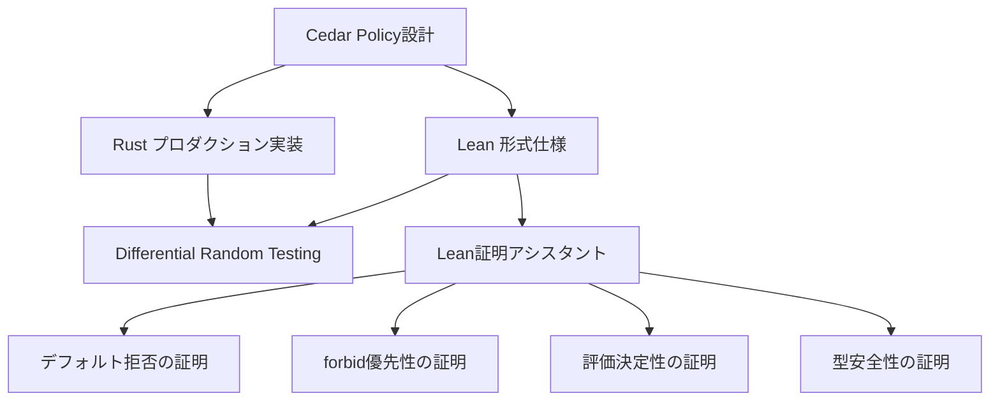

## 論文概要（Abstract）

本記事は [https://www.amazon.science/publications/cedar-a-new-language-for-expressive-fast-safe-and-analyzable-authorization](https://www.amazon.science/publications/cedar-a-new-language-for-expressive-fast-safe-and-analyzable-authorization) の解説記事です。

Cedarは、AWSが開発したオープンソースの認可ポリシー言語であり、「ergonomic（使いやすい）」「fast（高速）」「safe（安全）」「analyzable（分析可能）」の4つの設計原則を同時に満たすことを目指して設計されている。アプリケーションコードに認可ロジックを埋め込む代わりに、開発者はCedarポリシーとして認可ルールを記述し、Cedarの評価エンジンにアクセス判定を委譲する。Rustで実装され、GitHub上でオープンソースとして公開されている。著者らはLean言語による形式モデルを構築し、証明アシスタントによりCedarの設計における重要な性質を形式的に証明したと報告している。

この記事は [Zenn記事: Bedrock AgentCore Policyで社内申請ワークフローを自動化するマルチエージェント設計](https://zenn.dev/0h_n0/articles/6493dd54baab75) の深掘りです。

## 情報源

- **会議名**: OOPSLA 2024（Object-Oriented Programming, Systems, Languages & Applications）
- **年**: 2024
- **URL**: [https://www.amazon.science/publications/cedar-a-new-language-for-expressive-fast-safe-and-analyzable-authorization](https://www.amazon.science/publications/cedar-a-new-language-for-expressive-fast-safe-and-analyzable-authorization)
- **arXiv**: [https://arxiv.org/abs/2403.04651](https://arxiv.org/abs/2403.04651)
- **著者**: Joseph W. Cutler, Craig Disselkoen, Aaron Eline, Shaobo He, Kyle Headley, Michael Hicks, Kesha Hietala, Eleftherios Ioannidis, John Kastner, Anwar Mamat, Darin McAdams, Matt McCutchen, Neha Rungta, Emina Torlak, Andrew Wells
- **掲載**: Proc. ACM Program. Lang. 8, OOPSLA1, Article 118（April 2024）

## カンファレンス情報

OOPSLA（Object-Oriented Programming, Systems, Languages & Applications）は、プログラミング言語設計・実装分野の主要国際会議の1つであり、SPLASH（Systems, Programming, Languages, and Applications: Software for Humanity）カンファレンスの一部として開催される。2024年はカリフォルニア州パサデナで開催され、148本の論文が採択された。Cedar論文は15名のAmazon研究者による共著である。

## 背景と動機（Background & Motivation）

現代のソフトウェアシステムにおいて、認可（authorization）は基盤的な要件である。しかし、従来のアプローチでは認可ロジックがアプリケーションコードに散在し、以下の問題が生じていた。

1. **監査困難性**: 「誰が何にアクセスできるか」の全体像を把握しにくい
2. **変更リスク**: 認可ロジックの変更が意図しない権限変更を引き起こす可能性
3. **再利用困難**: サービスごとに認可ロジックを再実装する必要
4. **形式検証の欠如**: ポリシーの正しさを数学的に保証する手段がない

既存のポリシー言語（Rego/OPAやOpenFGAなど）はこれらの一部を解決するが、表現力・性能・安全性・分析可能性の4つを同時に高水準で満たすものは存在しなかったと著者らは述べている。Cedarはこの4要素のバランスを精密に設計することで、サウンドかつ完全な論理エンコーディングを可能にし、ポリシーの精密な分析（例: リファクタリング時に認可される権限が変化しないことの確認）を実現している。

## 技術的詳細（Technical Details）

### PARCモデル

Cedarのポリシーは**PARCモデル**に基づいて構造化されている。

| 要素 | 意味 | 例 |
|------|------|-----|
| **P**rincipal | 認証主体 | ユーザー、エージェント、サービスアカウント |
| **A**ction | 操作 | 読み取り、書き込み、削除、ツール呼び出し |
| **R**esource | 対象リソース | ドキュメント、API、データベーステーブル |
| **C**ondition/Context | 追加条件 | 時間帯、IPアドレス、属性値 |

このモデルにより、RBAC（ロールベース）、ABAC（属性ベース）、ReBAC（関係ベース）の各アクセス制御モデルを自然に表現できる。

### ポリシー構文

Cedarのポリシーは`permit`（許可）または`forbid`（拒否）のいずれかの効果（effect）を持ち、スコープ（principal, action, resource）と条件（`when`/`unless`句）で構成される。

```cedar
// 同一部門のユーザーにドキュメント読み取りを許可
permit(
    principal is User,
    action == Action::"read",
    resource is Document
) when {
    principal.department == resource.owner_department
};

// 機密ドキュメントの削除を全面禁止
forbid(
    principal is User,
    action == Action::"delete",
    resource is Document
) when {
    resource.classification == "confidential"
};
```

### ポリシー評価アルゴリズム

Cedarのポリシー評価は以下の決定的なアルゴリズムに従う。

```
1. forbidポリシーのいずれかがマッチ → DENY
2. permitポリシーのいずれかがマッチ → ALLOW
3. いずれもマッチしない → DENY（デフォルト拒否）
```

この「デフォルト拒否」と「forbidがpermitに常に優先」という2つの性質により、安全側に倒れる設計になっている。

### オプショナル型システム

著者らは、Cedarの型システムを「オプショナル」として設計したと述べている。バリデーターは型チェックを行い、実行時エラーの原因となりうるポリシーの誤りを検出するが、型が合わないポリシーも記述自体は許容される。これにより、厳格すぎる型システムがもたらす柔軟性の喪失を回避しつつ、安全性を向上させている。

型バリデーションが検出する典型的な誤りには以下がある。

- 存在しない属性への参照（例: `principal.deparment`のタイポ）
- 型の不一致（例: 文字列と数値の比較）
- 到達不能なポリシー（常にfalseになる条件）

## 形式検証（Formal Verification）

### Lean言語によるモデル化

著者らは、Cedarの形式モデルをLean言語で構築し、**verification-guided development**（検証主導開発）と呼ぶ手法を採用したと報告している。具体的には以下の2つの実装を並行して開発する。

1. **Rust実装**: プロダクション用の高性能実装
2. **Lean実装**: 形式仕様としてのリファレンス実装

2つの実装はdifferential random testing（差分ランダムテスト）により等価性が検証される。ランダムに生成したポリシーとリクエストを両実装に入力し、結果が一致することを確認する。

### 証明された性質

Leanの証明アシスタントにより、以下の性質が形式的に証明されたと著者らは述べている。

1. **デフォルト拒否の正しさ**: いずれのポリシーもマッチしない場合、結果は必ずDENYとなる
2. **forbid優先性**: forbidポリシーがマッチした場合、permitポリシーの有無に関わらず結果はDENYとなる
3. **評価の決定性**: 同一の入力（ポリシー集合、リクエスト、エンティティデータ）に対して、評価結果は常に同一である
4. **型安全性**: バリデーターが受理したポリシーは、実行時にtype errorを発生させない

これらの形式証明により、Cedar言語の設計レベルでの正しさが数学的に保証されている。



## 実装のポイント（Implementation）

### Rustクレート構成

Cedar のRust実装は以下のクレート構成で公開されている（GitHub: `cedar-policy/cedar`）。

| クレート | 役割 |
|---------|------|
| `cedar-policy` | メインクレート（公開API） |
| `cedar-policy-core` | パーサーと評価エンジン |
| `cedar-policy-validator` | 型バリデーター |
| `cedar-policy-cli` | コマンドラインツール |
| `cedar-policy-formatter` | ポリシーの自動フォーマッター |

### 実装上の注意点

1. **エンティティグラフの構築**: Cedarはポリシー評価時にエンティティの階層関係（例: `User`が`Group`に所属）を参照するため、エンティティグラフの適切な構築が必要
2. **スキーマ定義**: オプショナル型バリデーションを活用するには、エンティティとアクションのスキーマをJSON形式で定義する
3. **ポリシーセットの管理**: 本番環境ではポリシーの動的な追加・削除が発生するため、ポリシーセットのバージョン管理と安全なデプロイ機構の設計が重要

```python
import subprocess
import json
from typing import Any


def evaluate_cedar_policy(
    policies_path: str,
    entities_path: str,
    principal: str,
    action: str,
    resource: str,
    context: dict[str, Any] | None = None,
) -> dict[str, Any]:
    """Cedar CLIを用いたポリシー評価

    Args:
        policies_path: ポリシーファイルのパス
        entities_path: エンティティデータのパス
        principal: 認証主体（例: 'User::"alice"'）
        action: アクション（例: 'Action::"read"'）
        resource: リソース（例: 'Document::"doc1"'）
        context: コンテキストデータ（オプション）

    Returns:
        評価結果を含む辞書
    """
    cmd = [
        "cedar", "authorize",
        "--policies", policies_path,
        "--entities", entities_path,
        "--principal", principal,
        "--action", action,
        "--resource", resource,
    ]
    if context:
        cmd.extend(["--context", json.dumps(context)])

    result = subprocess.run(cmd, capture_output=True, text=True, timeout=10)
    return {
        "decision": result.stdout.strip(),
        "exit_code": result.returncode,
    }
```

## Production Deployment Guide

### AWS実装パターン（コスト最適化重視）

Cedar言語はAmazon Verified Permissions（AVP）およびBedrock AgentCore Policyで本番運用されており、以下のトラフィック量別構成を推奨する。

**コスト試算の前提**: 2026年3月時点のAWS ap-northeast-1（東京）リージョン料金に基づく概算値。実際のコストはトラフィックパターン、リージョン、バースト使用量により変動する。最新料金はAWS料金計算ツールで確認を推奨する。

| 構成 | トラフィック | アーキテクチャ | 月額概算 |
|------|-------------|---------------|---------|
| Small | ~100 req/日 | Lambda + AVP + DynamoDB | $50-150 |
| Medium | ~1,000 req/日 | ECS Fargate + AVP + ElastiCache | $300-800 |
| Large | 10,000+ req/日 | EKS + Cedar SDK埋込 + ElastiCache | $2,000-5,000 |

**Small構成の内訳**:
- Lambda（認可リクエスト処理）: 128MB、100回/日 = 月額 ~$1
- Amazon Verified Permissions（Cedar評価）: 100回/日 = 月額 ~$5
- DynamoDB（エンティティストア、On-Demand）: 月額 ~$5
- CloudWatch Logs: 月額 ~$3
- 合計: 約$15/月（エージェント連携時はBedrock API費用が別途$30-130加算）

**Large構成の内訳**:
- EKS コントロールプレーン: 月額 ~$73
- EC2 Spot Instances（m6i.large x 3）: 月額 ~$90（Spot価格、On-Demand比約70%削減）
- Cedar SDK埋込（評価エンジン内蔵）: APIコール不要、追加コストなし
- ElastiCache（ポリシーキャッシュ、cache.t4g.micro）: 月額 ~$12
- Application Load Balancer: 月額 ~$20
- 合計: 約$200-300/月（トラフィック量による。エージェント連携時Bedrock費用別途）

**コスト削減テクニック**:
- Spot Instances活用でEC2コストを最大90%削減
- Cedar SDK埋込によりAVP APIコール費用をゼロに（Large構成）
- ポリシーキャッシュ（ElastiCache）で評価レイテンシ削減とAPI呼び出し回数削減
- Reserved Instances（1年コミット）で最大72%削減

### Terraformインフラコード

**Small構成（Serverless）**:

```hcl
# Cedar認可サービス - Small構成（Serverless）
# Lambda + Amazon Verified Permissions + DynamoDB

terraform {
  required_version = ">= 1.9"
  required_providers {
    aws = {
      source  = "hashicorp/aws"
      version = "~> 5.80"
    }
  }
}

provider "aws" {
  region = "ap-northeast-1"
}

# IAMロール（最小権限原則）
resource "aws_iam_role" "cedar_lambda_role" {
  name = "cedar-authorization-lambda-role"
  assume_role_policy = jsonencode({
    Version = "2012-10-17"
    Statement = [{
      Action = "sts:AssumeRole"
      Effect = "Allow"
      Principal = { Service = "lambda.amazonaws.com" }
    }]
  })
}

resource "aws_iam_role_policy" "cedar_lambda_policy" {
  name = "cedar-lambda-policy"
  role = aws_iam_role.cedar_lambda_role.id
  policy = jsonencode({
    Version = "2012-10-17"
    Statement = [
      {
        Effect = "Allow"
        Action = [
          "verifiedpermissions:IsAuthorized",
          "verifiedpermissions:IsAuthorizedWithToken"
        ]
        Resource = aws_verifiedpermissions_policy_store.cedar_store.arn
      },
      {
        Effect = "Allow"
        Action = [
          "dynamodb:GetItem",
          "dynamodb:Query"
        ]
        Resource = aws_dynamodb_table.entities.arn
      },
      {
        # CloudWatch Logs書き込み
        Effect = "Allow"
        Action = [
          "logs:CreateLogGroup",
          "logs:CreateLogStream",
          "logs:PutLogEvents"
        ]
        Resource = "arn:aws:logs:*:*:*"
      }
    ]
  })
}

# Amazon Verified Permissions（Cedarポリシーストア）
resource "aws_verifiedpermissions_policy_store" "cedar_store" {
  validation_settings {
    mode = "STRICT"  # 型バリデーション有効化
  }
}

# DynamoDB（エンティティストア、On-Demandでコスト最適化）
resource "aws_dynamodb_table" "entities" {
  name         = "cedar-entities"
  billing_mode = "PAY_PER_REQUEST"
  hash_key     = "entityType"
  range_key    = "entityId"

  attribute {
    name = "entityType"
    type = "S"
  }
  attribute {
    name = "entityId"
    type = "S"
  }

  # KMS暗号化
  server_side_encryption {
    enabled = true
  }

  point_in_time_recovery {
    enabled = true
  }
}

# Lambda関数（Cedar認可エンドポイント）
resource "aws_lambda_function" "cedar_authorizer" {
  function_name = "cedar-authorizer"
  runtime       = "python3.13"
  handler       = "handler.lambda_handler"
  role          = aws_iam_role.cedar_lambda_role.arn
  timeout       = 10
  memory_size   = 128  # Cedar評価は軽量

  environment {
    variables = {
      POLICY_STORE_ID = aws_verifiedpermissions_policy_store.cedar_store.id
      ENTITIES_TABLE  = aws_dynamodb_table.entities.name
    }
  }
}

# CloudWatchアラーム（コスト監視）
resource "aws_cloudwatch_metric_alarm" "lambda_errors" {
  alarm_name          = "cedar-lambda-errors"
  comparison_operator = "GreaterThanThreshold"
  evaluation_periods  = 2
  metric_name         = "Errors"
  namespace           = "AWS/Lambda"
  period              = 300
  statistic           = "Sum"
  threshold           = 5
  alarm_description   = "Cedar Lambda error rate exceeded threshold"

  dimensions = {
    FunctionName = aws_lambda_function.cedar_authorizer.function_name
  }
}
```

**Large構成（Container + Cedar SDK埋込）**:

```hcl
# Cedar認可サービス - Large構成（EKS + Cedar SDK）
# EKS + Karpenter + Spot Instances

module "eks" {
  source  = "terraform-aws-modules/eks/aws"
  version = "~> 20.31"

  cluster_name    = "cedar-authorization-cluster"
  cluster_version = "1.31"

  vpc_id     = module.vpc.vpc_id
  subnet_ids = module.vpc.private_subnets

  # コントロールプレーンのみ（ノードはKarpenterで管理）
  cluster_endpoint_public_access = false
  enable_irsa                    = true
}

# Karpenter Provisioner（Spot優先で大幅コスト削減）
resource "kubectl_manifest" "karpenter_nodepool" {
  yaml_body = yamlencode({
    apiVersion = "karpenter.sh/v1"
    kind       = "NodePool"
    metadata   = { name = "cedar-workers" }
    spec = {
      template = {
        spec = {
          requirements = [
            {
              key      = "karpenter.sh/capacity-type"
              operator = "In"
              values   = ["spot", "on-demand"]  # Spot優先
            },
            {
              key      = "node.kubernetes.io/instance-type"
              operator = "In"
              values   = ["m6i.large", "m6i.xlarge", "m7i.large"]
            }
          ]
        }
      }
      limits = {
        cpu    = "100"
        memory = "200Gi"
      }
      disruption = {
        consolidationPolicy = "WhenEmptyOrUnderutilized"
        consolidateAfter    = "30s"
      }
    }
  })
}

# AWS Budgets（予算アラート）
resource "aws_budgets_budget" "cedar_monthly" {
  name         = "cedar-authorization-monthly"
  budget_type  = "COST"
  limit_amount = "5000"
  limit_unit   = "USD"
  time_unit    = "MONTHLY"

  notification {
    comparison_operator       = "GREATER_THAN"
    threshold                 = 80
    threshold_type            = "PERCENTAGE"
    notification_type         = "ACTUAL"
    subscriber_email_addresses = ["ops-team@example.com"]
  }
}
```

### 運用・監視設定

**CloudWatch Logs Insights クエリ**:

```
# 認可判定のレイテンシ分析（P95, P99）
fields @timestamp, @message
| filter @message like /authorization_decision/
| stats percentile(duration_ms, 95) as p95,
        percentile(duration_ms, 99) as p99,
        avg(duration_ms) as avg_latency
  by bin(1h)

# 拒否判定の異常検知
fields @timestamp, decision, principal, action, resource
| filter decision = "DENY"
| stats count(*) as deny_count by bin(1h)
| filter deny_count > 100
```

**CloudWatch アラーム設定（Python）**:

```python
import boto3


def create_cedar_alarms(function_name: str, sns_topic_arn: str) -> None:
    """Cedar認可サービスのCloudWatchアラームを作成

    Args:
        function_name: Lambda関数名
        sns_topic_arn: 通知先SNSトピックARN
    """
    cw = boto3.client("cloudwatch", region_name="ap-northeast-1")

    # 認可レイテンシのP99アラーム
    cw.put_metric_alarm(
        AlarmName="cedar-authorization-latency-p99",
        MetricName="Duration",
        Namespace="AWS/Lambda",
        Statistic="p99",
        Period=300,
        EvaluationPeriods=3,
        Threshold=100,  # 100ms超過で警告
        ComparisonOperator="GreaterThanThreshold",
        Dimensions=[{"Name": "FunctionName", "Value": function_name}],
        AlarmActions=[sns_topic_arn],
    )
```

**X-Ray トレーシング設定（Python）**:

```python
from aws_xray_sdk.core import xray_recorder, patch_all

# boto3自動計装
patch_all()


@xray_recorder.capture("cedar_authorize")
def authorize_request(
    principal: str,
    action: str,
    resource: str,
) -> str:
    """認可リクエストをトレース付きで評価

    Args:
        principal: 認証主体
        action: アクション
        resource: リソース

    Returns:
        "ALLOW" or "DENY"
    """
    subsegment = xray_recorder.current_subsegment()
    subsegment.put_annotation("principal_type", principal.split("::")[0])
    subsegment.put_annotation("action", action)

    # Cedar評価ロジック
    decision = evaluate_policy(principal, action, resource)

    subsegment.put_metadata("decision", decision)
    return decision
```

**Cost Explorer自動レポート（Python）**:

```python
import boto3
from datetime import datetime, timedelta


def get_cedar_daily_cost(sns_topic_arn: str) -> dict:
    """Cedar関連サービスの日次コストレポート

    Args:
        sns_topic_arn: 通知先SNSトピックARN

    Returns:
        サービス別コスト辞書
    """
    ce = boto3.client("ce", region_name="us-east-1")
    sns = boto3.client("sns", region_name="ap-northeast-1")

    end = datetime.utcnow().strftime("%Y-%m-%d")
    start = (datetime.utcnow() - timedelta(days=1)).strftime("%Y-%m-%d")

    response = ce.get_cost_and_usage(
        TimePeriod={"Start": start, "End": end},
        Granularity="DAILY",
        Metrics=["UnblendedCost"],
        Filter={
            "Tags": {
                "Key": "Project",
                "Values": ["cedar-authorization"],
            }
        },
        GroupBy=[{"Type": "DIMENSION", "Key": "SERVICE"}],
    )

    costs = {}
    total = 0.0
    for group in response["ResultsByTime"][0]["Groups"]:
        service = group["Keys"][0]
        amount = float(group["Metrics"]["UnblendedCost"]["Amount"])
        costs[service] = amount
        total += amount

    # $100/日超過でSNS通知
    if total > 100:
        sns.publish(
            TopicArn=sns_topic_arn,
            Subject="Cedar Authorization Cost Alert",
            Message=f"Daily cost exceeded $100: ${total:.2f}",
        )

    return costs
```

### コスト最適化チェックリスト

**アーキテクチャ選択**:
- [ ] トラフィック100 req/日以下 → Serverless（Lambda + AVP）
- [ ] トラフィック1,000 req/日程度 → Hybrid（ECS Fargate + AVP）
- [ ] トラフィック10,000 req/日以上 → Container（EKS + Cedar SDK埋込）

**リソース最適化**:
- [ ] EC2: Spot Instances優先（Cedar評価はステートレスのため中断耐性が高い）
- [ ] Reserved Instances: 1年コミットでOn-Demand比最大72%削減
- [ ] Savings Plans: Compute Savings Plansで柔軟にコスト削減
- [ ] Lambda: メモリ128MBで十分（Cedar評価は軽量処理）
- [ ] ECS/EKS: Karpenterで未使用ノード自動削除

**Cedar固有の最適化**:
- [ ] Large構成ではCedar SDK埋込によりAVP APIコール費用をゼロに
- [ ] ポリシーキャッシュ（ElastiCache）でAVP呼び出し回数を削減
- [ ] ポリシーセットのサイズ最適化（不要ポリシーの定期的な棚卸し）
- [ ] スキーマのSTRICTモード有効化でランタイムエラーを事前防止

**監視・アラート**:
- [ ] AWS Budgets設定（月額上限の80%でアラート）
- [ ] CloudWatch アラーム（認可レイテンシP99、エラー率）
- [ ] Cost Anomaly Detection有効化
- [ ] 日次コストレポート（SNS通知）

**リソース管理**:
- [ ] 未使用IAMロール・ポリシーの定期削除
- [ ] タグ戦略（Project, Environment, CostCenter）
- [ ] CloudWatch Logsのライフサイクルポリシー（30日保持）
- [ ] 開発環境の夜間・週末自動停止（EventBridge Scheduler）

## 実験結果（Performance Comparison）

著者らは、Cedarの性能をOpenFGA（Auth0/Okta開発のZanzibar OSS実装）およびRego（OPA/CNCF）と比較評価している。論文では「equally or more readable policies, but (objectively) performs far better」と報告されている。

具体的なベンチマーク結果として、以下の数値が報告されている。

| 比較対象 | 速度比（Cedarを基準） |
|---------|---------------------|
| OpenFGA | Cedarが**28.7x - 35.2x高速** |
| Rego（OPA） | Cedarが**42.8x - 80.8x高速** |

また、Cedarのポリシー評価のメディアンレイテンシについて、エンティティ数5のケースで**4.0マイクロ秒**、エンティティ数50のケースでも**5.0マイクロ秒**に留まるとされている。ポリシーセットの大規模化に対しても評価時間の増加が小さく、スケーラビリティに優れていると著者らは述べている。

この高性能はRust実装によるゼロコスト抽象化と、Cedarのポリシー構造が評価時の探索空間を限定する設計に起因すると著者らは分析している。

| ポリシー言語 | 開発元 | アクセス制御モデル | 形式検証 | 主な用途 |
|------------|--------|-----------------|---------|---------|
| Cedar | AWS | RBAC, ABAC, ReBAC | Lean証明あり | AVP, AgentCore Policy |
| Rego | OPA (CNCF) | 汎用（Datalogベース） | なし | Kubernetes, API Gateway |
| OpenFGA | Auth0/Okta | ReBAC（Zanzibar） | なし | アプリケーション認可 |

## 実運用への応用（AIエージェント制御）

2025年のAWS re:Inventにおいて、Amazon Bedrock AgentCore Policyが発表された。これはCedar言語をAIエージェントのツール呼び出し制御に適用したサービスである。

AgentCore Policyでは、エージェントのすべてのツール呼び出しがAgentCore Gatewayで傍受され、Cedarポリシーによりリアルタイムに評価される。未認可のアクションは実行前にブロックされる。

```cedar
// AgentCore PolicyでのCedar活用例
// 特定ユーザーにのみ返金処理を許可し、金額上限を設定
permit(
    principal is AgentCore::OAuthUser,
    action == AgentCore::Action::"RefundTool__process_refund",
    resource == AgentCore::Gateway::"arn:aws:bedrock-agentcore:ap-northeast-1:123456789012:gateway/refund-gateway"
) when {
    principal.hasTag("username") &&
    principal.getTag("username") == "John" &&
    context.input.amount < 500
};
```

AgentCore Policyの特徴として、自然言語からCedarポリシーへの自動変換（`StartPolicyGeneration` API）が提供されている。技術者以外のユーザーも平易な英語で認可要件を記述でき、自動的にCedarポリシーに変換される。Cedarの形式検証可能な設計は、ISO 42001やNIST AI RMFなどのAIガバナンスフレームワークへの準拠においても有用とされている。

## まとめと今後の展望

Cedar言語は、認可ポリシー言語として「使いやすさ」「高速性」「安全性」「分析可能性」の4つの設計原則を同時に達成した点で意義がある。Lean言語による形式検証は、ポリシー言語の設計正しさを数学的に保証するアプローチとして注目に値する。

実運用面では、Amazon Verified Permissionsでの大規模運用実績に加え、Bedrock AgentCore PolicyによるAIエージェント制御への適用が進んでいる。マルチエージェントシステムの普及に伴い、エージェントの行動を決定的に制御するための認可基盤としてCedarの重要性は今後さらに増すと考えられる。

## 参考文献

- **Conference URL**: [https://www.amazon.science/publications/cedar-a-new-language-for-expressive-fast-safe-and-analyzable-authorization](https://www.amazon.science/publications/cedar-a-new-language-for-expressive-fast-safe-and-analyzable-authorization)
- **arXiv**: [https://arxiv.org/abs/2403.04651](https://arxiv.org/abs/2403.04651)
- **Code**: [https://github.com/cedar-policy/cedar](https://github.com/cedar-policy/cedar)
- **Lean Formalization**: [https://github.com/cedar-policy/cedar-spec](https://github.com/cedar-policy/cedar-spec)
- **AgentCore Policy Docs**: [https://docs.aws.amazon.com/bedrock-agentcore/latest/devguide/policy.html](https://docs.aws.amazon.com/bedrock-agentcore/latest/devguide/policy.html)
- **Related Zenn article**: [https://zenn.dev/0h_n0/articles/6493dd54baab75](https://zenn.dev/0h_n0/articles/6493dd54baab75)
